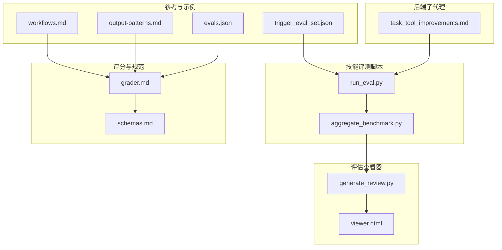
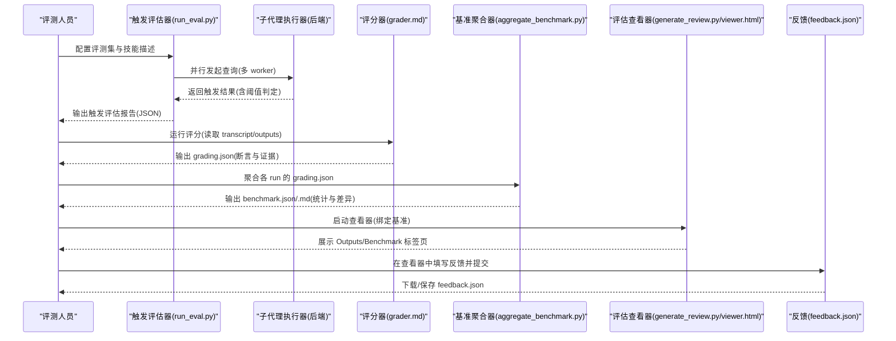
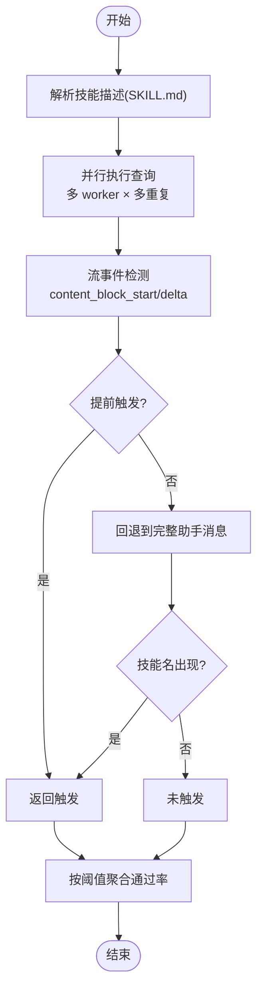
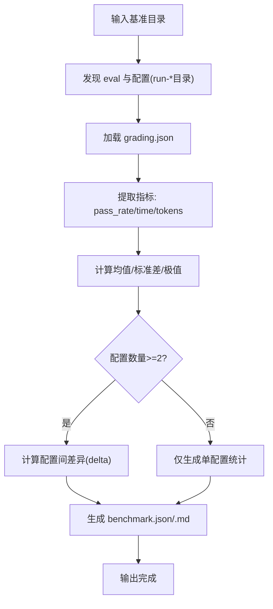
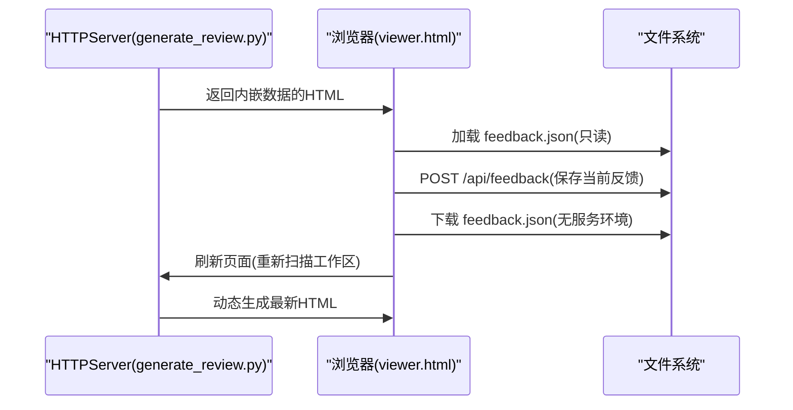
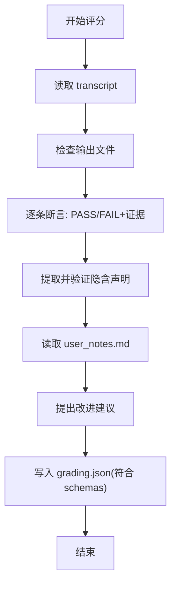
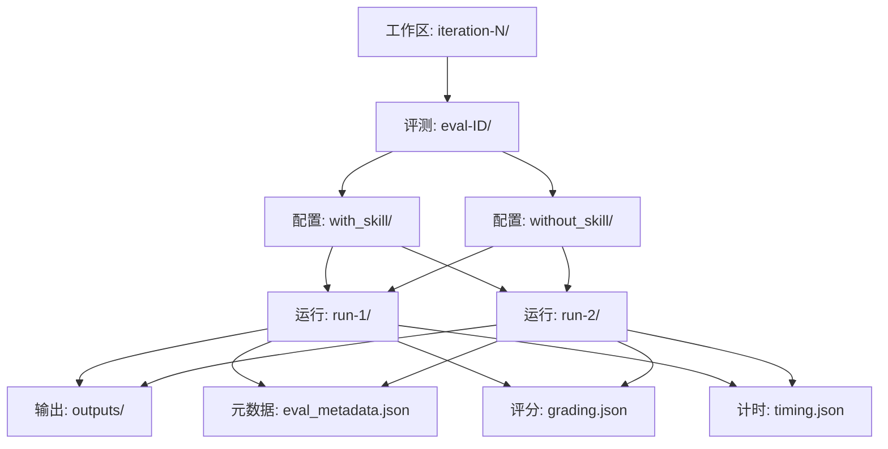
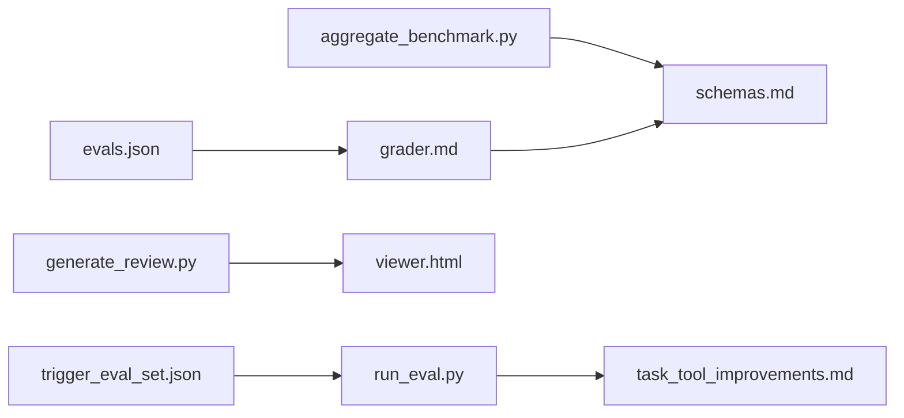

# 测试与评估

<cite>
**本文引用的文件**
- [run_eval.py](file://skills/public/skill-creator/scripts/run_eval.py)
- [aggregate_benchmark.py](file://skills/public/skill-creator/scripts/aggregate_benchmark.py)
- [generate_review.py](file://skills/public/skill-creator/eval-viewer/generate_review.py)
- [viewer.html](file://skills/public/skill-creator/eval-viewer/viewer.html)
- [grader.md](file://skills/public/skill-creator/agents/grader.md)
- [schemas.md](file://skills/public/skill-creator/references/schemas.md)
- [SKILL.md](file://skills/public/skill-creator/SKILL.md)
- [evals.json](file://skills/public/systematic-literature-review/evals/evals.json)
- [trigger_eval_set.json](file://skills/public/systematic-literature-review/evals/trigger_eval_set.json)
- [task_tool_improvements.md](file://backend/docs/task_tool_improvements.md)
- [workflows.md](file://skills/public/skill-creator/references/workflows.md)
- [output-patterns.md](file://skills/public/skill-creator/references/output-patterns.md)
</cite>

## 目录
1. [引言](#引言)
2. [项目结构](#项目结构)
3. [核心组件](#核心组件)
4. [架构总览](#架构总览)
5. [详细组件分析](#详细组件分析)
6. [依赖分析](#依赖分析)
7. [性能考虑](#性能考虑)
8. [故障排查指南](#故障排查指南)
9. [结论](#结论)
10. [附录](#附录)

## 引言
本指南面向 DeerFlow 技能开发的“测试与评估”阶段，系统讲解如何并行运行带技能与基线版本的测试、在同一轮次中启动子代理（subagent）的策略、测试结果的组织结构、量化断言设计与实现、基准聚合与分析、以及评估查看器的使用与用户反馈收集流程。目标是帮助评测人员与技能作者建立标准化、可复现且可量化的评估闭环。

## 项目结构
与测试评估直接相关的核心路径如下：
- 评测执行与触发评估：skills/public/skill-creator/scripts/run_eval.py
- 基准聚合与统计：skills/public/skill-creator/scripts/aggregate_benchmark.py
- 评估查看器与反馈：skills/public/skill-creator/eval-viewer/generate_review.py、viewer.html
- 评分与断言规范：skills/public/skill-creator/agents/grader.md、references/schemas.md
- 工作流与输出模式参考：skills/public/skill-creator/references/workflows.md、output-patterns.md
- 示例评测集与触发集：skills/public/systematic-literature-review/evals/evals.json、trigger_eval_set.json
- 子代理执行与超时机制：backend/docs/task_tool_improvements.md

图表来源
- [run_eval.py:1-311](file://skills/public/skill-creator/scripts/run_eval.py#L1-L311)
- [aggregate_benchmark.py:1-402](file://skills/public/skill-creator/scripts/aggregate_benchmark.py#L1-L402)
- [generate_review.py:1-472](file://skills/public/skill-creator/eval-viewer/generate_review.py#L1-L472)
- [viewer.html:589-1325](file://skills/public/skill-creator/eval-viewer/viewer.html#L589-L1325)
- [grader.md:1-184](file://skills/public/skill-creator/agents/grader.md#L1-L184)
- [schemas.md:86-150](file://skills/public/skill-creator/references/schemas.md#L86-L150)
- [workflows.md:1-28](file://skills/public/skill-creator/references/workflows.md#L1-L28)
- [output-patterns.md:1-83](file://skills/public/skill-creator/references/output-patterns.md#L1-L83)
- [evals.json:1-80](file://skills/public/systematic-literature-review/evals/evals.json#L1-L80)
- [trigger_eval_set.json:1-103](file://skills/public/systematic-literature-review/evals/trigger_eval_set.json#L1-L103)
- [task_tool_improvements.md:58-165](file://backend/docs/task_tool_improvements.md#L58-L165)

章节来源
- [SKILL.md:180-379](file://skills/public/skill-creator/SKILL.md#L180-L379)

## 核心组件
- 触发评估执行器：并行运行查询以判断技能描述是否正确触发，支持多 worker、超时控制与多次重复运行取阈值。
- 基准聚合器：从各 run 的 grading.json 聚合 pass 率、耗时、token 等指标，计算均值/标准差与配置间差异。
- 评估查看器：自动生成包含所有输出与评分的静态 HTML 页面，支持前后台对比、基准统计、键盘导航与反馈导出。
- 评分与断言：基于 grader.md 的评分流程与 schemas.md 的字段规范，确保断言可客观验证、证据可溯源。
- 参考与示例：workflows.md 与 output-patterns.md 提供工作流与输出结构建议；systematic-literature-review 的 evals.json 与 trigger_eval_set.json 展示了断言与触发集的实际样例。

章节来源
- [run_eval.py:184-256](file://skills/public/skill-creator/scripts/run_eval.py#L184-L256)
- [aggregate_benchmark.py:67-173](file://skills/public/skill-creator/scripts/aggregate_benchmark.py#L67-L173)
- [generate_review.py:60-146](file://skills/public/skill-creator/eval-viewer/generate_review.py#L60-L146)
- [grader.md:1-184](file://skills/public/skill-creator/agents/grader.md#L1-L184)
- [schemas.md:86-150](file://skills/public/skill-creator/references/schemas.md#L86-L150)
- [evals.json:1-80](file://skills/public/systematic-literature-review/evals/evals.json#L1-L80)
- [trigger_eval_set.json:1-103](file://skills/public/systematic-literature-review/evals/trigger_eval_set.json#L1-L103)

## 架构总览
下图展示从评测执行到结果呈现的整体流程，包括并行触发评估、子代理执行、评分与聚合、以及查看器与反馈闭环。

图表来源
- [run_eval.py:184-256](file://skills/public/skill-creator/scripts/run_eval.py#L184-L256)
- [aggregate_benchmark.py:227-278](file://skills/public/skill-creator/scripts/aggregate_benchmark.py#L227-L278)
- [generate_review.py:387-472](file://skills/public/skill-creator/eval-viewer/generate_review.py#L387-L472)
- [viewer.html:589-1325](file://skills/public/skill-creator/eval-viewer/viewer.html#L589-L1325)
- [grader.md:1-184](file://skills/public/skill-creator/agents/grader.md#L1-L184)

## 详细组件分析

### 组件A：触发评估执行器（run_eval.py）
- 并行策略：使用进程池并发执行多个查询，每个查询可重复 runs-per-query 次，最终按阈值计算通过率并判定。
- 触发检测：优先解析流事件中的工具调用片段，若在部分消息中识别到技能名称则提前判定触发；否则回退至完整助手消息。
- 超时与清理：为每个子进程设置超时，异常或超时统一记录为失败并清理命令文件。
- 输出格式：输出包含每条查询的触发率、期望触发方向与通过状态，以及汇总统计。

图表来源
- [run_eval.py:35-182](file://skills/public/skill-creator/scripts/run_eval.py#L35-L182)
- [run_eval.py:184-256](file://skills/public/skill-creator/scripts/run_eval.py#L184-L256)

章节来源
- [run_eval.py:1-311](file://skills/public/skill-creator/scripts/run_eval.py#L1-L311)

### 组件B：基准聚合器（aggregate_benchmark.py）
- 目录布局兼容：支持两种布局（直接 eval 目录或嵌套 runs/eval 目录），自动发现配置与 run。
- 指标提取：从 grading.json 中读取 pass_rate、计数与统计信息，同时尝试读取 timing.json 或 grading.json 中的执行时间与 token 数。
- 统计计算：计算每项指标的均值、标准差、最小/最大，并计算两个配置间的差异。
- 输出产物：生成 benchmark.json 与 benchmark.md，包含元数据、runs 列表与 run_summary。

图表来源
- [aggregate_benchmark.py:67-173](file://skills/public/skill-creator/scripts/aggregate_benchmark.py#L67-L173)
- [aggregate_benchmark.py:176-224](file://skills/public/skill-creator/scripts/aggregate_benchmark.py#L176-L224)
- [aggregate_benchmark.py:227-278](file://skills/public/skill-creator/scripts/aggregate_benchmark.py#L227-L278)

章节来源
- [aggregate_benchmark.py:1-402](file://skills/public/skill-creator/scripts/aggregate_benchmark.py#L1-L402)

### 组件C：评估查看器与反馈（generate_review.py/viewer.html）
- 数据发现：递归扫描工作区，定位包含 outputs/ 的 run 目录，构建 runs 列表。
- 内容嵌入：将输出文件（文本/图片/PDF/XLSX 等）内联或以 data URI 嵌入，便于离线查看。
- 前后对比：支持传入上一轮工作区，显示历史输出与反馈作为对照。
- 基准集成：可加载 benchmark.json，在“基准”标签页展示配置对比、平均通过率、耗时与 token 使用。
- 反馈机制：前端自动保存反馈至 feedback.json，支持“提交全部”，并在无服务环境下载本地文件。

图表来源
- [generate_review.py:308-385](file://skills/public/skill-creator/eval-viewer/generate_review.py#L308-L385)
- [viewer.html:589-1126](file://skills/public/skill-creator/eval-viewer/viewer.html#L589-L1126)

章节来源
- [generate_review.py:1-472](file://skills/public/skill-creator/eval-viewer/generate_review.py#L1-L472)
- [viewer.html:589-1325](file://skills/public/skill-creator/eval-viewer/viewer.html#L589-L1325)

### 组件D：评分与断言（grader.md + schemas.md）
- 评分流程：先读 transcript，再检查输出文件，逐条断言给出 PASS/FAIL 与证据；提取并验证隐含声明；审阅用户笔记；提出改进建议。
- 字段规范：grading.json 必须包含 expectations、summary、execution_metrics、timing、claims、user_notes_summary、eval_feedback 等字段，viewer 严格依赖这些键名。
- 主观与客观：强调断言应“可客观验证、描述清晰”，避免将需要人类判断的主观质量纳入量化断言。

图表来源
- [grader.md:19-100](file://skills/public/skill-creator/agents/grader.md#L19-L100)
- [schemas.md:86-150](file://skills/public/skill-creator/references/schemas.md#L86-L150)

章节来源
- [grader.md:1-184](file://skills/public/skill-creator/agents/grader.md#L1-L184)
- [schemas.md:86-150](file://skills/public/skill-creator/references/schemas.md#L86-L150)

### 组件E：测试结果组织结构（工作区/迭代/评测/运行）
- 工作区目录：iteration-N/
- 迭代目录：eval-ID/
- 配置目录：with_skill/、without_skill/、old_skill/（改进时）
- 运行目录：run-1/、run-2/ …
- 输出与元数据：outputs/、eval_metadata.json、grading.json、timing.json、transcript.md、user_notes.md

图表来源
- [SKILL.md:180-187](file://skills/public/skill-creator/SKILL.md#L180-L187)

章节来源
- [SKILL.md:180-280](file://skills/public/skill-creator/SKILL.md#L180-L280)

### 组件F：量化断言设计与实现
- 设计原则：断言应“可客观验证、描述清晰”，能在查看器中一目了然；避免将主观质量纳入量化断言。
- 实施步骤：在 eval_metadata.json 中编写断言，评审后固化到 evals/evals.json；评分时依据断言逐条验证并提供证据。
- 示例参考：systematic-literature-review 的 evals.json 展示了覆盖“是否触发”“是否调用特定脚本”“是否使用指定模板”“是否生成指定文件”等断言的范式。

章节来源
- [SKILL.md:199-205](file://skills/public/skill-creator/SKILL.md#L199-L205)
- [evals.json:1-80](file://skills/public/systematic-literature-review/evals/evals.json#L1-L80)

### 组件G：基准聚合与分析
- 聚合脚本：aggregate_benchmark.py 支持两种目录布局，自动发现配置与 run，提取 pass_rate、time_seconds、tokens 等指标并计算均值/标准差与 delta。
- 报告生成：输出 benchmark.json 与 benchmark.md，包含元数据、runs 列表与 run_summary。
- 分析要点：关注非判别性断言（总是通过）、高方差评测（可能不稳定）、时间/token 交易（是否更高效）等。

章节来源
- [aggregate_benchmark.py:1-402](file://skills/public/skill-creator/scripts/aggregate_benchmark.py#L1-L402)

### 组件H：评估查看器使用与用户反馈
- 启动方式：generate_review.py 支持本地服务器与静态文件两种模式；迭代 2+ 可传入 previous-workspace 对比历史。
- 用户界面：Outputs 标签逐条展示 prompt、输出、历史输出与正式评分；Benchmark 标签展示统计摘要与断言明细。
- 反馈流程：前端自动保存，支持“提交全部”；无服务环境会下载 feedback.json，后续迭代可读取该文件。

章节来源
- [generate_review.py:387-472](file://skills/public/skill-creator/eval-viewer/generate_review.py#L387-L472)
- [viewer.html:589-1325](file://skills/public/skill-creator/eval-viewer/viewer.html#L589-L1325)
- [SKILL.md:236-280](file://skills/public/skill-creator/SKILL.md#L236-L280)

## 依赖分析
- 触发评估依赖子代理执行能力与后端任务工具的稳定性与超时保护。
- 基准聚合依赖 grading.json 的一致性与完整性。
- 评估查看器依赖 viewer.html 的前端模板与 generate_review.py 的数据注入。
- 断言与评分依赖 grader.md 的流程与 schemas.md 的字段规范。

图表来源
- [run_eval.py:1-311](file://skills/public/skill-creator/scripts/run_eval.py#L1-L311)
- [aggregate_benchmark.py:1-402](file://skills/public/skill-creator/scripts/aggregate_benchmark.py#L1-L402)
- [generate_review.py:1-472](file://skills/public/skill-creator/eval-viewer/generate_review.py#L1-L472)
- [viewer.html:589-1325](file://skills/public/skill-creator/eval-viewer/viewer.html#L589-L1325)
- [grader.md:1-184](file://skills/public/skill-creator/agents/grader.md#L1-L184)
- [schemas.md:86-150](file://skills/public/skill-creator/references/schemas.md#L86-L150)
- [evals.json:1-80](file://skills/public/systematic-literature-review/evals/evals.json#L1-L80)
- [trigger_eval_set.json:1-103](file://skills/public/systematic-literature-review/evals/trigger_eval_set.json#L1-L103)

章节来源
- [task_tool_improvements.md:58-165](file://backend/docs/task_tool_improvements.md#L58-L165)

## 性能考虑
- 并行度与资源：合理设置 num-workers 与 runs-per-query，避免过度并发导致资源争用；注意子代理执行与轮询的超时保护。
- I/O 与存储：输出文件较多时，尽量采用内联渲染与 data URI，减少外部依赖；必要时使用静态模式导出独立 HTML。
- 计时准确性：确保在任务通知到达时立即记录 timing.json，避免遗漏关键指标。

## 故障排查指南
- 触发评估未通过：检查技能描述 frontmatter 是否正确、命令文件是否成功写入、流事件解析是否命中技能名、是否超过超时。
- 基准聚合缺失指标：确认 grading.json 是否存在、字段是否符合 schemas.md、timing.json 是否可读。
- 查看器空白或报错：确认 runs 目录结构是否符合预期、viewer.html 是否被正确注入数据、端口是否被占用。
- 反馈无法保存：检查 /api/feedback 接口是否可达，无服务环境需手动下载 feedback.json 并在下一次迭代前放入工作区。

章节来源
- [run_eval.py:184-256](file://skills/public/skill-creator/scripts/run_eval.py#L184-L256)
- [aggregate_benchmark.py:120-173](file://skills/public/skill-creator/scripts/aggregate_benchmark.py#L120-L173)
- [generate_review.py:308-385](file://skills/public/skill-creator/eval-viewer/generate_review.py#L308-L385)
- [viewer.html:589-1126](file://skills/public/skill-creator/eval-viewer/viewer.html#L589-L1126)

## 结论
通过并行触发评估、标准化的评分与断言、严谨的基准聚合与查看器反馈闭环，DeerFlow 技能开发可以形成一套可复现、可量化的测试评估体系。建议在每次迭代中坚持：先并行评测、再评分断言、后聚合分析、最后用户评审与反馈，持续优化技能质量与用户体验。

## 附录
- 参考与示例：workflows.md 与 output-patterns.md 提供工作流与输出结构建议；systematic-literature-review 的 evals.json 与 trigger_eval_set.json 展示了断言与触发集的实际样例，可直接用于新技能的评测设计。

章节来源
- [workflows.md:1-28](file://skills/public/skill-creator/references/workflows.md#L1-L28)
- [output-patterns.md:1-83](file://skills/public/skill-creator/references/output-patterns.md#L1-L83)
- [evals.json:1-80](file://skills/public/systematic-literature-review/evals/evals.json#L1-L80)
- [trigger_eval_set.json:1-103](file://skills/public/systematic-literature-review/evals/trigger_eval_set.json#L1-L103)