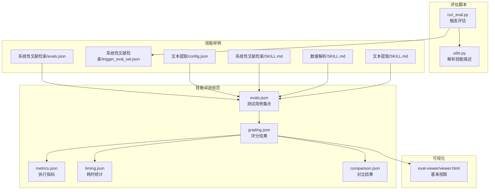
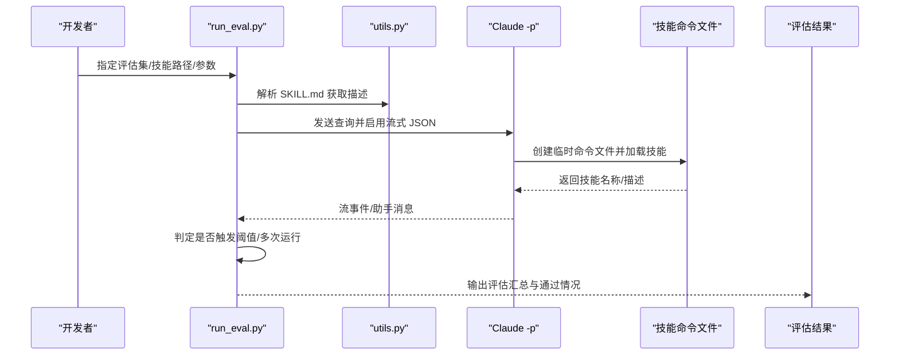
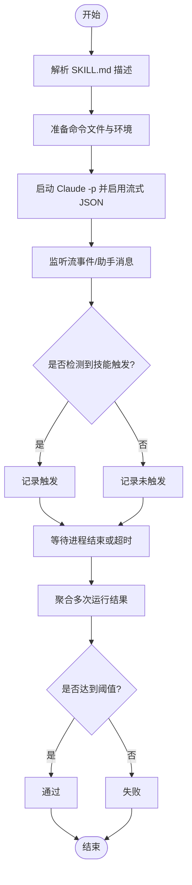
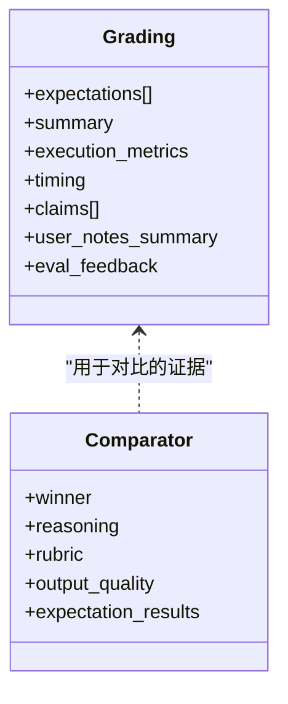
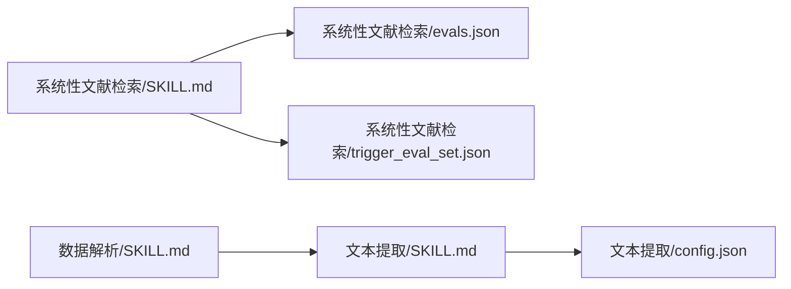
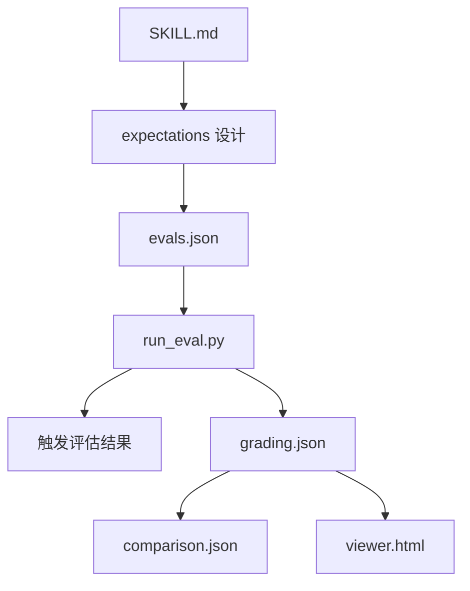

# 测试用例开发

<cite>
**本文引用的文件**
- [evals.json](file://skills/public/skill-creator/references/schemas.md)
- [grading.json](file://skills/public/skill-creator/references/schemas.md)
- [metrics.json](file://skills/public/skill-creator/references/schemas.md)
- [timing.json](file://skills/public/skill-creator/references/schemas.md)
- [comparison.json](file://skills/public/skill-creator/references/schemas.md)
- [grader.md](file://skills/public/skill-creator/agents/grader.md)
- [comparator.md](file://skills/public/skill-creator/agents/comparator.md)
- [run_eval.py](file://skills/public/skill-creator/scripts/run_eval.py)
- [utils.py](file://skills/public/skill-creator/scripts/utils.py)
- [evals.json（系统性文献检索）](file://skills/public/systematic-literature-review/evals/evals.json)
- [trigger_eval_set.json（系统性文献检索触发集）](file://skills/public/systematic-literature-review/evals/trigger_eval_set.json)
- [config.json（文本提取）](file://skills/public/text-extraction/config.json)
- [SKILL.md（系统性文献检索）](file://skills/public/systematic-literature-review/SKILL.md)
- [SKILL.md（数据解析）](file://skills/public/data-analysis/SKILL.md)
- [SKILL.md（文本提取）](file://skills/public/text-extraction/SKILL.md)
- [viewer.html（基准视图）](file://skills/public/skill-creator/eval-viewer/viewer.html)
</cite>

## 目录
1. [引言](#引言)
2. [项目结构](#项目结构)
3. [核心组件](#核心组件)
4. [架构总览](#架构总览)
5. [详细组件分析](#详细组件分析)
6. [依赖关系分析](#依赖关系分析)
7. [性能考量](#性能考量)
8. [故障排查指南](#故障排查指南)
9. [结论](#结论)
10. [附录](#附录)

## 引言
本指南面向 DeerFlow 技能开发中的“测试用例开发”阶段，目标是帮助开发者高效设计与评审高质量的测试用例，确保技能在真实用户场景下稳定、可验证地交付预期结果。文档将结合仓库中现有的 JSON 测试规范、触发评估脚本、评分与比较机制，以及多个技能的评测样例，给出可操作的设计策略、评审方法与最佳实践。

## 项目结构
围绕测试用例开发，仓库中与之直接相关的关键目录与文件包括：
- skill-creator 的参考规范与脚本：定义了 evals.json 的结构、评分与比较流程、触发评估脚本等
- 具体技能的评测样例：如系统性文献检索技能的 evals.json 与触发集
- 技能描述文件：SKILL.md 中的输出格式、工作流与约束，直接影响测试用例的期望与验证点
- 基准视图：用于可视化展示评测结果

**图表来源**
- [evals.json](file://skills/public/skill-creator/references/schemas.md)
- [grading.json](file://skills/public/skill-creator/references/schemas.md)
- [metrics.json](file://skills/public/skill-creator/references/schemas.md)
- [timing.json](file://skills/public/skill-creator/references/schemas.md)
- [comparison.json](file://skills/public/skill-creator/references/schemas.md)
- [run_eval.py](file://skills/public/skill-creator/scripts/run_eval.py)
- [utils.py](file://skills/public/skill-creator/scripts/utils.py)
- [evals.json（系统性文献检索）](file://skills/public/systematic-literature-review/evals/evals.json)
- [trigger_eval_set.json（系统性文献检索触发集）](file://skills/public/systematic-literature-review/evals/trigger_eval_set.json)
- [config.json（文本提取）](file://skills/public/text-extraction/config.json)
- [SKILL.md（系统性文献检索）](file://skills/public/systematic-literature-review/SKILL.md)
- [SKILL.md（数据解析）](file://skills/public/data-analysis/SKILL.md)
- [SKILL.md（文本提取）](file://skills/public/text-extraction/SKILL.md)
- [viewer.html（基准视图）](file://skills/public/skill-creator/eval-viewer/viewer.html)

**章节来源**
- [evals.json](file://skills/public/skill-creator/references/schemas.md)
- [run_eval.py](file://skills/public/skill-creator/scripts/run_eval.py)
- [utils.py](file://skills/public/skill-creator/scripts/utils.py)
- [evals.json（系统性文献检索）](file://skills/public/systematic-literature-review/evals/evals.json)
- [trigger_eval_set.json（系统性文献检索触发集）](file://skills/public/systematic-literature-review/evals/trigger_eval_set.json)
- [config.json（文本提取）](file://skills/public/text-extraction/config.json)
- [SKILL.md（系统性文献检索）](file://skills/public/systematic-literature-review/SKILL.md)
- [SKILL.md（数据解析）](file://skills/public/data-analysis/SKILL.md)
- [SKILL.md（文本提取）](file://skills/public/text-extraction/SKILL.md)
- [viewer.html（基准视图）](file://skills/public/skill-creator/eval-viewer/viewer.html)

## 核心组件
- 测试用例 JSON 结构（evals.json）
  - 字段说明
    - skill_name：技能名称，与技能前端元数据一致
    - evals[]：测试用例数组
      - id：唯一整数标识
      - prompt：用户任务提示
      - expected_output：人类可理解的成功描述
      - files：可选，相对技能根目录的输入文件路径列表
      - expectations：可验证断言清单
  - 设计要点
    - 用例应覆盖典型、边界与异常场景
    - expectations 应尽量量化、可客观验证
    - files 可用于带输入数据的端到端验证
- 触发评估（Trigger Evaluation）
  - 通过 run_eval.py 对一组查询进行评估，判断技能描述是否正确触发
  - 支持并发、超时控制、阈值判定与多次运行统计
- 评分与比较
  - grading.json：包含 expectations、summary、execution_metrics、timing、claims、user_notes_summary、eval_feedback 等
  - comparison.json：用于盲评对比，给出优胜者与评分维度
- 基准视图
  - viewer.html 展示 pass rate、时间、错误等统计，支持分组与平均行

**章节来源**
- [evals.json](file://skills/public/skill-creator/references/schemas.md)
- [run_eval.py](file://skills/public/skill-creator/scripts/run_eval.py)
- [grader.md](file://skills/public/skill-creator/agents/grader.md)
- [comparator.md](file://skills/public/skill-creator/agents/comparator.md)
- [grading.json](file://skills/public/skill-creator/references/schemas.md)
- [comparison.json](file://skills/public/skill-creator/references/schemas.md)
- [viewer.html（基准视图）](file://skills/public/skill-creator/eval-viewer/viewer.html)

## 架构总览
下面以“触发评估”为例，展示从查询到结果的端到端流程：

**图表来源**
- [run_eval.py](file://skills/public/skill-creator/scripts/run_eval.py)
- [utils.py](file://skills/public/skill-creator/scripts/utils.py)

**章节来源**
- [run_eval.py](file://skills/public/skill-creator/scripts/run_eval.py)
- [utils.py](file://skills/public/skill-creator/scripts/utils.py)

## 详细组件分析

### 组件一：测试用例 JSON 结构与字段语义
- 字段详解
  - skill_name：与技能前端元数据一致，用于关联与报告
  - evals[].id：便于追踪与定位，建议按场景编号
  - evals[].prompt：贴近真实用户的自然语言表述
  - evals[].expected_output：清晰描述“成功”的人类可理解结果
  - evals[].files：当技能需要输入文件时，提供相对路径列表
  - evals[].expectations：断言清单，应可客观验证，避免主观描述
- 设计策略
  - 代表性场景：覆盖“正常流程”“边界条件”“异常输入”
  - 复杂度平衡：先从简单场景入手，逐步增加分支与并发
  - 主观性处理：对主观质量（如风格、美观）采用定性评价，不强加量化断言
- 与技能输出格式的关系
  - 若技能输出为结构化 JSON，断言可检查字段存在性、类型与范围
  - 若为文件类输出，断言可检查文件存在、大小、内容片段等
  - 若为多轮对话，断言可基于消息顺序、关键信息出现等

**章节来源**
- [evals.json](file://skills/public/skill-creator/references/schemas.md)
- [grader.md](file://skills/public/skill-creator/agents/grader.md)

### 组件二：触发评估（Trigger Evaluation）脚本
- 功能概述
  - 读取技能描述与评估集，模拟用户查询，检测技能是否被正确触发
  - 并发执行、超时控制、多次运行统计、阈值判定
- 关键流程
  - 解析 SKILL.md，生成临时命令文件，注入 Claude -p
  - 通过流事件与助手消息早期判定触发
  - 统计触发率并计算通过/失败
- 参数与行为
  - num_workers、timeout、runs-per-query、trigger-threshold 控制评估强度与稳定性
  - 支持指定模型，便于一致性评估

**图表来源**
- [run_eval.py](file://skills/public/skill-creator/scripts/run_eval.py)
- [utils.py](file://skills/public/skill-creator/scripts/utils.py)

**章节来源**
- [run_eval.py](file://skills/public/skill-creator/scripts/run_eval.py)
- [utils.py](file://skills/public/skill-creator/scripts/utils.py)

### 组件三：评分与比较（Grading & Comparator）
- 评分标准（Grading）
  - PASS：有明确证据支撑，且证据反映实质内容
  - FAIL：无证据、证据矛盾、不可验证、表面合规但实质错误
  - 不确定：由断言提出方承担举证责任
- 比较标准（Comparator）
  - 优先依据“内容+结构”综合评分，其次断言通过率，最后平局则标记 TIE
  - 针对不同任务类型（PDF/文档/数据输出）调整评分维度

**图表来源**
- [grading.json](file://skills/public/skill-creator/references/schemas.md)
- [comparison.json](file://skills/public/skill-creator/references/schemas.md)
- [grader.md](file://skills/public/skill-creator/agents/grader.md)
- [comparator.md](file://skills/public/skill-creator/agents/comparator.md)

**章节来源**
- [grading.json](file://skills/public/skill-creator/references/schemas.md)
- [comparison.json](file://skills/public/skill-creator/references/schemas.md)
- [grader.md](file://skills/public/skill-creator/agents/grader.md)
- [comparator.md](file://skills/public/skill-creator/agents/comparator.md)

### 组件四：基准视图（Benchmark Viewer）
- 展示内容
  - 分组显示 with_skill / without_skill 的运行结果
  - pass_rate、time_seconds、errors 等统计
  - 平均行与差异标注
- 使用建议
  - 确保 benchmark.json 字段命名与 viewer 一致（如 configuration 而非 config）

**章节来源**
- [viewer.html（基准视图）](file://skills/public/skill-creator/eval-viewer/viewer.html)

### 组件五：真实技能样例与评测模式
- 系统性文献检索（SLR）
  - evals.json：包含多个 eval，涵盖不同论文数量、格式与路由判断
  - trigger_eval_set.json：用于评估技能描述是否正确触发/不触发
  - SKILL.md：明确工作流、工具调用、输出格式与注意事项
- 文本提取（Text Extraction）
  - config.json：定义 21 个维度的抽取规则、返回格式与校验逻辑
  - SKILL.md：定义输入/输出 JSON 结构与后处理流程
- 数据分析（Data Analysis）
  - SKILL.md：定义文件结构检查、SQL 查询、导出与缓存机制

**图表来源**
- [SKILL.md（系统性文献检索）](file://skills/public/systematic-literature-review/SKILL.md)
- [evals.json（系统性文献检索）](file://skills/public/systematic-literature-review/evals/evals.json)
- [trigger_eval_set.json（系统性文献检索触发集）](file://skills/public/systematic-literature-review/evals/trigger_eval_set.json)
- [SKILL.md（文本提取）](file://skills/public/text-extraction/SKILL.md)
- [config.json（文本提取）](file://skills/public/text-extraction/config.json)
- [SKILL.md（数据解析）](file://skills/public/data-analysis/SKILL.md)

**章节来源**
- [SKILL.md（系统性文献检索）](file://skills/public/systematic-literature-review/SKILL.md)
- [evals.json（系统性文献检索）](file://skills/public/systematic-literature-review/evals/evals.json)
- [trigger_eval_set.json（系统性文献检索触发集）](file://skills/public/systematic-literature-review/evals/trigger_eval_set.json)
- [SKILL.md（文本提取）](file://skills/public/text-extraction/SKILL.md)
- [config.json（文本提取）](file://skills/public/text-extraction/config.json)
- [SKILL.md（数据解析）](file://skills/public/data-analysis/SKILL.md)

## 依赖关系分析
- 测试用例依赖于技能描述与工作流
  - SKILL.md 明确输出格式、工具调用与约束，直接影响 expectations 的设计
- 评分与比较依赖于执行产物
  - grading.json 提供断言证据与指标，comparison.json 提供对比维度
- 视图依赖于基准结果
  - viewer.html 读取 benchmark.json 的字段结构，要求严格一致

**图表来源**
- [SKILL.md（系统性文献检索）](file://skills/public/systematic-literature-review/SKILL.md)
- [evals.json](file://skills/public/skill-creator/references/schemas.md)
- [run_eval.py](file://skills/public/skill-creator/scripts/run_eval.py)
- [grading.json](file://skills/public/skill-creator/references/schemas.md)
- [comparison.json](file://skills/public/skill-creator/references/schemas.md)
- [viewer.html（基准视图）](file://skills/public/skill-creator/eval-viewer/viewer.html)

**章节来源**
- [SKILL.md（系统性文献检索）](file://skills/public/systematic-literature-review/SKILL.md)
- [evals.json](file://skills/public/skill-creator/references/schemas.md)
- [run_eval.py](file://skills/public/skill-creator/scripts/run_eval.py)
- [grading.json](file://skills/public/skill-creator/references/schemas.md)
- [comparison.json](file://skills/public/skill-creator/references/schemas.md)
- [viewer.html（基准视图）](file://skills/public/skill-creator/eval-viewer/viewer.html)

## 性能考量
- 触发评估
  - 合理设置 num_workers 与 runs-per-query，在稳定性与速度间权衡
  - 使用流式 JSON 与早期判定减少等待时间
- 执行与评分
  - metrics.json 与 timing.json 提供资源消耗与耗时信息，便于优化
  - 在大规模并发场景下，注意外部服务（如 arXiv）的速率限制与重试策略

[本节为通用指导，无需特定文件引用]

## 故障排查指南
- 触发评估失败
  - 检查技能描述是否准确、清晰，必要时调整 phrasing
  - 调整 trigger-threshold 或 runs-per-query 提升鲁棒性
- 评分争议
  - 依据 grader.md 的 PASS/FAIL 标准逐条核查证据
  - 对不确定项，要求提供更多上下文或补充断言
- 视图显示异常
  - 确认 benchmark.json 的字段命名与 viewer.html 一致（如 configuration）

**章节来源**
- [grader.md](file://skills/public/skill-creator/agents/grader.md)
- [viewer.html（基准视图）](file://skills/public/skill-creator/eval-viewer/viewer.html)

## 结论
通过规范化的测试用例设计、严谨的触发评估与评分比较流程，以及可视化的基准视图，可以系统性提升 DeerFlow 技能的质量与稳定性。建议在开发初期即建立完善的评测体系，并持续迭代 expectations 与断言，确保技能在真实场景中可靠交付。

[本节为总结性内容，无需特定文件引用]

## 附录

### 实际测试用例设计策略
- 代表性场景
  - 正常流程：覆盖技能主路径
  - 边界条件：输入为空、数量上限、格式不符
  - 异常输入：网络失败、权限不足、文件损坏
- 复杂度平衡
  - 从单轮、单文件起步，逐步引入并发、多文件与跨工具链路
- 主观性处理
  - 对风格、排版等主观质量采用定性评价，避免强行量化

### 测试用例 JSON 示例字段说明
- id：唯一标识，便于追踪
- prompt：贴近用户自然语言
- expected_output：成功的人类可理解描述
- files：输入文件相对路径（可选）
- expectations：可验证断言清单

**章节来源**
- [evals.json](file://skills/public/skill-creator/references/schemas.md)