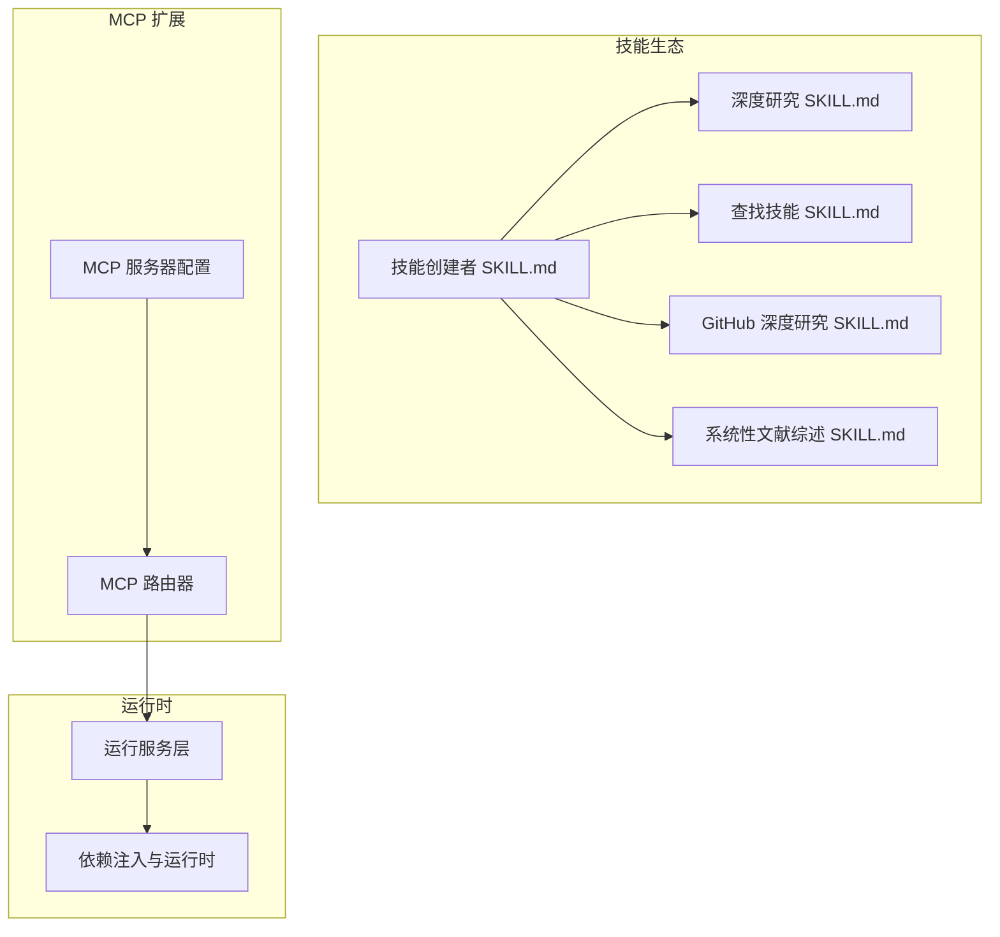
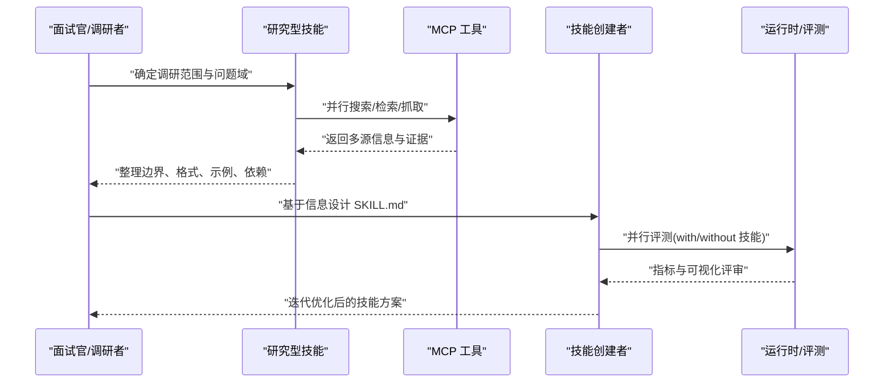
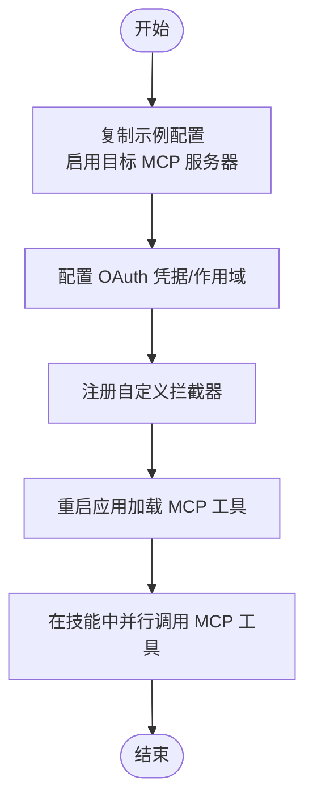
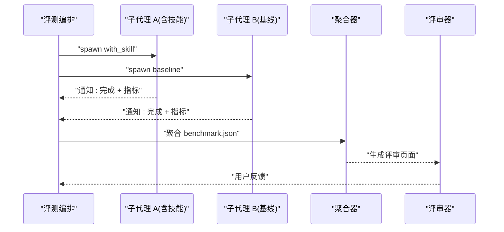
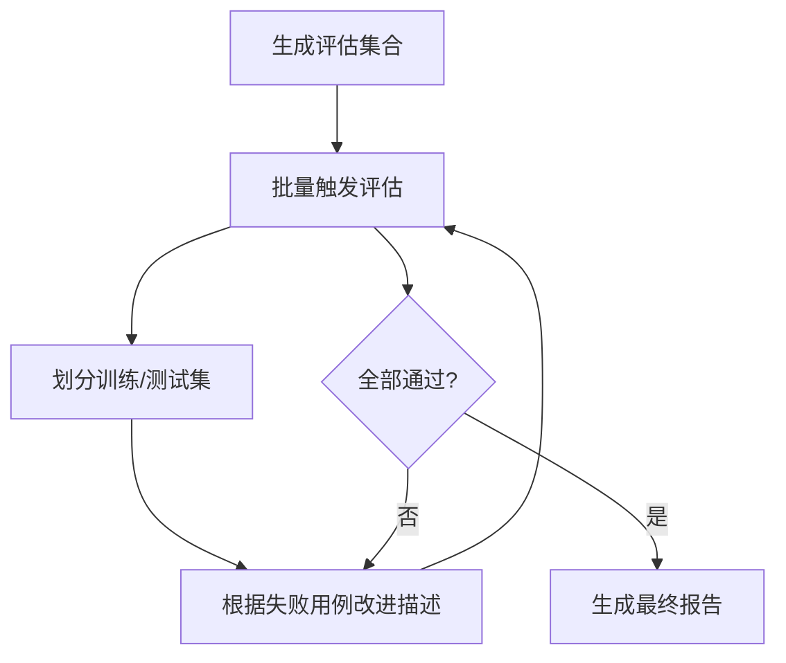
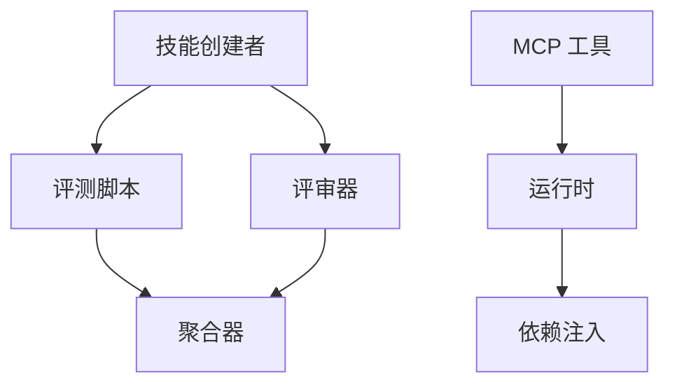

# 面试调研

<cite>
**本文引用的文件**
- [MCP 服务器配置](file://backend/docs/MCP_SERVER.md)
- [MCP 路由器](file://backend/app/gateway/routers/mcp.py)
- [运行服务层](file://backend/app/gateway/services.py)
- [技能创建者 SKILL.md](file://skills/public/skill-creator/SCILL.md)
- [深度研究 SKILL.md](file://skills/public/deep-research/SCILL.md)
- [查找技能 SKILL.md](file://skills/public/find-skills/SCILL.md)
- [GitHub 深度研究 SKILL.md](file://skills/public/github-deep-research/SCILL.md)
- [系统性文献综述 SKILL.md](file://skills/public/systematic-literature-review/SCILL.md)
- [技能初始化脚本](file://skills/public/skill-creator/scripts/init_skill.py)
- [触发评估脚本](file://skills/public/skill-creator/scripts/run_eval.py)
- [描述优化循环脚本](file://skills/public/skill-creator/scripts/run_loop.py)
- [盲比较代理](file://skills/public/skill-creator/agents/comparator.md)
- [后验分析代理](file://skills/public/skill-creator/agents/analyzer.md)
- [依赖注入与运行时](file://backend/app/gateway/deps.py)
</cite>

## 目录
1. [引言](#引言)
2. [项目结构](#项目结构)
3. [核心组件](#核心组件)
4. [架构总览](#架构总览)
5. [详细组件分析](#详细组件分析)
6. [依赖分析](#依赖分析)
7. [性能考虑](#性能考虑)
8. [故障排查指南](#故障排查指南)
9. [结论](#结论)
10. [附录](#附录)

## 引言
本指南面向 DeerFlow 技能开发的“面试调研”阶段，目标是帮助你在有限时间内高效收集关键信息，明确技能边界与实现路径。内容涵盖：
- 如何主动询问边缘情况、输入输出格式、示例文件、成功标准与依赖关系
- 如何利用 MCP 工具进行并行搜索、查找类似技能、查阅最佳实践
- 如何减少用户负担、准备上下文信息、处理复杂依赖关系
- 如何在早期阶段平衡调研深度与开发效率

## 项目结构
DeerFlow 将“技能”作为可插拔能力单元，结合 MCP 扩展机制与内置技能，形成“可发现、可并行、可评测”的研发闭环。

图示来源
- [MCP 服务器配置](file://backend/docs/MCP_SERVER.md)
- [MCP 路由器](file://backend/app/gateway/routers/mcp.py)
- [运行服务层](file://backend/app/gateway/services.py)
- [技能创建者 SKILL.md](file://skills/public/skill-creator/SCILL.md)
- [深度研究 SKILL.md](file://skills/public/deep-research/SCILL.md)
- [查找技能 SKILL.md](file://skills/public/find-skills/SCILL.md)
- [GitHub 深度研究 SKILL.md](file://skills/public/github-deep-research/SCILL.md)
- [系统性文献综述 SKILL.md](file://skills/public/systematic-literature-review/SCILL.md)

章节来源
- [MCP 服务器配置](file://backend/docs/MCP_SERVER.md)
- [MCP 路由器](file://backend/app/gateway/routers/mcp.py)
- [运行服务层](file://backend/app/gateway/services.py)

## 核心组件
- 技能元数据与触发机制
  - 技能通过 SKILL.md 前言定义 name/description，决定何时被触发与如何被调用
  - 触发评估脚本可量化“是否应触发”与“触发率”，用于优化描述
- MCP 工具链
  - 支持 HTTP/SSE/STDIO 传输，OAuth 认证，自定义拦截器
  - 运行时自动发现并注册 MCP 工具，无需额外代码改动
- 并行子代理与评测
  - 评测工作流支持并行执行、基线对比、指标采集与可视化评审
- 研究型技能
  - 深度研究、GitHub 深度研究、系统性文献综述等提供系统化研究范式

章节来源
- [技能创建者 SKILL.md](file://skills/public/skill-creator/SCILL.md)
- [MCP 服务器配置](file://backend/docs/MCP_SERVER.md)
- [MCP 路由器](file://backend/app/gateway/routers/mcp.py)
- [系统性文献综述 SKILL.md](file://skills/public/systematic-literature-review/SCILL.md)

## 架构总览
下图展示从“面试调研”到“技能落地”的端到端流程：先通过研究型技能与 MCP 工具收集信息，再用技能创建者进行结构化设计与评测，最后迭代优化。

图示来源
- [深度研究 SKILL.md](file://skills/public/deep-research/SCILL.md)
- [GitHub 深度研究 SKILL.md](file://skills/public/github-deep-research/SCILL.md)
- [系统性文献综述 SKILL.md](file://skills/public/systematic-literature-review/SCILL.md)
- [技能创建者 SKILL.md](file://skills/public/skill-creator/SCILL.md)
- [MCP 服务器配置](file://backend/docs/MCP_SERVER.md)

## 详细组件分析

### 组件一：面试调研清单与提问策略
- 明确“输入/输出”
  - 输入类型、字段、约束、默认值、必填项
  - 输出类型、结构、命名规范、版本控制
- 边界与异常
  - 空输入/空输出、超长/超限、非法字符、并发冲突
  - 失败重试、降级策略、幂等性
- 示例与验收
  - 正向样例、反向样例、边界样例
  - 成功标准（准确率、召回率、延迟、资源占用）
- 依赖与环境
  - 外部 API/数据库/文件系统/MCP 工具
  - 权限、配额、速率限制、鉴权方式
- 并行与一致性
  - 是否需要并行执行、结果合并策略
  - 事务/一致性模型、回滚与补偿

章节来源
- [技能创建者 SKILL.md](file://skills/public/skill-creator/SCILL.md)

### 组件二：利用 MCP 工具进行并行研究
- 启用与配置
  - 复制示例配置，启用所需 MCP 服务器，设置命令/参数/环境变量
  - HTTP/SSE 支持 OAuth 客户端凭据/刷新令牌，自动注入访问令牌
  - 注册自定义拦截器，统一注入请求头、日志与指标
- 运行时集成
  - MCP 服务器暴露的工具在运行时自动发现并注册
  - 无需修改业务代码即可使用新工具

图示来源
- [MCP 服务器配置](file://backend/docs/MCP_SERVER.md)
- [MCP 路由器](file://backend/app/gateway/routers/mcp.py)

章节来源
- [MCP 服务器配置](file://backend/docs/MCP_SERVER.md)
- [MCP 路由器](file://backend/app/gateway/routers/mcp.py)

### 组件三：并行子代理与评测流水线
- 流程概览
  - 同步启动 with-skill 与 baseline 子代理，统一完成时间窗口
  - 在评测过程中草拟断言与评审维度，降低等待成本
  - 捕获耗时与 token 使用，生成基准报告与可视化评审
- 关键要点
  - 评测目录结构：按迭代与用例分层组织
  - 基准聚合：均值±标准差、差异显著性
  - 可视化评审：输出对比与统计摘要

图示来源
- [技能创建者 SKILL.md](file://skills/public/skill-creator/SCILL.md)

章节来源
- [技能创建者 SKILL.md](file://skills/public/skill-creator/SCILL.md)

### 组件四：触发评估与描述优化
- 触发评估
  - 通过临时命令文件将技能描述注入可用技能列表
  - 使用流事件检测提前判断是否触发，缩短等待时间
  - 多轮运行统计触发率，计算通过/失败
- 描述优化循环
  - 划分训练/测试集，避免过拟合
  - 基于历史与失败用例改进描述，自动刷新 HTML 报告
  - 选择测试集最优描述作为最终版本

图示来源
- [触发评估脚本](file://skills/public/skill-creator/scripts/run_eval.py)
- [描述优化循环脚本](file://skills/public/skill-creator/scripts/run_loop.py)

章节来源
- [触发评估脚本](file://skills/public/skill-creator/scripts/run_eval.py)
- [描述优化循环脚本](file://skills/public/skill-creator/scripts/run_loop.py)

### 组件五：研究型技能的系统化方法
- 深度研究
  - 广度探索 → 深度挖掘 → 多源验证 → 合成检查
  - 查询策略、时间限定、内容类型多样化
- GitHub 深度研究
  - API → 发现 → 深入调查 → 深度挖掘 → 报告模板
  - 时间线、架构图、对比分析、置信度评分
- 系统性文献综述
  - 计划 → 搜索 arXiv → 并行抽取元数据 → 合成与格式化 → 保存与呈现
  - 并发限制、批次策略、模板驱动的报告结构

章节来源
- [深度研究 SKILL.md](file://skills/public/deep-research/SCILL.md)
- [GitHub 深度研究 SKILL.md](file://skills/public/github-deep-research/SCILL.md)
- [系统性文献综述 SKILL.md](file://skills/public/systematic-literature-review/SCILL.md)

### 组件六：上下文准备与依赖管理
- 减少用户负担
  - 在 SKILL.md 中明确“何时触发”“做什么”“期望输出”
  - 提供示例与参考文件，降低沟通成本
- 上下文注入
  - 运行时将认证用户、线程上下文、配置等注入工具执行环境
  - 通过拦截器统一注入 MCP 请求头或指标

章节来源
- [技能创建者 SKILL.md](file://skills/public/skill-creator/SCILL.md)
- [运行服务层](file://backend/app/gateway/services.py)
- [MCP 服务器配置](file://backend/docs/MCP_SERVER.md)

## 依赖分析
- 组件耦合
  - 技能创建者依赖评测脚本与可视化工具，形成闭环
  - MCP 工具通过路由器集中暴露，运行时自动发现
- 外部依赖
  - OAuth 令牌管理、外部 API 速率限制、MCP 服务器可用性
- 潜在风险
  - MCP 工具不可用导致评测中断
  - 评测并发过高引发资源争用

图示来源
- [技能创建者 SKILL.md](file://skills/public/skill-creator/SCILL.md)
- [MCP 路由器](file://backend/app/gateway/routers/mcp.py)
- [运行服务层](file://backend/app/gateway/services.py)

章节来源
- [技能创建者 SKILL.md](file://skills/public/skill-creator/SCILL.md)
- [MCP 路由器](file://backend/app/gateway/routers/mcp.py)
- [运行服务层](file://backend/app/gateway/services.py)

## 性能考虑
- 并行优先：在评测与研究阶段尽量并行，缩短总耗时
- 资源隔离：子代理并发受控，避免过度竞争
- 缓存与复用：MCP 工具与评测结果可复用，减少重复开销
- 观测性：通过拦截器与指标埋点，持续监控性能瓶颈

## 故障排查指南
- MCP 工具未生效
  - 检查配置文件是否正确写入，确认服务器已重启
  - 校验 OAuth 凭据与作用域，确保令牌可刷新
- 评测卡住或失败
  - 查看子代理并发上限与任务队列
  - 检查网络与外部 API 限流状态
- 触发评估不准确
  - 调整评估集合覆盖更多边界用例
  - 提高运行轮次与阈值，避免误判

章节来源
- [MCP 服务器配置](file://backend/docs/MCP_SERVER.md)
- [MCP 路由器](file://backend/app/gateway/routers/mcp.py)
- [系统性文献综述 SKILL.md](file://skills/public/systematic-literature-review/SCILL.md)

## 结论
在 DeerFlow 的技能开发中，“面试调研”阶段的核心在于：用系统化方法收集信息、用 MCP 工具并行扩展能力、用评测闭环验证假设。通过 SKILL.md 的结构化设计、触发评估与描述优化、以及研究型技能的范式，可以在早期阶段快速收敛边界、明确依赖与成功标准，并以最小成本进入实现与迭代。

## 附录
- 快速行动清单
  - 明确输入/输出、边界与验收
  - 用 MCP 并行搜索相似技能与最佳实践
  - 设计 SKILL.md 前言与结构
  - 启动触发评估与描述优化循环
  - 组织评测与可视化评审
  - 基于反馈迭代优化