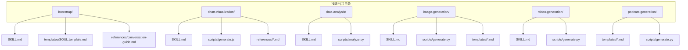
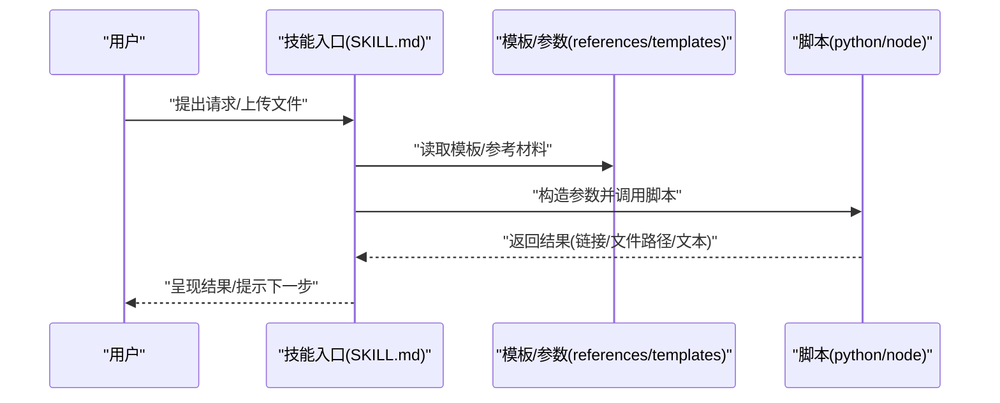
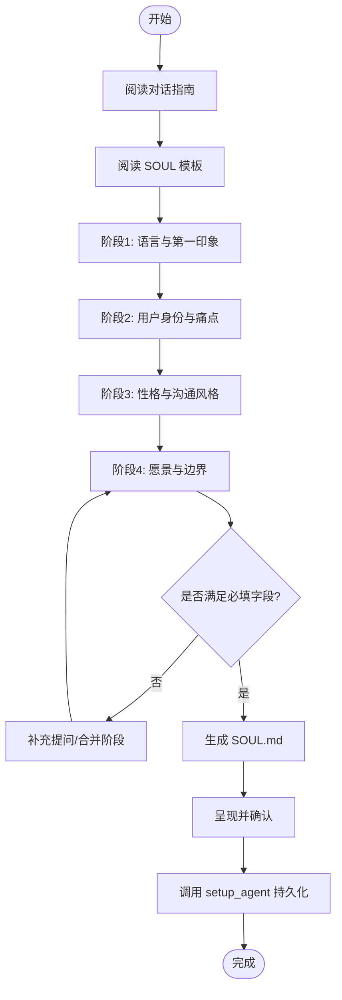
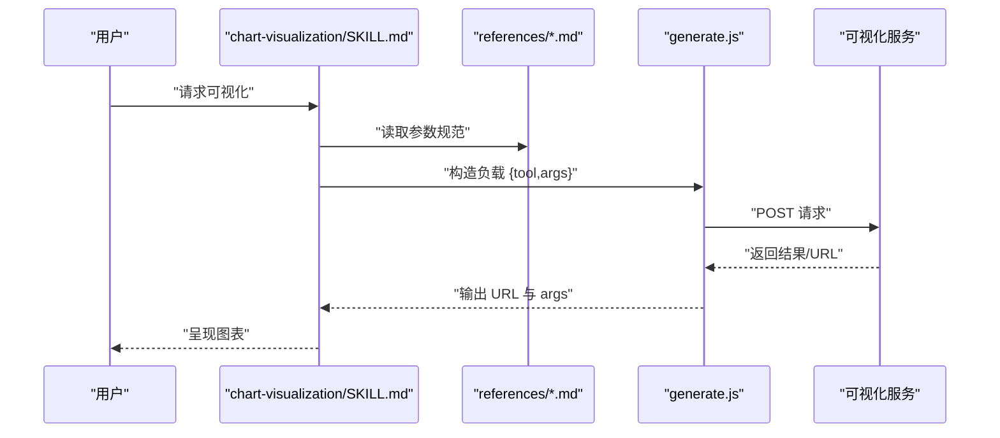
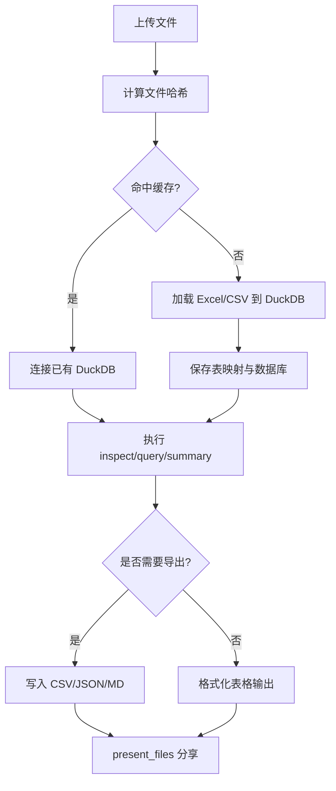
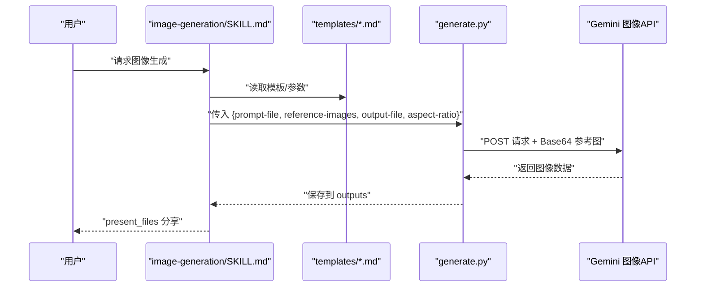
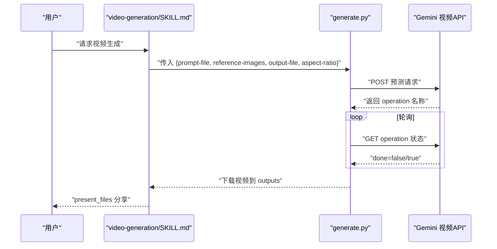
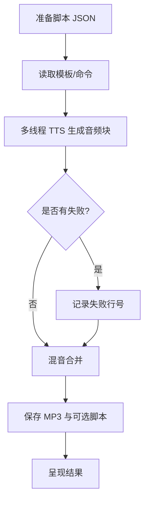
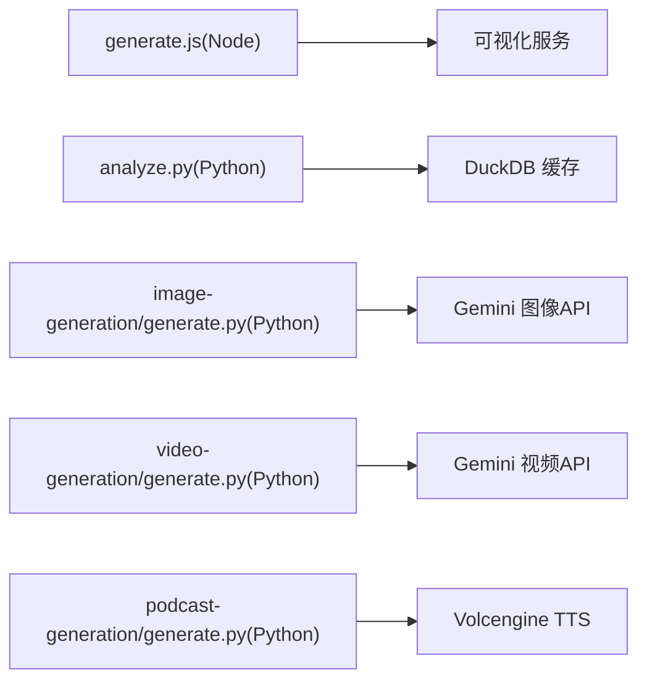

# 技能模板与示例

<cite>
**本文引用的文件**
- [bootstrap/SKILL.md](file://skills/public/bootstrap/SKILL.md)
- [bootstrap/templates/SOUL.template.md](file://skills/public/bootstrap/templates/SOUL.template.md)
- [bootstrap/references/conversation-guide.md](file://skills/public/bootstrap/references/conversation-guide.md)
- [chart-visualization/SKILL.md](file://skills/public/chart-visualization/SKILL.md)
- [chart-visualization/scripts/generate.js](file://skills/public/chart-visualization/scripts/generate.js)
- [chart-visualization/references/generate_line_chart.md](file://skills/public/chart-visualization/references/generate_line_chart.md)
- [data-analysis/SKILL.md](file://skills/public/data-analysis/SKILL.md)
- [data-analysis/scripts/analyze.py](file://skills/public/data-analysis/scripts/analyze.py)
- [image-generation/SKILL.md](file://skills/public/image-generation/SKILL.md)
- [image-generation/scripts/generate.py](file://skills/public/image-generation/scripts/generate.py)
- [image-generation/templates/doraemon.md](file://skills/public/image-generation/templates/doraemon.md)
- [video-generation/SKILL.md](file://skills/public/video-generation/SKILL.md)
- [video-generation/scripts/generate.py](file://skills/public/video-generation/scripts/generate.py)
- [podcast-generation/templates/tech-explainer.md](file://skills/public/podcast-generation/templates/tech-explainer.md)
- [podcast-generation/scripts/generate.py](file://skills/public/podcast-generation/scripts/generate.py)
</cite>

## 目录
1. [简介](#简介)
2. [项目结构](#项目结构)
3. [核心组件](#核心组件)
4. [架构总览](#架构总览)
5. [详细组件分析](#详细组件分析)
6. [依赖关系分析](#依赖关系分析)
7. [性能考量](#性能考量)
8. [故障排查指南](#故障排查指南)
9. [结论](#结论)
10. [附录](#附录)

## 简介
本指南面向 DeerFlow 的技能开发者与使用者，系统性梳理并示范多种技能模板与完整示例，覆盖引导类（bootstrap）、图表可视化（chart-visualization）、数据分析（data-analysis）、图像生成（image-generation）、视频生成（video-generation）等类型。内容包括模板结构、脚本组织方式、资源管理策略、关键元素（模板文件、脚本执行逻辑、资源文件使用、输出规范）以及从简单工具到复杂工作流的实现路径，帮助快速构建高质量、可维护、可复用的技能。

## 项目结构
技能位于 skills/public 下，每个技能以独立目录呈现，包含：
- SKILL.md：技能说明与工作流规范
- scripts/*：可执行脚本（Python/Node）
- templates/*：结构化模板（如 JSON、Markdown）
- references/*：参考材料（参数规范、对话策略等）

**图表来源**
- [bootstrap/SKILL.md:1-95](file://skills/public/bootstrap/SKILL.md#L1-L95)
- [chart-visualization/SKILL.md:1-73](file://skills/public/chart-visualization/SKILL.md#L1-L73)
- [data-analysis/SKILL.md:1-249](file://skills/public/data-analysis/SKILL.md#L1-L249)
- [image-generation/SKILL.md:1-188](file://skills/public/image-generation/SKILL.md#L1-L188)
- [video-generation/SKILL.md:1-140](file://skills/public/video-generation/SKILL.md#L1-L140)
- [podcast-generation/templates/tech-explainer.md:1-64](file://skills/public/podcast-generation/templates/tech-explainer.md#L1-L64)

**章节来源**
- [bootstrap/SKILL.md:1-95](file://skills/public/bootstrap/SKILL.md#L1-L95)
- [chart-visualization/SKILL.md:1-73](file://skills/public/chart-visualization/SKILL.md#L1-L73)
- [data-analysis/SKILL.md:1-249](file://skills/public/data-analysis/SKILL.md#L1-L249)
- [image-generation/SKILL.md:1-188](file://skills/public/image-generation/SKILL.md#L1-L188)
- [video-generation/SKILL.md:1-140](file://skills/public/video-generation/SKILL.md#L1-L140)
- [podcast-generation/templates/tech-explainer.md:1-64](file://skills/public/podcast-generation/templates/tech-explainer.md#L1-L64)

## 核心组件
- 引导技能（bootstrap）：通过多轮对话提取用户身份、需求与偏好，生成标准化 SOUL.md 并调用 setup_agent 工具完成代理初始化。
- 图表可视化（chart-visualization）：根据输入数据智能选择图表类型，解析参数，调用 generate.js 生成图表图片链接。
- 数据分析（data-analysis）：基于 DuckDB 对 Excel/CSV 进行结构检查、SQL 查询、统计摘要与结果导出，支持缓存加速。
- 图像生成（image-generation）：读取结构化 JSON 提示，结合参考图进行图像生成，输出至 outputs 目录。
- 视频生成（video-generation）：读取结构化 JSON 提示，结合参考图生成视频，支持长时运行任务轮询与下载。
- 播客生成（podcast-generation）：将脚本 JSON 转换为语音并混音，生成 MP3 与可选的 Markdown 脚本。

**章节来源**
- [bootstrap/SKILL.md:1-95](file://skills/public/bootstrap/SKILL.md#L1-L95)
- [chart-visualization/SKILL.md:1-73](file://skills/public/chart-visualization/SKILL.md#L1-L73)
- [data-analysis/SKILL.md:1-249](file://skills/public/data-analysis/SKILL.md#L1-L249)
- [image-generation/SKILL.md:1-188](file://skills/public/image-generation/SKILL.md#L1-L188)
- [video-generation/SKILL.md:1-140](file://skills/public/video-generation/SKILL.md#L1-L140)
- [podcast-generation/scripts/generate.py:1-285](file://skills/public/podcast-generation/scripts/generate.py#L1-L285)

## 架构总览
下图展示了各技能的典型调用链路与资源交互：

**图表来源**
- [bootstrap/SKILL.md:71-95](file://skills/public/bootstrap/SKILL.md#L71-L95)
- [chart-visualization/SKILL.md:12-68](file://skills/public/chart-visualization/SKILL.md#L12-L68)
- [data-analysis/SKILL.md:21-249](file://skills/public/data-analysis/SKILL.md#L21-L249)
- [image-generation/SKILL.md:19-188](file://skills/public/image-generation/SKILL.md#L19-L188)
- [video-generation/SKILL.md:18-140](file://skills/public/video-generation/SKILL.md#L18-L140)
- [podcast-generation/templates/tech-explainer.md:1-64](file://skills/public/podcast-generation/templates/tech-explainer.md#L1-L64)

## 详细组件分析

### 引导技能（bootstrap）
- 模板结构：SKILL.md 定义阶段目标、规则与生成流程；SOUL.template.md 提供固定段落与占位符；conversation-guide.md 给出每阶段对话策略。
- 执行逻辑：按阶段推进，逐步提取必填字段；达到生成条件后，读取模板并生成 SOUL.md，随后调用 setup_agent 工具持久化。
- 资源管理：模板与参考文件集中于 templates 与 references；生成产物为 SOUL.md 文件。
- 输出规范：最终以“确认 + 工具调用”闭环，确保配置生效。

**图表来源**
- [bootstrap/SKILL.md:16-95](file://skills/public/bootstrap/SKILL.md#L16-L95)
- [bootstrap/templates/SOUL.template.md:1-44](file://skills/public/bootstrap/templates/SOUL.template.md#L1-L44)
- [bootstrap/references/conversation-guide.md:1-83](file://skills/public/bootstrap/references/conversation-guide.md#L1-L83)

**章节来源**
- [bootstrap/SKILL.md:1-95](file://skills/public/bootstrap/SKILL.md#L1-L95)
- [bootstrap/templates/SOUL.template.md:1-44](file://skills/public/bootstrap/templates/SOUL.template.md#L1-L44)
- [bootstrap/references/conversation-guide.md:1-83](file://skills/public/bootstrap/references/conversation-guide.md#L1-L83)

### 图表可视化（chart-visualization）
- 模板结构：SKILL.md 描述工作流与参数规范；references 子目录包含各类图表的参数说明；scripts/generate.js 负责调用可视化服务并返回图片链接。
- 执行逻辑：根据数据特征选择图表类型 → 解析 references 中的参数 → 调用 generate.js 传入 JSON 负载 → 输出图片 URL。
- 资源管理：Node 环境要求；通过环境变量控制服务端点与服务标识；地图类图表走特殊分支。
- 输出规范：返回图片 URL 与完整 args 规范，便于复现与二次编辑。

**图表来源**
- [chart-visualization/SKILL.md:12-68](file://skills/public/chart-visualization/SKILL.md#L12-L68)
- [chart-visualization/scripts/generate.js:1-174](file://skills/public/chart-visualization/scripts/generate.js#L1-L174)
- [chart-visualization/references/generate_line_chart.md:1-26](file://skills/public/chart-visualization/references/generate_line_chart.md#L1-L26)

**章节来源**
- [chart-visualization/SKILL.md:1-73](file://skills/public/chart-visualization/SKILL.md#L1-L73)
- [chart-visualization/scripts/generate.js:1-174](file://skills/public/chart-visualization/scripts/generate.js#L1-L174)
- [chart-visualization/references/generate_line_chart.md:1-26](file://skills/public/chart-visualization/references/generate_line_chart.md#L1-L26)

### 数据分析（data-analysis）
- 模板结构：SKILL.md 定义能力范围、工作流与参数；scripts/analyze.py 实现文件加载、SQL 查询、统计摘要与导出。
- 执行逻辑：inspect → query/summary → export；自动缓存 DuckDB 数据库，提升重复查询效率。
- 资源管理：缓存目录位于临时目录下的 .data-analysis-cache；文件哈希作为缓存键；支持多文件跨表联结。
- 输出规范：直接在会话中以表格形式呈现结果；大结果导出为 CSV/JSON/Markdown 并通过 present_files 工具分享。

**图表来源**
- [data-analysis/SKILL.md:21-249](file://skills/public/data-analysis/SKILL.md#L21-L249)
- [data-analysis/scripts/analyze.py:1-567](file://skills/public/data-analysis/scripts/analyze.py#L1-L567)

**章节来源**
- [data-analysis/SKILL.md:1-249](file://skills/public/data-analysis/SKILL.md#L1-L249)
- [data-analysis/scripts/analyze.py:1-567](file://skills/public/data-analysis/scripts/analyze.py#L1-L567)

### 图像生成（image-generation）
- 模板结构：SKILL.md 描述工作流与参数；templates/doraemon.md 提供特定场景的模板布局；scripts/generate.py 调用 Gemini API 生成图像。
- 执行逻辑：理解需求 → 创建结构化 JSON 提示 → 可选参考图校验 → 调用 API 生成并保存至 outputs。
- 资源管理：参考图本地校验（损坏跳过）；环境变量 GEMINI_API_KEY；输出统一到 outputs 目录。
- 输出规范：通过 present_files 分享；支持不同场景的 JSON 结构（角色、场景、产品）。

**图表来源**
- [image-generation/SKILL.md:19-188](file://skills/public/image-generation/SKILL.md#L19-L188)
- [image-generation/scripts/generate.py:1-133](file://skills/public/image-generation/scripts/generate.py#L1-L133)
- [image-generation/templates/doraemon.md:1-113](file://skills/public/image-generation/templates/doraemon.md#L1-L113)

**章节来源**
- [image-generation/SKILL.md:1-188](file://skills/public/image-generation/SKILL.md#L1-L188)
- [image-generation/scripts/generate.py:1-133](file://skills/public/image-generation/scripts/generate.py#L1-L133)
- [image-generation/templates/doraemon.md:1-113](file://skills/public/image-generation/templates/doraemon.md#L1-L113)

### 视频生成（video-generation）
- 模板结构：SKILL.md 描述工作流与参数；scripts/generate.py 调用 Gemini API 生成视频，支持长时运行任务轮询与下载。
- 执行逻辑：理解需求 → 创建结构化 JSON 提示 → 可选参考图 → 调用长时任务 API → 轮询完成 → 下载视频。
- 资源管理：环境变量 GEMINI_API_KEY；输出统一到 outputs 目录。
- 输出规范：通过 present_files 分享视频与参考图；支持不同场景的 JSON 结构。

**图表来源**
- [video-generation/SKILL.md:18-140](file://skills/public/video-generation/SKILL.md#L18-L140)
- [video-generation/scripts/generate.py:1-117](file://skills/public/video-generation/scripts/generate.py#L1-L117)

**章节来源**
- [video-generation/SKILL.md:1-140](file://skills/public/video-generation/SKILL.md#L1-L140)
- [video-generation/scripts/generate.py:1-117](file://skills/public/video-generation/scripts/generate.py#L1-L117)

### 播客生成（podcast-generation）
- 模板结构：templates/tech-explainer.md 提供技术讲解播客的输入准备与命令示例；scripts/generate.py 将脚本转为语音并混音。
- 执行逻辑：准备脚本 JSON → 多线程 TTS → 混音 → 生成 MP3 与可选 Markdown 脚本。
- 资源管理：环境变量 VOLCENGINE_TTS_*；并发处理提升吞吐。
- 输出规范：MP3 与可选脚本 Markdown；错误时记录失败行号以便修正。

**图表来源**
- [podcast-generation/templates/tech-explainer.md:1-64](file://skills/public/podcast-generation/templates/tech-explainer.md#L1-L64)
- [podcast-generation/scripts/generate.py:1-285](file://skills/public/podcast-generation/scripts/generate.py#L1-L285)

**章节来源**
- [podcast-generation/templates/tech-explainer.md:1-64](file://skills/public/podcast-generation/templates/tech-explainer.md#L1-L64)
- [podcast-generation/scripts/generate.py:1-285](file://skills/public/podcast-generation/scripts/generate.py#L1-L285)

## 依赖关系分析
- 外部依赖
  - Node 生态：chart-visualization 依赖 Node 与可视化服务（通过环境变量配置）。
  - Python 生态：data-analysis 依赖 DuckDB、openpyxl；image-generation 依赖 requests、Pillow；video-generation 依赖 requests；podcast-generation 依赖 requests、多线程。
- 环境变量
  - GEMINI_API_KEY：图像/视频生成必需。
  - VOLCENGINE_TTS_*：播客生成必需。
  - VIS_REQUEST_SERVER/SERVICE_ID：图表可视化服务端点与标识（可选）。
- 资源路径约定
  - /mnt/user-data/uploads：用户上传文件目录。
  - /mnt/user-data/outputs：生成物输出目录。
  - /mnt/user-data/workspace：工作区（如 JSON 提示文件）。

**图表来源**
- [chart-visualization/scripts/generate.js:1-174](file://skills/public/chart-visualization/scripts/generate.js#L1-L174)
- [data-analysis/scripts/analyze.py:1-567](file://skills/public/data-analysis/scripts/analyze.py#L1-L567)
- [image-generation/scripts/generate.py:1-133](file://skills/public/image-generation/scripts/generate.py#L1-L133)
- [video-generation/scripts/generate.py:1-117](file://skills/public/video-generation/scripts/generate.py#L1-L117)
- [podcast-generation/scripts/generate.py:1-285](file://skills/public/podcast-generation/scripts/generate.py#L1-L285)

**章节来源**
- [chart-visualization/scripts/generate.js:1-174](file://skills/public/chart-visualization/scripts/generate.js#L1-L174)
- [data-analysis/scripts/analyze.py:1-567](file://skills/public/data-analysis/scripts/analyze.py#L1-L567)
- [image-generation/scripts/generate.py:1-133](file://skills/public/image-generation/scripts/generate.py#L1-L133)
- [video-generation/scripts/generate.py:1-117](file://skills/public/video-generation/scripts/generate.py#L1-L117)
- [podcast-generation/scripts/generate.py:1-285](file://skills/public/podcast-generation/scripts/generate.py#L1-L285)

## 性能考量
- 缓存与复用
  - data-analysis 使用 DuckDB 缓存数据库与表映射，首次加载后显著降低后续查询延迟。
- 并发与吞吐
  - podcast-generation 使用多线程并行 TTS，提高大规模脚本处理效率。
- I/O 与网络
  - 图像/视频生成与播客 TTS 均为网络请求，注意超时与重试策略；outputs 目录统一管理生成物，便于清理与归档。
- 参数与规格
  - chart-visualization 严格遵循 references 中的参数规范，减少无效调用与重试成本。

[本节为通用指导，不直接分析具体文件，故无“章节来源”]

## 故障排查指南
- 环境变量缺失
  - 图像/视频生成：检查 GEMINI_API_KEY 是否设置。
  - 播客生成：检查 VOLCENGINE_TTS_APPID 与 VOLCENGINE_TTS_ACCESS_TOKEN。
- Node 脚本参数错误
  - chart-visualization：确认传入的 tool 与 args 符合 generate.js 映射与 references 规范；必要时传入文件路径而非内联 JSON。
- 文件路径与权限
  - data-analysis：确保上传文件路径正确且可读；outputs 目录具备写权限。
  - image-generation：参考图需有效且可打开；损坏文件会被跳过。
- 长时任务状态
  - video-generation：若长时间未完成，检查 API 返回的 operation 名称与轮询间隔。
- TTS 失败
  - podcast-generation：查看失败行号并修正对应段落；确认网络连通与配额。

**章节来源**
- [image-generation/scripts/generate.py:65-70](file://skills/public/image-generation/scripts/generate.py#L65-L70)
- [video-generation/scripts/generate.py:33-36](file://skills/public/video-generation/scripts/generate.py#L33-L36)
- [podcast-generation/scripts/generate.py:43-50](file://skills/public/podcast-generation/scripts/generate.py#L43-L50)
- [chart-visualization/scripts/generate.js:97-116](file://skills/public/chart-visualization/scripts/generate.js#L97-L116)

## 结论
通过标准化的模板结构、清晰的工作流与严格的参数规范，DeerFlow 技能体系实现了从简单工具到复杂工作流的平滑扩展。开发者可依据本文档的模板与最佳实践快速落地新技能，并利用缓存、并发与环境变量等机制保障性能与稳定性。

[本节为总结性内容，不直接分析具体文件，故无“章节来源”]

## 附录
- 最佳实践清单
  - 明确输入输出契约：在 SKILL.md 中固化参数与返回值。
  - 分层组织资源：templates 与 references 保持纯文本与最小依赖。
  - 谨慎处理外部依赖：通过环境变量与错误提示降低耦合。
  - 可观测性：记录关键步骤与失败原因，便于回溯与优化。
  - 可复现性：输出完整 args 或脚本，便于二次编辑与审计。

[本节为通用建议，不直接分析具体文件，故无“章节来源”]