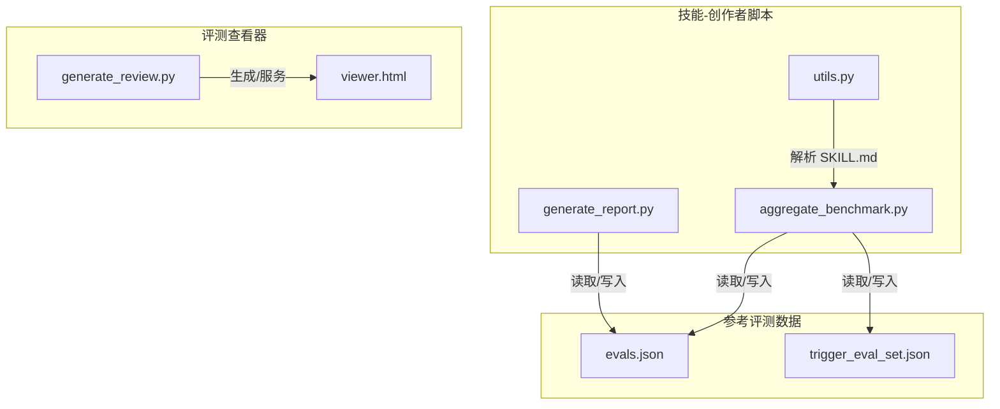
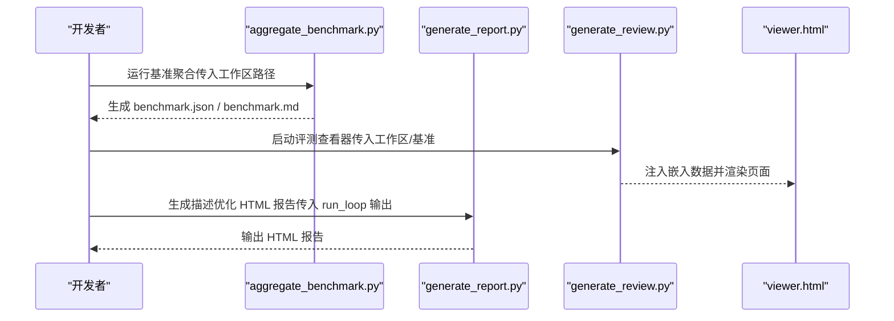
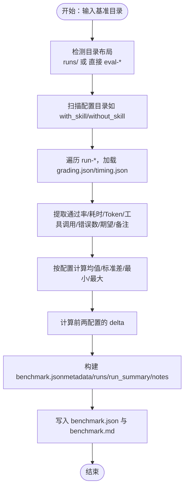
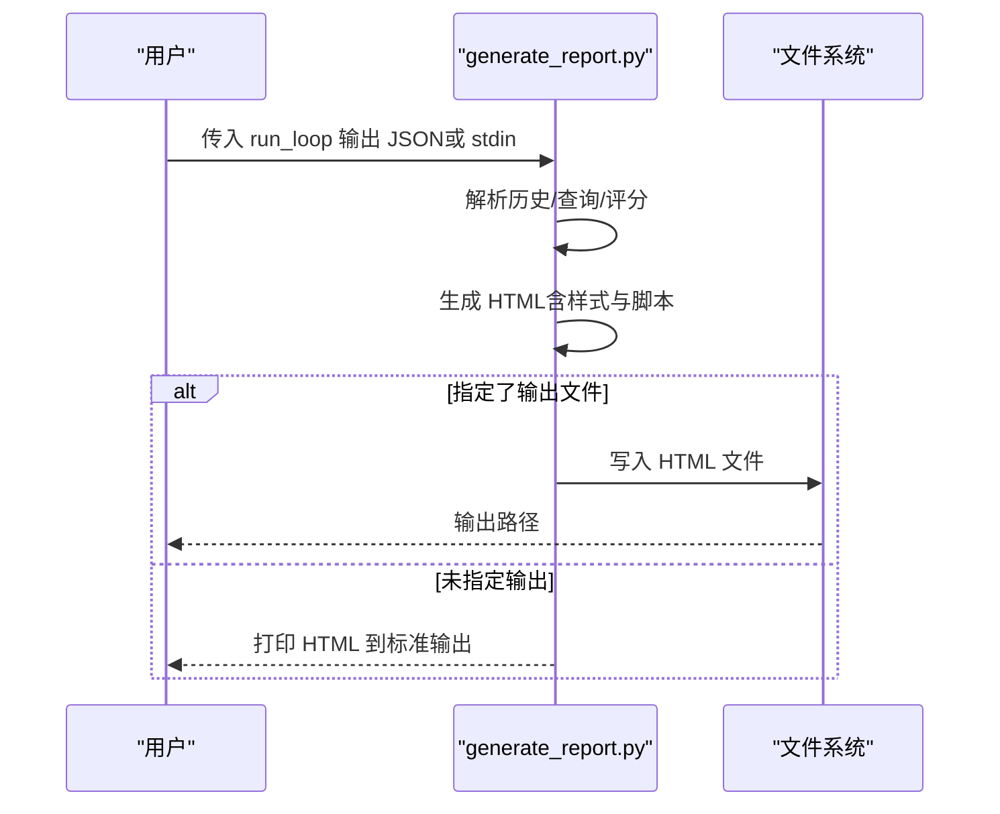
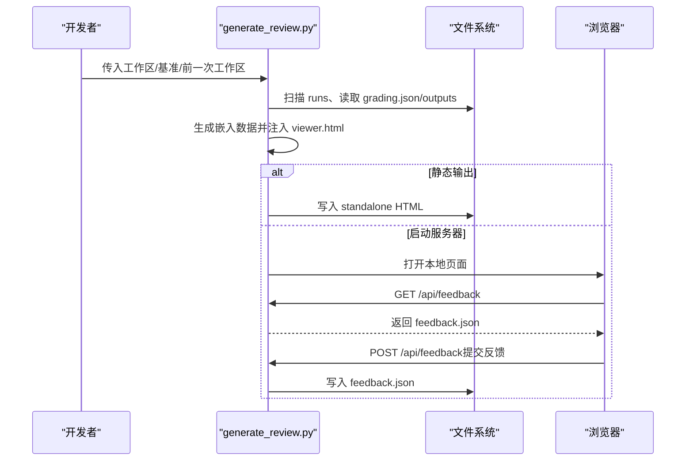
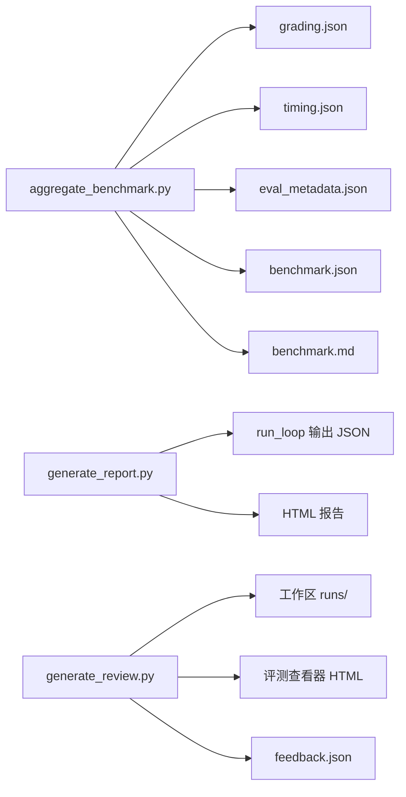

# 基准数据聚合

<cite>
**本文引用的文件**
- [aggregate_benchmark.py](file://skills/public/skill-creator/scripts/aggregate_benchmark.py)
- [generate_report.py](file://skills/public/skill-creator/scripts/generate_report.py)
- [utils.py](file://skills/public/skill-creator/scripts/utils.py)
- [SKILL.md（技能-创作者）](file://skills/public/skill-creator/SKILL.md)
- [generate_review.py（评测查看器）](file://skills/public/skill-creator/eval-viewer/generate_review.py)
- [viewer.html（评测查看器前端模板）](file://skills/public/skill-creator/eval-viewer/viewer.html)
- [evals.json（系统性文献综述评测集）](file://skills/public/systematic-literature-review/evals/evals.json)
- [trigger_eval_set.json（触发评测集合）](file://skills/public/systematic-literature-review/evals/trigger_eval_set.json)
</cite>

## 目录
1. [简介](#简介)
2. [项目结构](#项目结构)
3. [核心组件](#核心组件)
4. [架构总览](#架构总览)
5. [详细组件分析](#详细组件分析)
6. [依赖关系分析](#依赖关系分析)
7. [性能考量](#性能考量)
8. [故障排查指南](#故障排查指南)
9. [结论](#结论)
10. [附录](#附录)

## 简介
本技术指南围绕 DeerFlow 技能基准数据聚合与报告生成展开，重点覆盖以下两个脚本：
- aggregate_benchmark.py：将多次运行的评测结果合并为汇总统计，计算通过率、耗时、Token 使用量等指标，并输出基准 JSON 与 Markdown 报告。
- generate_report.py：从 run_loop.py 输出生成 HTML 报告，展示描述优化迭代过程中的触发表现与评分。

同时，文档补充了评测数据结构、工作流规范、以及如何在实际项目中进行技能性能对比与优化。

## 项目结构
与基准数据聚合相关的核心文件位于 skill-creator 技能包内，主要包含：
- scripts/aggregate_benchmark.py：基准聚合与报告生成
- scripts/generate_report.py：描述优化循环的 HTML 报告生成
- scripts/utils.py：通用工具（如解析 SKILL.md）
- eval-viewer/generate_review.py 与 viewer.html：评测查看器（用于展示定量与定性结果）
- 参考评测数据：systematic-literature-review/evals/*.json

**图示来源**
- [aggregate_benchmark.py](file://skills/public/skill-creator/scripts/aggregate_benchmark.py)
- [generate_report.py](file://skills/public/skill-creator/scripts/generate_report.py)
- [utils.py](file://skills/public/skill-creator/scripts/utils.py)
- [generate_review.py（评测查看器）](file://skills/public/skill-creator/eval-viewer/generate_review.py)
- [viewer.html（评测查看器前端模板）](file://skills/public/skill-creator/eval-viewer/viewer.html)
- [evals.json（系统性文献综述评测集）](file://skills/public/systematic-literature-review/evals/evals.json)
- [trigger_eval_set.json（触发评测集合）](file://skills/public/systematic-literature-review/evals/trigger_eval_set.json)

**章节来源**
- [aggregate_benchmark.py](file://skills/public/skill-creator/scripts/aggregate_benchmark.py)
- [generate_report.py](file://skills/public/skill-creator/scripts/generate_report.py)
- [utils.py](file://skills/public/skill-creator/scripts/utils.py)
- [SKILL.md（技能-创作者）](file://skills/public/skill-creator/SKILL.md)
- [generate_review.py（评测查看器）](file://skills/public/skill-creator/eval-viewer/generate_review.py)
- [viewer.html（评测查看器前端模板）](file://skills/public/skill-creator/eval-viewer/viewer.html)
- [evals.json（系统性文献综述评测集）](file://skills/public/systematic-literature-review/evals/evals.json)
- [trigger_eval_set.json（触发评测集合）](file://skills/public/systematic-literature-review/evals/trigger_eval_set.json)

## 核心组件
- 基准聚合脚本（aggregate_benchmark.py）
  - 功能：扫描评测目录，加载每个 run 的 grading.json/timing.json，提取通过率、耗时、Token、工具调用次数、错误数等，计算均值、标准差、最小/最大值，并生成配置间差异（delta）。
  - 输出：benchmark.json（含元数据、runs 列表、汇总统计、notes）、benchmark.md（人类可读摘要）。
- 报告生成脚本（generate_report.py）
  - 功能：从 run_loop.py 的 JSON 输出生成 HTML 报告，区分训练/测试查询，展示每次迭代的触发正确率与评分，支持自动刷新。
- 评测查看器（generate_review.py + viewer.html）
  - 功能：扫描工作区，嵌入输出与评分，提供“Outputs”和“Benchmark”双标签页，支持反馈自动保存与下载。
- 工具函数（utils.py）
  - 功能：解析 SKILL.md 的 frontmatter，返回名称、描述与全文内容。

**章节来源**
- [aggregate_benchmark.py](file://skills/public/skill-creator/scripts/aggregate_benchmark.py)
- [generate_report.py](file://skills/public/skill-creator/scripts/generate_report.py)
- [generate_review.py（评测查看器）](file://skills/public/skill-creator/eval-viewer/generate_review.py)
- [viewer.html（评测查看器前端模板）](file://skills/public/skill-creator/eval-viewer/viewer.html)
- [utils.py](file://skills/public/skill-creator/scripts/utils.py)

## 架构总览
下图展示了基准聚合与报告生成在整体评测流程中的位置与交互：

**图示来源**
- [aggregate_benchmark.py](file://skills/public/skill-creator/scripts/aggregate_benchmark.py)
- [generate_report.py](file://skills/public/skill-creator/scripts/generate_report.py)
- [generate_review.py（评测查看器）](file://skills/public/skill-creator/eval-viewer/generate_review.py)
- [viewer.html（评测查看器前端模板）](file://skills/public/skill-creator/eval-viewer/viewer.html)

## 详细组件分析

### aggregate_benchmark.py 组件分析
- 数据加载与目录布局支持
  - 支持两种目录布局：直接在基准目录下存在 eval-*；或在 runs/eval-* 下。
  - 动态发现配置目录（如 with_skill、without_skill），并遍历 run-* 子目录。
- 结果提取与清洗
  - 优先从 grading.json 中读取 summary 字段（pass_rate、passed、failed、total），其次从 timing.json 补充时间与 Token。
  - 提取执行指标（工具调用次数、输出字符数、错误数）与期望项（expectations）及用户笔记（notes）。
- 汇总统计
  - 计算每项指标的均值、标准差、最小/最大值；按配置分组生成 run_summary。
  - 计算前两个配置的 delta（pass_rate/time/tokens），用于直观对比。
- 输出与元数据
  - 生成 benchmark.json，包含 metadata（技能名、路径、模型、时间戳、运行的评测 ID、每配置运行次数）、runs 列表、run_summary、notes。
  - 生成 benchmark.md，以表格形式呈现各配置的均值±标准差与 delta。

**图示来源**
- [aggregate_benchmark.py](file://skills/public/skill-creator/scripts/aggregate_benchmark.py)

**章节来源**
- [aggregate_benchmark.py](file://skills/public/skill-creator/scripts/aggregate_benchmark.py)

### generate_report.py 组件分析
- 输入与输出
  - 接收 run_loop.py 的 JSON 输出（包含历史记录、训练/测试查询、描述等）。
  - 生成 HTML 报告，支持自动刷新与标题包含技能名。
- 数据结构与渲染
  - 解析历史记录，区分训练与测试查询，计算每次迭代的正确/总数，按阈值分级（优秀/一般/较差）。
  - 渲染表格列头（查询）、单元格（勾选/叉号 + 触发/总次数），并高亮最佳迭代。
- 用户体验
  - 页面包含说明、图例、摘要区域与表格主体，支持键盘导航与自动保存反馈。

**图示来源**
- [generate_report.py](file://skills/public/skill-creator/scripts/generate_report.py)

**章节来源**
- [generate_report.py](file://skills/public/skill-creator/scripts/generate_report.py)

### 评测查看器（generate_review.py + viewer.html）组件分析
- 工作区扫描与嵌入
  - 递归扫描工作区，定位包含 outputs/ 的 run 目录，收集 prompt、输出文件与 grading.json。
  - 将数据嵌入 viewer.html，生成自包含的 HTML 页面。
- 服务与反馈
  - 启动本地 HTTP 服务器，提供 /api/feedback 接口读取/写入 feedback.json。
  - 支持静态输出模式（--static），便于无浏览器环境使用。
- 前端模板
  - viewer.html 定义“Outputs”和“Benchmark”标签页，渲染 runs 列表、grades、previous feedback 等。

**图示来源**
- [generate_review.py（评测查看器）](file://skills/public/skill-creator/eval-viewer/generate_review.py)
- [viewer.html（评测查看器前端模板）](file://skills/public/skill-creator/eval-viewer/viewer.html)

**章节来源**
- [generate_review.py（评测查看器）](file://skills/public/skill-creator/eval-viewer/generate_review.py)
- [viewer.html（评测查看器前端模板）](file://skills/public/skill-creator/eval-viewer/viewer.html)

### 工具函数（utils.py）分析
- 功能：解析 SKILL.md 的 YAML frontmatter，返回技能名称、描述与完整内容。
- 注意：支持多行字符串（>、|- 等）的处理，确保描述提取准确。

**章节来源**
- [utils.py](file://skills/public/skill-creator/scripts/utils.py)

## 依赖关系分析
- aggregate_benchmark.py
  - 依赖：标准库（argparse、json、math、sys、datetime、pathlib）。
  - 外部输入：grading.json、timing.json、eval_metadata.json。
  - 输出：benchmark.json、benchmark.md。
- generate_report.py
  - 依赖：标准库（argparse、json、sys、pathlib）。
  - 外部输入：run_loop.py 的 JSON 输出。
  - 输出：HTML 报告。
- generate_review.py
  - 依赖：标准库（http.server、webbrowser、subprocess、signal、mimetypes、base64、re、os、time）。
  - 外部输入：工作区内的 runs、grading.json、outputs/。
  - 输出：本地服务或静态 HTML。

**图示来源**
- [aggregate_benchmark.py](file://skills/public/skill-creator/scripts/aggregate_benchmark.py)
- [generate_report.py](file://skills/public/skill-creator/scripts/generate_report.py)
- [generate_review.py（评测查看器）](file://skills/public/skill-creator/eval-viewer/generate_review.py)

**章节来源**
- [aggregate_benchmark.py](file://skills/public/skill-creator/scripts/aggregate_benchmark.py)
- [generate_report.py](file://skills/public/skill-creator/scripts/generate_report.py)
- [generate_review.py（评测查看器）](file://skills/public/skill-creator/eval-viewer/generate_review.py)

## 性能考量
- I/O 与扫描
  - aggregate_benchmark.py 对目录进行递归扫描，建议在大型工作区中控制 eval 与 run 数量，避免过多磁盘 IO。
- JSON 解析
  - 对 grading.json/timing.json 的解析为 O(N)（N 为 run 数），注意异常处理与缺失字段的容错。
- HTML 生成
  - generate_report.py 与 generate_review.py 均为纯 Python 实现，生成内容较大时建议使用静态输出模式减少内存占用。
- 并发与批处理
  - 建议在评测阶段并行运行多个 run，以缩短总耗时；聚合阶段按需批量处理，避免重复扫描。

[本节为通用指导，不涉及具体文件分析]

## 故障排查指南
- aggregate_benchmark.py
  - 未找到 eval 目录：确认基准目录布局是否符合预期（runs/ 或 直接 eval-*）。
  - 缺失 grading.json：检查评测流程是否完成，确保每个 run 目录生成 grading.json。
  - JSON 解析失败：检查 grading.json/timing.json 是否为合法 JSON，字段是否存在。
  - timing.json 缺失：若缺少 timing.json，脚本会尝试从 grading.json 中读取时间字段。
- generate_report.py
  - 输入为空或非 JSON：确认 run_loop 输出路径正确，或通过 stdin 传递。
  - 输出为空：检查是否指定了输出文件路径，或直接在终端查看。
- generate_review.py
  - 端口被占用：脚本会尝试终止占用端口的进程并重试；若失败，可手动更换端口。
  - 无法打开浏览器：在无显示环境使用 --static 输出静态 HTML。
  - feedback.json 未更新：确认浏览器已提交并通过 /api/feedback 接口写入。

**章节来源**
- [aggregate_benchmark.py](file://skills/public/skill-creator/scripts/aggregate_benchmark.py)
- [generate_report.py](file://skills/public/skill-creator/scripts/generate_report.py)
- [generate_review.py（评测查看器）](file://skills/public/skill-creator/eval-viewer/generate_review.py)

## 结论
aggregate_benchmark.py 与 generate_report.py 分别承担了“定量基准聚合”与“描述优化可视化”的关键职责。结合 generate_review.py 的评测查看器，开发者可以高效地完成技能评测、对比与优化闭环。通过规范化的数据结构与清晰的输出格式，这些工具为技能性能的量化分析提供了坚实基础。

[本节为总结性内容，不涉及具体文件分析]

## 附录

### 基准数据格式与结构
- benchmark.json（核心字段）
  - metadata：技能名、路径、模型、时间戳、评测 ID 列表、每配置运行次数。
  - runs：每条 run 的结果（eval_id、配置、run_number、结果字段、期望、备注）。
  - run_summary：按配置统计的指标（均值、标准差、最小、最大），以及 delta。
  - notes：分析员观察与建议（留空由分析流程填充）。
- benchmark.md（人类可读摘要）
  - 展示各配置的通过率、耗时、Token 使用情况，以及 delta。

**章节来源**
- [aggregate_benchmark.py](file://skills/public/skill-creator/scripts/aggregate_benchmark.py)

### 评测数据结构参考
- evals.json（系统性文献综述）
  - 包含 skill_name、evals 列表，每条评测包含 prompt、expected_output、expectations 等字段。
- trigger_eval_set.json（触发评测集合）
  - 包含查询数组，每条包含 query、should_trigger、rationale，用于描述优化的训练/测试集划分。

**章节来源**
- [evals.json（系统性文献综述评测集）](file://skills/public/systematic-literature-review/evals/evals.json)
- [trigger_eval_set.json（触发评测集合）](file://skills/public/systematic-literature-review/evals/trigger_eval_set.json)

### 使用指南与最佳实践
- 基准聚合
  - 在评测完成后运行 aggregate_benchmark.py，确保 grading.json 与 timing.json 完整。
  - 使用 --skill-name 与 --skill-path 传入元信息，便于报告识别。
  - 生成的 benchmark.json 可直接供评测查看器使用。
- 描述优化报告
  - 使用 generate_report.py 生成 HTML 报告，支持 --skill-name 与 --output。
  - 在 run_loop 循环中定期查看报告，关注测试集上的稳定性。
- 评测查看器
  - 使用 generate_review.py 启动本地服务，或使用 --static 输出静态页面。
  - 在“Benchmark”标签页查看定量统计，结合“Outputs”标签页进行定性反馈。

**章节来源**
- [aggregate_benchmark.py](file://skills/public/skill-creator/scripts/aggregate_benchmark.py)
- [generate_report.py](file://skills/public/skill-creator/scripts/generate_report.py)
- [generate_review.py（评测查看器）](file://skills/public/skill-creator/eval-viewer/generate_review.py)
- [SKILL.md（技能-创作者）](file://skills/public/skill-creator/SKILL.md)