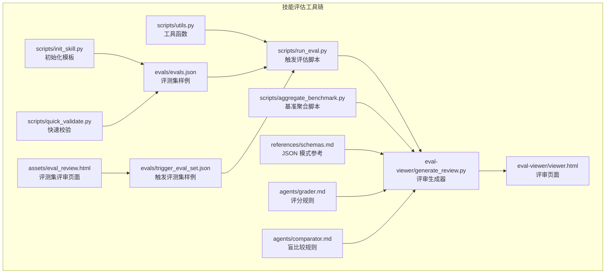
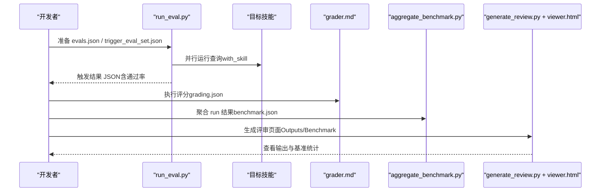
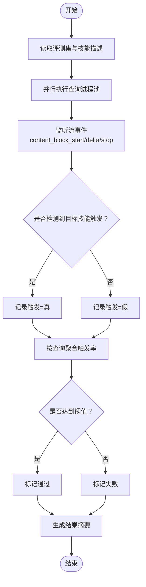
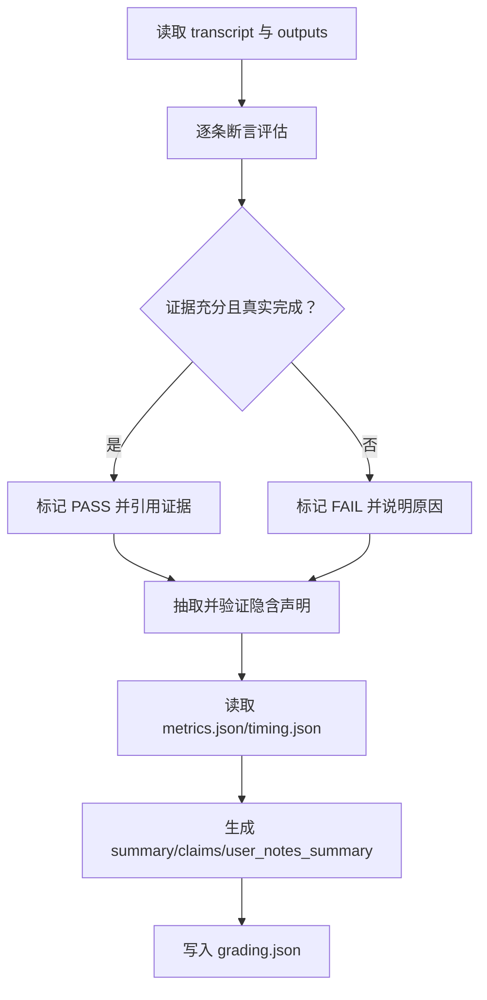
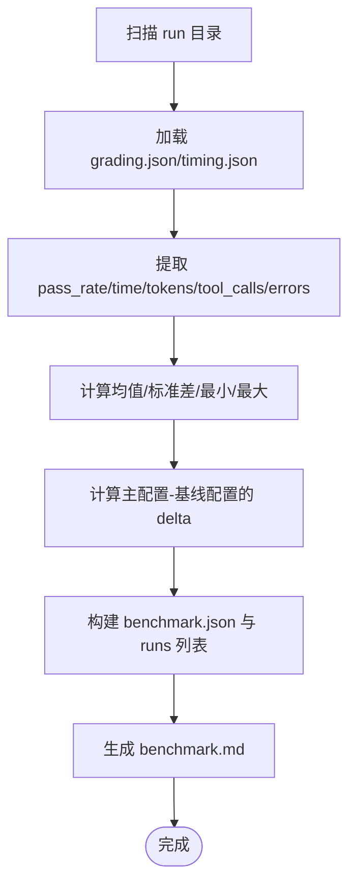
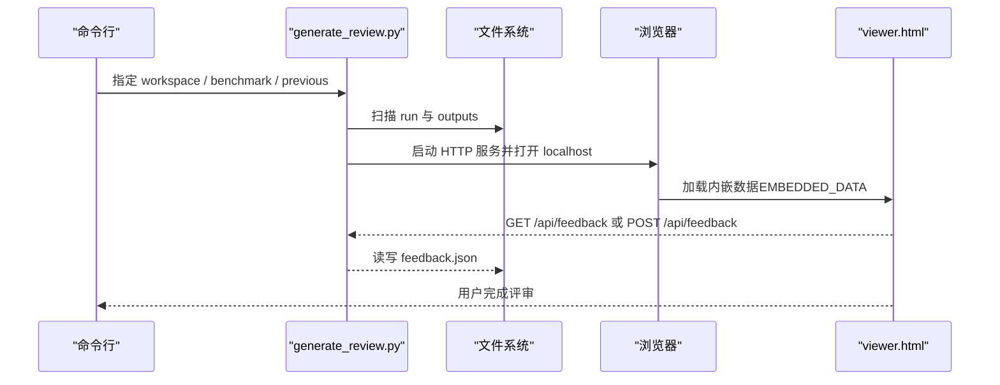
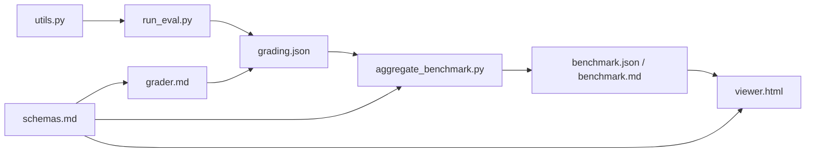

# 技能测试与评估

<cite>
**本文引用的文件**
- [run_eval.py](file://skills/public/skill-creator/scripts/run_eval.py)
- [aggregate_benchmark.py](file://skills/public/skill-creator/scripts/aggregate_benchmark.py)
- [generate_review.py](file://skills/public/skill-creator/eval-viewer/generate_review.py)
- [viewer.html](file://skills/public/skill-creator/eval-viewer/viewer.html)
- [utils.py](file://skills/public/skill-creator/scripts/utils.py)
- [init_skill.py](file://skills/public/skill-creator/scripts/init_skill.py)
- [quick_validate.py](file://skills/public/skill-creator/scripts/quick_validate.py)
- [schemas.md](file://skills/public/skill-creator/references/schemas.md)
- [grader.md](file://skills/public/skill-creator/agents/grader.md)
- [comparator.md](file://skills/public/skill-creator/agents/comparator.md)
- [evals.json](file://skills/public/systematic-literature-review/evals/evals.json)
- [trigger_eval_set.json](file://backend/skills/public/systematic-literature-review/evals/trigger_eval_set.json)
- [eval_review.html](file://skills/public/skill-creator/assets/eval_review.html)
</cite>

## 目录
1. [引言](#引言)
2. [项目结构](#项目结构)
3. [核心组件](#核心组件)
4. [架构总览](#架构总览)
5. [详细组件分析](#详细组件分析)
6. [依赖分析](#依赖分析)
7. [性能考虑](#性能考虑)
8. [故障排查指南](#故障排查指南)
9. [结论](#结论)
10. [附录](#附录)

## 引言
本指南面向 DeerFlow 技能测试与评估场景，系统化讲解如何设计与执行技能测试，包括测试用例设计（evals.json）、并行运行 with-skill 与 baseline 子代理、量化断言与统计分析、基准数据聚合与评估查看器使用等。文档同时提供评分标准、统计方法与性能指标解读，并给出可复用的实践步骤与示例路径。

## 项目结构
与技能测试评估直接相关的目录与文件集中在 skills/public/skill-creator 及其子模块中，涵盖触发评估、基准聚合、评审查看器、评测 JSON 模式与评分规则等。

图示来源
- [run_eval.py:1-311](file://skills/public/skill-creator/scripts/run_eval.py#L1-L311)
- [aggregate_benchmark.py:1-402](file://skills/public/skill-creator/scripts/aggregate_benchmark.py#L1-L402)
- [generate_review.py:1-472](file://skills/public/skill-creator/eval-viewer/generate_review.py#L1-L472)
- [viewer.html:1-1326](file://skills/public/skill-creator/eval-viewer/viewer.html#L1-L1326)
- [utils.py:1-48](file://skills/public/skill-creator/scripts/utils.py#L1-L48)
- [init_skill.py:1-304](file://skills/public/skill-creator/scripts/init_skill.py#L1-L304)
- [quick_validate.py:1-102](file://skills/public/skill-creator/scripts/quick_validate.py#L1-L102)
- [schemas.md:1-308](file://skills/public/skill-creator/references/schemas.md#L1-L308)
- [grader.md:1-224](file://skills/public/skill-creator/agents/grader.md#L1-L224)
- [comparator.md:1-203](file://skills/public/skill-creator/agents/comparator.md#L1-L203)
- [evals.json:1-80](file://skills/public/systematic-literature-review/evals/evals.json#L1-L80)
- [trigger_eval_set.json:1-103](file://backend/skills/public/systematic-literature-review/evals/trigger_eval_set.json#L1-L103)
- [eval_review.html:1-147](file://skills/public/skill-creator/assets/eval_review.html#L1-L147)

章节来源
- [run_eval.py:1-311](file://skills/public/skill-creator/scripts/run_eval.py#L1-L311)
- [aggregate_benchmark.py:1-402](file://skills/public/skill-creator/scripts/aggregate_benchmark.py#L1-L402)
- [generate_review.py:1-472](file://skills/public/skill-creator/eval-viewer/generate_review.py#L1-L472)
- [viewer.html:1-1326](file://skills/public/skill-creator/eval-viewer/viewer.html#L1-L1326)
- [utils.py:1-48](file://skills/public/skill-creator/scripts/utils.py#L1-L48)
- [init_skill.py:1-304](file://skills/public/skill-creator/scripts/init_skill.py#L1-L304)
- [quick_validate.py:1-102](file://skills/public/skill-creator/scripts/quick_validate.py#L1-L102)
- [schemas.md:1-308](file://skills/public/skill-creator/references/schemas.md#L1-L308)
- [grader.md:1-224](file://skills/public/skill-creator/agents/grader.md#L1-L224)
- [comparator.md:1-203](file://skills/public/skill-creator/agents/comparator.md#L1-L203)
- [evals.json:1-80](file://skills/public/systematic-literature-review/evals/evals.json#L1-L80)
- [trigger_eval_set.json:1-103](file://backend/skills/public/systematic-literature-review/evals/trigger_eval_set.json#L1-L103)
- [eval_review.html:1-147](file://skills/public/skill-creator/assets/eval_review.html#L1-L147)

## 核心组件
- 触发评估 run_eval.py：读取评测集，以并行方式在 Claude Code 环境下运行查询，检测是否触发目标技能，输出包含通过率与摘要的结果。
- 基准聚合 aggregate_benchmark.py：从 run 结果中提取 grading.json、timing.json、metrics.json 等，计算均值/标准差/极值等统计量，并生成基准报告与 Markdown。
- 评审查看器 generate_review.py + viewer.html：扫描工作区中的 run 输出，内嵌数据生成独立 HTML 页面，支持“Outputs”和“Benchmark”两个标签页；自动保存反馈到 feedback.json。
- 测试用例模式 schemas.md：定义 evals.json、grading.json、metrics.json、timing.json、benchmark.json 的字段与语义，是设计与解析评测数据的基础。
- 评分与比较规则：grader.md 定义期望断言的判定标准与证据要求；comparator.md 提供盲比较的评分维度与优先级。
- 初始化与校验：init_skill.py 生成新技能模板；quick_validate.py 快速校验 SKILL.md 结构与字段规范。
- 示例评测集：evals.json（系统性文献检索技能）与 trigger_eval_set.json（触发评估集合）。

章节来源
- [run_eval.py:1-311](file://skills/public/skill-creator/scripts/run_eval.py#L1-L311)
- [aggregate_benchmark.py:1-402](file://skills/public/skill-creator/scripts/aggregate_benchmark.py#L1-L402)
- [generate_review.py:1-472](file://skills/public/skill-creator/eval-viewer/generate_review.py#L1-L472)
- [viewer.html:1-1326](file://skills/public/skill-creator/eval-viewer/viewer.html#L1-L1326)
- [schemas.md:1-308](file://skills/public/skill-creator/references/schemas.md#L1-L308)
- [grader.md:1-224](file://skills/public/skill-creator/agents/grader.md#L1-L224)
- [comparator.md:1-203](file://skills/public/skill-creator/agents/comparator.md#L1-L203)
- [init_skill.py:1-304](file://skills/public/skill-creator/scripts/init_skill.py#L1-L304)
- [quick_validate.py:1-102](file://skills/public/skill-creator/scripts/quick_validate.py#L1-L102)
- [evals.json:1-80](file://skills/public/systematic-literature-review/evals/evals.json#L1-L80)
- [trigger_eval_set.json:1-103](file://backend/skills/public/systematic-literature-review/evals/trigger_eval_set.json#L1-L103)

## 架构总览
下图展示从“评测集设计”到“评审与基准”的端到端流程，以及关键文件与职责映射。

图示来源
- [run_eval.py:1-311](file://skills/public/skill-creator/scripts/run_eval.py#L1-L311)
- [grader.md:1-224](file://skills/public/skill-creator/agents/grader.md#L1-L224)
- [aggregate_benchmark.py:1-402](file://skills/public/skill-creator/scripts/aggregate_benchmark.py#L1-L402)
- [generate_review.py:1-472](file://skills/public/skill-creator/eval-viewer/generate_review.py#L1-L472)
- [viewer.html:1-1326](file://skills/public/skill-creator/eval-viewer/viewer.html#L1-L1326)

## 详细组件分析

### 组件一：评测用例设计与 JSON 结构（evals.json）
- 文件位置与用途：位于技能目录下的 evals/evals.json，用于定义一组“期望提示词 + 期望输出 + 可验证断言 + 可选输入文件”的评测集合。
- 关键字段说明：
  - skill_name：与技能 frontmatter 中 name 匹配
  - evals[].id：唯一标识符（整数）
  - evals[].prompt：用户提示词
  - evals[].expected_output：人类可理解的成功描述
  - evals[].files：可选，输入文件相对路径列表
  - evals[].expectations：断言清单，逐条可验证
- 设计建议：
  - 断言应“可验证、不可被表面满足”（如检查内容而非仅文件名）
  - 尽量覆盖关键流程节点与质量维度
  - 对于多配置对比（with/without），确保断言能区分两种配置的价值

章节来源
- [evals.json:1-80](file://skills/public/systematic-literature-review/evals/evals.json#L1-L80)
- [schemas.md:7-36](file://skills/public/skill-creator/references/schemas.md#L7-L36)

### 组件二：触发评估（run_eval.py）
- 功能概述：读取触发评测集，为每个查询在 Claude Code 环境中创建临时命令文件，调用 claude -p 进行流式事件监听，早期检测是否触发目标技能，统计触发率并输出结果。
- 并行策略：使用进程池并发执行多个查询，支持 runs-per-query 重复运行以降低波动。
- 关键参数：
  - eval-set：评测集路径
  - skill-path：技能目录
  - num-workers：并发数
  - timeout：单次查询超时
  - runs-per-query：每查询重复次数
  - trigger-threshold：通过阈值
- 输出：包含每个查询的触发次数、总运行次数、触发率与是否通过的汇总

图示来源
- [run_eval.py:184-256](file://skills/public/skill-creator/scripts/run_eval.py#L184-L256)

章节来源
- [run_eval.py:1-311](file://skills/public/skill-creator/scripts/run_eval.py#L1-L311)
- [utils.py:7-47](file://skills/public/skill-creator/scripts/utils.py#L7-L47)

### 组件三：量化断言与评分（grading.json 与 grader.md）
- 评分对象：每个 run 的 transcript 与 outputs 目录，逐条断言判断 PASS/FAIL，并提供证据。
- 评分标准（节选）：
  - PASS：有明确证据证明断言为真，且证据反映真实完成度，而非表面合规
  - FAIL：无证据或证据矛盾，或证据浅层（如正确文件名但内容错误）
  - 不确定：断言举证责任在期望方
- 输出结构要点：
  - expectations[]：每条断言的 verdict 与证据
  - summary：passed/failed/total/pass_rate
  - execution_metrics：工具调用、步骤数、输出字符数、错误数等
  - timing：执行耗时、评分耗时、总耗时
  - claims：从输出抽取并验证的事实/过程/质量声明
  - user_notes_summary：不确定性、需复核、变通方案等
  - eval_feedback：对评测集的改进建议（可选）

图示来源
- [grader.md:33-104](file://skills/public/skill-creator/agents/grader.md#L33-L104)
- [schemas.md:86-160](file://skills/public/skill-creator/references/schemas.md#L86-L160)

章节来源
- [grader.md:1-224](file://skills/public/skill-creator/agents/grader.md#L1-L224)
- [schemas.md:86-160](file://skills/public/skill-creator/references/schemas.md#L86-L160)

### 组件四：基准聚合与统计（aggregate_benchmark.py）
- 输入：工作区中各 run 的 grading.json、timing.json、metrics.json
- 输出：benchmark.json 与 benchmark.md，包含：
  - metadata：技能名、模型、时间戳、评测集编号、每配置运行数
  - runs[]：每条 run 的配置、评估 ID、运行号与结果（pass_rate、passed、failed、total、time_seconds、tokens、tool_calls、errors）
  - run_summary：每配置的均值/标准差/最小/最大
  - delta：主配置与基线配置的差异
- 统计方法：
  - 使用样本均值与样本标准差（当样本数 > 1）
  - delta 采用主配置减基线配置的差值字符串

图示来源
- [aggregate_benchmark.py:67-173](file://skills/public/skill-creator/scripts/aggregate_benchmark.py#L67-L173)
- [aggregate_benchmark.py:176-224](file://skills/public/skill-creator/scripts/aggregate_benchmark.py#L176-L224)
- [aggregate_benchmark.py:227-278](file://skills/public/skill-creator/scripts/aggregate_benchmark.py#L227-L278)

章节来源
- [aggregate_benchmark.py:1-402](file://skills/public/skill-creator/scripts/aggregate_benchmark.py#L1-L402)
- [schemas.md:219-305](file://skills/public/skill-creator/references/schemas.md#L219-L305)

### 组件五：评估查看器（generate_review.py + viewer.html）
- 功能概览：
  - 扫描工作区，收集 outputs/ 下的输出文件，内嵌到 viewer.html
  - 支持“Outputs”与“Benchmark”两个标签页；当存在 benchmark.json 时显示
  - 自动保存反馈到 feedback.json，支持前后迭代对比
- 使用流程：
  - 生成评审页面：python generate_review.py <workspace> [--benchmark <path>] [--previous-workspace <path>]
  - 在浏览器打开本地地址，逐条审阅输出，填写反馈
  - 导航使用左右箭头或按钮；完成后复制反馈粘贴至 Claude Code

图示来源
- [generate_review.py:308-384](file://skills/public/skill-creator/eval-viewer/generate_review.py#L308-L384)
- [generate_review.py:387-471](file://skills/public/skill-creator/eval-viewer/generate_review.py#L387-L471)
- [viewer.html:647-761](file://skills/public/skill-creator/eval-viewer/viewer.html#L647-L761)

章节来源
- [generate_review.py:1-472](file://skills/public/skill-creator/eval-viewer/generate_review.py#L1-L472)
- [viewer.html:1-1326](file://skills/public/skill-creator/eval-viewer/viewer.html#L1-L1326)

### 组件六：评测集评审页面（eval_review.html）
- 作用：可视化编辑与导出触发评测集（trigger_eval_set.json），支持添加/删除查询、切换 should_trigger、导出为 JSON。
- 使用场景：在 run_eval.py 之前，先用该页面梳理与优化触发集。

章节来源
- [eval_review.html:1-147](file://skills/public/skill-creator/assets/eval_review.html#L1-L147)
- [trigger_eval_set.json:1-103](file://backend/skills/public/systematic-literature-review/evals/trigger_eval_set.json#L1-L103)

### 组件七：技能初始化与快速校验
- init_skill.py：基于模板生成新技能目录与示例资源（scripts/references/assets），便于快速启动。
- quick_validate.py：校验 SKILL.md 的 frontmatter 结构与字段约束，确保命名、描述长度与兼容性等符合规范。

章节来源
- [init_skill.py:1-304](file://skills/public/skill-creator/scripts/init_skill.py#L1-L304)
- [quick_validate.py:1-102](file://skills/public/skill-creator/scripts/quick_validate.py#L1-L102)

## 依赖分析
- 组件耦合关系：
  - run_eval.py 依赖 utils.parse_skill_md 读取技能描述
  - generate_review.py 依赖 viewer.html 渲染页面，动态注入 EMBEDDED_DATA
  - aggregate_benchmark.py 依赖 run 结果中的 grading.json、timing.json、metrics.json
  - schemas.md 为所有 JSON 模式提供统一契约，viewer 与聚合脚本均依赖其字段约定
- 外部依赖：
  - Claude Code 命令行（claude -p）用于触发评估
  - 浏览器（viewer.html）用于交互式评审
  - Python 标准库（generate_review.py 内置 HTTP 服务器）

图示来源
- [utils.py:7-47](file://skills/public/skill-creator/scripts/utils.py#L7-L47)
- [run_eval.py:1-311](file://skills/public/skill-creator/scripts/run_eval.py#L1-L311)
- [aggregate_benchmark.py:1-402](file://skills/public/skill-creator/scripts/aggregate_benchmark.py#L1-L402)
- [generate_review.py:1-472](file://skills/public/skill-creator/eval-viewer/generate_review.py#L1-L472)
- [viewer.html:1-1326](file://skills/public/skill-creator/eval-viewer/viewer.html#L1-L1326)
- [schemas.md:1-308](file://skills/public/skill-creator/references/schemas.md#L1-L308)
- [grader.md:1-224](file://skills/public/skill-creator/agents/grader.md#L1-L224)

章节来源
- [utils.py:1-48](file://skills/public/skill-creator/scripts/utils.py#L1-L48)
- [run_eval.py:1-311](file://skills/public/skill-creator/scripts/run_eval.py#L1-L311)
- [aggregate_benchmark.py:1-402](file://skills/public/skill-creator/scripts/aggregate_benchmark.py#L1-L402)
- [generate_review.py:1-472](file://skills/public/skill-creator/eval-viewer/generate_review.py#L1-L472)
- [viewer.html:1-1326](file://skills/public/skill-creator/eval-viewer/viewer.html#L1-L1326)
- [schemas.md:1-308](file://skills/public/skill-creator/references/schemas.md#L1-L308)
- [grader.md:1-224](file://skills/public/skill-creator/agents/grader.md#L1-L224)

## 性能考虑
- 并行度与吞吐：run_eval.py 的 num-workers 与 runs-per-query 可根据硬件与稳定性权衡；更高的并发会提升吞吐但也可能增加不稳定因素。
- 触发检测精度：使用流事件（content_block_start/delta/stop）进行早期检测，减少等待完整消息的时间成本。
- 基准统计稳健性：多次运行（runs-per-query）有助于降低模型波动影响；聚合时使用样本标准差评估离散程度。
- 评审效率：generate_review.py 支持静态输出（--static）以便离线评审与分享；benchmark 数据存在时自动启用“Benchmark”标签页。

## 故障排查指南
- 触发评估失败：
  - 检查 claude -p 是否可用，确认项目根目录存在 .claude/commands/ 且权限正常
  - 调整 timeout 与 num-workers，避免过短超时导致误判
  - 使用 verbose 输出定位具体查询与错误
- 评审页面空白或数据缺失：
  - 确认 run 目录包含 outputs/ 与必要的元数据文件（如 eval_metadata.json、grading.json）
  - 检查 viewer.html 注入的 EMBEDDED_DATA 字段是否完整
- 基准聚合异常：
  - 确保 grading.json、timing.json、metrics.json 存在且格式正确
  - 若字段名不匹配（如 configuration 而非 configuration），查看 schemas.md 对齐字段
- 评测集评审页面无法导出：
  - 确认 eval_review.html 中的占位符已被替换为有效数据

章节来源
- [run_eval.py:259-311](file://skills/public/skill-creator/scripts/run_eval.py#L259-L311)
- [generate_review.py:332-384](file://skills/public/skill-creator/eval-viewer/generate_review.py#L332-L384)
- [aggregate_benchmark.py:119-173](file://skills/public/skill-creator/scripts/aggregate_benchmark.py#L119-L173)
- [schemas.md:288-305](file://skills/public/skill-creator/references/schemas.md#L288-L305)
- [eval_review.html:129-141](file://skills/public/skill-creator/assets/eval_review.html#L129-L141)

## 结论
通过“评测用例设计 → 触发评估 → 量化断言 → 基准聚合 → 评审查看”的闭环流程，可以系统化地评估技能在真实任务中的表现。结合 schemas.md 的统一契约与 grader.md 的严格评分标准，能够稳定产出可解释、可复现的评估结果；viewer 与 benchmark 的可视化能力进一步提升了评审效率与可追溯性。

## 附录
- 实际测试案例与评估报告示例（路径指引）
  - 触发评估：使用 trigger_eval_set.json 作为输入，运行 run_eval.py，得到 results 与 summary
    - 示例路径：[trigger_eval_set.json:1-103](file://backend/skills/public/systematic-literature-review/evals/trigger_eval_set.json#L1-L103)
    - 执行脚本：[run_eval.py:259-311](file://skills/public/skill-creator/scripts/run_eval.py#L259-L311)
  - 量化断言与评分：在每个 run 的 outputs/ 下生成 grading.json，包含 expectations、summary、execution_metrics、timing、claims、user_notes_summary、eval_feedback
    - 参考结构：[schemas.md:86-160](file://skills/public/skill-creator/references/schemas.md#L86-L160)
    - 评分规则：[grader.md:85-104](file://skills/public/skill-creator/agents/grader.md#L85-L104)
  - 基准聚合与报告：运行 aggregate_benchmark.py，生成 benchmark.json 与 benchmark.md
    - 脚本路径：[aggregate_benchmark.py:338-402](file://skills/public/skill-creator/scripts/aggregate_benchmark.py#L338-L402)
    - 输出结构：[schemas.md:219-305](file://skills/public/skill-creator/references/schemas.md#L219-L305)
  - 评审查看器：生成独立 HTML 页面，支持 Outputs 与 Benchmark 标签页
    - 生成器：[generate_review.py:387-471](file://skills/public/skill-creator/eval-viewer/generate_review.py#L387-L471)
    - 页面模板：[viewer.html:1-1326](file://skills/public/skill-creator/eval-viewer/viewer.html#L1-L1326)
  - 评测集评审页面：编辑与导出触发评测集
    - 页面：[eval_review.html:1-147](file://skills/public/skill-creator/assets/eval_review.html#L1-L147)