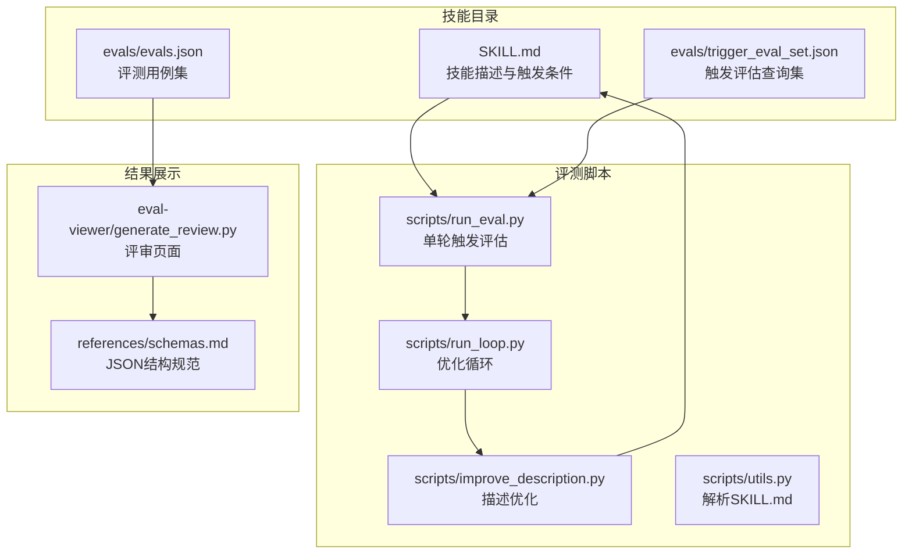
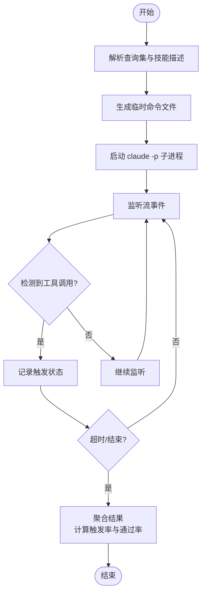
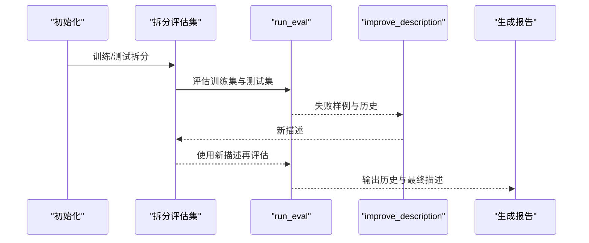
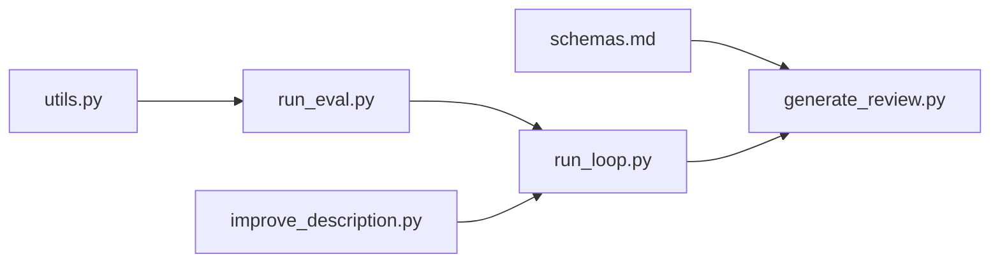

# 测试用例设计

<cite>
**本文档引用的文件**
- [evals.json](file://skills/public/systematic-literature-review/evals/evals.json)
- [trigger_eval_set.json](file://skills/public/systematic-literature-review/evals/trigger_eval_set.json)
- [run_eval.py](file://skills/public/skill-creator/scripts/run_eval.py)
- [run_loop.py](file://skills/public/skill-creator/scripts/run_loop.py)
- [improve_description.py](file://skills/public/skill-creator/scripts/improve_description.py)
- [utils.py](file://skills/public/skill-creator/scripts/utils.py)
- [schemas.md](file://skills/public/skill-creator/references/schemas.md)
- [generate_review.py](file://skills/public/skill-creator/eval-viewer/generate_review.py)
- [SKILL.md](file://skills/public/skill-creator/SKILL.md)
</cite>

## 目录
1. [简介](#简介)
2. [项目结构](#项目结构)
3. [核心组件](#核心组件)
4. [架构总览](#架构总览)
5. [详细组件分析](#详细组件分析)
6. [依赖分析](#依赖分析)
7. [性能考虑](#性能考虑)
8. [故障排除指南](#故障排除指南)
9. [结论](#结论)
10. [附录](#附录)

## 简介
本指南面向 DeerFlow 技能测试用例设计，聚焦于如何基于系统化的评估框架创建高质量的测试套件。文档围绕以下目标展开：
- 解释 evals.json 的结构与字段语义（id、prompt、expected_output、files、expectations 等）
- 说明如何编写有效的测试查询（queries），包括正向与负向测试用例的设计方法
- 解释 should_trigger 字段的作用与判断标准，并给出基于技能描述的测试场景构建策略
- 提供具体的测试用例示例与模板，帮助开发者快速创建可验证、可量化的测试套件

## 项目结构
DeerFlow 的技能测试体系由“技能描述 + 触发评估 + 评测执行 + 结果可视化”四部分组成：
- 技能描述：位于 SKILL.md，包含触发条件、工作流、资源等
- 触发评估：trigger_eval_set.json 定义查询集合与期望触发行为
- 评测执行：run_eval.py 与 run_loop.py 负责批量运行查询并评估触发准确率
- 结果可视化：generate_review.py 生成评审页面，便于人工审阅与统计分析



图表来源
- [run_eval.py:1-311](file://skills/public/skill-creator/scripts/run_eval.py#L1-L311)
- [run_loop.py:1-329](file://skills/public/skill-creator/scripts/run_loop.py#L1-L329)
- [improve_description.py:1-248](file://skills/public/skill-creator/scripts/improve_description.py#L1-L248)
- [utils.py:1-48](file://skills/public/skill-creator/scripts/utils.py#L1-L48)
- [generate_review.py:1-472](file://skills/public/skill-creator/eval-viewer/generate_review.py#L1-L472)
- [schemas.md:1-431](file://skills/public/skill-creator/references/schemas.md#L1-L431)

章节来源
- [run_eval.py:1-311](file://skills/public/skill-creator/scripts/run_eval.py#L1-L311)
- [run_loop.py:1-329](file://skills/public/skill-creator/scripts/run_loop.py#L1-L329)
- [improve_description.py:1-248](file://skills/public/skill-creator/scripts/improve_description.py#L1-L248)
- [utils.py:1-48](file://skills/public/skill-creator/scripts/utils.py#L1-L48)
- [generate_review.py:1-472](file://skills/public/skill-creator/eval-viewer/generate_review.py#L1-L472)
- [schemas.md:1-431](file://skills/public/skill-creator/references/schemas.md#L1-L431)

## 核心组件
- evals.json：定义技能评测用例，包含任务提示、预期输出、输入文件与可验证期望
- trigger_eval_set.json：定义触发评估查询集，标注 should_trigger 与理由
- run_eval.py：批量执行查询，计算触发率并输出结果
- run_loop.py：训练/测试拆分、迭代优化描述、生成报告
- improve_description.py：基于失败样例生成新的描述文本
- generate_review.py：扫描工作区输出，生成评审页面
- schemas.md：统一的 JSON 结构规范，确保评测数据一致性

章节来源
- [evals.json:1-80](file://skills/public/systematic-literature-review/evals/evals.json#L1-L80)
- [trigger_eval_set.json:1-103](file://skills/public/systematic-literature-review/evals/trigger_eval_set.json#L1-L103)
- [run_eval.py:1-311](file://skills/public/skill-creator/scripts/run_eval.py#L1-L311)
- [run_loop.py:1-329](file://skills/public/skill-creator/scripts/run_loop.py#L1-L329)
- [improve_description.py:1-248](file://skills/public/skill-creator/scripts/improve_description.py#L1-L248)
- [generate_review.py:1-472](file://skills/public/skill-creator/eval-viewer/generate_review.py#L1-L472)
- [schemas.md:1-431](file://skills/public/skill-creator/references/schemas.md#L1-L431)

## 架构总览
下图展示了从查询到结果的完整流程：用户输入查询 → 批量评估 → 结果统计 → 描述优化 → 再评估 → 可视化评审。

```mermaid
sequenceDiagram
participant User as "用户"
participant Runner as "run_eval.py"
participant Loop as "run_loop.py"
participant Improver as "improve_description.py"
participant Viewer as "generate_review.py"
User->>Runner : 提交查询集与技能描述
Runner->>Runner : 并行执行查询，统计触发率
Runner-->>Loop : 输出评估结果
Loop->>Improver : 基于失败样例生成新描述
Improver-->>Loop : 返回优化后的描述
Loop-->>Viewer : 输出历史与最终描述
Viewer-->>User : 展示评审页面与统计数据
```

图表来源
- [run_eval.py:184-256](file://skills/public/skill-creator/scripts/run_eval.py#L184-L256)
- [run_loop.py:47-242](file://skills/public/skill-creator/scripts/run_loop.py#L47-L242)
- [improve_description.py:50-191](file://skills/public/skill-creator/scripts/improve_description.py#L50-L191)
- [generate_review.py:387-472](file://skills/public/skill-creator/eval-viewer/generate_review.py#L387-L472)

## 详细组件分析

### evals.json 结构与字段语义
- skill_name：技能名称，应与 SKILL.md frontmatter 中 name 一致
- evals[]：评测用例数组
  - id：唯一标识符，用于追踪与报告
  - prompt：要执行的任务提示
  - expected_output：人类可读的成功描述
  - files：可选，相对技能根目录的输入文件路径列表
  - expectations：可验证的断言清单，描述期望的行为或产物特征

章节来源
- [evals.json:1-80](file://skills/public/systematic-literature-review/evals/evals.json#L1-L80)
- [schemas.md:7-36](file://skills/public/skill-creator/references/schemas.md#L7-L36)

### trigger_eval_set.json 结构与 should_trigger 判断
- query：用户可能的真实查询
- should_trigger：布尔值，表示该查询是否应触发技能
- rationale：简短理由，解释为何应触发或不应触发

should_trigger 的判断标准（结合示例）：
- 明确的系统综述/文献回顾意图：如“Do a systematic literature review on...”
- 多论文合成需求：如“Review the literature on...”、“Compare evaluation frameworks...”
- 具体范围与格式要求：如“APA format”、“IEEE format”、“15 papers”
- 单篇论文 URL 或事实性问题：不应触发，应路由到其他技能
- 模糊或单一事实性问题：不应触发

章节来源
- [trigger_eval_set.json:1-103](file://skills/public/systematic-literature-review/evals/trigger_eval_set.json#L1-L103)

### run_eval.py：批量触发评估
- 功能要点
  - 读取查询集，逐条运行 Claude 触发评估
  - 通过流事件提前检测触发（content_block_start），减少等待
  - 支持超时控制、并发执行、多次运行取平均
  - 输出每条查询的触发率、是否通过阈值、总体统计
- 关键流程
  - 生成临时命令文件，注入技能描述
  - 启动 claude -p 子进程，解析流事件与助手消息
  - 统计 should_trigger 与实际触发情况，计算通过率



图表来源
- [run_eval.py:35-182](file://skills/public/skill-creator/scripts/run_eval.py#L35-L182)
- [run_eval.py:184-256](file://skills/public/skill-creator/scripts/run_eval.py#L184-L256)

章节来源
- [run_eval.py:1-311](file://skills/public/skill-creator/scripts/run_eval.py#L1-L311)

### run_loop.py：优化循环与训练/测试拆分
- 功能要点
  - 将评估集按 should_trigger 分层随机拆分为训练集与测试集
  - 运行一轮评估，统计训练/测试得分
  - 基于失败样例调用 Claude 生成新的描述
  - 重复直到全部通过或达到最大迭代次数
  - 生成 HTML 报告，记录每次迭代的历史
- 关键流程
  - split_eval_set：按比例拆分，保持类别平衡
  - run_eval：并行评估训练+测试
  - improve_description：生成新描述
  - 生成报告与历史记录



图表来源
- [run_loop.py:24-44](file://skills/public/skill-creator/scripts/run_loop.py#L24-L44)
- [run_loop.py:47-242](file://skills/public/skill-creator/scripts/run_loop.py#L47-L242)

章节来源
- [run_loop.py:1-329](file://skills/public/skill-creator/scripts/run_loop.py#L1-L329)

### improve_description.py：基于失败样例的描述优化
- 功能要点
  - 识别“未触发但应触发”与“误触发”的查询
  - 基于历史尝试与技能内容生成新的描述
  - 控制字符长度（不超过 1024），必要时二次压缩
  - 记录日志以便回溯
- 优化建议
  - 强调用户意图而非实现细节
  - 使用祈使句式，突出触发关键词
  - 避免过度拟合特定查询，保持泛化能力

章节来源
- [improve_description.py:50-191](file://skills/public/skill-creator/scripts/improve_description.py#L50-L191)
- [SKILL.md:333-405](file://skills/public/skill-creator/SKILL.md#L333-L405)

### generate_review.py：评审页面与可视化
- 功能要点
  - 扫描工作区中的 outputs/ 目录，收集运行结果
  - 将输出嵌入到自包含的 HTML 页面
  - 提供前后迭代对比、基准统计、反馈收集
- 使用场景
  - 评测后的人工审阅
  - 团队协作与持续改进

章节来源
- [generate_review.py:60-147](file://skills/public/skill-creator/eval-viewer/generate_review.py#L60-L147)
- [generate_review.py:387-472](file://skills/public/skill-creator/eval-viewer/generate_review.py#L387-L472)

## 依赖分析
- 组件耦合
  - run_eval.py 依赖 utils.py 解析 SKILL.md
  - run_loop.py 依赖 run_eval.py 与 improve_description.py
  - generate_review.py 依赖 schemas.md 的结构规范
- 外部依赖
  - claude -p 子进程用于触发评估与描述优化
  - 文件系统用于保存中间结果与评审页面



图表来源
- [utils.py:1-48](file://skills/public/skill-creator/scripts/utils.py#L1-L48)
- [run_eval.py:1-311](file://skills/public/skill-creator/scripts/run_eval.py#L1-L311)
- [run_loop.py:1-329](file://skills/public/skill-creator/scripts/run_loop.py#L1-L329)
- [improve_description.py:1-248](file://skills/public/skill-creator/scripts/improve_description.py#L1-L248)
- [generate_review.py:1-472](file://skills/public/skill-creator/eval-viewer/generate_review.py#L1-L472)

章节来源
- [utils.py:1-48](file://skills/public/skill-creator/scripts/utils.py#L1-L48)
- [run_eval.py:1-311](file://skills/public/skill-creator/scripts/run_eval.py#L1-L311)
- [run_loop.py:1-329](file://skills/public/skill-creator/scripts/run_loop.py#L1-L329)
- [improve_description.py:1-248](file://skills/public/skill-creator/scripts/improve_description.py#L1-L248)
- [generate_review.py:1-472](file://skills/public/skill-creator/eval-viewer/generate_review.py#L1-L472)

## 性能考虑
- 并发与超时
  - run_eval.py 支持多进程并发与超时控制，避免长时间阻塞
  - 合理设置 runs-per-query 与 num-workers，平衡吞吐与稳定性
- 触发检测优化
  - 通过流事件提前判断触发，减少等待时间
- 描述长度限制
  - 限制描述长度以避免截断，必要时进行二次压缩

## 故障排除指南
- 查询未触发
  - 检查查询是否具备明确的多论文合成意图与范围
  - 确认 should_trigger 与实际触发率是否一致
- 误触发
  - 识别相近领域但不适用的查询，调整描述关键词
  - 使用 run_loop 的训练/测试拆分避免过拟合
- 评审页面空白
  - 确认工作区包含 outputs/ 目录与有效输出文件
  - 检查 generate_review.py 的端口占用与权限

章节来源
- [run_eval.py:184-256](file://skills/public/skill-creator/scripts/run_eval.py#L184-L256)
- [run_loop.py:153-176](file://skills/public/skill-creator/scripts/run_loop.py#L153-L176)
- [generate_review.py:438-468](file://skills/public/skill-creator/eval-viewer/generate_review.py#L438-L468)

## 结论
通过系统化的测试用例设计与评估流程，可以显著提升技能触发的准确性与稳定性。建议遵循以下实践：
- 以用户意图为核心设计评测用例，覆盖正向与负向场景
- 使用 should_trigger 与 rationale 明确边界，避免模糊判断
- 借助 run_loop 的优化循环持续改进描述，保持泛化能力
- 用 generate_review.py 进行可视化评审，促进团队协作与持续改进

## 附录

### evals.json 字段详解
- skill_name：技能名称，与 SKILL.md frontmatter 对齐
- evals[].id：用例唯一标识
- evals[].prompt：任务提示
- evals[].expected_output：成功描述
- evals[].files：输入文件路径（相对技能根目录）
- evals[].expectations：可验证断言清单

章节来源
- [schemas.md:7-36](file://skills/public/skill-creator/references/schemas.md#L7-L36)

### 触发评估查询设计模板
- 正向用例（should_trigger=true）
  - 明确的系统综述/文献回顾意图
  - 具备范围、数量、格式等约束
  - 示例：Do a systematic literature review on diffusion models... APA format
- 负向用例（should_trigger=false）
  - 单篇论文 URL 或事实性问题
  - 通用搜索或翻译等非学术任务
  - 示例：Review this paper: https://arxiv.org/abs/...

章节来源
- [trigger_eval_set.json:1-103](file://skills/public/systematic-literature-review/evals/trigger_eval_set.json#L1-L103)

### 评测执行与报告生成流程
- run_eval.py：批量评估查询，输出触发率与通过情况
- run_loop.py：训练/测试拆分、迭代优化、生成报告
- generate_review.py：扫描工作区，生成评审页面

章节来源
- [run_eval.py:184-256](file://skills/public/skill-creator/scripts/run_eval.py#L184-L256)
- [run_loop.py:47-242](file://skills/public/skill-creator/scripts/run_loop.py#L47-L242)
- [generate_review.py:387-472](file://skills/public/skill-creator/eval-viewer/generate_review.py#L387-L472)