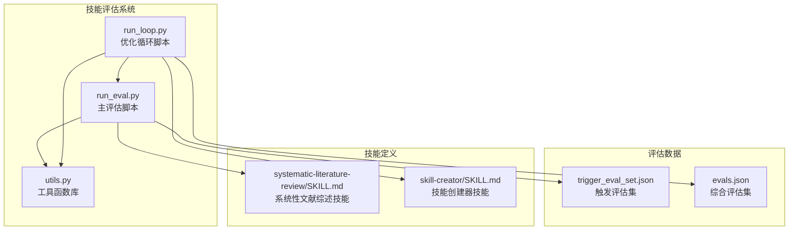
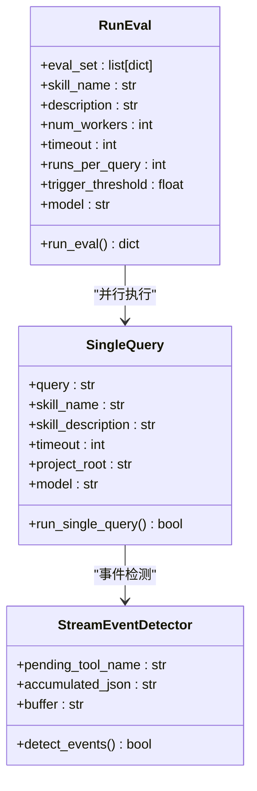
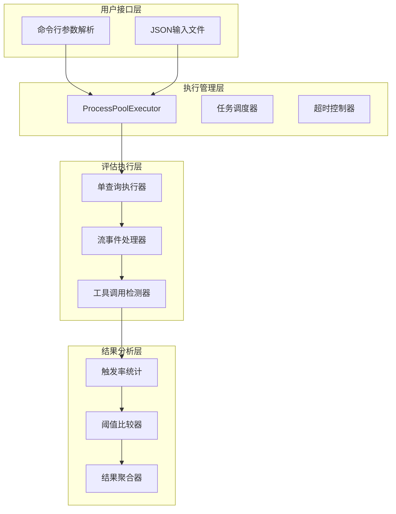
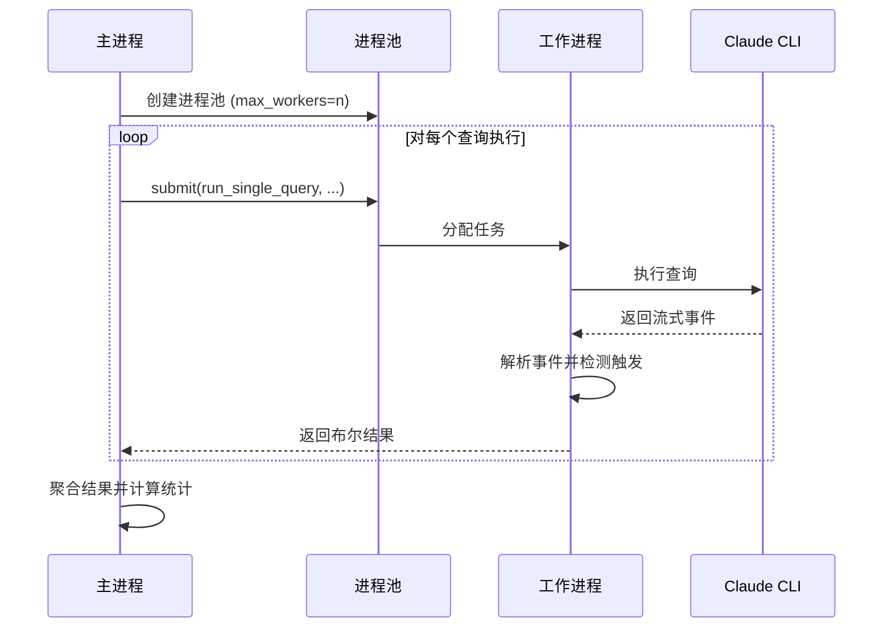
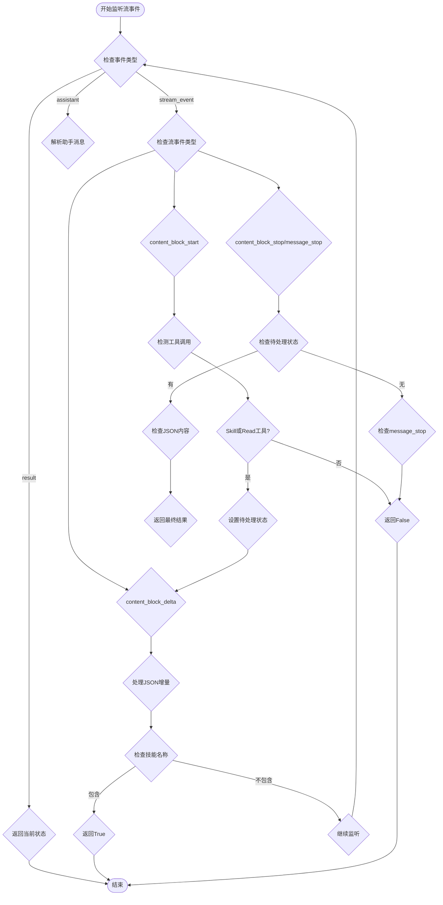
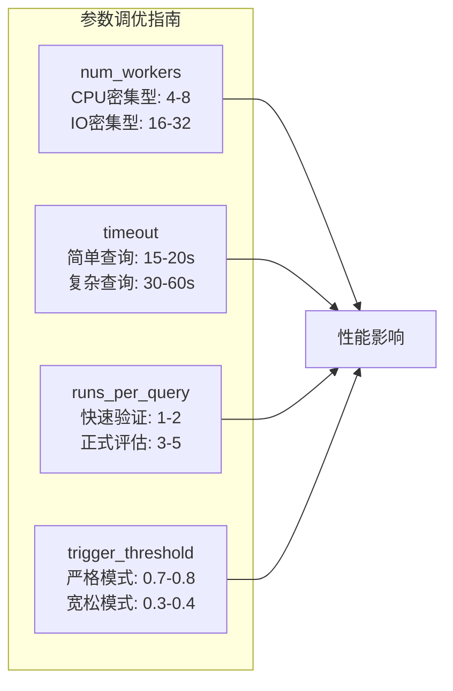
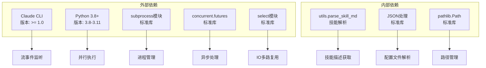
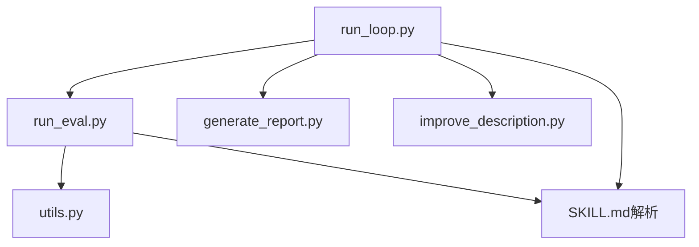
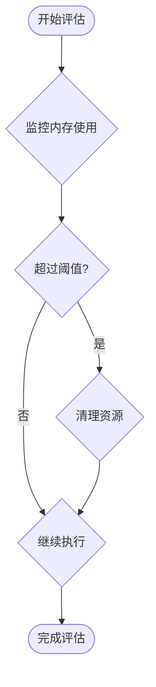

# 评估执行流程

<cite>
**本文档引用的文件**
- [run_eval.py](file://skills/public/skill-creator/scripts/run_eval.py)
- [run_loop.py](file://skills/public/skill-creator/scripts/run_loop.py)
- [utils.py](file://skills/public/skill-creator/scripts/utils.py)
- [trigger_eval_set.json](file://skills/public/systematic-literature-review/evals/trigger_eval_set.json)
- [evals.json](file://skills/public/systematic-literature-review/evals/evals.json)
- [SKILL.md](file://skills/public/systematic-literature-review/SKILL.md)
- [SKILL.md](file://skills/public/skill-creator/SKILL.md)
</cite>

## 目录
1. [简介](#简介)
2. [项目结构概览](#项目结构概览)
3. [核心组件分析](#核心组件分析)
4. [架构概述](#架构概述)
5. [详细组件分析](#详细组件分析)
6. [依赖关系分析](#依赖关系分析)
7. [性能考虑](#性能考虑)
8. [故障排除指南](#故障排除指南)
9. [结论](#结论)

## 简介

DeerFlow 的评估执行流程是一个基于 Python 的技能评估系统，专门用于测试和优化技能描述的触发准确性。该系统通过并行执行机制、超时控制和进程池管理，实现了高效的技能评估流程。本文档将详细介绍 run_eval.py 脚本的工作原理、参数配置选项以及技能触发检测的技术实现。

## 项目结构概览

DeerFlow 项目采用模块化设计，评估相关的核心文件位于 `skills/public/skill-creator/scripts/` 目录下：

**图表来源**
- [run_eval.py:1-311](file://skills/public/skill-creator/scripts/run_eval.py#L1-L311)
- [run_loop.py:1-329](file://skills/public/skill-creator/scripts/run_loop.py#L1-L329)

## 核心组件分析

### 主要评估脚本 (run_eval.py)

run_eval.py 是整个评估系统的核心，提供了完整的技能触发评估功能：

#### 核心功能模块

1. **并行执行引擎**: 使用 `ProcessPoolExecutor` 实现多进程并行处理
2. **超时控制机制**: 每个查询都有独立的超时限制
3. **流事件检测**: 实时监控 Claude 的流式输出事件
4. **工具调用识别**: 检测特定的工具调用模式
5. **结果聚合分析**: 统计触发率并计算评估结果

#### 关键数据结构

**图表来源**
- [run_eval.py:184-256](file://skills/public/skill-creator/scripts/run_eval.py#L184-L256)
- [run_eval.py:35-182](file://skills/public/skill-creator/scripts/run_eval.py#L35-L182)

**章节来源**
- [run_eval.py:1-311](file://skills/public/skill-creator/scripts/run_eval.py#L1-L311)

## 架构概述

评估系统的整体架构采用分层设计，从底层的流事件检测到上层的评估结果分析：

**图表来源**
- [run_eval.py:184-256](file://skills/public/skill-creator/scripts/run_eval.py#L184-L256)
- [run_loop.py:47-137](file://skills/public/skill-creator/scripts/run_loop.py#L47-L137)

## 详细组件分析

### 并行执行机制

#### 进程池管理

评估系统使用 `ProcessPoolExecutor` 实现高效的并行处理：

**图表来源**
- [run_eval.py:198-211](file://skills/public/skill-creator/scripts/run_eval.py#L198-L211)
- [run_eval.py:215-226](file://skills/public/skill-creator/scripts/run_eval.py#L215-L226)

#### 超时控制策略

系统实现了多层次的超时控制机制：

1. **查询级超时**: 每个查询都有独立的超时限制
2. **进程级清理**: 超时后自动清理子进程资源
3. **流式事件超时**: 基于时间戳的实时超时检查

**章节来源**
- [run_eval.py:100-107](file://skills/public/skill-creator/scripts/run_eval.py#L100-L107)
- [run_eval.py:172-177](file://skills/public/skill-creator/scripts/run_eval.py#L172-L177)

### 技能触发检测机制

#### 流事件检测

系统通过监听 Claude 的流式事件来实现实时触发检测：

**图表来源**
- [run_eval.py:128-171](file://skills/public/skill-creator/scripts/run_eval.py#L128-L171)

#### 工具调用识别

系统能够识别特定的工具调用模式：

| 工具名称 | 用途 | 触发条件 |
|---------|------|----------|
| Skill | 技能触发工具 | 当技能名称出现在工具输入中 |
| Read | 文件读取工具 | 当文件路径包含技能名称 |
| 其他工具 | 其他工具调用 | 不影响技能触发判断 |

**章节来源**
- [run_eval.py:133-168](file://skills/public/skill-creator/scripts/run_eval.py#L133-L168)

### 评估参数配置

#### 核心参数详解

| 参数名 | 类型 | 默认值 | 描述 | 影响范围 |
|--------|------|--------|------|----------|
| num_workers | int | 10 | 并行工作进程数量 | 性能和资源消耗 |
| timeout | int | 30 | 单个查询超时时间(秒) | 评估准确性和响应速度 |
| runs_per_query | int | 3 | 每个查询的运行次数 | 结果稳定性和评估可靠性 |
| trigger_threshold | float | 0.5 | 触发率阈值 | 评估结果判定标准 |
| model | str | None | 使用的模型标识 | 评估一致性 |

#### 参数优化建议

**图表来源**
- [run_eval.py:264-269](file://skills/public/skill-creator/scripts/run_eval.py#L264-L269)
- [run_loop.py:249-255](file://skills/public/skill-creator/scripts/run_loop.py#L249-L255)

**章节来源**
- [run_eval.py:259-306](file://skills/public/skill-creator/scripts/run_eval.py#L259-L306)
- [run_loop.py:244-325](file://skills/public/skill-creator/scripts/run_loop.py#L244-L325)

## 依赖关系分析

### 外部依赖

评估系统主要依赖以下外部组件：

**图表来源**
- [run_eval.py:8-19](file://skills/public/skill-creator/scripts/run_eval.py#L8-L19)
- [utils.py:7-47](file://skills/public/skill-creator/scripts/utils.py#L7-L47)

### 内部模块依赖

**图表来源**
- [run_loop.py:18-21](file://skills/public/skill-creator/scripts/run_loop.py#L18-L21)

**章节来源**
- [run_eval.py:1-311](file://skills/public/skill-creator/scripts/run_eval.py#L1-L311)
- [run_loop.py:1-329](file://skills/public/skill-creator/scripts/run_loop.py#L1-L329)

## 性能考虑

### 并行执行优化

1. **进程池大小调优**: 根据 CPU 核心数和内存容量合理设置 `num_workers`
2. **超时参数优化**: 避免过长的超时导致资源浪费
3. **内存管理**: 及时清理临时文件和进程资源

### I/O 性能优化

1. **流式处理**: 使用 `select` 模块实现高效的流式事件监听
2. **缓冲区管理**: 合理设置缓冲区大小避免内存溢出
3. **文件操作优化**: 使用 `pathlib` 进行高效的路径操作

### 内存使用监控

## 故障排除指南

### 常见问题及解决方案

#### Claude CLI 未找到

**问题**: `FileNotFoundError: [Errno 2] No such file or directory: 'claude'`

**解决方案**:
1. 确保 Claude CLI 已正确安装
2. 检查系统 PATH 环境变量
3. 验证 Claude CLI 版本兼容性

#### 权限错误

**问题**: `PermissionError: [Errno 13] Permission denied`

**解决方案**:
1. 检查项目根目录的写入权限
2. 确保 `.claude/commands/` 目录可写
3. 以管理员权限运行脚本

#### 超时问题

**问题**: 查询在超时时间内未完成

**解决方案**:
1. 增加 `--timeout` 参数值
2. 简化技能描述
3. 减少 `--num-workers` 数量

### 调试技巧

1. **启用详细日志**: 使用 `--verbose` 参数查看详细的执行过程
2. **检查中间结果**: 查看临时生成的命令文件
3. **验证输入数据**: 确保评估集 JSON 格式正确

**章节来源**
- [run_eval.py:283-305](file://skills/public/skill-creator/scripts/run_eval.py#L283-L305)

## 结论

DeerFlow 的评估执行流程通过精心设计的并行执行机制、精确的超时控制和智能的技能触发检测，为技能优化提供了强大的支持。系统的主要优势包括：

1. **高效性**: 多进程并行执行显著提升评估速度
2. **准确性**: 基于流事件的实时检测确保评估结果的准确性
3. **灵活性**: 可配置的参数允许针对不同场景进行优化
4. **可扩展性**: 模块化的架构便于功能扩展和维护

通过合理配置参数和遵循最佳实践，开发者可以有效地使用该系统来优化技能描述，提高技能触发的准确性和可靠性。