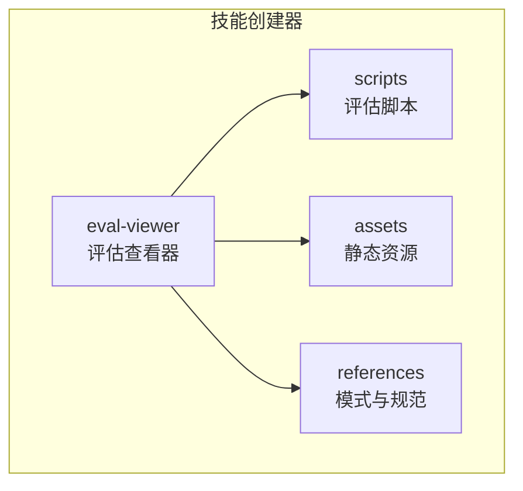
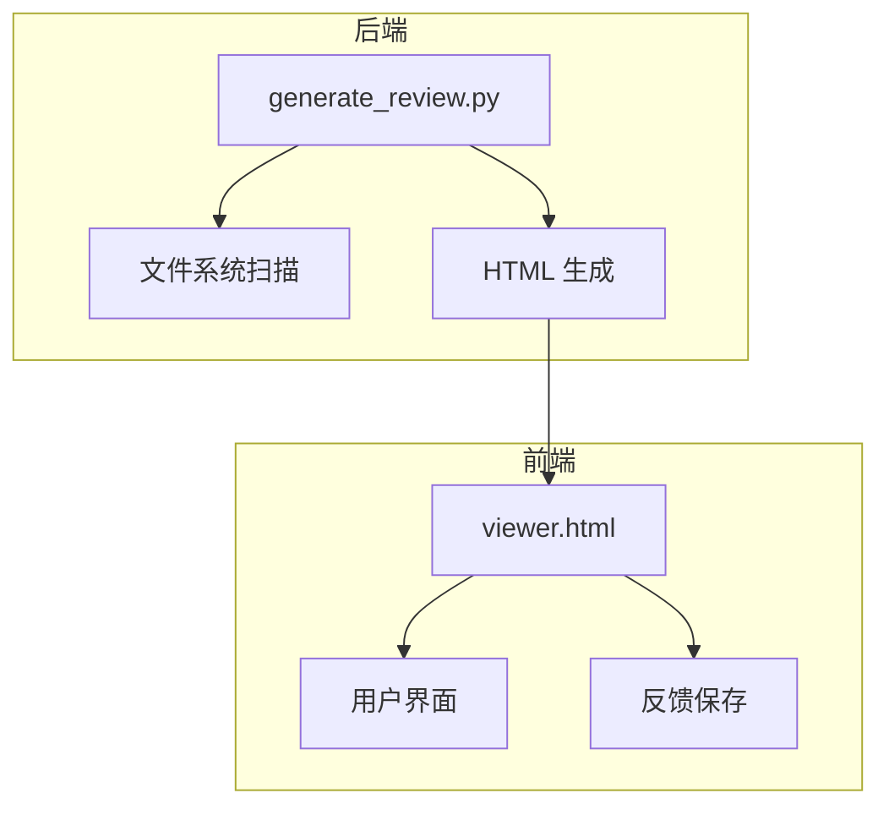
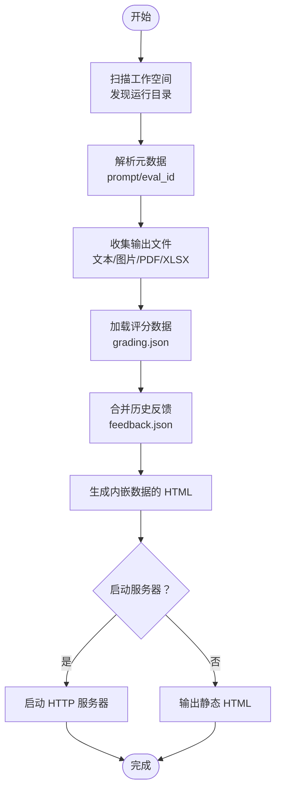
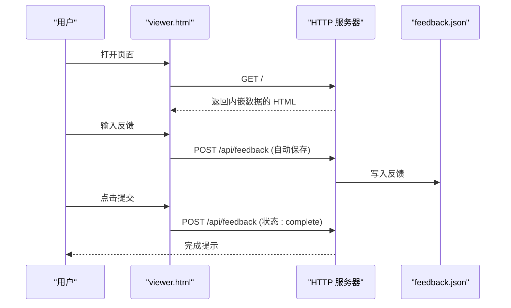
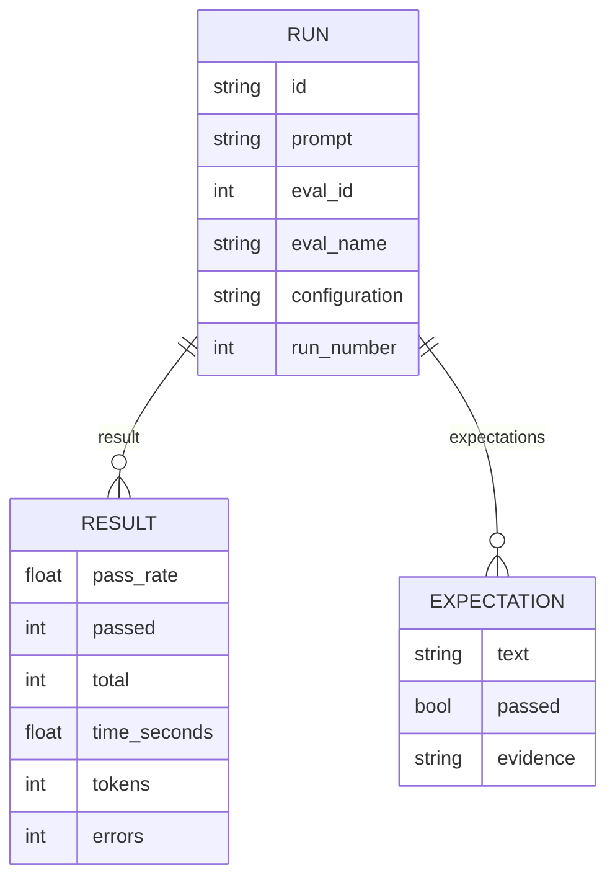
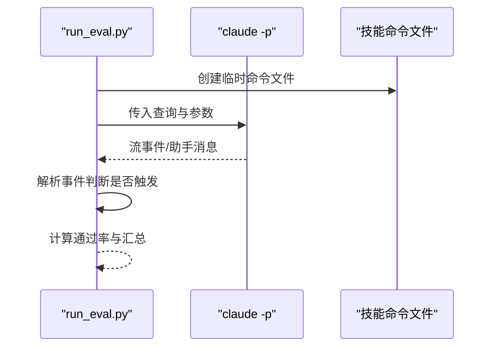
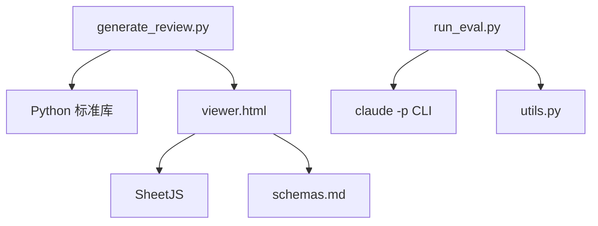

# 评估查看器

<cite>
**本文档引用的文件**
- [generate_review.py](file://skills/public/skill-creator/eval-viewer/generate_review.py)
- [viewer.html](file://skills/public/skill-creator/eval-viewer/viewer.html)
- [eval_review.html](file://skills/public/skill-creator/assets/eval_review.html)
- [run_eval.py](file://skills/public/skill-creator/scripts/run_eval.py)
- [utils.py](file://skills/public/skill-creator/scripts/utils.py)
- [trigger_eval_set.json](file://backend/skills/public/systematic-literature-review/evals/trigger_eval_set.json)
- [evals.json](file://backend/skills/public/systematic-literature-review/evals/evals.json)
- [schemas.md](file://skills/public/skill-creator/references/schemas.md)
- [workflows.md](file://skills/public/skill-creator/references/workflows.md)
</cite>

## 目录
1. [简介](#简介)
2. [项目结构](#项目结构)
3. [核心组件](#核心组件)
4. [架构总览](#架构总览)
5. [详细组件分析](#详细组件分析)
6. [依赖关系分析](#依赖关系分析)
7. [性能考虑](#性能考虑)
8. [故障排除指南](#故障排除指南)
9. [结论](#结论)
10. [附录](#附录)

## 简介
评估查看器是 DeerFlow 技能评估体系中的关键工具，用于可视化展示技能评估结果，支持两种主要视图：
- 输出标签页：面向定性评审，展示每次运行的提示词、输出文件、评分与反馈
- 基准标签页：面向定量分析，展示通过率、耗时、Token 消耗等统计指标及断言级对比

其核心工作流包括：
- 从工作空间扫描运行目录，提取输出文件与评分信息
- 将数据内嵌到自包含的 HTML 页面中
- 启动本地 HTTP 服务器或生成静态页面
- 在浏览器中提供交互式评审体验，支持自动保存反馈

## 项目结构
评估查看器位于技能创建器公共包中，相关文件组织如下：
- eval-viewer：评估查看器核心（Python 脚本与前端模板）
- scripts：评估执行与辅助脚本（触发评估、工具函数）
- assets：其他静态资源（如旧版评估集评审页面）
- references：JSON 模式与工作流规范文档

**图表来源**
- [generate_review.py](file://skills/public/skill-creator/eval-viewer/generate_review.py)
- [viewer.html](file://skills/public/skill-creator/eval-viewer/viewer.html)
- [run_eval.py](file://skills/public/skill-creator/scripts/run_eval.py)
- [eval_review.html](file://skills/public/skill-creator/assets/eval_review.html)
- [schemas.md](file://skills/public/skill-creator/references/schemas.md)

**章节来源**
- [generate_review.py](file://skills/public/skill-creator/eval-viewer/generate_review.py)
- [viewer.html](file://skills/public/skill-creator/eval-viewer/viewer.html)

## 核心组件
- generate_review.py：主程序，负责扫描工作空间、构建运行数据、生成 HTML、启动 HTTP 服务
- viewer.html：前端模板，渲染输出与基准视图，处理用户交互与反馈保存
- run_eval.py：触发评估脚本，用于测试技能描述是否触发（适用于触发率评估）
- utils.py：通用工具，解析 SKILL.md 获取技能名称与描述
- 触发评估集：trigger_eval_set.json，定义查询集合与期望触发行为
- JSON 模式：schemas.md，定义 grading.json、metrics.json、timing.json、benchmark.json 的字段规范
- 工作流模式：workflows.md，指导如何设计可评估的技能工作流

**章节来源**
- [generate_review.py](file://skills/public/skill-creator/eval-viewer/generate_review.py)
- [viewer.html](file://skills/public/skill-creator/eval-viewer/viewer.html)
- [run_eval.py](file://skills/public/skill-creator/scripts/run_eval.py)
- [utils.py](file://skills/public/skill-creator/scripts/utils.py)
- [trigger_eval_set.json](file://backend/skills/public/systematic-literature-review/evals/trigger_eval_set.json)
- [schemas.md](file://skills/public/skill-creator/references/schemas.md)
- [workflows.md](file://skills/public/skill-creator/references/workflows.md)

## 架构总览
评估查看器采用“后端扫描 + 前端渲染”的双层架构：
- 后端（Python）：扫描工作空间，收集运行数据，生成内嵌数据的 HTML
- 前端（HTML/JS/CSS）：接收内嵌数据，渲染输出与基准视图，提供导航与反馈功能

**图表来源**
- [generate_review.py](file://skills/public/skill-creator/eval-viewer/generate_review.py)
- [viewer.html](file://skills/public/skill-creator/eval-viewer/viewer.html)

## 详细组件分析

### generate_review.py 组件分析
generate_review.py 是评估查看器的核心，负责：
- 扫描工作空间，递归发现包含 outputs/ 的运行目录
- 解析运行元数据（prompt、eval_id）、输出文件（文本、图片、PDF、Excel 等）
- 加载评分数据（grading.json），合并历史反馈（feedback.json）
- 生成内嵌数据的 HTML 或启动本地 HTTP 服务器
- 提供 /api/feedback 接口，支持反馈的读取与写入

**图表来源**
- [generate_review.py](file://skills/public/skill-creator/eval-viewer/generate_review.py)

**章节来源**
- [generate_review.py](file://skills/public/skill-creator/eval-viewer/generate_review.py)

### viewer.html 组件分析
viewer.html 提供两个主要视图：
- 输出视图（Outputs）：展示提示词、输出文件列表、历史输出、正式评分、用户反馈
- 基准视图（Benchmark）：展示通过率、耗时、Token 消耗等统计摘要与按评估分组的明细

前端逻辑要点：
- 内嵌数据注入：通过 /*__EMBEDDED_DATA__*/ 注入 Python 生成的数据
- 自动保存反馈：用户输入 800ms 后自动 POST 到 /api/feedback
- 视图切换：根据是否存在基准数据动态显示标签页
- 数据渲染：支持文本、图片、PDF、Excel（借助 SheetJS）等类型输出

**图表来源**
- [viewer.html](file://skills/public/skill-creator/eval-viewer/viewer.html)
- [generate_review.py](file://skills/public/skill-creator/eval-viewer/generate_review.py)

**章节来源**
- [viewer.html](file://skills/public/skill-creator/eval-viewer/viewer.html)

### 评估结果数据模型
评估查看器遵循严格的 JSON 模式，确保前后端一致解析：
- grading.json：包含期望断言、摘要统计、执行指标、计时信息等
- metrics.json：工具调用次数、步骤数、输出大小、错误数等
- timing.json：总耗时、执行器与评分器耗时等
- benchmark.json：基准运行元数据、每条运行结果、统计摘要与分析备注

**图表来源**
- [schemas.md](file://skills/public/skill-creator/references/schemas.md)

**章节来源**
- [schemas.md](file://skills/public/skill-creator/references/schemas.md)

### 触发率评估脚本分析
run_eval.py 用于评估技能描述是否触发（即是否让 Claude 选择该技能）。其工作流程：
- 从 SKILL.md 解析技能名称与描述
- 为每个查询创建临时命令文件，使其出现在可用技能列表中
- 使用 claude -p 运行查询，监听流事件以尽早检测工具调用
- 统计触发次数并计算通过率，输出评估结果

**图表来源**
- [run_eval.py](file://skills/public/skill-creator/scripts/run_eval.py)
- [utils.py](file://skills/public/skill-creator/scripts/utils.py)

**章节来源**
- [run_eval.py](file://skills/public/skill-creator/scripts/run_eval.py)
- [utils.py](file://skills/public/skill-creator/scripts/utils.py)

### 触发评估集与工作流
- 触发评估集：trigger_eval_set.json 定义了查询集合与期望触发行为，便于验证技能描述的触发准确性
- 工作流模式：workflows.md 提供顺序与条件工作流的编写建议，有助于设计可评估的技能

**章节来源**
- [trigger_eval_set.json](file://backend/skills/public/systematic-literature-review/evals/trigger_eval_set.json)
- [workflows.md](file://skills/public/skill-creator/references/workflows.md)

## 依赖关系分析
评估查看器的依赖关系清晰且内聚：
- generate_review.py 依赖标准库（HTTP 服务器、文件系统、JSON、正则表达式等）
- viewer.html 依赖 SheetJS 渲染 Excel，依赖内嵌数据结构
- run_eval.py 依赖外部 CLI（claude -p）与子进程通信
- JSON 模式文档为前后端契约，避免字段不一致导致的解析失败

**图表来源**
- [generate_review.py](file://skills/public/skill-creator/eval-viewer/generate_review.py)
- [viewer.html](file://skills/public/skill-creator/eval-viewer/viewer.html)
- [run_eval.py](file://skills/public/skill-creator/scripts/run_eval.py)
- [utils.py](file://skills/public/skill-creator/scripts/utils.py)
- [schemas.md](file://skills/public/skill-creator/references/schemas.md)

**章节来源**
- [generate_review.py](file://skills/public/skill-creator/eval-viewer/generate_review.py)
- [viewer.html](file://skills/public/skill-creator/eval-viewer/viewer.html)
- [run_eval.py](file://skills/public/skill-creator/scripts/run_eval.py)
- [utils.py](file://skills/public/skill-creator/scripts/utils.py)
- [schemas.md](file://skills/public/skill-creator/references/schemas.md)

## 性能考虑
- 本地 HTTP 服务器：仅监听 127.0.0.1，避免网络暴露；端口冲突时自动寻找空闲端口
- 反馈自动保存：800ms 延迟减少频繁写入，提升交互流畅度
- 输出内嵌：将数据与资源内嵌到 HTML，减少请求次数，提高首屏渲染速度
- Excel 渲染：使用 SheetJS 在前端渲染，避免额外下载与二次打开

[本节为通用建议，无需特定文件来源]

## 故障排除指南
常见问题与解决方法：
- 端口占用：脚本会尝试终止占用端口的进程并重试；若失败，可更换端口或手动释放端口
- 反馈未保存：检查 /api/feedback 是否返回 200；若服务器不可用，最终提交时会下载 feedback.json
- 输出无法显示：确认输出文件扩展名在支持列表中；二进制文件将以下载链接形式呈现
- 基准数据为空：确保提供有效的 benchmark.json，并包含 metadata、runs、run_summary 字段

**章节来源**
- [generate_review.py](file://skills/public/skill-creator/eval-viewer/generate_review.py)
- [viewer.html](file://skills/public/skill-creator/eval-viewer/viewer.html)

## 结论
评估查看器通过简洁的后端扫描与强大的前端渲染，实现了从定性评审到定量分析的全链路可视化。配合标准化的 JSON 模式与触发评估脚本，开发者可以高效地定位技能问题、量化改进效果，并持续优化技能表现。

[本节为总结性内容，无需特定文件来源]

## 附录

### 使用指南：输出标签页
- 导航：使用左右箭头或按钮在运行间切换
- 提示词：顶部显示当前运行的提示词，可识别配置标签（如 with_skill、without_skill）
- 输出文件：支持文本、图片、PDF、Excel 等类型；点击下载按钮可直接下载
- 历史输出：可折叠查看上一轮迭代的输出，便于对比
- 正式评分：展示断言清单与证据，帮助理解评分依据
- 用户反馈：在文本框中记录评审意见，自动保存并在提交时统一导出

**章节来源**
- [viewer.html](file://skills/public/skill-creator/eval-viewer/viewer.html)

### 使用指南：基准标签页
- 摘要表：对比“含技能”与“不含技能”的通过率、耗时、Token 消耗均值与标准差
- 按评估分组：列出每条评估下的运行详情与平均值
- 断言级对比：按断言维度对比不同配置的通过情况
- 分析备注：展示观察与建议，辅助决策

**章节来源**
- [viewer.html](file://skills/public/skill-creator/eval-viewer/viewer.html)
- [schemas.md](file://skills/public/skill-creator/references/schemas.md)

### 触发率评估：generate_review.py 与 run_eval.py 协同
- generate_review.py：生成评审页面，展示触发率评估结果
- run_eval.py：独立运行触发评估，输出 JSON 结果，供评审页面使用

**章节来源**
- [generate_review.py](file://skills/public/skill-creator/eval-viewer/generate_review.py)
- [run_eval.py](file://skills/public/skill-creator/scripts/run_eval.py)
- [utils.py](file://skills/public/skill-creator/scripts/utils.py)
- [trigger_eval_set.json](file://backend/skills/public/systematic-literature-review/evals/trigger_eval_set.json)