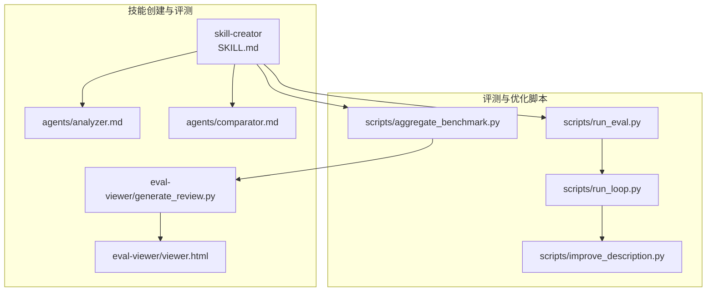
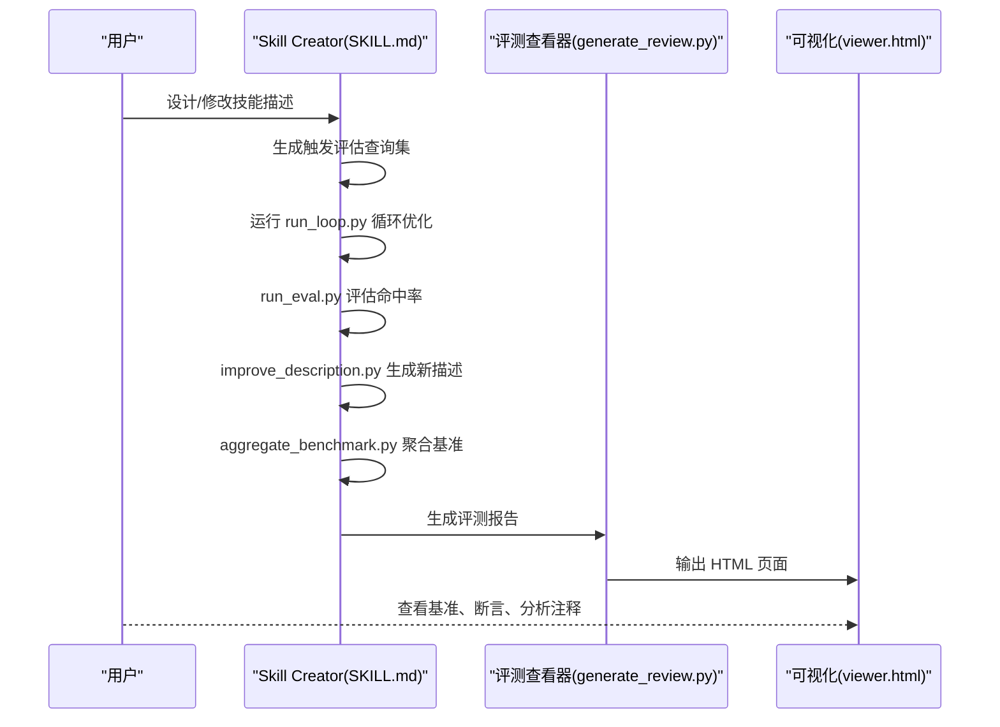
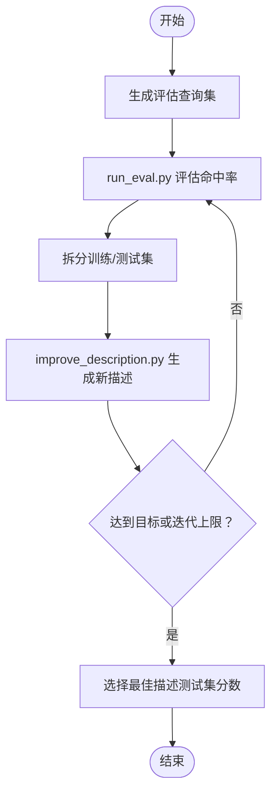
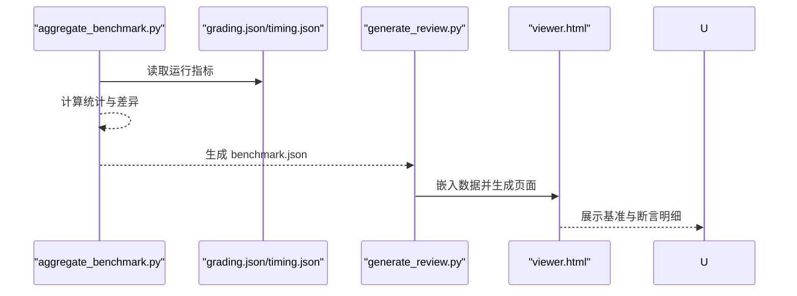
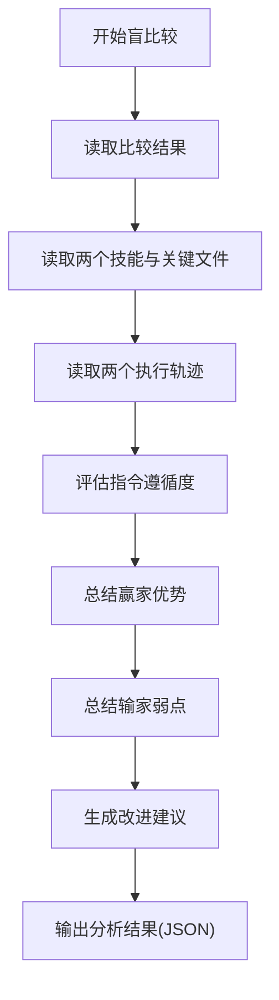
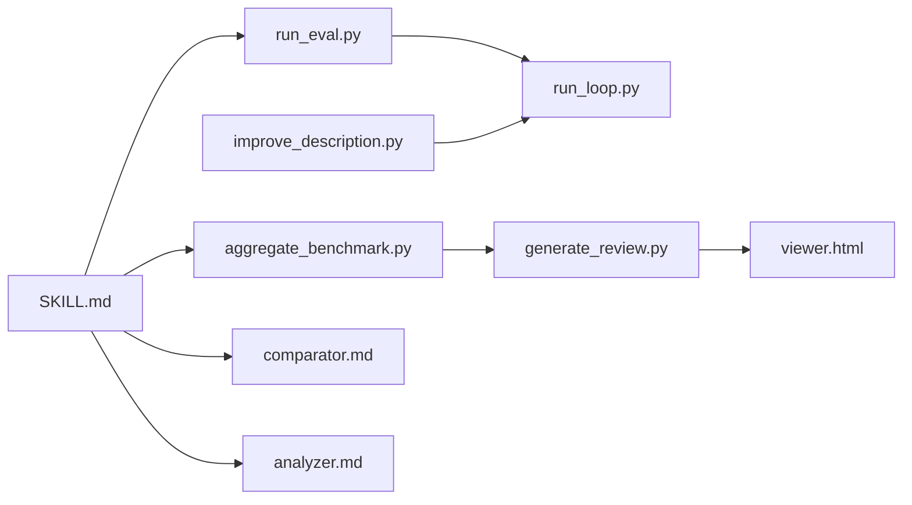

# 技能调试与优化

<cite>
**本文引用的文件**   
- [backend/README.md](file://backend/README.md)
- [backend/docs/ARCHITECTURE.md](file://backend/docs/ARCHITECTURE.md)
- [backend/docs/AUTH_TEST_PLAN.md](file://backend/docs/AUTH_TEST_PLAN.md)
- [backend/docs/MEMORY_IMPROVEMENTS.md](file://backend/docs/MEMORY_IMPROVEMENTS.md)
- [backend/docs/GUARDRAILS.md](file://backend/docs/GUARDRAILS.md)
- [backend/skills/public/skill-creator/SKILL.md](file://backend/skills/public/skill-creator/SKILL.md)
- [backend/skills/public/skill-creator/agents/analyzer.md](file://backend/skills/public/skill-creator/agents/analyzer.md)
- [backend/skills/public/skill-creator/agents/comparator.md](file://backend/skills/public/skill-creator/agents/comparator.md)
- [backend/skills/public/skill-creator/scripts/run_eval.py](file://backend/skills/public/skill-creator/scripts/run_eval.py)
- [backend/skills/public/skill-creator/scripts/improve_description.py](file://backend/skills/public/skill-creator/scripts/improve_description.py)
- [backend/skills/public/skill-creator/scripts/run_loop.py](file://backend/skills/public/skill-creator/scripts/run_loop.py)
- [backend/skills/public/skill-creator/scripts/aggregate_benchmark.py](file://backend/skills/public/skill-creator/scripts/aggregate_benchmark.py)
- [backend/skills/public/skill-creator/eval-viewer/generate_review.py](file://backend/skills/public/skill-creator/eval-viewer/generate_review.py)
- [backend/skills/public/skill-creator/eval-viewer/viewer.html](file://backend/skills/public/skill-creator/eval-viewer/viewer.html)
- [backend/skills/public/systematic-literature-review/SKILL.md](file://backend/skills/public/systematic-literature-review/SKILL.md)
</cite>

## 目录
1. [简介](#简介)
2. [项目结构](#项目结构)
3. [核心组件](#核心组件)
4. [架构总览](#架构总览)
5. [详细组件分析](#详细组件分析)
6. [依赖关系分析](#依赖关系分析)
7. [性能考量](#性能考量)
8. [故障排查指南](#故障排查指南)
9. [结论](#结论)
10. [附录](#附录)

## 简介
本指南面向 DeerFlow 技能开发者与调试工程师，系统讲解如何高效进行技能调试与优化，涵盖以下主题：
- 技能调试技巧与常见问题排查
- 触发评估与描述优化（触发准确性提升）
- 盲比较系统（Blind Comparison）设计与执行
- 分析器代理（Analyzer Agent）的角色与使用场景
- 基准结果聚合与可视化（Viewer）的使用
- 性能瓶颈定位与优化建议
- 实战案例与优化实例

## 项目结构
本仓库围绕“技能创建与评测”形成完整的闭环工具链，核心位于 backend/skills/public/skill-creator，配套脚本与评测查看器用于量化评估与可视化反馈。

图表来源
- [backend/skills/public/skill-creator/SKILL.md:1-486](file://backend/skills/public/skill-creator/SKILL.md#L1-L486)
- [backend/skills/public/skill-creator/scripts/run_eval.py:1-311](file://backend/skills/public/skill-creator/scripts/run_eval.py#L1-L311)
- [backend/skills/public/skill-creator/scripts/improve_description.py:1-248](file://backend/skills/public/skill-creator/scripts/improve_description.py#L1-L248)
- [backend/skills/public/skill-creator/scripts/run_loop.py:1-329](file://backend/skills/public/skill-creator/scripts/run_loop.py#L1-L329)
- [backend/skills/public/skill-creator/scripts/aggregate_benchmark.py:1-402](file://backend/skills/public/skill-creator/scripts/aggregate_benchmark.py#L1-L402)
- [backend/skills/public/skill-creator/eval-viewer/generate_review.py:1-472](file://backend/skills/public/skill-creator/eval-viewer/generate_review.py#L1-L472)
- [backend/skills/public/skill-creator/eval-viewer/viewer.html:1156-1325](file://backend/skills/public/skill-creator/eval-viewer/viewer.html#L1156-L1325)

章节来源
- [backend/skills/public/skill-creator/SKILL.md:1-486](file://backend/skills/public/skill-creator/SKILL.md#L1-L486)

## 核心组件
- 触发评估与描述优化
  - run_eval.py：批量触发评估，统计命中率与通过情况，支持并行与阈值判定。
  - improve_description.py：基于评估失败项生成新的描述文本，限制字符上限并记录迭代过程。
  - run_loop.py：将评估与改进循环封装，支持训练/测试集拆分、自动报告与最佳描述选择。
- 基准评测与可视化
  - aggregate_benchmark.py：聚合单次运行指标（通过率、耗时、token、工具调用次数、错误数），计算均值/方差/极值与配置间差异。
  - generate_review.py + viewer.html：生成可交互的评测报告页面，支持前后迭代对比、基准表格、断言明细与分析注释。
- 盲比较与后验分析
  - comparator.md：盲比较两份输出，按结构与内容评分并给出胜负理由。
  - analyzer.md：在盲比较后“解盲”，分析赢家优势与输家弱点，提出可操作的技能改进建议。
- 示例技能参考
  - systematic-literature-review/SKILL.md：展示复杂技能的工作流拆分、子代理调度与并发策略，便于理解评测与调试中的并发与资源消耗问题。

章节来源
- [backend/skills/public/skill-creator/scripts/run_eval.py:1-311](file://backend/skills/public/skill-creator/scripts/run_eval.py#L1-L311)
- [backend/skills/public/skill-creator/scripts/improve_description.py:1-248](file://backend/skills/public/skill-creator/scripts/improve_description.py#L1-L248)
- [backend/skills/public/skill-creator/scripts/run_loop.py:1-329](file://backend/skills/public/skill-creator/scripts/run_loop.py#L1-L329)
- [backend/skills/public/skill-creator/scripts/aggregate_benchmark.py:1-402](file://backend/skills/public/skill-creator/scripts/aggregate_benchmark.py#L1-L402)
- [backend/skills/public/skill-creator/eval-viewer/generate_review.py:1-472](file://backend/skills/public/skill-creator/eval-viewer/generate_review.py#L1-L472)
- [backend/skills/public/skill-creator/eval-viewer/viewer.html:1156-1325](file://backend/skills/public/skill-creator/eval-viewer/viewer.html#L1156-L1325)
- [backend/skills/public/skill-creator/agents/comparator.md:48-192](file://backend/skills/public/skill-creator/agents/comparator.md#L48-L192)
- [backend/skills/public/skill-creator/agents/analyzer.md:1-275](file://backend/skills/public/skill-creator/agents/analyzer.md#L1-L275)
- [backend/skills/public/systematic-literature-review/SKILL.md:1-236](file://backend/skills/public/systematic-literature-review/SKILL.md#L1-L236)

## 架构总览
下图展示了从“技能描述优化”到“评测与可视化”的完整流程，以及“盲比较与后验分析”的扩展路径。

图表来源
- [backend/skills/public/skill-creator/SKILL.md:333-406](file://backend/skills/public/skill-creator/SKILL.md#L333-L406)
- [backend/skills/public/skill-creator/scripts/run_loop.py:1-329](file://backend/skills/public/skill-creator/scripts/run_loop.py#L1-L329)
- [backend/skills/public/skill-creator/scripts/run_eval.py:1-311](file://backend/skills/public/skill-creator/scripts/run_eval.py#L1-L311)
- [backend/skills/public/skill-creator/scripts/improve_description.py:1-248](file://backend/skills/public/skill-creator/scripts/improve_description.py#L1-L248)
- [backend/skills/public/skill-creator/scripts/aggregate_benchmark.py:1-402](file://backend/skills/public/skill-creator/scripts/aggregate_benchmark.py#L1-L402)
- [backend/skills/public/skill-creator/eval-viewer/generate_review.py:1-472](file://backend/skills/public/skill-creator/eval-viewer/generate_review.py#L1-L472)
- [backend/skills/public/skill-creator/eval-viewer/viewer.html:1156-1325](file://backend/skills/public/skill-creator/eval-viewer/viewer.html#L1156-L1325)

## 详细组件分析

### 组件A：触发评估与描述优化
- 触发评估（run_eval.py）
  - 功能要点：为每个查询创建临时命令文件注入到 Claude 的可用技能列表，调用 claude -p 并解析流事件以尽早判断是否触发；支持多进程并行、超时控制与多次运行取平均。
  - 关键参数：num_workers、timeout、runs_per_query、trigger_threshold。
  - 输出结构：results（每条查询的命中次数、总运行数、通过与否）、summary（总数/通过数/失败数）。
- 描述优化（improve_description.py）
  - 功能要点：收集“未触发但应触发”和“误触发但不应触发”的失败样例，生成新的描述文本；限制字符上限并记录迭代日志；必要时二次缩短以满足硬性限制。
  - 输入历史：previous attempts，避免重复尝试相同结构。
- 优化循环（run_loop.py）
  - 功能要点：将评估与改进整合为循环，支持训练/测试集拆分防止过拟合；自动生成实时报告；根据测试分数选择最佳描述。

图表来源
- [backend/skills/public/skill-creator/scripts/run_loop.py:47-242](file://backend/skills/public/skill-creator/scripts/run_loop.py#L47-L242)
- [backend/skills/public/skill-creator/scripts/run_eval.py:184-257](file://backend/skills/public/skill-creator/scripts/run_eval.py#L184-L257)
- [backend/skills/public/skill-creator/scripts/improve_description.py:50-192](file://backend/skills/public/skill-creator/scripts/improve_description.py#L50-L192)

章节来源
- [backend/skills/public/skill-creator/scripts/run_eval.py:1-311](file://backend/skills/public/skill-creator/scripts/run_eval.py#L1-L311)
- [backend/skills/public/skill-creator/scripts/improve_description.py:1-248](file://backend/skills/public/skill-creator/scripts/improve_description.py#L1-L248)
- [backend/skills/public/skill-creator/scripts/run_loop.py:1-329](file://backend/skills/public/skill-creator/scripts/run_loop.py#L1-L329)

### 组件B：基准评测与可视化
- 聚合（aggregate_benchmark.py）
  - 功能要点：扫描运行目录，读取 grading.json/timing.json/execution_metrics，提取通过率、耗时、token、工具调用次数、错误数；计算均值/方差/最小/最大与配置间差异。
  - 输出结构：benchmark.json（metadata、runs、run_summary、notes）与 benchmark.md。
- 评测查看器（generate_review.py + viewer.html）
  - 功能要点：递归发现运行目录，嵌入输出文件与评分数据，生成可交互页面；支持前后迭代对比、断言明细、分析注释；提供静态导出能力。
  - 关键字段：配置名动态解析、时间/错误列条件渲染、断言表格按配置分组与平均行。

图表来源
- [backend/skills/public/skill-creator/scripts/aggregate_benchmark.py:67-279](file://backend/skills/public/skill-creator/scripts/aggregate_benchmark.py#L67-L279)
- [backend/skills/public/skill-creator/eval-viewer/generate_review.py:60-282](file://backend/skills/public/skill-creator/eval-viewer/generate_review.py#L60-L282)
- [backend/skills/public/skill-creator/eval-viewer/viewer.html:1156-1325](file://backend/skills/public/skill-creator/eval-viewer/viewer.html#L1156-L1325)

章节来源
- [backend/skills/public/skill-creator/scripts/aggregate_benchmark.py:1-402](file://backend/skills/public/skill-creator/scripts/aggregate_benchmark.py#L1-L402)
- [backend/skills/public/skill-creator/eval-viewer/generate_review.py:1-472](file://backend/skills/public/skill-creator/eval-viewer/generate_review.py#L1-L472)
- [backend/skills/public/skill-creator/eval-viewer/viewer.html:1156-1325](file://backend/skills/public/skill-creator/eval-viewer/viewer.html#L1156-L1325)

### 组件C：盲比较与后验分析
- 盲比较（comparator.md）
  - 功能要点：对两份输出进行结构与内容评分，依据 rubric 与断言通过率决定胜负，并输出详细理由与优劣势清单。
- 后验分析（analyzer.md）
  - 功能要点：在盲比较后“解盲”，对比技能结构差异与执行轨迹，总结赢家优势与输家弱点，提出可操作的改进建议（指令、工具、示例、错误处理、结构、引用）。

图表来源
- [backend/skills/public/skill-creator/agents/comparator.md:48-192](file://backend/skills/public/skill-creator/agents/comparator.md#L48-L192)
- [backend/skills/public/skill-creator/agents/analyzer.md:21-185](file://backend/skills/public/skill-creator/agents/analyzer.md#L21-L185)

章节来源
- [backend/skills/public/skill-creator/agents/comparator.md:48-192](file://backend/skills/public/skill-creator/agents/comparator.md#L48-L192)
- [backend/skills/public/skill-creator/agents/analyzer.md:1-275](file://backend/skills/public/skill-creator/agents/analyzer.md#L1-L275)

### 组件D：示例技能参考（并发与资源消耗）
- systematic-literature-review/SKILL.md 展示了复杂工作流的分阶段执行、子代理调度与并发限制策略，有助于理解评测与调试中的资源消耗与稳定性问题。

章节来源
- [backend/skills/public/systematic-literature-review/SKILL.md:1-236](file://backend/skills/public/systematic-literature-review/SKILL.md#L1-L236)

## 依赖关系分析
- 组件耦合与协作
  - run_loop.py 串联 run_eval.py 与 improve_description.py，形成闭环优化。
  - aggregate_benchmark.py 依赖 grading.json/timing.json/execution_metrics 的规范字段，确保 Viewer 正确渲染。
  - generate_review.py 依赖 viewer.html 的模板结构与字段约定。
- 外部依赖
  - claude -p：用于触发评估与描述改进的外部 CLI。
  - 浏览器/HTTP 服务器：评测查看器在本地启动 HTTP 服务或生成静态 HTML。
- 潜在风险
  - 评测查看器依赖字段名称严格匹配（如 configuration、pass_rate、result 等），若上游生成结构变更会导致空值或零值显示。
  - 并发与超时：run_eval.py 的 num_workers 与 timeout 需结合硬件与模型响应时间调整，避免资源争用与超时导致的评估偏差。

图表来源
- [backend/skills/public/skill-creator/scripts/run_eval.py:1-311](file://backend/skills/public/skill-creator/scripts/run_eval.py#L1-L311)
- [backend/skills/public/skill-creator/scripts/run_loop.py:1-329](file://backend/skills/public/skill-creator/scripts/run_loop.py#L1-L329)
- [backend/skills/public/skill-creator/scripts/improve_description.py:1-248](file://backend/skills/public/skill-creator/scripts/improve_description.py#L1-L248)
- [backend/skills/public/skill-creator/scripts/aggregate_benchmark.py:1-402](file://backend/skills/public/skill-creator/scripts/aggregate_benchmark.py#L1-L402)
- [backend/skills/public/skill-creator/eval-viewer/generate_review.py:1-472](file://backend/skills/public/skill-creator/eval-viewer/generate_review.py#L1-L472)
- [backend/skills/public/skill-creator/eval-viewer/viewer.html:1156-1325](file://backend/skills/public/skill-creator/eval-viewer/viewer.html#L1156-L1325)
- [backend/skills/public/skill-creator/SKILL.md:1-486](file://backend/skills/public/skill-creator/SKILL.md#L1-L486)

章节来源
- [backend/skills/public/skill-creator/SKILL.md:1-486](file://backend/skills/public/skill-creator/SKILL.md#L1-L486)
- [backend/skills/public/skill-creator/scripts/run_eval.py:1-311](file://backend/skills/public/skill-creator/scripts/run_eval.py#L1-L311)
- [backend/skills/public/skill-creator/scripts/aggregate_benchmark.py:1-402](file://backend/skills/public/skill-creator/scripts/aggregate_benchmark.py#L1-L402)
- [backend/skills/public/skill-creator/eval-viewer/generate_review.py:1-472](file://backend/skills/public/skill-creator/eval-viewer/generate_review.py#L1-L472)

## 性能考量
- 触发评估性能
  - 并行度：num_workers 建议不超过 CPU 核心数，避免过度竞争；结合 timeout 防止长尾任务拖慢整体进度。
  - 触发阈值：trigger_threshold 应结合 runs_per_query 的统计稳定性设置，避免误判。
- 基准评测性能
  - 聚合统计：aggregate_benchmark.py 对大量运行进行均值/方差计算，注意磁盘 IO 与 JSON 解析开销。
  - 视图渲染：viewer.html 的断言表格与图片/PDF 内联渲染会增加内存占用，建议在大样本时使用静态导出。
- 示例技能并发
  - systematic-literature-review/SKILL.md 的子代理并发策略（最多 3 个/轮）可作为评测并发上限的参考，避免资源耗尽。

章节来源
- [backend/skills/public/skill-creator/scripts/run_eval.py:184-257](file://backend/skills/public/skill-creator/scripts/run_eval.py#L184-L257)
- [backend/skills/public/skill-creator/scripts/aggregate_benchmark.py:45-225](file://backend/skills/public/skill-creator/scripts/aggregate_benchmark.py#L45-L225)
- [backend/skills/public/systematic-literature-review/SKILL.md:105-125](file://backend/skills/public/systematic-literature-review/SKILL.md#L105-L125)

## 故障排查指南
- 触发评估失败
  - 症状：某些查询始终未触发或误触发。
  - 排查步骤：
    - 检查评估查询的质量与多样性（是否覆盖“应触发/不应触发”的边界场景）。
    - 调整 runs_per_query 与 trigger_threshold，观察统计波动。
    - 使用 run_loop.py 的实时报告定位反复失败的查询，针对性改进描述。
- 评测查看器空白或数值为零
  - 症状：基准页显示空值或零值。
  - 排查步骤：
    - 确认 grading.json 的字段命名与结构符合 schema（如 result.pass_rate、configuration 必须为 with_skill/without_skill）。
    - 确认 aggregate_benchmark.py 读取到 timing.json 与 execution_metrics。
    - 使用 generate_review.py 的 --static 选项生成静态 HTML，排除本地服务问题。
- 盲比较结果异常
  - 症状：比较器难以区分优劣或胜负不稳定。
  - 排查步骤：
    - 检查 comparator.md 的 rubric 与断言是否明确且可量化。
    - 使用 analyzer.md 对比两份执行轨迹，关注指令遵循度与工具使用差异。
- 权限与安全相关
  - 若涉及 Guardrails，确认配置正确（允许/拒绝工具列表、OAP passport 等），避免因策略阻断导致评测中断。
  - 若涉及认证模块，参考 AUTH_TEST_PLAN.md 的测试矩阵与用例，确保登录、会话与多租户隔离正常。

章节来源
- [backend/skills/public/skill-creator/scripts/run_eval.py:184-257](file://backend/skills/public/skill-creator/scripts/run_eval.py#L184-L257)
- [backend/skills/public/skill-creator/scripts/aggregate_benchmark.py:119-173](file://backend/skills/public/skill-creator/scripts/aggregate_benchmark.py#L119-L173)
- [backend/skills/public/skill-creator/eval-viewer/generate_review.py:387-472](file://backend/skills/public/skill-creator/eval-viewer/generate_review.py#L387-L472)
- [backend/skills/public/skill-creator/agents/comparator.md:48-192](file://backend/skills/public/skill-creator/agents/comparator.md#L48-L192)
- [backend/skills/public/skill-creator/agents/analyzer.md:1-275](file://backend/skills/public/skill-creator/agents/analyzer.md#L1-L275)
- [backend/docs/GUARDRAILS.md:1-386](file://backend/docs/GUARDRAILS.md#L1-L386)
- [backend/docs/AUTH_TEST_PLAN.md:1-800](file://backend/docs/AUTH_TEST_PLAN.md#L1-L800)

## 结论
通过“触发评估 + 描述优化 + 基准评测 + 盲比较 + 后验分析”的闭环体系，可以系统性地提升技能的触发准确性、输出质量与稳定性。建议在日常开发中：
- 使用 run_loop.py 自动化优化描述，结合训练/测试集拆分避免过拟合。
- 用 aggregate_benchmark.py 与评测查看器持续监控关键指标（通过率、耗时、token、错误数）。
- 引入盲比较与后验分析，从结构与执行层面洞察优劣并指导改进。
- 参考示例技能的并发与资源管理策略，平衡评测效率与稳定性。

## 附录
- 实战案例与优化实例
  - 触发评估查询设计：参考 skill-creator 的“生成触发评估查询”章节，确保查询覆盖“应触发/不应触发”的多样场景与边缘情况。
  - 基准评测报告解读：通过 viewer.html 的基准表格与断言明细，定位特定 eval 的薄弱环节与异常运行。
  - 盲比较与后验分析：使用 comparator.md 与 analyzer.md 对比两版本技能，聚焦“指令清晰度、工具使用、示例覆盖、错误处理”等维度提出改进建议。
- 最佳实践
  - 保持 SKILL.md 的“渐进披露”结构，减少上下文负担。
  - 在评测中加入“计时与资源”指标，避免仅关注通过率而忽视性能。
  - 使用静态评测报告导出，便于跨环境复现与分享。

章节来源
- [backend/skills/public/skill-creator/SKILL.md:333-406](file://backend/skills/public/skill-creator/SKILL.md#L333-L406)
- [backend/skills/public/skill-creator/eval-viewer/viewer.html:1156-1325](file://backend/skills/public/skill-creator/eval-viewer/viewer.html#L1156-L1325)
- [backend/skills/public/skill-creator/agents/comparator.md:48-192](file://backend/skills/public/skill-creator/agents/comparator.md#L48-L192)
- [backend/skills/public/skill-creator/agents/analyzer.md:1-275](file://backend/skills/public/skill-creator/agents/analyzer.md#L1-L275)