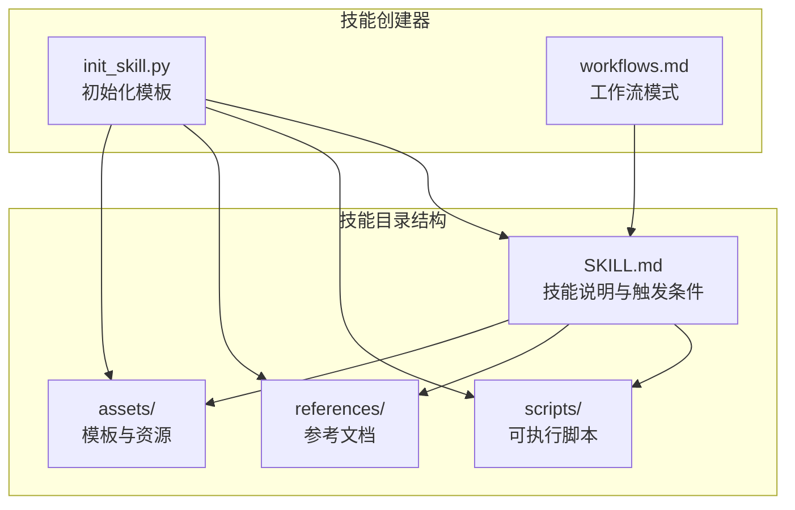
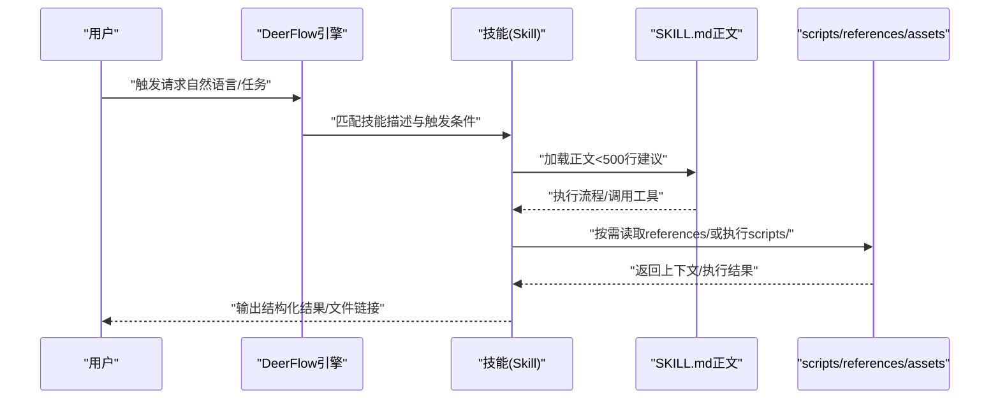
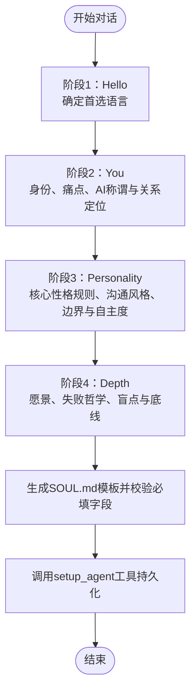
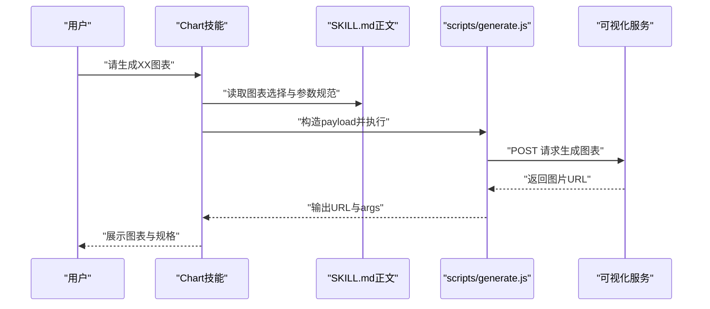
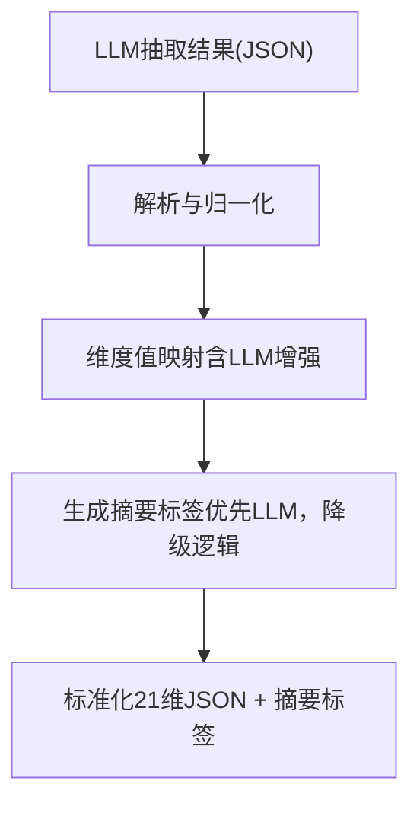
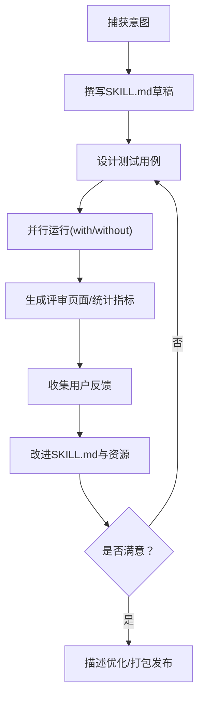
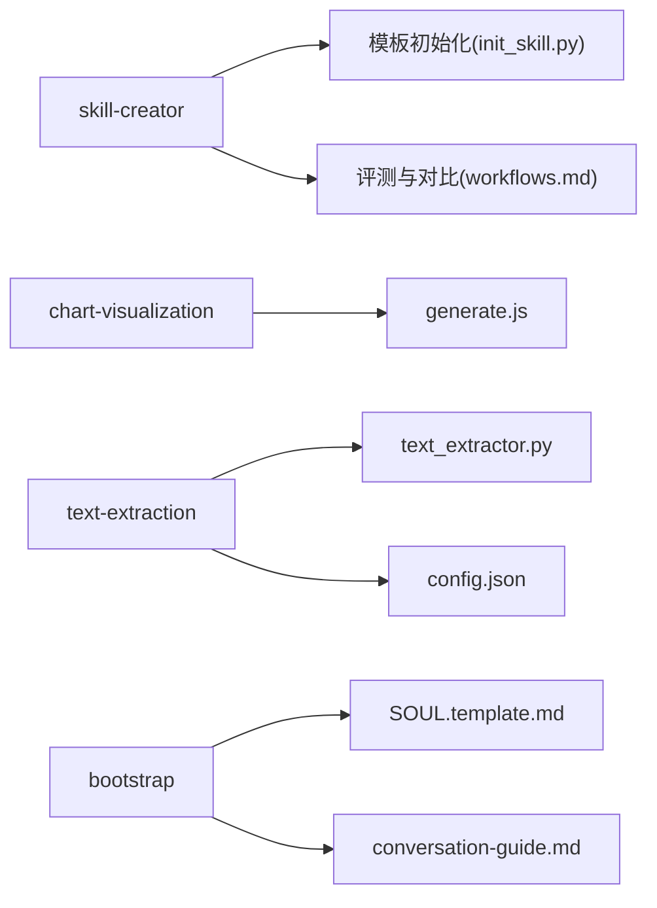

# 自定义技能开发

<cite>
**本文引用的文件**
- [SKILL.md](file://skills/public/bootstrap/SKILL.md)
- [SOUL.template.md](file://skills/public/bootstrap/templates/SOUL.template.md)
- [conversation-guide.md](file://skills/public/bootstrap/references/conversation-guide.md)
- [SKILL.md](file://skills/public/chart-visualization/SKILL.md)
- [generate.js](file://skills/public/chart-visualization/scripts/generate.js)
- [SKILL.md](file://skills/public/text-extraction/SKILL.md)
- [main.py](file://skills/public/text-extraction/main.py)
- [text_extractor.py](file://skills/public/text-extraction/text_extractor.py)
- [config.json](file://skills/public/text-extraction/config.json)
- [SKILL.md](file://skills/public/skill-creator/SKILL.md)
- [init_skill.py](file://skills/public/skill-creator/scripts/init_skill.py)
- [workflows.md](file://skills/public/skill-creator/references/workflows.md)
</cite>

## 目录
1. [引言](#引言)
2. [项目结构](#项目结构)
3. [核心组件](#核心组件)
4. [架构总览](#架构总览)
5. [详细组件分析](#详细组件分析)
6. [依赖关系分析](#依赖关系分析)
7. [性能考虑](#性能考虑)
8. [故障排查指南](#故障排查指南)
9. [结论](#结论)
10. [附录](#附录)

## 引言
本指南面向在 DeerFlow 平台上开发“自定义技能”的工程师与产品人员，系统讲解从需求分析到最终发布的全流程，重点覆盖 SKILL.md 的标准格式与编写规范、技能模板与最佳实践、测试与评估方法、调试与性能优化策略，并通过真实技能案例（引导对话、可视化图表、文本抽取）帮助快速落地。

## 项目结构
DeerFlow 的技能生态采用“目录即技能包”的组织方式：每个技能以独立目录呈现，根目录包含 SKILL.md（核心说明）、可选的 scripts/（可执行脚本）、references/（参考文档）、assets/（模板与资源）。技能创建器 skill-creator 提供了模板初始化、评测与迭代、描述优化等全套工具链。

图示来源
- [SKILL.md:1-95](file://skills/public/bootstrap/SKILL.md#L1-L95)
- [SKILL.md:1-73](file://skills/public/chart-visualization/SKILL.md#L1-L73)
- [SKILL.md:1-100](file://skills/public/text-extraction/SKILL.md#L1-L100)
- [init_skill.py:1-304](file://skills/public/skill-creator/scripts/init_skill.py#L1-L304)
- [workflows.md:1-28](file://skills/public/skill-creator/references/workflows.md#L1-L28)

章节来源
- [SKILL.md:1-95](file://skills/public/bootstrap/SKILL.md#L1-L95)
- [SKILL.md:1-73](file://skills/public/chart-visualization/SKILL.md#L1-L73)
- [SKILL.md:1-100](file://skills/public/text-extraction/SKILL.md#L1-L100)
- [SKILL.md:1-486](file://skills/public/skill-creator/SKILL.md#L1-L486)
- [init_skill.py:1-304](file://skills/public/skill-creator/scripts/init_skill.py#L1-L304)
- [workflows.md:1-28](file://skills/public/skill-creator/references/workflows.md#L1-L28)

## 核心组件
- SKILL.md：技能的“说明书”，包含 YAML 前言（name、description、compatibility）、正文（目标、流程、约束、输出规范、资源指引等）。
- 资源目录：
  - scripts/：可直接执行的自动化脚本（如 Node/Python）。
  - references/：深度参考文档（API、流程、规范），按需加载。
  - assets/：模板、图标、字体等产物素材。
- 技能创建器 skill-creator：提供模板初始化、评测与迭代、描述优化、打包发布等能力。

章节来源
- [SKILL.md:1-95](file://skills/public/bootstrap/SKILL.md#L1-L95)
- [SKILL.md:1-486](file://skills/public/skill-creator/SKILL.md#L1-L486)
- [init_skill.py:1-304](file://skills/public/skill-creator/scripts/init_skill.py#L1-L304)

## 架构总览
下图展示了“用户意图 → 技能触发 → 正文流程执行 → 资源加载/脚本执行 → 产出结果”的端到端路径，以及技能创建器在迭代过程中的作用。

图示来源
- [SKILL.md:1-95](file://skills/public/bootstrap/SKILL.md#L1-L95)
- [SKILL.md:1-73](file://skills/public/chart-visualization/SKILL.md#L1-L73)
- [SKILL.md:1-100](file://skills/public/text-extraction/SKILL.md#L1-L100)
- [SKILL.md:1-486](file://skills/public/skill-creator/SKILL.md#L1-L486)

## 详细组件分析

### 组件一：Bootstrap 引导对话技能
该技能通过四阶段对话逐步构建 AI 的“灵魂”（SOUL.md），强调渐进式理解与行为规则沉淀。

图示来源
- [SKILL.md:37-95](file://skills/public/bootstrap/SKILL.md#L37-L95)
- [SOUL.template.md:1-44](file://skills/public/bootstrap/templates/SOUL.template.md#L1-L44)
- [conversation-guide.md:1-83](file://skills/public/bootstrap/references/conversation-guide.md#L1-L83)

章节来源
- [SKILL.md:1-95](file://skills/public/bootstrap/SKILL.md#L1-L95)
- [SOUL.template.md:1-44](file://skills/public/bootstrap/templates/SOUL.template.md#L1-L44)
- [conversation-guide.md:1-83](file://skills/public/bootstrap/references/conversation-guide.md#L1-L83)

### 组件二：Chart 可视化技能
该技能提供“智能图表选择 → 参数提取 → 脚本生成 → 结果返回”的闭环流程，强调参数规范与可验证输出。

图示来源
- [SKILL.md:12-68](file://skills/public/chart-visualization/SKILL.md#L12-L68)
- [generate.js:1-174](file://skills/public/chart-visualization/scripts/generate.js#L1-L174)

章节来源
- [SKILL.md:1-73](file://skills/public/chart-visualization/SKILL.md#L1-L73)
- [generate.js:1-174](file://skills/public/chart-visualization/scripts/generate.js#L1-L174)

### 组件三：Text Extraction 文本抽取技能
该技能将 LLM 的原始抽取结果进行“后处理修正 + 标准化 + 标签生成”，并通过配置驱动维度映射与输出格式。

图示来源
- [SKILL.md:1-100](file://skills/public/text-extraction/SKILL.md#L1-L100)
- [text_extractor.py:142-411](file://skills/public/text-extraction/text_extractor.py#L142-L411)
- [config.json:1-188](file://skills/public/text-extraction/config.json#L1-L188)

章节来源
- [SKILL.md:1-100](file://skills/public/text-extraction/SKILL.md#L1-L100)
- [main.py:1-46](file://skills/public/text-extraction/main.py#L1-L46)
- [text_extractor.py:1-675](file://skills/public/text-extraction/text_extractor.py#L1-L675)
- [config.json:1-188](file://skills/public/text-extraction/config.json#L1-L188)

### 组件四：Skill Creator 技能创建器
该组件提供“从草稿到评测再到优化”的完整迭代闭环，包含模板初始化、评测与对比、描述优化、打包发布等能力。

图示来源
- [SKILL.md:10-486](file://skills/public/skill-creator/SKILL.md#L10-L486)
- [init_skill.py:1-304](file://skills/public/skill-creator/scripts/init_skill.py#L1-L304)
- [workflows.md:1-28](file://skills/public/skill-creator/references/workflows.md#L1-L28)

章节来源
- [SKILL.md:1-486](file://skills/public/skill-creator/SKILL.md#L1-L486)
- [init_skill.py:1-304](file://skills/public/skill-creator/scripts/init_skill.py#L1-L304)
- [workflows.md:1-28](file://skills/public/skill-creator/references/workflows.md#L1-L28)

## 依赖关系分析
- 技能内部依赖
  - SKILL.md 是唯一必需入口，正文长度建议控制在 500 行以内，必要时通过 references/ 提供深度文档。
  - scripts/ 可直接执行，无需加载到上下文即可运行；resources 仅在需要时被读取。
- 技能间依赖
  - skill-creator 为其他技能的开发与优化提供统一工具链。
  - chart-visualization 依赖外部可视化服务；text-extraction 依赖 LLM 客户端（可降级）。
- 外部依赖
  - chart-visualization 依赖 Node 环境与网络访问；text-extraction 依赖 Python 环境与 LLM 服务。

图示来源
- [init_skill.py:1-304](file://skills/public/skill-creator/scripts/init_skill.py#L1-L304)
- [workflows.md:1-28](file://skills/public/skill-creator/references/workflows.md#L1-L28)
- [generate.js:1-174](file://skills/public/chart-visualization/scripts/generate.js#L1-L174)
- [text_extractor.py:1-675](file://skills/public/text-extraction/text_extractor.py#L1-L675)
- [config.json:1-188](file://skills/public/text-extraction/config.json#L1-L188)
- [SOUL.template.md:1-44](file://skills/public/bootstrap/templates/SOUL.template.md#L1-L44)
- [conversation-guide.md:1-83](file://skills/public/bootstrap/references/conversation-guide.md#L1-L83)

章节来源
- [init_skill.py:1-304](file://skills/public/skill-creator/scripts/init_skill.py#L1-L304)
- [workflows.md:1-28](file://skills/public/skill-creator/references/workflows.md#L1-L28)
- [generate.js:1-174](file://skills/public/chart-visualization/scripts/generate.js#L1-L174)
- [text_extractor.py:1-675](file://skills/public/text-extraction/text_extractor.py#L1-L675)
- [config.json:1-188](file://skills/public/text-extraction/config.json#L1-L188)
- [SOUL.template.md:1-44](file://skills/public/bootstrap/templates/SOUL.template.md#L1-L44)
- [conversation-guide.md:1-83](file://skills/public/bootstrap/references/conversation-guide.md#L1-L83)

## 性能考虑
- 控制 SKILL.md 正文字数，避免超过 500 行；长文档拆分到 references/ 并提供清晰导航。
- scripts/ 中的脚本应尽量幂等、可缓存，减少重复计算与网络请求。
- 对于依赖外部服务的技能（如图表生成、LLM），建议：
  - 缓存常用参数与中间结果；
  - 设置合理的超时与重试策略；
  - 在评测阶段记录 token 用量与耗时，便于回归分析。
- 对于多轮对话型技能（如引导对话），建议在 SKILL.md 中明确每轮限制（如每轮最多 3 问），避免上下文膨胀。

## 故障排查指南
- 触发不生效
  - 检查 SKILL.md frontmatter 的 description 是否足够具体、覆盖常见触发语句。
  - 使用 skill-creator 的“描述优化”功能生成触发查询集，验证 should-trigger/should-not-trigger 的平衡。
- 执行报错
  - chart-visualization：检查 VIS_REQUEST_SERVER 与 SERVICE_ID 环境变量，确认网络可达与鉴权。
  - text-extraction：确认 DeerFlowClient 初始化成功，必要时启用降级逻辑（不调用 LLM 生成标签）。
- 输出不符合预期
  - 回归 SKILL.md 的输出规范与参数提取步骤，必要时增加 references/ 作为上下文提示。
  - 使用 skill-creator 的评测与对比功能，定位是流程问题还是参数映射问题。

章节来源
- [SKILL.md:333-405](file://skills/public/skill-creator/SKILL.md#L333-L405)
- [generate.js:34-43](file://skills/public/chart-visualization/scripts/generate.js#L34-L43)
- [text_extractor.py:111-126](file://skills/public/text-extraction/text_extractor.py#L111-L126)

## 结论
通过标准化的 SKILL.md 编写、严谨的资源组织与脚本化执行、系统化的评测与迭代流程，以及完善的调试与性能优化策略，开发者可以在 DeerFlow 上高效地构建高质量自定义技能。建议以 skill-creator 为开发主线，结合真实技能案例（引导对话、可视化、文本抽取）进行实践，持续优化触发准确性与执行稳定性。

## 附录

### SKILL.md 标准格式与编写规范
- YAML 前言
  - name：技能标识（短横线命名、小写、不超过 40 字符）。
  - description：触发条件 + 功能说明，应包含“何时使用”的具体场景与关键词。
  - compatibility：可选，声明所需依赖（如 Node/Python 版本）。
- 正文结构建议
  - 概述：简述技能目标与适用范围。
  - 流程/工作流：清晰的步骤或分支说明，必要时给出决策树。
  - 输出规范：固定模板、字段清单、格式约束。
  - 资源指引：明确 scripts/references/assets 的使用时机与内容。
- 最佳实践
  - 保持 SKILL.md 不超过 500 行；长文档拆分到 references/。
  - 使用“渐进披露”：metadata（前言）始终在上下文；正文按需加载；资源按需读取。
  - 明确“禁止”与“必须”：如不可暴露模板、必须调用特定工具等。

章节来源
- [SKILL.md:1-95](file://skills/public/bootstrap/SKILL.md#L1-L95)
- [SKILL.md:1-73](file://skills/public/chart-visualization/SKILL.md#L1-L73)
- [SKILL.md:1-100](file://skills/public/text-extraction/SKILL.md#L1-L100)
- [SKILL.md:71-110](file://skills/public/skill-creator/SKILL.md#L71-L110)

### 技能模板与命名规范
- 目录命名：短横线连接的小写标识（如 data-analyzer）。
- 文件命名：SKILL.md 必备；scripts/、references/、assets/ 可选。
- 模板初始化：使用 skill-creator 的 init_skill.py 一键生成骨架，再按 TODO 提示完善。

章节来源
- [init_skill.py:1-304](file://skills/public/skill-creator/scripts/init_skill.py#L1-L304)

### 测试与评估方法
- 单元测试
  - 对 scripts/ 中的函数进行最小化断言（如参数解析、返回值格式）。
- 集成测试
  - 使用 skill-creator 的评测流水线，对比“带技能 vs 不带技能”的输出差异。
- 性能测试
  - 记录 token 用量与耗时，分析脚本执行瓶颈。
- 用户体验评估
  - 使用评测页面收集主观反馈，关注易用性、准确性与一致性。

章节来源
- [SKILL.md:163-290](file://skills/public/skill-creator/SKILL.md#L163-L290)

### 调试技巧与错误排查
- 触发问题：使用描述优化工具生成触发查询集，验证正负样本分布。
- 执行问题：开启脚本日志与重试机制，必要时降级为本地逻辑。
- 输出问题：核对 SKILL.md 的输出规范与 references/ 的上下文提示。

章节来源
- [SKILL.md:333-405](file://skills/public/skill-creator/SKILL.md#L333-L405)
- [text_extractor.py:261-280](file://skills/public/text-extraction/text_extractor.py#L261-L280)

### 实际开发案例
- 引导对话（Bootstrap）
  - 关键点：四阶段对话、模板校验、setup_agent 工具调用。
  - 参考：[SKILL.md:37-95](file://skills/public/bootstrap/SKILL.md#L37-L95)、[SOUL.template.md:1-44](file://skills/public/bootstrap/templates/SOUL.template.md#L1-L44)、[conversation-guide.md:1-83](file://skills/public/bootstrap/references/conversation-guide.md#L1-L83)
- 可视化图表（Chart Visualization）
  - 关键点：图表类型映射、参数提取、脚本执行、结果返回。
  - 参考：[SKILL.md:12-68](file://skills/public/chart-visualization/SKILL.md#L12-L68)、[generate.js:1-174](file://skills/public/chart-visualization/scripts/generate.js#L1-L174)
- 文本抽取（Text Extraction）
  - 关键点：维度配置、值映射（含 LLM 增强）、摘要标签生成、降级策略。
  - 参考：[SKILL.md:1-100](file://skills/public/text-extraction/SKILL.md#L1-L100)、[config.json:1-188](file://skills/public/text-extraction/config.json#L1-L188)、[text_extractor.py:142-411](file://skills/public/text-extraction/text_extractor.py#L142-L411)