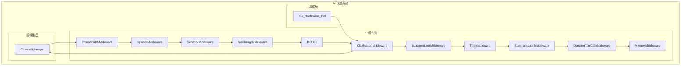
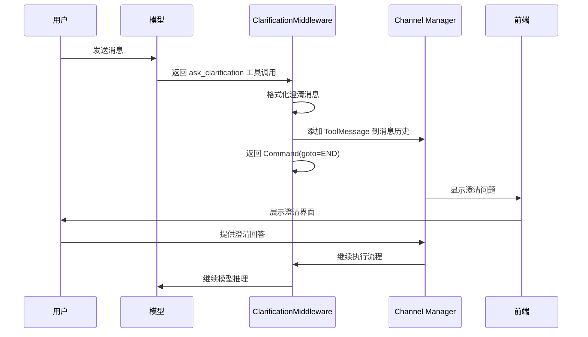
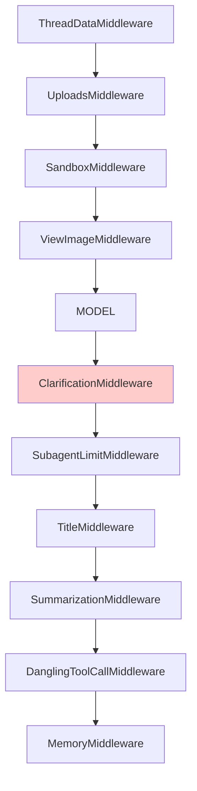
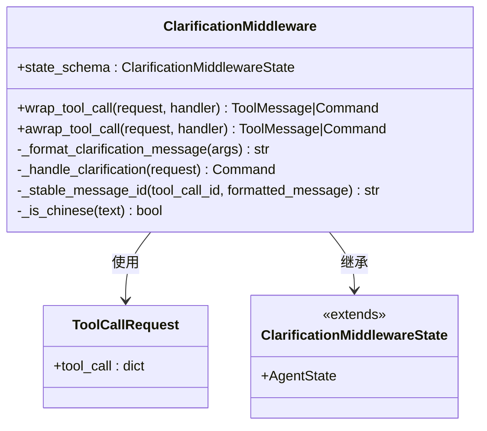
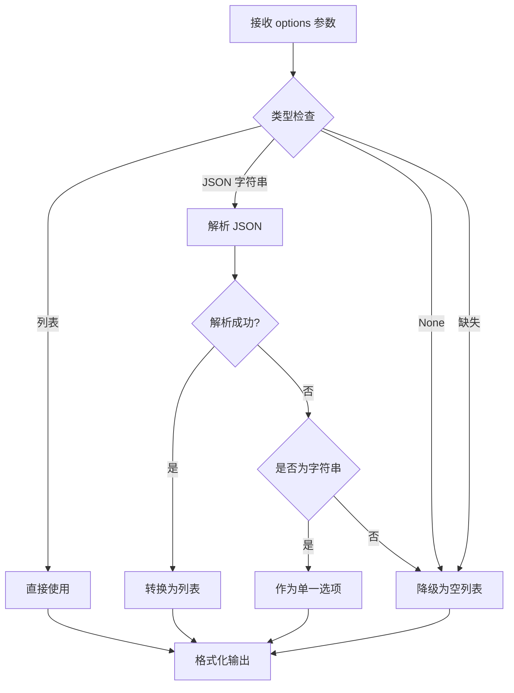
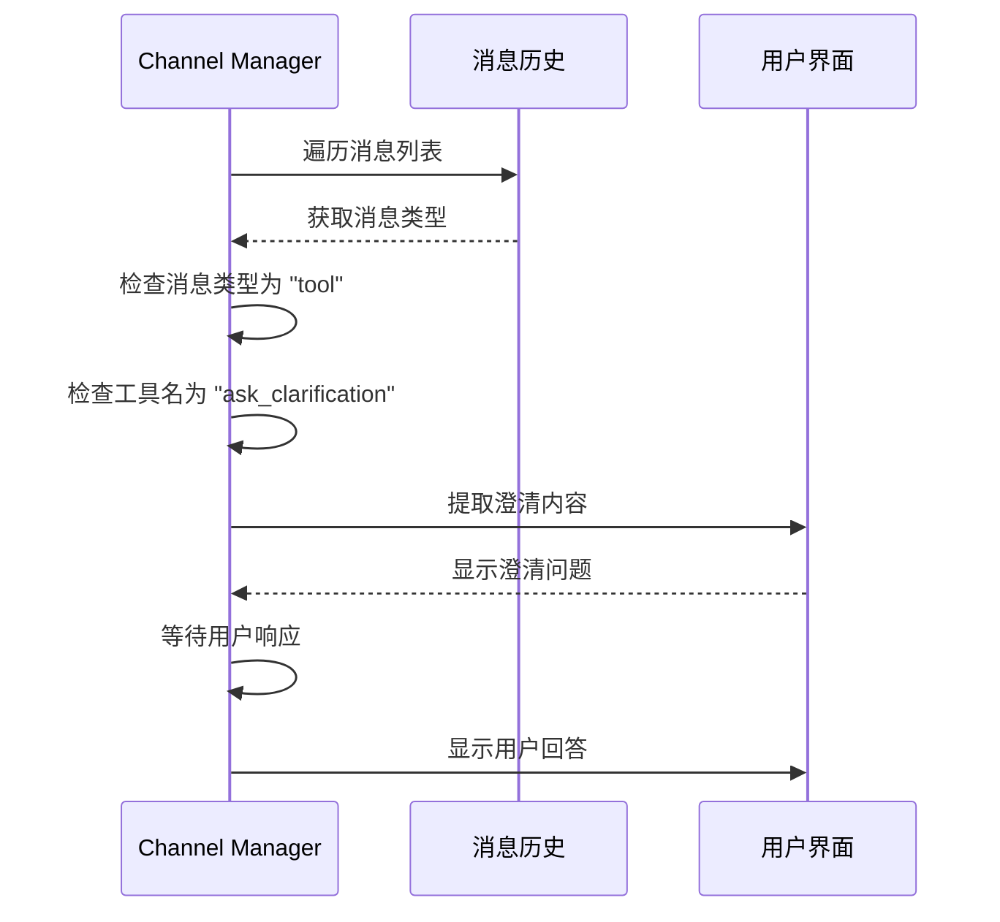
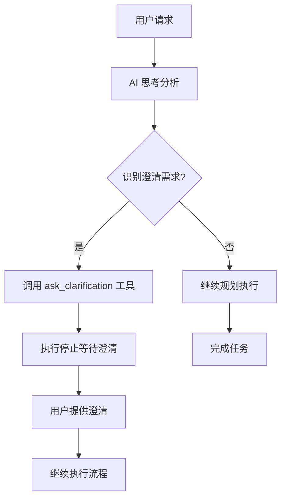
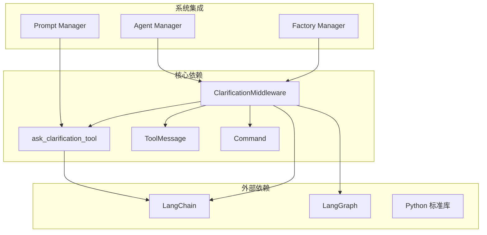

# Clarification 中间件

<cite>
**本文档引用的文件**
- [clarification_middleware.py](file://backend/packages/harness/deerflow/agents/middlewares/clarification_middleware.py)
- [clarification_tool.py](file://backend/packages/harness/deerflow/tools/builtins/clarification_tool.py)
- [test_clarification_middleware.py](file://backend/tests/test_clarification_middleware.py)
- [factory.py](file://backend/packages/harness/deerflow/agents/factory.py)
- [agent.py](file://backend/packages/harness/deerflow/agents/lead_agent/agent.py)
- [prompt.py](file://backend/packages/harness/deerflow/agents/lead_agent/prompt.py)
- [manager.py](file://backend/app/channels/manager.py)
- [middleware-execution-flow.md](file://backend/docs/middleware-execution-flow.md)
- [config.yaml](file://config.yaml)
</cite>

## 目录
1. [简介](#简介)
2. [项目结构](#项目结构)
3. [核心组件](#核心组件)
4. [架构概览](#架构概览)
5. [详细组件分析](#详细组件分析)
6. [依赖关系分析](#依赖关系分析)
7. [性能考虑](#性能考虑)
8. [故障排除指南](#故障排除指南)
9. [结论](#结论)
10. [附录](#附录)

## 简介

Clarification 中间件是 DeerFlow AI 代理系统中的关键组件，负责拦截和处理模型调用 `ask_clarification` 工具的请求。该中间件实现了智能澄清和确认机制，确保在执行任何操作之前，AI 代理能够准确理解用户需求并获得必要的澄清信息。

该中间件的核心功能包括：
- 拦截模型的 `ask_clarification` 工具调用
- 格式化用户友好的澄清消息
- 生成稳定的消息 ID 以防止重复
- 支持多种澄清类型（信息缺失、需求模糊、方案选择、风险确认、建议）
- 与对话系统无缝集成，提供即时反馈

## 项目结构

Clarification 中间件在整个 DeerFlow 架构中的位置如下：



**图表来源**
- [middleware-execution-flow.md:28-75](file://backend/docs/middleware-execution-flow.md#L28-L75)
- [factory.py:294-296](file://backend/packages/harness/deerflow/agents/factory.py#L294-L296)

**章节来源**
- [middleware-execution-flow.md:1-292](file://backend/docs/middleware-execution-flow.md#L1-L292)
- [factory.py:290-307](file://backend/packages/harness/deerflow/agents/factory.py#L290-L307)

## 核心组件

### ClarificationMiddleware 类

ClarificationMiddleware 是中间件的核心实现，继承自 `AgentMiddleware`，专门处理澄清请求。

**主要特性：**
- **拦截机制**：拦截所有 `ask_clarification` 工具调用
- **消息格式化**：将澄清参数转换为用户友好的格式
- **稳定性保证**：生成稳定的消息 ID 以防止重复
- **异步支持**：同时支持同步和异步工具调用

**关键方法：**
- `wrap_tool_call()`: 同步工具调用拦截
- `awrap_tool_call()`: 异步工具调用拦截
- `_format_clarification_message()`: 消息格式化
- `_handle_clarification()`: 澄清请求处理

### ask_clarification 工具

这是一个占位符工具，实际逻辑由中间件处理：

**参数说明：**
- `question`: 澄清问题（必填）
- `clarification_type`: 澄清类型（必填）
- `context`: 上下文说明（可选）
- `options`: 选项列表（可选）

**澄清类型：**
1. `missing_info` - 信息缺失
2. `ambiguous_requirement` - 需求模糊
3. `approach_choice` - 方案选择
4. `risk_confirmation` - 风险确认
5. `suggestion` - 建议

**章节来源**
- [clarification_middleware.py:28-204](file://backend/packages/harness/deerflow/agents/middlewares/clarification_middleware.py#L28-L204)
- [clarification_tool.py:6-56](file://backend/packages/harness/deerflow/tools/builtins/clarification_tool.py#L6-L56)

## 架构概览

### 执行流程



**图表来源**
- [middleware-execution-flow.md:79-154](file://backend/docs/middleware-execution-flow.md#L79-L154)
- [clarification_middleware.py:120-159](file://backend/packages/harness/deerflow/agents/middlewares/clarification_middleware.py#L120-L159)

### 中间件链集成

ClarificationMiddleware 在中间件链中的位置具有特殊意义：



**图表来源**
- [middleware-execution-flow.md:28-75](file://backend/docs/middleware-execution-flow.md#L28-L75)
- [agent.py:239-318](file://backend/packages/harness/deerflow/agents/lead_agent/agent.py#L239-L318)

**章节来源**
- [middleware-execution-flow.md:28-75](file://backend/docs/middleware-execution-flow.md#L28-L75)
- [agent.py:239-318](file://backend/packages/harness/deerflow/agents/lead_agent/agent.py#L239-L318)

## 详细组件分析

### 消息格式化机制

ClarificationMiddleware 实现了智能的消息格式化，支持多种澄清类型：



**图表来源**
- [clarification_middleware.py:28-49](file://backend/packages/harness/deerflow/agents/middlewares/clarification_middleware.py#L28-L49)

#### 澄清类型映射

| 类型 | 图标 | 描述 | 使用场景 |
|------|------|------|----------|
| `missing_info` | ❓ | 信息缺失 | 缺少必需详情（如文件路径、URL、具体需求） |
| `ambiguous_requirement` | 🤔 | 需求模糊 | 存在多种合理解释 |
| `approach_choice` | 🔀 | 方案选择 | 存在多种有效方案 |
| `risk_confirmation` | ⚠️ | 风险确认 | 破坏性操作需要确认 |
| `suggestion` | 💡 | 建议 | 有建议但需要批准 |

#### 选项处理算法



**图表来源**
- [test_clarification_middleware.py:20-96](file://backend/tests/test_clarification_middleware.py#L20-L96)

**章节来源**
- [clarification_middleware.py:61-118](file://backend/packages/harness/deerflow/agents/middlewares/clarification_middleware.py#L61-L118)
- [test_clarification_middleware.py:17-123](file://backend/tests/test_clarification_middleware.py#L17-L123)

### 消息 ID 稳定性机制

为确保重复的澄清调用不会产生重复消息，中间件实现了稳定的消息 ID 生成：

```mermaid
flowchart TD
A[接收工具调用请求] --> B{检查 tool_call_id }
B --> |存在| C[使用 tool_call_id 生成 ID]
B --> |不存在| D[计算消息内容的 SHA256 哈希]
C --> E[格式化为 "clarification:{id}" ]
D --> F[取哈希前 16 位]
F --> G[格式化为 "clarification:{hash}" ]
E --> H[返回稳定 ID]
G --> H
```

**图表来源**
- [clarification_middleware.py:43-48](file://backend/packages/harness/deerflow/agents/middlewares/clarification_middleware.py#L43-L48)

**章节来源**
- [clarification_middleware.py:43-48](file://backend/packages/harness/deerflow/agents/middlewares/clarification_middleware.py#L43-L48)
- [test_clarification_middleware.py:125-180](file://backend/tests/test_clarification_middleware.py#L125-L180)

### 前端集成机制

Channel Manager 负责处理澄清消息的前端展示：



**图表来源**
- [manager.py:193-197](file://backend/app/channels/manager.py#L193-L197)

**章节来源**
- [manager.py:185-222](file://backend/app/channels/manager.py#L185-L222)

### 系统提示集成

Lead Agent 的系统提示明确规定了澄清的优先级：



**图表来源**
- [prompt.py:379-446](file://backend/packages/harness/deerflow/agents/lead_agent/prompt.py#L379-L446)

**章节来源**
- [prompt.py:379-446](file://backend/packages/harness/deerflow/agents/lead_agent/prompt.py#L379-L446)

## 依赖关系分析

### 组件耦合度



**图表来源**
- [clarification_middleware.py:1-17](file://backend/packages/harness/deerflow/agents/middlewares/clarification_middleware.py#L1-L17)
- [factory.py:294-296](file://backend/packages/harness/deerflow/agents/factory.py#L294-L296)

### 中间件链依赖

| 中间件 | 依赖关系 | 作用 |
|--------|----------|------|
| ThreadDataMiddleware | 必须在 Sandbox 之前 | 创建线程目录 |
| SandboxMiddleware | 必须在 Clarification 之后 | 释放沙箱资源 |
| ClarificationMiddleware | 最后执行 | 拦截澄清请求 |
| DanglingToolCallMiddleware | 早期执行 | 补缺 ToolMessage |
| MemoryMiddleware | 最后执行 | 入队记忆 |

**章节来源**
- [middleware-execution-flow.md:28-75](file://backend/docs/middleware-execution-flow.md#L28-L75)
- [factory.py:315-389](file://backend/packages/harness/deerflow/agents/factory.py#L315-L389)

## 性能考虑

### 执行效率优化

1. **消息格式化优化**
   - 使用高效的字符串拼接方法
   - 避免不必要的字符检查
   - 缓存常用图标和格式化模板

2. **内存使用控制**
   - 限制选项列表的处理长度
   - 控制消息内容的最大长度
   - 及时清理临时变量

3. **并发处理**
   - 支持异步工具调用
   - 非阻塞的消息处理
   - 并行的澄清请求处理

### 配置优化建议

| 配置项 | 默认值 | 优化建议 | 影响范围 |
|--------|--------|----------|----------|
| log_level | info | 调试模式下使用 debug | 日志性能 |
| token_usage.enabled | false | 大规模部署时启用 | 性能监控 |
| title.enabled | true | 高并发场景下禁用 | 标题生成性能 |
| summarization.enabled | true | 长对话场景启用 | 上下文压缩 |

**章节来源**
- [config.yaml:7-12](file://config.yaml#L7-L12)
- [config.yaml:199-203](file://config.yaml#L199-L203)
- [config.yaml:209-231](file://config.yaml#L209-L231)

## 故障排除指南

### 常见问题及解决方案

#### 1. 澄清消息未显示

**症状**：模型调用 `ask_clarification` 后，前端未显示澄清界面

**排查步骤**：
1. 检查 Channel Manager 是否正确识别 `ask_clarification` 工具消息
2. 验证消息历史中是否存在 ToolMessage
3. 确认前端是否正确处理工具消息类型

**解决方案**：
- 检查 `manager.py` 中的消息过滤逻辑
- 验证消息格式是否符合预期
- 确认前端组件正确渲染工具消息

#### 2. 重复消息问题

**症状**：相同的澄清请求导致重复消息

**排查步骤**：
1. 检查 `wrap_tool_call` 方法是否正确生成稳定 ID
2. 验证消息合并逻辑
3. 确认工具调用 ID 的唯一性

**解决方案**：
- 使用 `sha256` 哈希确保消息 ID 稳定
- 实现消息去重机制
- 检查消息合并函数的实现

#### 3. 选项处理异常

**症状**：选项列表显示异常或格式错误

**排查步骤**：
1. 检查选项参数的数据类型
2. 验证 JSON 解析逻辑
3. 确认选项列表的边界情况

**解决方案**：
- 实现健壮的类型检查和转换
- 添加异常处理和回退机制
- 测试各种边界情况

**章节来源**
- [test_clarification_middleware.py:125-180](file://backend/tests/test_clarification_middleware.py#L125-L180)
- [manager.py:193-197](file://backend/app/channels/manager.py#L193-L197)

### 调试技巧

1. **日志分析**
   ```python
   # 启用详细日志
   logger.setLevel(logging.DEBUG)
   ```

2. **单元测试**
   - 测试各种选项类型的处理
   - 验证消息 ID 稳定性
   - 检查异常情况的处理

3. **性能监控**
   - 监控澄清请求的响应时间
   - 分析消息格式化的性能
   - 跟踪内存使用情况

**章节来源**
- [test_clarification_middleware.py:1-180](file://backend/tests/test_clarification_middleware.py#L1-L180)

## 结论

Clarification 中间件是 DeerFlow AI 代理系统中不可或缺的关键组件，它通过以下方式提升了系统的智能化水平：

1. **提升准确性**：确保 AI 代理在执行任何操作前都获得充分的澄清信息
2. **改善用户体验**：提供直观、友好的澄清界面和交互方式
3. **增强可靠性**：通过稳定的消息管理和重复处理机制确保系统稳定性
4. **支持多种场景**：涵盖信息缺失、需求模糊、方案选择、风险确认等多种澄清场景

该中间件的设计体现了 DeerFlow 系统的整体架构理念：通过模块化的中间件链实现功能的灵活组合，同时保持系统的可维护性和扩展性。随着 AI 代理能力的不断提升，Clarification 中间件将继续发挥重要作用，为用户提供更加智能、可靠的对话体验。

## 附录

### 配置选项参考

| 配置项 | 类型 | 默认值 | 描述 |
|--------|------|--------|------|
| `clarification.enabled` | bool | true | 是否启用澄清功能 |
| `clarification.timeout` | int | 300 | 澄清超时时间（秒） |
| `clarification.max_attempts` | int | 3 | 最大澄清尝试次数 |
| `clarification.feedback_enabled` | bool | true | 是否启用用户反馈 |

### 使用示例

#### 基本澄清请求
```python
ask_clarification(
    question="请提供具体的文件路径",
    clarification_type="missing_info",
    context="需要访问特定文件进行处理"
)
```

#### 方案选择澄清
```python
ask_clarification(
    question="请选择合适的部署环境",
    clarification_type="approach_choice",
    options=["development", "staging", "production"],
    context="不同环境有不同的配置要求"
)
```

#### 风险确认澄清
```python
ask_clarification(
    question="此操作将删除生产数据，是否确认继续？",
    clarification_type="risk_confirmation",
    options=["是，继续执行", "否，取消操作"]
)
```

### 最佳实践

1. **明确的问题描述**：澄清问题应该具体、明确，避免歧义
2. **适当的上下文**：提供足够的背景信息帮助用户理解
3. **合理的选项数量**：选项数量适中，避免过多选择负担
4. **及时的反馈**：对用户的澄清回答给予及时确认
5. **优雅的降级**：在澄清失败时提供合理的备选方案