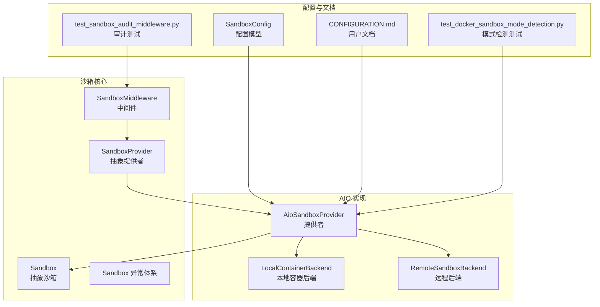
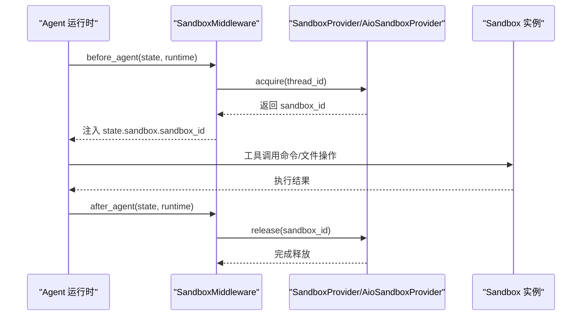
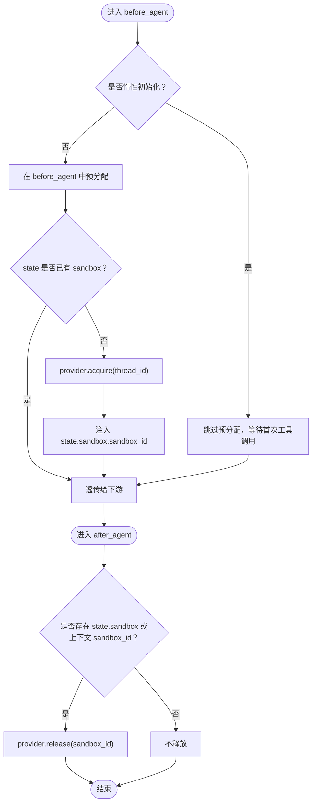
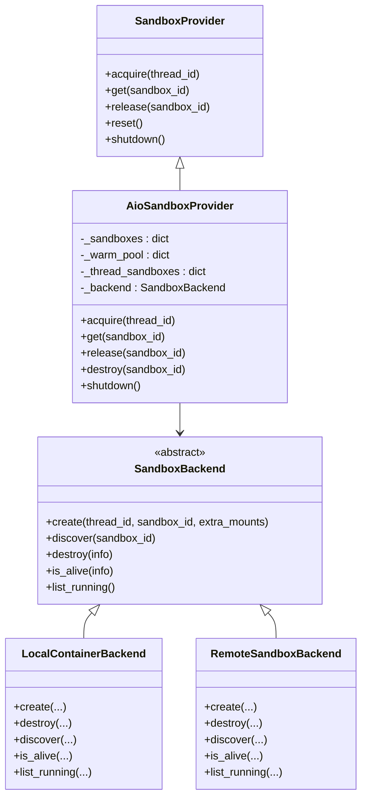
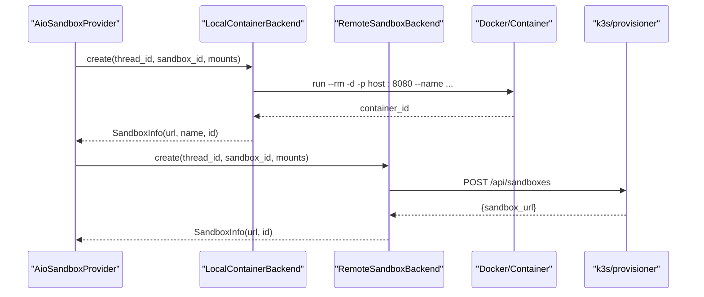
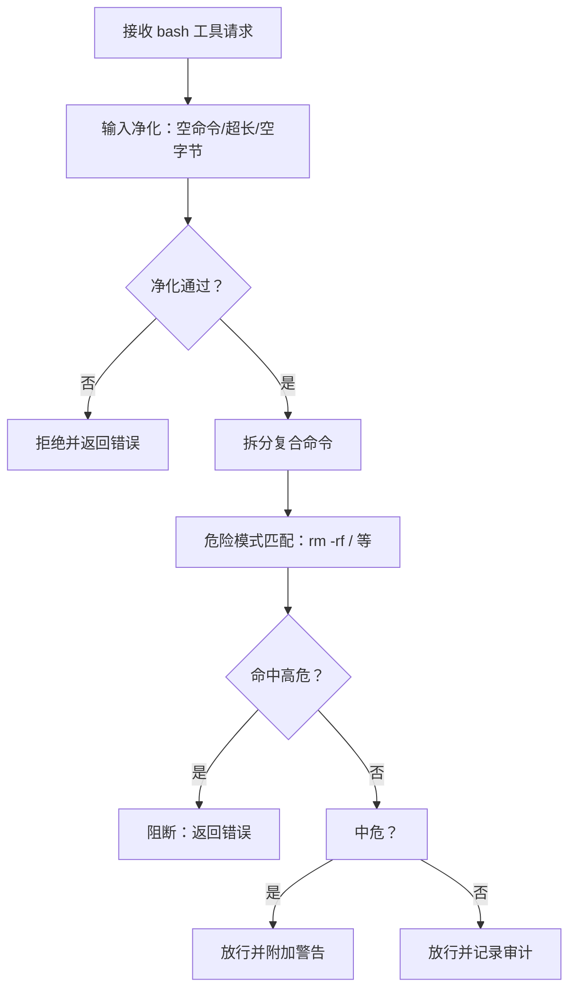
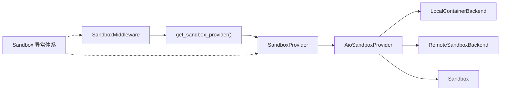

# Sandbox 中间件

<cite>
**本文引用的文件**
- [middleware.py](file://backend/packages/harness/deerflow/sandbox/middleware.py)
- [sandbox.py](file://backend/packages/harness/deerflow/sandbox/sandbox.py)
- [sandbox_provider.py](file://backend/packages/harness/deerflow/sandbox/sandbox_provider.py)
- [aio_sandbox_provider.py](file://backend/packages/harness/deerflow/community/aio_sandbox/aio_sandbox_provider.py)
- [local_backend.py](file://backend/packages/harness/deerflow/community/aio_sandbox/local_backend.py)
- [remote_backend.py](file://backend/packages/harness/deerflow/community/aio_sandbox/remote_backend.py)
- [sandbox_config.py](file://backend/packages/harness/deerflow/config/sandbox_config.py)
- [exceptions.py](file://backend/packages/harness/deerflow/sandbox/exceptions.py)
- [CONFIGURATION.md](file://backend/docs/CONFIGURATION.md)
- [test_sandbox_audit_middleware.py](file://backend/tests/test_sandbox_audit_middleware.py)
- [test_docker_sandbox_mode_detection.py](file://backend/tests/test_docker_sandbox_mode_detection.py)
</cite>

## 目录
1. [简介](#简介)
2. [项目结构](#项目结构)
3. [核心组件](#核心组件)
4. [架构总览](#架构总览)
5. [详细组件分析](#详细组件分析)
6. [依赖分析](#依赖分析)
7. [性能考虑](#性能考虑)
8. [故障排查指南](#故障排查指南)
9. [结论](#结论)
10. [附录](#附录)

## 简介
本技术文档系统性阐述 DeerFlow 中的 Sandbox 中间件与沙箱执行环境，覆盖以下主题：
- 安全隔离机制：本地执行与 Docker 执行模式的边界与差异
- 沙箱配置、资源限制与安全策略
- 中间件生命周期管理：获取、复用、释放与清理
- 使用示例与安全最佳实践
- 性能监控、资源管理与故障恢复机制

Sandbox 中间件通过在代理调用前后自动分配/回收沙箱，确保工具调用在受控环境中执行，并提供审计与安全策略拦截能力。

## 项目结构
围绕 Sandbox 的核心模块分布于以下路径：
- 核心抽象与中间件：`backend/packages/harness/deerflow/sandbox/`
- AIO 沙箱提供者与后端：`backend/packages/harness/deerflow/community/aio_sandbox/`
- 配置模型：`backend/packages/harness/deerflow/config/sandbox_config.py`
- 文档与测试：`backend/docs/CONFIGURATION.md`、`backend/tests/`

**图表来源**
- [middleware.py:21-83](file://backend/packages/harness/deerflow/sandbox/middleware.py#L21-L83)
- [sandbox_provider.py:8-109](file://backend/packages/harness/deerflow/sandbox/sandbox_provider.py#L8-L109)
- [aio_sandbox_provider.py:69-122](file://backend/packages/harness/deerflow/community/aio_sandbox/aio_sandbox_provider.py#L69-L122)
- [local_backend.py:172-208](file://backend/packages/harness/deerflow/community/aio_sandbox/local_backend.py#L172-L208)
- [remote_backend.py:30-54](file://backend/packages/harness/deerflow/community/aio_sandbox/remote_backend.py#L30-L54)
- [sandbox_config.py:12-83](file://backend/packages/harness/deerflow/config/sandbox_config.py#L12-L83)
- [CONFIGURATION.md:240-262](file://backend/docs/CONFIGURATION.md#L240-L262)
- [test_sandbox_audit_middleware.py:1-717](file://backend/tests/test_sandbox_audit_middleware.py#L1-L717)
- [test_docker_sandbox_mode_detection.py:1-107](file://backend/tests/test_docker_sandbox_mode_detection.py#L1-L107)

**章节来源**
- [middleware.py:1-84](file://backend/packages/harness/deerflow/sandbox/middleware.py#L1-L84)
- [aio_sandbox_provider.py:1-708](file://backend/packages/harness/deerflow/community/aio_sandbox/aio_sandbox_provider.py#L1-L708)
- [sandbox_config.py:1-84](file://backend/packages/harness/deerflow/config/sandbox_config.py#L1-L84)

## 核心组件
- SandboxMiddleware：在代理调用前分配沙箱，在代理调用后释放沙箱；支持惰性初始化以优化性能。
- SandboxProvider：抽象沙箱提供者接口，负责 acquire/get/release/shutdown 等生命周期管理。
- AioSandboxProvider：具体实现，支持本地容器与远程 K8s 动态创建两种后端；内置空闲超时、副本数限制、进程内缓存与跨进程锁等机制。
- Sandbox（抽象）：定义命令执行、文件读写、搜索等能力接口。
- Sandbox 异常体系：统一错误类型与结构化详情，便于日志与上层处理。

**章节来源**
- [middleware.py:21-83](file://backend/packages/harness/deerflow/sandbox/middleware.py#L21-L83)
- [sandbox_provider.py:8-109](file://backend/packages/harness/deerflow/sandbox/sandbox_provider.py#L8-L109)
- [aio_sandbox_provider.py:69-122](file://backend/packages/harness/deerflow/community/aio_sandbox/aio_sandbox_provider.py#L69-L122)
- [sandbox.py:6-94](file://backend/packages/harness/deerflow/sandbox/sandbox.py#L6-L94)
- [exceptions.py:4-71](file://backend/packages/harness/deerflow/sandbox/exceptions.py#L4-L71)

## 架构总览
Sandbox 中间件与提供者的交互流程如下：

**图表来源**
- [middleware.py:51-83](file://backend/packages/harness/deerflow/sandbox/middleware.py#L51-L83)
- [aio_sandbox_provider.py:421-486](file://backend/packages/harness/deerflow/community/aio_sandbox/aio_sandbox_provider.py#L421-L486)

## 详细组件分析

### 组件一：SandboxMiddleware（中间件）
- 职责
  - 在代理调用前按需分配沙箱（惰性初始化默认开启）
  - 在代理调用后释放沙箱，避免频繁重建
  - 支持从运行时上下文直接释放外部注入的 sandbox_id
- 关键行为
  - 惰性初始化：仅在首次工具调用时获取沙箱，减少冷启动开销
  - 复用策略：同一 thread_id 在多轮对话中复用相同沙箱 ID
  - 清理策略：应用关闭时通过 provider 的 shutdown 清理所有沙箱

**图表来源**
- [middleware.py:34-83](file://backend/packages/harness/deerflow/sandbox/middleware.py#L34-L83)

**章节来源**
- [middleware.py:21-83](file://backend/packages/harness/deerflow/sandbox/middleware.py#L21-L83)

### 组件二：SandboxProvider 与 AioSandboxProvider（提供者）
- SandboxProvider
  - 抽象接口：acquire/get/release/reset/shutdown
  - 单例工厂：基于配置动态解析类路径，返回具体提供者实例
- AioSandboxProvider
  - 后端选择：优先使用 provisioner_url 的远程后端；否则使用本地容器后端
  - 生命周期管理：进程内缓存 + 跨进程文件锁；空闲超时线程；副本数上限
  - 挂载策略：线程数据目录、技能目录等自动挂载到容器
  - 容器发现与回收：启动时接管孤儿容器；空闲超时销毁或保留在“热池”

**图表来源**
- [sandbox_provider.py:8-109](file://backend/packages/harness/deerflow/sandbox/sandbox_provider.py#L8-L109)
- [aio_sandbox_provider.py:69-122](file://backend/packages/harness/deerflow/community/aio_sandbox/aio_sandbox_provider.py#L69-L122)
- [local_backend.py:172-208](file://backend/packages/harness/deerflow/community/aio_sandbox/local_backend.py#L172-L208)
- [remote_backend.py:30-54](file://backend/packages/harness/deerflow/community/aio_sandbox/remote_backend.py#L30-L54)

**章节来源**
- [sandbox_provider.py:8-109](file://backend/packages/harness/deerflow/sandbox/sandbox_provider.py#L8-L109)
- [aio_sandbox_provider.py:135-236](file://backend/packages/harness/deerflow/community/aio_sandbox/aio_sandbox_provider.py#L135-L236)

### 组件三：后端实现（LocalContainerBackend 与 RemoteSandboxBackend）
- LocalContainerBackend
  - 本地容器生命周期：启动/停止/检查/枚举；端口分配与冲突重试；容器名确定性命名
  - 环境变量与挂载：支持配置级与线程级挂载；Docker/Apple Container 自动识别
  - 健康检查：通过 wait_for_sandbox_ready 确认沙箱可用
- RemoteSandboxBackend
  - 通过 provisioner 服务动态创建/销毁 Pod 与 NodePort Service
  - 提供 discover/list_running/is_alive 等查询能力

**图表来源**
- [local_backend.py:244-302](file://backend/packages/harness/deerflow/community/aio_sandbox/local_backend.py#L244-L302)
- [remote_backend.py:133-153](file://backend/packages/harness/deerflow/community/aio_sandbox/remote_backend.py#L133-L153)

**章节来源**
- [local_backend.py:172-620](file://backend/packages/harness/deerflow/community/aio_sandbox/local_backend.py#L172-L620)
- [remote_backend.py:30-201](file://backend/packages/harness/deerflow/community/aio_sandbox/remote_backend.py#L30-L201)

### 组件四：配置与安全策略
- 配置项（SandboxConfig）
  - use：提供者类路径
  - allow_host_bash：本地提供者允许直接宿主机 bash（默认关闭，生产不建议开启）
  - image/port/container_prefix/idle_timeout/replicas：容器镜像、端口、容器名前缀、空闲超时、副本上限
  - mounts/environment：挂载与环境变量
  - 输出截断：bash/read_file/ls 的输出最大字符数，防止日志膨胀
- 安全策略（SandboxAuditMiddleware）
  - 对 bash 工具调用进行分类：block/warn/pass
  - 输入净化：空命令、超长命令、空字节检测
  - 审计日志：记录每次 bash 调用及判定结果

**图表来源**
- [test_sandbox_audit_middleware.py:118-213](file://backend/tests/test_sandbox_audit_middleware.py#L118-L213)

**章节来源**
- [sandbox_config.py:12-83](file://backend/packages/harness/deerflow/config/sandbox_config.py#L12-L83)
- [CONFIGURATION.md:240-262](file://backend/docs/CONFIGURATION.md#L240-L262)
- [test_sandbox_audit_middleware.py:265-350](file://backend/tests/test_sandbox_audit_middleware.py#L265-L350)

## 依赖分析
- 中间件依赖提供者单例工厂，通过配置解析具体实现
- AioSandboxProvider 依赖 SandboxBackend 抽象，分别对接本地容器与远程 K8s
- 提供者内部维护进程内缓存、跨进程锁、空闲检查线程与热池，降低容器冷启动成本
- 异常体系为上层提供一致的错误语义与结构化详情

**图表来源**
- [middleware.py:45-49](file://backend/packages/harness/deerflow/sandbox/middleware.py#L45-L49)
- [sandbox_provider.py:48-62](file://backend/packages/harness/deerflow/sandbox/sandbox_provider.py#L48-L62)
- [aio_sandbox_provider.py:135-156](file://backend/packages/harness/deerflow/community/aio_sandbox/aio_sandbox_provider.py#L135-L156)

**章节来源**
- [middleware.py:1-84](file://backend/packages/harness/deerflow/sandbox/middleware.py#L1-L84)
- [sandbox_provider.py:1-110](file://backend/packages/harness/deerflow/sandbox/sandbox_provider.py#L1-L110)
- [aio_sandbox_provider.py:1-708](file://backend/packages/harness/deerflow/community/aio_sandbox/aio_sandbox_provider.py#L1-L708)

## 性能考虑
- 惰性初始化：默认启用，避免未使用的沙箱分配
- 进程内缓存与热池：复用已分配容器，显著降低冷启动时间
- 副本上限与驱逐：通过 replicas 控制并发容器数量，避免资源耗尽
- 空闲超时：定期清理长时间未使用的容器，平衡资源占用与响应速度
- 端口与健康检查：容器启动后进行就绪检查，确保后续调用稳定
- 输出截断：限制 bash/read_file/ls 输出大小，降低日志与网络传输压力

[本节为通用性能讨论，无需特定文件来源]

## 故障排查指南
- 沙箱无法获取
  - 检查配置中的 sandbox.use 是否正确解析
  - 查看提供者日志：容器启动失败、端口冲突、镜像不可用
- 容器未释放
  - 确认中间件 after_agent 是否被调用
  - 检查 provider.release 是否执行；若异常，可调用 reset_sandbox_provider 或 shutdown_sandbox_provider
- 空闲超时误杀
  - 调整 idle_timeout；确认线程活动是否正确更新 last_activity
- Docker 模式检测问题
  - 使用测试脚本验证 provisioner_url 与 provider 类型映射
- 审计与安全
  - 若 bash 被阻断，查看审计日志与分类规则；必要时调整策略或放宽限制

**章节来源**
- [sandbox_provider.py:65-109](file://backend/packages/harness/deerflow/sandbox/sandbox_provider.py#L65-L109)
- [aio_sandbox_provider.py:308-375](file://backend/packages/harness/deerflow/community/aio_sandbox/aio_sandbox_provider.py#L308-L375)
- [test_docker_sandbox_mode_detection.py:27-107](file://backend/tests/test_docker_sandbox_mode_detection.py#L27-L107)
- [test_sandbox_audit_middleware.py:357-464](file://backend/tests/test_sandbox_audit_middleware.py#L357-L464)

## 结论
Sandbox 中间件通过提供者抽象与 AIO 实现，实现了灵活且安全的沙箱执行环境。其核心优势包括：
- 明确的安全边界：Docker 模式提供更强隔离
- 高效的资源管理：缓存、热池、副本与空闲超时协同
- 可观测与可治理：审计日志、异常体系与配置化策略
- 易用与可扩展：统一接口与插件化后端

建议在生产环境优先采用 Docker 沙箱模式，并结合严格的输出截断与审计策略，确保安全与性能的平衡。

[本节为总结性内容，无需特定文件来源]

## 附录

### 配置选项速览（来自 SandboxConfig）
- use：提供者类路径
- allow_host_bash：本地提供者允许直接宿主机 bash（默认 false）
- image/port/container_prefix/idle_timeout/replicas：容器镜像、端口、容器名前缀、空闲超时、副本上限
- mounts/environment：挂载与环境变量
- bash_output_max_chars/read_file_output_max_chars/ls_output_max_chars：输出截断阈值

**章节来源**
- [sandbox_config.py:12-83](file://backend/packages/harness/deerflow/config/sandbox_config.py#L12-L83)
- [CONFIGURATION.md:240-262](file://backend/docs/CONFIGURATION.md#L240-L262)

### 使用示例（步骤说明）
- 本地模式（非隔离）
  - 将 sandbox.use 指向本地提供者类路径
  - 如需宿主机 bash，设置 allow_host_bash=true（仅限完全可信环境）
- Docker 模式（推荐用于生产）
  - 将 sandbox.use 指向 AioSandboxProvider
  - 配置 image、port、container_prefix、idle_timeout、replicas、mounts、environment
  - 如需 K8s 动态创建，设置 provisioner_url
- 审计与安全
  - 通过审计中间件启用 bash 调用分类与输入净化
  - 根据需要调整输出截断参数，避免日志膨胀

**章节来源**
- [CONFIGURATION.md:240-262](file://backend/docs/CONFIGURATION.md#L240-L262)
- [test_sandbox_audit_middleware.py:357-464](file://backend/tests/test_sandbox_audit_middleware.py#L357-L464)