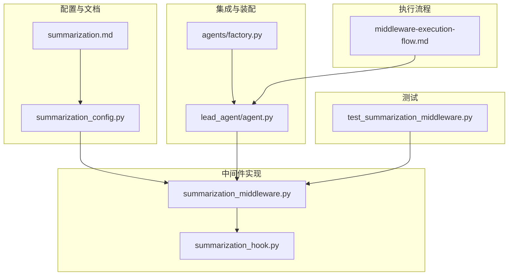
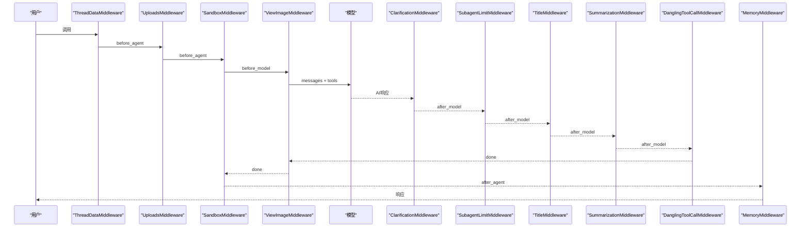
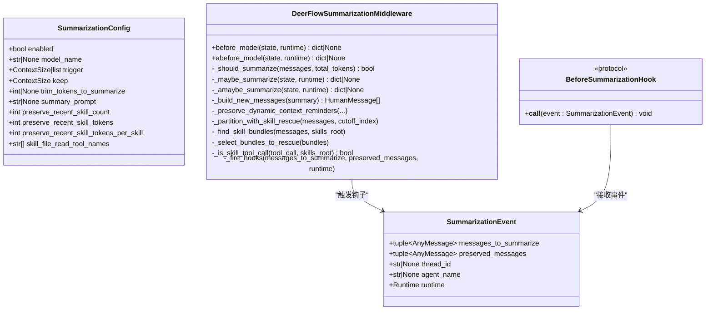
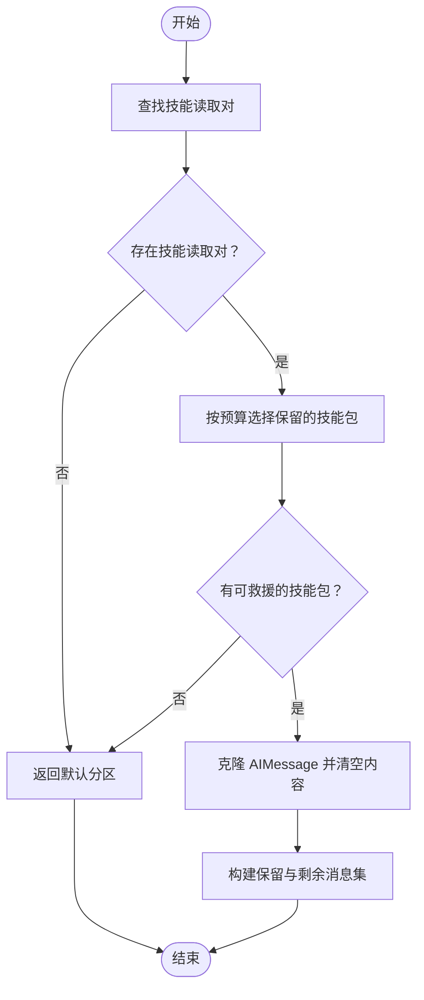
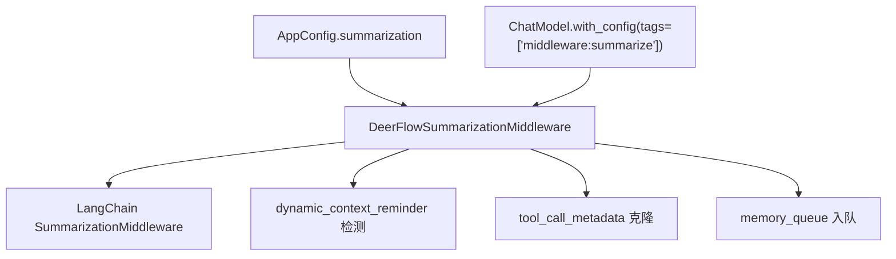

# Summarization 中间件

<cite>
**本文引用的文件**
- [summarization.md](file://backend/docs/summarization.md)
- [middleware-execution-flow.md](file://backend/docs/middleware-execution-flow.md)
- [summarization_middleware.py](file://backend/packages/harness/deerflow/agents/middlewares/summarization_middleware.py)
- [summarization_config.py](file://backend/packages/harness/deerflow/config/summarization_config.py)
- [summarization_hook.py](file://backend/packages/harness/deerflow/agents/memory/summarization_hook.py)
- [agent.py](file://backend/packages/harness/deerflow/agents/lead_agent/agent.py)
- [test_summarization_middleware.py](file://backend/tests/test_summarization_middleware.py)
- [factory.py](file://backend/packages/harness/deerflow/agents/factory.py)
</cite>

## 目录
1. [简介](#简介)
2. [项目结构](#项目结构)
3. [核心组件](#核心组件)
4. [架构总览](#架构总览)
5. [详细组件分析](#详细组件分析)
6. [依赖分析](#依赖分析)
7. [性能考虑](#性能考虑)
8. [故障排查指南](#故障排查指南)
9. [结论](#结论)
10. [附录](#附录)

## 简介
Summarization 中间件用于在对话历史接近模型上下文窗口上限时，自动压缩旧消息并保留最近上下文，从而维持长时间对话的可扩展性。该中间件基于 LangChain 的 SummarizationMiddleware，并在 DeerFlow 中进行了增强，包括：
- 触发阈值配置（按令牌数、消息数量或模型容量比例）
- 保留策略（保留最近的消息/令牌/比例）
- 技能文件读取的“救援”机制，防止技能指令在压缩后丢失
- 动态上下文提醒的保护，避免被错误地压缩
- 钩子系统，允许在压缩前进行审计或持久化等扩展

## 项目结构
Summarization 中间件相关的核心文件分布如下：
- 文档与配置：backend/docs/summarization.md、backend/packages/harness/deerflow/config/summarization_config.py
- 中间件实现：backend/packages/harness/deerflow/agents/middlewares/summarization_middleware.py
- 集成入口：backend/packages/harness/deerflow/agents/lead_agent/agent.py
- 钩子与内存集成：backend/packages/harness/deerflow/agents/memory/summarization_hook.py
- 执行顺序与时序：backend/docs/middleware-execution-flow.md
- 测试用例：backend/tests/test_summarization_middleware.py
- 中间件装配：backend/packages/harness/deerflow/agents/factory.py

图表来源
- [summarization.md](file://backend/docs/summarization.md)
- [summarization_config.py](file://backend/packages/harness/deerflow/config/summarization_config.py)
- [summarization_middleware.py](file://backend/packages/harness/deerflow/agents/middlewares/summarization_middleware.py)
- [summarization_hook.py](file://backend/packages/harness/deerflow/agents/memory/summarization_hook.py)
- [agent.py](file://backend/packages/harness/deerflow/agents/lead_agent/agent.py)
- [factory.py](file://backend/packages/harness/deerflow/agents/factory.py)
- [middleware-execution-flow.md](file://backend/docs/middleware-execution-flow.md)
- [test_summarization_middleware.py](file://backend/tests/test_summarization_middleware.py)

章节来源
- [summarization.md](file://backend/docs/summarization.md)
- [summarization_config.py](file://backend/packages/harness/deerflow/config/summarization_config.py)
- [summarization_middleware.py](file://backend/packages/harness/deerflow/agents/middlewares/summarization_middleware.py)
- [summarization_hook.py](file://backend/packages/harness/deerflow/agents/memory/summarization_hook.py)
- [agent.py](file://backend/packages/harness/deerflow/agents/lead_agent/agent.py)
- [factory.py](file://backend/packages/harness/deerflow/agents/factory.py)
- [middleware-execution-flow.md](file://backend/docs/middleware-execution-flow.md)
- [test_summarization_middleware.py](file://backend/tests/test_summarization_middleware.py)

## 核心组件
- 配置模型：SummarizationConfig 定义触发条件、保留策略、技能救援预算等参数。
- 中间件类：DeerFlowSummarizationMiddleware 继承 LangChain 的 SummarizationMiddleware，扩展了技能救援、动态上下文提醒保护、钩子分发等功能。
- 钩子：BeforeSummarizationHook 协议与 SummarizationEvent 事件对象，用于在压缩前回调外部逻辑（如内存队列入队）。
- 集成入口：lead_agent/agent.py 中的工厂函数负责从应用配置构建中间件实例，并注入模型与钩子。
- 执行顺序：middleware-execution-flow.md 明确 SummarizationMiddleware 在 after_model 阶段运行，位于 TitleMiddleware 之后、DanglingToolCallMiddleware 之前。

章节来源
- [summarization_config.py](file://backend/packages/harness/deerflow/config/summarization_config.py)
- [summarization_middleware.py](file://backend/packages/harness/deerflow/agents/middlewares/summarization_middleware.py)
- [summarization_hook.py](file://backend/packages/harness/deerflow/agents/memory/summarization_hook.py)
- [agent.py](file://backend/packages/harness/deerflow/agents/lead_agent/agent.py)
- [middleware-execution-flow.md](file://backend/docs/middleware-execution-flow.md)

## 架构总览
Summarization 中间件在每轮对话的 after_model 阶段执行，负责：
- 计算消息总令牌数
- 检查是否达到任一触发阈值
- 确定保留边界（keep）
- 分区消息（保留最近、压缩旧内容）
- 技能救援：识别并保留最近加载的技能文件读取结果
- 动态上下文提醒保护：确保提醒消息不被压缩
- 触发钩子：在压缩前通知外部系统
- 生成摘要并替换历史消息

图表来源
- [middleware-execution-flow.md](file://backend/docs/middleware-execution-flow.md)

章节来源
- [middleware-execution-flow.md](file://backend/docs/middleware-execution-flow.md)

## 详细组件分析

### 配置模型与参数
- enabled：启用/禁用自动摘要
- model_name：摘要使用的模型名称；为 null 时使用默认模型
- trigger：触发条件，支持 tokens、messages、fraction 三种类型，可组合多个
- keep：保留策略，指定压缩后保留的最近上下文规模
- trim_tokens_to_summarize：准备摘要输入时的最大令牌数限制
- summary_prompt：自定义摘要提示词（LangChain 默认提示）
- preserve_recent_skill_count：最近技能文件数量预算
- preserve_recent_skill_tokens：最近技能文件总令牌预算
- preserve_recent_skill_tokens_per_skill：单个技能文件最大令牌预算
- skill_file_read_tool_names：被视为技能文件读取的工具名集合

章节来源
- [summarization.md](file://backend/docs/summarization.md)
- [summarization_config.py](file://backend/packages/harness/deerflow/config/summarization_config.py)

### 中间件类与核心逻辑
- 继承关系：DeerFlowSummarizationMiddleware 继承自 LangChain 的 SummarizationMiddleware，并覆盖了摘要消息的格式与钩子分发。
- 触发判断：_should_summarize 支持从父类继承的逻辑或自定义触发元组/列表。
- 压缩流程：_maybe_summarize/_amaybe_summarize 负责分区、救援、钩子、生成摘要与构建新消息。
- 摘要消息格式：_build_new_messages 将摘要包装为带特殊 name 的 HumanMessage，前端忽略显示但模型仍可使用。
- 动态上下文提醒保护：_preserve_dynamic_context_reminders 将提醒消息从压缩集中移出，避免被误判为用户消息。
- 技能救援：_partition_with_skill_rescue 识别 AIMessage + ToolMessage 技能读取对，按预算选择保留最新技能，保证 tool_call ↔ tool_result 成对完整性。
- 钩子系统：_fire_hooks 在压缩前按注册顺序调用 BeforeSummarizationHook，异常不会阻断压缩流程。

图表来源
- [summarization_config.py](file://backend/packages/harness/deerflow/config/summarization_config.py)
- [summarization_middleware.py](file://backend/packages/harness/deerflow/agents/middlewares/summarization_middleware.py)

章节来源
- [summarization_middleware.py](file://backend/packages/harness/deerflow/agents/middlewares/summarization_middleware.py)
- [summarization_config.py](file://backend/packages/harness/deerflow/config/summarization_config.py)

### 技能救援算法
技能救援旨在防止摘要压缩导致最近加载的技能文件内容丢失。算法要点：
- 识别 AIMessage + ToolMessage 技能读取对，按工具调用 ID 关联
- 计算每个技能读取的令牌量，按“最新优先”遍历
- 应用三个预算约束：技能数量、总令牌、单技能令牌上限
- 保持 tool_call ↔ tool_result 成对完整性，必要时克隆 AIMessage 并清空内容

图表来源
- [summarization_middleware.py](file://backend/packages/harness/deerflow/agents/middlewares/summarization_middleware.py)

章节来源
- [summarization_middleware.py](file://backend/packages/harness/deerflow/agents/middlewares/summarization_middleware.py)

### 钩子与内存集成
- memory_flush_hook：在压缩前将即将被移除的消息过滤后入队到内存队列，支持纠正与强化检测。
- 钩子注册：lead_agent/agent.py 在启用记忆时将 memory_flush_hook 注入中间件的 before_summarization 钩子列表。

章节来源
- [summarization_hook.py](file://backend/packages/harness/deerflow/agents/memory/summarization_hook.py)
- [agent.py](file://backend/packages/harness/deerflow/agents/lead_agent/agent.py)

### 执行顺序与装配
- 执行顺序：SummarizationMiddleware 在 after_model 阶段运行，位于 TitleMiddleware 之后、DanglingToolCallMiddleware 之前。
- 装配逻辑：factory.py 固定内置中间件顺序，SummarizationMiddleware 位于第6位；agent.py 从应用配置构建中间件实例并注入模型与钩子。

章节来源
- [middleware-execution-flow.md](file://backend/docs/middleware-execution-flow.md)
- [factory.py](file://backend/packages/harness/deerflow/agents/factory.py)
- [agent.py](file://backend/packages/harness/deerflow/agents/lead_agent/agent.py)

## 依赖分析
- 外部依赖：LangChain 的 SummarizationMiddleware、AgentState、消息类型（AIMessage、ToolMessage、RemoveMessage）。
- 内部依赖：动态上下文提醒检测、工具调用元数据克隆、内存队列与消息过滤。
- 配置依赖：应用配置中的 summarization 字段，以及模型创建与标签注入。

图表来源
- [summarization_middleware.py](file://backend/packages/harness/deerflow/agents/middlewares/summarization_middleware.py)
- [agent.py](file://backend/packages/harness/deerflow/agents/lead_agent/agent.py)

章节来源
- [summarization_middleware.py](file://backend/packages/harness/deerflow/agents/middlewares/summarization_middleware.py)
- [agent.py](file://backend/packages/harness/deerflow/agents/lead_agent/agent.py)

## 性能考虑
- 触发阈值：建议结合 tokens 与 messages 两种阈值，避免单一阈值导致的过度或不足压缩。
- 保留策略：优先使用消息数量保留，便于自然对话节奏；在精确令牌预算场景使用令牌保留。
- 模型选择：摘要使用轻量模型可显著降低成本；若质量要求高，可使用更强模型但需权衡成本。
- 输入修剪：trim_tokens_to_summarize 控制摘要输入大小，减少昂贵的摘要调用。
- 技能救援预算：合理设置 preserve_recent_skill_count、preserve_recent_skill_tokens 与 per-skill cap，避免因技能内容过大导致频繁压缩失败。

章节来源
- [summarization.md](file://backend/docs/summarization.md)

## 故障排查指南
- 摘要质量不佳
  - 提升保留数量或降低触发阈值
  - 自定义 summary_prompt 强调关键信息
  - 提升摘要模型能力
- 压缩频率过高
  - 提高触发阈值或降低保留数量
  - 减少 trim_tokens_to_summarize
- 令牌超限
  - 降低触发阈值或减少保留
  - 使用 fraction-based 触发
- 技能指令丢失
  - 检查 preserve_recent_skill_count/tokens 设置
  - 确认 skill_file_read_tool_names 与 skills_container_path 配置正确
- 钩子异常
  - 钩子异常不会阻断压缩，但会记录日志；检查钩子实现与日志输出

章节来源
- [summarization.md](file://backend/docs/summarization.md)
- [test_summarization_middleware.py](file://backend/tests/test_summarization_middleware.py)

## 结论
Summarization 中间件通过可配置的触发与保留策略，在不影响对话连贯性的前提下有效控制上下文长度。其技能救援与动态上下文提醒保护机制进一步增强了长期对话的稳定性与可用性。配合钩子系统，可在压缩前完成审计与持久化等扩展动作。通过合理的阈值与预算设置，可在成本与质量之间取得良好平衡。

## 附录

### 使用示例与参数调优
- 最小配置：启用、按令牌触发、按消息保留
- 生产配置：轻量模型、多阈值触发、适度保留、输入修剪
- 多模型配置：按比例触发与保留，自动适配不同模型容量
- 高质量保守配置：使用更强模型、更大保留、关闭输入修剪

章节来源
- [summarization.md](file://backend/docs/summarization.md)

### 与其他中间件的集成
- 执行顺序：SummarizationMiddleware 在 after_model 阶段运行，位于 TitleMiddleware 之后、DanglingToolCallMiddleware 之前。
- 与 MemoryMiddleware 的协作：通过 before_summarization 钩子将即将被压缩的消息入队到内存队列。
- 与 DynamicContextMiddleware 的协作：保护动态上下文提醒，避免被误判为普通用户消息。

章节来源
- [middleware-execution-flow.md](file://backend/docs/middleware-execution-flow.md)
- [summarization_hook.py](file://backend/packages/harness/deerflow/agents/memory/summarization_hook.py)
- [summarization_middleware.py](file://backend/packages/harness/deerflow/agents/middlewares/summarization_middleware.py)