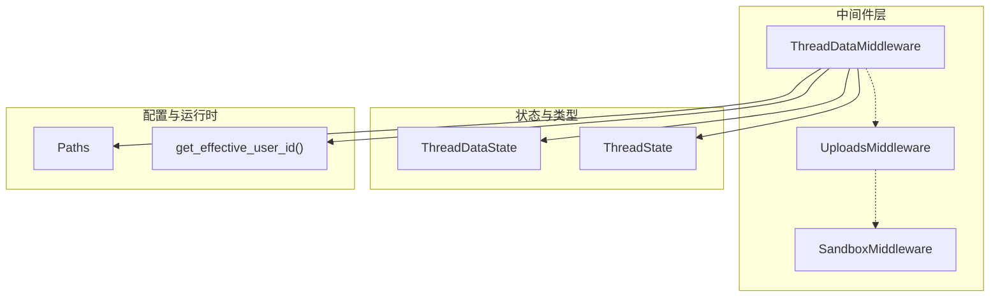
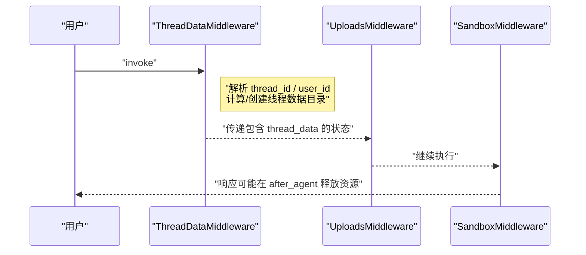
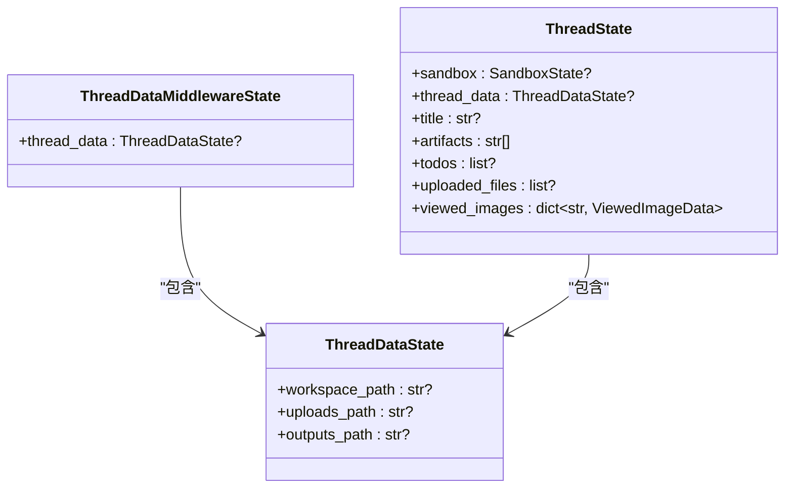
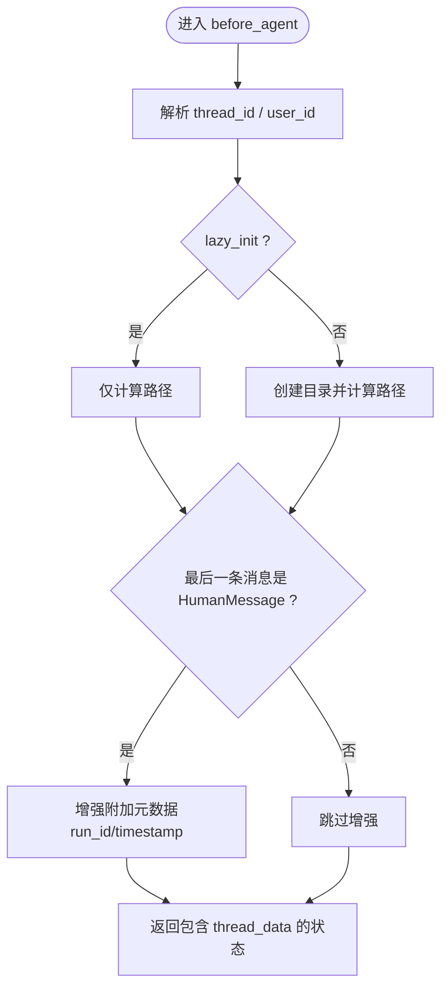
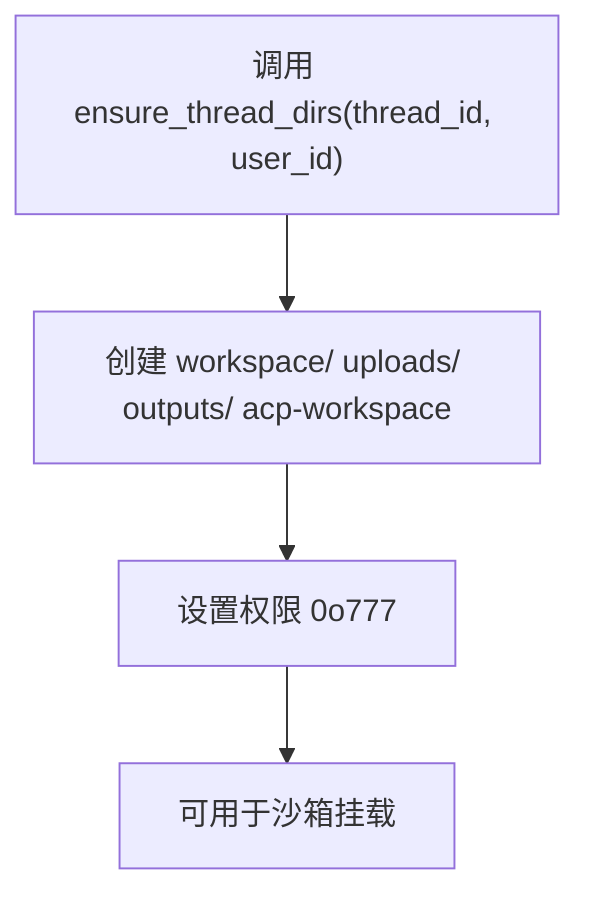
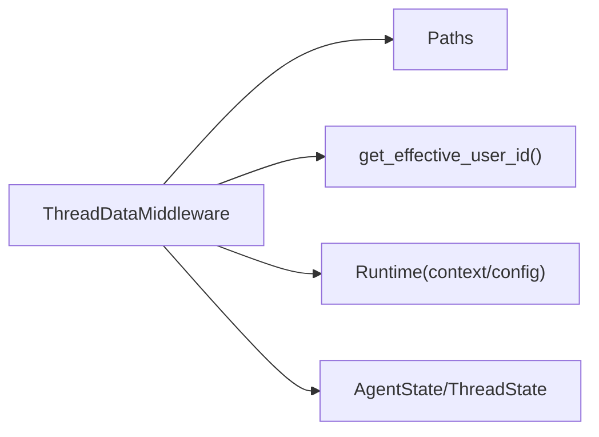

# ThreadData 中间件

<cite>
**本文引用的文件**
- [thread_data_middleware.py](file://backend/packages/harness/deerflow/agents/middlewares/thread_data_middleware.py)
- [thread_state.py](file://backend/packages/harness/deerflow/agents/thread_state.py)
- [paths.py](file://backend/packages/harness/deerflow/config/paths.py)
- [user_context.py](file://backend/packages/harness/deerflow/runtime/user_context.py)
- [factory.py](file://backend/packages/harness/deerflow/agents/factory.py)
- [middleware-execution-flow.md](file://backend/docs/middleware-execution-flow.md)
- [test_thread_data_middleware.py](file://backend/tests/test_thread_data_middleware.py)
</cite>

## 目录
1. [简介](#简介)
2. [项目结构](#项目结构)
3. [核心组件](#核心组件)
4. [架构总览](#架构总览)
5. [详细组件分析](#详细组件分析)
6. [依赖分析](#依赖分析)
7. [性能考虑](#性能考虑)
8. [故障排查指南](#故障排查指南)
9. [结论](#结论)
10. [附录](#附录)

## 简介
ThreadData 中间件用于在每次线程（thread）执行前，为当前会话准备并暴露“线程数据”目录结构，包括工作区、上传目录与输出目录的路径，并可选择性地在首次访问时按需创建这些目录。它还负责在必要时增强人类消息的附加元数据，以便后续中间件或下游逻辑使用。

该中间件在中间件链中处于靠前位置（通常位于 Uploads 之前），确保沙箱等后续中间件能够正确挂载线程数据目录；同时，它不参与 after_agent 生命周期，保持“只创建目录，不清理”的职责边界。

## 项目结构
与 ThreadData 中间件直接相关的代码与文档分布如下：
- 中间件实现：backend/packages/harness/deerflow/agents/middlewares/thread_data_middleware.py
- 线程状态类型定义：backend/packages/harness/deerflow/agents/thread_state.py
- 路径配置与目录创建：backend/packages/harness/deerflow/config/paths.py
- 用户上下文（用于用户隔离）：backend/packages/harness/deerflow/runtime/user_context.py
- 中间件装配工厂：backend/packages/harness/deerflow/agents/factory.py
- 中间件执行流程文档：backend/docs/middleware-execution-flow.md
- 单元测试：backend/tests/test_thread_data_middleware.py

图表来源
- [thread_data_middleware.py:1-119](file://backend/packages/harness/deerflow/agents/middlewares/thread_data_middleware.py#L1-L119)
- [thread_state.py:10-56](file://backend/packages/harness/deerflow/agents/thread_state.py#L10-L56)
- [paths.py:62-351](file://backend/packages/harness/deerflow/config/paths.py#L62-L351)
- [user_context.py:100-110](file://backend/packages/harness/deerflow/runtime/user_context.py#L100-L110)

章节来源
- [thread_data_middleware.py:1-119](file://backend/packages/harness/deerflow/agents/middlewares/thread_data_middleware.py#L1-L119)
- [thread_state.py:10-56](file://backend/packages/harness/deerflow/agents/thread_state.py#L10-L56)
- [paths.py:62-351](file://backend/packages/harness/deerflow/config/paths.py#L62-L351)
- [user_context.py:100-110](file://backend/packages/harness/deerflow/runtime/user_context.py#L100-L110)

## 核心组件
- ThreadDataMiddlewareState：扩展自 AgentState，新增 thread_data 字段，用于承载线程数据路径信息。
- ThreadDataMiddleware：核心中间件，负责解析线程 ID、确定用户 ID、计算并可选创建线程数据目录，以及在必要时增强人类消息的附加元数据。
- ThreadDataState：描述线程数据目录的结构化类型，包含工作区、上传与输出三类路径。
- Paths：集中管理路径解析与目录创建，提供线程目录、沙箱挂载目录等路径生成与安全校验。
- user_context.get_effective_user_id：从请求上下文中解析有效用户 ID，用于用户级隔离的路径组织。

章节来源
- [thread_data_middleware.py:18-119](file://backend/packages/harness/deerflow/agents/middlewares/thread_data_middleware.py#L18-L119)
- [thread_state.py:10-56](file://backend/packages/harness/deerflow/agents/thread_state.py#L10-L56)
- [paths.py:62-351](file://backend/packages/harness/deerflow/config/paths.py#L62-L351)
- [user_context.py:100-110](file://backend/packages/harness/deerflow/runtime/user_context.py#L100-L110)

## 架构总览
ThreadData 中间件在中间件链中的位置与职责如下：
- 位置：通常在 Uploads 之前，确保后续中间件（如 Sandbox）能正确挂载线程数据目录。
- 生命周期：仅在 before_agent 阶段执行，负责计算/创建线程数据目录并返回给后续中间件。
- 与其他中间件的关系：与 Uploads、Sandbox 等中间件顺序协作；与 Memory、Title、Summarization 等中间件在 after_model/after_agent 阶段无直接耦合。

图表来源
- [middleware-execution-flow.md:77-154](file://backend/docs/middleware-execution-flow.md#L77-L154)
- [factory.py:196-203](file://backend/packages/harness/deerflow/agents/factory.py#L196-L203)

章节来源
- [middleware-execution-flow.md:77-154](file://backend/docs/middleware-execution-flow.md#L77-L154)
- [factory.py:196-203](file://backend/packages/harness/deerflow/agents/factory.py#L196-L203)

## 详细组件分析

### 数据结构与类型
- ThreadDataState：描述线程数据目录的结构化类型，包含工作区、上传与输出三类路径字段。
- ThreadState：AgentState 的扩展，包含 thread_data 字段及 artifacts、viewed_images 等其他状态。
- ThreadDataMiddlewareState：AgentMiddleware[ThreadDataMiddlewareState] 的状态类型，兼容 ThreadState 的结构。

图表来源
- [thread_state.py:10-56](file://backend/packages/harness/deerflow/agents/thread_state.py#L10-L56)
- [thread_data_middleware.py:18-22](file://backend/packages/harness/deerflow/agents/middlewares/thread_data_middleware.py#L18-L22)

章节来源
- [thread_state.py:10-56](file://backend/packages/harness/deerflow/agents/thread_state.py#L10-L56)
- [thread_data_middleware.py:18-22](file://backend/packages/harness/deerflow/agents/middlewares/thread_data_middleware.py#L18-L22)

### 状态转换与生命周期
- before_agent：解析 thread_id 与 user_id，计算线程数据目录路径；根据 lazy_init 决定是否立即创建目录；必要时增强人类消息的附加元数据（如 run_id、timestamp）。
- after_agent：不进行任何操作（职责最小化）。

图表来源
- [thread_data_middleware.py:81-119](file://backend/packages/harness/deerflow/agents/middlewares/thread_data_middleware.py#L81-L119)

章节来源
- [thread_data_middleware.py:81-119](file://backend/packages/harness/deerflow/agents/middlewares/thread_data_middleware.py#L81-L119)

### 持久化机制
- 目录创建策略：
  - 懒加载（lazy_init=True，默认）：仅计算路径，不主动创建目录，降低启动开销。
  - 急加载（lazy_init=False）：在 before_agent 中立即创建目录，确保后续中间件可用。
- 路径与挂载：
  - Paths 提供线程目录与沙箱挂载目录的生成与校验，保证路径安全与跨平台兼容。
  - 线程数据目录在宿主机与沙箱内的虚拟路径映射清晰，便于工具与沙箱容器读写。

图表来源
- [paths.py:260-281](file://backend/packages/harness/deerflow/config/paths.py#L260-L281)

章节来源
- [paths.py:260-281](file://backend/packages/harness/deerflow/config/paths.py#L260-L281)

### 配置选项
- base_dir：线程数据根目录，支持构造参数、环境变量 DEER_FLOW_HOME 与回退到运行时 home 目录。
- lazy_init：是否延迟创建目录（默认 True，提升性能）。
- 线程 ID 解析优先级：
  1) runtime.context["thread_id"]
  2) config.configurable["thread_id"]
  3) 抛出错误（缺少 thread_id）

章节来源
- [thread_data_middleware.py:39-50](file://backend/packages/harness/deerflow/agents/middlewares/thread_data_middleware.py#L39-L50)
- [thread_data_middleware.py:81-90](file://backend/packages/harness/deerflow/agents/middlewares/thread_data_middleware.py#L81-L90)
- [paths.py:88-122](file://backend/packages/harness/deerflow/config/paths.py#L88-L122)

### 使用示例
- 在默认装配中，ThreadDataMiddleware 作为第 0 个中间件被添加，lazy_init=True，确保后续中间件能正确挂载线程数据目录。
- 测试覆盖了以下场景：
  - context 中存在 thread_id：返回正确的 workspace/ uploads/ outputs 路径。
  - context 为空但 config.configurable 中存在 thread_id：同样返回正确路径且不修改 context。
  - 缺少 thread_id：抛出明确错误。

章节来源
- [factory.py:196-203](file://backend/packages/harness/deerflow/agents/factory.py#L196-L203)
- [test_thread_data_middleware.py:12-58](file://backend/tests/test_thread_data_middleware.py#L12-L58)

## 依赖分析
- 对 Paths 的依赖：用于路径解析与目录创建，确保线程数据目录结构一致且安全。
- 对 user_context 的依赖：用于用户隔离，避免不同用户的数据相互污染。
- 对 LangGraph Runtime 的依赖：从 runtime.context 或 config.configurable 中提取 thread_id。
- 对 AgentState 的依赖：扩展状态结构，向后续中间件传递 thread_data。

图表来源
- [thread_data_middleware.py:11-13](file://backend/packages/harness/deerflow/agents/middlewares/thread_data_middleware.py#L11-L13)
- [paths.py:62-351](file://backend/packages/harness/deerflow/config/paths.py#L62-L351)
- [user_context.py:100-110](file://backend/packages/harness/deerflow/runtime/user_context.py#L100-L110)

章节来源
- [thread_data_middleware.py:11-13](file://backend/packages/harness/deerflow/agents/middlewares/thread_data_middleware.py#L11-L13)
- [paths.py:62-351](file://backend/packages/harness/deerflow/config/paths.py#L62-L351)
- [user_context.py:100-110](file://backend/packages/harness/deerflow/runtime/user_context.py#L100-L110)

## 性能考虑
- 默认懒加载（lazy_init=True）：避免不必要的磁盘 I/O，提升启动速度；在真正需要时才创建目录。
- 目录权限设置为 0o777：确保沙箱容器以不同 UID 运行时仍可写入，减少权限错误导致的重试与失败。
- 路径安全校验：限制 thread_id 与 user_id 的字符集，防止路径遍历与非法字符引发的安全问题。
- 仅在 before_agent 执行：避免在每轮对话中重复创建目录，降低开销。

章节来源
- [thread_data_middleware.py:39-50](file://backend/packages/harness/deerflow/agents/middlewares/thread_data_middleware.py#L39-L50)
- [paths.py:260-281](file://backend/packages/harness/deerflow/config/paths.py#L260-L281)
- [paths.py:20-31](file://backend/packages/harness/deerflow/config/paths.py#L20-L31)

## 故障排查指南
- 缺少 thread_id：
  - 现象：抛出 ValueError，提示 thread_id 必须存在于 runtime.context 或 config.configurable。
  - 排查：确认调用方是否正确设置 runtime.context["thread_id"]，或在 config.configurable 中传入。
- 路径非法：
  - 现象：路径解析时报错，提示 thread_id 或 user_id 包含非法字符。
  - 排查：确保 thread_id 与 user_id 仅包含字母、数字、连字符与下划线。
- 权限问题：
  - 现象：沙箱容器无法写入线程数据目录。
  - 排查：确认目录已按 0o777 权限创建；若使用宿主机路径映射，确认 DEER_FLOW_HOST_BASE_DIR 设置正确。
- 目录未创建：
  - 现象：后续中间件找不到线程数据目录。
  - 排查：若使用 lazy_init=True，请确保在实际使用前触发了目录创建；或改为 lazy_init=False。

章节来源
- [thread_data_middleware.py:81-90](file://backend/packages/harness/deerflow/agents/middlewares/thread_data_middleware.py#L81-L90)
- [paths.py:20-31](file://backend/packages/harness/deerflow/config/paths.py#L20-L31)
- [paths.py:260-281](file://backend/packages/harness/deerflow/config/paths.py#L260-L281)
- [test_thread_data_middleware.py:50-58](file://backend/tests/test_thread_data_middleware.py#L50-L58)

## 结论
ThreadData 中间件通过“懒加载 + 安全路径 + 用户隔离”的设计，在保证性能的同时提供了可靠的线程数据目录管理能力。它在中间件链中承担“基础设施”的角色，为后续中间件（尤其是沙箱与上传）提供稳定的文件系统基础。遵循本文档的配置与最佳实践，可有效避免常见问题并获得更佳的运行效率。

## 附录
- 中间件装配顺序参考：在默认装配中，ThreadDataMiddleware 位于第 0 位，UploadsMiddleware 位于第 1 位，SandboxMiddleware 位于第 2 位。
- 执行流程参考：中间件执行采用“管道”而非“洋葱”，before_agent 正序执行，after_model 反序执行，ClarificationMiddleware 位于末尾以拦截 ask_clarification。

章节来源
- [factory.py:196-203](file://backend/packages/harness/deerflow/agents/factory.py#L196-L203)
- [middleware-execution-flow.md:262-264](file://backend/docs/middleware-execution-flow.md#L262-L264)