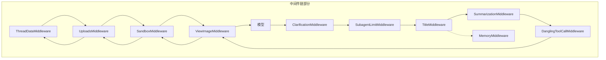
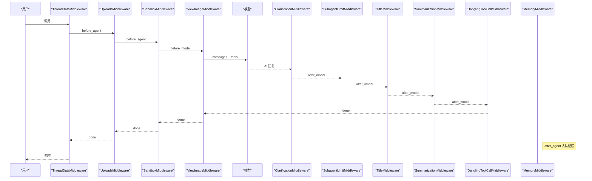
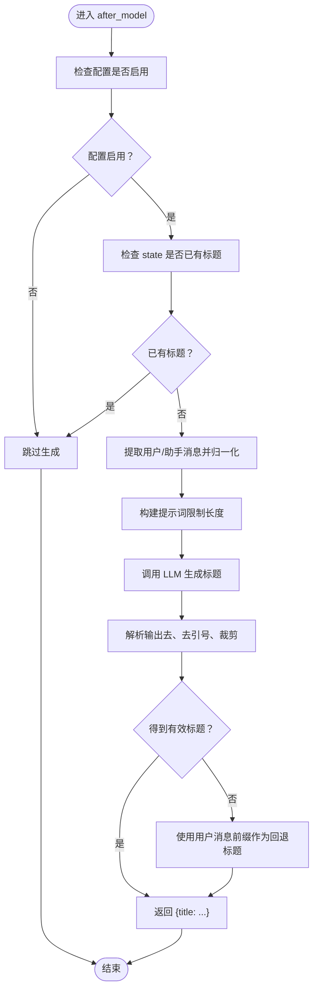
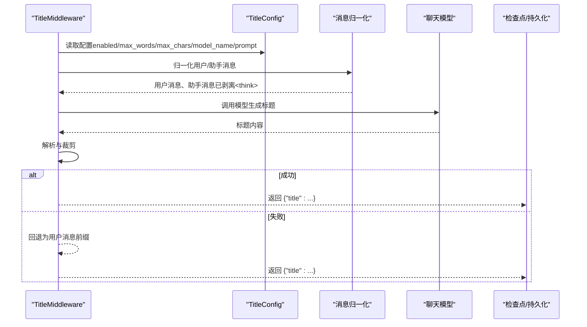
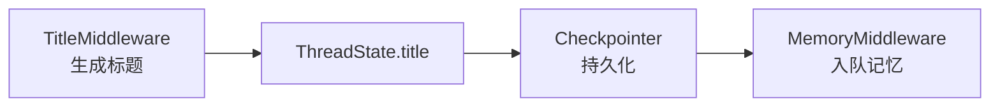
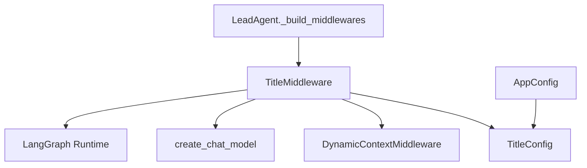

# Title 中间件

<cite>
**本文引用的文件**
- [title_middleware.py](file://backend/packages/harness/deerflow/agents/middlewares/title_middleware.py)
- [title_config.py](file://backend/packages/harness/deerflow/config/title_config.py)
- [app_config.py](file://backend/packages/harness/deerflow/config/app_config.py)
- [agent.py](file://backend/packages/harness/deerflow/agents/lead_agent/agent.py)
- [dynamic_context_middleware.py](file://backend/packages/harness/deerflow/agents/middlewares/dynamic_context_middleware.py)
- [AUTO_TITLE_GENERATION.md](file://backend/docs/AUTO_TITLE_GENERATION.md)
- [TITLE_GENERATION_IMPLEMENTATION.md](file://backend/docs/TITLE_GENERATION_IMPLEMENTATION.md)
- [middleware-execution-flow.md](file://backend/docs/middleware-execution-flow.md)
- [test_title_middleware_core_logic.py](file://backend/tests/test_title_middleware_core_logic.py)
- [test_title_generation.py](file://backend/tests/test_title_generation.py)
</cite>

## 目录
1. [简介](#简介)
2. [项目结构](#项目结构)
3. [核心组件](#核心组件)
4. [架构总览](#架构总览)
5. [详细组件分析](#详细组件分析)
6. [依赖关系分析](#依赖关系分析)
7. [性能考量](#性能考量)
8. [故障排查指南](#故障排查指南)
9. [结论](#结论)
10. [附录](#附录)

## 简介
Title 中间件用于在对话线程首次完成一轮“用户消息—助手回复”后，自动为该线程生成标题。它在 LangGraph 的 middleware 链中位于“模型输出之后、记忆写入之前”，通过调用 LLM 生成标题，并将结果存入线程状态（ThreadState）以便持久化与后续读取。该中间件具备完善的触发条件判断、内容归一化、思考标签剥离、回退策略与异步调用能力，同时与动态上下文注入中间件协同，避免将系统提醒消息误判为用户输入。

## 项目结构
- 中间件实现：位于 packages/harness/deerflow/agents/middlewares/title_middleware.py
- 配置模型：位于 packages/harness/deerflow/config/title_config.py
- 应用配置集成：位于 packages/harness/deerflow/config/app_config.py
- 主代理注册：位于 packages/harness/deerflow/agents/lead_agent/agent.py
- 动态上下文中间件（辅助识别用户消息）：位于 packages/harness/deerflow/agents/middlewares/dynamic_context_middleware.py
- 文档：AUTO_TITLE_GENERATION.md、TITLE_GENERATION_IMPLEMENTATION.md、middleware-execution-flow.md
- 测试：tests/test_title_middleware_core_logic.py、tests/test_title_generation.py

图表来源
- [middleware-execution-flow.md:79-154](file://backend/docs/middleware-execution-flow.md#L79-L154)

章节来源
- [middleware-execution-flow.md:7-26](file://backend/docs/middleware-execution-flow.md#L7-L26)
- [agent.py:283-287](file://backend/packages/harness/deerflow/agents/lead_agent/agent.py#L283-L287)

## 核心组件
- TitleMiddlewareState：扩展自 AgentState，新增 title 字段，用于承载线程标题。
- TitleMiddleware：核心中间件，负责判断触发条件、构建提示词、调用 LLM、解析输出、回退策略与状态更新。
- TitleConfig：标题生成的配置项集合，包括开关、最大词数、最大字符数、模型名与提示词模板。
- AppConfig：应用级配置容器，包含 title 字段，支持从配置文件加载 title 配置。
- 动态上下文中间件：辅助识别“真实用户消息”，过滤系统提醒消息，避免误触发标题生成。

章节来源
- [title_middleware.py:23-32](file://backend/packages/harness/deerflow/agents/middlewares/title_middleware.py#L23-L32)
- [title_config.py:6-32](file://backend/packages/harness/deerflow/config/title_config.py#L6-L32)
- [app_config.py:104-104](file://backend/packages/harness/deerflow/config/app_config.py#L104-L104)
- [dynamic_context_middleware.py:57-59](file://backend/packages/harness/deerflow/agents/middlewares/dynamic_context_middleware.py#L57-L59)

## 架构总览
Title 中间件在 middleware 链中的执行顺序如下：
- before_agent：准备阶段（例如目录创建、文件扫描、沙箱获取等）
- before_model：图像注入等（如存在视觉能力）
- after_model：TitleMiddleware 在此处生成标题
- after_agent：释放资源、入队记忆等

图表来源
- [middleware-execution-flow.md:79-154](file://backend/docs/middleware-execution-flow.md#L79-L154)

章节来源
- [middleware-execution-flow.md:26-264](file://backend/docs/middleware-execution-flow.md#L26-L264)

## 详细组件分析

### 触发策略与质量评估
- 触发条件
  - 配置启用且线程尚未有标题
  - 至少包含一条“真实用户消息”（排除系统提醒）
  - 至少包含一条助手回复
  - 仅当首次完整对话交换完成后触发（1 个用户消息 + ≥1 个助手回复）
- 质量评估
  - 内容归一化：支持字符串、列表、字典等多种消息结构，统一抽取文本
  - 思维标签剥离：去除推理模型输出中的<think>…</think>块，避免污染标题
  - 最大字符限制：根据配置裁剪标题长度
  - 回退策略：异步生成失败时，使用用户第一条消息的前缀作为标题
- 用户偏好设置
  - enabled：是否启用
  - max_words：标题最大词数（1–20）
  - max_chars：标题最大字符数（10–200）
  - model_name：指定用于标题生成的模型名称（None 表示使用默认）
  - prompt_template：标题生成提示词模板

图表来源
- [title_middleware.py:69-122](file://backend/packages/harness/deerflow/agents/middlewares/title_middleware.py#L69-L122)
- [title_middleware.py:146-176](file://backend/packages/harness/deerflow/agents/middlewares/title_middleware.py#L146-L176)

章节来源
- [title_middleware.py:69-122](file://backend/packages/harness/deerflow/agents/middlewares/title_middleware.py#L69-L122)
- [title_middleware.py:146-184](file://backend/packages/harness/deerflow/agents/middlewares/title_middleware.py#L146-L184)
- [title_config.py:9-32](file://backend/packages/harness/deerflow/config/title_config.py#L9-L32)

### 数据流与状态更新
- 输入：AgentState（包含 messages、title 等）
- 处理：构建提示词 → 异步调用模型 → 解析与裁剪 → 回退策略
- 输出：返回包含 title 的字典，由 LangGraph 自动合并至 state 并持久化（若配置了 checkpointer）

图表来源
- [title_middleware.py:91-122](file://backend/packages/harness/deerflow/agents/middlewares/title_middleware.py#L91-L122)
- [title_middleware.py:154-176](file://backend/packages/harness/deerflow/agents/middlewares/title_middleware.py#L154-L176)

章节来源
- [AUTO_TITLE_GENERATION.md:1-102](file://backend/docs/AUTO_TITLE_GENERATION.md#L1-L102)
- [title_middleware.py:146-184](file://backend/packages/harness/deerflow/agents/middlewares/title_middleware.py#L146-L184)

### 与记忆系统的集成与历史标题管理
- 存储位置：ThreadState.title（而非 thread metadata），便于通过 checkpointer 自动持久化
- 执行时机：在 MemoryMiddleware 之前，确保标题写入后才进行记忆入队
- 历史管理：由于标题仅在首次完整对话后生成一次，因此无需复杂的历史维护；若需重新生成，可在业务层删除 state.title 后触发重算

图表来源
- [AUTO_TITLE_GENERATION.md:19-36](file://backend/docs/AUTO_TITLE_GENERATION.md#L19-L36)
- [agent.py:283-287](file://backend/packages/harness/deerflow/agents/lead_agent/agent.py#L283-L287)

章节来源
- [AUTO_TITLE_GENERATION.md:19-36](file://backend/docs/AUTO_TITLE_GENERATION.md#L19-L36)
- [agent.py:283-287](file://backend/packages/harness/deerflow/agents/lead_agent/agent.py#L283-L287)

### 配置选项与使用示例
- 配置项
  - enabled：是否启用自动标题生成
  - max_words：标题最大词数（默认 6，范围 1–20）
  - max_chars：标题最大字符数（默认 60，范围 10–200）
  - model_name：模型名称（默认 None，表示使用默认模型）
  - prompt_template：提示词模板（默认提供简洁指令）
- 配置方式
  - 在 config.yaml 中添加 title 段落
  - 通过代码设置 TitleConfig 并调用 set_title_config
  - 通过 AppConfig 从文件加载（title 字段）
- 客户端读取
  - 从线程 state.values.title 读取标题，若为空则显示“New Conversation”

章节来源
- [title_config.py:9-32](file://backend/packages/harness/deerflow/config/title_config.py#L9-L32)
- [app_config.py:202-202](file://backend/packages/harness/deerflow/config/app_config.py#L202-L202)
- [AUTO_TITLE_GENERATION.md:61-83](file://backend/docs/AUTO_TITLE_GENERATION.md#L61-L83)
- [AUTO_TITLE_GENERATION.md:85-142](file://backend/docs/AUTO_TITLE_GENERATION.md#L85-L142)

### 与动态上下文中间件的协作
- 动态上下文中间件会在首次用户消息前注入系统提醒（如记忆片段与日期），并标记为“动态提醒”
- TitleMiddleware 通过 is_dynamic_context_reminder 过滤掉此类消息，仅使用真实的用户输入作为标题来源，避免将系统提示误判为用户意图

章节来源
- [dynamic_context_middleware.py:57-59](file://backend/packages/harness/deerflow/agents/middlewares/dynamic_context_middleware.py#L57-L59)
- [title_middleware.py:65-68](file://backend/packages/harness/deerflow/agents/middlewares/title_middleware.py#L65-L68)

## 依赖关系分析
- TitleMiddleware 依赖
  - TitleConfig：读取配置
  - 动态上下文中间件：识别真实用户消息
  - 模型工厂：create_chat_model（异步调用）
  - LangGraph 运行时：after_model 钩子
- 注册与装配
  - Lead Agent 在中间件链中追加 TitleMiddleware
  - AppConfig 提供全局 title 配置，支持从文件加载

图表来源
- [title_middleware.py:39-44](file://backend/packages/harness/deerflow/agents/middlewares/title_middleware.py#L39-L44)
- [agent.py:283-287](file://backend/packages/harness/deerflow/agents/lead_agent/agent.py#L283-L287)
- [app_config.py:202-202](file://backend/packages/harness/deerflow/config/app_config.py#L202-L202)

章节来源
- [agent.py:283-287](file://backend/packages/harness/deerflow/agents/lead_agent/agent.py#L283-L287)
- [app_config.py:202-202](file://backend/packages/harness/deerflow/config/app_config.py#L202-L202)

## 性能考量
- 延迟：LLM 调用带来约 0.5–1 秒延迟，属于一次性开销
- 并发安全：在 after_model 钩子执行，不阻塞主流程
- 资源消耗：每个线程仅生成一次标题
- 优化建议
  - 使用更快的模型（如 gpt-3.5-turbo）
  - 降低 max_words 与 max_chars
  - 简化提示词模板
  - 在失败时快速回退，避免重复尝试

章节来源
- [TITLE_GENERATION_IMPLEMENTATION.md:189-200](file://backend/docs/TITLE_GENERATION_IMPLEMENTATION.md#L189-L200)

## 故障排查指南
- 标题未生成
  - 检查配置 enabled 是否为 True
  - 确认是否为首次完整对话（1 个用户消息 + ≥1 个助手回复）
  - 确保 state 中 title 为空
- 标题生成但客户端看不到
  - 从 state.values.title 读取，而非 thread.metadata.title
  - 重新获取线程 state
- 标题重启后丢失
  - 配置 checkpointer（本地开发）
  - 平台部署默认持久化
  - 检查数据库连接与 checkpointer 状态
- 异步调用失败
  - 观察日志中的异常信息
  - 回退到本地前缀标题策略

章节来源
- [AUTO_TITLE_GENERATION.md:197-216](file://backend/docs/AUTO_TITLE_GENERATION.md#L197-L216)
- [test_title_middleware_core_logic.py:166-184](file://backend/tests/test_title_middleware_core_logic.py#L166-L184)

## 结论
Title 中间件通过严格的触发条件、健壮的内容归一化与回退策略，实现了稳定可靠的自动标题生成。其与动态上下文中间件的协作确保了用户意图的准确识别；与记忆中间件的时序安排保证了标题在持久化与记忆入队之间的正确顺序。配合灵活的配置与测试覆盖，该中间件为对话线程提供了高质量的可发现性与可追溯性。

## 附录

### API 与行为测试要点
- 配置类验证：enabled、max_words、max_chars 的边界校验
- 中间件初始化与状态模式
- 触发条件测试：禁用、已存在标题、非首次对话、动态提醒消息
- 异步生成：模型调用、回退策略、RunnableConfig 标签
- 内容归一化：列表/字典消息结构、思考标签剥离
- 同步回退：在无模型可用时的本地标题生成

章节来源
- [test_title_generation.py:9-61](file://backend/tests/test_title_generation.py#L9-L61)
- [test_title_middleware_core_logic.py:36-93](file://backend/tests/test_title_middleware_core_logic.py#L36-L93)
- [test_title_middleware_core_logic.py:95-118](file://backend/tests/test_title_middleware_core_logic.py#L95-L118)
- [test_title_middleware_core_logic.py:166-184](file://backend/tests/test_title_middleware_core_logic.py#L166-L184)
- [test_title_middleware_core_logic.py:206-234](file://backend/tests/test_title_middleware_core_logic.py#L206-L234)
- [test_title_middleware_core_logic.py:235-300](file://backend/tests/test_title_middleware_core_logic.py#L235-L300)