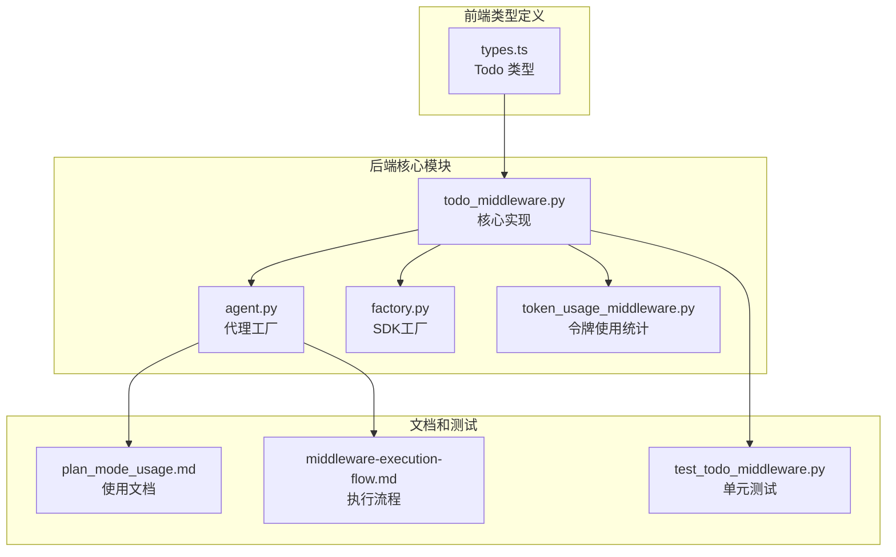
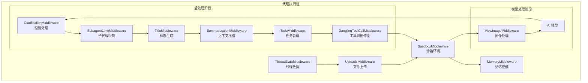
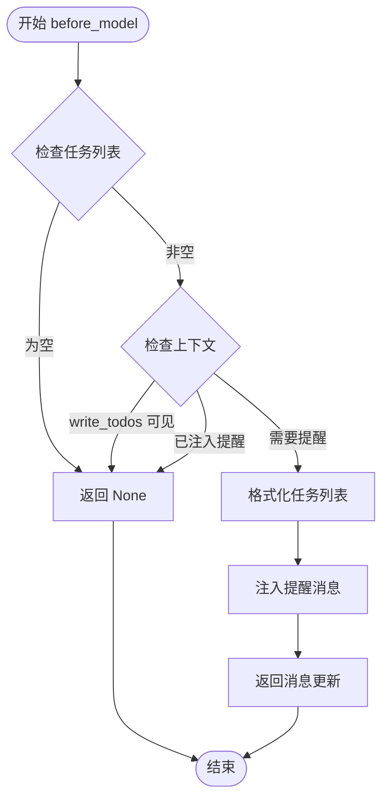
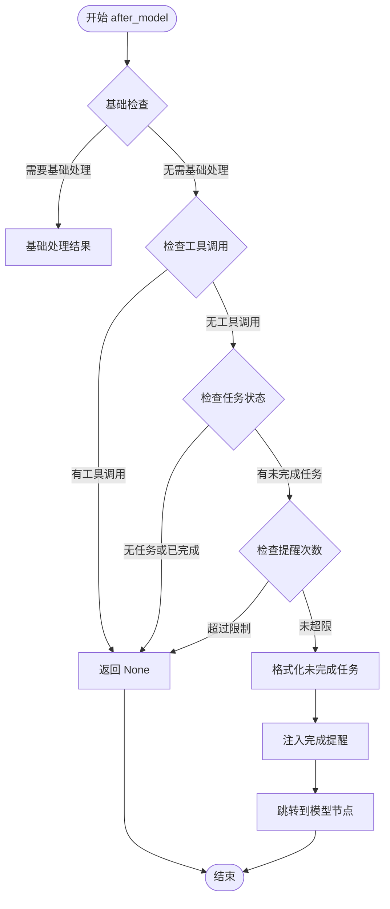
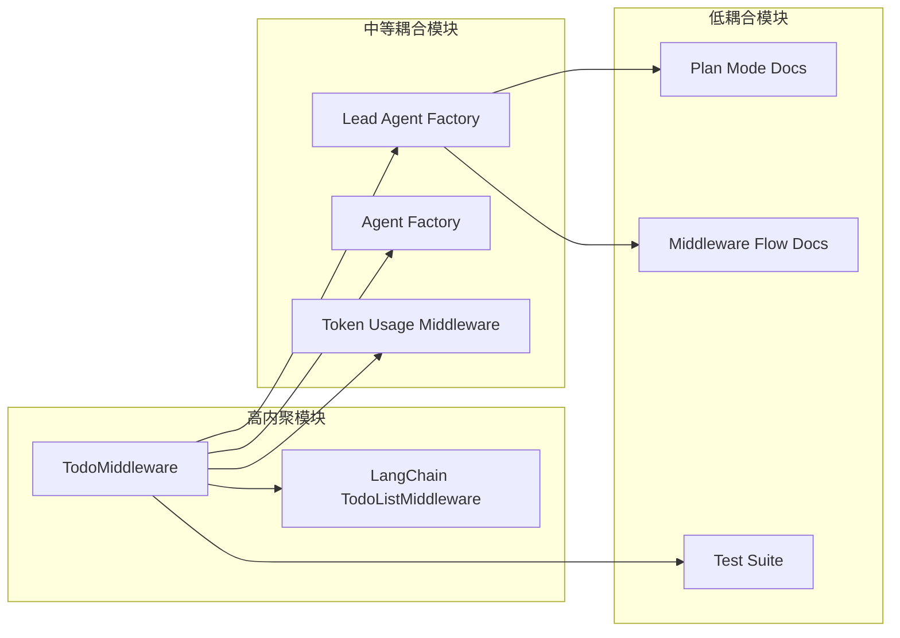

# TodoList 中间件

<cite>
**本文档引用的文件**
- [todo_middleware.py](file://backend/packages/harness/deerflow/agents/middlewares/todo_middleware.py)
- [agent.py](file://backend/packages/harness/deerflow/agents/lead_agent/agent.py)
- [test_todo_middleware.py](file://backend/tests/test_todo_middleware.py)
- [plan_mode_usage.md](file://backend/docs/plan_mode_usage.md)
- [middleware-execution-flow.md](file://backend/docs/middleware-execution-flow.md)
- [factory.py](file://backend/packages/harness/deerflow/agents/factory.py)
- [token_usage_middleware.py](file://backend/packages/harness/deerflow/agents/middlewares/token_usage_middleware.py)
- [types.ts](file://frontend/src/core/todos/types.ts)
</cite>

## 目录
1. [简介](#简介)
2. [项目结构](#项目结构)
3. [核心组件](#核心组件)
4. [架构概览](#架构概览)
5. [详细组件分析](#详细组件分析)
6. [依赖关系分析](#依赖关系分析)
7. [性能考虑](#性能考虑)
8. [故障排除指南](#故障排除指南)
9. [结论](#结论)
10. [附录](#附录)

## 简介

TodoList 中间件是 DeerFlow 2.0 中新增的任务管理中间件，基于 LangChain 的 TodoListMiddleware 构建，专门用于复杂多步骤任务的跟踪和管理。该中间件提供了实时任务列表管理、状态跟踪和进度可视化功能，确保用户能够清楚地了解代理的工作进度。

TodoList 中间件的核心特性包括：
- 动态任务列表管理
- 实时状态跟踪（pending、in_progress、completed）
- 上下文丢失检测和恢复
- 完成状态强制管理
- 与外部任务管理系统的集成能力
- 批量操作支持

## 项目结构

TodoList 中间件在 DeerFlow 代码库中的组织结构如下：



**图表来源**
- [todo_middleware.py:1-180](file://backend/packages/harness/deerflow/agents/middlewares/todo_middleware.py#L1-L180)
- [agent.py:115-227](file://backend/packages/harness/deerflow/agents/lead_agent/agent.py#L115-L227)

**章节来源**
- [todo_middleware.py:1-180](file://backend/packages/harness/deerflow/agents/middlewares/todo_middleware.py#L1-L180)
- [agent.py:1-447](file://backend/packages/harness/deerflow/agents/lead_agent/agent.py#L1-L447)

## 核心组件

### TodoMiddleware 类

TodoMiddleware 是 TodoList 中间件的核心实现，继承自 LangChain 的 TodoListMiddleware 并扩展了以下功能：

#### 主要功能特性
1. **上下文丢失检测**：当消息历史被截断时自动检测并注入提醒
2. **完成状态强制管理**：防止代理在仍有未完成任务时过早结束
3. **智能提醒机制**：根据任务状态动态生成提醒内容
4. **防无限循环保护**：限制重复提醒次数防止死循环

#### 关键方法
- `before_model()`: 注入上下文丢失提醒
- `after_model()`: 强制完成状态检查和提醒
- `_format_todos()`: 格式化任务列表显示

**章节来源**
- [todo_middleware.py:58-180](file://backend/packages/harness/deerflow/agents/middlewares/todo_middleware.py#L58-L180)

### 任务状态管理

TodoList 中间件支持三种标准任务状态：
- **pending**: 任务尚未开始
- **in_progress**: 正在进行中（可并行多个）
- **completed**: 已成功完成

任务状态转换遵循严格的业务规则，确保任务管理的准确性和一致性。

**章节来源**
- [types.ts:1-4](file://frontend/src/core/todos/types.ts#L1-L4)
- [plan_mode_usage.md:63-67](file://backend/docs/plan_mode_usage.md#L63-L67)

## 架构概览

TodoList 中间件在整个 DeerFlow 架构中的位置和作用：



**图表来源**
- [middleware-execution-flow.md:26-75](file://backend/docs/middleware-execution-flow.md#L26-L75)
- [agent.py:240-318](file://backend/packages/harness/deerflow/agents/lead_agent/agent.py#L240-L318)

TodoMiddleware 在执行链中的关键位置：
- **before_model 阶段**：检测上下文丢失并注入提醒
- **after_model 阶段**：强制完成状态检查和防止过早退出
- **位置优势**：位于 ClarificationMiddleware 之前，允许在澄清流程中管理任务

**章节来源**
- [middleware-execution-flow.md:77-154](file://backend/docs/middleware-execution-flow.md#L77-L154)
- [agent.py:234-239](file://backend/packages/harness/deerflow/agents/lead_agent/agent.py#L234-L239)

## 详细组件分析

### 任务解析算法

TodoMiddleware 实现了智能的任务解析和状态管理算法：

#### 上下文丢失检测算法


**图表来源**
- [todo_middleware.py:67-102](file://backend/packages/harness/deerflow/agents/middlewares/todo_middleware.py#L67-L102)

#### 完成状态强制管理算法


**图表来源**
- [todo_middleware.py:118-169](file://backend/packages/harness/deerflow/agents/middlewares/todo_middleware.py#L118-L169)

### 依赖关系处理

TodoMiddleware 与其他中间件存在以下依赖关系：

#### 直接依赖
- **LangChain TodoListMiddleware**: 基础功能继承
- **LangGraph Runtime**: 状态管理和执行控制
- **LangChain Core Messages**: 消息格式化和处理

#### 间接依赖
- **SummarizationMiddleware**: 可能导致上下文截断，触发 TodoMiddleware 的提醒机制
- **ClarificationMiddleware**: 位置关系确保在澄清流程中仍能管理任务
- **TokenUsageMiddleware**: 与任务状态变更相关的令牌统计

**章节来源**
- [todo_middleware.py:18-22](file://backend/packages/harness/deerflow/agents/middlewares/todo_middleware.py#L18-L22)

### 完成状态管理

TodoMiddleware 实现了严格的完成状态管理机制：

#### 状态转换规则
1. **立即完成**: 任务完成后必须立即标记为 completed
2. **单任务进行**: 通常保持恰好一个任务处于 in_progress 状态
3. **实时更新**: 任务状态需要在执行过程中实时更新
4. **避免批处理**: 不要批量标记完成，而要在完成后立即标记

#### 防止过早退出机制
- 当存在未完成任务时，如果模型产生最终响应（无工具调用），TodoMiddleware 会注入提醒并强制继续执行
- 设置最大提醒次数（默认 2 次）防止无限循环
- 仅在所有任务完成后才允许正常退出

**章节来源**
- [plan_mode_usage.md:128-136](file://backend/docs/plan_mode_usage.md#L128-L136)
- [todo_middleware.py:113-115](file://backend/packages/harness/deerflow/agents/middlewares/todo_middleware.py#L113-L115)

## 依赖关系分析

### 组件耦合度分析

TodoMiddleware 在整体架构中的耦合关系：



**图表来源**
- [agent.py:115-227](file://backend/packages/harness/deerflow/agents/lead_agent/agent.py#L115-L227)
- [factory.py:225-229](file://backend/packages/harness/deerflow/agents/factory.py#L225-L229)

### 外部依赖分析

TodoMiddleware 的外部依赖主要包括：

#### 必需依赖
- **LangChain Agents**: 核心中间件框架
- **LangGraph Runtime**: 状态管理和执行引擎
- **Python Typing**: 类型注解支持

#### 可选依赖
- **LangChain Vision Models**: 图像处理支持
- **外部任务管理系统**: 可选的外部集成

**章节来源**
- [todo_middleware.py:14-22](file://backend/packages/harness/deerflow/agents/middlewares/todo_middleware.py#L14-L22)

## 性能考虑

### 内存使用优化

TodoMiddleware 在设计时考虑了内存使用效率：

1. **延迟初始化**: 仅在需要时创建提醒消息
2. **消息复用**: 避免重复创建相同格式的消息
3. **状态缓存**: 缓存任务状态以减少计算开销

### 执行效率

1. **快速路径**: 对于空任务列表直接返回，避免不必要的处理
2. **早期退出**: 在不需要提醒时立即返回
3. **批量处理**: 任务格式化采用高效的字符串拼接

### 令牌成本控制

TodoMiddleware 与 TokenUsageMiddleware 协作控制令牌使用：

1. **精确标注**: 为 write_todos 调用提供详细的令牌使用信息
2. **动作追踪**: 跟踪任务状态变更的具体操作
3. **成本分析**: 支持对任务管理操作的成本分析

**章节来源**
- [token_usage_middleware.py:72-132](file://backend/packages/harness/deerflow/agents/middlewares/token_usage_middleware.py#L72-L132)

## 故障排除指南

### 常见问题诊断

#### 问题 1: 任务列表不显示
**症状**: 用户看不到任务列表
**可能原因**:
- Plan Mode 未启用
- 任务列表为空
- 上下文被截断

**解决方案**:
1. 检查 `is_plan_mode` 配置
2. 确认任务列表包含有效任务
3. 检查 SummarizationMiddleware 是否过度压缩

#### 问题 2: 代理过早退出
**症状**: 代理在任务未完成时就给出最终答案
**可能原因**:
- 未正确标记任务完成
- 提醒次数限制导致提前退出
- 任务状态不一致

**解决方案**:
1. 确保每个任务完成后立即标记为 completed
2. 检查提醒机制是否正常工作
3. 验证任务状态一致性

#### 问题 3: 重复提醒循环
**症状**: 代理不断收到相同的提醒
**可能原因**:
- 任务状态无法正确更新
- 上下文丢失检测过于敏感
- 提醒次数限制设置不当

**解决方案**:
1. 检查任务状态更新逻辑
2. 调整上下文丢失检测阈值
3. 适当调整最大提醒次数

**章节来源**
- [test_todo_middleware.py:94-146](file://backend/tests/test_todo_middleware.py#L94-L146)
- [test_todo_middleware.py:197-290](file://backend/tests/test_todo_middleware.py#L197-L290)

### 调试技巧

1. **启用详细日志**: 检查 TodoMiddleware 的调试输出
2. **监控状态变化**: 使用前端界面观察任务状态实时更新
3. **验证令牌使用**: 通过 TokenUsageMiddleware 分析任务管理的令牌消耗

**章节来源**
- [token_usage_middleware.py:256-304](file://backend/packages/harness/deerflow/agents/middlewares/token_usage_middleware.py#L256-L304)

## 结论

TodoList 中间件作为 DeerFlow 2.0 的重要增强功能，提供了强大的任务管理能力。通过智能的上下文丢失检测、严格的完成状态管理和高效的执行机制，该中间件确保了复杂任务的可靠执行和良好的用户体验。

### 主要优势
1. **智能上下文管理**: 自动检测和恢复上下文丢失
2. **严格的状态控制**: 防止过早退出和状态不一致
3. **高效执行**: 优化的算法和内存使用
4. **灵活集成**: 与现有中间件生态无缝集成

### 未来发展方向
1. **外部系统集成**: 扩展与第三方任务管理系统的连接
2. **批量操作优化**: 支持更复杂的批量任务管理场景
3. **性能监控**: 增强任务执行性能的监控和分析能力
4. **用户体验改进**: 优化前端任务列表的交互体验

## 附录

### 配置选项

#### 运行时配置
- **is_plan_mode** (bool): 是否启用计划模式，默认 False
- **thread_id**: 线程标识符，用于任务状态持久化
- **thinking_enabled**: 是否启用思考模式

#### 代理配置
- **system_prompt**: 自定义系统提示，强调任务管理的重要性
- **tool_description**: write_todos 工具的详细描述
- **max_concurrent_subagents**: 子代理并发数量限制

**章节来源**
- [plan_mode_usage.md:14-43](file://backend/docs/plan_mode_usage.md#L14-L43)
- [agent.py:115-227](file://backend/packages/harness/deerflow/agents/lead_agent/agent.py#L115-L227)

### 使用示例

#### 基本使用
```python
from langchain_core.runnables import RunnableConfig
from deerflow.agents.lead_agent.agent import make_lead_agent

# 启用计划模式
config = RunnableConfig(
    configurable={
        "thread_id": "example-thread",
        "thinking_enabled": True,
        "is_plan_mode": True,
    }
)

agent = make_lead_agent(config)
```

#### 动态配置
```python
def create_agent_for_task(task_complexity: str):
    """根据任务复杂度动态创建代理"""
    is_complex = task_complexity in ["high", "very_high"]
    
    config = RunnableConfig(
        configurable={
            "thread_id": f"task-{task_complexity}",
            "thinking_enabled": True,
            "is_plan_mode": is_complex,
        }
    )
    
    return make_lead_agent(config)
```

**章节来源**
- [plan_mode_usage.md:71-125](file://backend/docs/plan_mode_usage.md#L71-L125)

### 工作流集成

TodoMiddleware 可以与多种工作流集成：

1. **任务驱动工作流**: 基于任务列表的状态机
2. **混合工作流**: 结合传统对话和任务管理
3. **子代理工作流**: 与子代理执行器的协作

**章节来源**
- [middleware-execution-flow.md:1-264](file://backend/docs/middleware-execution-flow.md#L1-L264)