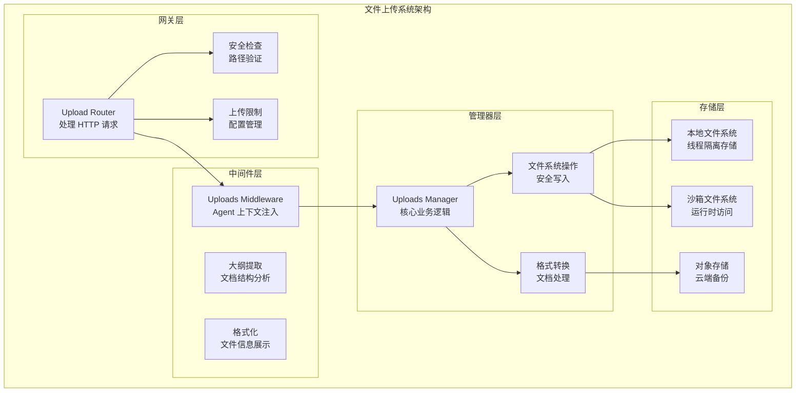
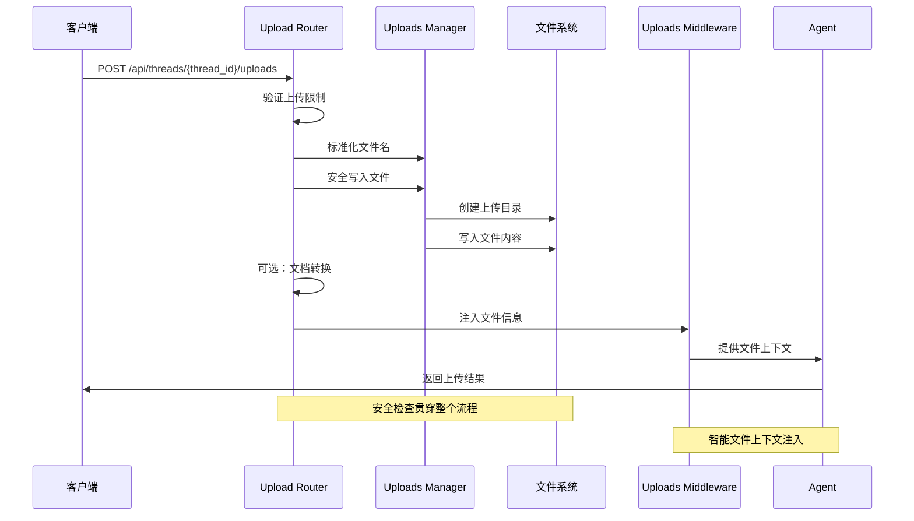
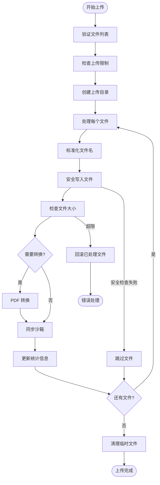
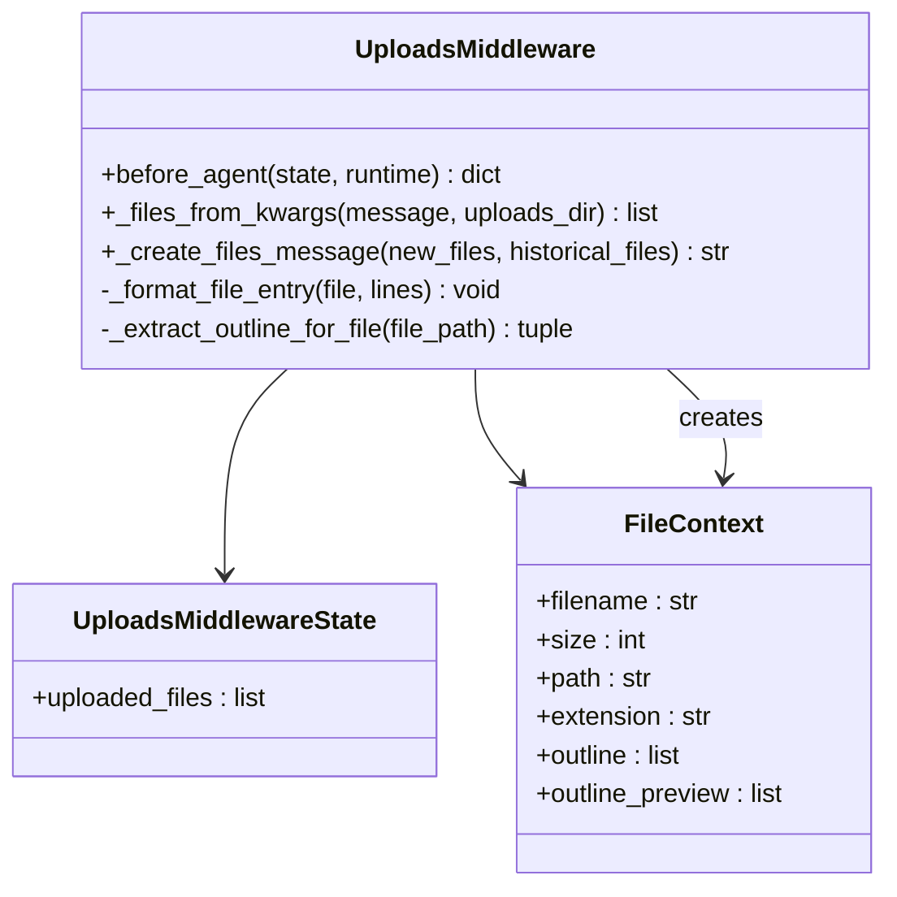
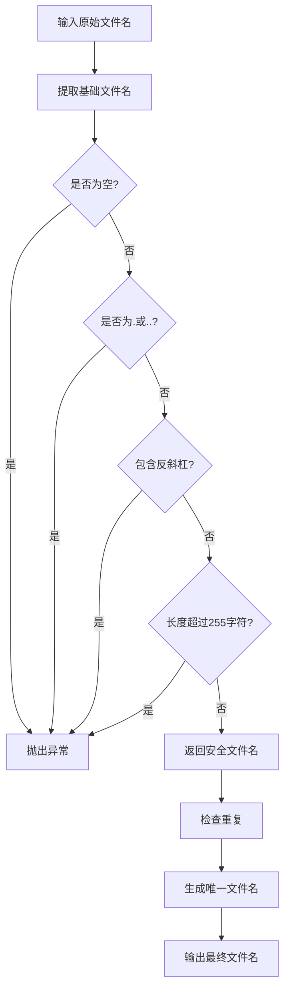
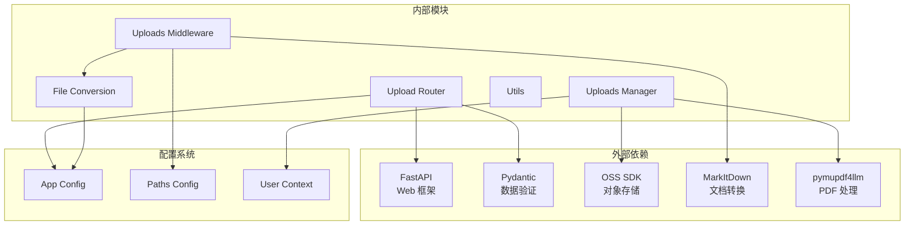

# Uploads 中间件

<cite>
**本文档引用的文件**
- [backend/app/gateway/routers/uploads.py](file://backend/app/gateway/routers/uploads.py)
- [backend/packages/harness/deerflow/agents/middlewares/uploads_middleware.py](file://backend/packages/harness/deerflow/agents/middlewares/uploads_middleware.py)
- [backend/packages/harness/deerflow/uploads/manager.py](file://backend/packages/harness/deerflow/uploads/manager.py)
- [backend/packages/harness/deerflow/utils/file_conversion.py](file://backend/packages/harness/deerflow/utils/file_conversion.py)
- [backend/docs/FILE_UPLOAD.md](file://backend/docs/FILE_UPLOAD.md)
- [backend/config.yaml](file://backend/config.yaml)
- [backend/tests/test_uploads_router.py](file://backend/tests/test_uploads_router.py)
- [backend/tests/test_uploads_middleware_core_logic.py](file://backend/tests/test_uploads_middleware_core_logic.py)
- [backend/tests/test_uploads_manager.py](file://backend/tests/test_uploads_manager.py)
</cite>

## 目录
1. [简介](#简介)
2. [项目结构](#项目结构)
3. [核心组件](#核心组件)
4. [架构概览](#架构概览)
5. [详细组件分析](#详细组件分析)
6. [依赖关系分析](#依赖关系分析)
7. [性能考虑](#性能考虑)
8. [故障排除指南](#故障排除指南)
9. [结论](#结论)

## 简介

Uploads 中间件是 DeerFlow 文件上传系统的核心组件，负责处理文件上传、验证、格式转换和存储管理。该中间件提供了完整的文件上传功能，支持多文件上传、可选的文档格式转换、线程隔离的存储以及智能的安全检查。

该系统采用分层架构设计，包含三个主要层次：
- **网关层**：处理 HTTP 请求和响应，实现文件上传的业务逻辑
- **中间件层**：在 Agent 请求前注入文件信息，提供智能的文件上下文
- **管理器层**：提供通用的上传管理功能，支持纯业务逻辑操作

## 项目结构



**图表来源**
- [backend/app/gateway/routers/uploads.py:1-343](file://backend/app/gateway/routers/uploads.py#L1-L343)
- [backend/packages/harness/deerflow/agents/middlewares/uploads_middleware.py:1-296](file://backend/packages/harness/deerflow/agents/middlewares/uploads_middleware.py#L1-L296)
- [backend/packages/harness/deerflow/uploads/manager.py:1-311](file://backend/packages/harness/deerflow/uploads/manager.py#L1-L311)

**章节来源**
- [backend/app/gateway/routers/uploads.py:1-343](file://backend/app/gateway/routers/uploads.py#L1-L343)
- [backend/packages/harness/deerflow/agents/middlewares/uploads_middleware.py:1-296](file://backend/packages/harness/deerflow/agents/middlewares/uploads_middleware.py#L1-L296)
- [backend/packages/harness/deerflow/uploads/manager.py:1-311](file://backend/packages/harness/deerflow/uploads/manager.py#L1-L311)

## 核心组件

### 1. Upload Router（上传路由器）

Upload Router 是网关层的核心组件，负责处理所有文件上传相关的 HTTP 请求。它实现了完整的文件上传生命周期管理：

**主要功能**：
- 多文件上传处理
- 上传限制验证（文件数量、大小限制）
- 安全文件名验证和标准化
- 文件内容流式写入
- 自动文档格式转换
- 沙箱同步管理

**关键特性**：
- 支持 8KB 分块读取，避免内存溢出
- 内置路径遍历攻击防护
- 自动清理失败上传的临时文件
- 智能沙箱同步策略

**章节来源**
- [backend/app/gateway/routers/uploads.py:170-293](file://backend/app/gateway/routers/uploads.py#L170-L293)

### 2. Uploads Middleware（上传中间件）

Uploads Middleware 是 Agent 层的核心组件，负责在每次 Agent 请求前自动注入文件信息：

**主要功能**：
- 自动检测新上传的文件
- 扫描历史上传文件
- 生成智能的文件上下文信息
- 提供文档大纲和预览
- 支持多种内容格式（文本、多媒体）

**智能特性**：
- 自动提取 PDF 文档的大纲结构
- 为无结构文档提供内容预览
- 智能的文件大小格式化
- 提供搜索和导航建议

**章节来源**
- [backend/packages/harness/deerflow/agents/middlewares/uploads_middleware.py:66-296](file://backend/packages/harness/deerflow/agents/middlewares/uploads_middleware.py#L66-L296)

### 3. Uploads Manager（上传管理器）

Uploads Manager 提供了完整的上传管理业务逻辑，是系统的核心基础设施：

**核心功能**：
- 线程 ID 验证和安全检查
- 文件名标准化和去重
- 安全的文件写入机制
- 文件系统操作封装
- 路径遍历攻击防护

**安全机制**：
- POSIX 平台使用 O_NOFOLLOW 防护
- Windows 平台使用双重 lstat 检查
- 硬链接和符号链接防护
- 多种攻击向量防护

**章节来源**
- [backend/packages/harness/deerflow/uploads/manager.py:18-311](file://backend/packages/harness/deerflow/uploads/manager.py#L18-L311)

## 架构概览



**图表来源**
- [backend/app/gateway/routers/uploads.py:170-293](file://backend/app/gateway/routers/uploads.py#L170-L293)
- [backend/packages/harness/deerflow/agents/middlewares/uploads_middleware.py:187-296](file://backend/packages/harness/deerflow/agents/middlewares/uploads_middleware.py#L187-L296)

## 详细组件分析

### Upload Router 详细分析

#### 文件上传流程



**图表来源**
- [backend/app/gateway/routers/uploads.py:123-152](file://backend/app/gateway/routers/uploads.py#L123-L152)
- [backend/app/gateway/routers/uploads.py:211-277](file://backend/app/gateway/routers/uploads.py#L211-L277)

#### 安全检查机制

Upload Router 实现了多层次的安全检查：

**1. 文件名安全检查**
- 移除路径组件，只保留基础文件名
- 防止目录遍历攻击
- 限制文件名长度（255字符）
- 拒绝危险字符

**2. 路径遍历防护**
- 使用 `resolve().relative_to()` 验证路径
- 防止符号链接攻击
- 硬链接检测和防护
- 多种攻击向量防护

**3. 文件大小限制**
- 单文件大小限制（默认 50MB）
- 总上传大小限制（默认 100MB）
- 文件数量限制（默认 10个）
- 实时大小监控和回滚

**章节来源**
- [backend/app/gateway/routers/uploads.py:59-121](file://backend/app/gateway/routers/uploads.py#L59-L121)
- [backend/app/gateway/routers/uploads.py:123-152](file://backend/app/gateway/routers/uploads.py#L123-L152)

### Uploads Middleware 详细分析

#### 文件信息注入机制



**图表来源**
- [backend/packages/harness/deerflow/agents/middlewares/uploads_middleware.py:60-296](file://backend/packages/harness/deerflow/agents/middlewares/uploads_middleware.py#L60-L296)

#### 智能文件上下文生成

Uploads Middleware 的核心优势在于其智能的文件上下文生成能力：

**1. 新文件检测**
- 从消息的 additional_kwargs.files 中提取新上传文件
- 验证文件存在性和有效性
- 构建文件元数据结构

**2. 历史文件扫描**
- 扫描上传目录获取历史文件
- 排除当前请求中新上传的文件
- 自动提取文档大纲和预览

**3. 智能格式化**
- 自动文件大小格式化（KB/MB）
- 结构化文档信息展示
- 提供搜索和导航建议
- 支持多种内容格式

**章节来源**
- [backend/packages/harness/deerflow/agents/middlewares/uploads_middleware.py:149-296](file://backend/packages/harness/deerflow/agents/middlewares/uploads_middleware.py#L149-L296)

### Uploads Manager 详细分析

#### 安全文件写入机制

Uploads Manager 实现了高度安全的文件写入机制，针对不同平台提供了相应的防护措施：

**POSIX 平台防护**：
- 使用 `O_NOFOLLOW` 标志防止符号链接攻击
- 检查文件描述符状态确保独占访问
- 验证文件类型为常规文件
- 支持非阻塞标志减少等待

**Windows 平台防护**：
- 双重 `lstat` 检查缩小竞争窗口
- `fstat` 验证确保文件类型正确
- 硬链接检测防止覆盖保护文件
- 多种错误码处理

**章节来源**
- [backend/packages/harness/deerflow/uploads/manager.py:118-209](file://backend/packages/harness/deerflow/uploads/manager.py#L118-L209)

#### 文件名处理机制



**图表来源**
- [backend/packages/harness/deerflow/uploads/manager.py:53-103](file://backend/packages/harness/deerflow/uploads/manager.py#L53-L103)

**章节来源**
- [backend/packages/harness/deerflow/uploads/manager.py:53-103](file://backend/packages/harness/deerflow/uploads/manager.py#L53-L103)

## 依赖关系分析



**图表来源**
- [backend/app/gateway/routers/uploads.py:1-32](file://backend/app/gateway/routers/uploads.py#L1-L32)
- [backend/packages/harness/deerflow/agents/middlewares/uploads_middleware.py:1-16](file://backend/packages/harness/deerflow/agents/middlewares/uploads_middleware.py#L1-L16)

**章节来源**
- [backend/app/gateway/routers/uploads.py:1-32](file://backend/app/gateway/routers/uploads.py#L1-L32)
- [backend/packages/harness/deerflow/agents/middlewares/uploads_middleware.py:1-16](file://backend/packages/harness/deerflow/agents/middlewares/uploads_middleware.py#L1-L16)

## 性能考虑

### 文件上传性能优化

1. **流式处理**
   - 使用 8KB 分块读取，避免内存溢出
   - 异步转换大型文件（>1MB）避免阻塞事件循环
   - 实时大小监控和早期失败检测

2. **并发处理**
   - 大文件转换使用线程池
   - 多文件上传的并行处理
   - 沙箱同步的异步操作

3. **缓存策略**
   - 文档大纲缓存
   - 文件信息预计算
   - 路径解析结果缓存

### 安全性能平衡

1. **最小权限原则**
   - 仅授予必要的文件系统权限
   - 限制沙箱访问范围
   - 最小化网络暴露面

2. **资源限制**
   - 文件大小和数量限制
   - 内存使用限制
   - CPU 时间片分配

## 故障排除指南

### 常见问题诊断

#### 1. 文件上传失败

**症状**：HTTP 413 Payload Too Large

**可能原因**：
- 超过单文件大小限制
- 超过总上传大小限制
- 超过文件数量限制

**解决方案**：
```python
# 检查当前配置
config = {
    "max_files": 10,
    "max_file_size": 52428800,  # 50MB
    "max_total_size": 104857600  # 100MB
}

# 前端预检查
def check_upload_limits(files, config):
    if len(files) > config["max_files"]:
        return False, "文件数量超过限制"
    if sum(f.size for f in files) > config["max_total_size"]:
        return False, "总文件大小超过限制"
    return True, "可以上传"
```

**章节来源**
- [backend/tests/test_uploads_router.py:286-348](file://backend/tests/test_uploads_router.py#L286-L348)

#### 2. 文件名安全问题

**症状**：文件名被拒绝或修改

**可能原因**：
- 包含路径组件
- 包含反斜杠字符
- 文件名过长（>255字符）
- 使用保留名称（. 或 ..）

**解决方案**：
```python
# 安全的文件名处理
def sanitize_filename(filename):
    # 1. 提取基础文件名
    safe_name = Path(filename).name
    
    # 2. 验证安全性
    if not safe_name or safe_name in {".", ".."}:
        raise ValueError("不安全的文件名")
    
    # 3. 检查长度
    if len(safe_name.encode("utf-8")) > 255:
        raise ValueError("文件名过长")
    
    return safe_name
```

**章节来源**
- [backend/packages/harness/deerflow/uploads/manager.py:53-78](file://backend/packages/harness/deerflow/uploads/manager.py#L53-L78)

#### 3. 沙箱同步问题

**症状**：Agent 无法访问上传的文件

**可能原因**：
- 沙箱提供程序不可用
- 线程数据挂载配置问题
- 文件权限设置错误

**解决方案**：
```python
# 检查沙箱同步状态
def check_sandbox_sync(thread_id):
    sandbox_provider = get_sandbox_provider()
    
    # 检查是否需要同步
    if not sandbox_provider.uses_thread_data_mounts(thread_id):
        # 需要同步到沙箱
        sandbox = sandbox_provider.get(sandbox_provider.acquire(thread_id))
        return sandbox is not None
    return True  # 已经挂载，无需同步
```

**章节来源**
- [backend/tests/test_uploads_router.py:146-182](file://backend/tests/test_uploads_router.py#L146-L182)

### 调试技巧

#### 1. 启用详细日志

```python
# 添加调试日志
import logging
logging.basicConfig(level=logging.DEBUG)

# 关键调试点
logger.debug(f"上传文件: {filename}, 大小: {file_size} bytes")
logger.debug(f"文件路径: {file_path}")
logger.debug(f"沙箱同步: {sync_to_sandbox}")
```

#### 2. 使用测试工具

```python
# 单元测试示例
def test_upload_security():
    """测试文件上传安全机制"""
    # 测试路径遍历攻击
    malicious_file = UploadFile(
        filename="../../etc/passwd",
        file=BytesIO(b"malicious content")
    )
    
    # 应该被拒绝并返回安全的文件名
    result = upload_files(thread_id, [malicious_file])
    assert result.files[0].filename == "passwd"
```

**章节来源**
- [backend/tests/test_uploads_manager.py:81-104](file://backend/tests/test_uploads_manager.py#L81-L104)

## 结论

Uploads 中间件是一个设计精良的文件上传系统，具有以下显著特点：

### 核心优势

1. **全面的安全防护**
   - 多层次路径遍历攻击防护
   - 符号链接和硬链接检测
   - 平台特定的安全机制

2. **智能的用户体验**
   - 自动文件上下文注入
   - 文档大纲和预览功能
   - 智能的搜索和导航建议

3. **高性能的处理能力**
   - 流式文件处理
   - 异步转换机制
   - 资源使用优化

4. **灵活的配置选项**
   - 可调整的上传限制
   - 多种文档转换策略
   - 线程隔离的存储架构

### 最佳实践建议

1. **安全配置**
   - 启用自动文档转换前充分测试
   - 定期审查上传限制设置
   - 监控沙箱同步状态

2. **性能优化**
   - 合理设置文件大小限制
   - 利用异步转换处理大型文件
   - 实施适当的缓存策略

3. **监控和维护**
   - 启用详细的日志记录
   - 定期清理临时文件
   - 监控磁盘空间使用情况

该系统为 DeerFlow 提供了强大而安全的文件上传能力，支持复杂的 AI Agent 工作流，是整个平台的重要基础设施组件。