# ViewImage 中间件

<cite>
**本文档引用的文件**
- [view_image_middleware.py](file://backend/packages/harness/deerflow/agents/middlewares/view_image_middleware.py)
- [view_image_tool.py](file://backend/packages/harness/deerflow/tools/builtins/view_image_tool.py)
- [thread_state.py](file://backend/packages/harness/deerflow/agents/thread_state.py)
- [middleware-execution-flow.md](file://backend/docs/middleware-execution-flow.md)
- [test_view_image_middleware.py](file://backend/tests/test_view_image_middleware.py)
- [test_view_image_tool.py](file://backend/tests/test_view_image_tool.py)
- [image.tsx](file://frontend/src/components/ai-elements/image.tsx)
- [PATH_EXAMPLES.md](file://backend/docs/PATH_EXAMPLES.md)
</cite>

## 目录
1. [简介](#简介)
2. [项目结构](#项目结构)
3. [核心组件](#核心组件)
4. [架构概览](#架构概览)
5. [详细组件分析](#详细组件分析)
6. [依赖关系分析](#依赖关系分析)
7. [性能考虑](#性能考虑)
8. [故障排除指南](#故障排除指南)
9. [结论](#结论)
10. [附录](#附录)

## 简介

ViewImage 中间件是 DeerFlow 智能体框架中的关键组件，专门用于处理图像预览和分析功能。该中间件实现了自动化的图像内容注入机制，能够在智能体每次调用大语言模型之前，自动检测并注入已完成的图像查看工具调用结果。

该中间件的核心价值在于：
- **自动化图像处理**：无需用户显式描述图像内容，智能体可直接分析图像
- **安全的文件访问**：通过沙箱环境和路径验证确保文件访问安全
- **高效的图像传输**：使用 Base64 编码实现图像数据的高效传输
- **智能的触发机制**：基于工具调用完成状态的智能注入逻辑

## 项目结构

ViewImage 中间件在整体系统中的位置如下：

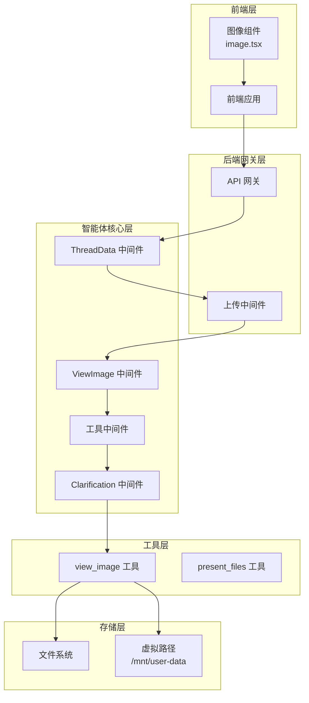

**图表来源**
- [middleware-execution-flow.md:77-154](file://backend/docs/middleware-execution-flow.md#L77-L154)
- [image.tsx:1-24](file://frontend/src/components/ai-elements/image.tsx#L1-L24)

**章节来源**
- [middleware-execution-flow.md:1-292](file://backend/docs/middleware-execution-flow.md#L1-L292)

## 核心组件

### ViewImage 中间件类结构

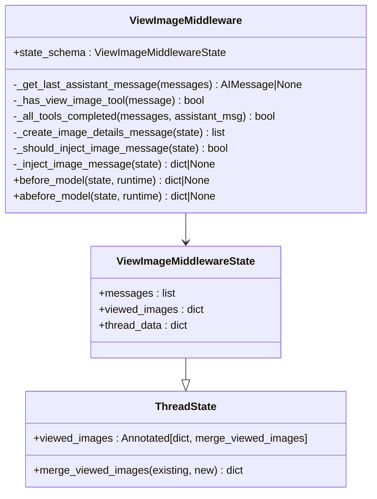

**图表来源**
- [view_image_middleware.py:15-31](file://backend/packages/harness/deerflow/agents/middlewares/view_image_middleware.py#L15-L31)
- [thread_state.py:31-56](file://backend/packages/harness/deerflow/agents/thread_state.py#L31-L56)

### 图像工具类结构

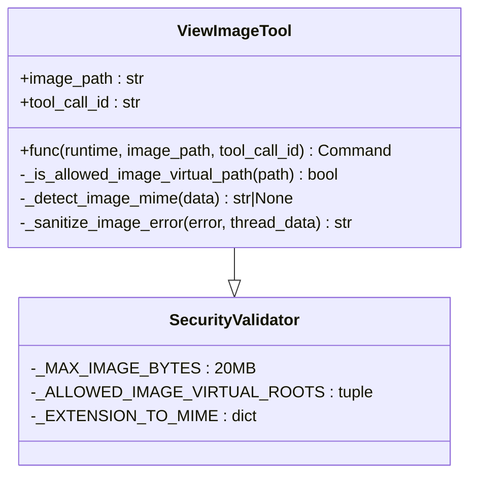

**图表来源**
- [view_image_tool.py:49-54](file://backend/packages/harness/deerflow/tools/builtins/view_image_tool.py#L49-L54)
- [view_image_tool.py:14-26](file://backend/packages/harness/deerflow/tools/builtins/view_image_tool.py#L14-L26)

**章节来源**
- [view_image_middleware.py:1-223](file://backend/packages/harness/deerflow/agents/middlewares/view_image_middleware.py#L1-L223)
- [view_image_tool.py:1-163](file://backend/packages/harness/deerflow/tools/builtins/view_image_tool.py#L1-L163)

## 架构概览

### 整体执行流程

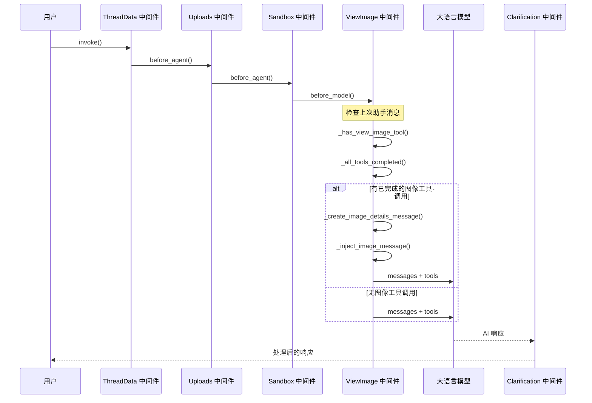

**图表来源**
- [middleware-execution-flow.md:77-154](file://backend/docs/middleware-execution-flow.md#L77-L154)
- [view_image_middleware.py:129-165](file://backend/packages/harness/deerflow/agents/middlewares/view_image_middleware.py#L129-L165)

### 图像处理管道

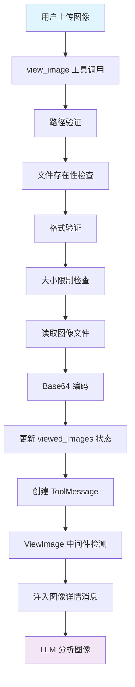

**图表来源**
- [view_image_tool.py:78-154](file://backend/packages/harness/deerflow/tools/builtins/view_image_tool.py#L78-L154)
- [view_image_middleware.py:94-127](file://backend/packages/harness/deerflow/agents/middlewares/view_image_middleware.py#L94-L127)

**章节来源**
- [middleware-execution-flow.md:217-264](file://backend/docs/middleware-execution-flow.md#L217-L264)

## 详细组件分析

### 图像预览中间件

#### 核心功能实现

ViewImage 中间件实现了以下核心功能：

1. **智能检测机制**：自动检测上次助手消息中的 `view_image` 工具调用
2. **完整性验证**：确保所有工具调用都有对应的 ToolMessage 完成
3. **去重保护**：防止重复注入相同的图像详情消息
4. **动态注入**：在每次 LLM 调用前智能注入图像数据

#### 关键算法流程

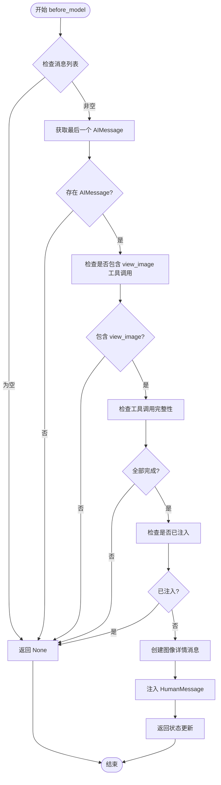

**图表来源**
- [view_image_middleware.py:129-165](file://backend/packages/harness/deerflow/agents/middlewares/view_image_middleware.py#L129-L165)

#### 数据结构设计

中间件使用以下数据结构来管理图像状态：

| 字段名 | 类型 | 描述 | 示例值 |
|--------|------|------|--------|
| `viewed_images` | `dict[str, dict]` | 已查看图像映射表 | `{"/mnt/user-data/uploads/img.png": {"base64": "...", "mime_type": "image/png"}}` |
| `messages` | `list` | 对话消息列表 | `[AIMessage, ToolMessage, HumanMessage]` |
| `tool_call_id` | `str` | 工具调用唯一标识符 | `"call_1"` |

**章节来源**
- [view_image_middleware.py:35-92](file://backend/packages/harness/deerflow/agents/middlewares/view_image_middleware.py#L35-L92)
- [thread_state.py:31-56](file://backend/packages/harness/deerflow/agents/thread_state.py#L31-L56)

### 图像处理工具

#### 安全检查机制

图像工具实现了多层次的安全检查：

1. **路径白名单验证**：只允许特定虚拟路径根目录
2. **文件格式验证**：通过文件扩展名和魔数双重验证
3. **大小限制检查**：防止超大文件占用内存
4. **权限控制**：确保文件访问权限正确

#### 支持的图像格式

| 格式 | 扩展名 | MIME 类型 | 特征检测 |
|------|--------|-----------|----------|
| JPEG | `.jpg`, `.jpeg` | `image/jpeg` | `\xff\xd8\xff` |
| PNG | `.png` | `image/png` | `\x89PNG\r\n\x1a\n` |
| WebP | `.webp` | `image/webp` | `"RIFF" + "WEBP"` |

#### 错误处理策略

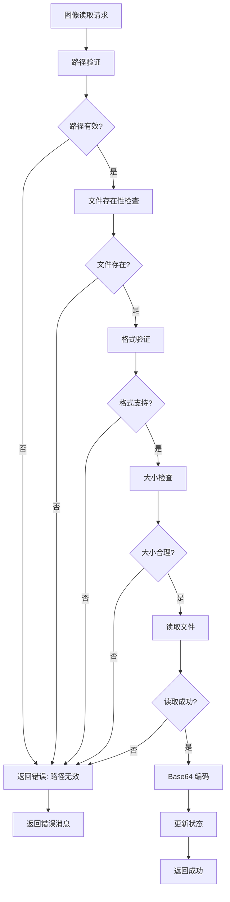

**图表来源**
- [view_image_tool.py:78-154](file://backend/packages/harness/deerflow/tools/builtins/view_image_tool.py#L78-L154)

**章节来源**
- [view_image_tool.py:14-163](file://backend/packages/harness/deerflow/tools/builtins/view_image_tool.py#L14-L163)

### 前端图像显示

#### 图像组件实现

前端使用 React 组件来显示 Base64 编码的图像：

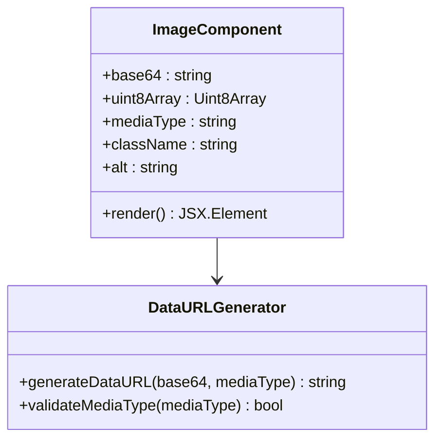

**图表来源**
- [image.tsx:9-24](file://frontend/src/components/ai-elements/image.tsx#L9-L24)

**章节来源**
- [image.tsx:1-24](file://frontend/src/components/ai-elements/image.tsx#L1-L24)

## 依赖关系分析

### 组件间依赖关系

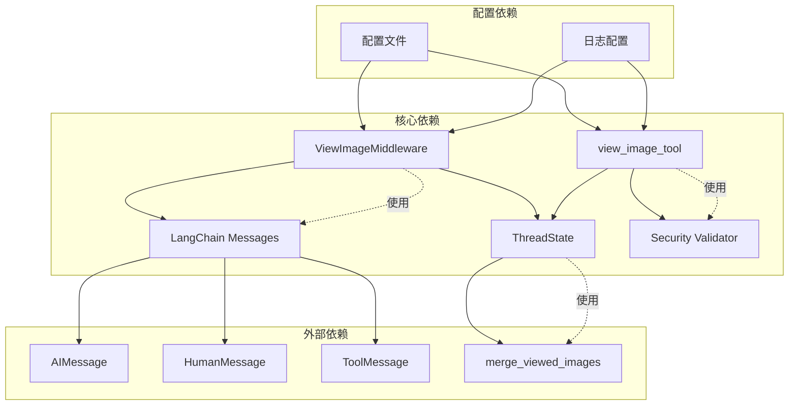

**图表来源**
- [view_image_middleware.py:6-12](file://backend/packages/harness/deerflow/agents/middlewares/view_image_middleware.py#L6-L12)
- [view_image_tool.py:6-12](file://backend/packages/harness/deerflow/tools/builtins/view_image_tool.py#L6-L12)

### 状态管理依赖

ViewImage 中间件依赖于线程状态管理系统：

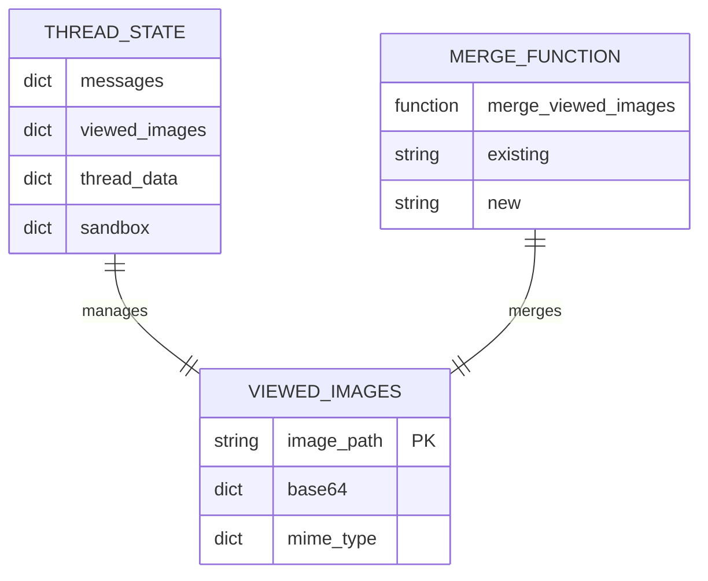

**图表来源**
- [thread_state.py:31-56](file://backend/packages/harness/deerflow/agents/thread_state.py#L31-L56)

**章节来源**
- [thread_state.py:25-56](file://backend/packages/harness/deerflow/agents/thread_state.py#L25-L56)

## 性能考虑

### 内存优化策略

1. **Base64 编码优化**：只在需要时进行 Base64 编码，避免不必要的内存占用
2. **状态清理机制**：通过合并函数支持清空已处理的图像状态
3. **延迟加载**：图像数据按需注入，不提前加载到内存中

### 并发处理

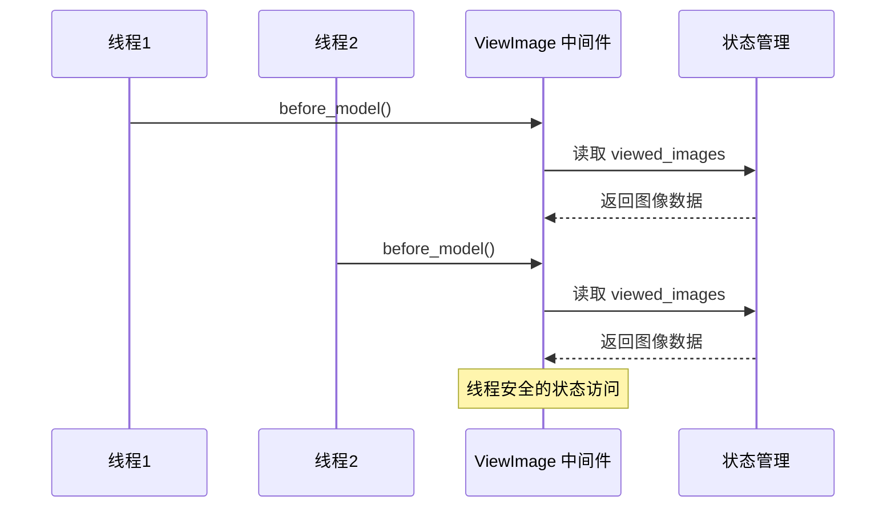

### 缓存策略

当前实现采用以下缓存策略：
- **内存缓存**：图像数据存储在进程内存中
- **状态持久化**：通过状态合并函数实现跨调用的数据保持
- **智能清理**：处理完成后自动清理已使用的图像数据

## 故障排除指南

### 常见问题诊断

#### 图像无法显示

**症状**：图像工具调用成功但中间件未注入图像详情

**可能原因**：
1. 工具调用未完全完成
2. 已存在相同的图像详情消息
3. 消息列表为空或格式不正确

**解决步骤**：
1. 检查工具调用 ID 是否匹配
2. 验证 ToolMessage 是否正确创建
3. 确认消息顺序是否正确

#### 安全检查失败

**症状**：图像工具返回安全检查错误

**可能原因**：
1. 路径不在允许的虚拟根目录中
2. 文件格式与扩展名不匹配
3. 文件大小超过限制

**解决步骤**：
1. 验证虚拟路径格式
2. 检查文件实际格式
3. 确认文件大小限制

#### 性能问题

**症状**：处理大量图像时出现内存不足

**解决建议**：
1. 实施图像大小限制
2. 优化 Base64 编码过程
3. 及时清理已处理的图像数据

**章节来源**
- [test_view_image_middleware.py:1-399](file://backend/tests/test_view_image_middleware.py#L1-L399)
- [test_view_image_tool.py:1-165](file://backend/tests/test_view_image_tool.py#L1-L165)

## 结论

ViewImage 中间件为 DeerFlow 智能体框架提供了强大的图像处理能力。通过智能化的图像注入机制、严格的安全检查和高效的性能优化，该中间件实现了无缝的图像分析体验。

### 主要优势

1. **自动化程度高**：无需用户干预即可自动处理图像
2. **安全性强**：多重安全检查确保系统安全
3. **性能优异**：优化的内存管理和并发处理
4. **易于集成**：清晰的接口设计便于系统集成

### 未来改进方向

1. **图像格式扩展**：支持更多图像格式如 GIF、SVG 等
2. **压缩优化**：实现图像压缩减少带宽占用
3. **缓存持久化**：实现跨会话的图像缓存机制
4. **批量处理**：支持多图像同时处理和分析

## 附录

### 配置选项

| 配置项 | 默认值 | 描述 | 类型 |
|--------|--------|------|------|
| `max_image_size` | 20MB | 图像文件最大大小限制 | int(bytes) |
| `allowed_virtual_roots` | `/mnt/workspace, /mnt/uploads, /mnt/outputs` | 允许的虚拟路径根目录 | tuple(str) |
| `enable_auto_injection` | true | 是否启用自动图像注入 | bool |

### 使用示例

#### 基本使用流程

```typescript
// 1. 上传图像文件
const formData = new FormData();
formData.append('files', imageFile);

const uploadResponse = await fetch('/api/threads/{threadId}/uploads', {
    method: 'POST',
    body: formData
});

// 2. 调用 view_image 工具
const toolResponse = await fetch('/api/threads/{threadId}/tools/view_image', {
    method: 'POST',
    headers: {'Content-Type': 'application/json'},
    body: JSON.stringify({
        image_path: '/mnt/user-data/uploads/image.png'
    })
});

// 3. 触发智能体分析
const agentResponse = await fetch(`/api/threads/${threadId}/run`, {
    method: 'POST',
    body: JSON.stringify({content: "分析这张图像"})
});
```

**章节来源**
- [PATH_EXAMPLES.md:77-129](file://backend/docs/PATH_EXAMPLES.md#L77-L129)