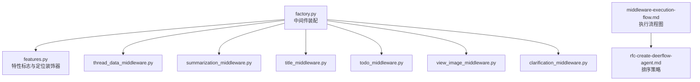
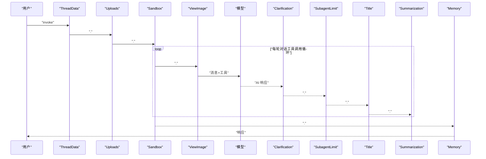
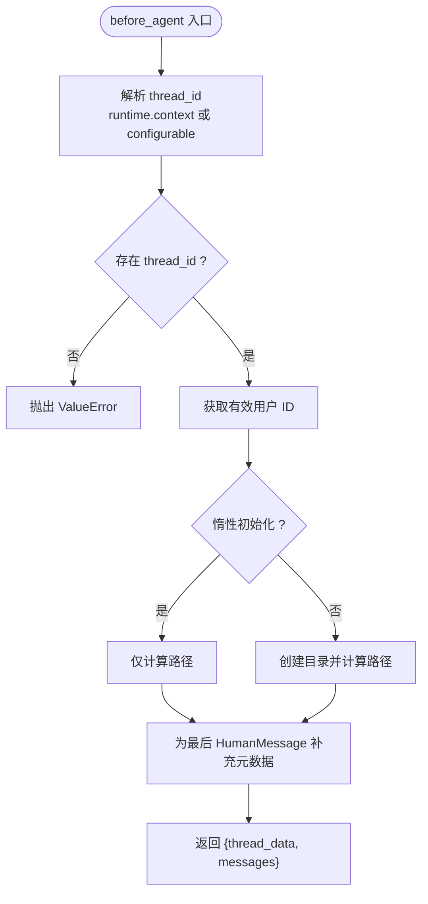
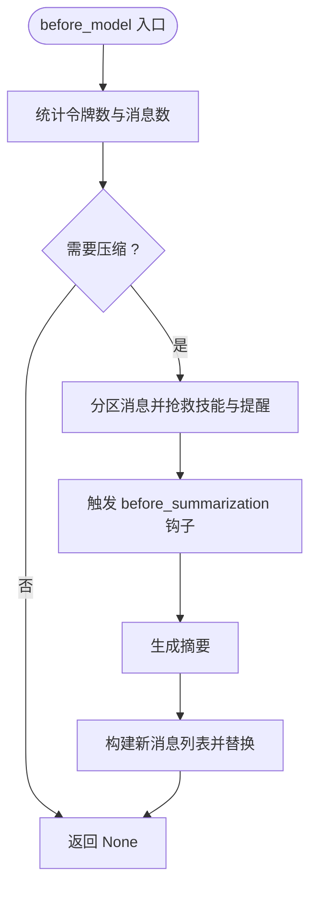
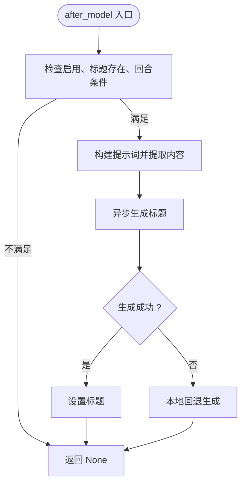
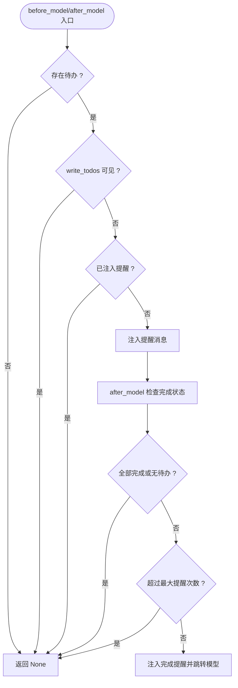
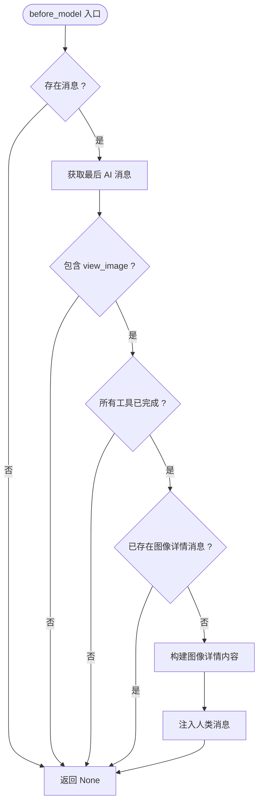
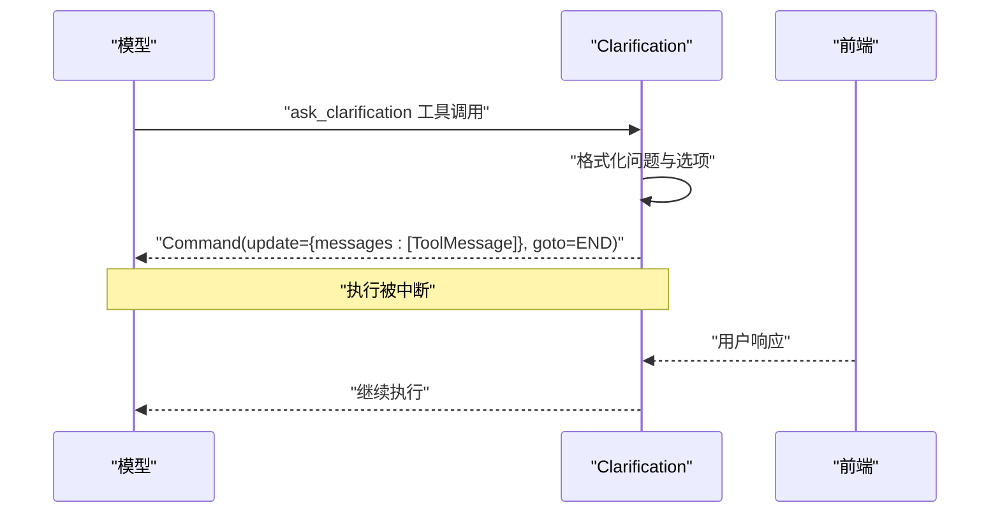
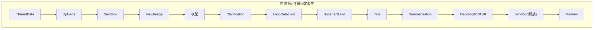

# 中间件系统

<cite>
**本文档引用的文件**
- [middleware-execution-flow.md](file://backend/docs/middleware-execution-flow.md)
- [rfc-create-deerflow-agent.md](file://backend/docs/rfc-create-deerflow-agent.md)
- [factory.py](file://backend/packages/harness/deerflow/agents/factory.py)
- [features.py](file://backend/packages/harness/deerflow/agents/features.py)
- [thread_data_middleware.py](file://backend/packages/harness/deerflow/agents/middlewares/thread_data_middleware.py)
- [summarization_middleware.py](file://backend/packages/harness/deerflow/agents/middlewares/summarization_middleware.py)
- [title_middleware.py](file://backend/packages/harness/deerflow/agents/middlewares/title_middleware.py)
- [todo_middleware.py](file://backend/packages/harness/deerflow/agents/middlewares/todo_middleware.py)
- [view_image_middleware.py](file://backend/packages/harness/deerflow/agents/middlewares/view_image_middleware.py)
- [clarification_middleware.py](file://backend/packages/harness/deerflow/agents/middlewares/clarification_middleware.py)
</cite>

## 目录
1. [简介](#简介)
2. [项目结构](#项目结构)
3. [核心组件](#核心组件)
4. [架构总览](#架构总览)
5. [详细组件分析](#详细组件分析)
6. [依赖关系分析](#依赖关系分析)
7. [性能考量](#性能考量)
8. [故障排查指南](#故障排查指南)
9. [结论](#结论)
10. [附录](#附录)

## 简介
本文件面向 DeerFlow 中间件系统，系统性阐述九个核心中间件的设计理念、执行顺序与状态传递机制，并提供错误处理策略、最佳实践与自定义中间件实现指南。中间件链采用“管道”而非“洋葱”模型，按固定顺序执行，部分中间件在每轮对话中重复运行，另一些仅在生命周期开始或结束时运行。

## 项目结构
中间件相关代码主要位于后端包 deerflow.agents.middlewares 下，配合工厂与特性配置模块共同完成中间件链的装配与执行。执行流程与排序规则由文档与工厂逻辑共同定义。

**图表来源**
- [factory.py:155-307](file://backend/packages/harness/deerflow/agents/factory.py#L155-L307)
- [features.py:14-65](file://backend/packages/harness/deerflow/agents/features.py#L14-L65)
- [middleware-execution-flow.md:26-63](file://backend/docs/middleware-execution-flow.md#L26-L63)
- [rfc-create-deerflow-agent.md:190-284](file://backend/docs/rfc-create-deerflow-agent.md#L190-L284)

**章节来源**
- [factory.py:155-307](file://backend/packages/harness/deerflow/agents/factory.py#L155-L307)
- [features.py:14-65](file://backend/packages/harness/deerflow/agents/features.py#L14-L65)
- [middleware-execution-flow.md:1-264](file://backend/docs/middleware-execution-flow.md#L1-L264)
- [rfc-create-deerflow-agent.md:190-284](file://backend/docs/rfc-create-deerflow-agent.md#L190-L284)

## 核心组件
- ThreadDataMiddleware：在每次线程执行前创建并管理工作区、上传与输出目录，支持惰性/急切初始化。
- UploadsMiddleware：扫描上传文件，为后续工具调用提供输入。
- SandboxMiddleware：获取/释放沙箱资源，管理执行环境。
- SummarizationMiddleware：在模型调用后进行上下文压缩，保留关键技能内容，触发前可挂载钩子。
- TitleMiddleware：在首次完整对话后自动生成标题，支持本地回退与异步生成。
- TodoMiddleware：检测并恢复被压缩的历史上下文中的待办事项，防止过早退出。
- ViewImageMiddleware：在模型调用前注入图像详情，使模型可直接分析已查看的图像。
- ClarificationMiddleware：拦截 ask_clarification 工具调用，中断执行并等待用户响应。

**章节来源**
- [thread_data_middleware.py:24-119](file://backend/packages/harness/deerflow/agents/middlewares/thread_data_middleware.py#L24-L119)
- [summarization_middleware.py:98-410](file://backend/packages/harness/deerflow/agents/middlewares/summarization_middleware.py#L98-L410)
- [title_middleware.py:29-185](file://backend/packages/harness/deerflow/agents/middlewares/title_middleware.py#L29-L185)
- [todo_middleware.py:58-180](file://backend/packages/harness/deerflow/agents/middlewares/todo_middleware.py#L58-L180)
- [view_image_middleware.py:19-223](file://backend/packages/harness/deerflow/agents/middlewares/view_image_middleware.py#L19-L223)
- [clarification_middleware.py:28-204](file://backend/packages/harness/deerflow/agents/middlewares/clarification_middleware.py#L28-L204)

## 架构总览
中间件链采用“两阶段排序”：内置固定顺序 + 外置中间件插入。内置顺序由工厂函数按特性标志决定；外置中间件通过 @Next/@Prev 装饰器锚定到任意内置或外置中间件，最终确保 ClarificationMiddleware 总在链尾。

**图表来源**
- [middleware-execution-flow.md:221-260](file://backend/docs/middleware-execution-flow.md#L221-L260)
- [factory.py:155-307](file://backend/packages/harness/deerflow/agents/factory.py#L155-L307)

**章节来源**
- [middleware-execution-flow.md:26-63](file://backend/docs/middleware-execution-flow.md#L26-L63)
- [rfc-create-deerflow-agent.md:238-284](file://backend/docs/rfc-create-deerflow-agent.md#L238-L284)

## 详细组件分析

### ThreadDataMiddleware 分析
- 设计理念：为每个线程创建隔离的工作区、上传与输出目录，支持惰性初始化以优化启动性能。
- 关键行为：
  - 解析运行时上下文或配置中的 thread_id，必要时抛出异常。
  - 支持惰性/急切两种初始化模式，分别在 before_agent 中仅计算路径或实际创建目录。
  - 为最后一条 HumanMessage 补充运行标识与时间戳，便于追踪。
- 状态传递：返回包含 thread_data（含 workspace、uploads、outputs 路径）与更新后的消息列表。
- 错误处理：缺少 thread_id 时立即抛错；目录创建失败需上层捕获并记录。

**图表来源**
- [thread_data_middleware.py:81-119](file://backend/packages/harness/deerflow/agents/middlewares/thread_data_middleware.py#L81-L119)

**章节来源**
- [thread_data_middleware.py:24-119](file://backend/packages/harness/deerflow/agents/middlewares/thread_data_middleware.py#L24-L119)

### UploadsMiddleware 分析
- 设计理念：在沙箱基础设施阶段扫描上传文件，为后续工具调用准备输入。
- 关键行为：在 before_agent 阶段执行，扫描线程上传目录并准备可用文件列表。
- 状态传递：更新 state 中的上传相关字段，供后续中间件与工具使用。
- 错误处理：文件扫描异常需记录日志并保证不影响后续中间件执行。

（注：该中间件具体实现细节未在当前上下文中展示，此处为通用设计说明）

### SandboxMiddleware 分析
- 设计理念：在生命周期开始获取沙箱，在结束后释放，确保资源正确回收。
- 关键行为：在 before_agent 获取沙箱，在 after_agent 释放沙箱。
- 状态传递：可能注入沙箱上下文或清理信息。
- 错误处理：释放失败需重试或降级处理，避免泄漏。

（注：该中间件具体实现细节未在当前上下文中展示，此处为通用设计说明）

### SummarizationMiddleware 分析
- 设计理念：在模型调用后进行上下文压缩，保留近期技能调用与提醒消息，触发前可挂载钩子。
- 关键行为：
  - before_model/abefore_model 中检查令牌数与消息数，决定是否压缩。
  - 压缩前将最近技能调用与动态上下文提醒从压缩候选中抢救出来。
  - 触发前钩子（BeforeSummarizationHook）用于导出压缩上下文。
  - 生成摘要并替换消息历史。
- 状态传递：返回移除全部消息并追加新消息与保留消息的指令。
- 错误处理：压缩失败或钩子异常不影响整体流程，记录日志并回退。

**图表来源**
- [summarization_middleware.py:161-186](file://backend/packages/harness/deerflow/agents/middlewares/summarization_middleware.py#L161-L186)
- [summarization_middleware.py:387-410](file://backend/packages/harness/deerflow/agents/middlewares/summarization_middleware.py#L387-L410)

**章节来源**
- [summarization_middleware.py:98-410](file://backend/packages/harness/deerflow/agents/middlewares/summarization_middleware.py#L98-L410)

### TitleMiddleware 分析
- 设计理念：在首次完整对话后自动生成标题，支持本地回退与异步生成。
- 关键行为：
  - 判断是否满足生成条件（启用、无现有标题、首回合完整交换）。
  - 构建提示词，提取用户与助手消息内容，清洗思考标签。
  - 异步调用模型生成标题，失败时回退到本地标题。
- 状态传递：返回包含 title 的状态更新。
- 错误处理：LLM 调用异常记录日志并回退本地生成。

**图表来源**
- [title_middleware.py:178-185](file://backend/packages/harness/deerflow/agents/middlewares/title_middleware.py#L178-L185)
- [title_middleware.py:154-177](file://backend/packages/harness/deerflow/agents/middlewares/title_middleware.py#L154-L177)

**章节来源**
- [title_middleware.py:29-185](file://backend/packages/harness/deerflow/agents/middlewares/title_middleware.py#L29-L185)

### TodoMiddleware 分析
- 设计理念：检测并恢复被压缩的历史上下文中的待办事项，防止过早退出。
- 关键行为：
  - before_model：当写入待办的工具调用已不在上下文窗口时，注入提醒消息。
  - after_model：当模型无工具调用但仍有未完成待办时，注入完成提醒并跳转回模型节点。
  - 限制最大完成提醒次数，防止无限循环。
- 状态传递：可能返回注入消息或跳转指令。
- 错误处理：逻辑分支清晰，异常情况通过计数与检查避免死循环。

**图表来源**
- [todo_middleware.py:67-170](file://backend/packages/harness/deerflow/agents/middlewares/todo_middleware.py#L67-L170)

**章节来源**
- [todo_middleware.py:58-180](file://backend/packages/harness/deerflow/agents/middlewares/todo_middleware.py#L58-L180)

### ViewImageMiddleware 分析
- 设计理念：在模型调用前自动注入图像详情，使模型可直接分析已查看的图像。
- 关键行为：
  - before_model/abefore_model：检查最后一条助手消息是否包含 view_image 工具调用且已完成。
  - 若满足条件，构造混合内容的人类消息（文本描述 + 图像数据），注入到消息历史。
- 状态传递：返回注入消息的状态更新。
- 错误处理：未找到图像或工具未完成时不注入，避免重复注入。

**图表来源**
- [view_image_middleware.py:190-223](file://backend/packages/harness/deerflow/agents/middlewares/view_image_middleware.py#L190-L223)
- [view_image_middleware.py:129-166](file://backend/packages/harness/deerflow/agents/middlewares/view_image_middleware.py#L129-L166)

**章节来源**
- [view_image_middleware.py:19-223](file://backend/packages/harness/deerflow/agents/middlewares/view_image_middleware.py#L19-L223)

### ClarificationMiddleware 分析
- 设计理念：拦截 ask_clarification 工具调用，格式化问题并中断执行，等待用户响应后再继续。
- 关键行为：
  - wrap_tool_call/awrap_tool_call：拦截 ask_clarification，格式化问题与选项，生成稳定消息 ID。
  - 返回 Command 指令：更新消息历史并跳转至结束，前端负责展示与收集用户输入。
- 状态传递：通过消息历史传递格式化后的澄清问题。
- 错误处理：格式化失败或异步处理异常时记录日志并保持中断状态。

**图表来源**
- [clarification_middleware.py:161-204](file://backend/packages/harness/deerflow/agents/middlewares/clarification_middleware.py#L161-L204)

**章节来源**
- [clarification_middleware.py:28-204](file://backend/packages/harness/deerflow/agents/middlewares/clarification_middleware.py#L28-L204)

## 依赖关系分析
- 组装顺序：工厂函数按特性标志固定顺序组装内置中间件链，随后通过 @Next/@Prev 插入外置中间件，最终确保 ClarificationMiddleware 位于链尾。
- 执行顺序：before_agent 正序执行，before_model 正序执行，after_model 反序执行，after_agent 反序执行。
- 资源管理：SandboxMiddleware 是唯一具有对称 before/after 生命周期的中间件，负责沙箱获取与释放。

**图表来源**
- [factory.py:192-295](file://backend/packages/harness/deerflow/agents/factory.py#L192-L295)
- [middleware-execution-flow.md:32-62](file://backend/docs/middleware-execution-flow.md#L32-L62)

**章节来源**
- [factory.py:155-307](file://backend/packages/harness/deerflow/agents/factory.py#L155-L307)
- [middleware-execution-flow.md:26-63](file://backend/docs/middleware-execution-flow.md#L26-L63)

## 性能考量
- 惰性初始化：ThreadDataMiddleware 默认惰性初始化，减少启动时 IO 开销。
- 异步生成：TitleMiddleware 异步生成标题并在失败时回退本地生成，避免阻塞。
- 压缩预算：SummarizationMiddleware 通过计数与令牌预算控制抢救范围，平衡上下文长度与信息保留。
- 循环保护：TodoMiddleware 的完成提醒上限防止无限重试。

## 故障排查指南
- ThreadDataMiddleware
  - 现象：缺少 thread_id 导致启动失败。
  - 处理：确保 runtime.context 或 configurable 中提供 thread_id。
  - 日志：目录创建失败时检查权限与磁盘空间。
- SummarizationMiddleware
  - 现象：压缩失败或钩子异常。
  - 处理：检查钩子实现与外部服务可用性；确认令牌计数逻辑。
- TitleMiddleware
  - 现象：异步生成失败。
  - 处理：检查模型可用性与网络；确认提示词模板与内容裁剪。
- TodoMiddleware
  - 现象：过早退出或无法继续。
  - 处理：检查待办状态与提醒注入逻辑；确认最大提醒次数配置。
- ViewImageMiddleware
  - 现象：图像详情未注入。
  - 处理：确认最后 AI 消息包含 view_image 且工具已完成；检查消息去重逻辑。
- ClarificationMiddleware
  - 现象：中断后无法继续。
  - 处理：检查前端响应流程与消息 ID 稳定性。

**章节来源**
- [thread_data_middleware.py:81-91](file://backend/packages/harness/deerflow/agents/middlewares/thread_data_middleware.py#L81-L91)
- [summarization_middleware.py:387-410](file://backend/packages/harness/deerflow/agents/middlewares/summarization_middleware.py#L387-L410)
- [title_middleware.py:174-176](file://backend/packages/harness/deerflow/agents/middlewares/title_middleware.py#L174-L176)
- [todo_middleware.py:152-153](file://backend/packages/harness/deerflow/agents/middlewares/todo_middleware.py#L152-L153)
- [view_image_middleware.py:129-166](file://backend/packages/harness/deerflow/agents/middlewares/view_image_middleware.py#L129-L166)
- [clarification_middleware.py:133-139](file://backend/packages/harness/deerflow/agents/middlewares/clarification_middleware.py#L133-L139)

## 结论
DeerFlow 中间件系统通过明确的内置顺序与灵活的外置插入机制，实现了稳定的执行流程与良好的扩展性。各中间件职责清晰、状态传递简洁、错误处理稳健。遵循本文档的最佳实践与实现指南，可在不破坏整体流程的前提下安全地扩展与定制中间件。

## 附录

### 中间件链执行顺序与钩子映射
- 内置顺序（固定）：ThreadData → Uploads → Sandbox → ViewImage → 模型 → Clarification → LoopDetection → SubagentLimit → Title → Summarization → DanglingToolCall → Sandbox(释放) → Memory
- 钩子执行方向：before_agent/ before_model 正序，after_model/ after_agent 反序

**章节来源**
- [middleware-execution-flow.md:26-63](file://backend/docs/middleware-execution-flow.md#L26-L63)
- [rfc-create-deerflow-agent.md:238-284](file://backend/docs/rfc-create-deerflow-agent.md#L238-L284)

### 自定义中间件实现指南
- 选择钩子：根据职责选择 before_agent/before_model/after_model/after_agent/wrap_tool_call 中的一个或多个。
- 状态传递：返回字典包含要更新的键值（如 messages、thread_data、title 等）。
- 错误处理：捕获并记录异常，避免影响后续中间件执行。
- 定位插入：使用 @Next 或 @Prev 装饰器声明相对位置，确保不与已有装饰冲突。
- 最佳实践：
  - 尽量保持幂等与可重复执行。
  - 明确边界条件与前置条件，失败时快速返回。
  - 使用日志记录关键路径，便于调试与审计。

**章节来源**
- [features.py:43-65](file://backend/packages/harness/deerflow/agents/features.py#L43-L65)
- [factory.py:315-389](file://backend/packages/harness/deerflow/agents/factory.py#L315-L389)