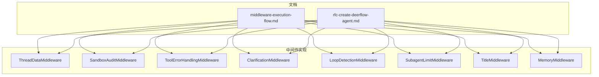
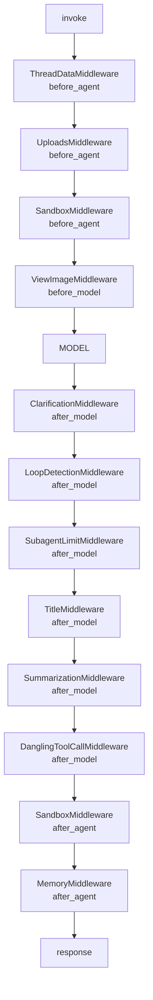
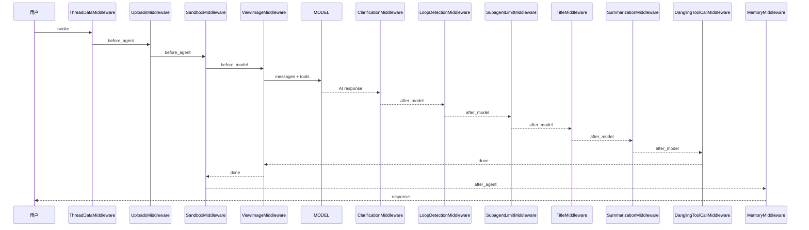
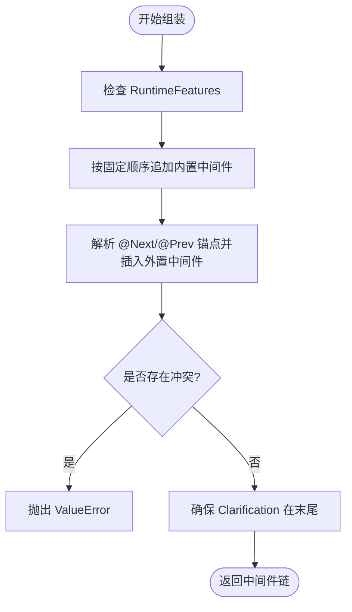
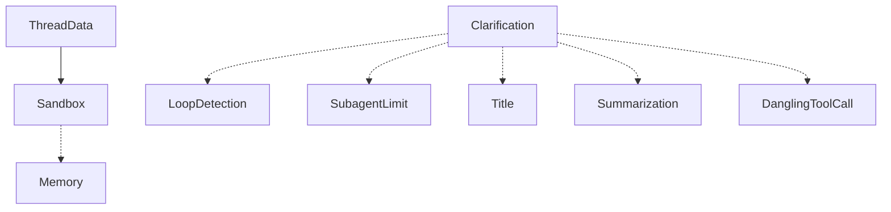

# 中间件系统概览

<cite>
**本文档引用的文件**
- [middleware-execution-flow.md](file://backend/docs/middleware-execution-flow.md)
- [rfc-create-deerflow-agent.md](file://backend/docs/rfc-create-deerflow-agent.md)
- [thread_data_middleware.py](file://backend/packages/harness/deerflow/agents/middlewares/thread_data_middleware.py)
- [sandbox_audit_middleware.py](file://backend/packages/harness/deerflow/agents/middlewares/sandbox_audit_middleware.py)
- [tool_error_handling_middleware.py](file://backend/packages/harness/deerflow/agents/middlewares/tool_error_handling_middleware.py)
- [clarification_middleware.py](file://backend/packages/harness/deerflow/agents/middlewares/clarification_middleware.py)
- [loop_detection_middleware.py](file://backend/packages/harness/deerflow/agents/middlewares/loop_detection_middleware.py)
- [subagent_limit_middleware.py](file://backend/packages/harness/deerflow/agents/middlewares/subagent_limit_middleware.py)
- [title_middleware.py](file://backend/packages/harness/deerflow/agents/middlewares/title_middleware.py)
- [memory_middleware.py](file://backend/packages/harness/deerflow/agents/middlewares/memory_middleware.py)
</cite>

## 目录
1. [简介](#简介)
2. [项目结构](#项目结构)
3. [核心组件](#核心组件)
4. [架构总览](#架构总览)
5. [详细组件分析](#详细组件分析)
6. [依赖关系分析](#依赖关系分析)
7. [性能考量](#性能考量)
8. [故障排查指南](#故障排查指南)
9. [结论](#结论)
10. [附录](#附录)

## 简介
DeerFlow 的中间件系统是代理运行时的核心扩展机制，采用“管道 + 钩子”的设计模式，在代理执行的关键节点（before_agent/before_model/after_model/after_agent）插入可插拔的功能模块。系统默认包含九个核心中间件，按固定顺序组成完整的执行链，并通过装饰器机制支持外部中间件的灵活插入与排序。

中间件系统的主要职责包括：
- 生命周期管理：在代理执行前后进行资源准备与清理
- 状态传递：在各阶段之间安全地传递与修改状态
- 安全审计：对工具调用（尤其是高风险命令）进行分类与拦截
- 错误处理：将异常转换为可继续执行的工具消息
- 流控与限流：防止重复调用与过度并发
- 智能增强：自动生成标题、记录记忆、提示澄清问题等

## 项目结构
中间件相关代码集中于后端包路径下的 agents/middlewares 目录，配套文档位于 backend/docs 目录，包含执行流程与组装规则的详细说明。

**图表来源**
- [middleware-execution-flow.md:1-292](file://backend/docs/middleware-execution-flow.md#L1-L292)
- [rfc-create-deerflow-agent.md:190-284](file://backend/docs/rfc-create-deerflow-agent.md#L190-L284)

**章节来源**
- [middleware-execution-flow.md:1-292](file://backend/docs/middleware-execution-flow.md#L1-L292)
- [rfc-create-deerflow-agent.md:190-284](file://backend/docs/rfc-create-deerflow-agent.md#L190-L284)

## 核心组件
- ThreadDataMiddleware：在 before_agent 阶段创建线程数据目录，支持惰性/急切两种初始化策略，确保后续中间件与工具可用的文件系统环境。
- SandboxAuditMiddleware：对 bash 工具调用进行输入校验、命令分类与审计日志记录，支持高风险阻断与中风险警告，保障沙箱安全。
- ToolErrorHandlingMiddleware：捕获工具执行异常，将其转换为错误工具消息，保证运行时的连续性；保留 LangGraph 控制信号。
- ClarificationMiddleware：拦截 ask_clarification 工具调用，格式化用户提示信息并中断执行，等待用户响应后再继续。
- LoopDetectionMiddleware：检测重复工具调用与单一工具高频调用，注入警告或强制停止，防止无限循环。
- SubagentLimitMiddleware：限制单次响应中 task 工具调用的最大并发数量，确保系统稳定性。
- TitleMiddleware：在首次完整对话后自动生成标题，支持本地回退与异步 LLM 生成。
- MemoryMiddleware：在 after_agent 阶段将对话片段入队至内存队列，进行去噪与异步汇总更新。

**章节来源**
- [thread_data_middleware.py:1-119](file://backend/packages/harness/deerflow/agents/middlewares/thread_data_middleware.py#L1-L119)
- [sandbox_audit_middleware.py:1-371](file://backend/packages/harness/deerflow/agents/middlewares/sandbox_audit_middleware.py#L1-L371)
- [tool_error_handling_middleware.py:1-171](file://backend/packages/harness/deerflow/agents/middlewares/tool_error_handling_middleware.py#L1-L171)
- [clarification_middleware.py:1-204](file://backend/packages/harness/deerflow/agents/middlewares/clarification_middleware.py#L1-L204)
- [loop_detection_middleware.py:1-440](file://backend/packages/harness/deerflow/agents/middlewares/loop_detection_middleware.py#L1-L440)
- [subagent_limit_middleware.py:1-77](file://backend/packages/harness/deerflow/agents/middlewares/subagent_limit_middleware.py#L1-L77)
- [title_middleware.py:1-185](file://backend/packages/harness/deerflow/agents/middlewares/title_middleware.py#L1-L185)
- [memory_middleware.py:1-111](file://backend/packages/harness/deerflow/agents/middlewares/memory_middleware.py#L1-L111)

## 架构总览
中间件链遵循 LangChain create_agent 的规则：before_* 阶段按正序执行，after_* 阶段按反序执行。系统采用“管道”而非“洋葱”，大多数中间件仅在单个钩子上工作，只有 SandboxMiddleware 同时具备 before_agent 与 after_agent 的对称性。

**图表来源**
- [middleware-execution-flow.md:32-75](file://backend/docs/middleware-execution-flow.md#L32-L75)

**章节来源**
- [middleware-execution-flow.md:26-75](file://backend/docs/middleware-execution-flow.md#L26-L75)

## 详细组件分析

### 执行流程与状态传递
- before_agent 阶段（正序）：ThreadData → Uploads → Sandbox，负责资源准备与上下文注入。
- before_model 阶段（正序）：ViewImage，负责在模型输入前注入图片等前置处理。
- after_model 阶段（反序）：Clarification → LoopDetection → SubagentLimit → Title → Summarization → DanglingToolCall，负责结果拦截、流控与后处理。
- after_agent 阶段（反序）：Sandbox → Memory，负责资源释放与记忆入队。

**图表来源**
- [middleware-execution-flow.md:77-154](file://backend/docs/middleware-execution-flow.md#L77-L154)

**章节来源**
- [middleware-execution-flow.md:77-154](file://backend/docs/middleware-execution-flow.md#L77-L154)

### 中间件链组装与排序策略
- 固定顺序：通过 RuntimeFeatures 与 _assemble_from_features 组装，内置中间件按固定顺序追加。
- 外置插入：通过 @Next/@Prev 装饰器声明锚点，允许用户中间件自由插入到任意位置。
- 冲突检测：若两个外置中间件同时锚定同一目标，将抛出 ValueError。
- 特殊处理：ClarificationMiddleware 永远位于链末尾，以确保其 after_model 最先执行，拦截 ask_clarification。

**图表来源**
- [rfc-create-deerflow-agent.md:190-284](file://backend/docs/rfc-create-deerflow-agent.md#L190-L284)

**章节来源**
- [rfc-create-deerflow-agent.md:190-284](file://backend/docs/rfc-create-deerflow-agent.md#L190-L284)

### ThreadDataMiddleware（生命周期与文件系统）
- 生命周期：支持惰性初始化（仅计算路径，按需创建目录）与急切初始化（在 before_agent 阶段创建目录）。
- 状态传递：在 before_agent 返回包含 thread_data 路径与修正后的消息，供后续中间件使用。
- 依赖关系：必须在 SandboxMiddleware 之前执行，因为沙箱需要线程目录存在。

**章节来源**
- [thread_data_middleware.py:37-119](file://backend/packages/harness/deerflow/agents/middlewares/thread_data_middleware.py#L37-L119)

### SandboxAuditMiddleware（安全审计与拦截）
- 输入校验：长度、空命令、空字节等基础校验，拒绝异常输入。
- 命令分类：基于正则与分词的高/中/低风险分类，支持复合命令拆分。
- 审计日志：结构化 JSON 记录命令、线程与判定结果，便于追踪。
- 拦截策略：高风险直接阻断并返回错误工具消息；中风险附加警告提示。

**章节来源**
- [sandbox_audit_middleware.py:28-371](file://backend/packages/harness/deerflow/agents/middlewares/sandbox_audit_middleware.py#L28-L371)

### ToolErrorHandlingMiddleware（错误处理策略）
- 异常捕获：同步与异步路径均捕获工具执行异常，转换为错误工具消息。
- 控制信号保留：识别并透传 GraphBubbleUp 等 LangGraph 控制信号，不影响运行时控制流。
- 详细信息：限制错误详情长度，避免过长输出影响性能与安全。

**章节来源**
- [tool_error_handling_middleware.py:24-171](file://backend/packages/harness/deerflow/agents/middlewares/tool_error_handling_middleware.py#L24-L171)

### ClarificationMiddleware（澄清交互）
- 拦截逻辑：拦截 ask_clarification 工具调用，格式化为用户友好的消息。
- 稳定消息 ID：基于工具调用 ID 或内容哈希生成稳定 ID，确保重试时替换而非追加。
- 中断执行：返回 Command 指令，将消息加入历史并跳转至结束，等待用户响应。

**章节来源**
- [clarification_middleware.py:28-204](file://backend/packages/harness/deerflow/agents/middlewares/clarification_middleware.py#L28-L204)

### LoopDetectionMiddleware（循环检测与限流）
- 双层检测：哈希层（相同工具调用集合）与频率层（同一工具类型高频调用）。
- 窗口滑动：维护固定大小的历史窗口，统计重复次数。
- 动态阈值：支持全局阈值与工具粒度阈值覆盖，针对特定工具放宽限制。
- 强制停止：超过硬上限时清空工具调用元数据，强制生成最终文本回答。

**章节来源**
- [loop_detection_middleware.py:144-440](file://backend/packages/harness/deerflow/agents/middlewares/loop_detection_middleware.py#L144-L440)

### SubagentLimitMiddleware（并发限制）
- 并发裁剪：限制单次响应中 task 工具调用的最大数量，超出部分丢弃。
- 范围约束：限制在 [2, 4] 区间，确保系统稳定性与资源占用平衡。
- 原位替换：通过克隆 AI 消息并替换工具调用列表，保持消息 ID 一致。

**章节来源**
- [subagent_limit_middleware.py:25-77](file://backend/packages/harness/deerflow/agents/middlewares/subagent_limit_middleware.py#L25-L77)

### TitleMiddleware（自动标题生成）
- 触发条件：首次完整对话后（至少一个用户消息与一个助手回复）。
- 生成策略：优先异步 LLM 生成，失败时回退到本地标题生成。
- 内容清洗：去除思考标签与多余字符，限制最大长度。

**章节来源**
- [title_middleware.py:29-185](file://backend/packages/harness/deerflow/agents/middlewares/title_middleware.py#L29-L185)

### MemoryMiddleware（记忆入队）
- 过滤策略：仅保留用户输入与最终助手回复，忽略工具调用，减少噪声。
- 入队机制：通过内存队列进行去抖动批量更新，支持纠正与强化检测。
- 异步更新：在 after_agent 阶段触发，不阻塞主流程。

**章节来源**
- [memory_middleware.py:28-111](file://backend/packages/harness/deerflow/agents/middlewares/memory_middleware.py#L28-L111)

## 依赖关系分析
- 硬依赖
  - ThreadData 必须在 Sandbox 之前执行，确保沙箱可用。
  - Clarification 必须在链末尾，以便 after_model 反序时最先拦截 ask_clarification。
- 功能依赖
  - ViewImage 依赖 before_model 钩子注入图片数据。
  - Memory 依赖 after_agent 钩子进行资源释放后的记忆入队。
- 组件耦合
  - 大多数中间件为单向钩子，耦合度低，便于独立演进。
  - SandboxMiddleware 具有对称性，承担资源获取与释放的职责。

**图表来源**
- [middleware-execution-flow.md:265-269](file://backend/docs/middleware-execution-flow.md#L265-L269)

**章节来源**
- [middleware-execution-flow.md:265-269](file://backend/docs/middleware-execution-flow.md#L265-L269)

## 性能考量
- 惰性初始化：ThreadDataMiddleware 支持惰性初始化，避免不必要的磁盘 I/O。
- 分类与日志：SandboxAuditMiddleware 的命令分类与审计日志应避免过长命令，必要时进行截断。
- 队列批处理：MemoryMiddleware 使用队列与去抖动机制，降低频繁写入开销。
- 异步生成：TitleMiddleware 支持异步 LLM 生成，失败时快速回退本地生成，提升用户体验。
- 窗口与锁：LoopDetectionMiddleware 使用滑动窗口与线程锁，注意在高并发场景下的锁竞争。

## 故障排查指南
- 线程目录缺失
  - 现象：Sandbox 初始化失败或工具调用报错。
  - 排查：确认 ThreadDataMiddleware 是否在 Sandbox 之前执行，检查线程 ID 是否正确传递。
- 澄清请求未生效
  - 现象：模型发出 ask_clarification 但未中断。
  - 排查：确认 ClarificationMiddleware 是否位于链末尾，after_model 是否被其他中间件覆盖。
- 工具调用异常
  - 现象：工具执行失败导致流程中断。
  - 排查：检查 ToolErrorHandlingMiddleware 是否正常捕获异常，确认 GraphBubbleUp 信号是否被正确透传。
- 循环检测误判
  - 现象：合法重复调用被拦截。
  - 排查：调整 LoopDetectionMiddleware 的阈值参数，必要时为特定工具设置覆盖阈值。
- 并发超限
  - 现象：task 工具调用过多导致性能下降。
  - 排查：调整 SubagentLimitMiddleware 的最大并发数，确保在 [2, 4] 范围内。
- 标题生成失败
  - 现象：异步 LLM 生成失败，标题为空。
  - 排查：检查 TitleMiddleware 的回退逻辑，确认用户消息内容是否足够。
- 记忆未更新
  - 现象：会话结束后记忆未入库。
  - 排查：确认 MemoryMiddleware 的过滤逻辑与队列配置，检查线程 ID 与消息完整性。

**章节来源**
- [clarification_middleware.py:120-204](file://backend/packages/harness/deerflow/agents/middlewares/clarification_middleware.py#L120-L204)
- [tool_error_handling_middleware.py:24-171](file://backend/packages/harness/deerflow/agents/middlewares/tool_error_handling_middleware.py#L24-L171)
- [loop_detection_middleware.py:175-440](file://backend/packages/harness/deerflow/agents/middlewares/loop_detection_middleware.py#L175-L440)
- [subagent_limit_middleware.py:25-77](file://backend/packages/harness/deerflow/agents/middlewares/subagent_limit_middleware.py#L25-L77)
- [title_middleware.py:146-185](file://backend/packages/harness/deerflow/agents/middlewares/title_middleware.py#L146-L185)
- [memory_middleware.py:52-111](file://backend/packages/harness/deerflow/agents/middlewares/memory_middleware.py#L52-L111)

## 结论
DeerFlow 中间件系统通过固定顺序的内置链与灵活的外置插入机制，实现了代理运行时的可扩展与可控。系统采用“管道 + 钩子”的设计，强调 after_model 的反序执行优先级与关键中间件（如 Clarification）的特殊地位。在安全、稳定性与用户体验之间取得平衡，既满足生产环境的安全要求，又提供良好的可维护性与可观测性。

## 附录
- 中间件列表与钩子分布参见文档中的表格与流程图。
- 组件类图与时序图有助于理解各中间件的职责边界与交互方式。