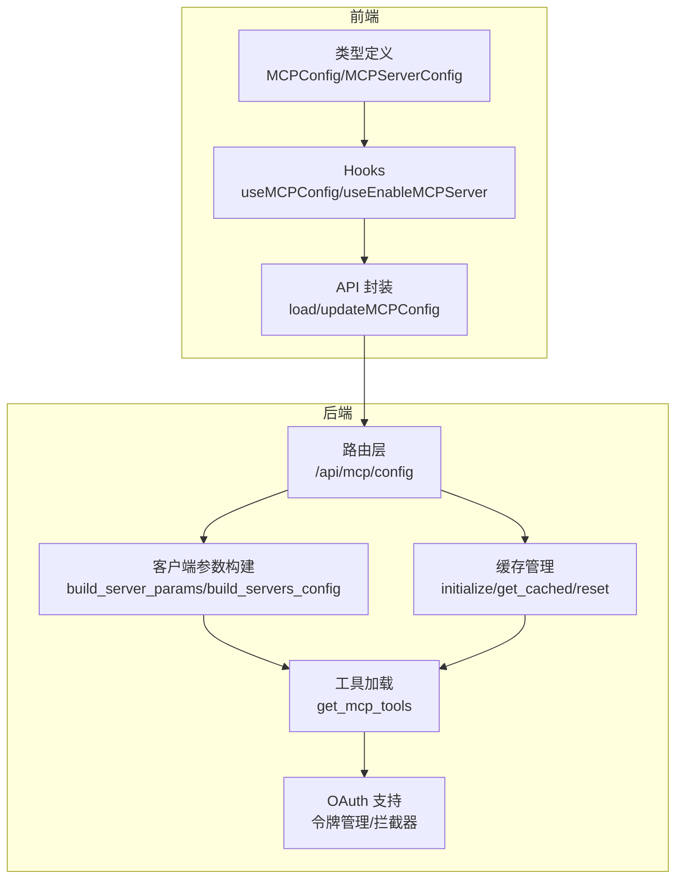
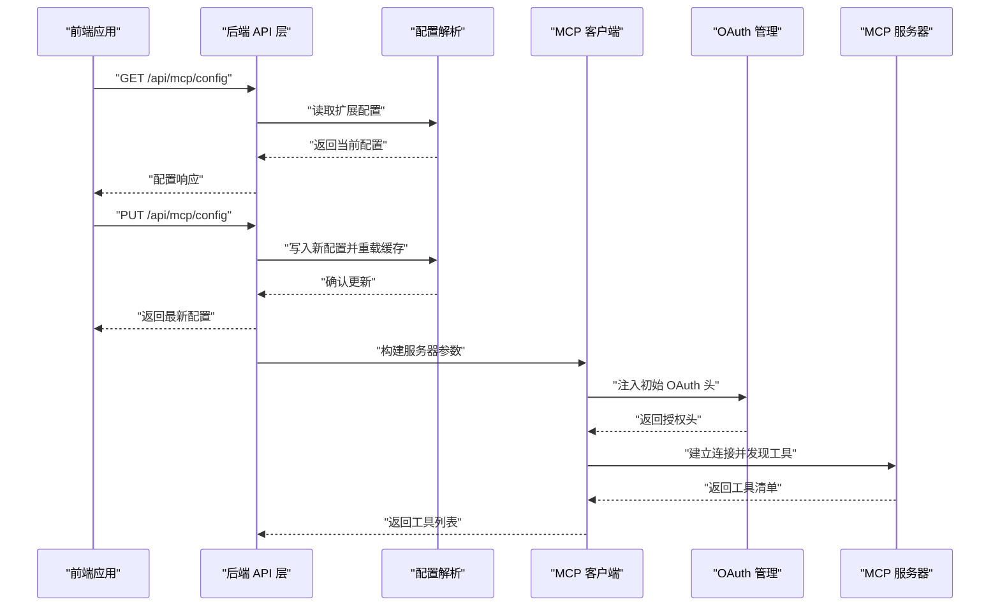
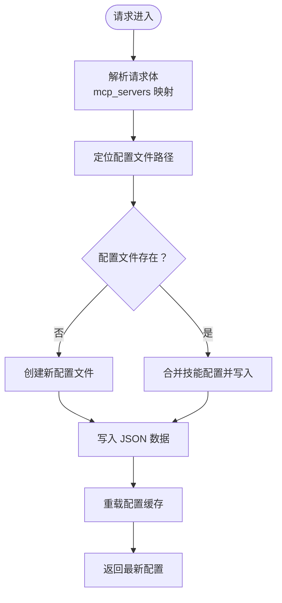
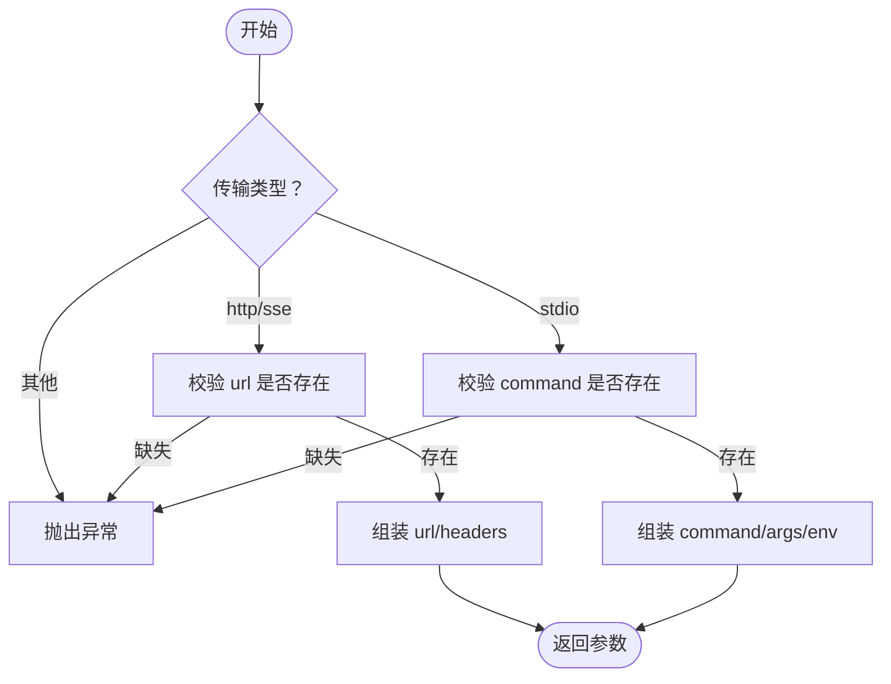
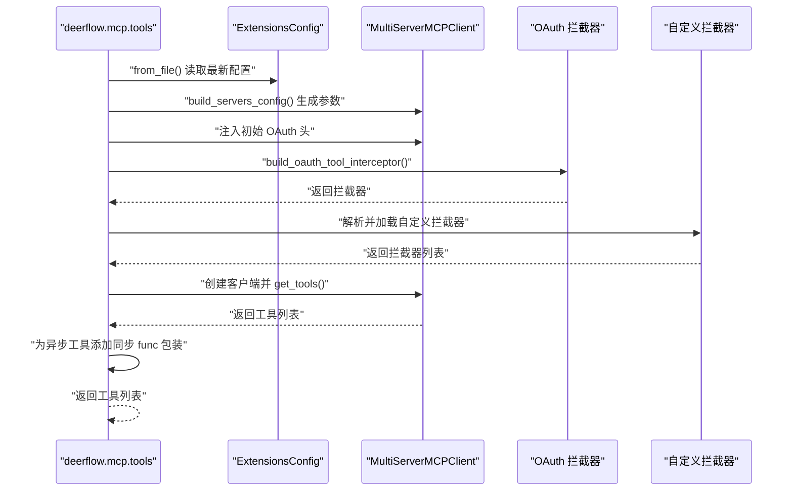
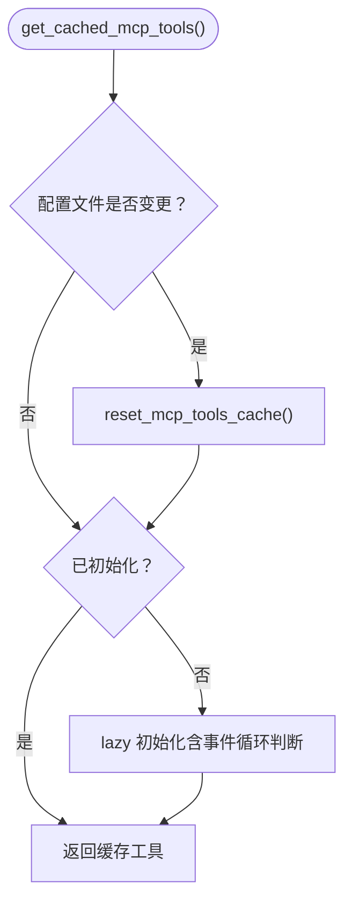
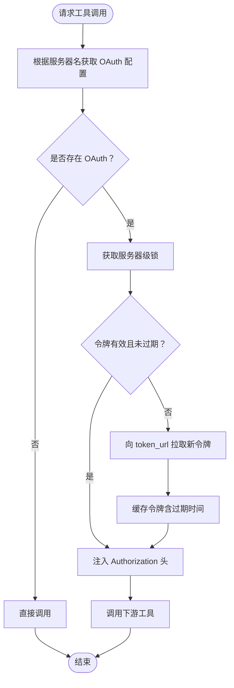
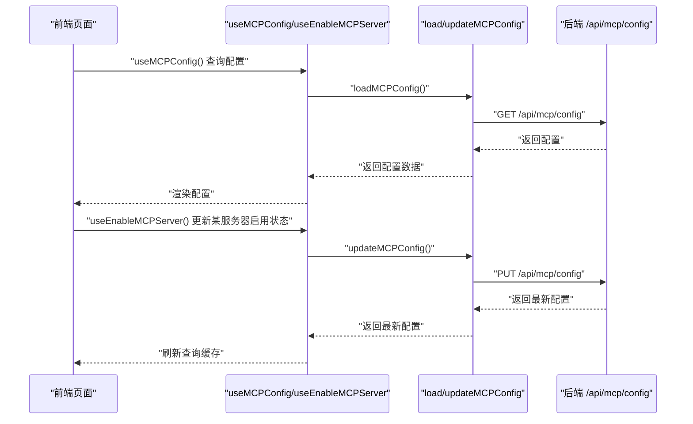
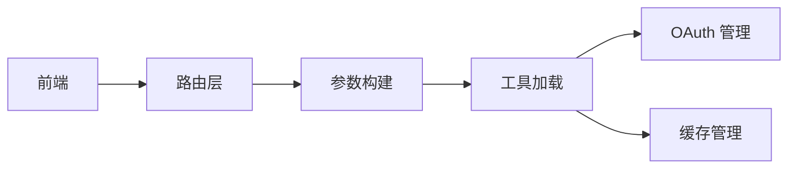

# MCP 协议集成

<cite>
**本文引用的文件**
- [后端：MCP 路由器](file://backend/app/gateway/routers/mcp.py)
- [后端：MCP 客户端参数构建](file://backend/packages/harness/deerflow/mcp/client.py)
- [后端：MCP 工具加载](file://backend/packages/harness/deerflow/mcp/tools.py)
- [后端：MCP 缓存](file://backend/packages/harness/deerflow/mcp/cache.py)
- [后端：MCP OAuth 管理](file://backend/packages/harness/deerflow/mcp/oauth.py)
- [后端：MCP 配置文档](file://backend/docs/MCP_SERVER.md)
- [前端：MCP 类型定义](file://frontend/src/core/mcp/types.ts)
- [前端：MCP API 封装](file://frontend/src/core/mcp/api.ts)
- [前端：MCP Hooks](file://frontend/src/core/mcp/hooks.ts)
- [前端：MCP 导出入口](file://frontend/src/core/mcp/index.ts)
- [测试：MCP 客户端配置](file://backend/tests/test_mcp_client_config.py)
- [测试：MCP 自定义拦截器](file://backend/tests/test_mcp_custom_interceptors.py)
- [测试：MCP 同步包装器](file://backend/tests/test_mcp_sync_wrapper.py)
</cite>

## 目录
1. [简介](#简介)
2. [项目结构](#项目结构)
3. [核心组件](#核心组件)
4. [架构总览](#架构总览)
5. [详细组件分析](#详细组件分析)
6. [依赖分析](#依赖分析)
7. [性能考虑](#性能考虑)
8. [故障排除指南](#故障排除指南)
9. [结论](#结论)
10. [附录](#附录)

## 简介
本文件面向 DeerFlow MCP（Model Context Protocol）集成系统，系统性阐述 MCP 协议在 DeerFlow 中的工作原理、通信机制与数据格式；介绍多服务器客户端架构、连接管理与负载均衡策略；说明传输协议支持（标准输入输出、HTTP、SSE）及各自适用场景；提供 MCP 服务器配置指南、客户端连接示例与故障排除方法，并总结外部工具集成最佳实践与性能优化建议。

## 项目结构
MCP 集成横跨后端（FastAPI 路由器、MCP 客户端与工具加载、缓存与 OAuth）、前端（类型定义、API 封装与 React Query Hooks）以及测试与文档，形成“配置驱动 + 运行时发现 + 动态拦截”的整体能力。

图表来源
- [后端：MCP 路由器:66-169](file://backend/app/gateway/routers/mcp.py#L66-L169)
- [后端：MCP 客户端参数构建:11-68](file://backend/packages/harness/deerflow/mcp/client.py#L11-L68)
- [后端：MCP 工具加载:57-135](file://backend/packages/harness/deerflow/mcp/tools.py#L57-L135)
- [后端：MCP 缓存:56-142](file://backend/packages/harness/deerflow/mcp/cache.py#L56-L142)
- [后端：MCP OAuth 管理:25-150](file://backend/packages/harness/deerflow/mcp/oauth.py#L25-L150)
- [前端：MCP API 封装:6-20](file://frontend/src/core/mcp/api.ts#L6-L20)
- [前端：MCP Hooks:5-44](file://frontend/src/core/mcp/hooks.ts#L5-L44)
- [前端：MCP 类型定义:1-8](file://frontend/src/core/mcp/types.ts#L1-L8)

章节来源
- [后端：MCP 路由器:1-170](file://backend/app/gateway/routers/mcp.py#L1-L170)
- [后端：MCP 客户端参数构建:1-69](file://backend/packages/harness/deerflow/mcp/client.py#L1-L69)
- [后端：MCP 工具加载:1-136](file://backend/packages/harness/deerflow/mcp/tools.py#L1-L136)
- [后端：MCP 缓存:1-143](file://backend/packages/harness/deerflow/mcp/cache.py#L1-L143)
- [后端：MCP OAuth 管理:1-151](file://backend/packages/harness/deerflow/mcp/oauth.py#L1-L151)
- [前端：MCP API 封装:1-21](file://frontend/src/core/mcp/api.ts#L1-L21)
- [前端：MCP Hooks:1-44](file://frontend/src/core/mcp/hooks.ts#L1-L44)
- [前端：MCP 类型定义:1-8](file://frontend/src/core/mcp/types.ts#L1-L8)

## 核心组件
- 配置与路由
  - 后端提供 /api/mcp/config 的 GET/PUT 接口，用于读取与更新 MCP 服务器配置，配置来源于项目根目录的扩展配置文件。
- 客户端参数构建
  - 将扩展配置转换为适配器所需的服务器参数字典，支持 stdio、http、sse 三种传输类型。
- 工具加载与拦截
  - 基于已配置的服务器集合初始化多服务器 MCP 客户端，动态发现工具并注入 OAuth 与自定义拦截器，同时为同步调用环境提供工具包装。
- 缓存与懒加载
  - 通过文件修改时间检测配置变更，实现懒加载与缓存失效重载，确保前后端进程间配置变更的及时反映。
- OAuth 支持
  - 统一的令牌管理器负责 client_credentials 与 refresh_token 两种授权模式，自动刷新与并发安全处理。

章节来源
- [后端：MCP 路由器:66-169](file://backend/app/gateway/routers/mcp.py#L66-L169)
- [后端：MCP 客户端参数构建:11-68](file://backend/packages/harness/deerflow/mcp/client.py#L11-L68)
- [后端：MCP 工具加载:57-135](file://backend/packages/harness/deerflow/mcp/tools.py#L57-L135)
- [后端：MCP 缓存:56-142](file://backend/packages/harness/deerflow/mcp/cache.py#L56-L142)
- [后端：MCP OAuth 管理:25-150](file://backend/packages/harness/deerflow/mcp/oauth.py#L25-L150)

## 架构总览
下图展示从前端到后端再到 MCP 服务器的完整调用链路，包括配置读取、工具加载、拦截器注入与 OAuth 处理。

图表来源
- [后端：MCP 路由器:66-169](file://backend/app/gateway/routers/mcp.py#L66-L169)
- [后端：MCP 客户端参数构建:11-68](file://backend/packages/harness/deerflow/mcp/client.py#L11-L68)
- [后端：MCP 工具加载:57-135](file://backend/packages/harness/deerflow/mcp/tools.py#L57-L135)
- [后端：MCP OAuth 管理:140-150](file://backend/packages/harness/deerflow/mcp/oauth.py#L140-L150)

## 详细组件分析

### 配置与路由（后端）
- GET /api/mcp/config：返回当前 MCP 服务器配置，包含启用状态、传输类型、命令/URL、环境变量/请求头、OAuth 配置等字段。
- PUT /api/mcp/config：接收新的服务器配置，写入扩展配置文件，重载全局配置缓存，触发 MCP 工具重新初始化。

图表来源
- [后端：MCP 路由器:104-169](file://backend/app/gateway/routers/mcp.py#L104-L169)

章节来源
- [后端：MCP 路由器:66-169](file://backend/app/gateway/routers/mcp.py#L66-L169)

### 客户端参数构建
- 传输类型支持：stdio、http、sse。
- 参数校验：
  - stdio：必须提供 command；可选 args、env。
  - http/sse：必须提供 url；可选 headers。
  - 不支持的传输类型将抛出异常。
- 服务器集合构建：遍历启用的服务器，逐个生成参数字典。

图表来源
- [后端：MCP 客户端参数构建:11-68](file://backend/packages/harness/deerflow/mcp/client.py#L11-L68)

章节来源
- [后端：MCP 客户端参数构建:11-68](file://backend/packages/harness/deerflow/mcp/client.py#L11-L68)
- [测试：MCP 客户端配置:9-93](file://backend/tests/test_mcp_client_config.py#L9-L93)

### 工具加载与拦截器
- 初始化流程：
  - 从磁盘读取最新扩展配置（避免进程隔离导致的缓存不一致）。
  - 构建服务器参数，注入初始 OAuth 头（用于服务端会话/工具发现阶段）。
  - 加载 OAuth 工具拦截器与自定义拦截器（按配置声明顺序追加），保证 OAuth 拦截器优先。
  - 创建多服务器 MCP 客户端并获取工具清单。
  - 对异步工具进行同步包装，以适配同步调用场景。
- 异常处理：捕获并记录错误，避免中断工具加载。

图表来源
- [后端：MCP 工具加载:57-135](file://backend/packages/harness/deerflow/mcp/tools.py#L57-L135)
- [后端：MCP OAuth 管理:122-150](file://backend/packages/harness/deerflow/mcp/oauth.py#L122-L150)

章节来源
- [后端：MCP 工具加载:57-135](file://backend/packages/harness/deerflow/mcp/tools.py#L57-L135)
- [后端：MCP OAuth 管理:122-150](file://backend/packages/harness/deerflow/mcp/oauth.py#L122-L150)
- [测试：MCP 自定义拦截器:55-275](file://backend/tests/test_mcp_custom_interceptors.py#L55-L275)
- [测试：MCP 同步包装器:15-43](file://backend/tests/test_mcp_sync_wrapper.py#L15-L43)

### 缓存与懒加载
- 初始化：首次调用时在当前事件循环中执行初始化，若无运行中的事件循环则新建线程池执行。
- 懒加载：若未初始化则自动初始化；若配置文件被修改则重置缓存并重新初始化。
- 重置：提供显式重置接口，便于测试或手动刷新。

图表来源
- [后端：MCP 缓存:82-142](file://backend/packages/harness/deerflow/mcp/cache.py#L82-L142)

章节来源
- [后端：MCP 缓存:56-142](file://backend/packages/harness/deerflow/mcp/cache.py#L56-L142)

### OAuth 支持
- 支持授权模式：client_credentials、refresh_token。
- 并发安全：每个服务器独立锁，避免重复拉取令牌。
- 刷新策略：基于过期时间与刷新偏移量提前刷新。
- 工具拦截：在每次工具调用前注入 Authorization 头。

图表来源
- [后端：MCP OAuth 管理:47-119](file://backend/packages/harness/deerflow/mcp/oauth.py#L47-L119)

章节来源
- [后端：MCP OAuth 管理:25-150](file://backend/packages/harness/deerflow/mcp/oauth.py#L25-L150)

### 前端集成
- 类型定义：MCPConfig、MCPServerConfig，覆盖启用状态、描述、传输类型、命令/URL、环境变量/请求头、OAuth 配置等。
- API 封装：封装 GET/PUT /api/mcp/config，统一 Content-Type。
- Hooks：使用 React Query 查询与更新配置，支持启用/禁用单个服务器。

图表来源
- [前端：MCP 类型定义:1-8](file://frontend/src/core/mcp/types.ts#L1-L8)
- [前端：MCP API 封装:6-20](file://frontend/src/core/mcp/api.ts#L6-L20)
- [前端：MCP Hooks:5-44](file://frontend/src/core/mcp/hooks.ts#L5-L44)
- [后端：MCP 路由器:66-169](file://backend/app/gateway/routers/mcp.py#L66-L169)

章节来源
- [前端：MCP 类型定义:1-8](file://frontend/src/core/mcp/types.ts#L1-L8)
- [前端：MCP API 封装:1-21](file://frontend/src/core/mcp/api.ts#L1-L21)
- [前端：MCP Hooks:1-44](file://frontend/src/core/mcp/hooks.ts#L1-L44)

## 依赖分析
- 组件内聚与耦合
  - 路由器仅负责配置读写与缓存重载，不直接参与工具加载细节，保持高内聚低耦合。
  - 客户端参数构建与工具加载模块解耦，前者只做参数映射，后者负责生命周期与拦截器。
  - OAuth 管理器独立于工具加载，通过拦截器注入，便于复用与替换。
- 外部依赖
  - 适配器库：langchain-mcp-adapters（用于多服务器客户端与工具发现）。
  - HTTP 客户端：httpx（用于 OAuth 令牌获取）。
- 循环依赖
  - 未见循环导入；模块职责清晰，通过函数与类边界隔离。

图表来源
- [后端：MCP 路由器:66-169](file://backend/app/gateway/routers/mcp.py#L66-L169)
- [后端：MCP 客户端参数构建:11-68](file://backend/packages/harness/deerflow/mcp/client.py#L11-L68)
- [后端：MCP 工具加载:57-135](file://backend/packages/harness/deerflow/mcp/tools.py#L57-L135)
- [后端：MCP 缓存:56-142](file://backend/packages/harness/deerflow/mcp/cache.py#L56-L142)
- [后端：MCP OAuth 管理:25-150](file://backend/packages/harness/deerflow/mcp/oauth.py#L25-L150)

章节来源
- [后端：MCP 客户端参数构建:1-69](file://backend/packages/harness/deerflow/mcp/client.py#L1-L69)
- [后端：MCP 工具加载:1-136](file://backend/packages/harness/deerflow/mcp/tools.py#L1-L136)
- [后端：MCP 缓存:1-143](file://backend/packages/harness/deerflow/mcp/cache.py#L1-L143)
- [后端：MCP OAuth 管理:1-151](file://backend/packages/harness/deerflow/mcp/oauth.py#L1-L151)

## 性能考虑
- 事件循环与线程池
  - 工具同步包装采用全局线程池执行嵌套事件循环，减少阻塞并提升吞吐。
- 缓存与懒加载
  - 通过文件 mtime 检测配置变更，避免不必要的重复初始化；懒加载降低启动成本。
- 并发与锁
  - OAuth 令牌获取按服务器粒度加锁，避免并发重复拉取；合理设置刷新偏移量平衡安全性与性能。
- 传输选择
  - 本地/同机服务优先 stdio，减少网络开销；远端服务使用 http/sse 并结合连接池与超时控制。

## 故障排除指南
- 配置写入失败
  - 现象：PUT /api/mcp/config 返回 500。
  - 排查：检查配置文件路径权限、磁盘空间、JSON 格式合法性。
  - 参考
    - [后端：MCP 路由器:136-169](file://backend/app/gateway/routers/mcp.py#L136-L169)
- 服务器参数校验失败
  - 现象：抛出“缺少 command/url”或“不支持的传输类型”。
  - 排查：确认传输类型与必填字段匹配；stdio 必须提供 command；http/sse 必须提供 url。
  - 参考
    - [后端：MCP 客户端参数构建:24-40](file://backend/packages/harness/deerflow/mcp/client.py#L24-L40)
    - [测试：MCP 客户端配置:27-63](file://backend/tests/test_mcp_client_config.py#L27-L63)
- OAuth 获取失败
  - 现象：令牌获取异常或响应缺少必要字段。
  - 排查：核对 token_url、grant_type、client_id/secret、scope、audience；检查网络连通性与超时设置。
  - 参考
    - [后端：MCP OAuth 管理:72-119](file://backend/packages/harness/deerflow/mcp/oauth.py#L72-L119)
- 工具加载为空
  - 现象：get_mcp_tools 返回空列表。
  - 排查：确认安装了适配器库；检查 enabled 服务器数量；查看日志中“未启用服务器”或“导入失败”提示。
  - 参考
    - [后端：MCP 工具加载:64-67](file://backend/packages/harness/deerflow/mcp/tools.py#L64-L67)
    - [后端：MCP 配置文档:1-100](file://backend/docs/MCP_SERVER.md#L1-L100)
- 自定义拦截器异常
  - 现象：拦截器加载失败或抛出异常。
  - 排查：检查拦截器路径可解析、返回可调用对象；查看警告日志定位问题。
  - 参考
    - [后端：MCP 工具加载:108-118](file://backend/packages/harness/deerflow/mcp/tools.py#L108-L118)
    - [测试：MCP 自定义拦截器:130-171](file://backend/tests/test_mcp_custom_interceptors.py#L130-L171)

章节来源
- [后端：MCP 路由器:136-169](file://backend/app/gateway/routers/mcp.py#L136-L169)
- [后端：MCP 客户端参数构建:24-40](file://backend/packages/harness/deerflow/mcp/client.py#L24-L40)
- [后端：MCP 工具加载:64-67](file://backend/packages/harness/deerflow/mcp/tools.py#L64-L67)
- [后端：MCP OAuth 管理:72-119](file://backend/packages/harness/deerflow/mcp/oauth.py#L72-L119)
- [后端：MCP 配置文档:1-100](file://backend/docs/MCP_SERVER.md#L1-L100)
- [测试：MCP 自定义拦截器:130-171](file://backend/tests/test_mcp_custom_interceptors.py#L130-L171)

## 结论
DeerFlow 的 MCP 集成以“配置驱动 + 适配器 + 拦截器 + 缓存”为核心，实现了对多服务器、多传输类型的统一接入与动态管理。通过前端与后端的协同，用户可以便捷地启用/禁用服务器、配置 OAuth 与自定义拦截器，并在运行时自动发现与加载工具。配合缓存与并发安全的令牌管理，系统在可用性与性能之间取得良好平衡。

## 附录

### MCP 服务器配置指南
- 文件位置：项目根目录的扩展配置文件（由后端解析）。
- 关键字段
  - mcp_servers：服务器映射，每项包含 enabled、type、command/args/env（stdio）或 url/headers（http/sse）、oauth（可选）。
  - mcpInterceptors：自定义拦截器导入路径列表（字符串或数组），按声明顺序追加。
- OAuth 配置要点
  - 支持 client_credentials 与 refresh_token；
  - 支持额外参数与过期偏移刷新；
  - 通过拦截器自动注入 Authorization 头。
- 参考
  - [后端：MCP 配置文档:1-100](file://backend/docs/MCP_SERVER.md#L1-L100)

章节来源
- [后端：MCP 配置文档:1-100](file://backend/docs/MCP_SERVER.md#L1-L100)

### 传输协议与适用场景
- stdio
  - 适用：本地/同机 MCP 服务器，无需网络栈开销。
  - 注意：必须提供 command；可配置 args、env。
- http/sse
  - 适用：远程 MCP 服务器，支持 OAuth 与请求头。
  - 注意：必须提供 url；可配置 headers；支持自动令牌注入。

章节来源
- [后端：MCP 客户端参数构建:24-40](file://backend/packages/harness/deerflow/mcp/client.py#L24-L40)
- [测试：MCP 客户端配置:34-56](file://backend/tests/test_mcp_client_config.py#L34-L56)

### 外部工具集成最佳实践
- 使用自定义拦截器注入上下文信息（如用户认证令牌）。
- 对异步工具进行同步包装，确保与现有同步调用框架兼容。
- 合理设置 OAuth 刷新偏移，避免临界点频繁刷新。
- 在生产环境启用缓存与懒加载，减少启动与切换成本。

章节来源
- [后端：MCP 工具加载:120-131](file://backend/packages/harness/deerflow/mcp/tools.py#L120-L131)
- [后端：MCP OAuth 管理:67-71](file://backend/packages/harness/deerflow/mcp/oauth.py#L67-L71)