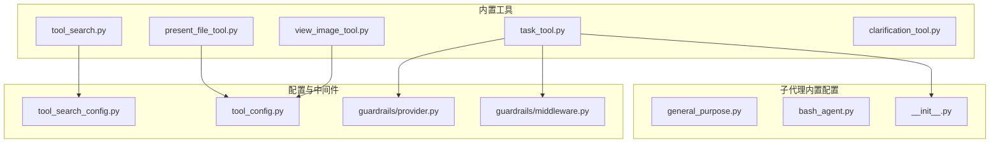
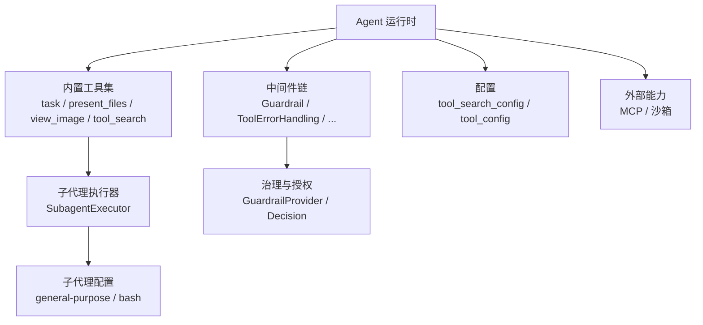
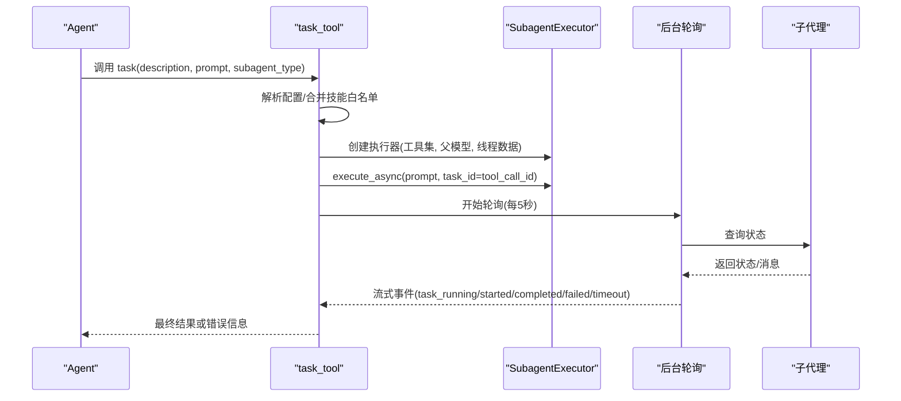
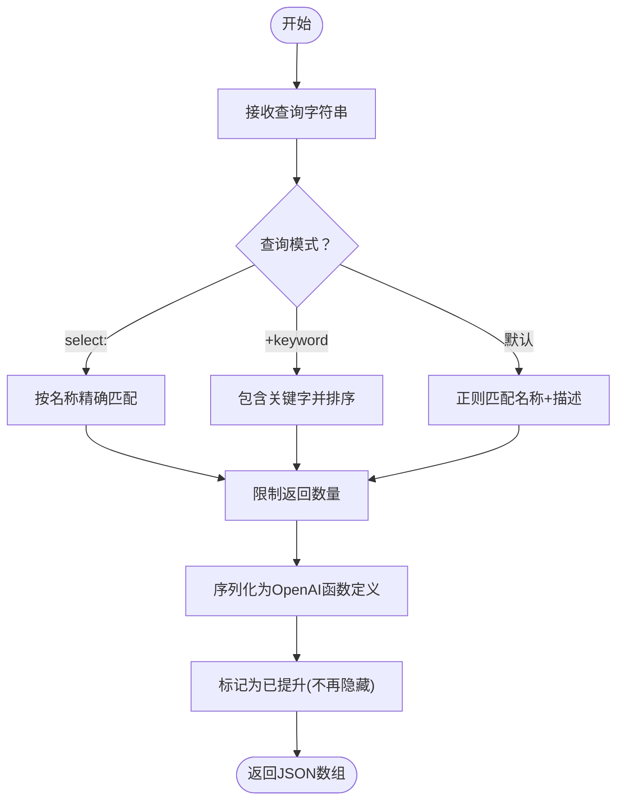
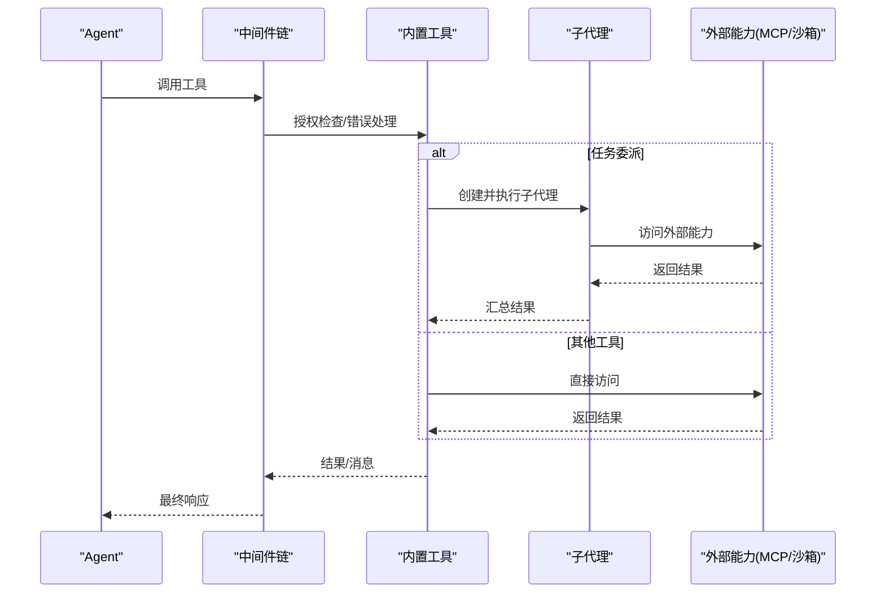
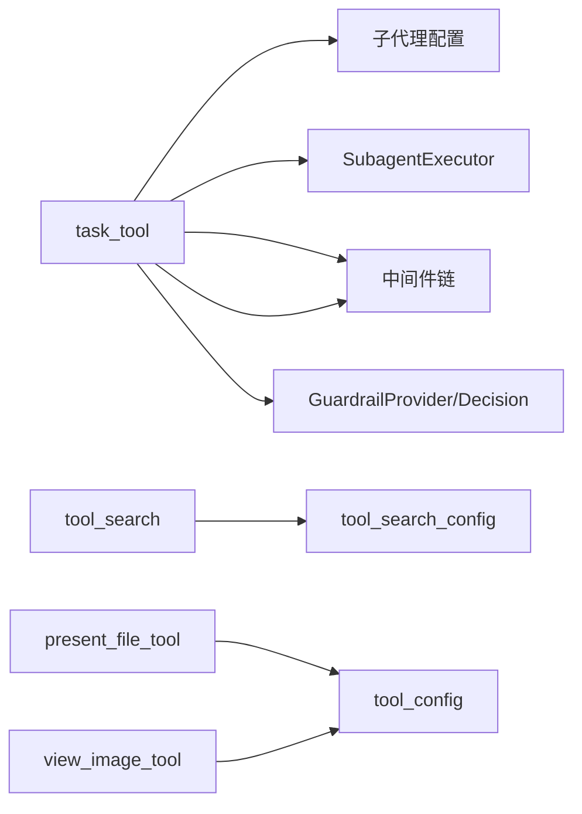

# 内置工具

<cite>
**本文引用的文件**
- [backend/packages/harness/deerflow/tools/builtins/__init__.py](file://backend/packages/harness/deerflow/tools/builtins/__init__.py)
- [backend/packages/harness/deerflow/tools/builtins/task_tool.py](file://backend/packages/harness/deerflow/tools/builtins/task_tool.py)
- [backend/packages/harness/deerflow/tools/builtins/tool_search.py](file://backend/packages/harness/deerflow/tools/builtins/tool_search.py)
- [backend/packages/harness/deerflow/tools/builtins/present_file_tool.py](file://backend/packages/harness/deerflow/tools/builtins/present_file_tool.py)
- [backend/packages/harness/deerflow/tools/builtins/view_image_tool.py](file://backend/packages/harness/deerflow/tools/builtins/view_image_tool.py)
- [backend/packages/harness/deerflow/subagents/builtins/__init__.py](file://backend/packages/harness/deerflow/subagents/builtins/__init__.py)
- [backend/packages/harness/deerflow/subagents/builtins/general_purpose.py](file://backend/packages/harness/deerflow/subagents/builtins/general_purpose.py)
- [backend/packages/harness/deerflow/subagents/builtins/bash_agent.py](file://backend/packages/harness/deerflow/subagents/builtins/bash_agent.py)
- [backend/packages/harness/deerflow/config/tool_search_config.py](file://backend/packages/harness/deerflow/config/tool_search_config.py)
- [backend/packages/harness/deerflow/config/tool_config.py](file://backend/packages/harness/deerflow/config/tool_config.py)
- [backend/docs/rfc-create-deerflow-agent.md](file://backend/docs/rfc-create-deerflow-agent.md)
- [backend/docs/task_tool_improvements.md](file://backend/docs/task_tool_improvements.md)
- [backend/packages/harness/deerflow/guardrails/provider.py](file://backend/packages/harness/deerflow/guardrails/provider.py)
- [backend/packages/harness/deerflow/guardrails/middleware.py](file://backend/packages/harness/deerflow/guardrails/middleware.py)
- [backend/tests/test_guardrail_middleware.py](file://backend/tests/test_guardrail_middleware.py)
- [backend/scripts/tool-error-degradation-detection.sh](file://backend/scripts/tool-error-degradation-detection.sh)
- [backend/packages/harness/deerflow/sandbox/tools.py](file://backend/packages/harness/deerflow/sandbox/tools.py)
- [backend/packages/harness/deerflow/mcp/tools.py](file://backend/packages/harness/deerflow/mcp/tools.py)
- [backend/tests/test_mcp_sync_wrapper.py](file://backend/tests/test_mcp_sync_wrapper.py)
</cite>

## 目录
1. [简介](#简介)
2. [项目结构](#项目结构)
3. [核心组件](#核心组件)
4. [架构总览](#架构总览)
5. [组件详解](#组件详解)
6. [依赖关系分析](#依赖关系分析)
7. [性能考量](#性能考量)
8. [故障排查指南](#故障排查指南)
9. [结论](#结论)
10. [附录](#附录)

## 简介
本章节概述 DeerFlow 内置工具系统的设计目标、理念与整体职责边界。内置工具是代理在运行时可直接使用的“即插即用”能力集合，覆盖任务委派、文件呈现、图像查看、工具检索与延迟加载、以及安全与治理等关键领域。系统强调：
- 明确的工具分类与职责划分
- 可扩展的注册与发现机制
- 安全可控的执行策略与中间件链
- 与子代理（Subagent）协同完成复杂任务
- 与 MCP、沙箱等外部能力的集成

## 项目结构
内置工具主要分布在后端包 deerflow 的 tools/builtins 与 subagents/builtins 目录中，同时配合配置模块、中间件与测试用例共同构成完整的工具生态。

**图表来源**
- [backend/packages/harness/deerflow/tools/builtins/task_tool.py:1-378](file://backend/packages/harness/deerflow/tools/builtins/task_tool.py#L1-L378)
- [backend/packages/harness/deerflow/tools/builtins/tool_search.py:1-203](file://backend/packages/harness/deerflow/tools/builtins/tool_search.py#L1-L203)
- [backend/packages/harness/deerflow/tools/builtins/present_file_tool.py:1-122](file://backend/packages/harness/deerflow/tools/builtins/present_file_tool.py#L1-L122)
- [backend/packages/harness/deerflow/tools/builtins/view_image_tool.py:1-163](file://backend/packages/harness/deerflow/tools/builtins/view_image_tool.py#L1-L163)
- [backend/packages/harness/deerflow/subagents/builtins/general_purpose.py:1-51](file://backend/packages/harness/deerflow/subagents/builtins/general_purpose.py#L1-L51)
- [backend/packages/harness/deerflow/subagents/builtins/bash_agent.py:1-51](file://backend/packages/harness/deerflow/subagents/builtins/bash_agent.py#L1-L51)
- [backend/packages/harness/deerflow/config/tool_search_config.py:1-35](file://backend/packages/harness/deerflow/config/tool_search_config.py#L1-L35)
- [backend/packages/harness/deerflow/config/tool_config.py:1-21](file://backend/packages/harness/deerflow/config/tool_config.py#L1-L21)
- [backend/packages/harness/deerflow/guardrails/provider.py:1-56](file://backend/packages/harness/deerflow/guardrails/provider.py#L1-L56)
- [backend/packages/harness/deerflow/guardrails/middleware.py:34-52](file://backend/packages/harness/deerflow/guardrails/middleware.py#L34-L52)

**章节来源**
- [backend/packages/harness/deerflow/tools/builtins/__init__.py:1-16](file://backend/packages/harness/deerflow/tools/builtins/__init__.py#L1-L16)
- [backend/packages/harness/deerflow/subagents/builtins/__init__.py:1-15](file://backend/packages/harness/deerflow/subagents/builtins/__init__.py#L1-L15)

## 核心组件
- 任务委派工具（task_tool）：用于将复杂任务委派给专用子代理，在隔离上下文中执行并回传结果；内置通用型与 Bash 子代理配置。
- 工具检索工具（tool_search）：支持延迟工具发现与按查询返回完整函数定义，避免一次性绑定过多工具导致上下文膨胀。
- 文件呈现工具（present_file_tool）：将输出目录中的文件暴露给前端展示与下载。
- 图像查看工具（view_image_tool）：在受控路径内读取图像并以 base64 形式返回，便于前端渲染。
- 子代理内置配置：提供通用型与 Bash 子代理的系统提示、工具集、限制与超时等配置。

**章节来源**
- [backend/packages/harness/deerflow/tools/builtins/task_tool.py:136-378](file://backend/packages/harness/deerflow/tools/builtins/task_tool.py#L136-L378)
- [backend/packages/harness/deerflow/tools/builtins/tool_search.py:164-203](file://backend/packages/harness/deerflow/tools/builtins/tool_search.py#L164-L203)
- [backend/packages/harness/deerflow/tools/builtins/present_file_tool.py:83-122](file://backend/packages/harness/deerflow/tools/builtins/present_file_tool.py#L83-L122)
- [backend/packages/harness/deerflow/tools/builtins/view_image_tool.py:49-163](file://backend/packages/harness/deerflow/tools/builtins/view_image_tool.py#L49-L163)
- [backend/packages/harness/deerflow/subagents/builtins/general_purpose.py:5-51](file://backend/packages/harness/deerflow/subagents/builtins/general_purpose.py#L5-L51)
- [backend/packages/harness/deerflow/subagents/builtins/bash_agent.py:5-51](file://backend/packages/harness/deerflow/subagents/builtins/bash_agent.py#L5-L51)

## 架构总览
内置工具与子代理、中间件、配置及外部能力的交互关系如下：

**图表来源**
- [backend/packages/harness/deerflow/tools/builtins/task_tool.py:249-261](file://backend/packages/harness/deerflow/tools/builtins/task_tool.py#L249-L261)
- [backend/packages/harness/deerflow/subagents/builtins/__init__.py:11-15](file://backend/packages/harness/deerflow/subagents/builtins/__init__.py#L11-L15)
- [backend/packages/harness/deerflow/guardrails/provider.py:39-56](file://backend/packages/harness/deerflow/guardrails/provider.py#L39-L56)
- [backend/packages/harness/deerflow/config/tool_search_config.py:23-35](file://backend/packages/harness/deerflow/config/tool_search_config.py#L23-L35)
- [backend/packages/harness/deerflow/config/tool_config.py:11-21](file://backend/packages/harness/deerflow/config/tool_config.py#L11-L21)

## 组件详解

### 任务委派工具（task_tool）
- 设计理念：通过子代理隔离复杂任务的探索与执行阶段，减少主会话上下文压力，提升可维护性与安全性。
- 关键流程：
  - 参数校验与子代理类型解析
  - 合并父级技能白名单与子代理配置
  - 获取可用工具集（排除递归嵌套）
  - 创建子代理执行器并后台执行
  - 后台轮询状态并流式上报进度
  - 超时与取消处理
- 执行策略：
  - 使用线程池提交执行，避免阻塞
  - 两层超时保护：子代理执行超时 + 轮询超时
  - 支持取消并进行延迟清理
- 与子代理集成：
  - 通用型子代理适合多步推理与综合任务
  - Bash 子代理仅在允许主机 Bash 或隔离 Shell 沙箱时启用

**图表来源**
- [backend/packages/harness/deerflow/tools/builtins/task_tool.py:136-378](file://backend/packages/harness/deerflow/tools/builtins/task_tool.py#L136-L378)
- [backend/docs/task_tool_improvements.md:118-175](file://backend/docs/task_tool_improvements.md#L118-L175)

**章节来源**
- [backend/packages/harness/deerflow/tools/builtins/task_tool.py:136-378](file://backend/packages/harness/deerflow/tools/builtins/task_tool.py#L136-L378)
- [backend/docs/task_tool_improvements.md:118-175](file://backend/docs/task_tool_improvements.md#L118-L175)

### 工具检索与延迟加载（tool_search 与 tool_search_config）
- 设计理念：将工具定义从系统提示中“延迟”到用户真正需要时才暴露，降低初始上下文负担，提高安全性与可控性。
- 关键机制：
  - DeferredToolRegistry：维护延迟工具条目，支持正则匹配与关键词排序
  - tool_search：根据查询返回工具的 OpenAI 函数格式定义，并标记为“已提升”
  - tool_search_config：全局开关，控制是否启用延迟加载
- 查询语法：
  - select:name1,name2：精确选择
  - +keyword rest：要求名称包含关键字并按剩余词排序
  - keyword query：正则匹配名称与描述

**图表来源**
- [backend/packages/harness/deerflow/tools/builtins/tool_search.py:69-110](file://backend/packages/harness/deerflow/tools/builtins/tool_search.py#L69-L110)
- [backend/packages/harness/deerflow/tools/builtins/tool_search.py:164-203](file://backend/packages/harness/deerflow/tools/builtins/tool_search.py#L164-L203)
- [backend/packages/harness/deerflow/config/tool_search_config.py:6-18](file://backend/packages/harness/deerflow/config/tool_search_config.py#L6-L18)

**章节来源**
- [backend/packages/harness/deerflow/tools/builtins/tool_search.py:1-203](file://backend/packages/harness/deerflow/tools/builtins/tool_search.py#L1-L203)
- [backend/packages/harness/deerflow/config/tool_search_config.py:1-35](file://backend/packages/harness/deerflow/config/tool_search_config.py#L1-L35)

### 文件呈现工具（present_file_tool）
- 功能：将位于输出目录中的文件暴露给前端，支持多文件并行调用。
- 路径规范化：统一转换为虚拟路径，确保仅限当前线程的输出目录。
- 并发安全：通过状态 reducer 合并与去重，避免竞态。

**章节来源**
- [backend/packages/harness/deerflow/tools/builtins/present_file_tool.py:83-122](file://backend/packages/harness/deerflow/tools/builtins/present_file_tool.py#L83-L122)

### 图像查看工具（view_image_tool）
- 功能：在受控路径内读取图像文件，检测格式与大小，返回 base64 数据与 MIME 类型。
- 安全约束：仅允许工作区、上传与输出目录下的虚拟路径；限制最大文件大小；严格校验扩展名与内容一致性。

**章节来源**
- [backend/packages/harness/deerflow/tools/builtins/view_image_tool.py:49-163](file://backend/packages/harness/deerflow/tools/builtins/view_image_tool.py#L49-L163)

### 子代理内置配置
- 通用型子代理：适合需要探索与行动结合、多步推理与上下文隔离的任务。
- Bash 子代理：专注于 Bash 命令执行，支持相对/绝对路径策略与工作区约定。

**章节来源**
- [backend/packages/harness/deerflow/subagents/builtins/general_purpose.py:5-51](file://backend/packages/harness/deerflow/subagents/builtins/general_purpose.py#L5-L51)
- [backend/packages/harness/deerflow/subagents/builtins/bash_agent.py:5-51](file://backend/packages/harness/deerflow/subagents/builtins/bash_agent.py#L5-L51)
- [backend/packages/harness/deerflow/subagents/builtins/__init__.py:11-15](file://backend/packages/harness/deerflow/subagents/builtins/__init__.py#L11-L15)

### 工具注册与参数验证
- 工具注册：内置工具通过模块导出集中注册，供运行时获取可用工具集。
- 参数验证：工具函数采用 LangChain 注解与类型约束，结合运行时上下文注入（如 tool_call_id）保证调用一致性。
- 工具组配置：支持基于组的工具配置与分发。

**章节来源**
- [backend/packages/harness/deerflow/tools/builtins/__init__.py:1-16](file://backend/packages/harness/deerflow/tools/builtins/__init__.py#L1-L16)
- [backend/packages/harness/deerflow/config/tool_config.py:11-21](file://backend/packages/harness/deerflow/config/tool_config.py#L11-L21)

### 与代理系统的集成与调用机制
- 中间件链：内置工具调用通常经过 Guardrail、工具错误处理、澄清请求等中间件，确保安全与可观测性。
- 子代理协作：task_tool 将复杂任务委派给子代理，子代理在独立上下文中执行并回传结果，避免污染主会话。
- MCP/沙箱集成：MCP 工具可通过同步包装器在生产环境中安全调用；沙箱工具提供路径校验与权限控制。

**图表来源**
- [backend/docs/rfc-create-deerflow-agent.md:190-235](file://backend/docs/rfc-create-deerflow-agent.md#L190-L235)
- [backend/packages/harness/deerflow/tools/builtins/task_tool.py:249-261](file://backend/packages/harness/deerflow/tools/builtins/task_tool.py#L249-L261)
- [backend/packages/harness/deerflow/mcp/tools.py](file://backend/packages/harness/deerflow/mcp/tools.py)
- [backend/packages/harness/deerflow/sandbox/tools.py](file://backend/packages/harness/deerflow/sandbox/tools.py)

**章节来源**
- [backend/docs/rfc-create-deerflow-agent.md:190-235](file://backend/docs/rfc-create-deerflow-agent.md#L190-L235)
- [backend/packages/harness/deerflow/mcp/tools.py](file://backend/packages/harness/deerflow/mcp/tools.py)
- [backend/packages/harness/deerflow/sandbox/tools.py](file://backend/packages/harness/deerflow/sandbox/tools.py)

## 依赖关系分析
- 工具到子代理：task_tool 依赖子代理配置与执行器，形成“工具—执行器—子代理”的调用链。
- 工具到中间件：内置工具普遍受 Guardrail 与工具错误处理中间件保护。
- 工具到配置：tool_search 依赖 tool_search_config；present_file_tool 与 view_image_tool 依赖路径与工具组配置。
- 外部能力：MCP 工具需同步包装器支持；沙箱工具提供路径与权限校验。

**图表来源**
- [backend/packages/harness/deerflow/tools/builtins/task_tool.py:249-261](file://backend/packages/harness/deerflow/tools/builtins/task_tool.py#L249-L261)
- [backend/packages/harness/deerflow/tools/builtins/tool_search.py:164-203](file://backend/packages/harness/deerflow/tools/builtins/tool_search.py#L164-L203)
- [backend/packages/harness/deerflow/config/tool_search_config.py:23-35](file://backend/packages/harness/deerflow/config/tool_search_config.py#L23-L35)
- [backend/packages/harness/deerflow/config/tool_config.py:11-21](file://backend/packages/harness/deerflow/config/tool_config.py#L11-L21)
- [backend/packages/harness/deerflow/guardrails/provider.py:39-56](file://backend/packages/harness/deerflow/guardrails/provider.py#L39-L56)

**章节来源**
- [backend/packages/harness/deerflow/guardrails/middleware.py:34-52](file://backend/packages/harness/deerflow/guardrails/middleware.py#L34-L52)

## 性能考量
- 任务委派的两层超时保护：子代理执行超时 + 轮询超时，避免无限等待。
- 后台线程池分离调度与执行，降低阻塞风险。
- 工具检索的延迟加载减少初始上下文开销，提高模型绑定效率。
- 图像读取限制最大文件大小，避免大文件传输带来的资源消耗。

**章节来源**
- [backend/docs/task_tool_improvements.md:134-146](file://backend/docs/task_tool_improvements.md#L134-L146)
- [backend/packages/harness/deerflow/tools/builtins/view_image_tool.py:120-134](file://backend/packages/harness/deerflow/tools/builtins/view_image_tool.py#L120-L134)

## 故障排查指南
- 工具错误降级检测脚本：验证工具输出是否保留“错误 + 成功”的组合，防止崩溃导致结果丢失。
- MCP 同步包装器：确保异步工具在同步上下文中可调用，并正确记录异常日志。
- 治理中间件：若工具被拒绝，检查 GuardrailProvider 的决策原因与策略配置。
- 任务委派：若出现轮询超时，检查子代理执行超时与轮询间隔设置。

**章节来源**
- [backend/scripts/tool-error-degradation-detection.sh:128-148](file://backend/scripts/tool-error-degradation-detection.sh#L128-L148)
- [backend/tests/test_mcp_sync_wrapper.py:53-85](file://backend/tests/test_mcp_sync_wrapper.py#L53-L85)
- [backend/tests/test_guardrail_middleware.py:62-80](file://backend/tests/test_guardrail_middleware.py#L62-L80)
- [backend/packages/harness/deerflow/guardrails/middleware.py:42-52](file://backend/packages/harness/deerflow/guardrails/middleware.py#L42-L52)

## 结论
DeerFlow 内置工具系统以“可发现、可治理、可委派、可扩展”为核心设计原则，通过延迟加载、子代理隔离与中间件链保障了安全性与可维护性。工具注册与参数验证机制清晰，与 MCP、沙箱等外部能力紧密集成，适用于复杂任务的自动化执行场景。

## 附录

### 常用内置工具一览与使用要点
- task_tool
  - 适用场景：复杂多步任务、需要隔离上下文、并行研究或探索
  - 关键参数：description、prompt、subagent_type
  - 注意事项：避免简单单步操作；谨慎使用 Bash 子代理（需权限）
- tool_search
  - 适用场景：工具数量较多、希望按需发现与绑定
  - 查询语法：select:、+keyword、关键词
  - 注意事项：首次仅显示名称，需调用以获取完整定义
- present_file_tool
  - 适用场景：将输出目录文件暴露给前端
  - 注意事项：仅支持输出目录内的路径；支持多文件并行
- view_image_tool
  - 适用场景：在受控路径内读取图像
  - 注意事项：限制最大大小；严格校验格式与扩展名一致性

**章节来源**
- [backend/packages/harness/deerflow/tools/builtins/task_tool.py:136-178](file://backend/packages/harness/deerflow/tools/builtins/task_tool.py#L136-L178)
- [backend/packages/harness/deerflow/tools/builtins/tool_search.py:164-182](file://backend/packages/harness/deerflow/tools/builtins/tool_search.py#L164-L182)
- [backend/packages/harness/deerflow/tools/builtins/present_file_tool.py:83-107](file://backend/packages/harness/deerflow/tools/builtins/present_file_tool.py#L83-L107)
- [backend/packages/harness/deerflow/tools/builtins/view_image_tool.py:49-68](file://backend/packages/harness/deerflow/tools/builtins/view_image_tool.py#L49-L68)

### 工具开发指南（新工具创建步骤）
- 步骤
  - 在 tools/builtins 下新增工具模块，使用 @tool 装饰器声明工具
  - 在 tools/builtins/__init__.py 中导出工具，纳入可用工具集
  - 如需延迟加载，参考 tool_search 的 DeferredToolRegistry 与查询逻辑
  - 若涉及外部能力（MCP/沙箱），提供同步包装器并在测试中覆盖异常路径
  - 在 guardrails 中定义必要的授权策略或复用现有 Provider
- 最佳实践
  - 明确参数类型与注释，便于模型理解
  - 对敏感操作增加权限校验与错误日志
  - 控制输出大小与频率，避免过度 I/O
- 性能优化建议
  - 使用后台线程池执行耗时操作
  - 合理设置超时与轮询间隔
  - 优先使用延迟加载减少初始上下文

**章节来源**
- [backend/packages/harness/deerflow/tools/builtins/__init__.py:1-16](file://backend/packages/harness/deerflow/tools/builtins/__init__.py#L1-L16)
- [backend/packages/harness/deerflow/tools/builtins/tool_search.py:39-126](file://backend/packages/harness/deerflow/tools/builtins/tool_search.py#L39-L126)
- [backend/packages/harness/deerflow/mcp/tools.py](file://backend/packages/harness/deerflow/mcp/tools.py)
- [backend/tests/test_mcp_sync_wrapper.py:53-85](file://backend/tests/test_mcp_sync_wrapper.py#L53-L85)
- [backend/packages/harness/deerflow/guardrails/provider.py:39-56](file://backend/packages/harness/deerflow/guardrails/provider.py#L39-L56)