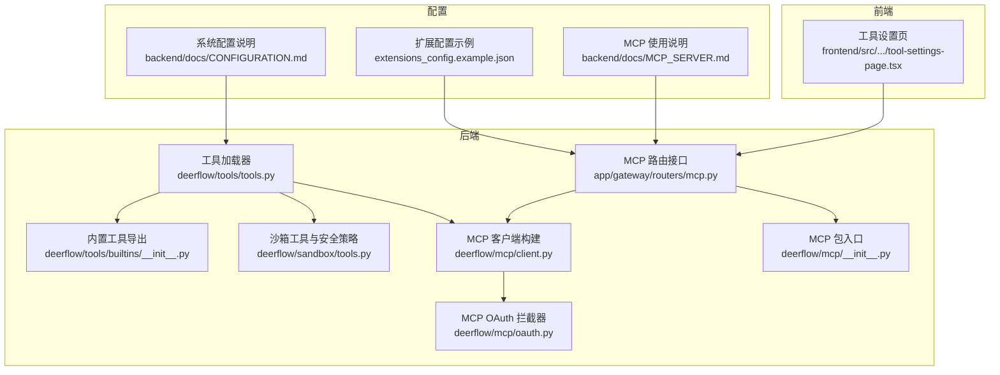
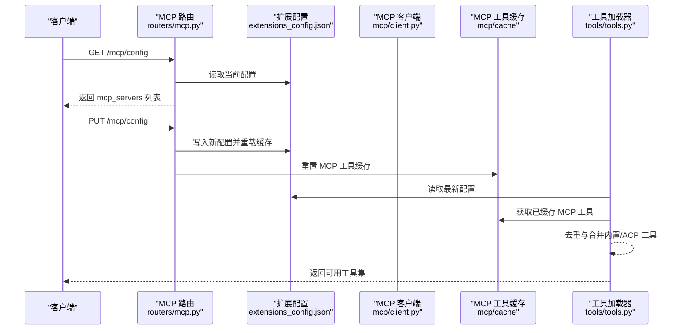
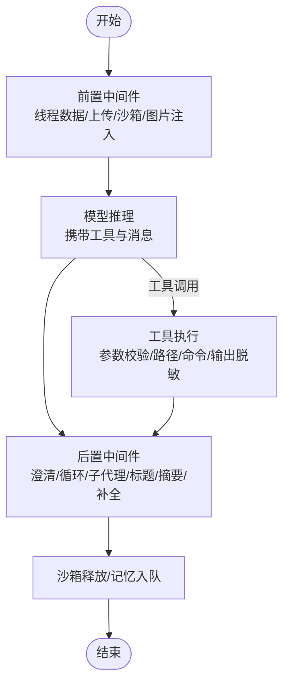
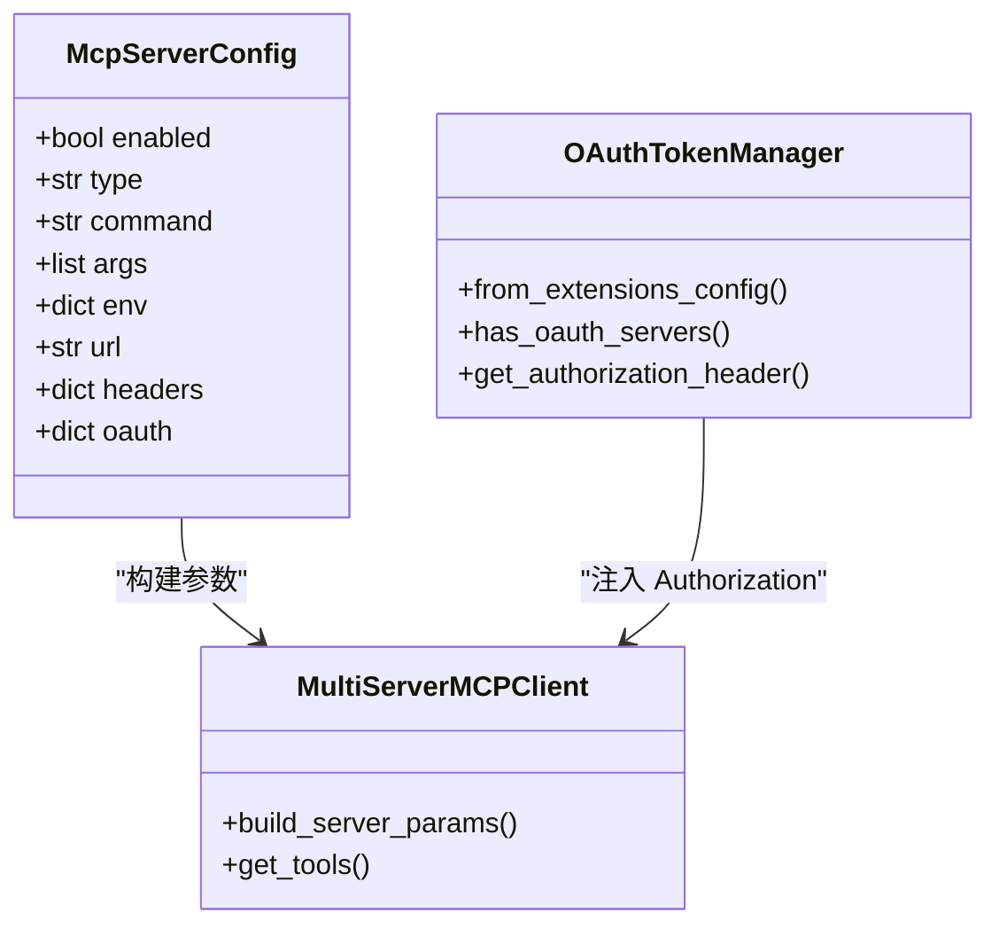
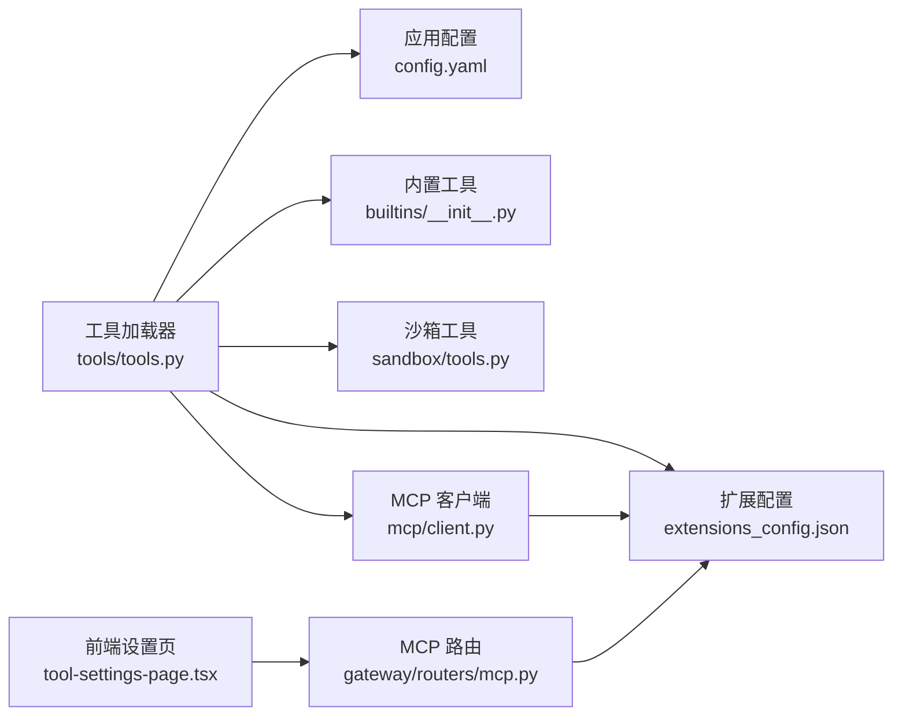

# 工具系统

<cite>
**本文引用的文件**
- [backend/packages/harness/deerflow/tools/tools.py](file://backend/packages/harness/deerflow/tools/tools.py)
- [backend/packages/harness/deerflow/tools/__init__.py](file://backend/packages/harness/deerflow/tools/__init__.py)
- [backend/packages/harness/deerflow/tools/builtins/__init__.py](file://backend/packages/harness/deerflow/tools/builtins/__init__.py)
- [backend/packages/harness/deerflow/sandbox/tools.py](file://backend/packages/harness/deerflow/sandbox/tools.py)
- [backend/app/gateway/routers/mcp.py](file://backend/app/gateway/routers/mcp.py)
- [backend/packages/harness/deerflow/mcp/client.py](file://backend/packages/harness/deerflow/mcp/client.py)
- [backend/packages/harness/deerflow/mcp/oauth.py](file://backend/packages/harness/deerflow/mcp/oauth.py)
- [backend/packages/harness/deerflow/mcp/__init__.py](file://backend/packages/harness/deerflow/mcp/__init__.py)
- [extensions_config.example.json](file://extensions_config.example.json)
- [backend/docs/MCP_SERVER.md](file://backend/docs/MCP_SERVER.md)
- [backend/docs/CONFIGURATION.md](file://backend/docs/CONFIGURATION.md)
- [backend/docs/middleware-execution-flow.md](file://backend/docs/middleware-execution-flow.md)
- [backend/docs/task_tool_improvements.md](file://backend/docs/task_tool_improvements.md)
- [backend/tests/test_mcp_client_config.py](file://backend/tests/test_mcp_client_config.py)
- [backend/tests/test_mcp_oauth.py](file://backend/tests/test_mcp_oauth.py)
- [backend/tests/test_guardrail_middleware.py](file://backend/tests/test_guardrail_middleware.py)
- [scripts/tool-error-degradation-detection.sh](file://scripts/tool-error-degradation-detection.sh)
- [frontend/src/components/workspace/settings/tool-settings-page.tsx](file://frontend/src/components/workspace/settings/tool-settings-page.tsx)
</cite>

## 目录
1. [简介](#简介)
2. [项目结构](#项目结构)
3. [核心组件](#核心组件)
4. [架构总览](#架构总览)
5. [详细组件分析](#详细组件分析)
6. [依赖分析](#依赖分析)
7. [性能考虑](#性能考虑)
8. [故障排除指南](#故障排除指南)
9. [结论](#结论)
10. [附录](#附录)

## 简介
本文件面向 DeerFlow 工具系统，系统性阐述三层工具分类与特性：内置工具、配置工具与 MCP 工具；详解工具注册机制、工具执行流程与参数校验；深入解析 MCP（Model Context Protocol）集成，包括多服务器客户端、传输协议支持与外部工具集成；并提供工具开发指南、最佳实践与性能优化建议，以及工具配置示例与故障排除方法。

## 项目结构
工具系统主要分布在后端包 deerflow 的 tools 与 mcp 子模块，并通过网关路由暴露 MCP 配置管理接口，前端提供设置页面展示与启用 MCP 服务器。

**图表来源**
- [backend/packages/harness/deerflow/tools/tools.py:36-176](file://backend/packages/harness/deerflow/tools/tools.py#L36-L176)
- [backend/packages/harness/deerflow/tools/builtins/__init__.py:1-16](file://backend/packages/harness/deerflow/tools/builtins/__init__.py#L1-L16)
- [backend/packages/harness/deerflow/sandbox/tools.py:1-800](file://backend/packages/harness/deerflow/sandbox/tools.py#L1-L800)
- [backend/packages/harness/deerflow/mcp/client.py:1-42](file://backend/packages/harness/deerflow/mcp/client.py#L1-L42)
- [backend/packages/harness/deerflow/mcp/oauth.py:110-137](file://backend/packages/harness/deerflow/mcp/oauth.py#L110-L137)
- [backend/packages/harness/deerflow/mcp/__init__.py:1-14](file://backend/packages/harness/deerflow/mcp/__init__.py#L1-L14)
- [backend/app/gateway/routers/mcp.py:57-138](file://backend/app/gateway/routers/mcp.py#L57-L138)
- [extensions_config.example.json:1-45](file://extensions_config.example.json#L1-L45)
- [backend/docs/MCP_SERVER.md:1-100](file://backend/docs/MCP_SERVER.md#L1-L100)
- [backend/docs/CONFIGURATION.md:181-202](file://backend/docs/CONFIGURATION.md#L181-L202)
- [frontend/src/components/workspace/settings/tool-settings-page.tsx:1-35](file://frontend/src/components/workspace/settings/tool-settings-page.tsx#L1-L35)

**章节来源**
- [backend/packages/harness/deerflow/tools/tools.py:36-176](file://backend/packages/harness/deerflow/tools/tools.py#L36-L176)
- [backend/app/gateway/routers/mcp.py:57-138](file://backend/app/gateway/routers/mcp.py#L57-L138)
- [extensions_config.example.json:1-45](file://extensions_config.example.json#L1-L45)

## 核心组件
- 工具加载器：从应用配置中解析工具清单，动态实例化工具对象，过滤重复名称，按需注入内置工具、MCP 工具与 ACP 工具。
- 内置工具：如任务工具、澄清工具、文件呈现工具、图像查看工具等，按运行时条件（模型能力、子代理开关、技能演进开关）选择性加入。
- 沙箱工具与安全策略：统一处理本地沙箱路径映射、权限校验、命令执行限制与输出脱敏，保障工具在受限环境下的安全使用。
- MCP 工具链：通过多服务器客户端连接本地或远端 MCP 服务器，自动发现并缓存工具，支持 OAuth 注入与拦截器扩展。
- 网关路由：提供 MCP 配置查询与更新接口，持久化到扩展配置文件，触发工具缓存重置以生效新配置。
- 前端设置页：展示 MCP 服务器列表，支持启用/禁用与交互式配置。

**章节来源**
- [backend/packages/harness/deerflow/tools/tools.py:36-176](file://backend/packages/harness/deerflow/tools/tools.py#L36-L176)
- [backend/packages/harness/deerflow/tools/builtins/__init__.py:1-16](file://backend/packages/harness/deerflow/tools/builtins/__init__.py#L1-L16)
- [backend/packages/harness/deerflow/sandbox/tools.py:576-637](file://backend/packages/harness/deerflow/sandbox/tools.py#L576-L637)
- [backend/packages/harness/deerflow/mcp/client.py:11-42](file://backend/packages/harness/deerflow/mcp/client.py#L11-L42)
- [backend/app/gateway/routers/mcp.py:66-138](file://backend/app/gateway/routers/mcp.py#L66-L138)
- [frontend/src/components/workspace/settings/tool-settings-page.tsx:18-35](file://frontend/src/components/workspace/settings/tool-settings-page.tsx#L18-L35)

## 架构总览
工具系统采用“配置驱动 + 运行时装配”的架构。应用启动时读取配置，动态解析工具类路径并实例化；MCP 工具在首次需要时初始化并缓存；中间件链在每次对话中串联执行，确保工具调用前后的上下文一致性与安全性。

**图表来源**
- [backend/app/gateway/routers/mcp.py:66-138](file://backend/app/gateway/routers/mcp.py#L66-L138)
- [backend/packages/harness/deerflow/mcp/client.py:11-42](file://backend/packages/harness/deerflow/mcp/client.py#L11-L42)
- [backend/packages/harness/deerflow/tools/tools.py:105-140](file://backend/packages/harness/deerflow/tools/tools.py#L105-L140)

## 详细组件分析

### 三层工具分类与特点
- 内置工具
  - 特点：随应用启动即加载，按运行时条件动态注入；例如任务工具、澄清工具、文件呈现工具、图像查看工具；当启用技能演进时追加技能管理工具；当启用子代理时追加任务状态相关工具。
  - 关键逻辑：在工具加载器中根据配置与模型能力决定是否加入视图图像工具；对工具名进行一致性校验，避免 LLM 与运行时绑定不一致导致的错误。
- 配置工具
  - 特点：来源于 config.yaml 中的 tools 列表，通过 use 字段指定类路径，动态解析为 BaseTool 实例；支持按组过滤与去重优先级控制。
  - 关键逻辑：加载器会警告配置 name 与工具对象 .name 不一致的情况；最终按“配置加载工具 > 内置工具 > MCP 工具 > ACP 工具”顺序去重。
- MCP 工具
  - 特点：来自扩展配置中的 mcpServers，支持 stdio、http、sse 传输；可配置 OAuth；可通过拦截器注入请求头；工具自动发现并缓存，变更配置后重置缓存以即时生效。
  - 关键逻辑：客户端根据服务器类型构建参数（stdio 需 command，http/sse 需 url），OAuth 拦截器按服务器配置自动注入 Authorization 头。

**章节来源**
- [backend/packages/harness/deerflow/tools/tools.py:36-176](file://backend/packages/harness/deerflow/tools/tools.py#L36-L176)
- [backend/packages/harness/deerflow/tools/builtins/__init__.py:1-16](file://backend/packages/harness/deerflow/tools/builtins/__init__.py#L1-L16)
- [backend/packages/harness/deerflow/mcp/client.py:11-42](file://backend/packages/harness/deerflow/mcp/client.py#L11-L42)
- [backend/docs/MCP_SERVER.md:17-82](file://backend/docs/MCP_SERVER.md#L17-L82)

### 工具注册机制
- 解析与实例化：工具加载器遍历配置中的工具条目，通过反射解析 use 字段为工具类，实例化为 BaseTool。
- 条件注入：内置工具按运行时参数注入；视图图像工具仅在模型支持视觉时注入；子代理工具仅在启用时注入；技能演进开关控制技能管理工具是否加入。
- 去重与优先级：先配置加载工具，再内置工具，再 MCP 工具，最后 ACP 工具，遇到同名工具跳过并记录告警。
- MCP 工具缓存：首次加载时从扩展配置读取启用的服务器，构建客户端并缓存工具；变更配置后重置缓存以生效。

**章节来源**
- [backend/packages/harness/deerflow/tools/tools.py:36-176](file://backend/packages/harness/deerflow/tools/tools.py#L36-L176)
- [backend/packages/harness/deerflow/mcp/__init__.py:1-14](file://backend/packages/harness/deerflow/mcp/__init__.py#L1-L14)

### 工具执行流程与参数校验
- 执行流程（概念时序）
  - 前置中间件：线程数据准备、上传扫描、沙箱获取、图片注入。
  - 模型推理：携带工具与消息上下文。
  - 后置中间件：澄清拦截、循环检测、子代理限制、标题生成、摘要压缩、悬挂工具消息补全、沙箱释放、记忆入队。
- 参数校验与安全
  - 路径与命令：本地沙箱严格限制路径访问，拒绝越界与危险命令；对绝对路径、URL、重定向操作符进行识别与拦截。
  - 输出脱敏：对本地沙箱输出中的宿主路径进行掩码，避免泄露真实文件系统布局。
  - 工具名一致性：若配置 name 与工具对象 .name 不一致，记录警告并以工具自身 .name 绑定，避免 LLM 与运行时名称不一致导致的调用失败。

**图表来源**
- [backend/docs/middleware-execution-flow.md:77-154](file://backend/docs/middleware-execution-flow.md#L77-L154)
- [backend/packages/harness/deerflow/sandbox/tools.py:576-637](file://backend/packages/harness/deerflow/sandbox/tools.py#L576-L637)

**章节来源**
- [backend/docs/middleware-execution-flow.md:77-154](file://backend/docs/middleware-execution-flow.md#L77-L154)
- [backend/packages/harness/deerflow/sandbox/tools.py:576-637](file://backend/packages/harness/deerflow/sandbox/tools.py#L576-L637)

### MCP 集成与多服务器客户端
- 多服务器客户端：支持 stdio、http、sse 三种传输；stdio 依赖 command/args/env；http/sse 依赖 url/headers；OAuth 支持 client_credentials 与 refresh_token。
- OAuth 注入：为 http/sse 服务器构建工具拦截器，自动从令牌管理器获取 Authorization 头并注入请求。
- 工具缓存：首次加载时发现并缓存工具；变更配置后重置缓存以立即生效。
- 网关接口：提供查询与更新 MCP 配置的 REST 接口，写入扩展配置文件并触发缓存重置。

**图表来源**
- [backend/app/gateway/routers/mcp.py:57-138](file://backend/app/gateway/routers/mcp.py#L57-L138)
- [backend/packages/harness/deerflow/mcp/client.py:11-42](file://backend/packages/harness/deerflow/mcp/client.py#L11-L42)
- [backend/packages/harness/deerflow/mcp/oauth.py:122-137](file://backend/packages/harness/deerflow/mcp/oauth.py#L122-L137)

**章节来源**
- [backend/app/gateway/routers/mcp.py:66-138](file://backend/app/gateway/routers/mcp.py#L66-L138)
- [backend/packages/harness/deerflow/mcp/client.py:11-42](file://backend/packages/harness/deerflow/mcp/client.py#L11-L42)
- [backend/packages/harness/deerflow/mcp/oauth.py:122-137](file://backend/packages/harness/deerflow/mcp/oauth.py#L122-L137)
- [backend/docs/MCP_SERVER.md:17-82](file://backend/docs/MCP_SERVER.md#L17-L82)

### 工具开发指南与最佳实践
- 工具命名一致性：确保配置中的 name 与工具对象的 .name 一致，避免 LLM 与运行时绑定不一致。
- 工具去重策略：同一名称的工具会被跳过并记录警告，应避免重复命名。
- 沙箱安全：在本地沙箱模式下，严格遵循路径白名单与只读策略；对用户输入的路径进行越界检查与脱敏输出。
- MCP 工具：为 http/sse 服务器配置 OAuth 时，确保令牌管理器正确初始化；必要时通过拦截器注入额外请求头。
- 配置优先级：优先使用环境变量存放密钥；配置文件放置于项目根目录，或通过环境变量指定路径。

**章节来源**
- [backend/packages/harness/deerflow/tools/tools.py:67-78](file://backend/packages/harness/deerflow/tools/tools.py#L67-L78)
- [backend/packages/harness/deerflow/sandbox/tools.py:576-637](file://backend/packages/harness/deerflow/sandbox/tools.py#L576-L637)
- [backend/docs/CONFIGURATION.md:318-333](file://backend/docs/CONFIGURATION.md#L318-L333)

## 依赖分析
- 工具加载器依赖应用配置与扩展配置；MCP 工具加载依赖 MCP 客户端与缓存模块；沙箱工具依赖安全策略与路径映射。
- 网关路由依赖扩展配置文件与 MCP 客户端；前端设置页依赖路由提供的 MCP 配置数据。

**图表来源**
- [backend/packages/harness/deerflow/tools/tools.py:36-176](file://backend/packages/harness/deerflow/tools/tools.py#L36-L176)
- [backend/packages/harness/deerflow/mcp/client.py:11-42](file://backend/packages/harness/deerflow/mcp/client.py#L11-L42)
- [backend/app/gateway/routers/mcp.py:66-138](file://backend/app/gateway/routers/mcp.py#L66-L138)
- [frontend/src/components/workspace/settings/tool-settings-page.tsx:18-35](file://frontend/src/components/workspace/settings/tool-settings-page.tsx#L18-L35)

**章节来源**
- [backend/packages/harness/deerflow/tools/tools.py:36-176](file://backend/packages/harness/deerflow/tools/tools.py#L36-L176)
- [backend/app/gateway/routers/mcp.py:66-138](file://backend/app/gateway/routers/mcp.py#L66-L138)

## 性能考虑
- 工具加载去重：通过名称去重减少重复函数模式，降低 LLM 工具选择歧义与 Schema 合并与解析开销。
- MCP 工具缓存：首次加载后缓存工具，避免重复发现与初始化；配置变更时重置缓存，平衡实时性与性能。
- 子代理任务优化：后台异步执行并由工具层轮询等待完成，减少 LLM 侧轮询请求，降低 API 成本与延迟抖动。
- 线程池分离：调度线程池与执行线程池分离，避免嵌套线程池资源浪费，提升吞吐与稳定性。

**章节来源**
- [backend/docs/task_tool_improvements.md:104-138](file://backend/docs/task_tool_improvements.md#L104-L138)

## 故障排除指南
- MCP 配置更新未生效
  - 确认通过网关 PUT /mcp/config 更新配置并触发缓存重置；检查扩展配置文件写入成功。
  - 参考测试用例验证服务器参数构建与 OAuth 注入行为。
- 工具调用异常导致对话中断
  - 工具错误降级脚本验证：即使单个工具失败，后续工具结果仍被保留，对话不会中断。
  - 中间件链包含错误处理与降级逻辑，确保异常被转换为 ToolMessage 并继续流程。
- 工具名不一致导致调用失败
  - 加载器会记录警告并以工具对象 .name 作为绑定名称；请修正配置 name 或工具对象 .name。
- 沙箱路径越界或权限错误
  - 本地沙箱严格限制路径访问，仅允许 /mnt/user-data、/mnt/skills、/mnt/acp-workspace 与自定义挂载路径；只读挂载禁止写入。
  - 对输出进行脱敏，避免泄露宿主路径。

**章节来源**
- [backend/app/gateway/routers/mcp.py:98-138](file://backend/app/gateway/routers/mcp.py#L98-L138)
- [backend/tests/test_mcp_client_config.py:9-48](file://backend/tests/test_mcp_client_config.py#L9-L48)
- [backend/tests/test_mcp_oauth.py:86-127](file://backend/tests/test_mcp_oauth.py#L86-L127)
- [scripts/tool-error-degradation-detection.sh:122-218](file://scripts/tool-error-degradation-detection.sh#L122-L218)
- [backend/packages/harness/deerflow/tools/tools.py:67-78](file://backend/packages/harness/deerflow/tools/tools.py#L67-L78)
- [backend/packages/harness/deerflow/sandbox/tools.py:576-637](file://backend/packages/harness/deerflow/sandbox/tools.py#L576-L637)

## 结论
DeerFlow 工具系统通过“配置驱动 + 运行时装配 + 安全中间件”的设计，实现了内置工具、配置工具与 MCP 工具的统一管理与高效执行。MCP 集成提供了灵活的多服务器客户端与 OAuth 支持，结合缓存与拦截器扩展，满足复杂外部工具接入场景。通过严格的参数校验、路径安全与错误降级机制，系统在保证安全性的同时提升了稳定性与可维护性。

## 附录

### 工具配置示例
- 扩展配置示例（含 MCP 服务器与拦截器）
  - 示例字段：mcpInterceptors、mcpServers（stdio/http/sse）、OAuth 配置、环境变量注入。
  - 参考路径：[extensions_config.example.json:1-45](file://extensions_config.example.json#L1-L45)
- MCP 使用说明
  - OAuth 支持、拦截器注册、如何启用与示例能力。
  - 参考路径：[backend/docs/MCP_SERVER.md:17-82](file://backend/docs/MCP_SERVER.md#L17-L82)
- 系统配置要点
  - 工具组与工具条目、沙箱模式、环境变量与配置优先级。
  - 参考路径：[backend/docs/CONFIGURATION.md:169-202](file://backend/docs/CONFIGURATION.md#L169-L202)

**章节来源**
- [extensions_config.example.json:1-45](file://extensions_config.example.json#L1-L45)
- [backend/docs/MCP_SERVER.md:17-82](file://backend/docs/MCP_SERVER.md#L17-L82)
- [backend/docs/CONFIGURATION.md:169-202](file://backend/docs/CONFIGURATION.md#L169-L202)