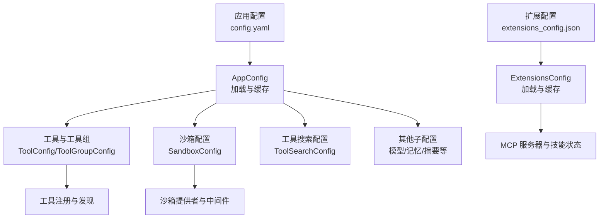
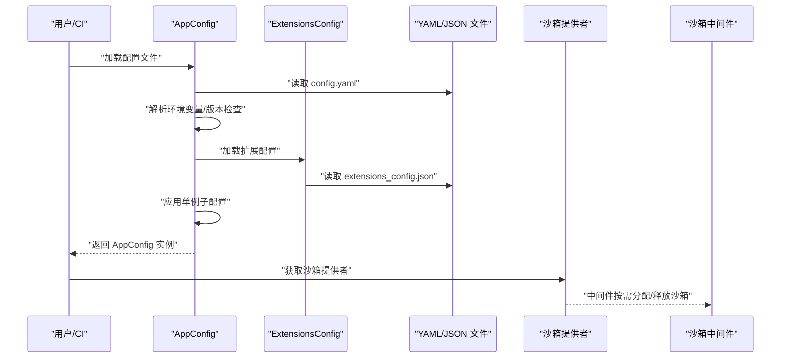
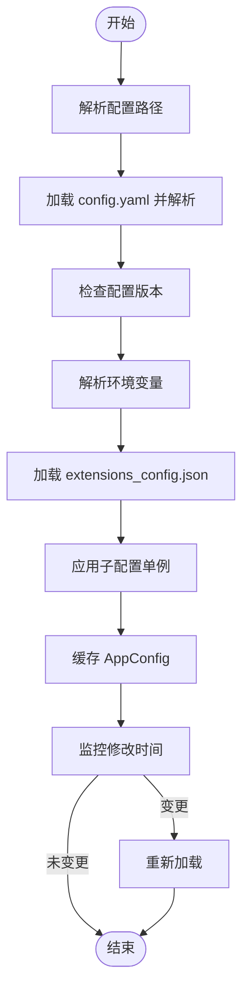
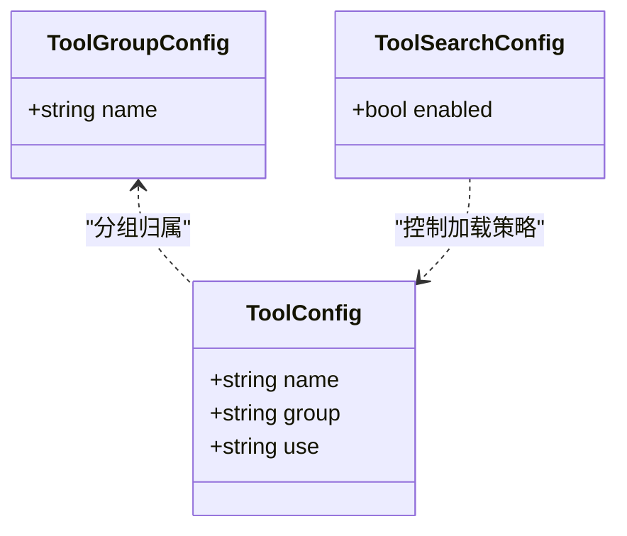
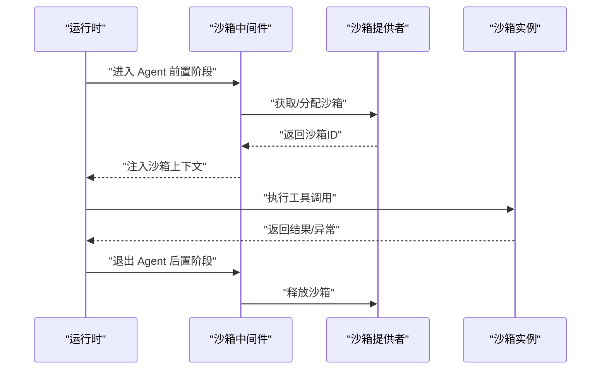
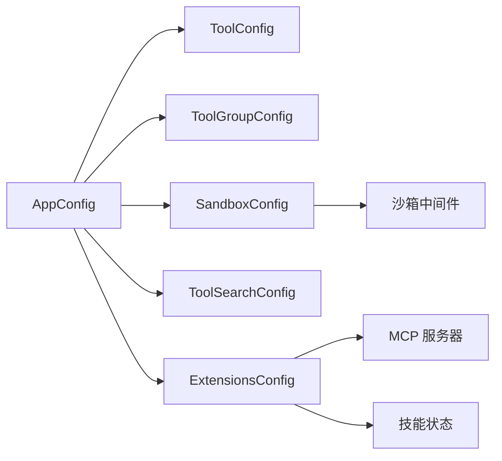

# 配置工具

<cite>
**本文档引用的文件**
- [config.example.yaml](file://config.example.yaml)
- [config.yaml](file://backend/config.yaml)
- [extensions_config.example.json](file://extensions_config.example.json)
- [tool_config.py](file://backend/packages/harness/deerflow/config/tool_config.py)
- [tool_search_config.py](file://backend/packages/harness/deerflow/config/tool_search_config.py)
- [app_config.py](file://backend/packages/harness/deerflow/config/app_config.py)
- [sandbox_config.py](file://backend/packages/harness/deerflow/config/sandbox_config.py)
- [extensions_config.py](file://backend/packages/harness/deerflow/config/extensions_config.py)
- [config-upgrade.sh](file://scripts/config-upgrade.sh)
- [test_acp_config.py](file://backend/tests/test_acp_config.py)
- [middleware.py](file://backend/packages/harness/deerflow/sandbox/middleware.py)
- [exceptions.py](file://backend/packages/harness/deerflow/sandbox/exceptions.py)
</cite>

## 目录
1. [简介](#简介)
2. [项目结构](#项目结构)
3. [核心组件](#核心组件)
4. [架构总览](#架构总览)
5. [详细组件分析](#详细组件分析)
6. [依赖关系分析](#依赖关系分析)
7. [性能考量](#性能考量)
8. [故障排查指南](#故障排查指南)
9. [结论](#结论)
10. [附录](#附录)

## 简介
本文件面向 DeerFlow 的“配置工具”体系，系统阐述以下内容：
- 配置工具的定义方式与参数结构
- 配置格式与加载机制、优先级与动态更新
- 各类工具的使用示例（文件操作、网络请求、系统命令）
- 配置验证、错误处理与调试技巧
- 配置工具与沙箱系统的集成与安全考虑

目标是帮助开发者与运维人员快速理解并正确使用 DeerFlow 的配置工具系统。

## 项目结构
配置工具系统主要由以下部分组成：
- 应用配置（YAML）：集中管理模型、工具、工具组、沙箱、技能、扩展等
- 扩展配置（JSON）：MCP 服务器与技能状态的统一入口
- 配置加载与缓存：支持热重载、环境变量解析、版本检查
- 工具与沙箱：通过配置驱动工具注册与沙箱提供者
- 中间件与异常：在运行期保障工具调用的安全与可观测性

图表来源
- [app_config.py:152-185](file://backend/packages/harness/deerflow/config/app_config.py#L152-L185)
- [extensions_config.py:124-149](file://backend/packages/harness/deerflow/config/extensions_config.py#L124-L149)
- [sandbox_config.py:12-83](file://backend/packages/harness/deerflow/config/sandbox_config.py#L12-L83)
- [tool_config.py:4-20](file://backend/packages/harness/deerflow/config/tool_config.py#L4-L20)
- [tool_search_config.py:6-35](file://backend/packages/harness/deerflow/config/tool_search_config.py#L6-L35)

章节来源
- [config.example.yaml:1-348](file://config.example.yaml#L1-L348)
- [config.yaml:1-348](file://backend/config.yaml#L1-L348)
- [extensions_config.example.json:1-45](file://extensions_config.example.json#L1-L45)
- [app_config.py:122-185](file://backend/packages/harness/deerflow/config/app_config.py#L122-L185)
- [extensions_config.py:71-149](file://backend/packages/harness/deerflow/config/extensions_config.py#L71-L149)

## 核心组件
- 应用配置（AppConfig）
  - 负责从 YAML 加载并校验配置，支持环境变量解析、版本检查、热重载
  - 将各子配置（模型、工具、沙箱、工具搜索、记忆、摘要等）聚合为单一入口
- 工具与工具组（ToolConfig/ToolGroupConfig）
  - 定义工具的唯一名称、所属组、提供者类路径等
- 沙箱配置（SandboxConfig）
  - 定义沙箱提供者、输出截断策略、卷挂载、环境变量注入等
- 工具搜索配置（ToolSearchConfig）
  - 控制是否延迟加载 MCP 工具，以及通过工具搜索在运行时发现工具
- 扩展配置（ExtensionsConfig）
  - 统一管理 MCP 服务器与技能状态，支持 JSON 加载与环境变量解析
- 配置升级脚本（config-upgrade.sh）
  - 基于示例配置进行字段合并与版本迁移

章节来源
- [app_config.py:91-121](file://backend/packages/harness/deerflow/config/app_config.py#L91-L121)
- [tool_config.py:4-20](file://backend/packages/harness/deerflow/config/tool_config.py#L4-L20)
- [sandbox_config.py:12-83](file://backend/packages/harness/deerflow/config/sandbox_config.py#L12-L83)
- [tool_search_config.py:6-35](file://backend/packages/harness/deerflow/config/tool_search_config.py#L6-L35)
- [extensions_config.py:57-69](file://backend/packages/harness/deerflow/config/extensions_config.py#L57-L69)
- [config-upgrade.sh:46-155](file://scripts/config-upgrade.sh#L46-L155)

## 架构总览
下图展示配置工具系统的关键交互：配置文件被加载为对象，随后驱动工具注册、沙箱提供者初始化与 MCP 扩展可用性。

图表来源
- [app_config.py:152-185](file://backend/packages/harness/deerflow/config/app_config.py#L152-L185)
- [extensions_config.py:124-149](file://backend/packages/harness/deerflow/config/extensions_config.py#L124-L149)
- [middleware.py:45-83](file://backend/packages/harness/deerflow/sandbox/middleware.py#L45-L83)

## 详细组件分析

### 配置定义与参数结构
- 应用配置（config.yaml）
  - 包含模型、工具组、工具、沙箱、技能、标题生成、摘要、记忆、数据库、运行事件、子代理等段落
  - 示例文件提供了完整字段注释与默认值参考
- 扩展配置（extensions_config.json）
  - 统一管理 MCP 服务器（命令/参数/环境/传输/OAuth）与技能状态
  - 示例文件展示了文件系统、GitHub、PostgreSQL 等服务器配置

章节来源
- [config.example.yaml:1-348](file://config.example.yaml#L1-L348)
- [extensions_config.example.json:1-45](file://extensions_config.example.json#L1-L45)

### 配置加载机制与优先级
- 配置文件解析顺序
  - 解析路径：显式参数 > 环境变量 > 项目根查找 > 兼容旧位置
  - 版本检查：比较用户配置与示例配置的版本号，提示升级
  - 环境变量解析：递归替换形如 $VAR 的占位符
  - 扩展配置：独立加载，支持 JSON 与环境变量解析
- 缓存与热重载
  - 单例缓存 + 修改时间检测，文件变更时自动重载
  - 支持强制重载与重置缓存

图表来源
- [app_config.py:122-185](file://backend/packages/harness/deerflow/config/app_config.py#L122-L185)
- [app_config.py:357-398](file://backend/packages/harness/deerflow/config/app_config.py#L357-L398)

章节来源
- [app_config.py:122-185](file://backend/packages/harness/deerflow/config/app_config.py#L122-L185)
- [app_config.py:357-467](file://backend/packages/harness/deerflow/config/app_config.py#L357-L467)
- [extensions_config.py:71-149](file://backend/packages/harness/deerflow/config/extensions_config.py#L71-L149)

### 动态更新与热重载
- get_app_config 在每次访问时检查文件修改时间，必要时触发重载
- reload_app_config 可手动触发重载
- reset_app_config 清除缓存，强制下次访问重新加载
- 扩展配置同样支持独立的重载与重置

章节来源
- [app_config.py:369-467](file://backend/packages/harness/deerflow/config/app_config.py#L369-L467)
- [extensions_config.py:225-264](file://backend/packages/harness/deerflow/config/extensions_config.py#L225-L264)

### 工具配置与使用示例
- 工具定义
  - 工具组：用于分类组织工具（如 file:read、file:write、bash）
  - 工具：name/group/use 三要素，use 指向具体工具提供者
- 示例工具
  - 文件读取：ls、read_file
  - 文件写入：write_file、str_replace
  - 系统命令：bash
  - 知识检索：knowledge_search、tencent_ima
- 工具搜索
  - 通过 tool_search.enabled 控制是否延迟加载 MCP 工具并在运行时发现

图表来源
- [tool_config.py:4-20](file://backend/packages/harness/deerflow/config/tool_config.py#L4-L20)
- [tool_search_config.py:6-35](file://backend/packages/harness/deerflow/config/tool_search_config.py#L6-L35)

章节来源
- [config.example.yaml:118-176](file://config.example.yaml#L118-L176)
- [config.yaml:118-176](file://backend/config.yaml#L118-L176)
- [tool_config.py:4-20](file://backend/packages/harness/deerflow/config/tool_config.py#L4-L20)
- [tool_search_config.py:6-35](file://backend/packages/harness/deerflow/config/tool_search_config.py#L6-L35)

### 沙箱系统集成与安全
- 沙箱配置
  - use：指定沙箱提供者类路径
  - 输出截断：bash/read_file/ls 的最大输出字符数，防止日志膨胀
  - 卷挂载与环境变量：容器内挂载与注入
  - 主机命令开关：LocalSandboxProvider 下的危险选项
- 中间件
  - 支持惰性/急切两种沙箱获取策略
  - 生命周期：before_agent 分配、after_agent 释放
- 异常体系
  - 结构化错误信息，便于定位命令、文件操作失败原因

图表来源
- [middleware.py:45-83](file://backend/packages/harness/deerflow/sandbox/middleware.py#L45-L83)
- [sandbox_config.py:12-83](file://backend/packages/harness/deerflow/config/sandbox_config.py#L12-L83)
- [exceptions.py:4-71](file://backend/packages/harness/deerflow/sandbox/exceptions.py#L4-L71)

章节来源
- [sandbox_config.py:12-83](file://backend/packages/harness/deerflow/config/sandbox_config.py#L12-L83)
- [middleware.py:32-83](file://backend/packages/harness/deerflow/sandbox/middleware.py#L32-L83)
- [exceptions.py:4-71](file://backend/packages/harness/deerflow/sandbox/exceptions.py#L4-L71)

### 扩展配置（MCP 服务器与技能）
- MCP 服务器
  - 支持 stdio/sse/http 三种传输
  - 命令/参数/环境变量/URL/Headers/OAuth 等
- 技能状态
  - 按技能名控制启用/禁用
- 环境变量解析
  - 对字符串类型的值进行 $VAR 替换，缺失时置为空字符串

章节来源
- [extensions_config.py:36-69](file://backend/packages/harness/deerflow/config/extensions_config.py#L36-L69)
- [extensions_config.py:151-180](file://backend/packages/harness/deerflow/config/extensions_config.py#L151-L180)
- [extensions_config.example.json:1-45](file://extensions_config.example.json#L1-L45)

### 配置升级与兼容性
- 升级脚本
  - 读取用户配置与示例配置，进行字段合并与版本提升
  - 备份原配置，打印新增字段清单
- 测试用例
  - 验证无 ACP 配置时重载可清空历史状态
  - 验证 ACP 配置存在/缺失/None 的行为

章节来源
- [config-upgrade.sh:46-155](file://scripts/config-upgrade.sh#L46-L155)
- [test_acp_config.py:124-165](file://backend/tests/test_acp_config.py#L124-L165)

## 依赖关系分析
- 配置层
  - AppConfig 依赖各子配置模块（模型、工具、沙箱、工具搜索、记忆、摘要、守卫等）
  - ExtensionsConfig 独立于主配置，但被 AppConfig 在加载时合并
- 运行层
  - 沙箱中间件依赖沙箱提供者，受 AppConfig 的沙箱配置驱动
  - 工具通过配置的 use 字段指向具体实现，遵循统一的提供者接口

图表来源
- [app_config.py:91-121](file://backend/packages/harness/deerflow/config/app_config.py#L91-L121)
- [extensions_config.py:57-69](file://backend/packages/harness/deerflow/config/extensions_config.py#L57-L69)
- [sandbox_config.py:12-83](file://backend/packages/harness/deerflow/config/sandbox_config.py#L12-L83)
- [middleware.py:45-83](file://backend/packages/harness/deerflow/sandbox/middleware.py#L45-L83)

章节来源
- [app_config.py:91-121](file://backend/packages/harness/deerflow/config/app_config.py#L91-L121)
- [extensions_config.py:57-69](file://backend/packages/harness/deerflow/config/extensions_config.py#L57-L69)

## 性能考量
- 输出截断
  - bash/read_file/ls 的输出截断策略可显著降低日志体积与内存占用
- 惰性获取沙箱
  - 默认惰性初始化可减少不必要的资源占用；如需预热可调整中间件策略
- 热重载开销
  - 文件监控与解析仅在变更时触发，日常运行几乎无额外开销

## 故障排查指南
- 配置版本不匹配
  - 现象：日志警告提示版本落后
  - 处理：运行配置升级脚本，合并新字段并更新版本号
- 环境变量未解析
  - 现象：$VAR 显示为原始字符串
  - 处理：确认环境变量已设置；对于扩展配置，缺失的变量会被置为空字符串
- 沙箱命令失败
  - 现象：SandboxCommandError，携带命令与退出码
  - 处理：检查命令权限、路径与参数；必要时放宽输出截断或调整主机命令开关
- 文件操作异常
  - 现象：SandboxFileError/SandboxPermissionError/SandboxFileNotFoundError
  - 处理：确认路径存在、权限正确、挂载卷有效
- ACP 配置重载
  - 现象：移除 ACP 配置后仍保留历史代理
  - 处理：确保重新加载配置并清空历史状态

章节来源
- [app_config.py:234-278](file://backend/packages/harness/deerflow/config/app_config.py#L234-L278)
- [config-upgrade.sh:46-155](file://scripts/config-upgrade.sh#L46-L155)
- [exceptions.py:34-71](file://backend/packages/harness/deerflow/sandbox/exceptions.py#L34-L71)
- [test_acp_config.py:124-165](file://backend/tests/test_acp_config.py#L124-L165)

## 结论
 DeerFlow 的配置工具系统以清晰的 YAML/JSON 结构与严格的加载/校验流程为基础，结合热重载、环境变量解析与版本检查，实现了灵活且可靠的工具与沙箱配置管理。通过工具搜索、扩展配置与沙箱中间件的协同，系统在保证安全性的同时提供了强大的可扩展能力。建议在生产环境中：
- 使用示例配置作为基线，定期运行升级脚本
- 明确输出截断策略与沙箱权限边界
- 利用热重载在不重启服务的情况下平滑更新配置

## 附录
- 快速参考
  - 工具组与工具：参见配置文件中的对应段落
  - 沙箱输出截断：参见沙箱配置字段
  - MCP 服务器：参见扩展配置示例
  - 环境变量：参见配置加载与解析逻辑