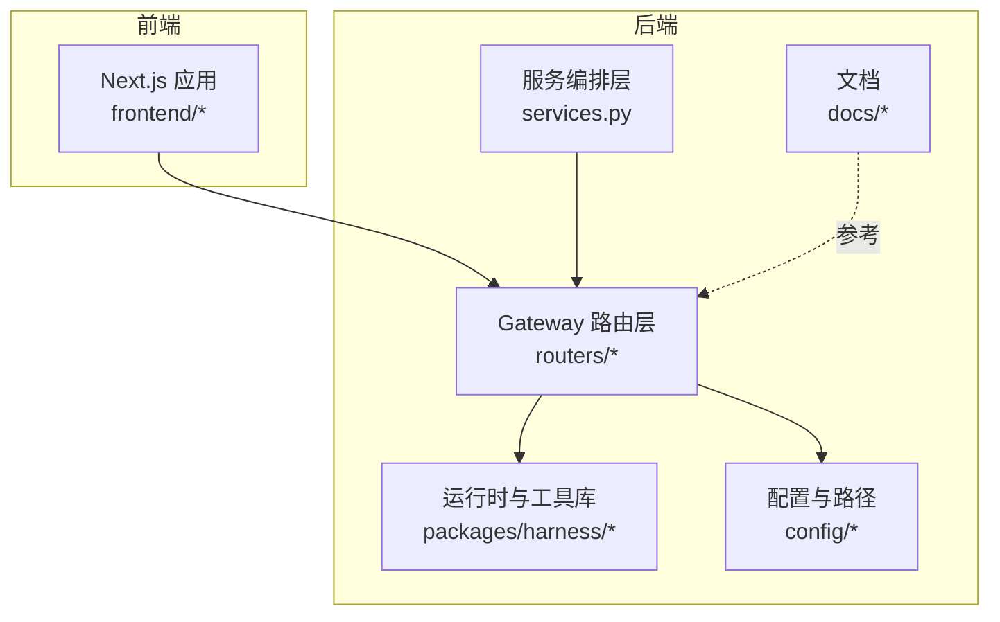
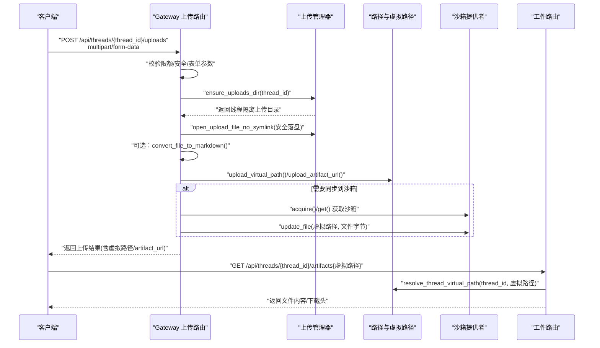
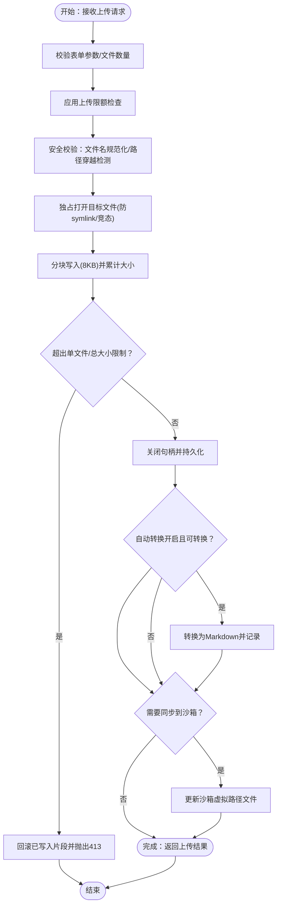
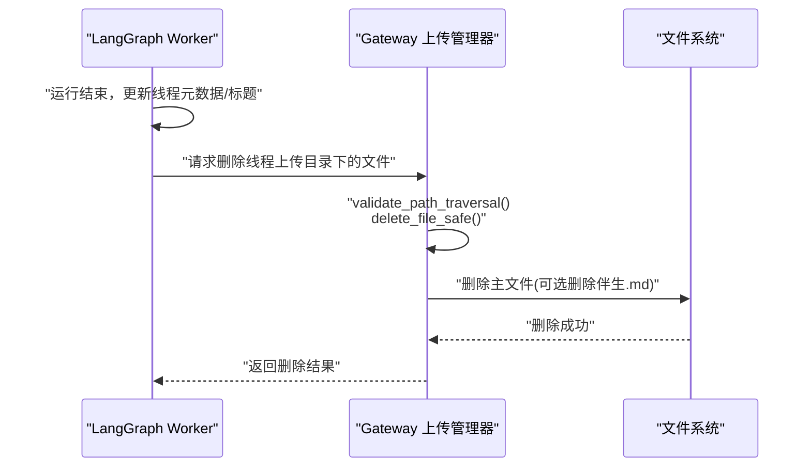
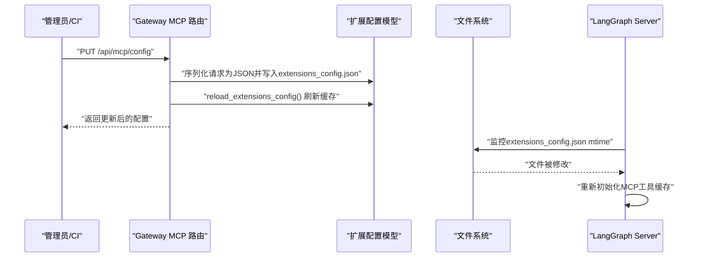
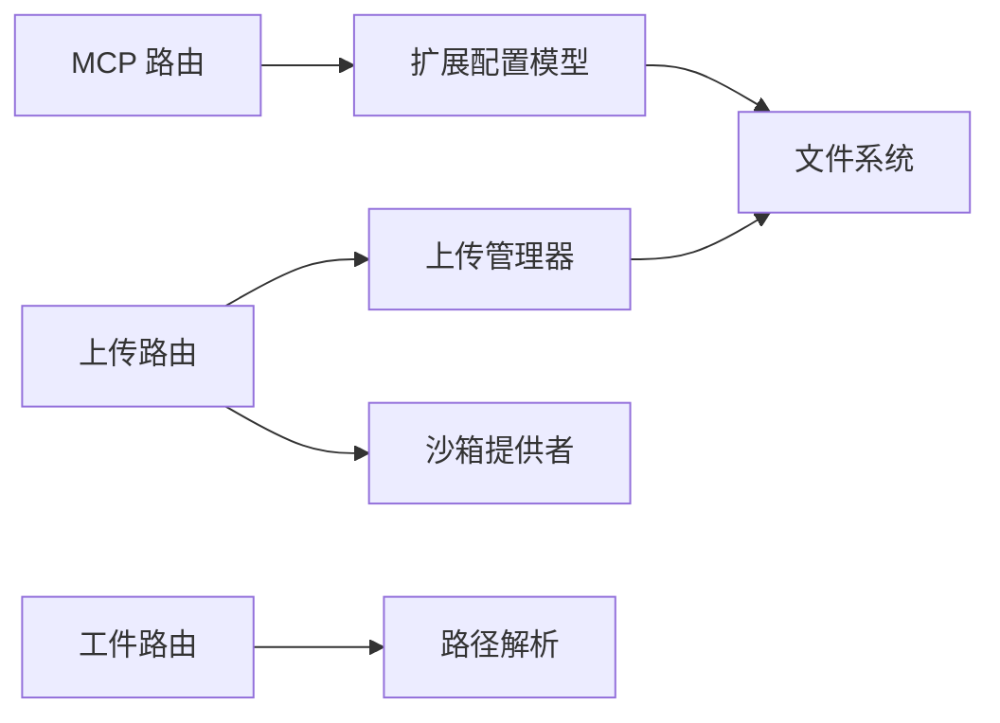

# 数据流设计

<cite>
**本文引用的文件**
- [文件上传功能](file://backend/docs/FILE_UPLOAD.md)
- [MCP 配置指南](file://backend/docs/MCP_SERVER.md)
- [上传路由实现](file://backend/app/gateway/routers/uploads.py)
- [MCP 路由实现](file://backend/app/gateway/routers/mcp.py)
- [工件访问路由实现](file://backend/app/gateway/routers/artifacts.py)
- [上传管理器](file://backend/packages/harness/deerflow/uploads/manager.py)
- [沙箱提供者抽象](file://backend/packages/harness/deerflow/sandbox/sandbox_provider.py)
- [扩展配置模型与加载](file://backend/packages/harness/deerflow/config/extensions_config.py)
- [扩展配置样例](file://extensions_config.json)
- [配置指南](file://backend/docs/CONFIGURATION.md)
- [OSS 上传工具](file://backend/deerflow/utils/oss_upload.py)
</cite>

## 目录
1. [引言](#引言)
2. [项目结构](#项目结构)
3. [核心组件](#核心组件)
4. [架构总览](#架构总览)
5. [详细组件分析](#详细组件分析)
6. [依赖分析](#依赖分析)
7. [性能考虑](#性能考虑)
8. [故障排查指南](#故障排查指南)
9. [结论](#结论)
10. [附录](#附录)

## 引言
本技术文档围绕 DeerFlow 的数据流设计，系统阐述三类关键数据流：
- 文件上传数据流：从客户端上传、Gateway 接收、文件落盘与可选文档转换、虚拟路径映射与前端访问的完整链路。
- 线程清理数据流：LangGraph 运行生命周期结束时，如何协调清理线程隔离目录与 Gateway 文件系统中的上传资源。
- 配置热重载数据流：MCP 配置更新、文件监控与工具重新加载的流程。

同时，文档提供数据验证、错误处理与性能优化的具体实现要点，并辅以数据流图与状态转换图，帮助读者快速理解与落地。

## 项目结构
本项目采用“后端服务 + 前端应用”的分层组织，其中与数据流密切相关的模块集中在 backend 子树：
- app/gateway：FastAPI 网关层，负责路由、鉴权、中间件与业务编排。
- packages/harness：运行时与工具库，包含上传管理、沙箱抽象、扩展配置等。
- deerflow/utils：通用工具，如 OSS 上传。
- docs：面向用户的文档，涵盖文件上传、MCP 配置、配置指南等。

**章节来源**
- [文件上传功能:1-315](file://backend/docs/FILE_UPLOAD.md#L1-L315)
- [MCP 配置指南:1-100](file://backend/docs/MCP_SERVER.md#L1-L100)

## 核心组件
- 上传路由与中间件
  - 上传路由负责接收 multipart/form-data，执行限额校验、安全校验、落盘与可选转换，并将结果映射为虚拟路径与 artifact URL。
  - 上传管理器提供安全的文件名规范化、路径穿越检测、唯一文件名生成、目录创建与文件删除等纯业务逻辑。
  - 工件路由负责根据虚拟路径解析到线程隔离的真实文件路径，提供下载与内联展示能力。
- 沙箱提供者
  - 抽象了不同执行环境（本地/容器/K8s）的沙箱生命周期与挂载策略，影响上传文件是否需要同步到沙箱虚拟路径。
- 扩展配置与 MCP
  - 扩展配置模型统一管理 MCP 服务器与技能状态，支持从文件热加载与缓存复用。
  - MCP 路由提供配置查询与更新接口，更新后由 LangGraph Server 通过文件时间戳感知并触发工具重新初始化。
- OSS 上传工具
  - 提供异步上传至阿里云 OSS 的封装，含配置校验、错误处理与 URL 生成。

**章节来源**
- [上传路由实现:1-343](file://backend/app/gateway/routers/uploads.py#L1-L343)
- [上传管理器:1-311](file://backend/packages/harness/deerflow/uploads/manager.py#L1-L311)
- [工件访问路由实现:1-184](file://backend/app/gateway/routers/artifacts.py#L1-L184)
- [沙箱提供者抽象:1-110](file://backend/packages/harness/deerflow/sandbox/sandbox_provider.py#L1-L110)
- [扩展配置模型与加载:1-264](file://backend/packages/harness/deerflow/config/extensions_config.py#L1-L264)
- [OSS 上传工具:1-82](file://backend/deerflow/utils/oss_upload.py#L1-L82)

## 架构总览
下图展示了文件上传与虚拟路径映射的关键交互：

**图表来源**
- [上传路由实现:170-294](file://backend/app/gateway/routers/uploads.py#L170-L294)
- [上传管理器:40-311](file://backend/packages/harness/deerflow/uploads/manager.py#L40-L311)
- [工件访问路由实现:80-184](file://backend/app/gateway/routers/artifacts.py#L80-L184)
- [沙箱提供者抽象:13-39](file://backend/packages/harness/deerflow/sandbox/sandbox_provider.py#L13-L39)

**章节来源**
- [文件上传功能:17-158](file://backend/docs/FILE_UPLOAD.md#L17-L158)
- [上传路由实现:170-294](file://backend/app/gateway/routers/uploads.py#L170-L294)

## 详细组件分析

### 文件上传数据流
- 客户端上传
  - 使用 multipart/form-data，支持多文件同时上传；后端对文件数量、单文件大小与总大小进行严格限制，并在超限时返回 413。
- Gateway 接收与安全校验
  - 对 thread_id 进行字符集校验，拒绝不安全字符。
  - 对每个文件名执行规范化与路径穿越检测，拒绝空名、反斜杠与过长文件名。
  - 使用独占打开策略写入，避免符号链接覆盖与竞态条件。
- 文档转换与虚拟路径映射
  - 当开启自动转换且文件扩展名在可转换集合内时，生成同名 .md 并同步到沙箱虚拟路径。
  - 返回字段包含：实际存储路径、虚拟路径、artifact_url，便于前端直链访问。
- 前端访问
  - 工件路由根据虚拟路径解析到线程隔离的真实文件路径，区分文本/二进制/活动内容（HTML/XHTML/SVG）的展示策略。

**图表来源**
- [上传路由实现:123-152](file://backend/app/gateway/routers/uploads.py#L123-L152)
- [上传路由实现:223-230](file://backend/app/gateway/routers/uploads.py#L223-L230)
- [上传管理器:118-209](file://backend/packages/harness/deerflow/uploads/manager.py#L118-L209)

**章节来源**
- [文件上传功能:17-158](file://backend/docs/FILE_UPLOAD.md#L17-L158)
- [上传路由实现:170-294](file://backend/app/gateway/routers/uploads.py#L170-L294)
- [上传管理器:40-311](file://backend/packages/harness/deerflow/uploads/manager.py#L40-L311)

### 线程清理数据流（LangGraph 删除与 Gateway 文件系统清理）
- LangGraph 生命周期
  - 运行结束后，Worker 在 finally 块中根据检查点生成标题并更新线程元数据，随后释放相关资源。
- Gateway 文件系统清理
  - 上传管理器提供安全删除函数，支持删除主文件及与其同名的 Markdown 伴生文件（当扩展名匹配可转换集合时）。
  - 删除前进行路径穿越检测，确保仅在允许的线程上传目录内操作。
- 协调机制
  - 线程隔离目录由路径模块统一管理，LangGraph 侧负责线程元数据与状态更新，Gateway 侧负责物理文件的删除与权限一致性维护。

**图表来源**
- [上传管理器:253-284](file://backend/packages/harness/deerflow/uploads/manager.py#L253-L284)

**章节来源**
- [上传管理器:253-284](file://backend/packages/harness/deerflow/uploads/manager.py#L253-L284)

### 配置热重载数据流（MCP 配置更新、文件监控与工具重新加载）
- 配置更新流程
  - 通过 PUT /api/mcp/config 更新 extensions_config.json，保存新配置并刷新全局缓存。
  - LangGraph Server 通过监听文件修改时间（mtime）变化，自动触发 MCP 工具重新初始化。
- OAuth 与拦截器
  - 支持 client_credentials 与 refresh_token 两种授权模式，拦截器可在每次工具调用前注入动态请求头（如用户认证令牌）。
- 配置定位与环境变量解析
  - 支持多种配置文件定位策略（参数、环境变量、项目根、后端目录），并递归解析 $VAR 形式的环境变量占位符。

**图表来源**
- [MCP 路由实现:104-169](file://backend/app/gateway/routers/mcp.py#L104-L169)
- [扩展配置模型与加载:225-241](file://backend/packages/harness/deerflow/config/extensions_config.py#L225-L241)

**章节来源**
- [MCP 配置指南:1-100](file://backend/docs/MCP_SERVER.md#L1-L100)
- [MCP 路由实现:66-169](file://backend/app/gateway/routers/mcp.py#L66-L169)
- [扩展配置样例:1-44](file://extensions_config.json#L1-L44)
- [扩展配置模型与加载:71-123](file://backend/packages/harness/deerflow/config/extensions_config.py#L71-L123)

### 数据验证、错误处理与性能优化
- 数据验证
  - thread_id 字符集白名单校验，拒绝危险字符。
  - 文件名规范化与路径穿越检测，拒绝空名、反斜杠与过长文件名。
  - 写入阶段使用独占打开与二次 stat 校验，防止符号链接与硬链接破坏。
- 错误处理
  - 413：单文件/总大小超限；400：无效路径/线程ID；404：文件不存在；500：内部异常（含清理失败警告）。
  - 删除失败时记录警告并返回错误，确保幂等性与可观测性。
- 性能优化
  - 分块写入（8KB）降低内存峰值与阻塞风险。
  - 转换与沙箱同步按需执行，避免不必要的 IO。
  - 工件路由对活动内容强制下载，减少 XSS 风险与渲染开销。
  - OSS 上传封装支持二进制流与内容类型设置，便于音视频等资源直传。

**章节来源**
- [上传路由实现:123-152](file://backend/app/gateway/routers/uploads.py#L123-L152)
- [上传路由实现:267-277](file://backend/app/gateway/routers/uploads.py#L267-L277)
- [上传管理器:118-209](file://backend/packages/harness/deerflow/uploads/manager.py#L118-L209)
- [工件访问路由实现:169-175](file://backend/app/gateway/routers/artifacts.py#L169-L175)
- [OSS 上传工具:15-63](file://backend/deerflow/utils/oss_upload.py#L15-L63)

## 依赖分析
- 组件耦合
  - 上传路由依赖上传管理器与沙箱提供者；工件路由依赖路径解析与虚拟路径前缀；MCP 路由依赖扩展配置模型与文件系统。
- 外部依赖
  - markitdown 用于文档转换；oss2 用于 OSS 上传；FastAPI 提供路由与中间件能力。
- 循环依赖
  - 通过纯业务逻辑的上传管理器与抽象的沙箱提供者，避免路由层与运行时之间的循环导入。

**图表来源**
- [上传路由实现:1-343](file://backend/app/gateway/routers/uploads.py#L1-L343)
- [上传管理器:1-311](file://backend/packages/harness/deerflow/uploads/manager.py#L1-L311)
- [工件访问路由实现:1-184](file://backend/app/gateway/routers/artifacts.py#L1-L184)
- [沙箱提供者抽象:1-110](file://backend/packages/harness/deerflow/sandbox/sandbox_provider.py#L1-L110)
- [扩展配置模型与加载:1-264](file://backend/packages/harness/deerflow/config/extensions_config.py#L1-L264)

**章节来源**
- [上传路由实现:1-343](file://backend/app/gateway/routers/uploads.py#L1-L343)
- [上传管理器:1-311](file://backend/packages/harness/deerflow/uploads/manager.py#L1-L311)
- [工件访问路由实现:1-184](file://backend/app/gateway/routers/artifacts.py#L1-L184)
- [沙箱提供者抽象:1-110](file://backend/packages/harness/deerflow/sandbox/sandbox_provider.py#L1-L110)
- [扩展配置模型与加载:1-264](file://backend/packages/harness/deerflow/config/extensions_config.py#L1-L264)

## 性能考虑
- IO 与并发
  - 分块写入与异步读取降低内存占用；沙箱同步按需进行，避免对本地沙箱的无谓 IO。
- 安全与稳定性
  - 独占打开与路径穿越检测显著降低安全风险；删除操作在事务性上下文中执行，失败时清理临时文件并记录日志。
- 前端体验
  - 工件路由对活动内容强制下载，避免在浏览器中直接渲染潜在恶意内容；文本文件内联显示，二进制文件提供下载头。

[本节为通用指导，无需列出章节来源]

## 故障排查指南
- 文件上传失败
  - 检查文件大小是否超过限制；确认 Gateway API 正常；检查磁盘空间；查看 Gateway 日志。
- 文档转换失败
  - 确认 markitdown 已正确安装；查看日志中的具体错误；某些损坏或加密文档可能无法转换，但原文件仍会保存。
- Agent 看不到上传的文件
  - 确认 UploadsMiddleware 已在 agent.py 中注册；检查 thread_id 是否正确；确认文件确实已上传到线程隔离目录；非本地沙箱场景下，确认上传接口未报错（需要成功完成沙箱同步）。
- MCP 配置更新无效
  - 确认 extensions_config.json 已写入并刷新缓存；LangGraph Server 是否监听到文件变更；检查 OAuth 凭据与拦截器构建函数是否可解析。

**章节来源**
- [文件上传功能:253-274](file://backend/docs/FILE_UPLOAD.md#L253-L274)
- [MCP 配置指南:1-100](file://backend/docs/MCP_SERVER.md#L1-L100)
- [MCP 路由实现:136-169](file://backend/app/gateway/routers/mcp.py#L136-L169)

## 结论
本文从数据流视角梳理了 DeerFlow 的三大核心流程：文件上传与虚拟路径映射、线程清理与文件系统清理、MCP 配置热重载。通过严格的输入验证、安全的落盘策略、按需的转换与同步，以及基于文件时间戳的工具热重载，系统在保证安全性的同时兼顾性能与可运维性。建议在生产环境中启用自动文档转换前充分评估风险，并结合 OSS 上传工具实现音视频等大文件的高效传输。

[本节为总结性内容，无需列出章节来源]

## 附录
- 配置定位优先级
  - 代码指定路径 → 环境变量 → 项目根 extensions_config.json → 后端目录兼容路径。
- 环境变量解析
  - 支持 $VAR 形式的占位符，未解析到的占位符将以空字符串替代，避免泄漏明文占位符。

**章节来源**
- [配置指南:335-342](file://backend/docs/CONFIGURATION.md#L335-L342)
- [扩展配置模型与加载:151-180](file://backend/packages/harness/deerflow/config/extensions_config.py#L151-L180)