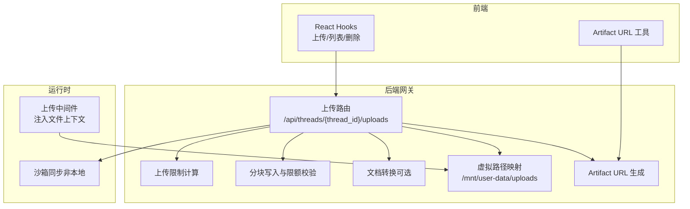
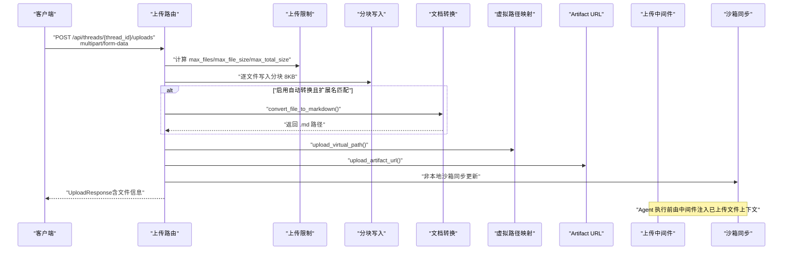
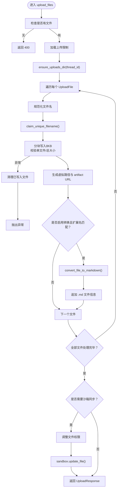
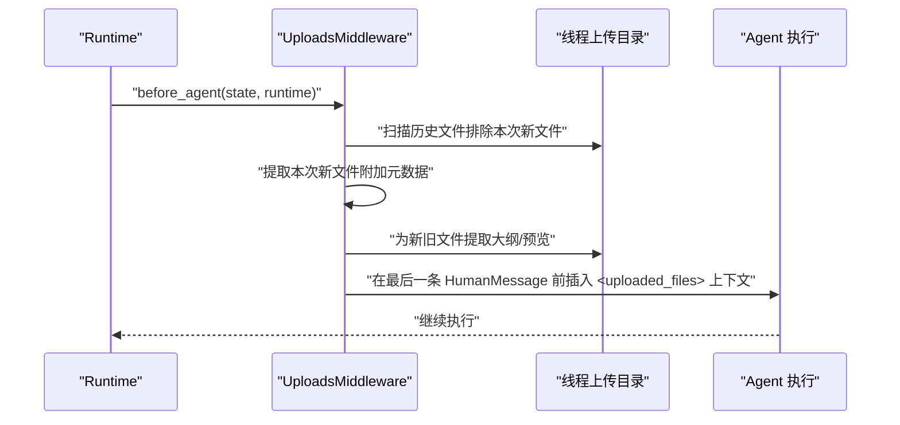
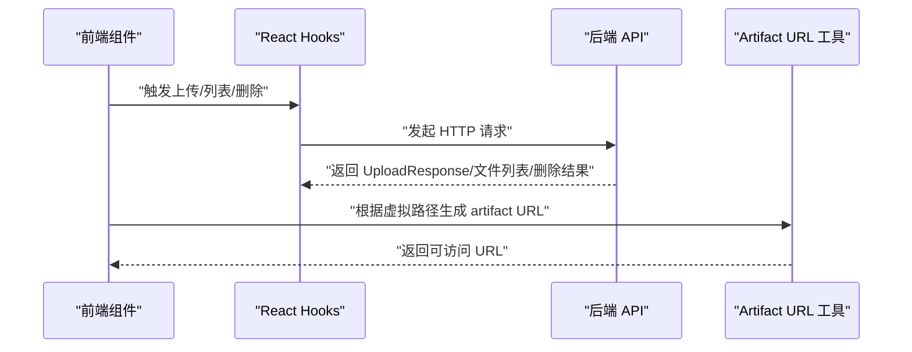
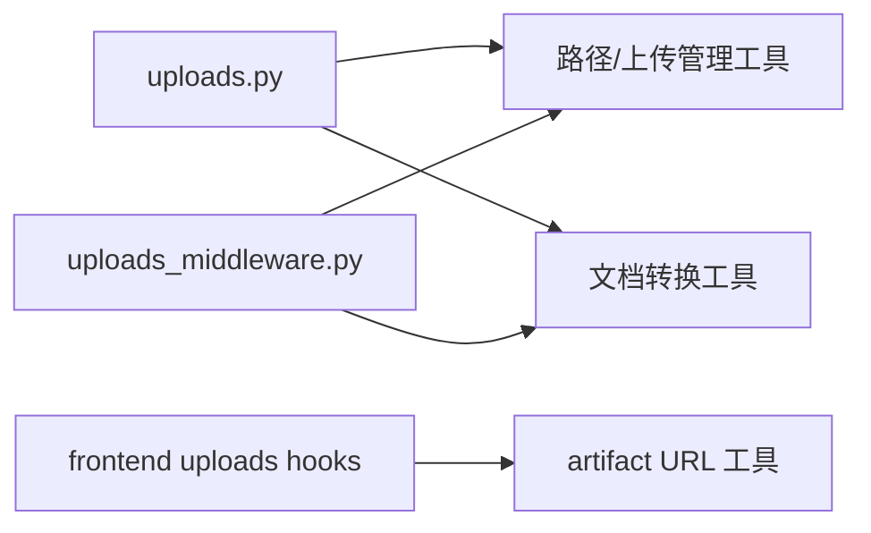

# 文件上传数据流

<cite>
**本文引用的文件**
- [backend/app/gateway/routers/uploads.py](file://backend/app/gateway/routers/uploads.py)
- [backend/docs/FILE_UPLOAD.md](file://backend/docs/FILE_UPLOAD.md)
- [backend/packages/harness/deerflow/agents/middlewares/uploads_middleware.py](file://backend/packages/harness/deerflow/agents/middlewares/uploads_middleware.py)
- [backend/docs/PATH_EXAMPLES.md](file://backend/docs/PATH_EXAMPLES.md)
- [frontend/src/core/artifacts/utils.ts](file://frontend/src/core/artifacts/utils.ts)
- [frontend/src/core/uploads/hooks.ts](file://frontend/src/core/uploads/hooks.ts)
- [backend/tests/test_client_live.py](file://backend/tests/test_client_live.py)
</cite>

## 目录
1. [简介](#简介)
2. [项目结构](#项目结构)
3. [核心组件](#核心组件)
4. [架构总览](#架构总览)
5. [详细组件分析](#详细组件分析)
6. [依赖分析](#依赖分析)
7. [性能考虑](#性能考虑)
8. [故障排查指南](#故障排查指南)
9. [结论](#结论)
10. [附录](#附录)

## 简介
本文面向 DeerFlow 的文件上传数据流，系统性梳理从客户端 multipart/form-data 请求到文件系统持久化与虚拟路径映射的完整链路，覆盖上传路由、文件验证、文档转换（markitdown）、虚拟路径映射（/mnt/user-data/uploads）与 artifact URL 生成。文档还包含中间件处理、路径安全检查、文件类型验证、存储策略、并发安全与性能优化建议，并提供状态转换图与数据流图帮助理解。

## 项目结构
围绕文件上传的关键模块分布于后端网关路由、上传中间件、前端工具与文档说明中，形成“请求—校验—落盘—转换—映射—暴露”的闭环。

图表来源
- [backend/app/gateway/routers/uploads.py:170-293](file://backend/app/gateway/routers/uploads.py#L170-L293)
- [backend/packages/harness/deerflow/agents/middlewares/uploads_middleware.py:66-295](file://backend/packages/harness/deerflow/agents/middlewares/uploads_middleware.py#L66-L295)
- [frontend/src/core/uploads/hooks.ts:19-78](file://frontend/src/core/uploads/hooks.ts#L19-L78)
- [frontend/src/core/artifacts/utils.ts:4-19](file://frontend/src/core/artifacts/utils.ts#L4-L19)

章节来源
- [backend/docs/FILE_UPLOAD.md:1-315](file://backend/docs/FILE_UPLOAD.md#L1-L315)

## 核心组件
- 上传路由与控制器
  - 负责接收 multipart/form-data，执行文件数量/大小限制、逐文件写入、可选文档转换、虚拟路径与 artifact URL 生成、沙箱同步等。
  - 关键实现参考：[上传路由与控制器:170-293](file://backend/app/gateway/routers/uploads.py#L170-L293)、[上传限制计算:105-110](file://backend/app/gateway/routers/uploads.py#L105-L110)、[分块写入与限额:123-152](file://backend/app/gateway/routers/uploads.py#L123-L152)、[文档转换开关:155-167](file://backend/app/gateway/routers/uploads.py#L155-L167)。
- 上传中间件
  - 在 Agent 执行前注入已上传文件列表，自动拼接 <uploaded_files> 上下文，支持大纲与预览回退。
  - 关键实现参考：[上传中间件:66-295](file://backend/packages/harness/deerflow/agents/middlewares/uploads_middleware.py#L66-L295)。
- 前端工具
  - React Hooks 封装上传/列表/删除；Artifact URL 工具统一生成 /api/threads/{thread_id}/artifacts 前缀 URL。
  - 关键实现参考：[Hooks:19-78](file://frontend/src/core/uploads/hooks.ts#L19-L78)、[Artifact URL 工具:4-19](file://frontend/src/core/artifacts/utils.ts#L4-L19)。
- 文档与示例
  - 官方文档详细描述 API、路径映射、Agent 集成、测试示例与故障排查。
  - 关键参考：[文件上传文档:1-315](file://backend/docs/FILE_UPLOAD.md#L1-L315)、[路径示例:77-129](file://backend/docs/PATH_EXAMPLES.md#L77-L129)。

章节来源
- [backend/app/gateway/routers/uploads.py:170-293](file://backend/app/gateway/routers/uploads.py#L170-L293)
- [backend/packages/harness/deerflow/agents/middlewares/uploads_middleware.py:66-295](file://backend/packages/harness/deerflow/agents/middlewares/uploads_middleware.py#L66-L295)
- [frontend/src/core/uploads/hooks.ts:19-78](file://frontend/src/core/uploads/hooks.ts#L19-L78)
- [frontend/src/core/artifacts/utils.ts:4-19](file://frontend/src/core/artifacts/utils.ts#L4-L19)
- [backend/docs/FILE_UPLOAD.md:1-315](file://backend/docs/FILE_UPLOAD.md#L1-L315)
- [backend/docs/PATH_EXAMPLES.md:77-129](file://backend/docs/PATH_EXAMPLES.md#L77-L129)

## 架构总览
下图展示从客户端到文件系统的端到端数据流，包括请求处理、安全校验、落盘与转换、虚拟路径映射、artifact URL 生成及沙箱同步。

图表来源
- [backend/app/gateway/routers/uploads.py:170-293](file://backend/app/gateway/routers/uploads.py#L170-L293)
- [backend/packages/harness/deerflow/agents/middlewares/uploads_middleware.py:187-295](file://backend/packages/harness/deerflow/agents/middlewares/uploads_middleware.py#L187-L295)

章节来源
- [backend/app/gateway/routers/uploads.py:170-293](file://backend/app/gateway/routers/uploads.py#L170-L293)
- [backend/packages/harness/deerflow/agents/middlewares/uploads_middleware.py:187-295](file://backend/packages/harness/deerflow/agents/middlewares/uploads_middleware.py#L187-L295)

## 详细组件分析

### 上传路由与控制器
- 请求处理
  - 接收 multipart/form-data，支持多文件上传；对空文件集抛出 400。
  - 读取应用配置中的上传限制（最大文件数、单文件大小、总大小），并进行校验。
- 分块写入与限额
  - 使用固定分块大小（默认 8KB）循环读取文件流，实时累计单文件与总大小，超限即返回 413。
  - 写入过程中异常会清理已写入部分，保证一致性。
- 虚拟路径与 artifact URL
  - 生成虚拟路径（/mnt/user-data/uploads/...）与 artifact URL（/api/threads/{thread_id}/artifacts...）。
- 文档转换（可选）
  - 当开启自动转换且文件扩展名属于可转换集合时，调用转换函数生成 .md，并补充对应的虚拟路径与 artifact URL。
- 沙箱同步
  - 对非本地沙箱，将文件写入宿主后，再将字节流同步到沙箱虚拟路径，必要时调整权限以适配沙箱运行用户。
- 文件列表与删除
  - 提供列出与删除接口，删除时会一并清理转换产生的 .md 文件。

图表来源
- [backend/app/gateway/routers/uploads.py:170-293](file://backend/app/gateway/routers/uploads.py#L170-L293)

章节来源
- [backend/app/gateway/routers/uploads.py:170-293](file://backend/app/gateway/routers/uploads.py#L170-L293)

### 上传中间件（Agent 注入）
- 触发时机
  - 在 Agent 执行前，从最后一条人类消息的附加字段中提取本次上传的文件元数据，扫描线程上传目录收集历史文件。
- 上下文注入
  - 生成 <uploaded_files> XML 风格的上下文块，包含文件名、大小、虚拟路径、可选的大纲或首若干行预览，以及使用建议（read_file、grep、glob）。
- 结构化输出
  - 保持原始附加字段不变，以便前端在流式响应中读取结构化文件信息。

图表来源
- [backend/packages/harness/deerflow/agents/middlewares/uploads_middleware.py:187-295](file://backend/packages/harness/deerflow/agents/middlewares/uploads_middleware.py#L187-L295)

章节来源
- [backend/packages/harness/deerflow/agents/middlewares/uploads_middleware.py:66-295](file://backend/packages/harness/deerflow/agents/middlewares/uploads_middleware.py#L66-L295)

### 前端集成与 artifact URL
- 上传/列表/删除
  - 使用 React Hooks 封装上传、列表与删除操作，成功后主动失效查询缓存以刷新列表。
- Artifact URL
  - 统一生成 /api/threads/{thread_id}/artifacts 前缀 URL，支持 ?download=true 强制下载。

图表来源
- [frontend/src/core/uploads/hooks.ts:19-78](file://frontend/src/core/uploads/hooks.ts#L19-L78)
- [frontend/src/core/artifacts/utils.ts:4-19](file://frontend/src/core/artifacts/utils.ts#L4-L19)

章节来源
- [frontend/src/core/uploads/hooks.ts:19-78](file://frontend/src/core/uploads/hooks.ts#L19-L78)
- [frontend/src/core/artifacts/utils.ts:4-19](file://frontend/src/core/artifacts/utils.ts#L4-L19)

### 路径安全与虚拟映射
- 路径安全
  - 严格校验文件名与目标路径，防止目录穿越；删除与列举均进行路径解析与相对化校验。
- 虚拟路径映射
  - Agent 使用 /mnt/user-data/uploads 下的虚拟路径；artifact URL 通过 /api/threads/{thread_id}/artifacts 映射到真实文件系统。
- 线程隔离
  - 每个 thread_id 对应独立上传目录，避免跨线程访问。

章节来源
- [backend/app/gateway/routers/uploads.py:326-342](file://backend/app/gateway/routers/uploads.py#L326-L342)
- [backend/docs/FILE_UPLOAD.md:48-51](file://backend/docs/FILE_UPLOAD.md#L48-L51)
- [backend/docs/PATH_EXAMPLES.md:269-284](file://backend/docs/PATH_EXAMPLES.md#L269-L284)

### 文档转换（markitdown）
- 启用条件
  - 需在配置中显式开启 uploads.auto_convert_documents。
- 支持格式
  - PDF、PPT、PPTX、XLS、XLSX、DOC、DOCX。
- 行为
  - 成功转换后生成同名 .md 文件，补充对应的虚拟路径与 artifact URL；原始文件保留。

章节来源
- [backend/docs/FILE_UPLOAD.md:105-115](file://backend/docs/FILE_UPLOAD.md#L105-L115)
- [backend/app/gateway/routers/uploads.py:250-264](file://backend/app/gateway/routers/uploads.py#L250-L264)

## 依赖分析
- 组件耦合
  - 上传路由依赖配置、路径工具、上传管理器（文件名规范化、唯一性、清理、列举、删除、虚拟路径与 artifact URL 生成）。
  - 上传中间件依赖路径工具与文件转换工具，用于提取大纲与预览。
- 外部依赖
  - markitdown 用于文档转换；python-multipart 用于 multipart 解析。
- 潜在环路
  - 路由与中间件通过工具函数解耦，未见直接循环导入。

图表来源
- [backend/app/gateway/routers/uploads.py:16-29](file://backend/app/gateway/routers/uploads.py#L16-L29)
- [backend/packages/harness/deerflow/agents/middlewares/uploads_middleware.py:12-14](file://backend/packages/harness/deerflow/agents/middlewares/uploads_middleware.py#L12-L14)
- [frontend/src/core/uploads/hooks.ts:8-14](file://frontend/src/core/uploads/hooks.ts#L8-L14)
- [frontend/src/core/artifacts/utils.ts:4-19](file://frontend/src/core/artifacts/utils.ts#L4-L19)

章节来源
- [backend/app/gateway/routers/uploads.py:16-29](file://backend/app/gateway/routers/uploads.py#L16-L29)
- [backend/packages/harness/deerflow/agents/middlewares/uploads_middleware.py:12-14](file://backend/packages/harness/deerflow/agents/middlewares/uploads_middleware.py#L12-L14)
- [frontend/src/core/uploads/hooks.ts:8-14](file://frontend/src/core/uploads/hooks.ts#L8-L14)
- [frontend/src/core/artifacts/utils.ts:4-19](file://frontend/src/core/artifacts/utils.ts#L4-L19)

## 性能考虑
- 分块写入
  - 固定 8KB 分块降低内存峰值，适合大文件上传。
- 并发与一致性
  - 单请求内逐文件顺序处理，异常即时清理已写入文件，避免脏数据。
- 转换成本
  - 文档转换为 CPU 密集型操作，建议仅在可信环境启用，并限制并发。
- 沙箱同步
  - 非本地沙箱同步会增加网络与 IO 成本，建议在需要时才进行。

章节来源
- [backend/app/gateway/routers/uploads.py:36-38](file://backend/app/gateway/routers/uploads.py#L36-L38)
- [backend/app/gateway/routers/uploads.py:123-152](file://backend/app/gateway/routers/uploads.py#L123-L152)
- [backend/app/gateway/routers/uploads.py:280-282](file://backend/app/gateway/routers/uploads.py#L280-L282)

## 故障排查指南
- 文件上传失败
  - 检查是否超过 max_files/max_file_size/max_total_size；确认 Gateway 正常运行与磁盘空间充足。
- 文档转换失败
  - 确认 markitdown 已正确安装；查看日志定位具体错误；某些损坏/加密文档可能无法转换，但原文件仍会保存。
- Agent 看不到上传的文件
  - 确认 UploadsMiddleware 已注册；检查 thread_id 与上传目录；非本地沙箱需确保同步成功。

章节来源
- [backend/docs/FILE_UPLOAD.md:253-274](file://backend/docs/FILE_UPLOAD.md#L253-L274)

## 结论
DeerFlow 的文件上传数据流以“安全—隔离—可追溯—可扩展”为核心设计原则：通过严格的路径安全检查与线程隔离保障安全；通过虚拟路径映射与 artifact URL 统一访问；通过可选的文档转换提升 Agent 处理效率；通过中间件自动注入文件上下文增强 Agent 的可用性。整体架构清晰、职责分离，便于在生产环境中稳定运行与持续演进。

## 附录
- API 与行为示例
  - 官方文档提供了 curl 与 Python 示例，涵盖上传、列出与删除。
- 前端集成要点
  - 使用 Hooks 管理上传状态与缓存失效；通过 artifact URL 工具生成可下载/预览链接。

章节来源
- [backend/docs/FILE_UPLOAD.md:159-209](file://backend/docs/FILE_UPLOAD.md#L159-L209)
- [backend/docs/PATH_EXAMPLES.md:77-129](file://backend/docs/PATH_EXAMPLES.md#L77-L129)
- [backend/tests/test_client_live.py:183-216](file://backend/tests/test_client_live.py#L183-L216)