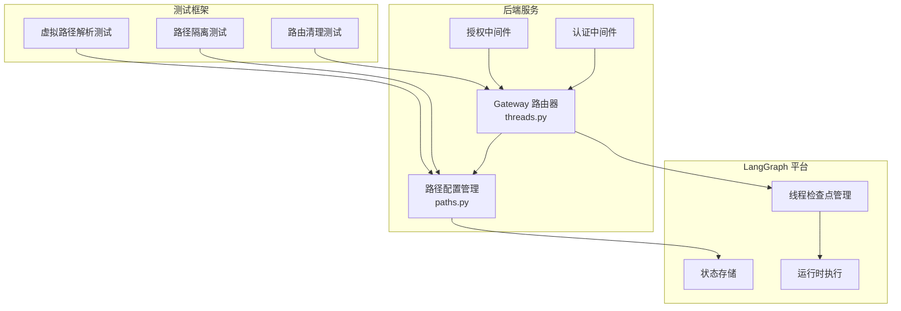
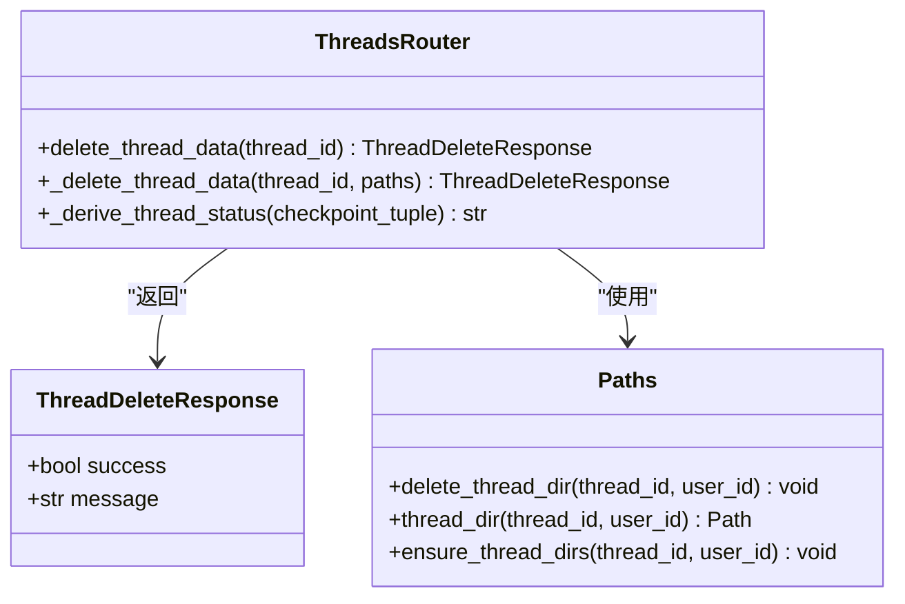
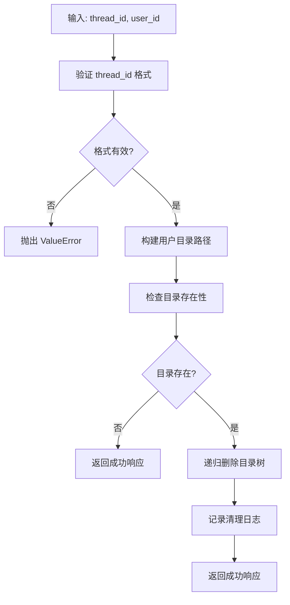
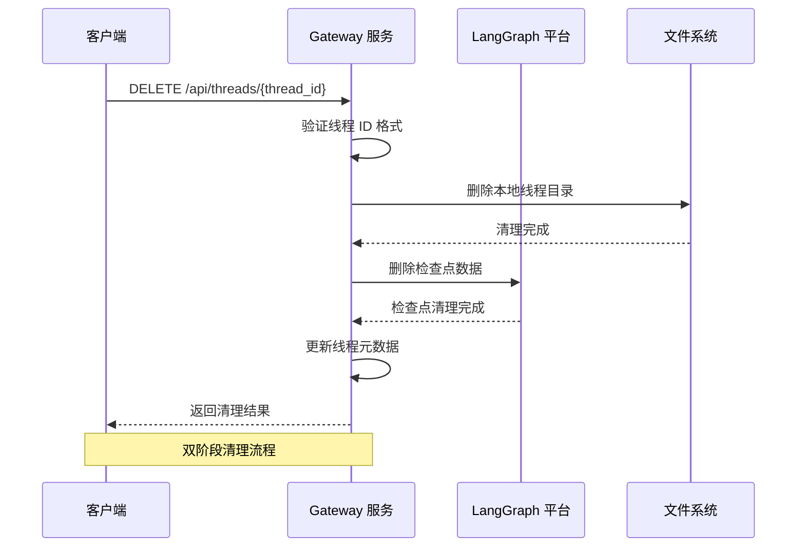
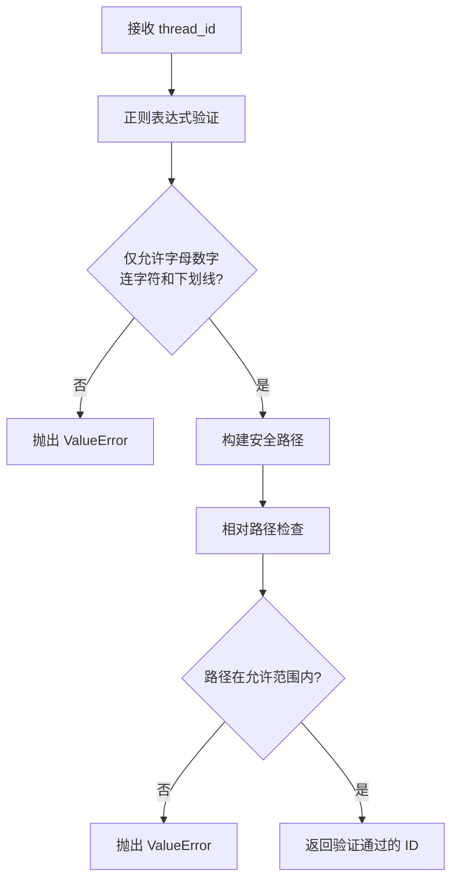
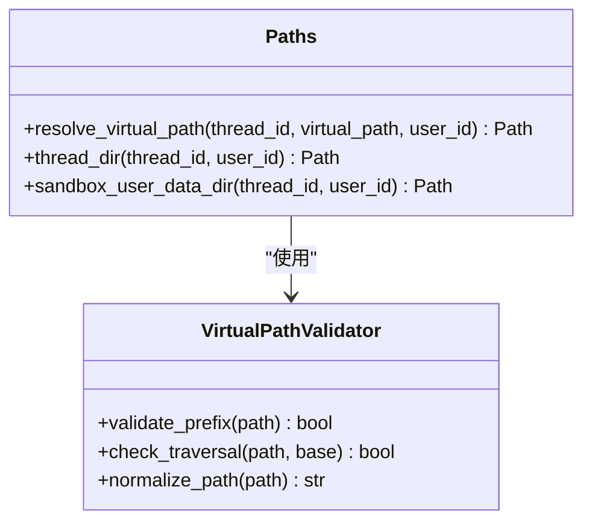
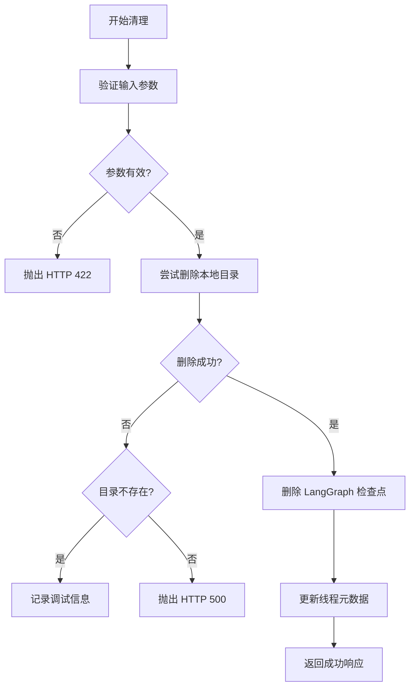
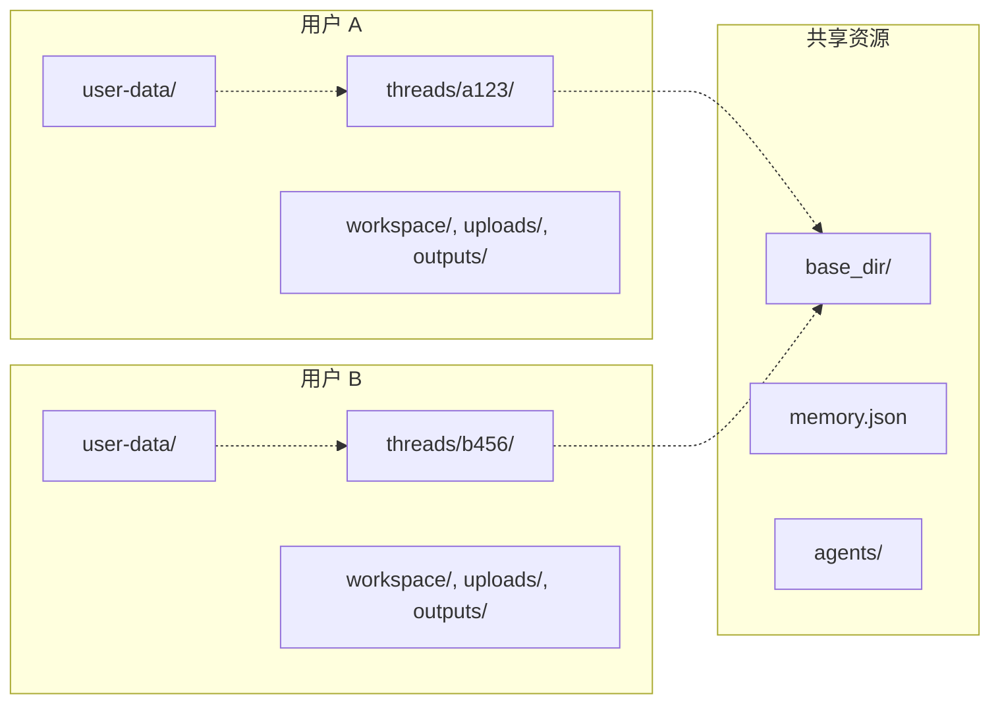
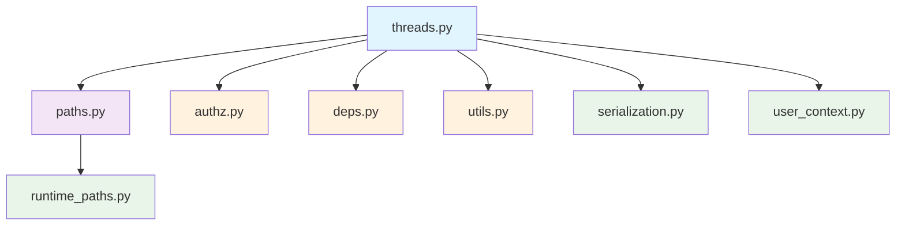

# 线程清理数据流

<cite>
**本文档引用的文件**
- [threads.py](file://backend/app/gateway/routers/threads.py)
- [paths.py](file://backend/packages/harness/deerflow/config/paths.py)
- [test_paths_user_isolation.py](file://backend/tests/test_paths_user_isolation.py)
- [test_threads_router.py](file://backend/tests/test_threads_router.py)
- [status.sh](file://skills/public/claude-to-deerflow/scripts/status.sh)
- [chat.sh](file://skills/public/claude-to-deerflow/scripts/chat.sh)
- [README_fr.md](file://README_fr.md)
</cite>

## 目录
1. [简介](#简介)
2. [项目结构](#项目结构)
3. [核心组件](#核心组件)
4. [架构概览](#架构概览)
5. [详细组件分析](#详细组件分析)
6. [依赖关系分析](#依赖关系分析)
7. [性能考虑](#性能考虑)
8. [故障排除指南](#故障排除指南)
9. [结论](#结论)

## 简介

本文档详细阐述 DeerFlow 线程清理数据流的技术实现，重点分析删除会话时的双阶段清理流程：LangGraph 侧的线程状态删除和 Gateway 侧的文件系统清理。文档深入解释了 DELETE /api/langgraph/threads/{thread_id} 和 DELETE /api/threads/{thread_id} 的协调机制，包括线程 ID 验证、目录遍历防护和递归删除策略。

DeerFlow 采用双层清理架构：LangGraph 负责管理线程状态和检查点数据，Gateway 负责清理本地持久化文件系统数据。这种设计确保了数据一致性，避免了竞态条件，并提供了完整的错误恢复机制。

## 项目结构

DeerFlow 项目采用模块化架构，线程清理功能分布在多个关键组件中：

**图表来源**
- [threads.py:1-623](file://backend/app/gateway/routers/threads.py#L1-L623)
- [paths.py:1-351](file://backend/packages/harness/deerflow/config/paths.py#L1-L351)

**章节来源**
- [threads.py:1-623](file://backend/app/gateway/routers/threads.py#L1-L623)
- [paths.py:1-351](file://backend/packages/harness/deerflow/config/paths.py#L1-L351)

## 核心组件

### 线程清理路由器 (Threads Router)

线程清理路由器负责处理删除请求并协调双阶段清理流程：

**图表来源**
- [threads.py:147-221](file://backend/app/gateway/routers/threads.py#L147-L221)
- [paths.py:282-290](file://backend/packages/harness/deerflow/config/paths.py#L282-L290)

### 路径管理系统

路径管理系统提供安全的文件系统访问和清理能力：

**图表来源**
- [paths.py:282-290](file://backend/packages/harness/deerflow/config/paths.py#L282-L290)
- [paths.py:20-31](file://backend/packages/harness/deerflow/config/paths.py#L20-L31)

**章节来源**
- [threads.py:147-221](file://backend/app/gateway/routers/threads.py#L147-L221)
- [paths.py:282-290](file://backend/packages/harness/deerflow/config/paths.py#L282-L290)

## 架构概览

DeerFlow 的线程清理架构采用分层设计，确保数据一致性和安全性：

**图表来源**
- [threads.py:190-221](file://backend/app/gateway/routers/threads.py#L190-L221)
- [paths.py:282-290](file://backend/packages/harness/deerflow/config/paths.py#L282-L290)

### 协调机制详解

系统通过以下机制确保清理操作的协调性：

1. **线程 ID 验证**：在删除请求到达时，系统首先验证 thread_id 的格式有效性
2. **顺序清理**：先清理本地文件系统，再清理 LangGraph 检查点数据
3. **最佳努力原则**：即使某个阶段失败，也会尝试清理其他阶段
4. **幂等性保证**：重复删除不会产生副作用

**章节来源**
- [threads.py:190-221](file://backend/app/gateway/routers/threads.py#L190-L221)
- [test_threads_router.py:66-94](file://backend/tests/test_threads_router.py#L66-L94)

## 详细组件分析

### 线程 ID 验证与安全防护

系统采用多层安全防护机制防止目录遍历攻击：

**图表来源**
- [paths.py:20-31](file://backend/packages/harness/deerflow/config/paths.py#L20-L31)
- [paths.py:311-325](file://backend/packages/harness/deerflow/config/paths.py#L311-L325)

### 虚拟路径解析与访问控制

系统提供安全的虚拟路径解析功能：

**图表来源**
- [paths.py:291-325](file://backend/packages/harness/deerflow/config/paths.py#L291-L325)

### 异常处理与错误恢复

系统实现了完善的异常处理机制：

**图表来源**
- [threads.py:147-163](file://backend/app/gateway/routers/threads.py#L147-L163)

**章节来源**
- [threads.py:147-163](file://backend/app/gateway/routers/threads.py#L147-L163)
- [paths.py:282-290](file://backend/packages/harness/deerflow/config/paths.py#L282-L290)

### 用户隔离与权限管理

系统支持用户隔离的线程清理：

**图表来源**
- [paths.py:171-189](file://backend/packages/harness/deerflow/config/paths.py#L171-L189)
- [test_paths_user_isolation.py:148-170](file://backend/tests/test_paths_user_isolation.py#L148-L170)

**章节来源**
- [paths.py:171-189](file://backend/packages/harness/deerflow/config/paths.py#L171-L189)
- [test_paths_user_isolation.py:148-170](file://backend/tests/test_paths_user_isolation.py#L148-L170)

## 依赖关系分析

### 组件耦合度分析

**图表来源**
- [threads.py:23-28](file://backend/app/gateway/routers/threads.py#L23-L28)
- [paths.py:1-6](file://backend/packages/harness/deerflow/config/paths.py#L1-L6)

### 外部依赖与集成点

系统主要依赖以下外部组件：

1. **LangGraph 平台**：提供线程状态管理和检查点存储
2. **文件系统**：存储线程的本地数据文件
3. **认证授权系统**：确保删除操作的安全性
4. **用户上下文管理**：支持多租户隔离

**章节来源**
- [threads.py:204-220](file://backend/app/gateway/routers/threads.py#L204-L220)
- [paths.py:1-6](file://backend/packages/harness/deerflow/config/paths.py#L1-L6)

## 性能考虑

### 清理操作的性能特征

1. **时间复杂度**：删除操作的时间复杂度为 O(n)，其中 n 是目录中的文件数量
2. **空间复杂度**：空间复杂度为 O(1)，只使用常量额外内存
3. **并发安全性**：清理操作是幂等的，可以安全地重试
4. **资源管理**：系统自动处理文件句柄和进程资源

### 优化建议

1. **批量清理**：对于大量线程的清理，考虑实现批量删除功能
2. **异步处理**：对于大型目录的清理，可以考虑异步执行以避免阻塞
3. **缓存策略**：对频繁访问的线程数据实施适当的缓存策略
4. **监控指标**：添加清理操作的性能监控和告警机制

## 故障排除指南

### 常见错误类型及解决方案

| 错误类型 | 错误码 | 触发原因 | 解决方案 |
|---------|--------|----------|----------|
| 参数验证错误 | 422 | 线程 ID 格式无效 | 检查线程 ID 是否包含非法字符 |
| 文件系统错误 | 500 | 权限不足或磁盘空间不足 | 检查文件系统权限和可用空间 |
| 路径遍历攻击 | 404 | 检测到目录遍历尝试 | 审计日志并拒绝请求 |
| LangGraph 连接错误 | 500 | 无法连接到 LangGraph 服务 | 检查网络连接和服务状态 |

### 调试工具和方法

1. **日志分析**：查看清理操作的日志输出
2. **状态检查**：使用 status.sh 脚本检查系统状态
3. **手动验证**：直接检查文件系统中的线程目录
4. **API 测试**：使用 chat.sh 脚本测试基本功能

**章节来源**
- [test_threads_router.py:154-167](file://backend/tests/test_threads_router.py#L154-L167)
- [status.sh:26-98](file://skills/public/claude-to-deerflow/scripts/status.sh#L26-L98)

## 结论

DeerFlow 的线程清理数据流通过精心设计的双阶段清理架构，确保了数据的一致性和系统的安全性。该架构的主要优势包括：

1. **安全性**：多层验证和防护机制有效防止了各种攻击
2. **可靠性**：幂等性和最佳努力原则确保了清理操作的可靠性
3. **可维护性**：清晰的模块划分和接口设计便于维护和扩展
4. **性能**：合理的算法选择和资源管理保证了良好的性能表现

通过 DELETE /api/langgraph/threads/{thread_id} 和 DELETE /api/threads/{thread_id} 的协调配合，系统实现了完整的线程生命周期管理，为用户提供了可靠的会话清理功能。未来可以在批量处理、异步清理和监控告警等方面进一步优化，以满足更大规模的应用场景需求。