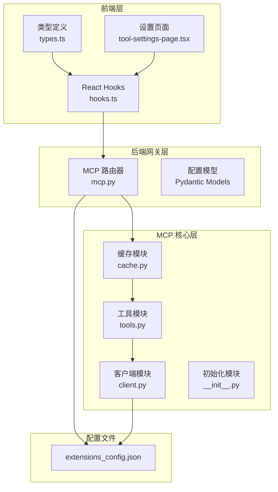
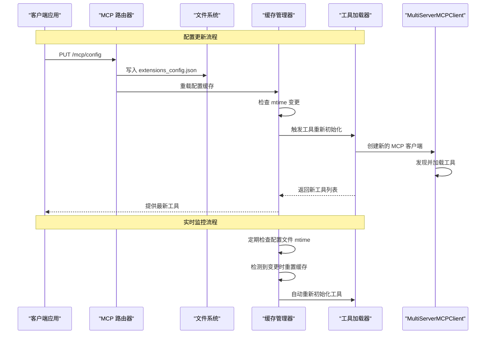
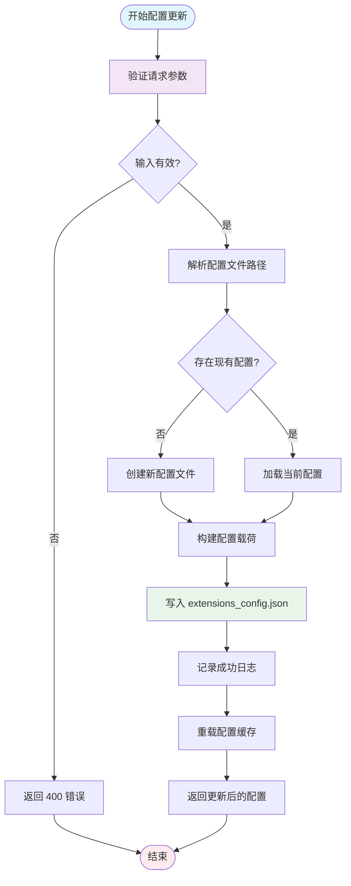
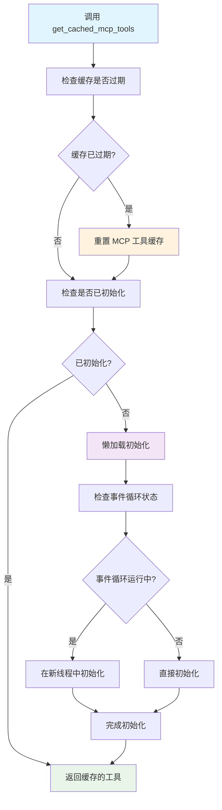
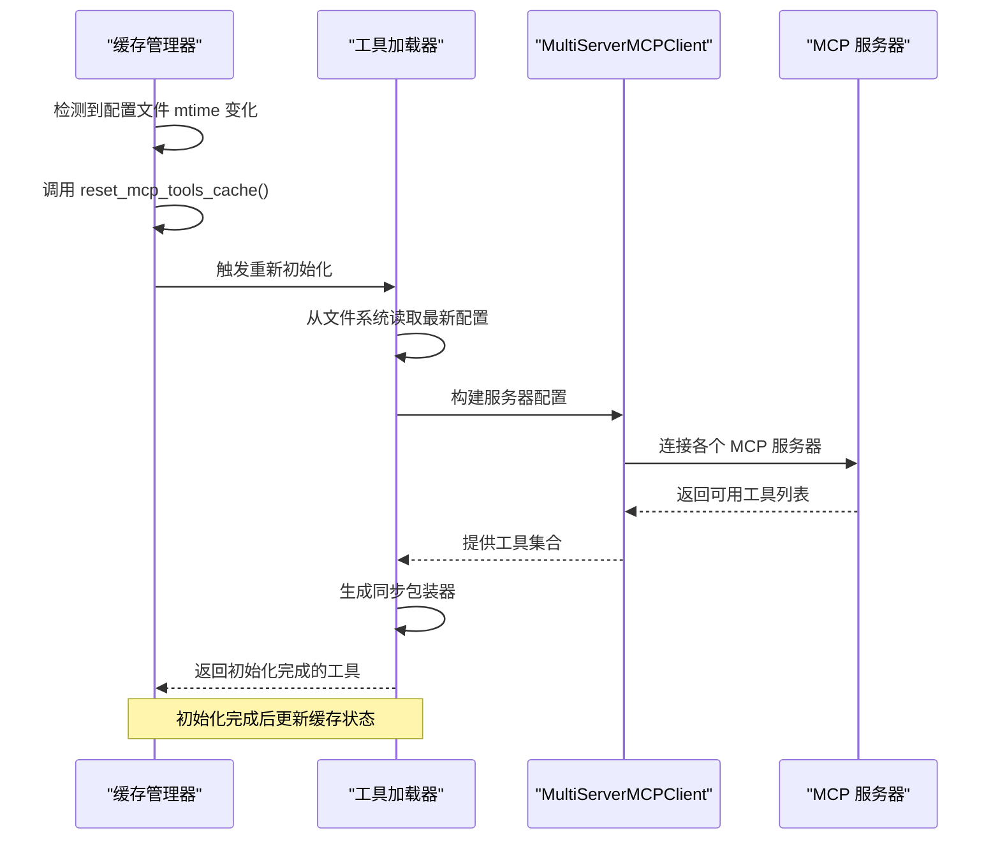
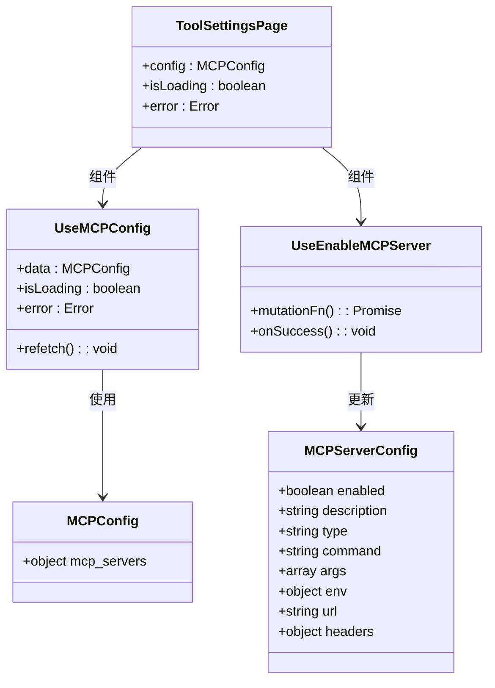
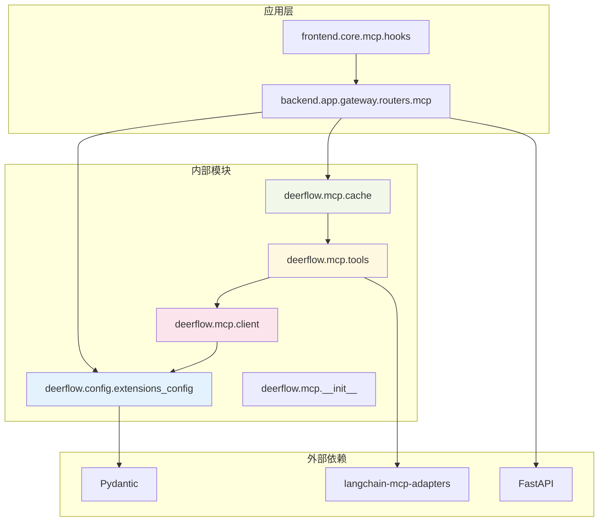

# 配置热重载数据流

<cite>
**本文档引用的文件**
- [extensions_config.json](file://extensions_config.json)
- [mcp.py](file://backend/app/gateway/routers/mcp.py)
- [cache.py](file://backend/packages/harness/deerflow/mcp/cache.py)
- [client.py](file://backend/packages/harness/deerflow/mcp/client.py)
- [tools.py](file://backend/packages/harness/deerflow/mcp/tools.py)
- [__init__.py](file://backend/packages/harness/deerflow/mcp/__init__.py)
- [hooks.ts](file://frontend/src/core/mcp/hooks.ts)
- [types.ts](file://frontend/src/core/mcp/types.ts)
- [tool-settings-page.tsx](file://frontend/src/components/workspace/settings/tool-settings-page.tsx)
</cite>

## 目录
1. [简介](#简介)
2. [项目结构](#项目结构)
3. [核心组件](#核心组件)
4. [架构概览](#架构概览)
5. [详细组件分析](#详细组件分析)
6. [依赖关系分析](#依赖关系分析)
7. [性能考虑](#性能考虑)
8. [故障排除指南](#故障排除指南)
9. [结论](#结论)

## 简介

本文档详细阐述了 DeerFlow 中 MCP（模型上下文协议）配置热重载的数据流机制。该系统实现了从客户端请求到工具重新加载的完整闭环，包括：

- 客户端 PUT 请求处理
- extensions_config.json 文件写入
- mtime 文件监控机制
- MCP Manager 检测变更和工具重新加载
- 缓存失效策略和错误回滚机制

该实现确保了配置更新的实时性和可靠性，同时提供了完善的错误处理和性能优化。

## 项目结构

DeerFlow 的 MCP 配置热重载系统主要分布在以下模块中：

**图表来源**
- [mcp.py:1-170](file://backend/app/gateway/routers/mcp.py#L1-L170)
- [cache.py:1-143](file://backend/packages/harness/deerflow/mcp/cache.py#L1-L143)
- [client.py:1-69](file://backend/packages/harness/deerflow/mcp/client.py#L1-L69)
- [tools.py:1-136](file://backend/packages/harness/deerflow/mcp/tools.py#L1-L136)

**章节来源**
- [mcp.py:1-170](file://backend/app/gateway/routers/mcp.py#L1-L170)
- [cache.py:1-143](file://backend/packages/harness/deerflow/mcp/cache.py#L1-L143)
- [client.py:1-69](file://backend/packages/harness/deerflow/mcp/client.py#L1-L69)
- [tools.py:1-136](file://backend/packages/harness/deerflow/mcp/tools.py#L1-L136)

## 核心组件

### MCP 配置路由器

MCP 配置路由器负责处理所有与 MCP 配置相关的 HTTP 请求，包括获取和更新配置。

**关键特性：**
- 支持 GET /mcp/config 获取当前配置
- 支持 PUT /mcp/config 更新配置
- 自动处理配置文件的保存和重载
- 提供完整的错误处理机制

**章节来源**
- [mcp.py:66-169](file://backend/app/gateway/routers/mcp.py#L66-L169)

### MCP 工具缓存管理器

缓存管理器实现了智能的缓存失效策略，通过监控配置文件的修改时间来确保工具的实时更新。

**核心功能：**
- 基于 mtime 的缓存失效检测
- 懒加载初始化支持
- 多事件循环兼容性
- 线程安全的并发访问

**章节来源**
- [cache.py:17-143](file://backend/packages/harness/deerflow/mcp/cache.py#L17-L143)

### MCP 客户端配置构建器

客户端配置构建器负责将配置文件转换为 MultiServerMCPClient 可识别的参数格式。

**功能特性：**
- 支持多种传输协议（stdio、sse、http）
- 动态参数验证和构建
- 环境变量和认证头注入
- 错误处理和日志记录

**章节来源**
- [client.py:11-68](file://backend/packages/harness/deerflow/mcp/client.py#L11-L68)

### MCP 工具加载器

工具加载器负责从启用的 MCP 服务器中发现和加载工具，支持同步和异步调用模式。

**主要能力：**
- 多服务器工具聚合
- 同步包装器生成
- OAuth 认证拦截器
- 自定义拦截器支持

**章节来源**
- [tools.py:57-136](file://backend/packages/harness/deerflow/mcp/tools.py#L57-L136)

## 架构概览

MCP 配置热重载系统的整体架构采用分层设计，确保了各组件间的松耦合和高内聚。

**图表来源**
- [mcp.py:104-169](file://backend/app/gateway/routers/mcp.py#L104-L169)
- [cache.py:82-131](file://backend/packages/harness/deerflow/mcp/cache.py#L82-L131)
- [tools.py:57-136](file://backend/packages/harness/deerflow/mcp/tools.py#L57-L136)

## 详细组件分析

### 配置更新流程

配置更新流程是整个热重载系统的核心，涉及多个组件的协调工作。

**图表来源**
- [mcp.py:136-169](file://backend/app/gateway/routers/mcp.py#L136-L169)

**章节来源**
- [mcp.py:104-169](file://backend/app/gateway/routers/mcp.py#L104-L169)

### 缓存失效策略

get_cached_mcp_tools() 函数实现了智能的缓存失效机制，确保工具列表的实时更新。

**图表来源**
- [cache.py:82-131](file://backend/packages/harness/deerflow/mcp/cache.py#L82-L131)

**章节来源**
- [cache.py:82-131](file://backend/packages/harness/deerflow/mcp/cache.py#L82-L131)

### MultiServerMCPClient 重新初始化过程

当检测到配置变更时，系统会触发 MultiServerMCPClient 的重新初始化过程。

**图表来源**
- [cache.py:133-143](file://backend/packages/harness/deerflow/mcp/cache.py#L133-L143)
- [tools.py:69-136](file://backend/packages/harness/deerflow/mcp/tools.py#L69-L136)

**章节来源**
- [cache.py:133-143](file://backend/packages/harness/deerflow/mcp/cache.py#L133-L143)
- [tools.py:69-136](file://backend/packages/harness/deerflow/mcp/tools.py#L69-L136)

### 前端交互组件

前端提供了完整的 MCP 配置管理界面，支持实时配置更新和状态显示。

**图表来源**
- [hooks.ts:5-44](file://frontend/src/core/mcp/hooks.ts#L5-L44)
- [types.ts:1-8](file://frontend/src/core/mcp/types.ts#L1-L8)
- [tool-settings-page.tsx:18-35](file://frontend/src/components/workspace/settings/tool-settings-page.tsx#L18-L35)

**章节来源**
- [hooks.ts:1-44](file://frontend/src/core/mcp/hooks.ts#L1-L44)
- [types.ts:1-8](file://frontend/src/core/mcp/types.ts#L1-L8)
- [tool-settings-page.tsx:1-35](file://frontend/src/components/workspace/settings/tool-settings-page.tsx#L1-L35)

## 依赖关系分析

MCP 配置热重载系统的依赖关系体现了清晰的分层架构设计。

**图表来源**
- [__init__.py:1-15](file://backend/packages/harness/deerflow/mcp/__init__.py#L1-L15)
- [mcp.py:1-12](file://backend/app/gateway/routers/mcp.py#L1-L12)
- [tools.py:1-16](file://backend/packages/harness/deerflow/mcp/tools.py#L1-L16)

**章节来源**
- [__init__.py:1-15](file://backend/packages/harness/deerflow/mcp/__init__.py#L1-L15)
- [mcp.py:1-12](file://backend/app/gateway/routers/mcp.py#L1-L12)
- [tools.py:1-16](file://backend/packages/harness/deerflow/mcp/tools.py#L1-L16)

## 性能考虑

### 缓存策略优化

系统采用了多层次的缓存策略来优化性能：

1. **配置文件缓存**：通过记录 mtime 来避免不必要的文件读取
2. **工具实例缓存**：避免重复创建相同的工具实例
3. **事件循环优化**：根据运行状态选择合适的初始化方式

### 并发处理

系统支持多线程环境下的并发访问，通过以下机制保证线程安全：
- 异步锁保护初始化过程
- 线程池管理同步工具调用
- 事件循环检测避免嵌套循环问题

### 内存管理

- 全局线程池在进程退出时自动清理
- 工具包装器按需生成，减少内存占用
- 配置文件读取使用最新的磁盘内容

## 故障排除指南

### 常见问题及解决方案

**配置文件无法写入**
- 检查文件权限和磁盘空间
- 验证配置路径的有效性
- 确认进程具有写入权限

**工具加载失败**
- 检查 MCP 服务器的可访问性
- 验证认证配置的正确性
- 查看详细的错误日志信息

**缓存失效异常**
- 确认配置文件的 mtime 正常更新
- 检查文件监控机制的工作状态
- 验证事件循环的正常运行

**章节来源**
- [mcp.py:167-169](file://backend/app/gateway/routers/mcp.py#L167-L169)
- [cache.py:119-128](file://backend/packages/harness/deerflow/mcp/cache.py#L119-L128)

## 结论

DeerFlow 的 MCP 配置热重载系统通过精心设计的架构和实现，提供了可靠的配置更新机制。系统的关键优势包括：

1. **实时性**：基于文件 mtime 的监控确保配置变更能够及时反映
2. **可靠性**：完善的错误处理和回滚机制保证系统稳定性
3. **性能优化**：智能缓存策略和并发处理提升系统效率
4. **易用性**：前后端完整的集成提供了良好的用户体验

该系统为 DeerFlow 的扩展性奠定了坚实基础，支持动态添加和移除 MCP 服务器，满足了现代 AI 应用对灵活性和可扩展性的需求。