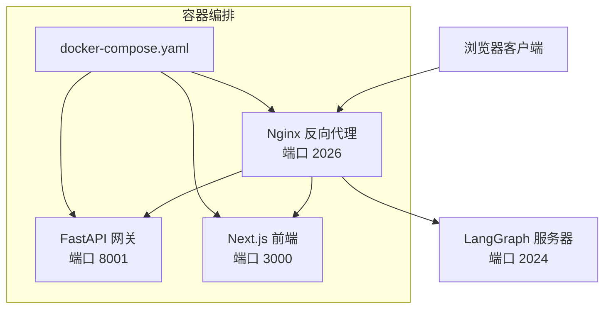
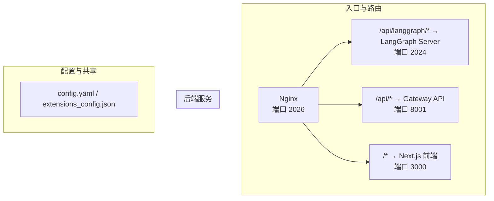
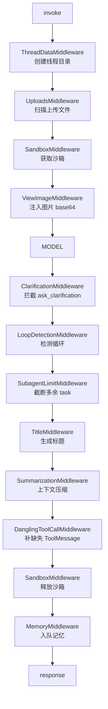
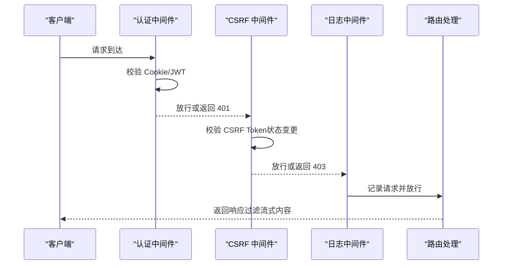
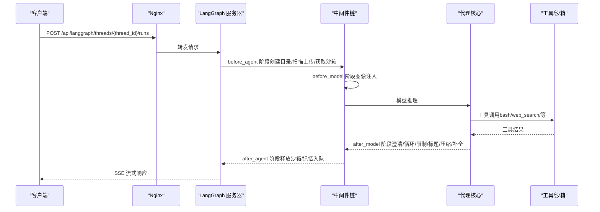
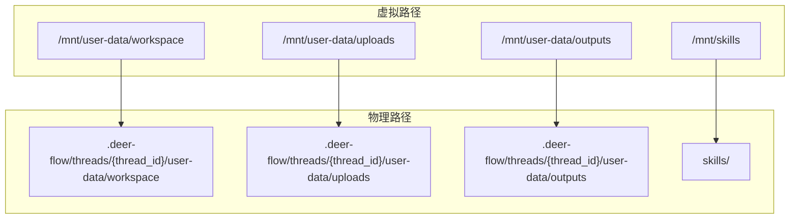
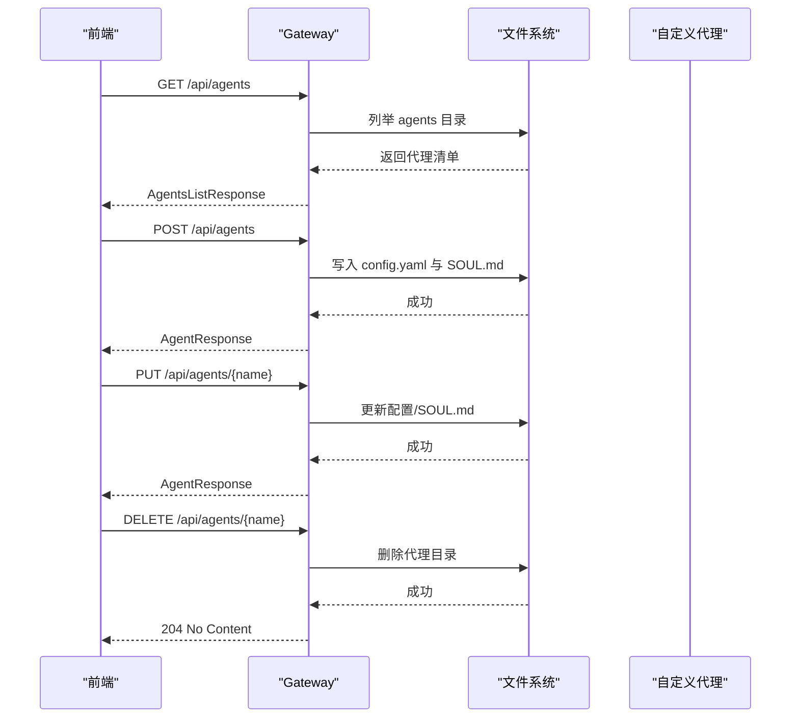
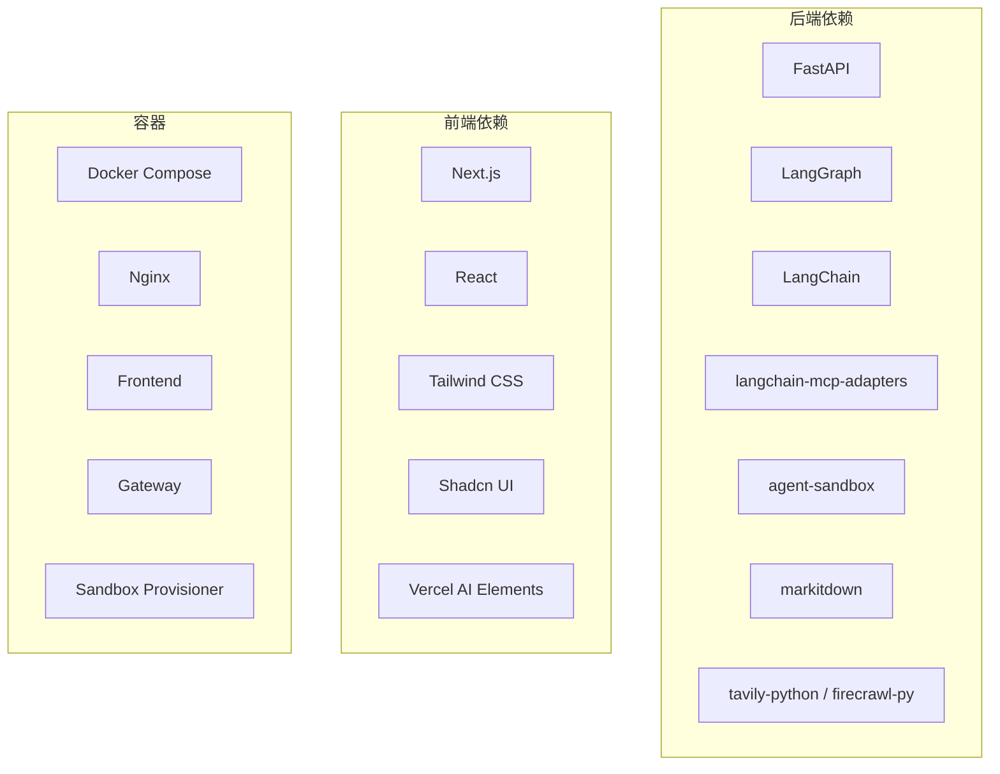

# 架构设计

<cite>
**本文引用的文件**
- [backend/README.md](file://backend/README.md)
- [frontend/README.md](file://frontend/README.md)
- [docker/docker-compose.yaml](file://docker/docker-compose.yaml)
- [backend/docs/ARCHITECTURE.md](file://backend/docs/ARCHITECTURE.md)
- [backend/pyproject.toml](file://backend/pyproject.toml)
- [frontend/package.json](file://frontend/package.json)
- [backend/docs/middleware-execution-flow.md](file://backend/docs/middleware-execution-flow.md)
- [backend/app/gateway/app.py](file://backend/app/gateway/app.py)
- [backend/app/gateway/auth_middleware.py](file://backend/app/gateway/auth_middleware.py)
- [backend/app/gateway/csrf_middleware.py](file://backend/app/gateway/csrf_middleware.py)
- [backend/app/gateway/logging_middleware.py](file://backend/app/gateway/logging_middleware.py)
- [backend/app/gateway/routers/agents.py](file://backend/app/gateway/routers/agents.py)
- [backend/langgraph.json](file://backend/langgraph.json)
</cite>

## 目录
1. [引言](#引言)
2. [项目结构](#项目结构)
3. [核心组件](#核心组件)
4. [架构总览](#架构总览)
5. [详细组件分析](#详细组件分析)
6. [依赖分析](#依赖分析)
7. [性能考虑](#性能考虑)
8. [故障排查指南](#故障排查指南)
9. [结论](#结论)
10. [附录](#附录)

## 引言
本文件面向 DeerFlow 项目的架构设计与实现，系统性阐述后端基于 FastAPI 的网关运行时、前端基于 Next.js 的用户界面，以及 Docker 容器化部署的整体设计理念。重点覆盖以下方面：
- 系统分层与职责边界：Nginx 反向代理、LangGraph 代理运行时、FastAPI 网关、前端 Next.js 应用
- 核心组件交互：Gateway、LangGraph Server、Agent Runtime 的协作模式
- 中间件系统：九个核心中间件的执行顺序、职责与拦截点
- 沙箱执行系统：隔离环境、虚拟路径映射、工具集与安全策略
- 技能系统：技能发现、加载与注入机制
- 子代理系统：并发委托、任务执行与状态跟踪
- 网关安全中间件：认证、跨站请求伪造防护、日志记录
- 数据流与控制流：从请求到响应的完整链路

## 项目结构
DeerFlow 采用前后端分离与容器化部署的组织方式：
- 后端（Python/FastAPI/LangGraph）：提供代理运行时、模型管理、MCP 集成、文件上传、内存与工件管理等能力
- 前端（Next.js）：提供聊天界面、工作区、设置与国际化等前端体验
- 反向代理（Nginx）：统一入口，路由到 LangGraph 服务或 Gateway API，并将静态资源交由前端处理
- 容器编排（Docker Compose）：一键启动 Nginx、前端、Gateway、可选的 Sandbox Provisioner

**图表来源**
- [backend/README.md:37-41](file://backend/README.md#L37-L41)
- [docker/docker-compose.yaml:25-42](file://docker/docker-compose.yaml#L25-L42)

**章节来源**
- [backend/README.md:7-41](file://backend/README.md#L7-L41)
- [frontend/README.md:69-76](file://frontend/README.md#L69-L76)
- [docker/docker-compose.yaml:1-24](file://docker/docker-compose.yaml#L1-L24)

## 核心组件
- LangGraph 代理运行时
  - 入口：通过 langgraph.json 指定 lead_agent 的工厂函数
  - 职责：线程状态管理、中间件链执行、工具调用编排、SSE 流式输出
- FastAPI 网关
  - 职责：非代理类操作（模型、MCP、技能、文件上传、内存、工件、线程本地清理等）
  - 安全：认证、CSRF、请求日志中间件
- Next.js 前端
  - 职责：聊天界面、工作区、设置、国际化与 AI 元素集成
- 中间件链（九个核心中间件）
  - 执行顺序严格，确保线程目录、上传文件、沙箱获取、上下文压缩、标题生成、记忆入队、图像注入、澄清拦截等横切关注点有序生效
- 沙箱系统
  - 抽象接口与提供者（本地/远程），虚拟路径映射，技能加载与工具集
- 技能系统
  - 递归发现 SKILL.md，按容器路径保留嵌套结构，注入系统提示
- 子代理系统
  - 并发委托、后台线程池、超时与事件跟踪

**章节来源**
- [backend/docs/ARCHITECTURE.md:55-127](file://backend/docs/ARCHITECTURE.md#L55-L127)
- [backend/docs/ARCHITECTURE.md:147-180](file://backend/docs/ARCHITECTURE.md#L147-L180)
- [backend/docs/ARCHITECTURE.md:305-342](file://backend/docs/ARCHITECTURE.md#L305-L342)
- [backend/docs/ARCHITECTURE.md:344-425](file://backend/docs/ARCHITECTURE.md#L344-L425)
- [backend/README.md:46-131](file://backend/README.md#L46-L131)

## 架构总览
系统以 Nginx 作为统一入口，将不同前缀的请求路由至相应服务：
- /api/langgraph/* → LangGraph 服务器（代理交互、线程、流式）
- /api/*（其他）→ Gateway API（模型、MCP、技能、内存、工件、上传、线程清理）
- 非 API → 前端 Next.js

**图表来源**
- [backend/README.md:37-41](file://backend/README.md#L37-L41)
- [backend/docs/ARCHITECTURE.md:14-21](file://backend/docs/ARCHITECTURE.md#L14-L21)

**章节来源**
- [backend/README.md:37-41](file://backend/README.md#L37-L41)
- [backend/docs/ARCHITECTURE.md:14-21](file://backend/docs/ARCHITECTURE.md#L14-L21)

## 详细组件分析

### 中间件系统与执行流程
- 中间件链顺序（严格固定）：ThreadData → Uploads → Sandbox → 视模型前处理（图像注入）→ 模型 → 视模型后处理（澄清拦截、循环检测、子代理限制、标题生成、上下文压缩、悬挂工具消息补全）→ 沙箱释放 → 记忆入队
- 关键约束
  - ThreadData 必须在 Sandbox 之前，因为沙箱需要线程目录
  - ClarificationMiddleware 必须在最后，以便在 after_model 反序中最早拦截 ask_clarification
- 执行形态
  - 非洋葱式管道：大多数中间件仅在 before_* 或 after_* 单侧执行；SandboxMiddleware 是对称的（before/after）
  - before_agent/after_agent 仅执行一次，before_model/after_model 每轮工具调用循环都会执行

**图表来源**
- [backend/docs/middleware-execution-flow.md:26-75](file://backend/docs/middleware-execution-flow.md#L26-L75)

**章节来源**
- [backend/docs/middleware-execution-flow.md:26-75](file://backend/docs/middleware-execution-flow.md#L26-L75)
- [backend/docs/middleware-execution-flow.md:166-292](file://backend/docs/middleware-execution-flow.md#L166-L292)

### 网关应用与安全中间件
- 应用生命周期
  - 加载配置、初始化 LangGraph 运行时组件、角色扮演数据库初始化、管理员用户引导与孤儿线程迁移、IM 通道服务启动
  - 关闭时安全关闭角色扮演数据库连接与通道服务
- 安全中间件
  - 认证中间件：严格 JWT 校验，失败返回 401；将用户上下文写入请求与运行时上下文变量
  - CSRF 中间件：双提交 Cookie 模式，仅对状态变更方法启用校验；允许特定认证路径豁免
  - 请求/响应日志中间件：过滤大体积流式响应，避免日志风暴

**图表来源**
- [backend/app/gateway/auth_middleware.py:67-146](file://backend/app/gateway/auth_middleware.py#L67-L146)
- [backend/app/gateway/csrf_middleware.py:169-225](file://backend/app/gateway/csrf_middleware.py#L169-L225)
- [backend/app/gateway/logging_middleware.py:76-153](file://backend/app/gateway/logging_middleware.py#L76-L153)

**章节来源**
- [backend/app/gateway/app.py:166-246](file://backend/app/gateway/app.py#L166-L246)
- [backend/app/gateway/auth_middleware.py:67-146](file://backend/app/gateway/auth_middleware.py#L67-L146)
- [backend/app/gateway/csrf_middleware.py:169-225](file://backend/app/gateway/csrf_middleware.py#L169-L225)
- [backend/app/gateway/logging_middleware.py:76-153](file://backend/app/gateway/logging_middleware.py#L76-L153)

### LangGraph 服务器与代理运行时
- 入口与配置
  - langgraph.json 指定 lead_agent 工厂函数与鉴权、检查点提供者
- 运行时职责
  - 线程状态扩展（消息、沙箱、工件、线程数据、标题、待办、已查看图像）
  - 中间件链执行与工具调用编排
  - SSE 流式响应

**图表来源**
- [backend/docs/ARCHITECTURE.md:344-380](file://backend/docs/ARCHITECTURE.md#L344-L380)
- [backend/langgraph.json:8-17](file://backend/langgraph.json#L8-L17)

**章节来源**
- [backend/docs/ARCHITECTURE.md:55-127](file://backend/docs/ARCHITECTURE.md#L55-L127)
- [backend/langgraph.json:1-18](file://backend/langgraph.json#L1-L18)

### 沙箱执行系统
- 抽象接口与提供者
  - 接口：execute_command/read_file/write_file/list_dir
  - 提供者：LocalSandboxProvider（本地文件系统）、AioSandboxProvider（Docker，社区版）
- 虚拟路径映射
  - /mnt/user-data/{workspace,uploads,outputs} → 线程私有物理目录
  - /mnt/skills → deer-flow/skills/
- 安全与并发
  - 文件写入采用按 (sandbox.id, path) 的串行化读改写策略，保证隔离沙箱并发一致性
  - 默认禁用 bash（LocalSandboxProvider），推荐使用 AioSandboxProvider 获得隔离 Shell

**图表来源**
- [backend/docs/ARCHITECTURE.md:182-189](file://backend/docs/ARCHITECTURE.md#L182-L189)

**章节来源**
- [backend/docs/ARCHITECTURE.md:147-180](file://backend/docs/ARCHITECTURE.md#L147-L180)
- [backend/README.md:72-82](file://backend/README.md#L72-L82)

### 技能系统
- 发现与加载
  - 递归扫描 skills/public 与 skills/custom 下的 SKILL.md
  - 保留嵌套容器路径，注入系统提示
- 使用场景
  - 将领域知识与工作流注入代理系统提示，增强任务完成能力

**章节来源**
- [backend/docs/ARCHITECTURE.md:305-342](file://backend/docs/ARCHITECTURE.md#L305-L342)
- [backend/README.md:84-112](file://backend/README.md#L84-L112)

### 子代理系统
- 设计目标
  - 并发委托子代理执行任务，提升复杂任务的执行效率
- 限制与保障
  - 每轮最多 3 个子代理，超时时间 15 分钟
  - 后台线程池执行，状态跟踪与 SSE 事件上报
- 流程
  - 代理调用 task 工具 → 执行器在后台运行子代理 → 轮询完成 → 返回结果

**章节来源**
- [backend/README.md:84-92](file://backend/README.md#L84-L92)

### 网关路由与自定义代理管理
- 路由概览
  - 模型、MCP、技能、工件、上传、线程清理、代理 CRUD、建议、渠道、反馈、运行生命周期等
- 自定义代理管理
  - 支持创建、更新、删除自定义代理，写入 config.yaml 与 SOUL.md
  - 支持全局 USER.md 用户画像注入到所有自定义代理

**图表来源**
- [backend/app/gateway/routers/agents.py:108-449](file://backend/app/gateway/routers/agents.py#L108-L449)

**章节来源**
- [backend/app/gateway/routers/agents.py:108-449](file://backend/app/gateway/routers/agents.py#L108-L449)

## 依赖分析
- 技术栈与版本
  - 后端：FastAPI、LangGraph、LangChain、langchain-mcp-adapters、agent-sandbox、markitdown、tavily/firecrawl 等
  - 前端：Next.js、React、Tailwind CSS、Shadcn UI、Vercel AI Elements 等
- 容器化依赖
  - Docker Compose 编排 Nginx、前端、Gateway、可选 Sandbox Provisioner
  - 环境变量与挂载：配置文件、技能目录、Docker Socket、运行时数据目录

**图表来源**
- [backend/pyproject.toml:7-26](file://backend/pyproject.toml#L7-L26)
- [frontend/package.json:21-93](file://frontend/package.json#L21-L93)
- [docker/docker-compose.yaml:25-150](file://docker/docker-compose.yaml#L25-L150)

**章节来源**
- [backend/pyproject.toml:1-52](file://backend/pyproject.toml#L1-L52)
- [frontend/package.json:1-118](file://frontend/package.json#L1-L118)
- [docker/docker-compose.yaml:1-150](file://docker/docker-compose.yaml#L1-L150)

## 性能考虑
- 缓存策略
  - MCP 工具缓存基于文件 mtime 失效；配置一次性加载并在文件变更时重载；技能在启动时解析并缓存
- 流式传输
  - 使用 SSE 实时流式输出，降低首 token 时间，提升长任务可见性
- 上下文管理
  - 当接近 token 上限时进行上下文压缩；可配置触发阈值（token 数、消息数或比例）

**章节来源**
- [backend/docs/ARCHITECTURE.md:466-485](file://backend/docs/ARCHITECTURE.md#L466-L485)

## 故障排查指南
- 认证与会话
  - 若出现 401，请确认 Cookie 有效且 JWT 未过期；检查认证中间件日志
- CSRF 校验失败
  - 状态变更请求需携带 X-CSRF-Token 且与 CSRF Cookie 匹配；认证路径首次调用可豁免
- 日志定位
  - 请求/响应日志中间件会过滤流式响应体；注意区分详细日志与排除路径
- 线程清理
  - 删除对话需先通过 LangGraph 删除线程，再由网关清理本地 DeerFlow 管理的线程数据

**章节来源**
- [backend/app/gateway/auth_middleware.py:90-146](file://backend/app/gateway/auth_middleware.py#L90-L146)
- [backend/app/gateway/csrf_middleware.py:175-215](file://backend/app/gateway/csrf_middleware.py#L175-L215)
- [backend/app/gateway/logging_middleware.py:89-153](file://backend/app/gateway/logging_middleware.py#L89-L153)
- [backend/docs/ARCHITECTURE.md:412-425](file://backend/docs/ARCHITECTURE.md#L412-L425)

## 结论
DeerFlow 通过清晰的分层与严格的中间件执行顺序，实现了代理运行时与网关 API 的解耦协作；Nginx 统一入口与容器化部署简化了运维；沙箱、技能与子代理系统共同提升了代理在真实世界任务中的安全性与执行能力。该架构既满足开发调试的灵活性，也具备生产环境的可观测性与可维护性。

## 附录
- 环境变量与配置要点
  - 后端：DEER_FLOW_CONFIG_PATH、DEER_FLOW_EXTENSIONS_CONFIG_PATH、模型与工具密钥
  - 前端：NEXT_PUBLIC_BACKEND_BASE_URL、NEXT_PUBLIC_LANGGRAPH_BASE_URL
  - 容器：PORT、DEER_FLOW_HOME、DEER_FLOW_DOCKER_SOCKET、BETTER_AUTH_SECRET 等

**章节来源**
- [backend/README.md:255-356](file://backend/README.md#L255-L356)
- [frontend/README.md:78-90](file://frontend/README.md#L78-L90)
- [docker/docker-compose.yaml:10-23](file://docker/docker-compose.yaml#L10-L23)