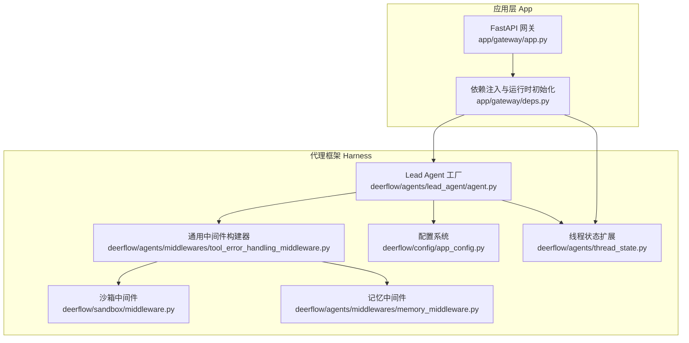
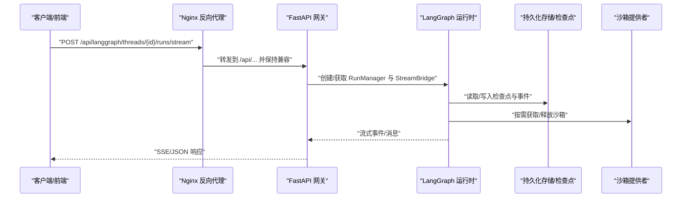
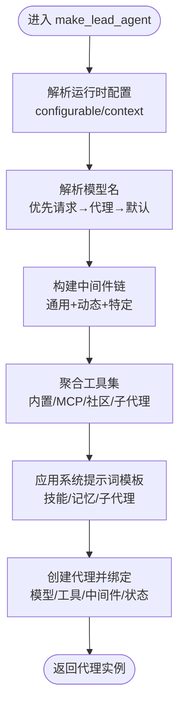
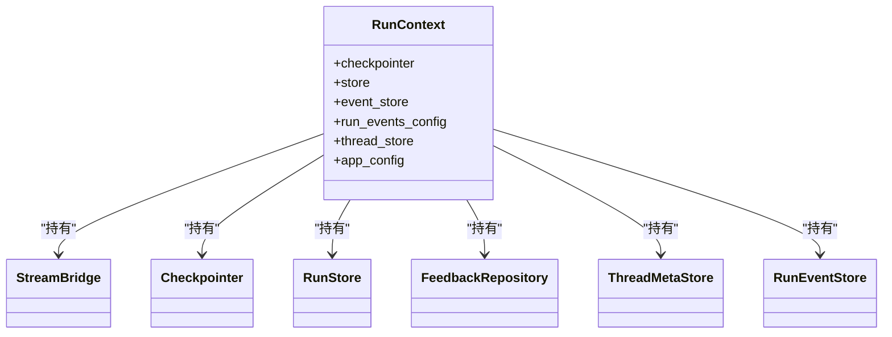
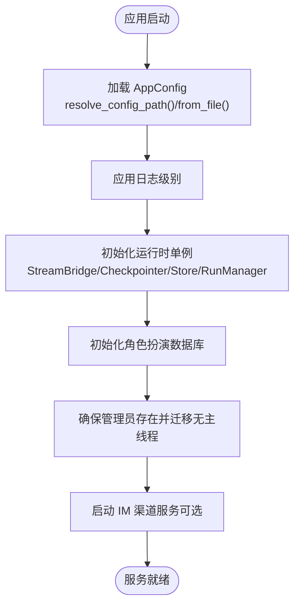
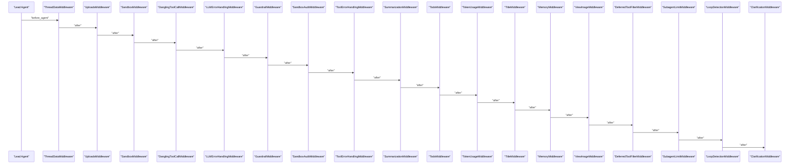
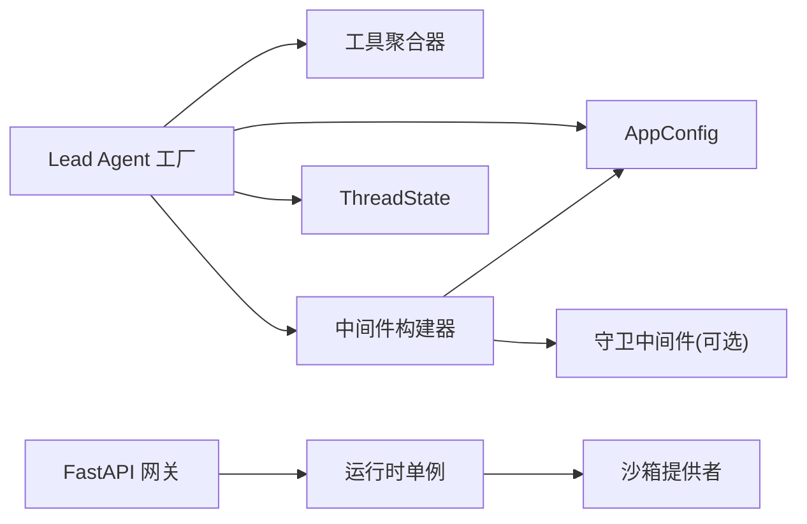

# LangGraph 服务器

<cite>
**本文引用的文件**
- [CLAUDE.md](file://backend/CLAUDE.md)
- [app.py](file://backend/app/gateway/app.py)
- [deps.py](file://backend/app/gateway/deps.py)
- [thread_state.py](file://backend/packages/harness/deerflow/agents/thread_state.py)
- [agent.py](file://backend/packages/harness/deerflow/agents/lead_agent/agent.py)
- [tool_error_handling_middleware.py](file://backend/packages/harness/deerflow/agents/middlewares/tool_error_handling_middleware.py)
- [app_config.py](file://backend/packages/harness/deerflow/config/app_config.py)
- [middleware.py](file://backend/packages/harness/deerflow/sandbox/middleware.py)
- [memory_middleware.py](file://backend/packages/harness/deerflow/agents/middlewares/memory_middleware.py)
</cite>

## 目录
1. [引言](#引言)
2. [项目结构](#项目结构)
3. [核心组件](#核心组件)
4. [架构总览](#架构总览)
5. [详细组件分析](#详细组件分析)
6. [依赖分析](#依赖分析)
7. [性能考虑](#性能考虑)
8. [故障排查指南](#故障排查指南)
9. [结论](#结论)
10. [附录](#附录)

## 引言
本文件面向 LangGraph 服务器（后端“网关 + 内嵌 LangGraph 运行时”）的技术文档，聚焦以下目标：
- 解释 LangGraph 服务器作为核心代理运行时的设计原理：Lead Agent 的创建与配置、Agent Runtime 的职责分工、Thread State 的扩展实现。
- 描述服务器启动流程、配置加载机制、以及与 LangChain/LangGraph 的集成方式。
- 说明服务器如何处理并发请求、管理代理生命周期、以及实现中间件链的执行。
- 提供可操作的配置示例与代码片段路径，指导如何扩展与定制服务器行为。

LangGraph 服务器在后端以 FastAPI 网关承载，同时内嵌 LangGraph 兼容的 Agent 运行时，通过 Nginx 将 /api/langgraph/* 路由到该运行时，形成统一入口与一致的代理执行体验。

## 项目结构
后端采用“Harness（可发布代理框架包）+ App（不可发布应用层）”分层设计，严格限制依赖方向：App 可导入 Harness，但 Harness 不应反向导入 App。应用层包含网关 API（FastAPI）、IM 渠道桥接等；Harness 包含 Agent 系统、工具、沙箱、模型、MCP、技能、配置等。



图表来源
- [app.py:248-431](file://backend/app/gateway/app.py#L248-L431)
- [deps.py:41-98](file://backend/app/gateway/deps.py#L41-L98)
- [app_config.py:91-467](file://backend/packages/harness/deerflow/config/app_config.py#L91-L467)
- [thread_state.py:48-56](file://backend/packages/harness/deerflow/agents/thread_state.py#L48-L56)
- [agent.py:343-447](file://backend/packages/harness/deerflow/agents/lead_agent/agent.py#L343-L447)
- [tool_error_handling_middleware.py:73-171](file://backend/packages/harness/deerflow/agents/middlewares/tool_error_handling_middleware.py#L73-L171)
- [middleware.py:21-84](file://backend/packages/harness/deerflow/sandbox/middleware.py#L21-L84)
- [memory_middleware.py:28-111](file://backend/packages/harness/deerflow/agents/middlewares/memory_middleware.py#L28-L111)

章节来源
- [CLAUDE.md:108-135](file://backend/CLAUDE.md#L108-L135)

## 核心组件
- Lead Agent 工厂：负责根据运行时配置动态创建代理实例，绑定模型、工具与中间件链，并设置系统提示词与状态模式。
- 中间件链：由通用中间件构建器生成，按严格顺序组装，覆盖线程数据、上传文件、沙箱生命周期、工具错误处理、守卫、审计、视图图像注入、计划模式、循环检测、澄清请求拦截等。
- Thread State 扩展：在基础 AgentState 上新增沙箱、线程数据、标题、工件、待办、上传文件、已查看图片等字段，并定义合并规则。
- 配置系统：集中解析 config.yaml 与 extensions_config.json，支持环境变量替换、版本检查、缓存与热重载。
- 网关与运行时：FastAPI 应用在生命周期中初始化 StreamBridge、Checkpointer、Store、RunManager 等单例，为 LangGraph 运行时提供基础设施。

章节来源
- [agent.py:343-447](file://backend/packages/harness/deerflow/agents/lead_agent/agent.py#L343-L447)
- [tool_error_handling_middleware.py:73-171](file://backend/packages/harness/deerflow/agents/middlewares/tool_error_handling_middleware.py#L73-L171)
- [thread_state.py:48-56](file://backend/packages/harness/deerflow/agents/thread_state.py#L48-L56)
- [app_config.py:91-467](file://backend/packages/harness/deerflow/config/app_config.py#L91-L467)
- [app.py:166-246](file://backend/app/gateway/app.py#L166-L246)
- [deps.py:41-98](file://backend/app/gateway/deps.py#L41-L98)

## 架构总览
LangGraph 服务器的运行时由“网关 + 内嵌 LangGraph 运行时”构成。Nginx 将 /api/langgraph/* 请求转发至网关的内嵌运行时，其余 /api/* 路由由网关自有路由处理。



图表来源
- [app.py:166-246](file://backend/app/gateway/app.py#L166-L246)
- [deps.py:41-98](file://backend/app/gateway/deps.py#L41-L98)

## 详细组件分析

### Lead Agent 创建与配置机制
- 动态模型选择：根据请求 configurable、自定义代理配置或全局默认模型解析最终模型名；若模型不支持思维模式则自动降级。
- 工具装配：从配置与 MCP、内置、社区、子代理工具中聚合可用工具，并结合技能允许工具策略进行过滤。
- 系统提示词：基于技能、记忆、子代理等上下文生成，支持引导计划模式与任务委托。
- 中间件链：通过通用构建器生成基础链，再注入动态上下文、摘要、计划、令牌用量、标题、记忆、视图图像、延迟工具过滤、子代理并发限制、循环检测、澄清拦截等。
- 状态模式：使用扩展后的 ThreadState，确保状态字段与合并规则满足多轮对话与工件管理需求。



图表来源
- [agent.py:343-447](file://backend/packages/harness/deerflow/agents/lead_agent/agent.py#L343-L447)
- [agent.py:240-318](file://backend/packages/harness/deerflow/agents/lead_agent/agent.py#L240-L318)
- [agent.py:350-447](file://backend/packages/harness/deerflow/agents/lead_agent/agent.py#L350-L447)
- [tool_error_handling_middleware.py:73-171](file://backend/packages/harness/deerflow/agents/middlewares/tool_error_handling_middleware.py#L73-L171)

章节来源
- [agent.py:343-447](file://backend/packages/harness/deerflow/agents/lead_agent/agent.py#L343-L447)
- [agent.py:240-318](file://backend/packages/harness/deerflow/agents/lead_agent/agent.py#L240-L318)

### Agent Runtime 的职责分工
- 运行时单例初始化：在网关生命周期中创建 StreamBridge、Checkpointer、Store、RunManager、RunStore、FeedbackRepository、ThreadStore、RunEventStore 等。
- 依赖注入：通过依赖函数在路由中按需获取单例，缺失时返回 503。
- 用户上下文：提供 RunContext 构造器，整合基础设施依赖与 AppConfig。
- 启停治理：生命周期钩子严格控制数据库连接、通道服务等资源的开启与关闭，避免 worker 卡死。



图表来源
- [deps.py:139-153](file://backend/app/gateway/deps.py#L139-L153)
- [deps.py:41-98](file://backend/app/gateway/deps.py#L41-L98)

章节来源
- [deps.py:41-98](file://backend/app/gateway/deps.py#L41-L98)
- [deps.py:139-153](file://backend/app/gateway/deps.py#L139-L153)

### Thread State 的扩展实现
- 字段扩展：在 AgentState 基础上新增 sandbox、thread_data、title、artifacts、todos、uploaded_files、viewed_images。
- 合并规则：
  - artifacts 使用去重合并，保留顺序；
  - viewed_images 支持清空（空字典）与覆盖合并。
- 与中间件协作：ThreadDataMiddleware/UploadsMiddleware/SandboxMiddleware 等在不同阶段填充/更新这些字段，确保线程隔离与状态一致性。

```mermaid
erDiagram
THREAD_STATE {
json sandbox
json thread_data
string title
array artifacts
array todos
array uploaded_files
json viewed_images
}
MERGE_ARTIFACTS {
note "去重合并"
}
MERGE_VIEWED_IMAGES {
note "空字典清空；新值覆盖旧值"
}
THREAD_STATE ||--o{ MERGE_ARTIFACTS : "artifacts 合并"
THREAD_STATE ||--o{ MERGE_VIEWED_IMAGES : "viewed_images 合并"
```

图表来源
- [thread_state.py:48-56](file://backend/packages/harness/deerflow/agents/thread_state.py#L48-L56)
- [thread_state.py:21-45](file://backend/packages/harness/deerflow/agents/thread_state.py#L21-L45)

章节来源
- [thread_state.py:48-56](file://backend/packages/harness/deerflow/agents/thread_state.py#L48-L56)

### 服务器启动流程与配置加载机制
- 启动阶段：
  - 加载配置并应用日志级别；
  - 初始化 LangGraph 运行时单例（StreamBridge、Checkpointer、Store、RunManager、RunStore、FeedbackRepository、ThreadStore、RunEventStore）；
  - 初始化角色扮演数据库；
  - 确保管理员用户存在并迁移无主线程元数据；
  - 启动 IM 渠道服务（如配置）。
- 配置加载：
  - 优先级：显式路径 > 环境变量 > 当前目录 config.yaml > 项目根目录 config.yaml；
  - 支持环境变量替换（以 $ 开头）；
  - 版本检查与升级提示；
  - 缓存 + mtime 检测的热重载策略。



图表来源
- [app.py:166-246](file://backend/app/gateway/app.py#L166-L246)
- [app_config.py:122-185](file://backend/packages/harness/deerflow/config/app_config.py#L122-L185)
- [app_config.py:357-398](file://backend/packages/harness/deerflow/config/app_config.py#L357-L398)

章节来源
- [app.py:166-246](file://backend/app/gateway/app.py#L166-L246)
- [app_config.py:122-185](file://backend/packages/harness/deerflow/config/app_config.py#L122-L185)
- [app_config.py:357-398](file://backend/packages/harness/deerflow/config/app_config.py#L357-L398)

### 与 LangChain/LangGraph 的集成方式
- 代理工厂签名兼容 LangGraph Server：make_lead_agent(config) 保持与 LangGraph 的约定一致。
- 中间件链遵循 LangChain AgentMiddleware 接口，保证与 LangGraph 的执行模型无缝衔接。
- 状态模式采用扩展后的 ThreadState，确保与 LangGraph 的状态序列化/还原兼容。
- 运行时上下文通过 RunContext 注入 Checkpointer、Store、EventStore、ThreadStore、AppConfig 等基础设施。

章节来源
- [agent.py:343-347](file://backend/packages/harness/deerflow/agents/lead_agent/agent.py#L343-L347)
- [deps.py:139-153](file://backend/app/gateway/deps.py#L139-L153)

### 并发请求处理与代理生命周期管理
- 并发模型：网关基于 FastAPI（uvicorn）处理并发请求；LangGraph 运行时通过 RunManager 维护运行生命周期。
- 生命周期：
  - 运行创建：通过 runs 路由创建/等待/取消运行，支持 SSE 流式输出；
  - 线程清理：删除 LangGraph 线程后，网关清理本地线程数据目录；
  - 沙箱复用：SandboxMiddleware 在同一线程内复用沙箱，避免频繁创建销毁。
- 中断与恢复：工具错误中间件将异常转换为 ToolMessage，避免中断整个运行；循环检测中间件可在重复工具调用时强制终止。

章节来源
- [app.py:417-425](file://backend/app/gateway/app.py#L417-L425)
- [middleware.py:21-84](file://backend/packages/harness/deerflow/sandbox/middleware.py#L21-L84)
- [tool_error_handling_middleware.py:24-71](file://backend/packages/harness/deerflow/agents/middlewares/tool_error_handling_middleware.py#L24-L71)

### 中间件链执行顺序与职责
中间件链严格遵循顺序，确保前置处理（线程数据、沙箱、上传、LLM 错误处理、守卫、审计、工具错误处理）与后置处理（摘要、计划、标题、记忆、视图图像、延迟工具过滤、子代理限制、循环检测、澄清拦截）的正确性。



图表来源
- [agent.py:240-318](file://backend/packages/harness/deerflow/agents/lead_agent/agent.py#L240-L318)
- [tool_error_handling_middleware.py:73-171](file://backend/packages/harness/deerflow/agents/middlewares/tool_error_handling_middleware.py#L73-L171)

章节来源
- [agent.py:240-318](file://backend/packages/harness/deerflow/agents/lead_agent/agent.py#L240-L318)
- [tool_error_handling_middleware.py:73-171](file://backend/packages/harness/deerflow/agents/middlewares/tool_error_handling_middleware.py#L73-L171)

### 记忆中间件与线程数据管理
- 记忆中间件在每次代理执行后，筛选用户输入与最终 AI 回复，加入去抖队列，异步进行事实抽取与记忆更新。
- 线程数据中间件负责为每个线程创建隔离的工作空间与上传/输出目录，支持线程删除后的本地清理。
- 视图图像中间件在视觉模型场景下注入 base64 图像数据，提升多模态交互能力。

章节来源
- [memory_middleware.py:28-111](file://backend/packages/harness/deerflow/agents/middlewares/memory_middleware.py#L28-L111)
- [agent.py:289-294](file://backend/packages/harness/deerflow/agents/lead_agent/agent.py#L289-L294)

## 依赖分析
- 组件耦合：
  - Lead Agent 依赖 AppConfig、模型工厂、工具聚合器、中间件构建器与 ThreadState；
  - 中间件构建器依赖 AppConfig 与 GuardrailProvider（可选）；
  - 网关依赖运行时单例并通过依赖函数暴露给路由；
  - 沙箱中间件依赖沙箱提供者，实现按线程分配与释放。
- 外部依赖：
  - LangChain/LangGraph 作为代理执行与状态管理的核心；
  - Nginx 作为统一入口与路由转发；
  - 数据库与持久化（SQLite/PostgreSQL）通过配置驱动。



图表来源
- [agent.py:343-447](file://backend/packages/harness/deerflow/agents/lead_agent/agent.py#L343-L447)
- [tool_error_handling_middleware.py:73-171](file://backend/packages/harness/deerflow/agents/middlewares/tool_error_handling_middleware.py#L73-L171)
- [app.py:248-431](file://backend/app/gateway/app.py#L248-L431)
- [deps.py:41-98](file://backend/app/gateway/deps.py#L41-L98)

章节来源
- [agent.py:343-447](file://backend/packages/harness/deerflow/agents/lead_agent/agent.py#L343-L447)
- [tool_error_handling_middleware.py:73-171](file://backend/packages/harness/deerflow/agents/middlewares/tool_error_handling_middleware.py#L73-L171)
- [app.py:248-431](file://backend/app/gateway/app.py#L248-L431)
- [deps.py:41-98](file://backend/app/gateway/deps.py#L41-L98)

## 性能考虑
- 沙箱复用：SandboxMiddleware 默认惰性初始化并在首次工具调用时获取沙箱，减少不必要的初始化开销；同一线程内复用沙箱避免频繁创建/销毁。
- 中间件顺序优化：将摘要、计划、令牌用量、标题、记忆等放在链路中靠前位置，降低后续处理成本；将澄清拦截置于最后，避免影响其他中间件的上下文注入。
- 队列与去抖：记忆中间件使用去抖队列批量处理，降低 LLM 调用频率与 IO 压力。
- 日志级别：通过配置应用日志级别，避免第三方库噪声干扰定位。

## 故障排查指南
- 配置问题：
  - 检查 config.yaml 是否存在且版本匹配；必要时执行升级命令合并新字段。
  - 确认环境变量替换是否正确（以 $ 开头），避免因未设置导致解析失败。
- 运行时问题：
  - 若出现“配置不可用/运行时单例缺失”，检查网关生命周期初始化是否完成。
  - 关注中间件异常转换：工具错误中间件会将异常转为 ToolMessage，便于继续运行；若出现持续失败，检查具体工具实现与权限。
- 沙箱问题：
  - 确认沙箱提供者配置正确；若沙箱无法释放，检查中间件 after_agent 调用链。
- 记忆问题：
  - 确认记忆开关与注入开关已启用；检查去抖时间与事实阈值配置。

章节来源
- [app_config.py:235-278](file://backend/packages/harness/deerflow/config/app_config.py#L235-L278)
- [app_config.py:280-302](file://backend/packages/harness/deerflow/config/app_config.py#L280-L302)
- [deps.py:105-136](file://backend/app/gateway/deps.py#L105-L136)
- [tool_error_handling_middleware.py:24-71](file://backend/packages/harness/deerflow/agents/middlewares/tool_error_handling_middleware.py#L24-L71)
- [middleware.py:67-83](file://backend/packages/harness/deerflow/sandbox/middleware.py#L67-L83)
- [memory_middleware.py:63-111](file://backend/packages/harness/deerflow/agents/middlewares/memory_middleware.py#L63-L111)

## 结论
LangGraph 服务器通过“网关 + 内嵌运行时”的架构，将 LangGraph 的执行能力与 FastAPI 的 API 能力有机结合。其核心在于：
- 可插拔的 Lead Agent 工厂与中间件链，支持按需启用/禁用能力；
- 扩展的 Thread State 与严格的中间件顺序，保障状态一致性与可观测性；
- 完整的配置系统与生命周期管理，确保在生产环境中稳定运行。

## 附录
- 配置示例与路径参考（请参阅对应文件以获取完整结构与字段说明）：
  - 主配置加载与优先级：[app_config.py:122-185](file://backend/packages/harness/deerflow/config/app_config.py#L122-L185)
  - 环境变量解析：[app_config.py:280-302](file://backend/packages/harness/deerflow/config/app_config.py#L280-L302)
  - 配置版本检查与升级提示：[app_config.py:235-278](file://backend/packages/harness/deerflow/config/app_config.py#L235-L278)
  - 运行时单例初始化：[deps.py:41-98](file://backend/app/gateway/deps.py#L41-L98)
  - 网关健康检查与路由挂载：[app.py:417-425](file://backend/app/gateway/app.py#L417-L425)
  - Lead Agent 工厂与中间件链构建：[agent.py:240-318](file://backend/packages/harness/deerflow/agents/lead_agent/agent.py#L240-L318)
  - 通用中间件构建器（含守卫与沙箱审计）：[tool_error_handling_middleware.py:73-171](file://backend/packages/harness/deerflow/agents/middlewares/tool_error_handling_middleware.py#L73-L171)
  - Thread State 扩展与合并规则：[thread_state.py:48-56](file://backend/packages/harness/deerflow/agents/thread_state.py#L48-L56)
  - 沙箱中间件生命周期：[middleware.py:21-84](file://backend/packages/harness/deerflow/sandbox/middleware.py#L21-L84)
  - 记忆中间件队列与过滤逻辑：[memory_middleware.py:28-111](file://backend/packages/harness/deerflow/agents/middlewares/memory_middleware.py#L28-L111)