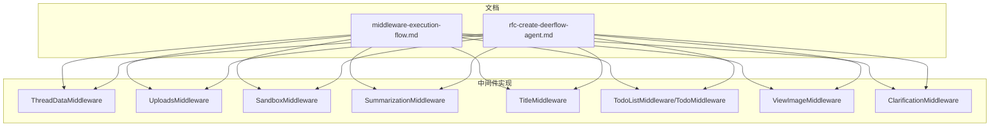
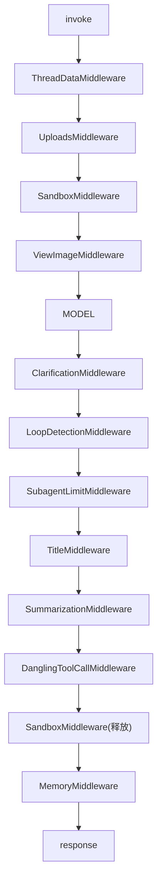
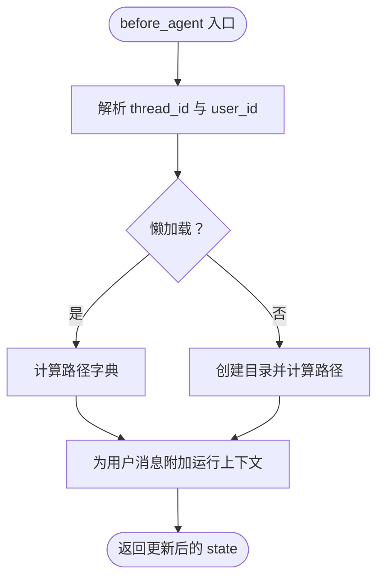
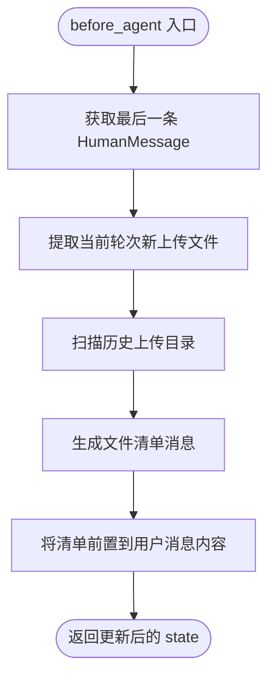
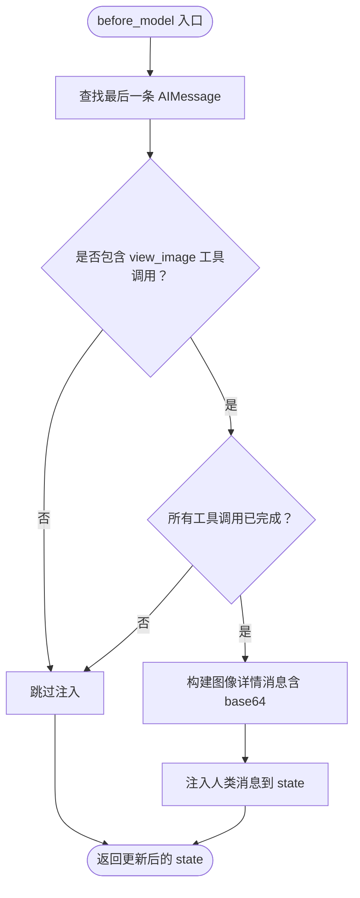
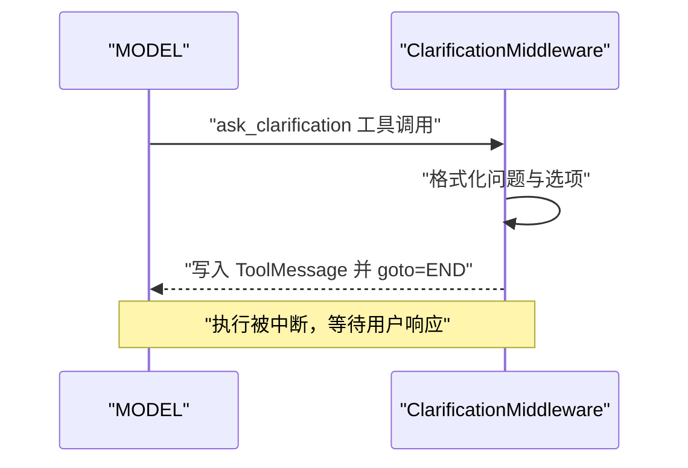
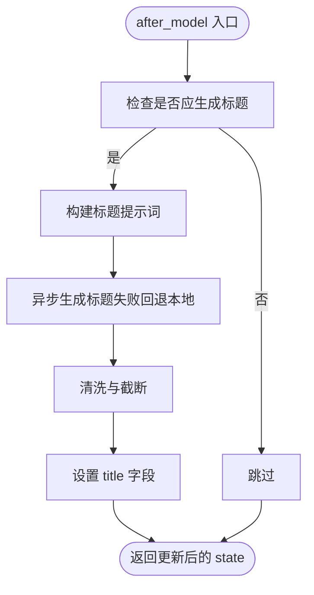
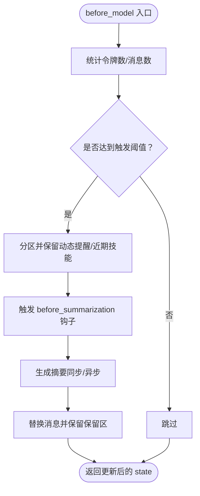
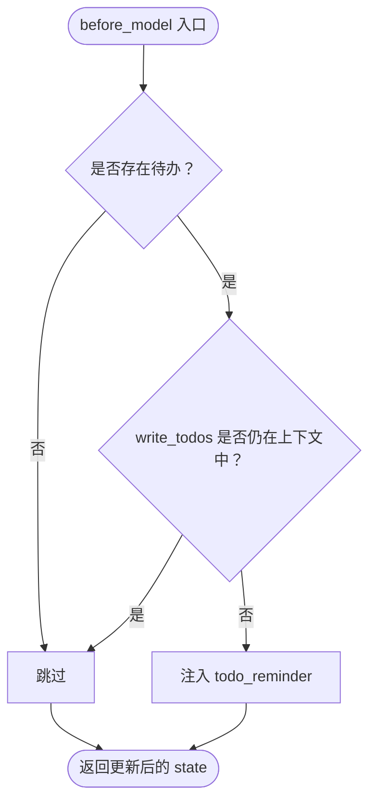
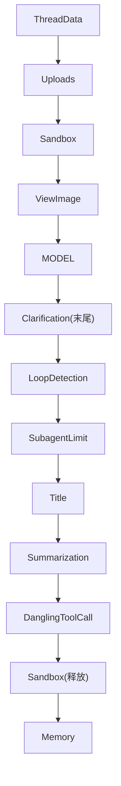

# 中间件链

<cite>
**本文引用的文件**
- [middleware-execution-flow.md](file://backend/docs/middleware-execution-flow.md)
- [rfc-create-deerflow-agent.md](file://backend/docs/rfc-create-deerflow-agent.md)
- [thread_data_middleware.py](file://backend/packages/harness/deerflow/agents/middlewares/thread_data_middleware.py)
- [uploads_middleware.py](file://backend/packages/harness/deerflow/agents/middlewares/uploads_middleware.py)
- [summarization_middleware.py](file://backend/packages/harness/deerflow/agents/middlewares/summarization_middleware.py)
- [title_middleware.py](file://backend/packages/harness/deerflow/agents/middlewares/title_middleware.py)
- [todo_middleware.py](file://backend/packages/harness/deerflow/agents/middlewares/todo_middleware.py)
- [view_image_middleware.py](file://backend/packages/harness/deerflow/agents/middlewares/view_image_middleware.py)
- [clarification_middleware.py](file://backend/packages/harness/deerflow/agents/middlewares/clarification_middleware.py)
</cite>

## 目录
1. [简介](#简介)
2. [项目结构](#项目结构)
3. [核心组件](#核心组件)
4. [架构总览](#架构总览)
5. [详细组件分析](#详细组件分析)
6. [依赖分析](#依赖分析)
7. [性能考虑](#性能考虑)
8. [故障排查指南](#故障排查指南)
9. [结论](#结论)
10. [附录](#附录)

## 简介
本文件面向中间件链系统，系统化阐述九个核心中间件的职责、执行顺序、相互关系与扩展方式。重点包括：
- 执行顺序与阶段划分：before_agent、before_model、after_model、after_agent
- 中间件职责与数据流：ThreadDataMiddleware、UploadsMiddleware、SandboxMiddleware、SummarizationMiddleware、TitleMiddleware、TodoListMiddleware、ViewImageMiddleware、ClarificationMiddleware
- 配置与扩展：通过 RuntimeFeatures 与装饰器定位插入，以及自定义中间件开发与调试建议
- 执行流程与时序：基于文档中的时序图与管道模型进行可视化说明

## 项目结构
中间件链位于后端 harness 包下的 middlewares 子模块，配合文档中的执行流程与 RFC 规范，形成“管道式”而非“洋葱式”的执行模型。核心文件组织如下：
- 执行流程与阶段说明：backend/docs/middleware-execution-flow.md
- 中间件装配与定位：backend/docs/rfc-create-deerflow-agent.md
- 中间件实现：backend/packages/harness/deerflow/agents/middlewares/*.py

图表来源
- [middleware-execution-flow.md:26-75](file://backend/docs/middleware-execution-flow.md#L26-L75)
- [rfc-create-deerflow-agent.md:190-235](file://backend/docs/rfc-create-deerflow-agent.md#L190-L235)

章节来源
- [middleware-execution-flow.md:1-292](file://backend/docs/middleware-execution-flow.md#L1-L292)
- [rfc-create-deerflow-agent.md:30-504](file://backend/docs/rfc-create-deerflow-agent.md#L30-L504)

## 核心组件
本节概述九个核心中间件在链路中的角色与职责，以及它们在不同阶段的钩子使用情况。

- ThreadDataMiddleware
  - 阶段：before_agent
  - 职责：解析线程 ID，计算并准备线程工作区、上传区、输出区路径；必要时延迟创建目录；为用户输入消息附加运行上下文信息
  - 关键点：与 SandboxMiddleware 的依赖关系（ThreadData 在 Sandbox 之前）

- UploadsMiddleware
  - 阶段：before_agent
  - 职责：扫描当前轮次上传文件与历史上传文件，生成结构化文件清单与预览；将文件信息前置到用户消息内容中，保留原始 additional_kwargs 以便前端读取

- SandboxMiddleware
  - 阶段：before_agent（获取）、after_agent（释放）
  - 职责：在 before_agent 获取沙箱资源，在 after_agent 释放；在整个链路中仅此中间件具备对称的 before/after 生命周期

- ViewImageMiddleware
  - 阶段：before_model（每轮）
  - 职责：当上一轮存在 view_image 工具调用且已完成，自动注入包含 base64 图像的数据消息，使模型可直接“看到”图像

- ClarificationMiddleware
  - 阶段：wrap_tool_call（拦截）
  - 职责：拦截 ask_clarification 工具调用，格式化为用户可见的消息并中断执行，等待用户响应后再继续

- SubagentLimitMiddleware
  - 阶段：after_model（每轮）
  - 职责：在每轮 after_model 阶段对任务进行截断或限制，防止子代理任务无限增长

- TitleMiddleware
  - 阶段：after_model（每轮）
  - 职责：在首次完整对话交换后生成标题；支持本地回退与异步生成

- SummarizationMiddleware
  - 阶段：before_model（每轮）
  - 职责：根据令牌数或消息数阈值触发摘要压缩，保留动态上下文提醒与近期技能包，生成摘要人类消息

- TodoListMiddleware/TodoMiddleware
  - 阶段：before_model（每轮）、after_model（每轮）
  - 职责：在上下文丢失时注入待办提醒；在模型无工具调用但待办未完成时强制回到模型节点继续推进

章节来源
- [middleware-execution-flow.md:7-23](file://backend/docs/middleware-execution-flow.md#L7-L23)
- [rfc-create-deerflow-agent.md:480-502](file://backend/docs/rfc-create-deerflow-agent.md#L480-L502)

## 架构总览
中间件链采用“管道式”执行模型，遵循以下核心规则：
- before_agent：正序执行（0→N）
- before_model：正序执行（0→N）
- after_model：反序执行（N→0）
- after_agent：反序执行（N→0）
- 列表末尾的中间件（ClarificationMiddleware）在 after_model 阶段最先执行，用于拦截 ask_clarification

图表来源
- [middleware-execution-flow.md:32-62](file://backend/docs/middleware-execution-flow.md#L32-L62)

章节来源
- [middleware-execution-flow.md:26-75](file://backend/docs/middleware-execution-flow.md#L26-L75)

## 详细组件分析

### ThreadDataMiddleware
- 职责与行为
  - 解析线程 ID（运行时上下文或 LangGraph 配置）
  - 计算线程相关路径（工作区、上传区、输出区）
  - 可选择惰性初始化（仅计算路径，按需创建目录）或急切初始化（立即创建）
  - 为用户输入消息附加运行 ID 与时间戳等上下文信息
- 关键依赖
  - Paths 与用户上下文解析
  - 与 SandboxMiddleware 的硬依赖：ThreadData 必须在 Sandbox 之前
- 执行时机
  - before_agent：仅执行一次

图表来源
- [thread_data_middleware.py:81-119](file://backend/packages/harness/deerflow/agents/middlewares/thread_data_middleware.py#L81-L119)

章节来源
- [thread_data_middleware.py:1-119](file://backend/packages/harness/deerflow/agents/middlewares/thread_data_middleware.py#L1-L119)

### UploadsMiddleware
- 职责与行为
  - 从当前用户消息的附加字段提取新上传文件元数据
  - 扫描历史上传文件，结合转换后的 Markdown 提纲或预览生成结构化清单
  - 将文件清单前置到用户消息内容中，保留原始 additional_kwargs 供前端消费
- 关键点
  - 支持字符串与多模态列表两种内容格式
  - 为新旧文件分别提取提纲与预览，便于模型检索
- 执行时机
  - before_agent：仅执行一次

图表来源
- [uploads_middleware.py:187-295](file://backend/packages/harness/deerflow/agents/middlewares/uploads_middleware.py#L187-L295)

章节来源
- [uploads_middleware.py:1-296](file://backend/packages/harness/deerflow/agents/middlewares/uploads_middleware.py#L1-L296)

### SandboxMiddleware
- 职责与行为
  - before_agent：获取沙箱资源（提供工作区、上传区、输出区隔离）
  - after_agent：释放沙箱资源
- 关键点
  - 唯一具备对称生命周期的中间件，形成天然的“外层进入→外层退出”
- 执行时机
  - before_agent、after_agent：各执行一次

章节来源
- [rfc-create-deerflow-agent.md:205-208](file://backend/docs/rfc-create-deerflow-agent.md#L205-L208)

### ViewImageMiddleware
- 职责与行为
  - 每轮 before_model：检查上一轮 AIMessage 是否包含 view_image 工具调用且全部完成
  - 若满足条件，注入包含 base64 图像数据的人类消息，使模型可直接分析图像
- 关键点
  - 仅在 before_model 阶段执行，每轮对话都会检查
  - 避免重复注入（若已存在对应人类消息则跳过）

图表来源
- [view_image_middleware.py:190-223](file://backend/packages/harness/deerflow/agents/middlewares/view_image_middleware.py#L190-L223)

章节来源
- [view_image_middleware.py:1-223](file://backend/packages/harness/deerflow/agents/middlewares/view_image_middleware.py#L1-L223)

### ClarificationMiddleware
- 职责与行为
  - wrap_tool_call：拦截 ask_clarification 工具调用
  - 格式化为用户友好的消息，写入 ToolMessage 并返回命令中断执行（goto=END）
- 关键点
  - 作为链路末尾的中间件，after_model 反序时最先执行
  - 保证在任何后续中间件之前拦截澄清请求

图表来源
- [clarification_middleware.py:161-204](file://backend/packages/harness/deerflow/agents/middlewares/clarification_middleware.py#L161-L204)

章节来源
- [clarification_middleware.py:1-204](file://backend/packages/harness/deerflow/agents/middlewares/clarification_middleware.py#L1-L204)

### SubagentLimitMiddleware
- 职责与行为
  - after_model：每轮结束后对任务进行截断或限制，防止子代理任务无限增长
- 关键点
  - 与 Task 工具配合，确保任务闭环

章节来源
- [rfc-create-deerflow-agent.md:222-224](file://backend/docs/rfc-create-deerflow-agent.md#L222-L224)

### TitleMiddleware
- 职责与行为
  - after_model：在首次完整对话交换后生成标题
  - 支持本地回退与异步生成；解析模型输出并进行清洗
- 关键点
  - 仅在满足“首次完整对话交换”条件下触发
  - 通过 RunnableConfig 标记 middleware:title 便于追踪

图表来源
- [title_middleware.py:178-185](file://backend/packages/harness/deerflow/agents/middlewares/title_middleware.py#L178-L185)

章节来源
- [title_middleware.py:1-185](file://backend/packages/harness/deerflow/agents/middlewares/title_middleware.py#L1-L185)

### SummarizationMiddleware
- 职责与行为
  - before_model：根据令牌数或消息数阈值触发摘要压缩
  - 保留动态上下文提醒与近期技能包，生成摘要人类消息
  - 支持同步与异步实现
- 关键点
  - 与动态上下文提醒协同，避免摘要导致提醒错位
  - 可注册 before_summarization 钩子

图表来源
- [summarization_middleware.py:126-211](file://backend/packages/harness/deerflow/agents/middlewares/summarization_middleware.py#L126-L211)

章节来源
- [summarization_middleware.py:1-410](file://backend/packages/harness/deerflow/agents/middlewares/summarization_middleware.py#L1-L410)

### TodoListMiddleware/TodoMiddleware
- 职责与行为
  - before_model：当 write_todos 工具调用被摘要移出上下文窗口时，注入提醒消息
  - after_model：当模型无工具调用但仍有未完成待办时，强制回到模型节点继续推进
  - 支持最大提醒次数上限，防止死循环
- 关键点
  - 与 PlanningState 协作，维护 todos 列表
  - 通过 jump_to 指令控制流程

图表来源
- [todo_middleware.py:67-112](file://backend/packages/harness/deerflow/agents/middlewares/todo_middleware.py#L67-L112)

章节来源
- [todo_middleware.py:1-180](file://backend/packages/harness/deerflow/agents/middlewares/todo_middleware.py#L1-L180)

## 依赖分析
- 硬依赖
  - ThreadData → Uploads → Sandbox：before_agent 阶段必须严格顺序
  - ClarificationMiddleware 必须在 after_model 反序时最先执行（列表末尾）
- 执行模式
  - 管道式：大部分中间件仅使用单一钩子；SandboxMiddleware 为唯一对称钩子
  - before_model / after_model 每轮循环均执行

图表来源
- [middleware-execution-flow.md:265-269](file://backend/docs/middleware-execution-flow.md#L265-L269)

章节来源
- [middleware-execution-flow.md:265-292](file://backend/docs/middleware-execution-flow.md#L265-L292)

## 性能考虑
- 惰性初始化：ThreadDataMiddleware 支持惰性初始化，减少不必要的磁盘 IO
- 摘要策略：SummarizationMiddleware 可配置触发阈值与保留策略，平衡上下文长度与信息保留
- 异步生成：TitleMiddleware 支持异步标题生成并在失败时回退本地生成，提升鲁棒性
- 文件扫描：UploadsMiddleware 仅扫描有效文件并利用转换后的提纲/预览，降低无效 IO

## 故障排查指南
- 线程 ID 缺失
  - 现象：ThreadDataMiddleware 抛出错误
  - 排查：确认运行时上下文或 LangGraph 配置中存在 thread_id
  - 参考：[thread_data_middleware.py:82-91](file://backend/packages/harness/deerflow/agents/middlewares/thread_data_middleware.py#L82-L91)
- 沙箱资源未释放
  - 现象：after_agent 未执行或异常
  - 排查：确认 SandboxMiddleware 的 after_agent 是否在链路末尾
  - 参考：[rfc-create-deerflow-agent.md:205-208](file://backend/docs/rfc-create-deerflow-agent.md#L205-L208)
- 图像未注入
  - 现象：模型无法看到图像
  - 排查：确认上一轮 AIMessage 包含 view_image 工具调用且全部完成；检查 ViewImageMiddleware 是否被注入
  - 参考：[view_image_middleware.py:129-166](file://backend/packages/harness/deerflow/agents/middlewares/view_image_middleware.py#L129-L166)
- 标题未生成
  - 现象：after_model 后未出现标题
  - 排查：确认满足“首次完整对话交换”条件；检查 TitleMiddleware 配置与异步生成日志
  - 参考：[title_middleware.py:69-89](file://backend/packages/harness/deerflow/agents/middlewares/title_middleware.py#L69-L89)
- 摘要未触发
  - 现象：上下文过长未压缩
  - 排查：检查 SummarizationMiddleware 的触发阈值与 token 计数逻辑
  - 参考：[summarization_middleware.py:132-159](file://backend/packages/harness/deerflow/agents/middlewares/summarization_middleware.py#L132-L159)
- 待办未推进
  - 现象：模型给出最终回复但待办未完成
  - 排查：确认 TodoMiddleware 的 after_model 是否注入提醒并允许跳转；检查提醒次数上限
  - 参考：[todo_middleware.py:117-170](file://backend/packages/harness/deerflow/agents/middlewares/todo_middleware.py#L117-L170)

章节来源
- [thread_data_middleware.py:82-91](file://backend/packages/harness/deerflow/agents/middlewares/thread_data_middleware.py#L82-L91)
- [view_image_middleware.py:129-166](file://backend/packages/harness/deerflow/agents/middlewares/view_image_middleware.py#L129-L166)
- [title_middleware.py:69-89](file://backend/packages/harness/deerflow/agents/middlewares/title_middleware.py#L69-L89)
- [summarization_middleware.py:132-159](file://backend/packages/harness/deerflow/agents/middlewares/summarization_middleware.py#L132-L159)
- [todo_middleware.py:117-170](file://backend/packages/harness/deerflow/agents/middlewares/todo_middleware.py#L117-L170)

## 结论
中间件链采用“管道式”而非“洋葱式”，强调阶段化的顺序执行与每轮循环的持续处理。九个核心中间件在不同阶段承担明确职责：ThreadData/Uploads/Sandbox 负责环境与上下文准备，ViewImage/Clarification 负责感知与交互，SubagentLimit/Title/Summarization/Todo 负责流程控制与上下文管理。通过 RuntimeFeatures 与装饰器定位，用户可以灵活替换与扩展中间件，同时保持稳定的执行顺序与依赖关系。

## 附录

### 中间件配置与扩展
- RuntimeFeatures
  - 通过 features=RuntimeFeatures(...) 替换内置中间件实现
  - 支持布尔开关与实例替换
- extra_middleware
  - 通过 @Next/@Prev 装饰器声明插入位置
  - 仅影响主 Agent 链
- 示例参考
  - [rfc-create-deerflow-agent.md:153-188](file://backend/docs/rfc-create-deerflow-agent.md#L153-L188)
  - [rfc-create-deerflow-agent.md:366-386](file://backend/docs/rfc-create-deerflow-agent.md#L366-L386)

章节来源
- [rfc-create-deerflow-agent.md:153-188](file://backend/docs/rfc-create-deerflow-agent.md#L153-L188)
- [rfc-create-deerflow-agent.md:366-386](file://backend/docs/rfc-create-deerflow-agent.md#L366-L386)