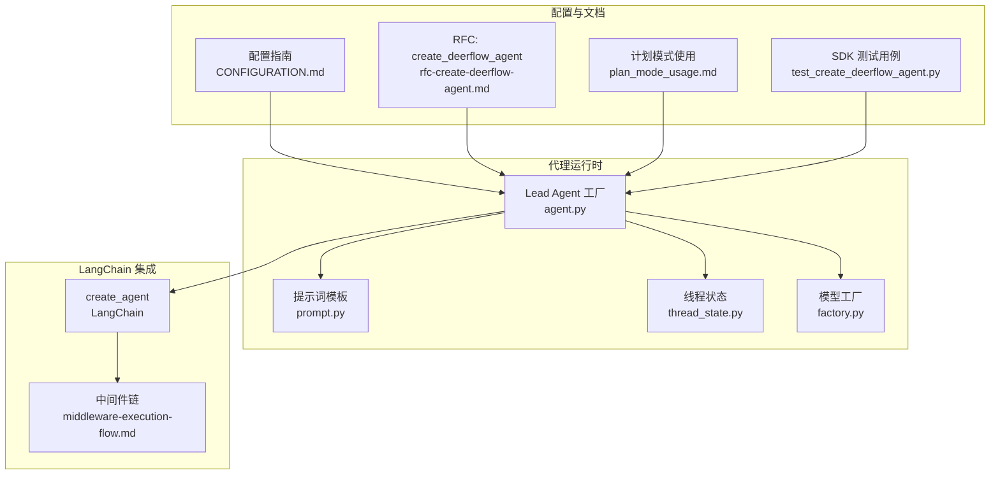
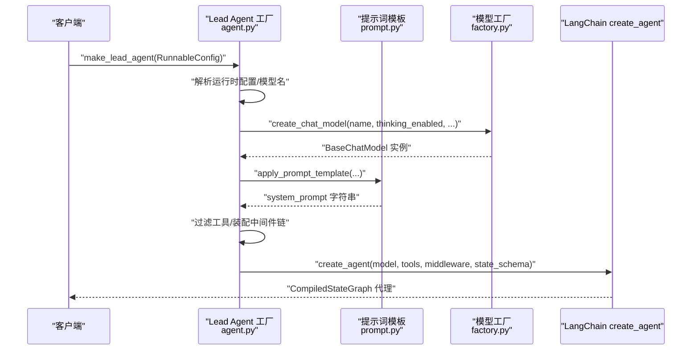
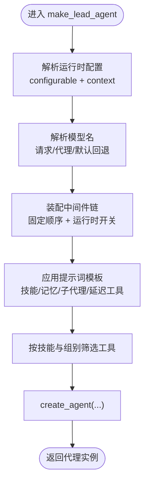
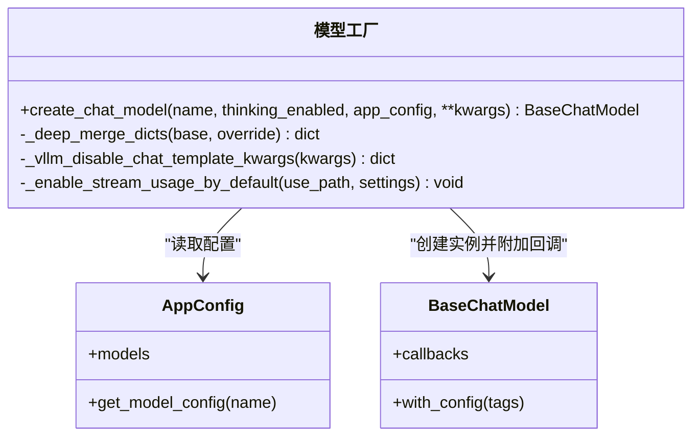
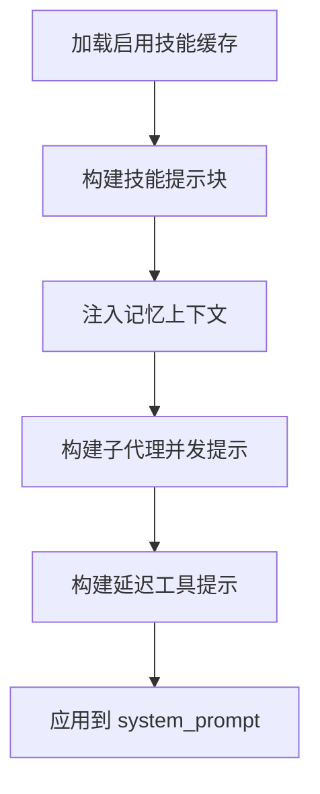
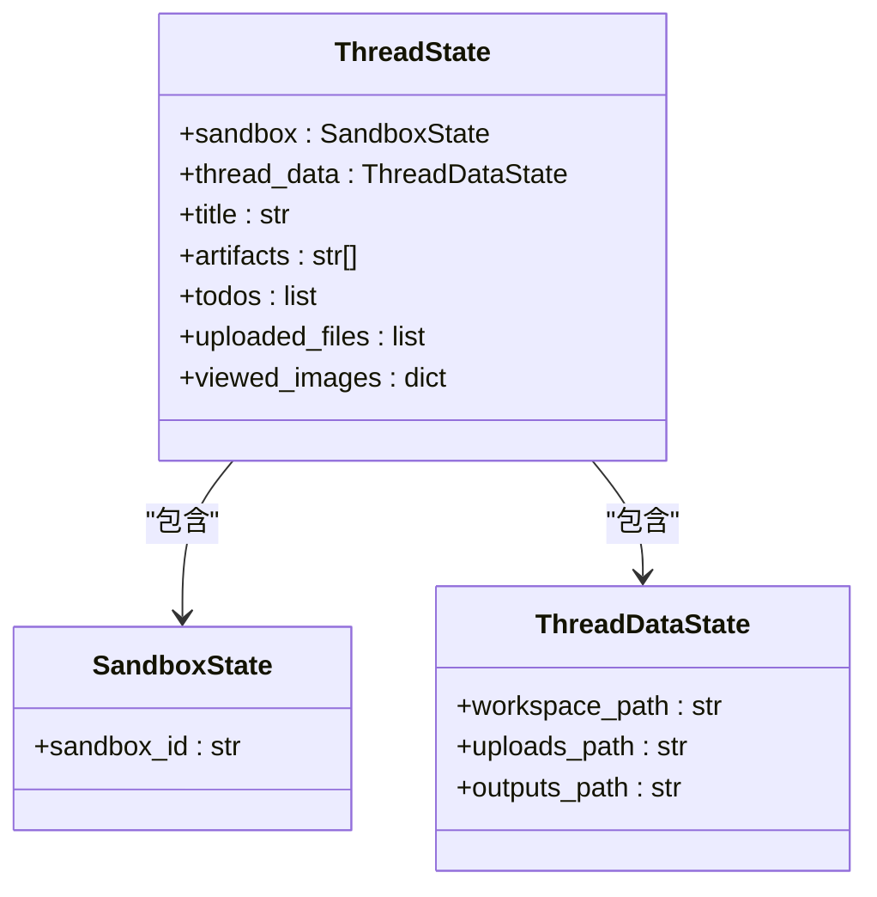
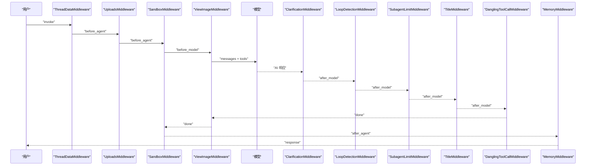
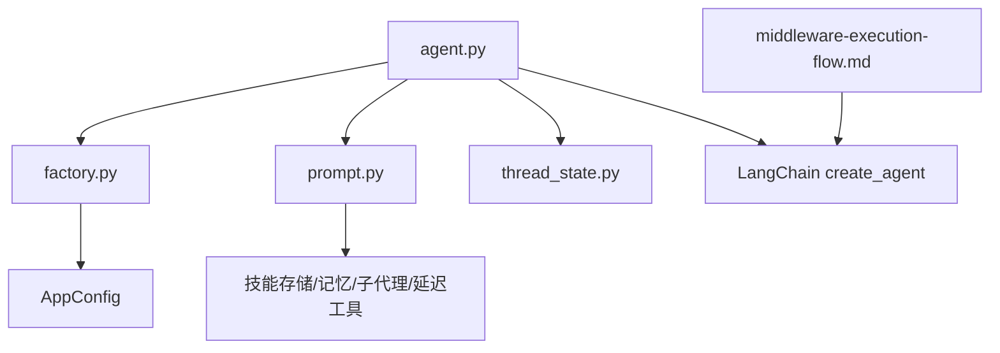

# 代理运行时

<cite>
**本文引用的文件**
- [agent.py](file://backend/packages/harness/deerflow/agents/lead_agent/agent.py)
- [factory.py](file://backend/packages/harness/deerflow/models/factory.py)
- [prompt.py](file://backend/packages/harness/deerflow/agents/lead_agent/prompt.py)
- [thread_state.py](file://backend/packages/harness/deerflow/agents/thread_state.py)
- [rfc-create-deerflow-agent.md](file://backend/docs/rfc-create-deerflow-agent.md)
- [CONFIGURATION.md](file://backend/docs/CONFIGURATION.md)
- [middleware-execution-flow.md](file://backend/docs/middleware-execution-flow.md)
- [plan_mode_usage.md](file://backend/docs/plan_mode_usage.md)
- [test_create_deerflow_agent.py](file://backend/tests/test_create_deerflow_agent.py)
</cite>

## 目录
1. [简介](#简介)
2. [项目结构](#项目结构)
3. [核心组件](#核心组件)
4. [架构总览](#架构总览)
5. [详细组件分析](#详细组件分析)
6. [依赖分析](#依赖分析)
7. [性能考虑](#性能考虑)
8. [故障排查指南](#故障排查指南)
9. [结论](#结论)
10. [附录](#附录)

## 简介
本技术文档面向“代理运行时系统”，聚焦 Lead Agent 的创建、配置参数、生命周期管理、用户输入处理、工具调用、对话历史管理，以及与 LangChain 的集成方式、模型工厂的使用、工具系统的协调机制。文档还提供最佳实践与性能优化建议，并给出可直接参考的代码示例路径，帮助开发者快速创建自定义代理、配置参数、处理生命周期事件。

## 项目结构
代理运行时系统主要由以下模块构成：
- Lead Agent 工厂与中间件链：负责代理实例构建、中间件装配、提示词模板应用与工具筛选。
- 模型工厂：负责从配置解析并创建 LLM 实例，支持多种提供商与思维/推理模式。
- 提示词模板与技能系统：负责动态注入技能、记忆、子代理、延迟工具等上下文。
- 线程状态：定义代理的状态结构与合并规则，支撑多轮对话与中间态共享。
- 配置与文档：提供配置项说明、中间件执行时序、计划模式使用指南与测试用例。

**图表来源**
- [agent.py:343-447](file://backend/packages/harness/deerflow/agents/lead_agent/agent.py#L343-L447)
- [prompt.py:768-800](file://backend/packages/harness/deerflow/agents/lead_agent/prompt.py#L768-L800)
- [thread_state.py:48-56](file://backend/packages/harness/deerflow/agents/thread_state.py#L48-L56)
- [factory.py:50-158](file://backend/packages/harness/deerflow/models/factory.py#L50-L158)
- [middleware-execution-flow.md:32-264](file://backend/docs/middleware-execution-flow.md#L32-L264)
- [CONFIGURATION.md:1-377](file://backend/docs/CONFIGURATION.md#L1-L377)
- [rfc-create-deerflow-agent.md:1-504](file://backend/docs/rfc-create-deerflow-agent.md#L1-L504)
- [plan_mode_usage.md:48-182](file://backend/docs/plan_mode_usage.md#L48-L182)
- [test_create_deerflow_agent.py:1-926](file://backend/tests/test_create_deerflow_agent.py#L1-L926)

**章节来源**
- [agent.py:1-447](file://backend/packages/harness/deerflow/agents/lead_agent/agent.py#L1-L447)
- [factory.py:1-158](file://backend/packages/harness/deerflow/models/factory.py#L1-L158)
- [prompt.py:1-824](file://backend/packages/harness/deerflow/agents/lead_agent/prompt.py#L1-L824)
- [thread_state.py:1-56](file://backend/packages/harness/deerflow/agents/thread_state.py#L1-L56)
- [CONFIGURATION.md:1-377](file://backend/docs/CONFIGURATION.md#L1-L377)
- [rfc-create-deerflow-agent.md:1-504](file://backend/docs/rfc-create-deerflow-agent.md#L1-L504)
- [middleware-execution-flow.md:32-264](file://backend/docs/middleware-execution-flow.md#L32-L264)
- [plan_mode_usage.md:48-182](file://backend/docs/plan_mode_usage.md#L48-L182)
- [test_create_deerflow_agent.py:1-926](file://backend/tests/test_create_deerflow_agent.py#L1-L926)

## 核心组件
- Lead Agent 工厂：负责解析运行时配置、模型名称解析、工具筛选、提示词模板应用与中间件链装配，最终返回 LangChain 可编译的代理。
- 模型工厂：负责从配置解析模型类与参数，处理思维/推理模式、流式用量统计、第三方网关适配等。
- 提示词模板与技能系统：负责动态加载启用的技能、记忆注入、子代理并发限制、延迟工具注册等。
- 线程状态：定义代理状态结构（如沙箱、线程数据、标题、工件、待办、上传文件、查看过的图片等），并提供合并规则。
- 中间件链：定义 before_agent/before_model/after_model/after_agent 的执行顺序与职责边界，确保线程数据、沙箱、图像注入、标题生成、记忆入队等有序执行。

**章节来源**
- [agent.py:343-447](file://backend/packages/harness/deerflow/agents/lead_agent/agent.py#L343-L447)
- [factory.py:50-158](file://backend/packages/harness/deerflow/models/factory.py#L50-L158)
- [prompt.py:768-800](file://backend/packages/harness/deerflow/agents/lead_agent/prompt.py#L768-L800)
- [thread_state.py:48-56](file://backend/packages/harness/deerflow/agents/thread_state.py#L48-L56)
- [middleware-execution-flow.md:32-264](file://backend/docs/middleware-execution-flow.md#L32-L264)

## 架构总览
代理运行时采用“工厂 + 中间件链 + LangChain 集成”的架构。Lead Agent 工厂根据运行时配置与应用配置，装配中间件链并应用提示词模板，最终委托 LangChain 的 create_agent 创建可编译的代理。模型工厂负责统一创建 LLM 实例，确保不同提供商的一致行为与可观测性。

**图表来源**
- [agent.py:343-447](file://backend/packages/harness/deerflow/agents/lead_agent/agent.py#L343-L447)
- [factory.py:50-158](file://backend/packages/harness/deerflow/models/factory.py#L50-L158)
- [prompt.py:768-800](file://backend/packages/harness/deerflow/agents/lead_agent/prompt.py#L768-L800)

## 详细组件分析

### Lead Agent 工厂与生命周期
- 配置解析：从 RunnableConfig 的 configurable 与 context 合并运行时配置；支持模型名、思维模式、推理强度、计划模式、子代理并发限制、引导模式等。
- 模型解析：优先使用请求中的模型名，其次使用代理配置中的模型，再回退到应用配置默认模型；若请求模型无效则警告并回退。
- 中间件装配：按固定顺序装配 ThreadData、Uploads、Sandbox、DanglingToolCall、ToolErrorHandling、Summarization、Todo、Title、Memory、ViewImage、SubagentLimit、LoopDetection、Clarification；支持按运行时开关与特性替换。
- 提示词模板：动态注入技能、记忆、子代理并发限制、延迟工具、ACP 任务等上下文。
- 工具筛选：按技能白名单与组别筛选可用工具，支持引导模式下的特殊工具。
- 生命周期事件：代理创建时注入运行元数据（agent_name、model_name、thinking_enabled、reasoning_effort、is_plan_mode、tool_groups、available_skills），便于追踪与审计。

**图表来源**
- [agent.py:29-36](file://backend/packages/harness/deerflow/agents/lead_agent/agent.py#L29-L36)
- [agent.py:373-447](file://backend/packages/harness/deerflow/agents/lead_agent/agent.py#L373-L447)

**章节来源**
- [agent.py:29-36](file://backend/packages/harness/deerflow/agents/lead_agent/agent.py#L29-L36)
- [agent.py:373-447](file://backend/packages/harness/deerflow/agents/lead_agent/agent.py#L373-L447)

### 模型工厂与 LangChain 集成
- 统一模型创建：从 AppConfig 读取模型配置，反射加载模型类，合并 when_thinking_enabled/when_thinking_disabled 等快捷字段，处理思维/推理模式差异。
- 第三方网关适配：针对 OpenAI 兼容网关默认开启流式用量统计；对 vLLM、Codex、MindIE 等提供特定参数映射与约束。
- 回调与追踪：为模型附加 tracing 回调，便于端到端观测。

**图表来源**
- [factory.py:50-158](file://backend/packages/harness/deerflow/models/factory.py#L50-L158)

**章节来源**
- [factory.py:50-158](file://backend/packages/harness/deerflow/models/factory.py#L50-L158)

### 提示词模板与技能系统
- 动态技能加载：后台刷新启用技能缓存，支持按配置对象缓存，避免重复扫描。
- 技能注入：将技能名称、描述、类别、容器路径注入提示词，支持渐进加载与引用资源。
- 记忆注入：按置信度与令牌预算注入用户上下文、历史摘要与事实。
- 子代理并发：动态生成子代理类型描述与并发限制，指导分解-并行-合成的工作流。
- 延迟工具：当工具搜索启用时，注入可用延迟工具清单供检索加载。

**图表来源**
- [prompt.py:28-153](file://backend/packages/harness/deerflow/agents/lead_agent/prompt.py#L28-L153)
- [prompt.py:594-657](file://backend/packages/harness/deerflow/agents/lead_agent/prompt.py#L594-L657)
- [prompt.py:768-800](file://backend/packages/harness/deerflow/agents/lead_agent/prompt.py#L768-L800)

**章节来源**
- [prompt.py:28-153](file://backend/packages/harness/deerflow/agents/lead_agent/prompt.py#L28-L153)
- [prompt.py:594-657](file://backend/packages/harness/deerflow/agents/lead_agent/prompt.py#L594-L657)
- [prompt.py:768-800](file://backend/packages/harness/deerflow/agents/lead_agent/prompt.py#L768-L800)

### 线程状态与对话历史
- 状态结构：包含沙箱、线程数据、标题、工件列表、待办、上传文件、查看过的图片等字段。
- 合并规则：工件列表去重合并；查看过的图片字典支持清空（空字典表示清空）。
- 与中间件协作：ViewImageMiddleware 与 ThreadState 的 viewed_images 类型保持一致，确保 reducer 语义一致。

**图表来源**
- [thread_state.py:6-56](file://backend/packages/harness/deerflow/agents/thread_state.py#L6-L56)

**章节来源**
- [thread_state.py:6-56](file://backend/packages/harness/deerflow/agents/thread_state.py#L6-L56)

### 中间件链与执行模型
- 固定顺序：before_agent 阶段 ThreadData → Uploads → Sandbox；before_model 阶段 ViewImage；after_model 阶段 Clarification → LoopDetection → SubagentLimit → Title → DanglingToolCall；after_agent 阶段 Sandbox → Memory。
- 执行规则：before_agent/after_agent 各 middleware 依次执行；before_model/after_model 每轮 tool call 循环执行；ClarificationMiddleware 必须位于链表末尾以便拦截。
- 运行时开关：支持计划模式（TodoMiddleware）、子代理并发限制、思维/推理模式、视觉模型注入等。

**图表来源**
- [middleware-execution-flow.md:77-264](file://backend/docs/middleware-execution-flow.md#L77-L264)

**章节来源**
- [middleware-execution-flow.md:32-264](file://backend/docs/middleware-execution-flow.md#L32-L264)

### 计划模式与 Todo 列表
- 动态启用：通过 RunnableConfig.configurable 中的 is_plan_mode 控制是否启用 TodoMiddleware。
- 行为规范：仅在复杂多步骤任务时使用，实时更新任务状态，完成后立即标记完成，避免批量完成。
- 中间件注入：在 ClarificationMiddleware 之前插入 TodoMiddleware，确保任务管理优先于澄清请求。

**章节来源**
- [plan_mode_usage.md:48-182](file://backend/docs/plan_mode_usage.md#L48-L182)
- [agent.py:115-228](file://backend/packages/harness/deerflow/agents/lead_agent/agent.py#L115-L228)

### 配置参数与最佳实践
- 模型配置：支持多种提供商与思维/推理模式，建议为第三方网关显式设置流式用量统计与思维参数映射。
- 工具组与技能：通过 tool_groups 与技能白名单控制工具暴露范围，减少上下文污染与误用。
- 记忆与上下文压缩：合理设置记忆注入上限与摘要触发阈值，平衡上下文长度与效果。
- 中间件开关：按需启用 Summarization、ViewImage、SubagentLimit、LoopDetection 等，避免不必要的开销。
- 安全与隔离：优先使用 Docker 沙箱提升隔离性，谨慎开放主机 Bash 权限。

**章节来源**
- [CONFIGURATION.md:1-377](file://backend/docs/CONFIGURATION.md#L1-L377)
- [rfc-create-deerflow-agent.md:30-504](file://backend/docs/rfc-create-deerflow-agent.md#L30-L504)

## 依赖分析
- Lead Agent 工厂依赖模型工厂、提示词模板、线程状态与 LangChain 的 create_agent。
- 模型工厂依赖 AppConfig、反射加载与 tracing 回调。
- 提示词模板依赖技能存储、记忆系统、子代理注册与延迟工具注册。
- 中间件链依赖固定顺序与锚点插入机制，确保执行边界与可扩展性。

**图表来源**
- [agent.py:343-447](file://backend/packages/harness/deerflow/agents/lead_agent/agent.py#L343-L447)
- [factory.py:50-158](file://backend/packages/harness/deerflow/models/factory.py#L50-L158)
- [prompt.py:768-800](file://backend/packages/harness/deerflow/agents/lead_agent/prompt.py#L768-L800)
- [thread_state.py:48-56](file://backend/packages/harness/deerflow/agents/thread_state.py#L48-L56)
- [middleware-execution-flow.md:32-264](file://backend/docs/middleware-execution-flow.md#L32-L264)

**章节来源**
- [agent.py:343-447](file://backend/packages/harness/deerflow/agents/lead_agent/agent.py#L343-L447)
- [factory.py:50-158](file://backend/packages/harness/deerflow/models/factory.py#L50-L158)
- [prompt.py:768-800](file://backend/packages/harness/deerflow/agents/lead_agent/prompt.py#L768-L800)
- [thread_state.py:48-56](file://backend/packages/harness/deerflow/agents/thread_state.py#L48-L56)
- [middleware-execution-flow.md:32-264](file://backend/docs/middleware-execution-flow.md#L32-L264)

## 性能考虑
- 中间件顺序与最小化：仅启用必要的中间件，避免冗余的 before_model/after_model 循环。
- 上下文压缩：合理配置摘要触发阈值与保留策略，降低长对话上下文长度。
- 工具筛选：通过技能白名单与组别限制工具数量，减少模型绑定与上下文膨胀。
- 流式用量统计：为第三方网关启用 stream_usage，确保 token 用量可观测与可追踪。
- 缓存与预热：提前预热技能缓存与记忆注入，减少首次请求延迟。

[本节为通用指导，无需特定文件引用]

## 故障排查指南
- “未找到模型”：检查 config.yaml 中 models 配置与模型名称拼写，确认 requested_model_name 是否存在于配置中。
- “思维模式不生效”：确认模型 supports_thinking 为真，且 when_thinking_enabled/when_thinking_disabled 配置正确。
- “中间件顺序导致行为异常”：确认 ThreadData 在 Sandbox 之前，Clarification 在链表末尾；自定义中间件通过 @Next/@Prev 正确锚定。
- “计划模式未生效”：确认 RunnableConfig.configurable.is_plan_mode 为 True，且 TodoMiddleware 注入顺序正确。
- “工具未被调用”：检查工具筛选逻辑与技能白名单，确认工具名称未被去重覆盖。

**章节来源**
- [agent.py:373-447](file://backend/packages/harness/deerflow/agents/lead_agent/agent.py#L373-L447)
- [rfc-create-deerflow-agent.md:238-477](file://backend/docs/rfc-create-deerflow-agent.md#L238-L477)
- [plan_mode_usage.md:48-182](file://backend/docs/plan_mode_usage.md#L48-L182)

## 结论
代理运行时系统通过工厂化装配、中间件链与 LangChain 集成，提供了高度可配置、可扩展且可观测的代理运行环境。借助模型工厂、提示词模板与技能系统，开发者可以灵活定制代理的行为与能力边界；通过中间件链的固定顺序与锚点插入机制，既保证执行稳定性，又允许按需扩展。配合配置指南与测试用例，可快速落地自定义代理并实现性能优化与故障排查。

[本节为总结，无需特定文件引用]

## 附录

### 代码示例路径（请参考对应文件）
- 创建自定义代理（SDK 方式）
  - [示例：Minimal creation:27-40](file://backend/tests/test_create_deerflow_agent.py#L27-L40)
  - [示例：With tools:44-55](file://backend/tests/test_create_deerflow_agent.py#L44-L55)
  - [示例：With system_prompt:60-69](file://backend/tests/test_create_deerflow_agent.py#L60-L69)
  - [示例：Features mode:74-89](file://backend/tests/test_create_deerflow_agent.py#L74-L89)
  - [示例：Middleware full takeover:94-104](file://backend/tests/test_create_deerflow_agent.py#L94-L104)
  - [示例：Vision feature auto-injects view_image_tool:121-131](file://backend/tests/test_create_deerflow_agent.py#L121-L131)
  - [示例：Subagent feature auto-injects task_tool:155-165](file://backend/tests/test_create_deerflow_agent.py#L155-L165)
  - [示例：@Next/@Prev 插入自定义中间件:378-433](file://backend/tests/test_create_deerflow_agent.py#L378-L433)
  - [示例：LoopDetectionMiddleware 始终存在:608-616](file://backend/tests/test_create_deerflow_agent.py#L608-L616)
  - [示例：plan_mode=True 添加 TodoMiddleware:682-690](file://backend/tests/test_create_deerflow_agent.py#L682-L690)

- 配置与参数
  - [配置指南（Models/Tools/Skills/Sandbox/Title 等）:1-377](file://backend/docs/CONFIGURATION.md#L1-L377)
  - [RFC：create_deerflow_agent（分层 API、RuntimeFeatures、@Next/@Prev）:30-504](file://backend/docs/rfc-create-deerflow-agent.md#L30-L504)

- 中间件执行模型与时序
  - [中间件执行顺序与时序图:32-264](file://backend/docs/middleware-execution-flow.md#L32-L264)

- 计划模式使用
  - [计划模式开关与 TodoMiddleware 注入:48-182](file://backend/docs/plan_mode_usage.md#L48-L182)

**章节来源**
- [test_create_deerflow_agent.py:1-926](file://backend/tests/test_create_deerflow_agent.py#L1-L926)
- [CONFIGURATION.md:1-377](file://backend/docs/CONFIGURATION.md#L1-L377)
- [rfc-create-deerflow-agent.md:1-504](file://backend/docs/rfc-create-deerflow-agent.md#L1-L504)
- [middleware-execution-flow.md:32-264](file://backend/docs/middleware-execution-flow.md#L32-L264)
- [plan_mode_usage.md:48-182](file://backend/docs/plan_mode_usage.md#L48-L182)