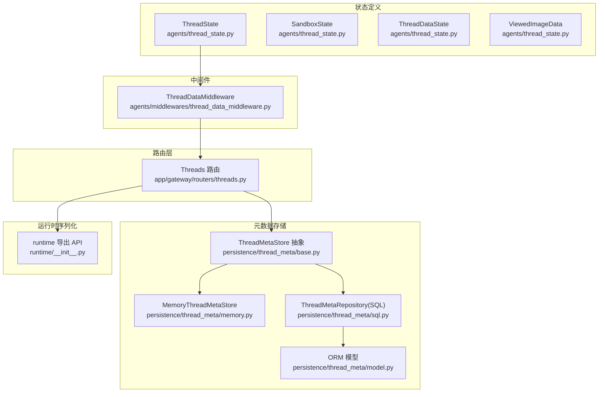
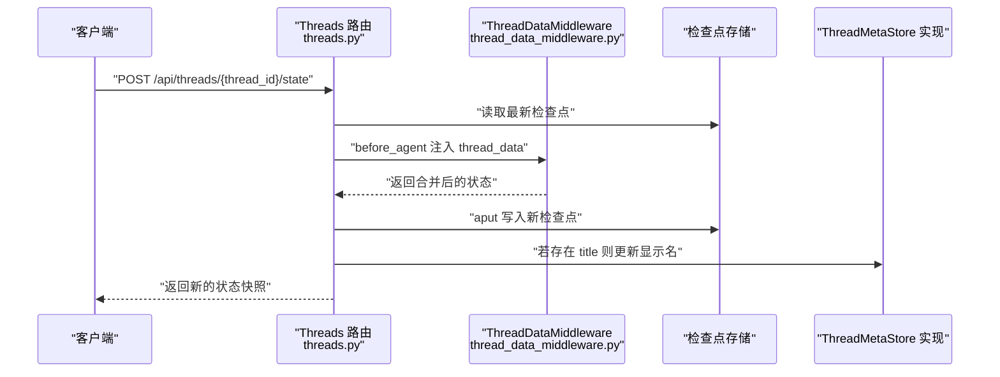
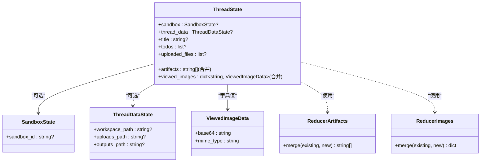
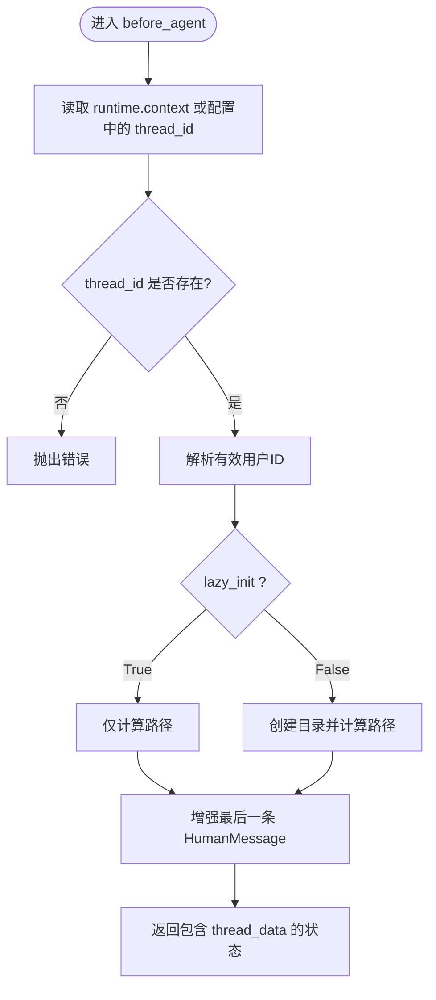
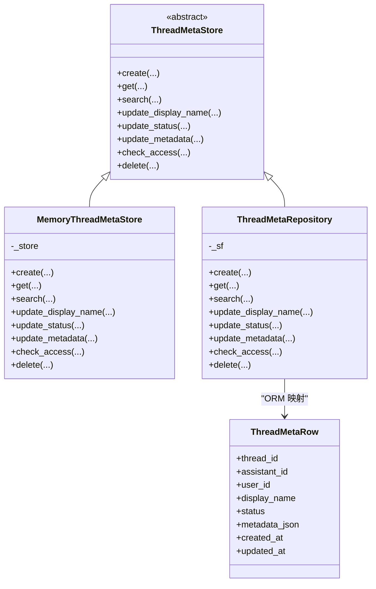
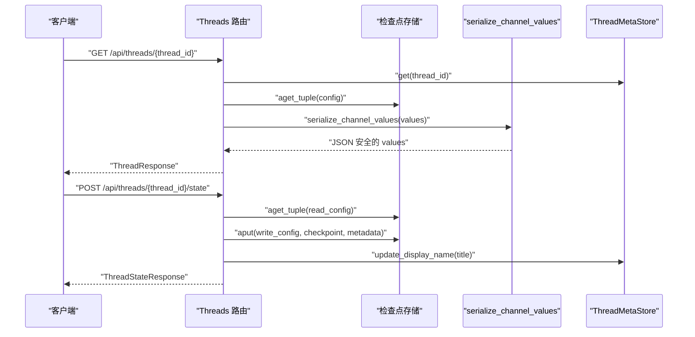
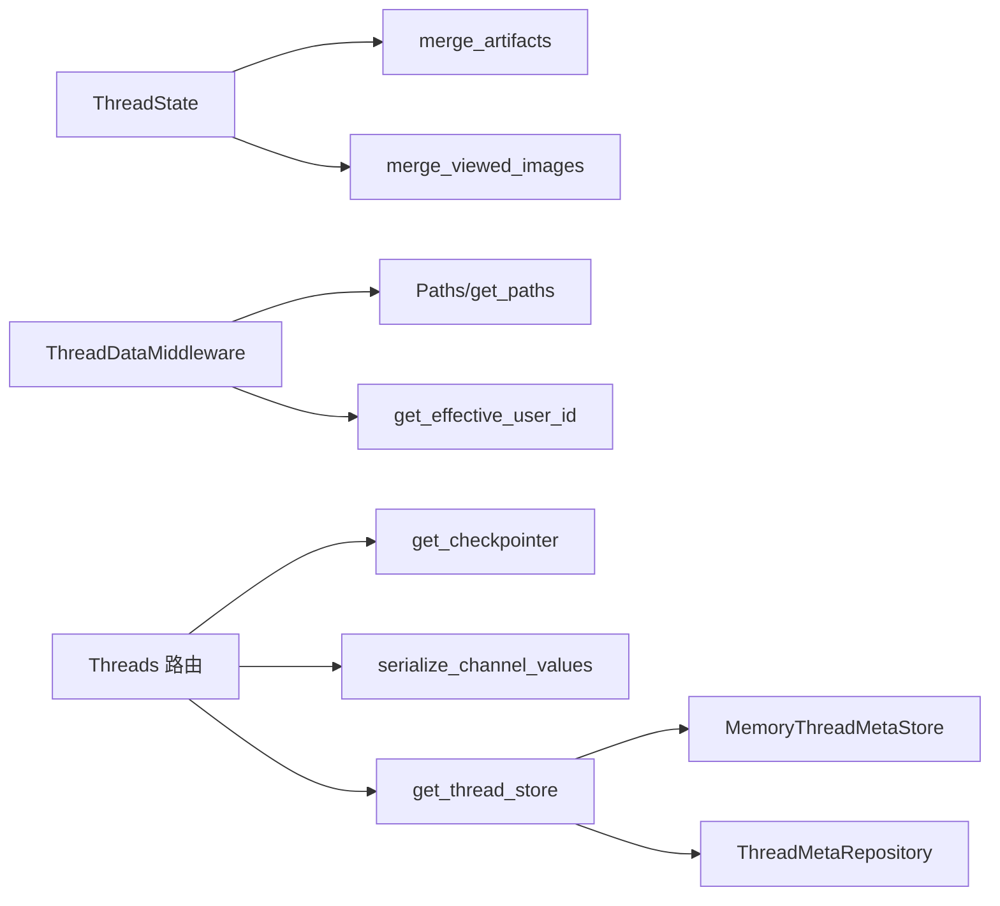

# 线程状态管理

<cite>
**本文引用的文件**
- [backend/packages/harness/deerflow/agents/thread_state.py](file://backend/packages/harness/deerflow/agents/thread_state.py)
- [backend/packages/harness/deerflow/agents/middlewares/thread_data_middleware.py](file://backend/packages/harness/deerflow/agents/middlewares/thread_data_middleware.py)
- [backend/app/gateway/routers/threads.py](file://backend/app/gateway/routers/threads.py)
- [backend/packages/harness/deerflow/persistence/thread_meta/base.py](file://backend/packages/harness/deerflow/persistence/thread_meta/base.py)
- [backend/packages/harness/deerflow/persistence/thread_meta/model.py](file://backend/packages/harness/deerflow/persistence/thread_meta/model.py)
- [backend/packages/harness/deerflow/persistence/thread_meta/memory.py](file://backend/packages/harness/deerflow/persistence/thread_meta/memory.py)
- [backend/packages/harness/deerflow/persistence/thread_meta/sql.py](file://backend/packages/harness/deerflow/persistence/thread_meta/sql.py)
- [backend/packages/harness/deerflow/runtime/__init__.py](file://backend/packages/harness/deerflow/runtime/__init__.py)
- [backend/tests/test_serialization.py](file://backend/tests/test_serialization.py)
</cite>

## 目录
1. [引言](#引言)
2. [项目结构](#项目结构)
3. [核心组件](#核心组件)
4. [架构总览](#架构总览)
5. [详细组件分析](#详细组件分析)
6. [依赖分析](#依赖分析)
7. [性能考虑](#性能考虑)
8. [故障排查指南](#故障排查指南)
9. [结论](#结论)
10. [附录](#附录)

## 引言
本技术文档围绕“线程状态管理”展开，系统性阐述 ThreadState 类的设计理念、字段定义与数据结构，详解状态扩展机制（沙箱信息、工件路径、工作空间路径、标题生成、任务跟踪等）如何在中间件链中传递、持久化策略及与后端组件的数据交换方式。同时提供状态管理的使用示例与最佳实践，并给出状态序列化与反序列化的实现细节与参考路径。

## 项目结构
线程状态管理涉及以下关键模块：
- 状态定义与合并策略：位于 agents/thread_state.py
- 中间件链：负责在执行前注入线程数据目录路径与消息增强
- 路由层：对外暴露线程的创建、查询、状态读写、历史查询等接口
- 元数据持久化：抽象接口与内存/SQL两种实现
- 运行时序列化：确保通道值在 API 层安全传输

**图表来源**
- [backend/packages/harness/deerflow/agents/thread_state.py:1-56](file://backend/packages/harness/deerflow/agents/thread_state.py#L1-L56)
- [backend/packages/harness/deerflow/agents/middlewares/thread_data_middleware.py:1-119](file://backend/packages/harness/deerflow/agents/middlewares/thread_data_middleware.py#L1-L119)
- [backend/app/gateway/routers/threads.py:1-623](file://backend/app/gateway/routers/threads.py#L1-L623)
- [backend/packages/harness/deerflow/persistence/thread_meta/base.py:1-77](file://backend/packages/harness/deerflow/persistence/thread_meta/base.py#L1-L77)
- [backend/packages/harness/deerflow/persistence/thread_meta/memory.py:1-152](file://backend/packages/harness/deerflow/persistence/thread_meta/memory.py#L1-L152)
- [backend/packages/harness/deerflow/persistence/thread_meta/sql.py:1-218](file://backend/packages/harness/deerflow/persistence/thread_meta/sql.py#L1-L218)
- [backend/packages/harness/deerflow/persistence/thread_meta/model.py:1-24](file://backend/packages/harness/deerflow/persistence/thread_meta/model.py#L1-L24)
- [backend/packages/harness/deerflow/runtime/__init__.py:1-47](file://backend/packages/harness/deerflow/runtime/__init__.py#L1-L47)

**章节来源**
- [backend/packages/harness/deerflow/agents/thread_state.py:1-56](file://backend/packages/harness/deerflow/agents/thread_state.py#L1-L56)
- [backend/packages/harness/deerflow/agents/middlewares/thread_data_middleware.py:1-119](file://backend/packages/harness/deerflow/agents/middlewares/thread_data_middleware.py#L1-L119)
- [backend/app/gateway/routers/threads.py:1-623](file://backend/app/gateway/routers/threads.py#L1-L623)
- [backend/packages/harness/deerflow/persistence/thread_meta/base.py:1-77](file://backend/packages/harness/deerflow/persistence/thread_meta/base.py#L1-L77)
- [backend/packages/harness/deerflow/persistence/thread_meta/memory.py:1-152](file://backend/packages/harness/deerflow/persistence/thread_meta/memory.py#L1-L152)
- [backend/packages/harness/deerflow/persistence/thread_meta/sql.py:1-218](file://backend/packages/harness/deerflow/persistence/thread_meta/sql.py#L1-L218)
- [backend/packages/harness/deerflow/persistence/thread_meta/model.py:1-24](file://backend/packages/harness/deerflow/persistence/thread_meta/model.py#L1-L24)
- [backend/packages/harness/deerflow/runtime/__init__.py:1-47](file://backend/packages/harness/deerflow/runtime/__init__.py#L1-L47)

## 核心组件
- ThreadState：LangGraph AgentState 的扩展，承载线程级状态，含沙箱、线程数据、标题、工件、待办、上传文件、已查看图片等字段；通过 Annotated 合并器实现列表与字典的去重与覆盖合并。
- ThreadDataMiddleware：在代理执行前注入线程数据目录路径（工作区、上传、输出），支持惰性/急切初始化；同时增强最后一条用户消息以携带运行标识与时戳。
- Threads 路由：提供线程生命周期管理与状态读写接口，统一序列化通道值，便于前端消费；支持从状态同步标题到元数据存储。
- ThreadMetaStore 抽象与实现：定义元数据增删改查、访问控制、搜索等能力；内存实现基于 LangGraph Store 命名空间，SQL 实现基于 ORM 模型。
- 运行时序列化：导出 serialize_channel_values 等工具，保证消息对象与复杂类型在 API 层安全序列化。

**章节来源**
- [backend/packages/harness/deerflow/agents/thread_state.py:48-56](file://backend/packages/harness/deerflow/agents/thread_state.py#L48-L56)
- [backend/packages/harness/deerflow/agents/middlewares/thread_data_middleware.py:24-119](file://backend/packages/harness/deerflow/agents/middlewares/thread_data_middleware.py#L24-L119)
- [backend/app/gateway/routers/threads.py:410-548](file://backend/app/gateway/routers/threads.py#L410-L548)
- [backend/packages/harness/deerflow/persistence/thread_meta/base.py:22-77](file://backend/packages/harness/deerflow/persistence/thread_meta/base.py#L22-L77)
- [backend/packages/harness/deerflow/runtime/__init__.py:8-46](file://backend/packages/harness/deerflow/runtime/__init__.py#L8-L46)

## 架构总览
下图展示从请求进入路由层，经中间件注入线程数据，到状态写入检查点与元数据同步的整体流程。

**图表来源**
- [backend/app/gateway/routers/threads.py:461-548](file://backend/app/gateway/routers/threads.py#L461-L548)
- [backend/packages/harness/deerflow/agents/middlewares/thread_data_middleware.py:81-119](file://backend/packages/harness/deerflow/agents/middlewares/thread_data_middleware.py#L81-L119)

## 详细组件分析

### ThreadState 设计与字段解析
- 设计理念
  - 基于 LangGraph AgentState 扩展，保持与 LangGraph 平台兼容的同时，引入业务侧关键状态字段。
  - 使用 Annotated 合并器实现“可合并”的字段语义，确保并发写入时的有序与去重。
- 字段定义与作用
  - sandbox：沙箱状态，包含沙箱标识等，用于隔离与审计。
  - thread_data：线程数据目录状态，包含工作区、上传、输出路径，供工具与技能读写。
  - title：线程标题，通常用于展示与检索。
  - artifacts：工件路径列表，采用合并器去重并保留顺序。
  - todos：待办事项列表。
  - uploaded_files：上传文件信息列表。
  - viewed_images：已查看图片映射，键为图片路径，值包含 base64 与 MIME 类型，合并器支持清空操作。
- 合并策略
  - artifacts 合并器：合并并去重，保留原有顺序。
  - viewed_images 合并器：支持空字典清空，新值覆盖同键旧值。

**图表来源**
- [backend/packages/harness/deerflow/agents/thread_state.py:6-56](file://backend/packages/harness/deerflow/agents/thread_state.py#L6-L56)

**章节来源**
- [backend/packages/harness/deerflow/agents/thread_state.py:48-56](file://backend/packages/harness/deerflow/agents/thread_state.py#L48-L56)
- [backend/packages/harness/deerflow/agents/thread_state.py:21-45](file://backend/packages/harness/deerflow/agents/thread_state.py#L21-L45)

### ThreadDataMiddleware：中间件链中的状态注入
- 目标
  - 在代理执行前为线程创建或计算数据目录路径，并注入到状态中。
  - 对最后一条用户消息进行增强，附加运行标识与时戳，便于追踪。
- 关键行为
  - 路径解析：根据 thread_id 与可选 user_id 计算工作区、上传、输出路径。
  - 初始化模式：lazy_init=True 仅计算路径，False 则立即创建目录。
  - 消息增强：为 HumanMessage 补充 run_id 与时间戳。
- 与 ThreadState 的关系
  - 返回的 state 包含 thread_data 字段，与 ThreadState 的 ThreadDataState 结构一致，实现无缝合并。

**图表来源**
- [backend/packages/harness/deerflow/agents/middlewares/thread_data_middleware.py:81-119](file://backend/packages/harness/deerflow/agents/middlewares/thread_data_middleware.py#L81-L119)

**章节来源**
- [backend/packages/harness/deerflow/agents/middlewares/thread_data_middleware.py:24-119](file://backend/packages/harness/deerflow/agents/middlewares/thread_data_middleware.py#L24-L119)

### 元数据持久化：ThreadMetaStore 抽象与实现
- 抽象接口
  - 支持创建、查询、搜索、更新显示名/状态/元数据、访问校验、删除等。
  - 用户隔离语义：AUTO 自动解析、显式字符串直接使用、None 绕过所有者过滤。
- 内存实现（MemoryThreadMetaStore）
  - 基于 LangGraph BaseStore 的命名空间存储，适合内存模式与测试。
  - 提供所有权校验与记录转换。
- SQL 实现（ThreadMetaRepository）
  - 基于 ORM 模型 ThreadMetaRow，支持数据库持久化。
  - 提供搜索过滤（metadata/status）、事务内读改写、访问控制严格模式。

**图表来源**
- [backend/packages/harness/deerflow/persistence/thread_meta/base.py:22-77](file://backend/packages/harness/deerflow/persistence/thread_meta/base.py#L22-L77)
- [backend/packages/harness/deerflow/persistence/thread_meta/memory.py:21-152](file://backend/packages/harness/deerflow/persistence/thread_meta/memory.py#L21-L152)
- [backend/packages/harness/deerflow/persistence/thread_meta/sql.py:16-218](file://backend/packages/harness/deerflow/persistence/thread_meta/sql.py#L16-L218)
- [backend/packages/harness/deerflow/persistence/thread_meta/model.py:13-24](file://backend/packages/harness/deerflow/persistence/thread_meta/model.py#L13-L24)

**章节来源**
- [backend/packages/harness/deerflow/persistence/thread_meta/base.py:1-77](file://backend/packages/harness/deerflow/persistence/thread_meta/base.py#L1-L77)
- [backend/packages/harness/deerflow/persistence/thread_meta/memory.py:1-152](file://backend/packages/harness/deerflow/persistence/thread_meta/memory.py#L1-L152)
- [backend/packages/harness/deerflow/persistence/thread_meta/sql.py:1-218](file://backend/packages/harness/deerflow/persistence/thread_meta/sql.py#L1-L218)
- [backend/packages/harness/deerflow/persistence/thread_meta/model.py:1-24](file://backend/packages/harness/deerflow/persistence/thread_meta/model.py#L1-L24)

### 路由层：状态读写与历史查询
- 接口职责
  - 创建线程：写入元数据记录与空检查点，支持幂等。
  - 查询线程：从元数据存储与检查点派生准确状态。
  - 获取/更新状态：序列化通道值，支持人类介入恢复与标题更新同步。
  - 历史查询：按检查点游标分页读取，序列化消息避免重复。
- 序列化策略
  - 使用 serialize_channel_values 将通道值（含消息对象）转为 JSON 安全格式。
  - 历史接口仅在最新检查点附带消息，其余条目不重复携带。
- 标题同步
  - 更新状态时若包含 title，会同步更新元数据存储的显示名，保证搜索结果即时反映。

**图表来源**
- [backend/app/gateway/routers/threads.py:351-458](file://backend/app/gateway/routers/threads.py#L351-L458)
- [backend/app/gateway/routers/threads.py:461-548](file://backend/app/gateway/routers/threads.py#L461-L548)

**章节来源**
- [backend/app/gateway/routers/threads.py:410-548](file://backend/app/gateway/routers/threads.py#L410-L548)

### 序列化与反序列化：实现细节与最佳实践
- 工具导出
  - runtime/__init__.py 暴露 serialize、serialize_channel_values、serialize_lc_object、serialize_messages_tuple 等。
- 测试验证
  - tests/test_serialization.py 验证不同模式下的序列化行为，包括默认模式、values 模式、messages 模式等。
- 最佳实践
  - 在路由层统一使用 serialize_channel_values 输出通道值，避免消息对象导致的序列化失败。
  - 历史接口仅在最新检查点携带消息，减少响应体积。
  - 对于人类介入恢复场景，先读取再合并用户输入，再写入新检查点，确保一致性。

**章节来源**
- [backend/packages/harness/deerflow/runtime/__init__.py:8-46](file://backend/packages/harness/deerflow/runtime/__init__.py#L8-L46)
- [backend/tests/test_serialization.py:133-159](file://backend/tests/test_serialization.py#L133-L159)

## 依赖分析
- 组件耦合
  - ThreadState 与合并器解耦，降低字段变更成本。
  - ThreadDataMiddleware 依赖路径解析与用户上下文，但不直接依赖具体存储。
  - 路由层通过依赖注入获取检查点与元数据存储实例，便于替换实现。
- 外部依赖
  - LangGraph AgentState、Runtime、checkpointer 接口。
  - SQLAlchemy（SQL 实现）与 LangGraph Store（内存实现）。

**图表来源**
- [backend/packages/harness/deerflow/agents/thread_state.py:21-45](file://backend/packages/harness/deerflow/agents/thread_state.py#L21-L45)
- [backend/packages/harness/deerflow/agents/middlewares/thread_data_middleware.py:11-13](file://backend/packages/harness/deerflow/agents/middlewares/thread_data_middleware.py#L11-L13)
- [backend/app/gateway/routers/threads.py:24-29](file://backend/app/gateway/routers/threads.py#L24-L29)
- [backend/packages/harness/deerflow/persistence/thread_meta/memory.py:21-152](file://backend/packages/harness/deerflow/persistence/thread_meta/memory.py#L21-L152)
- [backend/packages/harness/deerflow/persistence/thread_meta/sql.py:16-218](file://backend/packages/harness/deerflow/persistence/thread_meta/sql.py#L16-L218)

**章节来源**
- [backend/packages/harness/deerflow/agents/thread_state.py:21-45](file://backend/packages/harness/deerflow/agents/thread_state.py#L21-L45)
- [backend/packages/harness/deerflow/agents/middlewares/thread_data_middleware.py:11-13](file://backend/packages/harness/deerflow/agents/middlewares/thread_data_middleware.py#L11-L13)
- [backend/app/gateway/routers/threads.py:24-29](file://backend/app/gateway/routers/threads.py#L24-L29)
- [backend/packages/harness/deerflow/persistence/thread_meta/memory.py:21-152](file://backend/packages/harness/deerflow/persistence/thread_meta/memory.py#L21-L152)
- [backend/packages/harness/deerflow/persistence/thread_meta/sql.py:16-218](file://backend/packages/harness/deerflow/persistence/thread_meta/sql.py#L16-L218)

## 性能考虑
- 惰性初始化：ThreadDataMiddleware 默认惰性初始化，仅在需要时创建目录，降低冷启动开销。
- 合并器去重：artifacts 合并器使用字典去重，避免重复写入带来的存储压力。
- 序列化优化：历史接口仅在最新检查点携带消息，减少序列化与网络传输成本。
- 数据库搜索：SQL 实现对 metadata 过滤采用服务端与客户端混合策略，建议在生产环境启用 JSON 操作符以减轻服务器负担。

[本节为通用指导，无需列出具体文件来源]

## 故障排查指南
- 线程状态为空
  - 检查是否成功创建空检查点；确认检查点命名空间与 thread_id 配置正确。
  - 参考：[backend/app/gateway/routers/threads.py:264-278](file://backend/app/gateway/routers/threads.py#L264-L278)
- 标题未同步
  - 确认更新状态请求包含 title 字段且非空；检查元数据存储实现是否支持更新显示名。
  - 参考：[backend/app/gateway/routers/threads.py:534-541](file://backend/app/gateway/routers/threads.py#L534-L541)
- viewed_images 清空无效
  - 确认传入空字典作为 new 值；合并器仅在 new 为空字典时清空。
  - 参考：[backend/packages/harness/deerflow/agents/thread_state.py:42-43](file://backend/packages/harness/deerflow/agents/thread_state.py#L42-L43)
- 序列化异常
  - 使用 serialize_channel_values 统一序列化通道值；参考测试用例验证行为。
  - 参考：[backend/tests/test_serialization.py:133-159](file://backend/tests/test_serialization.py#L133-L159)

**章节来源**
- [backend/app/gateway/routers/threads.py:264-278](file://backend/app/gateway/routers/threads.py#L264-L278)
- [backend/app/gateway/routers/threads.py:534-541](file://backend/app/gateway/routers/threads.py#L534-L541)
- [backend/packages/harness/deerflow/agents/thread_state.py:42-43](file://backend/packages/harness/deerflow/agents/thread_state.py#L42-L43)
- [backend/tests/test_serialization.py:133-159](file://backend/tests/test_serialization.py#L133-L159)

## 结论
ThreadState 通过明确的字段定义与合并策略，结合 ThreadDataMiddleware 的中间件注入与路由层的状态读写接口，形成了从执行前准备到状态持久化的完整闭环。配合 ThreadMetaStore 的抽象设计，系统可在内存与 SQL 之间灵活切换，满足不同部署场景的需求。通过统一的序列化策略与严格的访问控制，确保了状态在多租户环境下的安全性与一致性。

[本节为总结性内容，无需列出具体文件来源]

## 附录
- 使用示例（步骤说明）
  - 创建线程：调用创建接口，自动写入空检查点与元数据记录。
  - 注入线程数据：在代理执行前由中间件注入工作区/上传/输出路径。
  - 更新状态：合并用户输入到通道值，写入新检查点；如包含标题则同步至元数据存储。
  - 查询历史：按游标分页读取检查点，仅最新条目携带消息。
- 最佳实践
  - 优先使用惰性初始化，避免不必要的磁盘 IO。
  - 对 artifacts 与 viewed_images 的写入遵循合并器约定，确保幂等与一致性。
  - 在路由层统一使用 serialize_channel_values，避免消息对象导致的序列化问题。

[本节为概念性内容，无需列出具体文件来源]