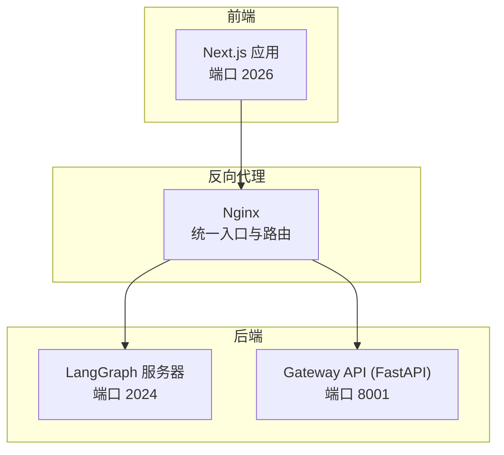
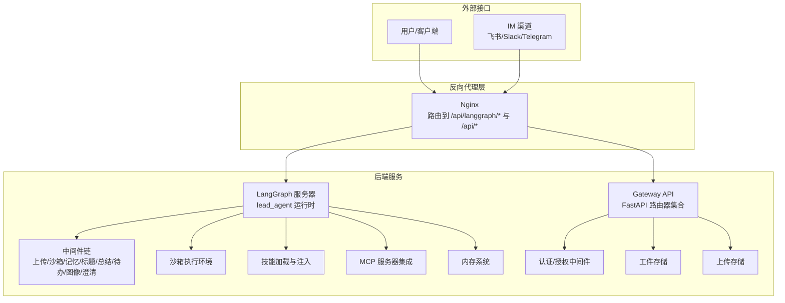
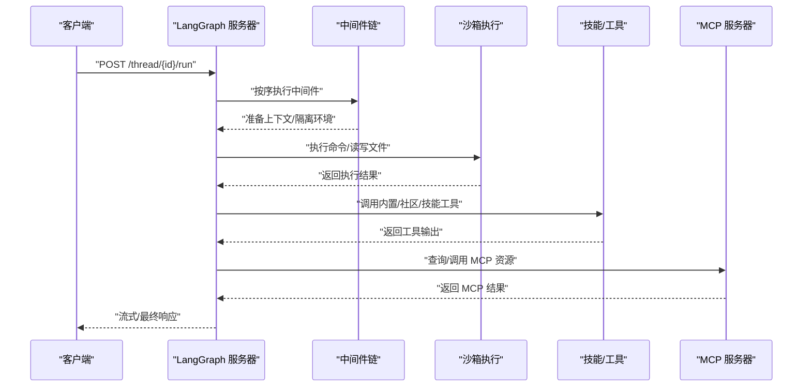
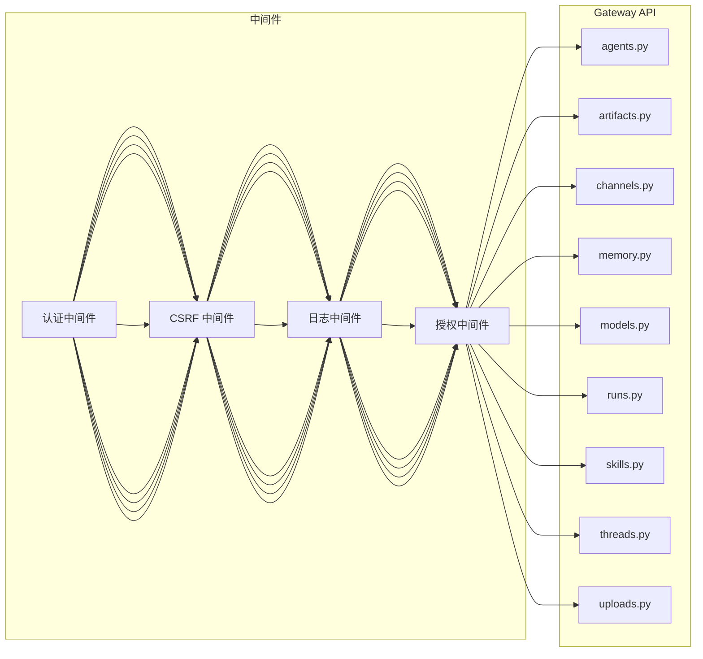
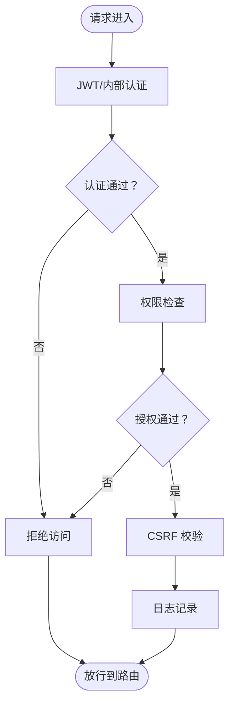
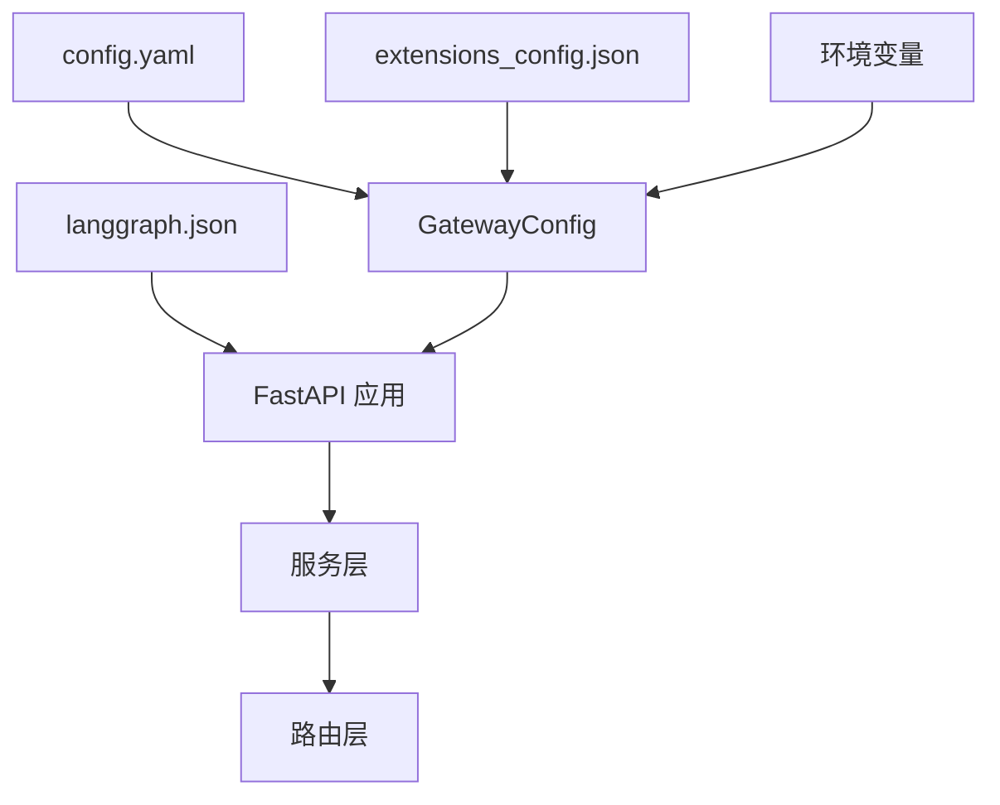
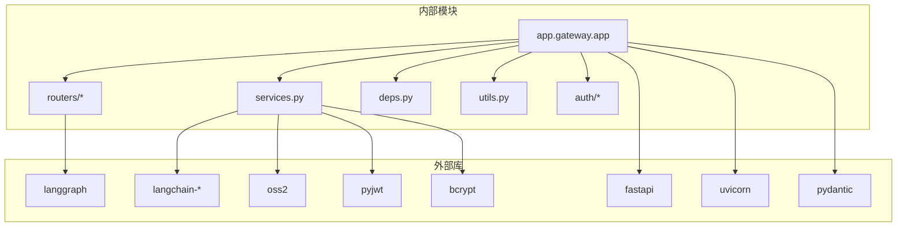

# 核心组件详解

<cite>
**本文引用的文件**
- [backend/README.md](file://backend/README.md)
- [backend/pyproject.toml](file://backend/pyproject.toml)
- [backend/langgraph.json](file://backend/langgraph.json)
- [backend/Makefile](file://backend/Makefile)
- [backend/app/gateway/__init__.py](file://backend/app/gateway/__init__.py)
- [backend/app/gateway/config.py](file://backend/app/gateway/config.py)
- [backend/app/gateway/app.py](file://backend/app/gateway/app.py)
- [backend/app/gateway/routers/agents.py](file://backend/app/gateway/routers/agents.py)
- [backend/app/gateway/routers/artifacts.py](file://backend/app/gateway/routers/artifacts.py)
- [backend/app/gateway/routers/channels.py](file://backend/app/gateway/routers/channels.py)
- [backend/app/gateway/routers/memory.py](file://backend/app/gateway/routers/memory.py)
- [backend/app/gateway/routers/models.py](file://backend/app/gateway/routers/models.py)
- [backend/app/gateway/routers/runs.py](file://backend/app/gateway/routers/runs.py)
- [backend/app/gateway/routers/skills.py](file://backend/app/gateway/routers/skills.py)
- [backend/app/gateway/routers/threads.py](file://backend/app/gateway/routers/threads.py)
- [backend/app/gateway/routers/uploads.py](file://backend/app/gateway/routers/uploads.py)
- [backend/app/gateway/services.py](file://backend/app/gateway/services.py)
- [backend/app/gateway/deps.py](file://backend/app/gateway/deps.py)
- [backend/app/gateway/utils.py](file://backend/app/gateway/utils.py)
- [backend/app/gateway/auth/jwt.py](file://backend/app/gateway/auth/jwt.py)
- [backend/app/gateway/auth/providers.py](file://backend/app/gateway/auth/providers.py)
- [backend/app/gateway/auth/credential_file.py](file://backend/app/gateway/auth/credential_file.py)
- [backend/app/gateway/auth/local_provider.py](file://backend/app/gateway/auth/local_provider.py)
- [backend/app/gateway/auth/password.py](file://backend/app/gateway/auth/password.py)
- [backend/app/gateway/auth/models.py](file://backend/app/gateway/auth/models.py)
- [backend/app/gateway/auth/errors.py](file://backend/app/gateway/auth/errors.py)
- [backend/app/gateway/auth/reset_admin.py](file://backend/app/gateway/auth/reset_admin.py)
- [backend/app/gateway/auth_middleware.py](file://backend/app/gateway/auth_middleware.py)
- [backend/app/gateway/internal_auth.py](file://backend/app/gateway/internal_auth.py)
- [backend/app/gateway/langgraph_auth.py](file://backend/app/gateway/langgraph_auth.py)
- [backend/app/gateway/csrf_middleware.py](file://backend/app/gateway/csrf_middleware.py)
- [backend/app/gateway/logging_middleware.py](file://backend/app/gateway/logging_middleware.py)
- [backend/app/gateway/path_utils.py](file://backend/app/gateway/path_utils.py)
- [backend/app/gateway/authz.py](file://backend/app/gateway/authz.py)
- [backend/app/gateway/auth/repositories/user_repository.py](file://backend/app/gateway/auth/repositories/user_repository.py)
- [backend/app/gateway/auth/repositories/credential_repository.py](file://backend/app/gateway/auth/repositories/credential_repository.py)
- [backend/app/gateway/auth/repositories/permission_repository.py](file://backend/app/gateway/auth/repositories/permission_repository.py)
- [backend/app/gateway/auth/repositories/role_repository.py](file://backend/app/gateway/auth/repositories/role_repository.py)
- [backend/app/gateway/auth/repositories/role_permission_repository.py](file://backend/app/gateway/auth/repositories/role_permission_repository.py)
- [backend/app/gateway/auth/repositories/role_user_repository.py](file://backend/app/gateway/auth/repositories/role_user_repository.py)
- [backend/app/gateway/auth/repositories/permission_cache.py](file://backend/app/gateway/auth/repositories/permission_cache.py)
- [backend/app/gateway/auth/repositories/permission_cache.py](file://backend/app/gateway/auth/repositories/permission_cache.py)
- [backend/app/gateway/auth/repositories/permission_cache.py](file://backend/app/gateway/auth/repositories/permission_cache.py)
</cite>

## 目录
1. [引言](#引言)
2. [项目结构](#项目结构)
3. [核心组件](#核心组件)
4. [架构总览](#架构总览)
5. [详细组件分析](#详细组件分析)
6. [依赖分析](#依赖分析)
7. [性能考虑](#性能考虑)
8. [故障排查指南](#故障排查指南)
9. [结论](#结论)
10. [附录](#附录)

## 引言
本文件面向 DeerFlow 后端核心组件，系统性阐述以下主题：
- LangGraph 服务器作为核心代理运行时的设计原理：Agent Runtime 的职责边界、Thread State 的扩展机制、与 LangChain 的集成方式
- Gateway API 的 RESTful 设计：各路由模块的功能与端点规范
- 组件间配置共享机制与依赖关系
- 具体的代码示例与配置文件解析路径

目标是帮助开发者快速理解并高效扩展 DeerFlow 的代理运行时与网关服务。

## 项目结构
后端采用“LangGraph 服务器 + FastAPI 网关”的双引擎架构，通过 Nginx 进行统一反向代理与路由分发：
- LangGraph 服务器（端口 2024）：处理代理交互、线程状态、流式输出等
- Gateway API（端口 8001）：提供模型、MCP、技能、内存、上传、工件等 REST 能力
- 前端（Next.js，端口 2026）：Web 控制台与演示界面

图表来源
- [backend/README.md:37-41](file://backend/README.md#L37-L41)
- [backend/README.md:191-212](file://backend/README.md#L191-L212)

章节来源
- [backend/README.md:7-41](file://backend/README.md#L7-L41)
- [backend/README.md:215-251](file://backend/README.md#L215-L251)

## 核心组件
本节聚焦两大核心：LangGraph 服务器与 Gateway API。

- LangGraph 服务器
  - 以 lead_agent 为核心代理运行时，负责多轮对话、工具调用、子代理委派、中间件链路执行与持久化检查点
  - 通过 langgraph.json 指定图工厂函数、认证回调与检查点提供者
  - 与 LangChain 生态深度集成，支持动态模型选择、中间件链、工具生态与 MCP 协议

- Gateway API
  - 基于 FastAPI 的 REST 服务，提供模型管理、MCP 配置、技能管理、内存读写、上传与工件访问等能力
  - 通过路由模块划分功能域，配合认证、授权、CSRF、日志等中间件形成安全可靠的 API 层

章节来源
- [backend/README.md:44-137](file://backend/README.md#L44-L137)
- [backend/langgraph.json:1-18](file://backend/langgraph.json#L1-L18)

## 架构总览
下图展示 DeerFlow 的端到端架构与数据流：

图表来源
- [backend/README.md:37-41](file://backend/README.md#L37-L41)
- [backend/README.md:46-112](file://backend/README.md#L46-L112)
- [backend/README.md:113-137](file://backend/README.md#L113-L137)

## 详细组件分析

### LangGraph 服务器：Agent Runtime 设计
- 运行时职责
  - 接收请求，驱动 lead_agent 执行推理与工具调用
  - 串联九项中间件完成上下文隔离、上传注入、沙箱获取、摘要、任务清单、标题生成、记忆队列、图像注入与澄清拦截
  - 支持子代理并发委派与后台执行，返回结果或流式事件
  - 使用异步检查点提供者持久化线程状态，确保中断恢复与历史可追溯

- Thread State 扩展机制
  - 通过中间件在每条线程上创建隔离工作区（workspace、uploads、outputs），并映射到虚拟路径
  - 在状态中注入当前轮次的上下文、工具调用结果、子代理状态、记忆片段与标题等
  - 支持按需扩展字段，例如新增“计划模式”状态、记忆队列指针、上传文件元信息等

- 与 LangChain 的集成
  - 动态模型工厂：根据配置解析 provider 类路径与参数，支持 OpenAI、Anthropic、DashScope 等
  - 中间件链：将通用横切关注点（如上传、沙箱、记忆、摘要、标题、图像、澄清）以中间件形式注入
  - 工具系统：内置 bash/ls/read_file/write_file/str_replace、present_files、ask_clarification、view_image、task（子代理）
  - MCP：通过适配器对接任意 MCP 服务器（stdio/SSE/HTTP），统一协议与传输

图表来源
- [backend/README.md:56-71](file://backend/README.md#L56-L71)
- [backend/README.md:72-92](file://backend/README.md#L72-L92)
- [backend/README.md:103-112](file://backend/README.md#L103-L112)

章节来源
- [backend/README.md:46-112](file://backend/README.md#L46-L112)
- [backend/langgraph.json:8-16](file://backend/langgraph.json#L8-L16)

### Gateway API：RESTful 设计与路由
Gateway API 采用 FastAPI，按功能域拆分为多个路由器，统一经认证、授权、CSRF、日志等中间件处理。

- 路由器概览
  - agents.py：代理相关操作（启动、查询、取消等）
  - artifacts.py：生成工件的静态/动态访问
  - channels.py：IM 渠道桥接（飞书、Slack、Telegram 等）
  - memory.py：内存数据读取、重载、配置与状态
  - models.py：模型列表与配置
  - runs.py：运行状态查询与事件流
  - skills.py：技能列表、启用/禁用、安装
  - threads.py：线程生命周期管理
  - uploads.py：上传文件处理与列表

- 端点规范（节选）
  - GET /api/models：列出可用模型
  - GET/PUT /api/mcp/config：管理 MCP 服务器配置
  - GET/PUT /api/skills：列出与管理技能
  - POST /api/skills/install：从 .skill 归档安装技能
  - GET /api/memory：获取内存数据
  - POST /api/memory/reload：强制重载内存
  - GET /api/memory/config：内存配置
  - GET /api/memory/status：合并配置与数据
  - POST /api/threads/{id}/uploads：上传文件（自动转换 PDF/PPT/Excel/Word 为 Markdown；拒绝目录路径；同请求数字重命名）
  - GET /api/threads/{id}/uploads/list：列出上传文件
  - DELETE /api/threads/{id}：删除线程本地数据（LangGraph 线程删除后清理）
  - GET /api/threads/{id}/artifacts/{path}：提供生成工件

图表来源
- [backend/README.md:113-137](file://backend/README.md#L113-L137)

章节来源
- [backend/README.md:113-137](file://backend/README.md#L113-L137)
- [backend/app/gateway/routers/agents.py](file://backend/app/gateway/routers/agents.py)
- [backend/app/gateway/routers/artifacts.py](file://backend/app/gateway/routers/artifacts.py)
- [backend/app/gateway/routers/channels.py](file://backend/app/gateway/routers/channels.py)
- [backend/app/gateway/routers/memory.py](file://backend/app/gateway/routers/memory.py)
- [backend/app/gateway/routers/models.py](file://backend/app/gateway/routers/models.py)
- [backend/app/gateway/routers/runs.py](file://backend/app/gateway/routers/runs.py)
- [backend/app/gateway/routers/skills.py](file://backend/app/gateway/routers/skills.py)
- [backend/app/gateway/routers/threads.py](file://backend/app/gateway/routers/threads.py)
- [backend/app/gateway/routers/uploads.py](file://backend/app/gateway/routers/uploads.py)

### 认证与授权体系
- 认证中间件
  - JWT 解析与校验
  - 内部服务间认证（基于密钥）
  - LangGraph 专用认证回调
- 授权中间件
  - 基于角色与权限的细粒度控制
  - 权限缓存与失效策略
- 安全中间件
  - CSRF 防护
  - 日志记录与审计

图表来源
- [backend/app/gateway/auth_middleware.py](file://backend/app/gateway/auth_middleware.py)
- [backend/app/gateway/internal_auth.py](file://backend/app/gateway/internal_auth.py)
- [backend/app/gateway/langgraph_auth.py](file://backend/app/gateway/langgraph_auth.py)
- [backend/app/gateway/csrf_middleware.py](file://backend/app/gateway/csrf_middleware.py)
- [backend/app/gateway/logging_middleware.py](file://backend/app/gateway/logging_middleware.py)
- [backend/app/gateway/authz.py](file://backend/app/gateway/authz.py)

章节来源
- [backend/app/gateway/auth/jwt.py](file://backend/app/gateway/auth/jwt.py)
- [backend/app/gateway/auth/providers.py](file://backend/app/gateway/auth/providers.py)
- [backend/app/gateway/auth/credential_file.py](file://backend/app/gateway/auth/credential_file.py)
- [backend/app/gateway/auth/local_provider.py](file://backend/app/gateway/auth/local_provider.py)
- [backend/app/gateway/auth/password.py](file://backend/app/gateway/auth/password.py)
- [backend/app/gateway/auth/models.py](file://backend/app/gateway/auth/models.py)
- [backend/app/gateway/auth/errors.py](file://backend/app/gateway/auth/errors.py)
- [backend/app/gateway/auth/reset_admin.py](file://backend/app/gateway/auth/reset_admin.py)
- [backend/app/gateway/auth/repositories/user_repository.py](file://backend/app/gateway/auth/repositories/user_repository.py)
- [backend/app/gateway/auth/repositories/credential_repository.py](file://backend/app/gateway/auth/repositories/credential_repository.py)
- [backend/app/gateway/auth/repositories/permission_repository.py](file://backend/app/gateway/auth/repositories/permission_repository.py)
- [backend/app/gateway/auth/repositories/role_repository.py](file://backend/app/gateway/auth/repositories/role_repository.py)
- [backend/app/gateway/auth/repositories/role_permission_repository.py](file://backend/app/gateway/auth/repositories/role_permission_repository.py)
- [backend/app/gateway/auth/repositories/role_user_repository.py](file://backend/app/gateway/auth/repositories/role_user_repository.py)
- [backend/app/gateway/auth/repositories/permission_cache.py](file://backend/app/gateway/auth/repositories/permission_cache.py)

### 配置共享机制与依赖关系
- 配置来源
  - 主配置：config.yaml（模型、工具、沙箱、技能、标题、摘要、子代理、内存等）
  - 扩展配置：extensions_config.json（MCP 服务器与技能状态）
  - 环境变量：DEER_FLOW_CONFIG_PATH、DEER_FLOW_EXTENSIONS_CONFIG_PATH、各类 API Key
- 配置加载与传播
  - GatewayConfig 从环境变量加载并缓存
  - LangGraph 通过 langgraph.json 指定图工厂、认证回调与检查点提供者
  - 各路由器与服务通过依赖注入获取配置实例，避免全局污染
- 关键依赖
  - FastAPI 应用通过 app.py 组装路由与中间件
  - 服务层封装业务逻辑，路由层仅做参数与响应编排
  - 中间件链在路由前执行，确保横切一致

图表来源
- [backend/app/gateway/config.py](file://backend/app/gateway/config.py)
- [backend/langgraph.json:1-18](file://backend/langgraph.json#L1-L18)
- [backend/app/gateway/app.py](file://backend/app/gateway/app.py)

章节来源
- [backend/README.md:255-356](file://backend/README.md#L255-L356)
- [backend/app/gateway/config.py](file://backend/app/gateway/config.py)
- [backend/langgraph.json:1-18](file://backend/langgraph.json#L1-L18)

## 依赖分析
- 外部依赖
  - LangGraph、FastAPI、Uvicorn、SSE-Starlette、Pydantic、Bcrypt、PyJWT、OSS SDK 等
  - LangChain 生态（OpenAI/Anthropic/DashScope 等提供商）、MCP 适配器、agent-sandbox、tavily/firecrawl 等
- 内部依赖
  - Gateway API 依赖 app/gateway 下的 app.py、routers、services、deps、utils、auth 等模块
  - LangGraph 服务器通过 langgraph.json 指向 deerflow.agents:make_lead_agent 并使用异步检查点提供者

图表来源
- [backend/pyproject.toml:7-26](file://backend/pyproject.toml#L7-L26)
- [backend/app/gateway/app.py](file://backend/app/gateway/app.py)

章节来源
- [backend/pyproject.toml:1-52](file://backend/pyproject.toml#L1-L52)
- [backend/Makefile:1-19](file://backend/Makefile#L1-L19)

## 性能考虑
- 中间件顺序与开销
  - 严格顺序执行，避免重复 IO；将昂贵操作（摘要、记忆队列）置于必要时触发
- 沙箱隔离与并发
  - 虚拟路径翻译减少跨进程通信；并发子代理上限与超时控制防止资源耗尽
- 缓存与批处理
  - 内存更新去抖动、工具调用结果缓存、模型工厂延迟初始化
- 流式输出
  - SSE 事件流降低前端等待时间，提升用户体验

## 故障排查指南
- 认证失败
  - 检查 JWT 是否过期、内部密钥是否匹配、LangGraph 认证回调是否正确配置
- 权限不足
  - 核对角色与权限映射、权限缓存是否生效、路由是否受授权中间件保护
- 文件上传异常
  - 确认上传路径、文件类型转换规则、同名文件重命名策略
- 内存加载错误
  - 查看内存配置与数据一致性、重载接口是否成功、缓存失效策略
- LangGraph 运行时问题
  - 检查中间件链是否中断、沙箱提供者是否可用、工具调用是否超时

章节来源
- [backend/app/gateway/auth/errors.py](file://backend/app/gateway/auth/errors.py)
- [backend/app/gateway/auth_middleware.py](file://backend/app/gateway/auth_middleware.py)
- [backend/app/gateway/authz.py](file://backend/app/gateway/authz.py)
- [backend/app/gateway/routers/uploads.py](file://backend/app/gateway/routers/uploads.py)
- [backend/app/gateway/routers/memory.py](file://backend/app/gateway/routers/memory.py)

## 结论
DeerFlow 通过 LangGraph 服务器与 Gateway API 的协同，构建了高扩展性的智能体平台。LangGraph 服务器以中间件链与工具生态为核心，结合沙箱与子代理实现复杂任务自动化；Gateway API 则提供完备的 REST 能力与安全中间件，支撑前端与外部系统的集成。通过清晰的配置共享机制与模块化设计，开发者可以稳定地扩展模型、工具、MCP 与技能，满足多样化的业务场景。

## 附录
- 开发与运行
  - 后端独立运行：LangGraph 服务器与 Gateway API 分别监听端口 2024 与 8001
  - 全栈运行：通过 Makefile 的 dev 目标一键启动 Nginx、LangGraph、Gateway 与前端
- 文档与参考
  - 配置指南、架构细节、API 参考、文件上传、路径示例、摘要与计划模式等文档位于 docs 目录

章节来源
- [backend/README.md:191-212](file://backend/README.md#L191-L212)
- [backend/Makefile:4-8](file://backend/Makefile#L4-L8)