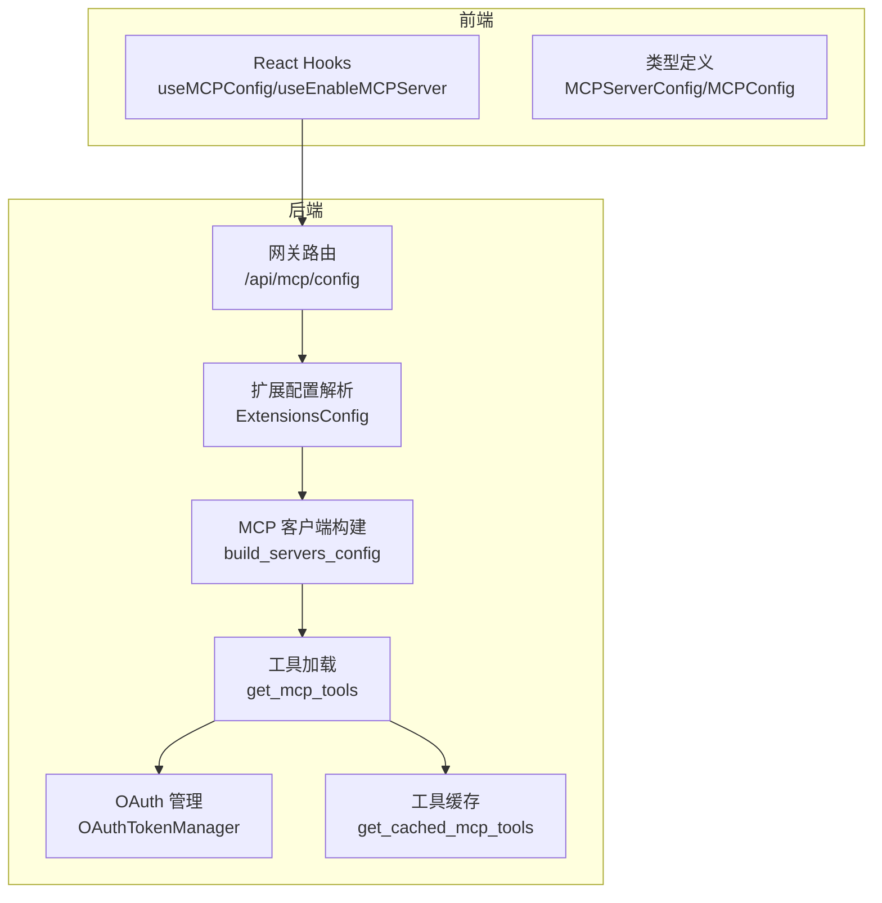
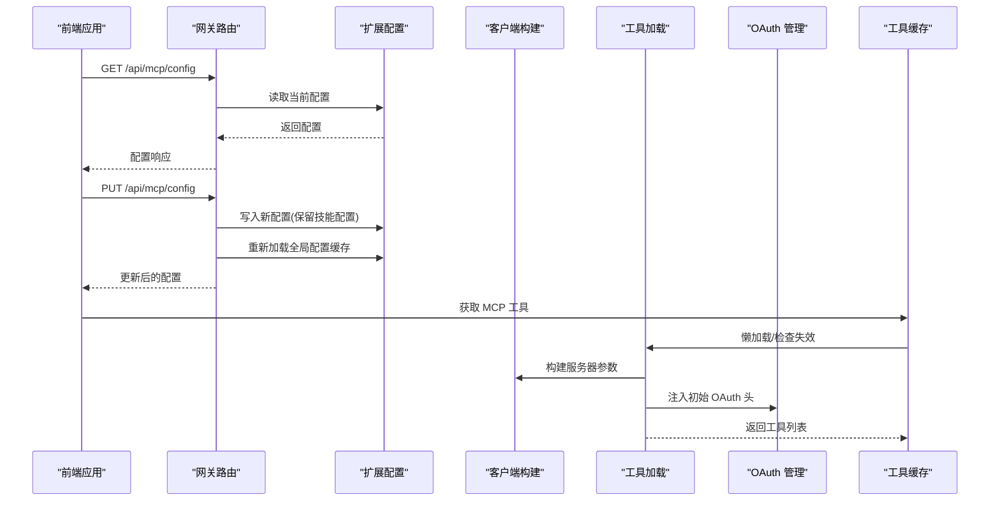
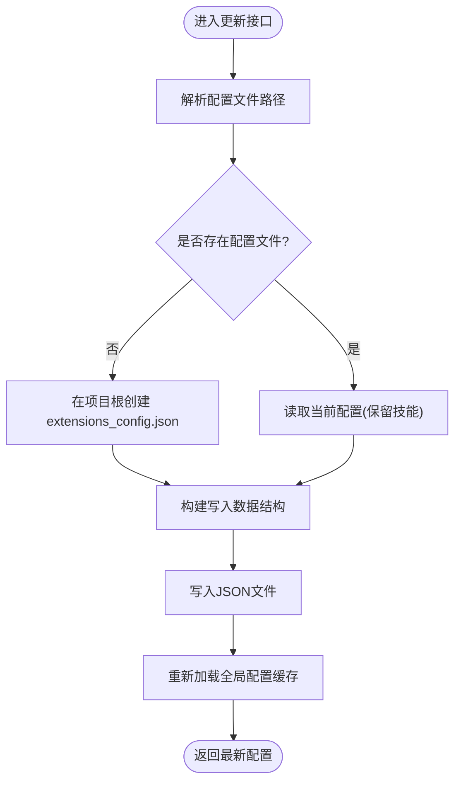
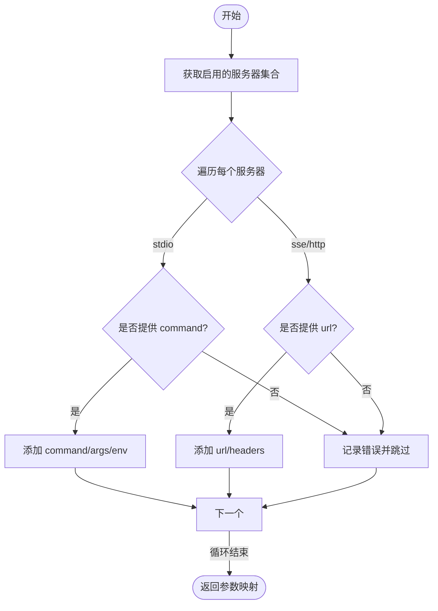
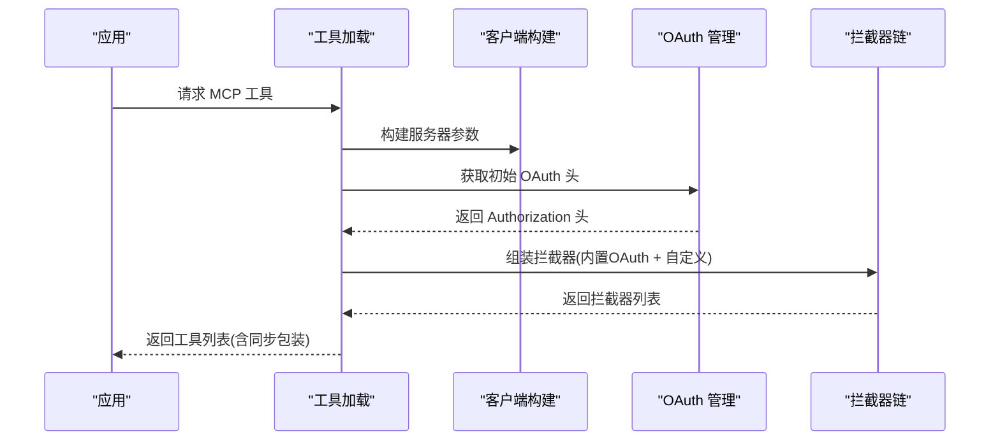
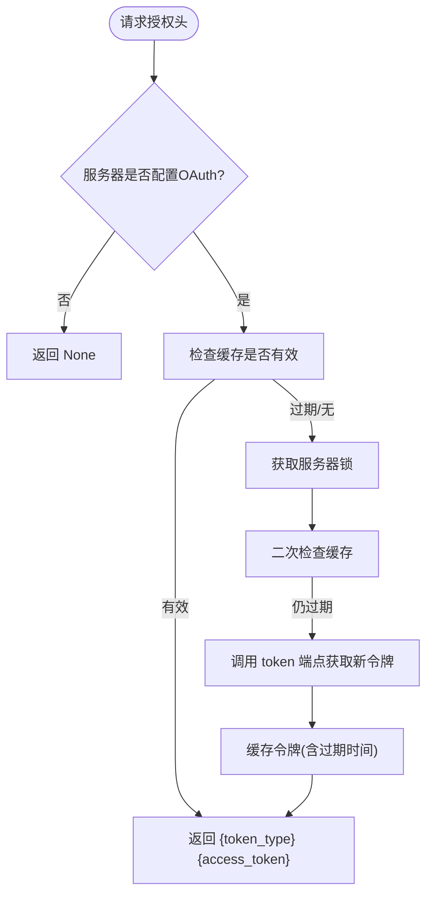
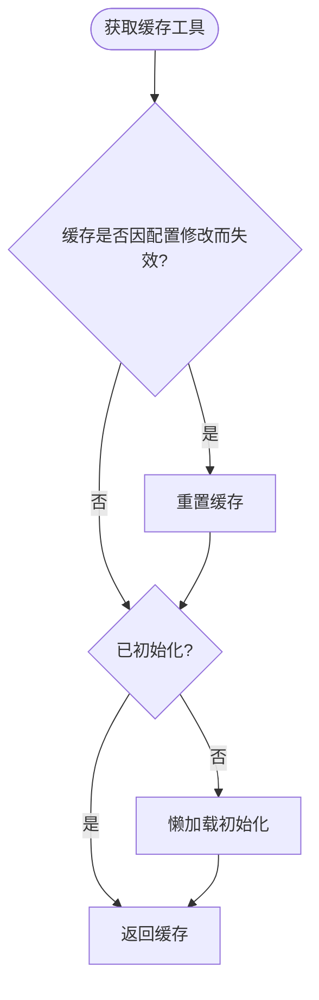
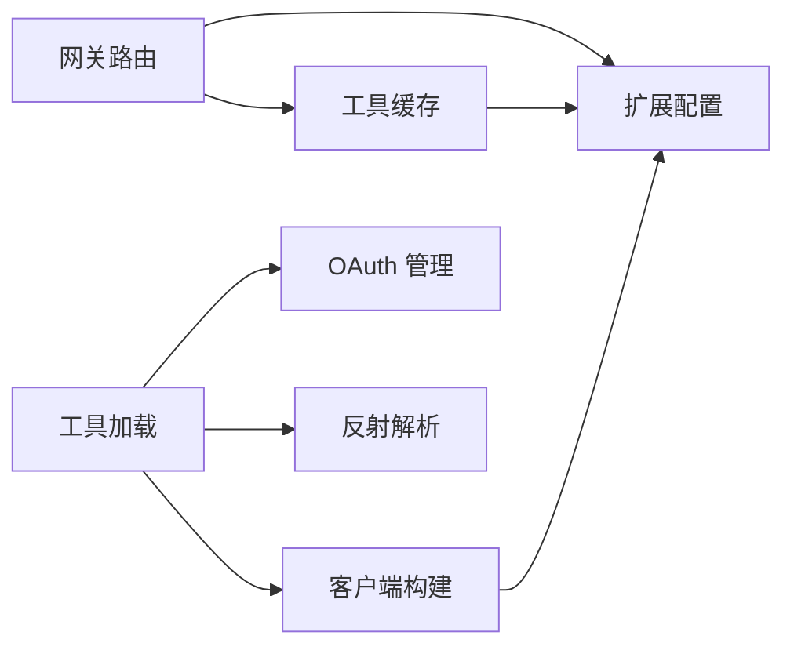

# MCP 路由器

<cite>
**本文档引用的文件**
- [backend/app/gateway/routers/mcp.py](file://backend/app/gateway/routers/mcp.py)
- [backend/packages/harness/deerflow/mcp/client.py](file://backend/packages/harness/deerflow/mcp/client.py)
- [backend/packages/harness/deerflow/mcp/tools.py](file://backend/packages/harness/deerflow/mcp/tools.py)
- [backend/packages/harness/deerflow/mcp/oauth.py](file://backend/packages/harness/deerflow/mcp/oauth.py)
- [backend/packages/harness/deerflow/mcp/cache.py](file://backend/packages/harness/deerflow/mcp/cache.py)
- [backend/docs/MCP_SERVER.md](file://backend/docs/MCP_SERVER.md)
- [extensions_config.example.json](file://extensions_config.example.json)
- [backend/tests/test_mcp_oauth.py](file://backend/tests/test_mcp_oauth.py)
- [backend/tests/test_mcp_custom_interceptors.py](file://backend/tests/test_mcp_custom_interceptors.py)
- [backend/tests/test_mcp_client_config.py](file://backend/tests/test_mcp_client_config.py)
- [frontend/src/core/mcp/hooks.ts](file://frontend/src/core/mcp/hooks.ts)
- [frontend/src/core/mcp/types.ts](file://frontend/src/core/mcp/types.ts)
</cite>

## 目录
1. [简介](#简介)
2. [项目结构](#项目结构)
3. [核心组件](#核心组件)
4. [架构总览](#架构总览)
5. [详细组件分析](#详细组件分析)
6. [依赖关系分析](#依赖关系分析)
7. [性能考量](#性能考量)
8. [故障排查指南](#故障排查指南)
9. [结论](#结论)
10. [附录](#附录)

## 简介
本文件面向 MCP（Model Context Protocol）路由器的技术文档，系统阐述 DeerFlow 中 MCP 服务器配置管理 API 的实现机制、配置文件的读写与热重载、动态配置更新流程、启用/禁用机制、进程管理与代理运行时集成、OAuth 支持、拦截器扩展、错误处理与安全考虑，并提供最佳实践与调试技巧。

## 项目结构
MCP 路由器相关代码主要分布在以下位置：
- 后端网关路由：提供 MCP 配置的查询与更新 API
- MCP 客户端与工具加载：构建多服务器客户端、加载工具、同步适配
- OAuth 支持：令牌获取、缓存与刷新
- 缓存与热重载：基于配置文件 mtime 的懒加载与失效检测
- 文档与示例：配置示例与使用说明
- 前端集成：React Query Hooks 与类型定义

图表来源
- [backend/app/gateway/routers/mcp.py:66-169](file://backend/app/gateway/routers/mcp.py#L66-L169)
- [backend/packages/harness/deerflow/mcp/client.py:45-68](file://backend/packages/harness/deerflow/mcp/client.py#L45-L68)
- [backend/packages/harness/deerflow/mcp/tools.py:57-136](file://backend/packages/harness/deerflow/mcp/tools.py#L57-L136)
- [backend/packages/harness/deerflow/mcp/oauth.py:25-151](file://backend/packages/harness/deerflow/mcp/oauth.py#L25-L151)
- [backend/packages/harness/deerflow/mcp/cache.py:56-143](file://backend/packages/harness/deerflow/mcp/cache.py#L56-L143)
- [frontend/src/core/mcp/hooks.ts:1-44](file://frontend/src/core/mcp/hooks.ts#L1-L44)
- [frontend/src/core/mcp/types.ts:1-8](file://frontend/src/core/mcp/types.ts#L1-L8)

章节来源
- [backend/app/gateway/routers/mcp.py:1-170](file://backend/app/gateway/routers/mcp.py#L1-L170)
- [backend/packages/harness/deerflow/mcp/client.py:1-69](file://backend/packages/harness/deerflow/mcp/client.py#L1-L69)
- [backend/packages/harness/deerflow/mcp/tools.py:1-136](file://backend/packages/harness/deerflow/mcp/tools.py#L1-L136)
- [backend/packages/harness/deerflow/mcp/oauth.py:1-151](file://backend/packages/harness/deerflow/mcp/oauth.py#L1-L151)
- [backend/packages/harness/deerflow/mcp/cache.py:1-143](file://backend/packages/harness/deerflow/mcp/cache.py#L1-L143)
- [backend/docs/MCP_SERVER.md:1-100](file://backend/docs/MCP_SERVER.md#L1-L100)
- [extensions_config.example.json:1-45](file://extensions_config.example.json#L1-L45)
- [frontend/src/core/mcp/hooks.ts:1-44](file://frontend/src/core/mcp/hooks.ts#L1-L44)
- [frontend/src/core/mcp/types.ts:1-8](file://frontend/src/core/mcp/types.ts#L1-L8)

## 核心组件
- 网关路由模块：提供 GET/PUT 接口用于读取与更新 MCP 配置；更新时写入扩展配置文件并触发全局配置缓存重载。
- MCP 客户端构建：根据启用的服务器配置生成多服务器客户端参数，支持 stdio、sse、http 传输。
- 工具加载：异步初始化 MCP 工具，注入初始 OAuth 头部与自定义拦截器，同时为同步调用提供包装器。
- OAuth 管理：令牌缓存、并发安全刷新、过期前刷新策略与授权头注入。
- 工具缓存：基于配置文件 mtime 的懒加载与失效检测，支持跨进程热重载。
- 前端集成：React Query Hooks 封装配置读取与启用切换，统一类型定义。

章节来源
- [backend/app/gateway/routers/mcp.py:66-169](file://backend/app/gateway/routers/mcp.py#L66-L169)
- [backend/packages/harness/deerflow/mcp/client.py:11-68](file://backend/packages/harness/deerflow/mcp/client.py#L11-L68)
- [backend/packages/harness/deerflow/mcp/tools.py:57-136](file://backend/packages/harness/deerflow/mcp/tools.py#L57-L136)
- [backend/packages/harness/deerflow/mcp/oauth.py:25-151](file://backend/packages/harness/deerflow/mcp/oauth.py#L25-L151)
- [backend/packages/harness/deerflow/mcp/cache.py:56-143](file://backend/packages/harness/deerflow/mcp/cache.py#L56-L143)
- [frontend/src/core/mcp/hooks.ts:1-44](file://frontend/src/core/mcp/hooks.ts#L1-L44)
- [frontend/src/core/mcp/types.ts:1-8](file://frontend/src/core/mcp/types.ts#L1-L8)

## 架构总览
下图展示从前端到后端、再到 MCP 工具加载与 OAuth 的整体交互流程：

图表来源
- [backend/app/gateway/routers/mcp.py:66-169](file://backend/app/gateway/routers/mcp.py#L66-L169)
- [backend/packages/harness/deerflow/mcp/cache.py:82-131](file://backend/packages/harness/deerflow/mcp/cache.py#L82-L131)
- [backend/packages/harness/deerflow/mcp/tools.py:57-136](file://backend/packages/harness/deerflow/mcp/tools.py#L57-L136)
- [backend/packages/harness/deerflow/mcp/client.py:45-68](file://backend/packages/harness/deerflow/mcp/client.py#L45-L68)
- [backend/packages/harness/deerflow/mcp/oauth.py:140-151](file://backend/packages/harness/deerflow/mcp/oauth.py#L140-L151)

## 详细组件分析

### 网关路由：MCP 配置管理 API
- GET /api/mcp/config：返回当前 MCP 服务器配置映射，包含启用状态、传输类型、命令/URL、环境变量/头部、OAuth 配置与描述。
- PUT /api/mcp/config：接收新的服务器配置映射，写入扩展配置文件（保留现有技能配置），记录日志并重新加载全局配置缓存；异常时返回 500。
- 配置文件：优先解析现有配置路径，若不存在则在项目根目录创建扩展配置文件；写入键名采用“mcpServers”和“skills”。

图表来源
- [backend/app/gateway/routers/mcp.py:136-165](file://backend/app/gateway/routers/mcp.py#L136-L165)

章节来源
- [backend/app/gateway/routers/mcp.py:66-169](file://backend/app/gateway/routers/mcp.py#L66-L169)

### MCP 客户端构建：服务器参数生成
- 支持三种传输类型：
  - stdio：要求提供 command；可选 env 与 args。
  - sse/http：要求提供 url；可选 headers。
- 对不合法配置抛出异常，确保运行时安全。
- 仅对启用的服务器进行参数构建，未启用服务器将被跳过。

图表来源
- [backend/packages/harness/deerflow/mcp/client.py:11-68](file://backend/packages/harness/deerflow/mcp/client.py#L11-L68)

章节来源
- [backend/packages/harness/deerflow/mcp/client.py:11-68](file://backend/packages/harness/deerflow/mcp/client.py#L11-L68)
- [backend/tests/test_mcp_client_config.py:9-93](file://backend/tests/test_mcp_client_config.py#L9-L93)

### 工具加载与拦截器：同步适配与自定义拦截器
- 异步初始化：每次加载均从磁盘读取最新扩展配置，保证跨进程变更即时生效。
- 初始 OAuth 头注入：为 HTTP/SSE 服务器连接阶段注入 Authorization 头。
- OAuth 工具拦截器：在工具调用阶段动态获取/刷新令牌并注入 Authorization。
- 自定义拦截器：通过扩展配置中的 mcpInterceptors 字段声明，支持单字符串归一化为列表；失败时记录警告但不阻断。
- 同步适配：为异步工具函数提供同步包装器，解决前端流式同步调用场景。

图表来源
- [backend/packages/harness/deerflow/mcp/tools.py:57-136](file://backend/packages/harness/deerflow/mcp/tools.py#L57-L136)
- [backend/packages/harness/deerflow/mcp/oauth.py:122-151](file://backend/packages/harness/deerflow/mcp/oauth.py#L122-L151)

章节来源
- [backend/packages/harness/deerflow/mcp/tools.py:57-136](file://backend/packages/harness/deerflow/mcp/tools.py#L57-L136)
- [backend/tests/test_mcp_custom_interceptors.py:55-275](file://backend/tests/test_mcp_custom_interceptors.py#L55-L275)

### OAuth 支持：令牌获取、缓存与刷新
- 令牌缓存：按服务器名缓存 access_token、token_type、过期时间。
- 并发安全：为每个服务器维护独立锁，避免重复刷新。
- 过期策略：在过期前 refresh_skew_seconds 秒刷新，确保调用稳定性。
- 支持的授权类型：client_credentials、refresh_token；缺失必要字段时抛出异常。
- 授权头注入：在连接初始化与工具调用阶段分别注入 Authorization 头。

图表来源
- [backend/packages/harness/deerflow/mcp/oauth.py:47-120](file://backend/packages/harness/deerflow/mcp/oauth.py#L47-L120)

章节来源
- [backend/packages/harness/deerflow/mcp/oauth.py:25-151](file://backend/packages/harness/deerflow/mcp/oauth.py#L25-L151)
- [backend/tests/test_mcp_oauth.py:39-192](file://backend/tests/test_mcp_oauth.py#L39-L192)

### 工具缓存与热重载：基于 mtime 的懒加载
- 初始化：首次调用时异步初始化，记录配置文件 mtime。
- 懒加载：若未初始化则自动初始化；若事件循环存在则在线程池中运行。
- 失效检测：比较当前 mtime 与缓存记录，若配置文件被修改则重置缓存并重新初始化。
- 重置：提供显式重置接口，便于测试或手动触发重载。

图表来源
- [backend/packages/harness/deerflow/mcp/cache.py:82-131](file://backend/packages/harness/deerflow/mcp/cache.py#L82-L131)

章节来源
- [backend/packages/harness/deerflow/mcp/cache.py:17-143](file://backend/packages/harness/deerflow/mcp/cache.py#L17-L143)

### 前端集成：Hooks 与类型
- useMCPConfig：查询 MCP 配置，支持加载状态与错误处理。
- useEnableMCPServer：启用/禁用指定服务器，成功后使配置查询失效并重新拉取。
- 类型定义：MCPServerConfig 与 MCPConfig 映射后端响应结构。

章节来源
- [frontend/src/core/mcp/hooks.ts:1-44](file://frontend/src/core/mcp/hooks.ts#L1-L44)
- [frontend/src/core/mcp/types.ts:1-8](file://frontend/src/core/mcp/types.ts#L1-L8)

## 依赖关系分析
- 组件耦合：
  - 网关路由依赖扩展配置解析与全局缓存重载。
  - 工具加载依赖客户端构建、OAuth 管理与反射解析。
  - 工具缓存依赖配置文件 mtime 与事件循环管理。
- 外部依赖：
  - langchain-mcp-adapters：多服务器 MCP 客户端与工具发现。
  - httpx：OAuth 令牌端点调用。
  - Pydantic：配置模型与序列化。
- 潜在循环依赖：未见直接循环导入；各模块职责清晰，通过函数调用解耦。

图表来源
- [backend/app/gateway/routers/mcp.py:9-9](file://backend/app/gateway/routers/mcp.py#L9-L9)
- [backend/packages/harness/deerflow/mcp/tools.py:12-15](file://backend/packages/harness/deerflow/mcp/tools.py#L12-L15)
- [backend/packages/harness/deerflow/mcp/cache.py:23-28](file://backend/packages/harness/deerflow/mcp/cache.py#L23-L28)

章节来源
- [backend/app/gateway/routers/mcp.py:1-170](file://backend/app/gateway/routers/mcp.py#L1-L170)
- [backend/packages/harness/deerflow/mcp/tools.py:1-136](file://backend/packages/harness/deerflow/mcp/tools.py#L1-L136)
- [backend/packages/harness/deerflow/mcp/cache.py:1-143](file://backend/packages/harness/deerflow/mcp/cache.py#L1-L143)

## 性能考量
- 异步与线程池：工具同步包装使用全局线程池，避免嵌套事件循环问题并提升吞吐。
- 懒加载与缓存：仅在首次使用时初始化，减少启动开销；配置变更时按需失效重载。
- 并发刷新：服务器级锁避免重复请求令牌，降低外部依赖压力。
- I/O 优化：从磁盘读取最新配置，确保跨进程一致性，避免不必要的重复加载。

## 故障排查指南
- 配置写入失败：检查目标路径权限与磁盘空间；查看网关路由异常日志。
- MCP 工具为空：确认至少有一个启用的服务器且配置合法；检查 langchain-mcp-adapters 是否安装。
- OAuth 失败：核对 token_url、grant_type、client_id/client_secret/refresh_token；关注过期与刷新偏移设置。
- 自定义拦截器无效：检查 mcpInterceptors 格式（字符串或列表）、导入路径与可调用性；查看警告日志。
- 热重载未生效：确认配置文件 mtime 变更；检查事件循环状态与懒加载分支。

章节来源
- [backend/app/gateway/routers/mcp.py:167-169](file://backend/app/gateway/routers/mcp.py#L167-L169)
- [backend/packages/harness/deerflow/mcp/tools.py:65-67](file://backend/packages/harness/deerflow/mcp/tools.py#L65-L67)
- [backend/packages/harness/deerflow/mcp/oauth.py:85-99](file://backend/packages/harness/deerflow/mcp/oauth.py#L85-L99)
- [backend/tests/test_mcp_custom_interceptors.py:130-172](file://backend/tests/test_mcp_custom_interceptors.py#L130-L172)

## 结论
MCP 路由器通过清晰的路由层、可扩展的客户端构建、完善的 OAuth 支持与工具缓存机制，实现了 MCP 服务器的灵活启用/禁用、动态配置更新与跨进程热重载。配合前端 Hooks 与类型定义，提供了良好的用户体验与可观测性。建议在生产环境中严格管理 OAuth 凭据、监控令牌刷新与工具加载日志，并通过测试覆盖关键路径以保障稳定性。

## 附录

### 配置文件与示例
- 扩展配置示例：包含 mcpInterceptors、mcpServers 与 skills 字段，支持多种传输类型与 OAuth 配置。
- 文档说明：涵盖设置步骤、OAuth 支持、自定义拦截器与能力示例。

章节来源
- [extensions_config.example.json:1-45](file://extensions_config.example.json#L1-L45)
- [backend/docs/MCP_SERVER.md:1-100](file://backend/docs/MCP_SERVER.md#L1-L100)