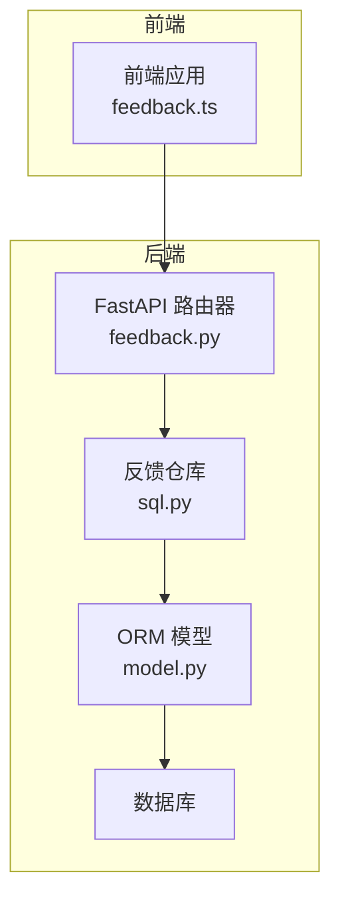
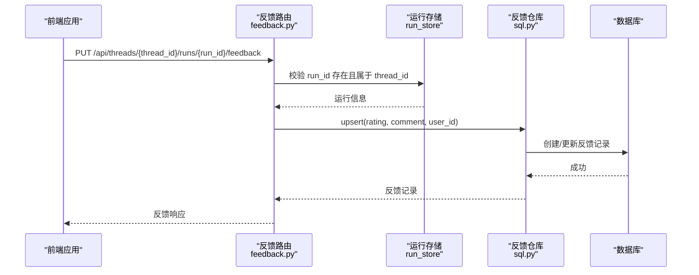
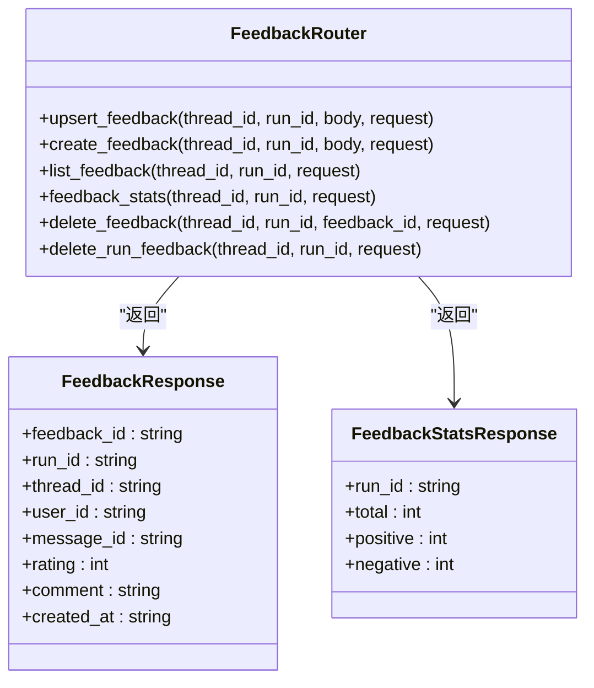
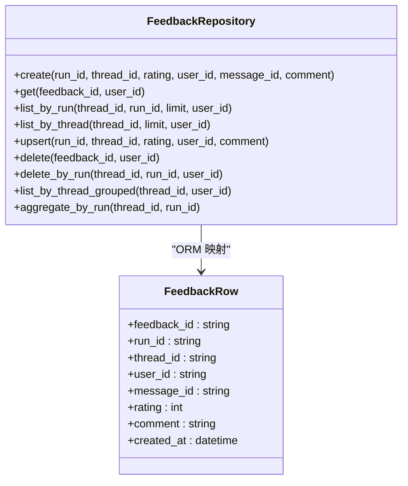
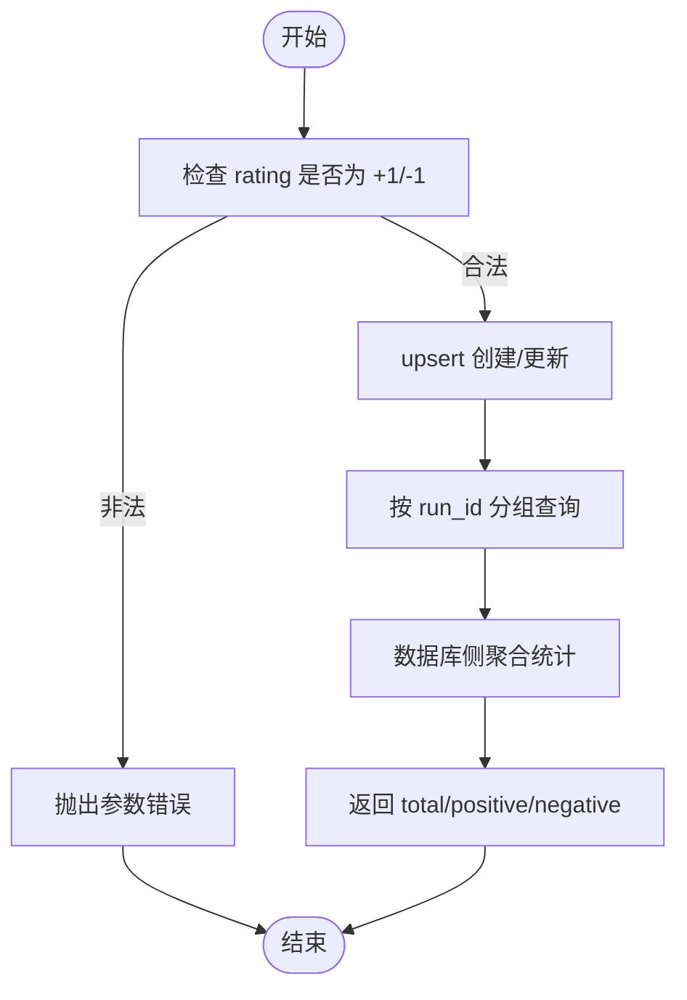
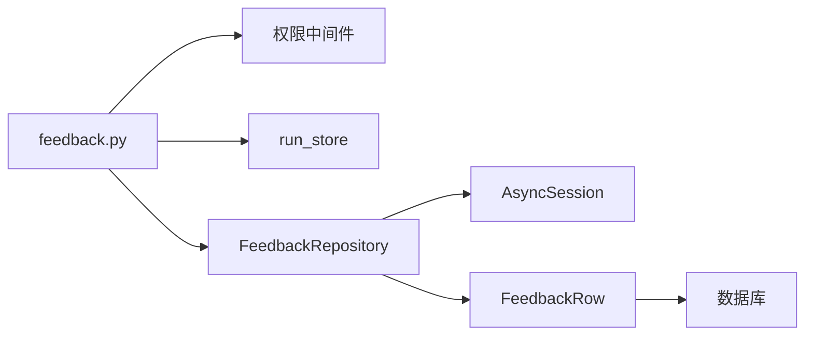

# 反馈路由器

<cite>
**本文引用的文件**
- [反馈路由实现 feedback.py](file://backend/app/gateway/routers/feedback.py)
- [反馈仓库 SQL 实现 sql.py](file://backend/packages/harness/deerflow/persistence/feedback/sql.py)
- [反馈 ORM 模型 model.py](file://backend/packages/harness/deerflow/persistence/feedback/model.py)
- [前端反馈 API 封装 feedback.ts](file://frontend/src/core/api/feedback.ts)
- [反馈相关测试 test_feedback.py](file://backend/tests/test_feedback.py)
- [API 参考文档 API.md](file://backend/docs/API.md)
- [配置指南 CONFIGURATION.md](file://backend/docs/CONFIGURATION.md)
- [自动标题生成 AUTO_TITLE_GENERATION.md](file://backend/docs/AUTO_TITLE_GENERATION.md)
</cite>

## 目录
1. [简介](#简介)
2. [项目结构](#项目结构)
3. [核心组件](#核心组件)
4. [架构总览](#架构总览)
5. [详细组件分析](#详细组件分析)
6. [依赖关系分析](#依赖关系分析)
7. [性能考量](#性能考量)
8. [故障排查指南](#故障排查指南)
9. [结论](#结论)
10. [附录](#附录)

## 简介
本文件为“反馈路由器”提供全面技术文档，聚焦用户反馈收集 API 的实现机制、反馈数据的存储与聚合统计、以及与数据分析系统的集成路径。文档同时覆盖反馈处理的自动化策略、情感分析机制与改进建议生成的衔接思路，并给出配置与使用指南。

## 项目结构
反馈系统围绕后端 FastAPI 路由器、SQLAlchemy 仓库层与前端 API 封装展开，形成清晰的分层架构：
- 路由层：提供反馈提交、查询、统计与删除接口
- 仓储层：基于 SQLAlchemy 的异步 ORM 访问与聚合统计
- 前端封装：统一的反馈 API 调用方法
- 测试与文档：完备的单元测试与 API 文档支撑

图表来源
- [反馈路由实现 feedback.py:1-189](file://backend/app/gateway/routers/feedback.py#L1-L189)
- [反馈仓库 SQL 实现 sql.py:1-218](file://backend/packages/harness/deerflow/persistence/feedback/sql.py#L1-L218)
- [反馈 ORM 模型 model.py:1-33](file://backend/packages/harness/deerflow/persistence/feedback/model.py#L1-L33)

章节来源
- [反馈路由实现 feedback.py:1-189](file://backend/app/gateway/routers/feedback.py#L1-L189)
- [反馈仓库 SQL 实现 sql.py:1-218](file://backend/packages/harness/deerflow/persistence/feedback/sql.py#L1-L218)
- [反馈 ORM 模型 model.py:1-33](file://backend/packages/harness/deerflow/persistence/feedback/model.py#L1-L33)
- [前端反馈 API 封装 feedback.ts:1-43](file://frontend/src/core/api/feedback.ts#L1-L43)

## 核心组件
- 反馈路由（FastAPI）：提供反馈提交、更新、删除、列表与统计接口，具备权限校验与运行期校验
- 反馈仓库（SQLAlchemy）：提供创建、查询、聚合统计、去重更新等能力，支持按运行与线程维度检索
- 反馈 ORM 模型：定义 feedback 表结构与索引约束，支持按用户与运行去重
- 前端封装：提供 upsert 与删除反馈的统一方法，便于在 UI 中直接调用

章节来源
- [反馈路由实现 feedback.py:27-54](file://backend/app/gateway/routers/feedback.py#L27-L54)
- [反馈仓库 SQL 实现 sql.py:18-218](file://backend/packages/harness/deerflow/persistence/feedback/sql.py#L18-L218)
- [反馈 ORM 模型 model.py:13-33](file://backend/packages/harness/deerflow/persistence/feedback/model.py#L13-L33)
- [前端反馈 API 封装 feedback.ts:11-42](file://frontend/src/core/api/feedback.ts#L11-L42)

## 架构总览
反馈系统采用“路由-仓储-模型-数据库”的分层设计，请求流如下：
- 前端调用 upsertFeedback，向后端提交评分与评论
- 路由器进行权限与运行存在性校验
- 仓储层执行创建/更新逻辑，返回标准化结果
- 数据库持久化，支持后续统计与分析

图表来源
- [反馈路由实现 feedback.py:61-89](file://backend/app/gateway/routers/feedback.py#L61-L89)
- [反馈仓库 SQL 实现 sql.py:125-163](file://backend/packages/harness/deerflow/persistence/feedback/sql.py#L125-L163)

章节来源
- [反馈路由实现 feedback.py:61-89](file://backend/app/gateway/routers/feedback.py#L61-L89)
- [反馈仓库 SQL 实现 sql.py:125-163](file://backend/packages/harness/deerflow/persistence/feedback/sql.py#L125-L163)

## 详细组件分析

### 路由器组件
- 接口职责
  - upsert_feedback：幂等更新用户对某次运行的反馈
  - create_feedback：创建新反馈
  - list_feedback：列出某次运行的所有反馈
  - feedback_stats：按运行聚合正负面数量
  - delete_feedback/delete_run_feedback：删除单条或当前用户的全部反馈
- 校验机制
  - 权限校验：require_permission 对线程写/读/删权限进行校验
  - 运行存在性校验：通过 run_store.get 校验 run_id 属于 thread_id
  - 评分范围校验：仅允许 +1/-1
- 响应模型
  - FeedbackResponse：包含 feedback_id、run_id、thread_id、user_id、message_id、rating、comment、created_at
  - FeedbackStatsResponse：包含 total、positive、negative

图表来源
- [反馈路由实现 feedback.py:27-54](file://backend/app/gateway/routers/feedback.py#L27-L54)
- [反馈路由实现 feedback.py:61-189](file://backend/app/gateway/routers/feedback.py#L61-L189)

章节来源
- [反馈路由实现 feedback.py:27-54](file://backend/app/gateway/routers/feedback.py#L27-L54)
- [反馈路由实现 feedback.py:61-189](file://backend/app/gateway/routers/feedback.py#L61-L189)

### 仓储组件（SQLAlchemy）
- 核心能力
  - create：创建反馈记录，校验评分合法性
  - get/list_by_run/list_by_thread：按条件查询，支持用户隔离
  - upsert：按 (thread_id, run_id, user_id) 去重更新
  - delete/delete_by_run：删除单条或当前用户全部反馈
  - aggregate_by_run：数据库侧聚合统计（总数、正/负数）
  - list_by_thread_grouped：按运行分组返回最新一条反馈
- 用户隔离
  - 通过 resolve_user_id 解析 AUTO 或显式 user_id，确保查询与删除的用户一致性
- 性能特性
  - 聚合统计使用数据库函数计数，减少网络传输
  - 多处查询带索引字段（run_id、thread_id、user_id），提升检索效率

图表来源
- [反馈仓库 SQL 实现 sql.py:18-218](file://backend/packages/harness/deerflow/persistence/feedback/sql.py#L18-L218)
- [反馈 ORM 模型 model.py:13-33](file://backend/packages/harness/deerflow/persistence/feedback/model.py#L13-L33)

章节来源
- [反馈仓库 SQL 实现 sql.py:18-218](file://backend/packages/harness/deerflow/persistence/feedback/sql.py#L18-L218)
- [反馈 ORM 模型 model.py:13-33](file://backend/packages/harness/deerflow/persistence/feedback/model.py#L13-L33)

### ORM 模型
- 表结构与约束
  - 主键 feedback_id，唯一约束 (thread_id, run_id, user_id)，避免同一用户对同一运行重复反馈
  - 字段：run_id、thread_id、user_id、message_id、rating、comment、created_at
- 索引策略
  - run_id、thread_id、user_id 建有索引，支撑高频查询与聚合

章节来源
- [反馈 ORM 模型 model.py:13-33](file://backend/packages/harness/deerflow/persistence/feedback/model.py#L13-L33)

### 前端封装
- 方法
  - upsertFeedback：幂等更新反馈（PUT）
  - deleteFeedback：删除当前用户对该运行的反馈（DELETE）
- 请求地址
  - 基于 getBackendBaseURL 动态拼接 /api/threads/{threadId}/runs/{runId}/feedback
- 错误处理
  - 非 2xx 抛出异常，便于上层 UI 层统一提示

章节来源
- [前端反馈 API 封装 feedback.ts:11-42](file://frontend/src/core/api/feedback.ts#L11-L42)

### 数据聚合与统计流程
- 聚合统计
  - aggregate_by_run 使用数据库函数进行计数，返回 total、positive、negative
- 分组查询
  - list_by_thread_grouped 按 run_id 分组，返回每条运行的最新反馈
- 列表查询
  - list_by_run/list_by_thread 支持 limit 与用户隔离过滤

图表来源
- [反馈仓库 SQL 实现 sql.py:125-163](file://backend/packages/harness/deerflow/persistence/feedback/sql.py#L125-L163)
- [反馈仓库 SQL 实现 sql.py:203-217](file://backend/packages/harness/deerflow/persistence/feedback/sql.py#L203-L217)

章节来源
- [反馈仓库 SQL 实现 sql.py:125-163](file://backend/packages/harness/deerflow/persistence/feedback/sql.py#L125-L163)
- [反馈仓库 SQL 实现 sql.py:203-217](file://backend/packages/harness/deerflow/persistence/feedback/sql.py#L203-L217)

### 反馈处理自动化策略
- 自动检测与关联
  - 通过 run_store 的最新成功运行，可推断“后续反馈”关联关系（测试用例展示了该逻辑）
- 与运行生命周期集成
  - 反馈与 run_id 强绑定，便于在运行结束后进行质量评估与改进建议生成
- 与数据分析系统的衔接
  - 聚合统计可作为报告生成的数据输入；结合咨询分析技能可产出结构化报告

章节来源
- [反馈相关测试 test_feedback.py:267-290](file://backend/tests/test_feedback.py#L267-L290)

### 情感分析机制与改进建议生成
- 当前实现
  - 反馈以二元标签（+1/-1）存储，不包含细粒度情感标签
- 建议扩展
  - 在评论字段 comment 上引入轻量情感分析（如基于规则或简单模型），标注情感强度与类别
  - 结合评论内容生成改进建议：将正负面反馈映射到具体交互维度，生成可执行的优化清单
- 与报告生成衔接
  - 咨询分析技能可将反馈统计与评论内容整合，生成结构化报告与可视化建议

章节来源
- [API 参考文档 API.md:1-656](file://backend/docs/API.md#L1-L656)
- [自动标题生成 AUTO_TITLE_GENERATION.md:1-259](file://backend/docs/AUTO_TITLE_GENERATION.md#L1-L259)

## 依赖关系分析
- 路由器依赖
  - 权限中间件：require_permission
  - 运行存储：get_run_store
  - 反馈仓库：get_feedback_repo
- 仓储依赖
  - SQLAlchemy 异步会话工厂
  - 用户上下文解析 resolve_user_id
- ORM 依赖
  - FeedbackRow 映射 feedback 表

图表来源
- [反馈路由实现 feedback.py:15-16](file://backend/app/gateway/routers/feedback.py#L15-L16)
- [反馈仓库 SQL 实现 sql.py:18-21](file://backend/packages/harness/deerflow/persistence/feedback/sql.py#L18-L21)
- [反馈 ORM 模型 model.py:10-11](file://backend/packages/harness/deerflow/persistence/feedback/model.py#L10-L11)

章节来源
- [反馈路由实现 feedback.py:15-16](file://backend/app/gateway/routers/feedback.py#L15-L16)
- [反馈仓库 SQL 实现 sql.py:18-21](file://backend/packages/harness/deerflow/persistence/feedback/sql.py#L18-L21)
- [反馈 ORM 模型 model.py:10-11](file://backend/packages/harness/deerflow/persistence/feedback/model.py#L10-L11)

## 性能考量
- 查询优化
  - 仓储层多处查询使用索引字段（run_id、thread_id、user_id），降低扫描成本
  - 聚合统计在数据库侧完成，减少网络往返与序列化开销
- 幂等更新
  - upsert 按 (thread_id, run_id, user_id) 去重，避免重复记录与后续查询膨胀
- 会话管理
  - 每个方法独立获取/释放异步会话，避免长事务占用资源

章节来源
- [反馈仓库 SQL 实现 sql.py:84-87](file://backend/packages/harness/deerflow/persistence/feedback/sql.py#L84-L87)
- [反馈仓库 SQL 实现 sql.py:139-143](file://backend/packages/harness/deerflow/persistence/feedback/sql.py#L139-L143)
- [反馈仓库 SQL 实现 sql.py:205-209](file://backend/packages/harness/deerflow/persistence/feedback/sql.py#L205-L209)

## 故障排查指南
- 常见错误与定位
  - 400 参数错误：评分不在 (+1/-1) 范围内
  - 404 资源不存在：run_id 不存在或不属于指定 thread_id
  - 404 删除失败：反馈不存在或不属于指定 run/thread
- 单元测试参考
  - 覆盖创建、查询、聚合、upsert、删除等关键路径，可作为回归验证依据
- 配置检查
  - 确保数据库连接与会话工厂正确初始化
  - 若使用用户隔离，确认 resolve_user_id 解析逻辑符合预期

章节来源
- [反馈路由实现 feedback.py:70-80](file://backend/app/gateway/routers/feedback.py#L70-L80)
- [反馈路由实现 feedback.py:121-132](file://backend/app/gateway/routers/feedback.py#L121-L132)
- [反馈路由实现 feedback.py:180-187](file://backend/app/gateway/routers/feedback.py#L180-L187)
- [反馈相关测试 test_feedback.py:68-79](file://backend/tests/test_feedback.py#L68-L79)
- [反馈相关测试 test_feedback.py:135-146](file://backend/tests/test_feedback.py#L135-L146)

## 结论
反馈路由器以清晰的分层设计实现了用户反馈的采集、存储与统计，具备良好的扩展性与性能表现。通过与运行生命周期、数据分析与报告生成的衔接，可进一步构建完整的反馈驱动改进闭环。建议在评论内容层面引入轻量化情感分析与改进建议生成，以提升反馈价值转化效率。

## 附录

### API 使用示例（基于现有接口）
- 提交/更新反馈
  - 方法：PUT /api/threads/{thread_id}/runs/{run_id}/feedback
  - 请求体：{ rating: 1/-1, comment: "..." }
- 删除反馈
  - 方法：DELETE /api/threads/{thread_id}/runs/{run_id}/feedback
- 查询统计
  - 方法：GET /api/threads/{thread_id}/runs/{run_id}/feedback/stats

章节来源
- [反馈路由实现 feedback.py:61-189](file://backend/app/gateway/routers/feedback.py#L61-L189)
- [API 参考文档 API.md:1-656](file://backend/docs/API.md#L1-L656)

### 配置与部署要点
- 数据库与引擎
  - 使用异步 SQLAlchemy 会话工厂，确保并发安全与性能
- 权限与鉴权
  - 路由器已内置 require_permission，建议结合网关鉴权策略统一管理
- 前端集成
  - 前端 feedback.ts 已封装常用方法，可直接在 UI 中调用

章节来源
- [配置指南 CONFIGURATION.md:1-377](file://backend/docs/CONFIGURATION.md#L1-L377)
- [前端反馈 API 封装 feedback.ts:11-42](file://frontend/src/core/api/feedback.ts#L11-L42)