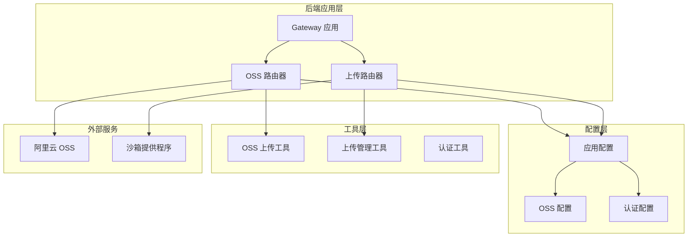
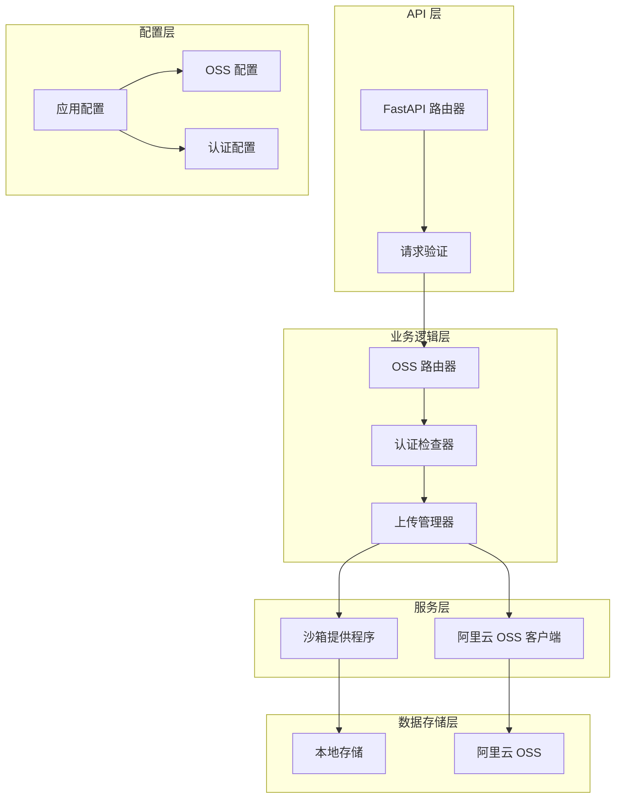
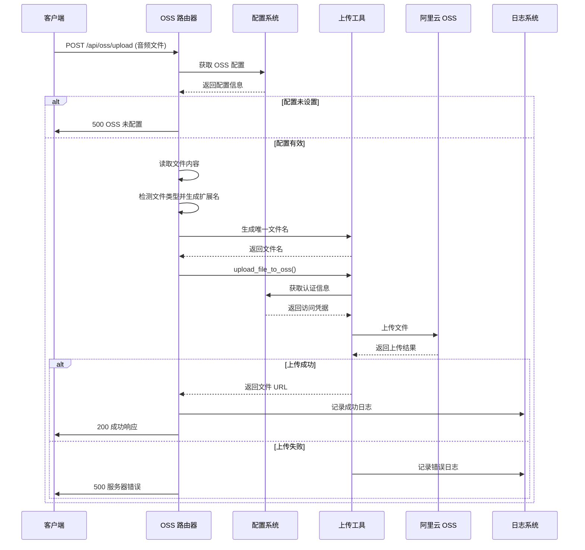
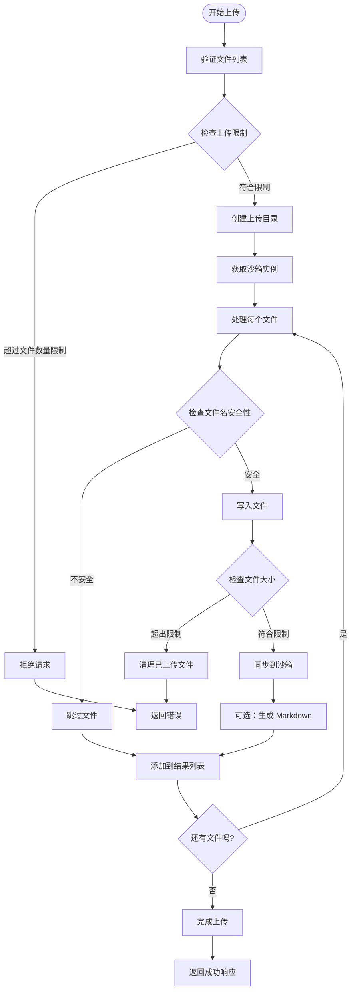
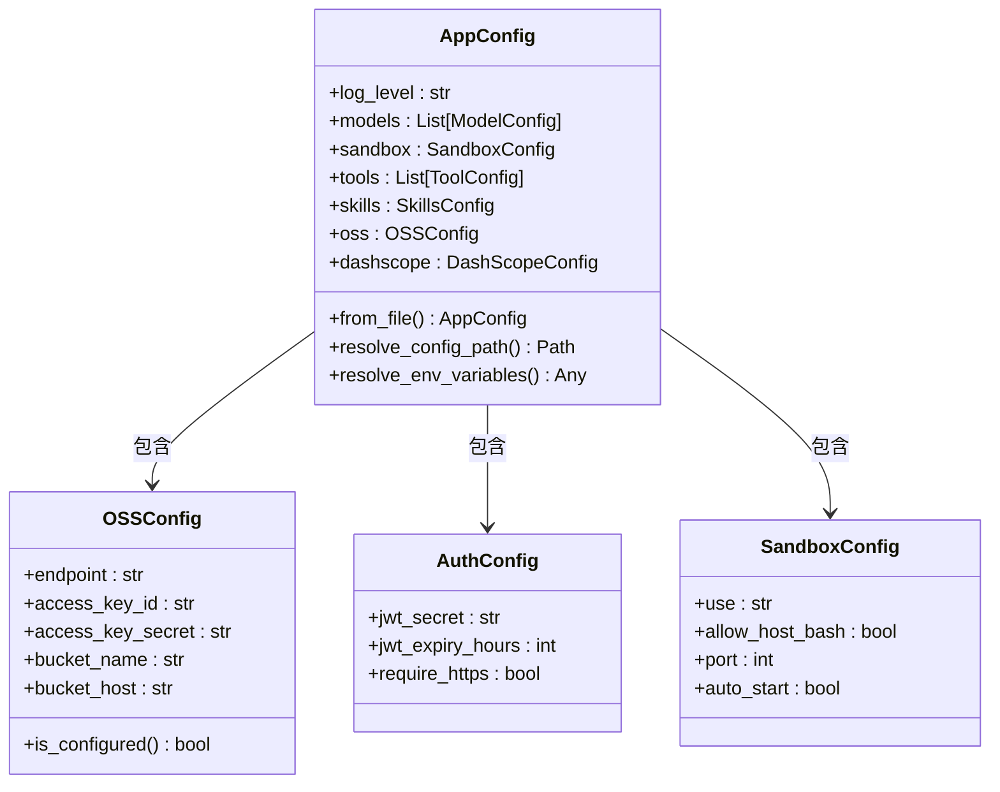
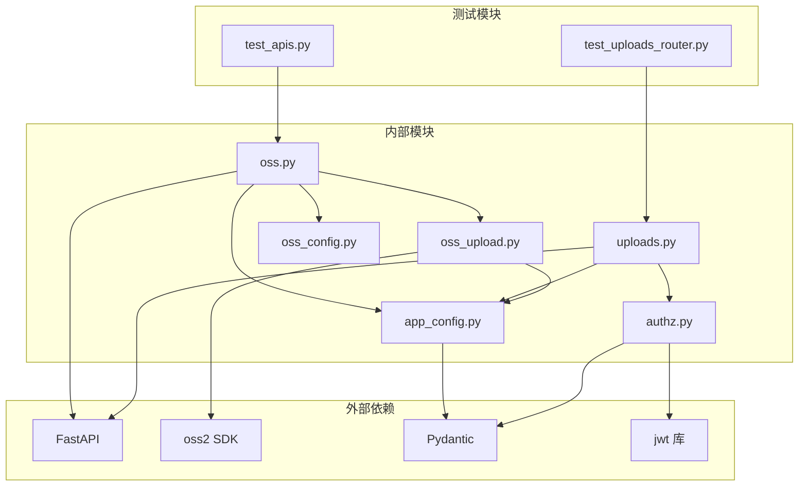

# 对象存储路由器

<cite>
**本文档引用的文件**
- [backend/app/gateway/routers/oss.py](file://backend/app/gateway/routers/oss.py)
- [backend/deerflow/utils/oss_upload.py](file://backend/deerflow/utils/oss_upload.py)
- [backend/packages/harness/deerflow/config/oss_config.py](file://backend/packages/harness/deerflow/config/oss_config.py)
- [backend/packages/harness/deerflow/config/app_config.py](file://backend/packages/harness/deerflow/config/app_config.py)
- [backend/app/gateway/routers/uploads.py](file://backend/app/gateway/routers/uploads.py)
- [backend/app/gateway/authz.py](file://backend/app/gateway/authz.py)
- [backend/docs/CONFIGURATION.md](file://backend/docs/CONFIGURATION.md)
- [backend/test_apis.py](file://backend/test_apis.py)
- [backend/tests/test_uploads_router.py](file://backend/tests/test_uploads_router.py)
</cite>

## 目录
1. [简介](#简介)
2. [项目结构](#项目结构)
3. [核心组件](#核心组件)
4. [架构概览](#架构概览)
5. [详细组件分析](#详细组件分析)
6. [依赖关系分析](#依赖关系分析)
7. [性能考虑](#性能考虑)
8. [故障排除指南](#故障排除指南)
9. [结论](#结论)
10. [附录](#附录)

## 简介

对象存储路由器是 DeerFlow 项目中的一个关键组件，专门负责处理云存储集成 API 和文件上传下载流程。该系统基于阿里云对象存储服务（OSS）构建，提供了完整的文件存储解决方案，包括：

- **云存储集成**：通过阿里云 OSS 提供的 API 进行文件存储
- **文件上传管理**：支持单文件和多文件上传，包含大小限制和安全检查
- **存储桶管理**：提供存储配置状态查询和管理功能
- **权限控制**：基于 JWT 的认证机制和细粒度的权限控制系统
- **安全加密**：通过 HTTPS 传输和访问密钥保护确保数据安全

该组件采用模块化设计，与系统的其他部分（如认证中间件、沙箱提供程序等）紧密集成，为用户提供了一个安全、可靠的云端文件存储解决方案。

## 项目结构

对象存储路由器在项目中的组织结构如下：



**图表来源**
- [backend/app/gateway/routers/oss.py:1-107](file://backend/app/gateway/routers/oss.py#L1-L107)
- [backend/app/gateway/routers/uploads.py:1-343](file://backend/app/gateway/routers/uploads.py#L1-L343)

**章节来源**
- [backend/app/gateway/routers/oss.py:1-107](file://backend/app/gateway/routers/oss.py#L1-L107)
- [backend/app/gateway/routers/uploads.py:1-343](file://backend/app/gateway/routers/uploads.py#L1-L343)

## 核心组件

### OSS 路由器

OSS 路由器是对象存储功能的主要入口点，提供了两个核心 API：

1. **文件上传接口** (`POST /api/oss/upload`)
   - 接收音频文件上传
   - 自动检测文件类型并生成合适的扩展名
   - 将文件存储到阿里云 OSS

2. **配置查询接口** (`GET /api/oss/config`)
   - 返回当前 OSS 配置状态
   - 检查配置是否完整有效

### OSS 上传工具

OSS 上传工具提供了底层的文件上传功能：

- **文件上传函数**：`upload_file_to_oss()`
- **文件名生成**：`generate_filename()`
- **错误处理**：完整的异常处理和日志记录

### 配置管理系统

系统使用 Pydantic 模型来管理配置：

- **OSSConfig**：阿里云 OSS 配置模型
- **AppConfig**：应用全局配置容器
- **环境变量解析**：支持从环境变量中读取配置

**章节来源**
- [backend/app/gateway/routers/oss.py:17-106](file://backend/app/gateway/routers/oss.py#L17-L106)
- [backend/deerflow/utils/oss_upload.py:15-81](file://backend/deerflow/utils/oss_upload.py#L15-L81)
- [backend/packages/harness/deerflow/config/oss_config.py:6-37](file://backend/packages/harness/deerflow/config/oss_config.py#L6-L37)

## 架构概览

对象存储路由器采用分层架构设计，各层职责明确：



**图表来源**
- [backend/app/gateway/routers/oss.py:35-106](file://backend/app/gateway/routers/oss.py#L35-L106)
- [backend/app/gateway/authz.py:131-194](file://backend/app/gateway/authz.py#L131-L194)

### 认证机制

系统采用基于 JWT 的认证机制：

1. **JWT 令牌**：用户登录后获得访问令牌
2. **令牌验证**：每次请求都验证 JWT 令牌的有效性
3. **权限检查**：根据用户权限决定访问控制
4. **会话管理**：支持令牌版本控制和过期处理

### 权限控制策略

权限控制采用资源-动作模型：

- **threads:read** - 查看线程
- **threads:write** - 创建/更新线程  
- **threads:delete** - 删除线程
- **runs:create** - 运行代理
- **runs:read** - 查看运行
- **runs:cancel** - 取消运行

**章节来源**
- [backend/app/gateway/authz.py:48-119](file://backend/app/gateway/authz.py#L48-L119)
- [backend/app/gateway/authz.py:197-301](file://backend/app/gateway/authz.py#L197-L301)

## 详细组件分析

### OSS 文件上传流程

文件上传流程展示了完整的端到端处理过程：



**图表来源**
- [backend/app/gateway/routers/oss.py:35-88](file://backend/app/gateway/routers/oss.py#L35-L88)
- [backend/deerflow/utils/oss_upload.py:15-62](file://backend/deerflow/utils/oss_upload.py#L15-L62)

### 上传管理器工作流程

上传管理器处理多文件上传和相关操作：



**图表来源**
- [backend/app/gateway/routers/uploads.py:170-293](file://backend/app/gateway/routers/uploads.py#L170-L293)

### 配置管理架构

配置管理系统采用分层设计：



**图表来源**
- [backend/packages/harness/deerflow/config/app_config.py:91-121](file://backend/packages/harness/deerflow/config/app_config.py#L91-L121)
- [backend/packages/harness/deerflow/config/oss_config.py:6-37](file://backend/packages/harness/deerflow/config/oss_config.py#L6-L37)

**章节来源**
- [backend/app/gateway/routers/oss.py:35-106](file://backend/app/gateway/routers/oss.py#L35-L106)
- [backend/app/gateway/routers/uploads.py:170-293](file://backend/app/gateway/routers/uploads.py#L170-L293)
- [backend/packages/harness/deerflow/config/app_config.py:91-121](file://backend/packages/harness/deerflow/config/app_config.py#L91-L121)

## 依赖关系分析

对象存储路由器的依赖关系展现了清晰的模块化架构：



**图表来源**
- [backend/app/gateway/routers/oss.py:6-10](file://backend/app/gateway/routers/oss.py#L6-L10)
- [backend/app/gateway/routers/uploads.py:7-29](file://backend/app/gateway/routers/uploads.py#L7-L29)

### 关键依赖特性

1. **轻量级依赖**：仅依赖必要的第三方库
2. **类型安全**：使用 Pydantic 进行数据验证
3. **异步支持**：充分利用 Python 异步特性
4. **测试友好**：模块化设计便于单元测试

**章节来源**
- [backend/app/gateway/routers/oss.py:1-14](file://backend/app/gateway/routers/oss.py#L1-L14)
- [backend/app/gateway/routers/uploads.py:1-34](file://backend/app/gateway/routers/uploads.py#L1-L34)

## 性能考虑

### 上传性能优化

系统在多个层面进行了性能优化：

1. **流式上传**：使用分块读取避免大文件内存占用
2. **并发处理**：支持多文件并发上传
3. **缓存策略**：配置信息缓存减少磁盘访问
4. **连接池**：OSS 客户端连接复用

### 内存管理

- **分块处理**：默认 8KB 分块大小平衡内存使用和网络效率
- **及时清理**：失败上传自动清理临时文件
- **资源释放**：确保文件句柄和网络连接正确关闭

### 网络优化

- **直连 OSS**：避免不必要的中间层
- **超时配置**：合理的连接和读取超时设置
- **重试机制**：在网络不稳定时自动重试

## 故障排除指南

### 常见问题及解决方案

#### OSS 配置问题

**问题**：OSS 未配置错误
**症状**：上传接口返回 500 错误
**解决方案**：
1. 检查 `config.yaml` 中的 OSS 配置
2. 验证环境变量是否正确设置
3. 确认阿里云 OSS 凭据有效性

#### 上传失败问题

**问题**：文件上传失败
**症状**：客户端收到上传失败响应
**排查步骤**：
1. 检查网络连接稳定性
2. 验证 OSS 存储桶权限
3. 确认文件大小未超过限制
4. 查看服务器日志获取详细错误信息

#### 权限问题

**问题**：认证失败或权限不足
**症状**：返回 401 或 403 错误
**解决方案**：
1. 验证 JWT 令牌有效性
2. 检查用户权限配置
3. 确认令牌未过期
4. 验证用户角色和权限

**章节来源**
- [backend/app/gateway/routers/oss.py:50-55](file://backend/app/gateway/routers/oss.py#L50-L55)
- [backend/deerflow/utils/oss_upload.py:36-40](file://backend/deerflow/utils/oss_upload.py#L36-L40)
- [backend/app/gateway/authz.py:259-267](file://backend/app/gateway/authz.py#L259-L267)

## 结论

对象存储路由器为 DeerFlow 项目提供了一个完整、安全、高效的云端文件存储解决方案。该系统具有以下优势：

1. **模块化设计**：清晰的分层架构便于维护和扩展
2. **安全性强**：完善的认证授权机制和数据保护措施
3. **性能优异**：优化的上传流程和资源管理
4. **易于使用**：简洁的 API 设计和详细的文档支持

通过集成阿里云 OSS，系统能够满足各种规模的应用需求，从个人开发者到企业级应用都能找到合适的使用场景。未来可以考虑增加更多云存储提供商的支持，以及更丰富的文件处理功能。

## 附录

### API 使用示例

#### 文件上传 API

```bash
# 上传音频文件到 OSS
curl -X POST "http://localhost:8001/api/oss/upload" \
  -H "Content-Type: multipart/form-data" \
  -F "file=@/path/to/audio.aac"
```

#### 配置查询 API

```bash
# 查询 OSS 配置状态
curl "http://localhost:8001/api/oss/config"
```

### 配置文件示例

```yaml
# config.yaml 中的 OSS 配置示例
oss:
  endpoint: "oss-cn-hangzhou.aliyuncs.com"
  access_key_id: "$ALIYUN_ACCESS_KEY_ID"
  access_key_secret: "$ALIYUN_ACCESS_KEY_SECRET"
  bucket_name: "your-bucket-name"
  bucket_host: "https://your-bucket.oss-cn-hangzhou.aliyuncs.com"
```

### 测试用例

系统包含完整的测试套件，覆盖主要功能：

- **OSS 上传测试**：验证文件上传功能
- **上传路由测试**：测试多文件上传和管理
- **认证测试**：验证 JWT 认证机制
- **权限测试**：测试权限控制功能

**章节来源**
- [backend/test_apis.py:157-196](file://backend/test_apis.py#L157-L196)
- [backend/tests/test_uploads_router.py:1-673](file://backend/tests/test_uploads_router.py#L1-L673)
- [backend/docs/CONFIGURATION.md:309-330](file://backend/docs/CONFIGURATION.md#L309-L330)