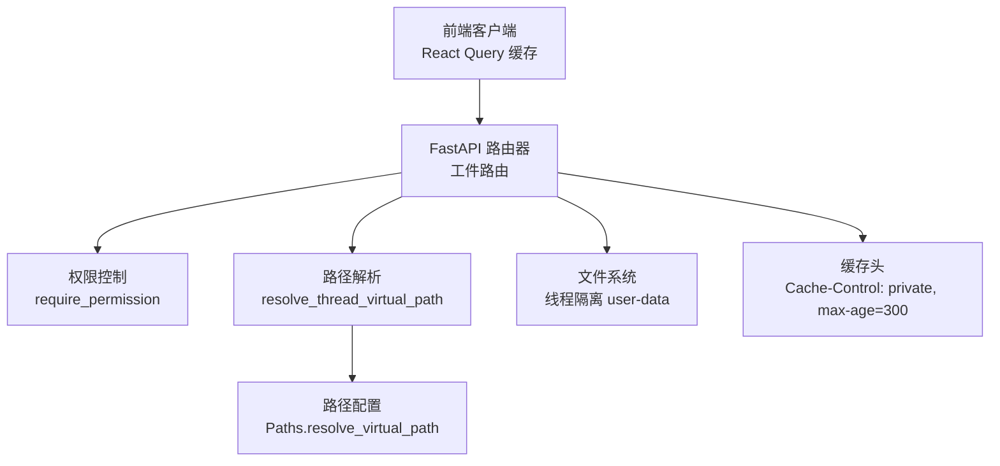
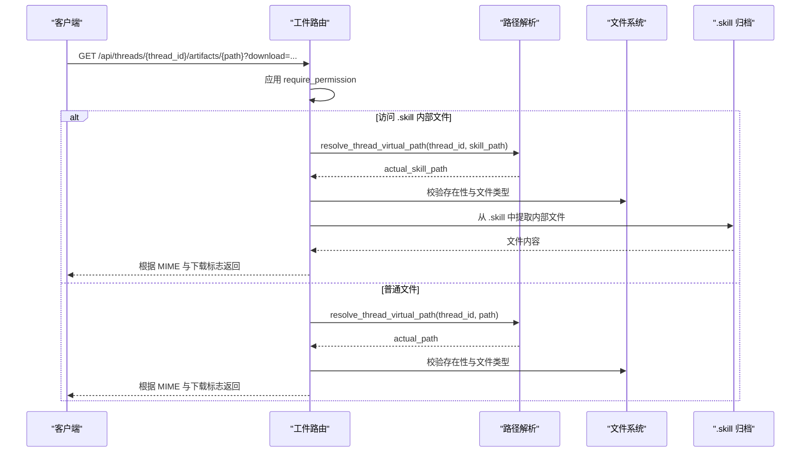
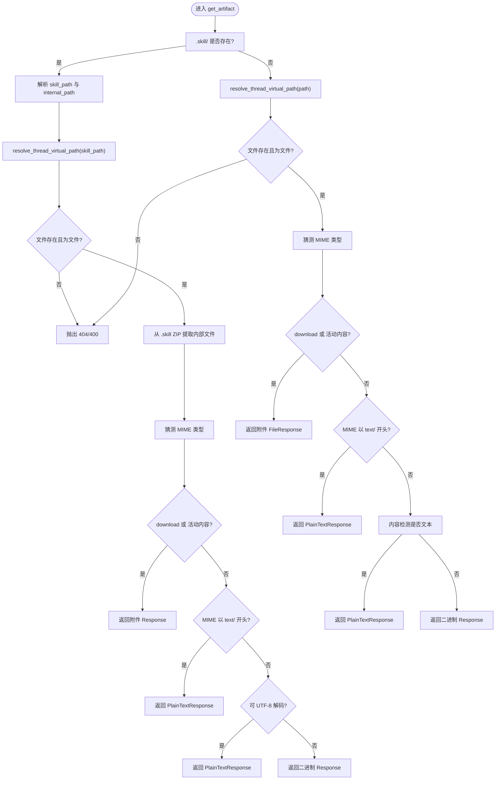
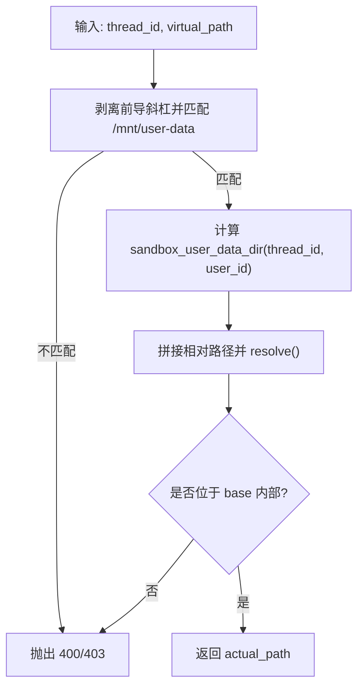
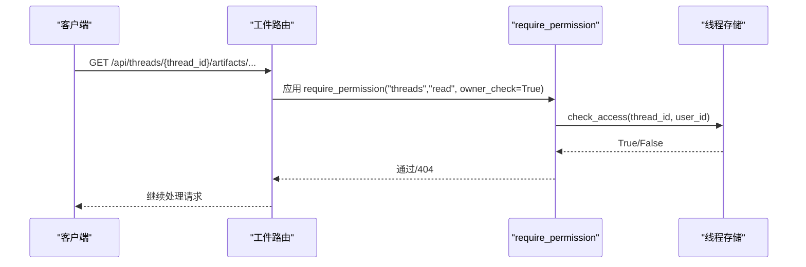
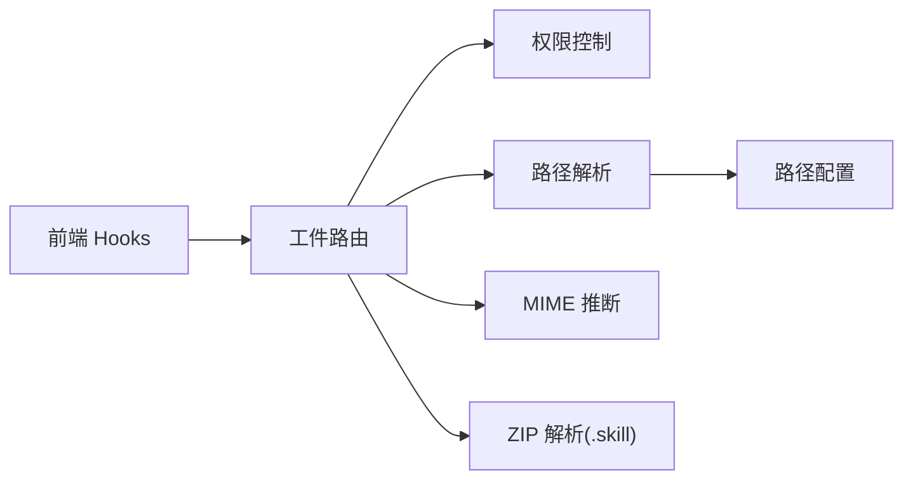

# 工件路由器

<cite>
**本文引用的文件**
- [artifacts.py](file://backend/app/gateway/routers/artifacts.py)
- [path_utils.py](file://backend/app/gateway/path_utils.py)
- [paths.py](file://backend/packages/harness/deerflow/config/paths.py)
- [authz.py](file://backend/app/gateway/authz.py)
- [test_artifacts_router.py](file://backend/tests/test_artifacts_router.py)
- [hooks.ts](file://frontend/src/core/artifacts/hooks.ts)
- [FILE_UPLOAD.md](file://backend/docs/FILE_UPLOAD.md)
- [PATH_EXAMPLES.md](file://backend/docs/PATH_EXAMPLES.md)
- [tools.py](file://backend/packages/harness/deerflow/sandbox/tools.py)
- [present_file_tool.py](file://backend/packages/harness/deerflow/tools/builtins/present_file_tool.py)
- [feishu.py](file://backend/app/channels/feishu.py)
</cite>

## 目录
1. [简介](#简介)
2. [项目结构](#项目结构)
3. [核心组件](#核心组件)
4. [架构总览](#架构总览)
5. [详细组件分析](#详细组件分析)
6. [依赖分析](#依赖分析)
7. [性能考虑](#性能考虑)
8. [故障排查指南](#故障排查指南)
9. [结论](#结论)
10. [附录](#附录)

## 简介
本技术文档围绕“工件路由器”展开，系统性阐述工件服务 API 的实现机制、虚拟路径到物理路径的映射、安全访问控制、文件权限验证、以及流式下载与缓存策略。文档还覆盖工件的生命周期管理、存储策略与最佳实践，帮助开发者与运维人员高效、安全地集成与扩展工件访问能力。

## 项目结构
工件路由器位于后端网关层，负责将前端请求映射到线程隔离的用户数据目录，并通过权限校验与路径解析保障安全访问。关键模块包括：
- 路由器：提供 /api/threads/{thread_id}/artifacts/{path:path} 接口，支持普通文件与 .skill 归档内文件访问
- 路径工具：将虚拟路径解析为宿主真实路径，内置路径穿越防护
- 权限控制：基于资源与动作的授权装饰器，支持所有者检查
- 前端缓存：前端对 .skill 归档提取结果进行短期缓存，减少重复 ZIP 解压

图表来源
- [artifacts.py:80-184](file://backend/app/gateway/routers/artifacts.py#L80-L184)
- [path_utils.py:11-29](file://backend/app/gateway/path_utils.py#L11-L29)
- [paths.py:291-325](file://backend/packages/harness/deerflow/config/paths.py#L291-L325)
- [authz.py:197-301](file://backend/app/gateway/authz.py#L197-L301)

章节来源
- [artifacts.py:1-184](file://backend/app/gateway/routers/artifacts.py#L1-L184)
- [path_utils.py:1-30](file://backend/app/gateway/path_utils.py#L1-L30)
- [paths.py:1-351](file://backend/packages/harness/deerflow/config/paths.py#L1-L351)
- [authz.py:1-302](file://backend/app/gateway/authz.py#L1-L302)

## 核心组件
- 工件路由处理器：根据请求参数与文件类型，动态决定返回方式（内联显示、纯文本、附件下载），并强制对活动内容（HTML/XHTML/SVG）进行下载
- 虚拟路径解析器：将 /mnt/user-data/... 映射到线程隔离的真实宿主路径，严格校验路径前缀与相对路径，拒绝路径穿越
- 权限装饰器：要求认证与授权，支持所有者检查，确保线程级访问隔离
- .skill 归档支持：从 .skill ZIP 内部提取指定文件，自动推断 MIME 类型并设置缓存头
- 前端缓存策略：对 .skill 提取结果进行 5 分钟缓存，降低重复解压开销

章节来源
- [artifacts.py:80-184](file://backend/app/gateway/routers/artifacts.py#L80-L184)
- [path_utils.py:11-29](file://backend/app/gateway/path_utils.py#L11-L29)
- [authz.py:197-301](file://backend/app/gateway/authz.py#L197-L301)
- [hooks.ts:28-36](file://frontend/src/core/artifacts/hooks.ts#L28-L36)

## 架构总览
工件访问的关键流程如下：
- 前端发起 GET /api/threads/{thread_id}/artifacts/{path}
- 路由器应用 require_permission 进行权限校验
- 路由器调用 resolve_thread_virtual_path 将虚拟路径解析为宿主路径
- 根据文件类型与下载标志，选择 FileResponse、PlainTextResponse 或 Response 返回
- 对 .skill 归档内的文件，先从 ZIP 中提取，再按 MIME 类型与下载标志返回

图表来源
- [artifacts.py:80-184](file://backend/app/gateway/routers/artifacts.py#L80-L184)
- [path_utils.py:11-29](file://backend/app/gateway/path_utils.py#L11-L29)

## 详细组件分析

### 工件路由与文件类型判定
- 下载参数 download：当为真时，强制以附件形式返回，避免内联渲染潜在脚本
- 活动内容强制下载：对 text/html、application/xhtml+xml、image/svg+xml 强制下载，防止在应用同源上下文中执行脚本
- 文本文件优先：若 MIME 以 text/ 开头或内容检测为文本，则返回纯文本；否则二进制回退
- .skill 归档：当 path 包含 .skill/ 时，先解析归档路径与内部路径，再从 ZIP 中提取并返回

图表来源
- [artifacts.py:80-184](file://backend/app/gateway/routers/artifacts.py#L80-L184)

章节来源
- [artifacts.py:80-184](file://backend/app/gateway/routers/artifacts.py#L80-L184)
- [test_artifacts_router.py:45-105](file://backend/tests/test_artifacts_router.py#L45-L105)

### 虚拟路径到物理路径的映射
- 虚拟前缀：/mnt/user-data
- 线程隔离：每个 thread_id 对应独立 user-data 目录，支持按 user_id 进行用户隔离
- 安全解析：严格匹配前缀与分段边界，拒绝路径穿越；相对路径必须位于 user-data 根之下
- 用户上下文：解析时结合当前有效用户 ID，确保多租户隔离

图表来源
- [paths.py:291-325](file://backend/packages/harness/deerflow/config/paths.py#L291-L325)
- [path_utils.py:11-29](file://backend/app/gateway/path_utils.py#L11-L29)

章节来源
- [paths.py:62-325](file://backend/packages/harness/deerflow/config/paths.py#L62-L325)
- [path_utils.py:11-29](file://backend/app/gateway/path_utils.py#L11-L29)

### 安全访问控制与权限模型
- 认证装饰器：require_auth 强制认证，未认证返回 401
- 授权装饰器：require_permission(resource, action, owner_check=True) 要求 threads:read 权限，并对线程资源进行所有者检查
- 线程所有权：通过线程元数据存储校验当前用户是否拥有该 thread_id
- 路径穿越防护：路径解析阶段即拒绝任何越界访问

图表来源
- [authz.py:197-301](file://backend/app/gateway/authz.py#L197-L301)

章节来源
- [authz.py:197-301](file://backend/app/gateway/authz.py#L197-L301)

### .skill 归档支持与缓存机制
- 归档提取：当 path 包含 .skill/ 时，先解析 .skill 文件与内部路径，再从 ZIP 中提取目标文件
- MIME 推断：基于内部文件名推断媒体类型，未知类型回退为二进制
- 缓存头：为 .skill 内部文件设置 Cache-Control: private, max-age=300，避免重复 ZIP 解压
- 前端缓存：React Query 对 .skill 提取结果缓存 5 分钟，减少网络与 CPU 开销

章节来源
- [artifacts.py:119-156](file://backend/app/gateway/routers/artifacts.py#L119-L156)
- [hooks.ts:28-36](file://frontend/src/core/artifacts/hooks.ts#L28-L36)

### 文件权限验证与沙箱约束
- 沙箱路径白名单：仅允许 /mnt/user-data/...、技能路径、ACP 工作区路径或自定义挂载路径
- 写操作限制：技能路径与 ACP 工作区路径为只读；自定义挂载路径遵循 read-only 配置
- 路径穿越拒绝：本地沙箱在命令与路径替换过程中同样拒绝越界访问

章节来源
- [tools.py:436-470](file://backend/packages/harness/deerflow/sandbox/tools.py#L436-L470)
- [tools.py:604-640](file://backend/packages/harness/deerflow/sandbox/tools.py#L604-L640)

### 工件生命周期与存储策略
- 存储位置：线程隔离的 user-data/outputs/ 目录，Agent 生成的工件默认存放于此
- 虚拟路径：Agent 使用 /mnt/user-data/outputs/... 访问；前端通过 /api/threads/{thread_id}/artifacts/... 访问
- 上传集成：上传的文件位于 user-data/uploads/，同样可通过工件路由访问
- 清理策略：提供删除线程目录的接口，用于彻底清理工件与中间产物

章节来源
- [paths.py:171-232](file://backend/packages/harness/deerflow/config/paths.py#L171-L232)
- [FILE_UPLOAD.md:211-223](file://backend/docs/FILE_UPLOAD.md#L211-L223)

## 依赖分析
- 工件路由依赖：
  - 权限控制：require_permission
  - 路径解析：resolve_thread_virtual_path → Paths.resolve_virtual_path
  - MIME 推断：mimetypes.guess_type
  - ZIP 解析：zipfile（.skill 归档）
- 前端依赖：
  - React Query 缓存：staleTime=5*60*1000，命中 .skill 缓存策略

图表来源
- [artifacts.py:80-184](file://backend/app/gateway/routers/artifacts.py#L80-L184)
- [path_utils.py:11-29](file://backend/app/gateway/path_utils.py#L11-L29)
- [paths.py:291-325](file://backend/packages/harness/deerflow/config/paths.py#L291-L325)
- [hooks.ts:28-36](file://frontend/src/core/artifacts/hooks.ts#L28-L36)

章节来源
- [artifacts.py:80-184](file://backend/app/gateway/routers/artifacts.py#L80-L184)
- [hooks.ts:28-36](file://frontend/src/core/artifacts/hooks.ts#L28-L36)

## 性能考虑
- 缓存策略
  - .skill 内部文件：服务端设置 Cache-Control: private, max-age=300；前端 React Query 缓存 5 分钟，显著降低重复 ZIP 解压成本
  - 普通文件：对文本文件采用纯文本响应，避免不必要的二进制传输
- I/O 优化
  - 文本文件优先使用纯文本响应，减少编码与缓冲开销
  - 二进制文件采用直接字节读取，避免不必要的字符串转换
- 安全与性能平衡
  - 活动内容强制下载，避免在应用同源上下文执行脚本，提升安全性的同时减少渲染复杂度
- 前端体验
  - 对 .skill 提取结果进行短期缓存，改善首次加载与频繁切换的体验

章节来源
- [artifacts.py:142-155](file://backend/app/gateway/routers/artifacts.py#L142-L155)
- [hooks.ts:28-36](file://frontend/src/core/artifacts/hooks.ts#L28-L36)

## 故障排查指南
- 404 未找到
  - 普通文件：实际路径不存在或非文件
  - .skill 内部文件：归档内未找到对应文件
- 400 参数错误
  - 路径不是文件或虚拟路径前缀不匹配
- 403 路径穿越
  - 路径解析阶段检测到越界访问
- 401 未认证
  - 未通过 require_auth
- 403 权限不足
  - 缺少 threads:read 权限或非线程所有者访问
- 404 所有者检查失败
  - owner_check=True 时，线程不存在或不属于当前用户

章节来源
- [artifacts.py:161-165](file://backend/app/gateway/routers/artifacts.py#L161-L165)
- [artifacts.py:129-133](file://backend/app/gateway/routers/artifacts.py#L129-L133)
- [path_utils.py:25-29](file://backend/app/gateway/path_utils.py#L25-L29)
- [authz.py:259-295](file://backend/app/gateway/authz.py#L259-L295)

## 结论
工件路由器通过严格的权限控制与路径解析，实现了线程级隔离与安全访问；通过 MIME 类型与下载标志的智能判定，兼顾了用户体验与安全；配合 .skill 归档的缓存策略与前端短期缓存，显著提升了性能与稳定性。遵循本文的最佳实践与排障建议，可确保工件访问在生产环境中的可靠性与可维护性。

## 附录

### API 定义与行为摘要
- 路径参数
  - thread_id：线程标识符
  - path：虚拟路径，形如 mnt/user-data/outputs/... 或 .skill 归档内的内部路径
- 查询参数
  - download：是否强制附件下载
- 行为规则
  - 活动内容（HTML/XHTML/SVG）：强制下载
  - text/*：纯文本返回
  - 其他：二进制返回，可内联或下载
  - .skill 内部文件：按内部文件 MIME 类型返回，并设置缓存头

章节来源
- [artifacts.py:80-118](file://backend/app/gateway/routers/artifacts.py#L80-L118)

### 最佳实践与建议
- 前端访问
  - 始终使用 artifact_url 访问工件，避免直接访问宿主路径
  - 对 .skill 内容利用前端缓存，减少重复请求
- 后端实现
  - 保持 MIME 类型推断与内容检测的一致性，确保文本与二进制的正确处理
  - 对 .skill 归档的缓存头与前端缓存时间保持一致
- 安全加固
  - 严格启用 owner_check=True，确保线程级访问隔离
  - 对上传与工件目录进行定期审计，避免越权访问
- 存储管理
  - 合理设置线程生命周期与清理策略，避免长期积累大量工件

章节来源
- [PATH_EXAMPLES.md:269-284](file://backend/docs/PATH_EXAMPLES.md#L269-L284)
- [FILE_UPLOAD.md:225-231](file://backend/docs/FILE_UPLOAD.md#L225-L231)