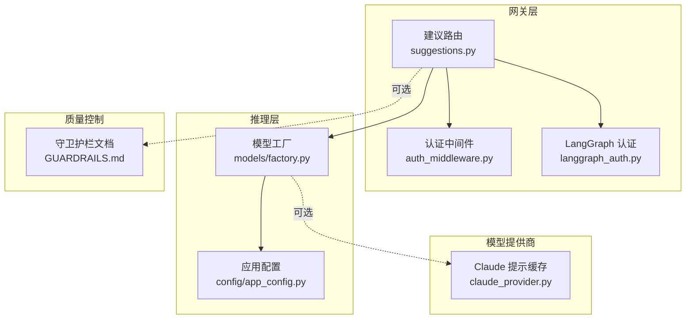
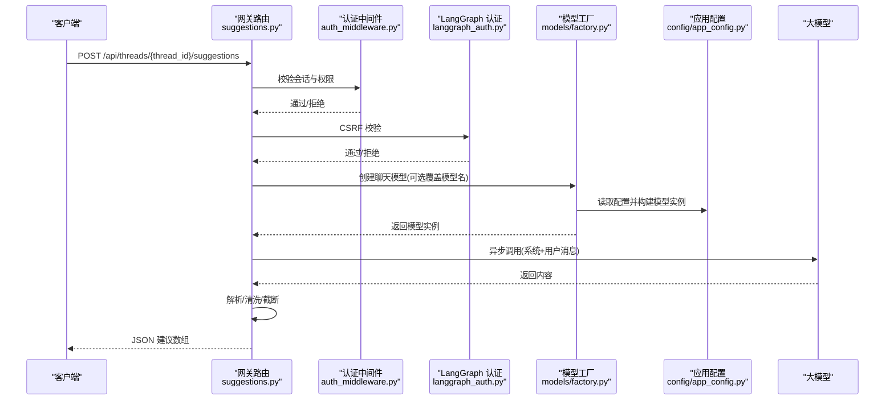
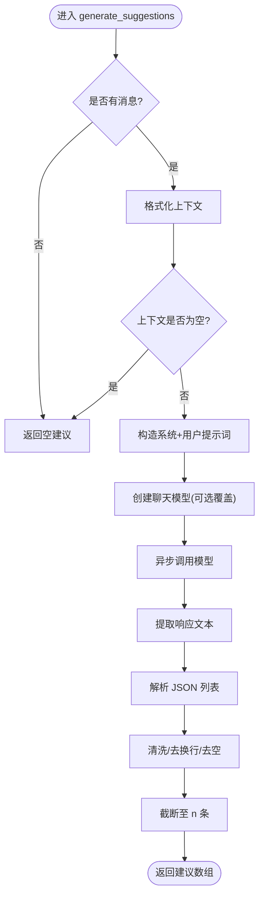
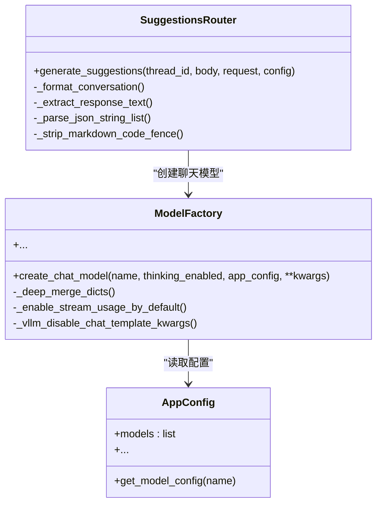
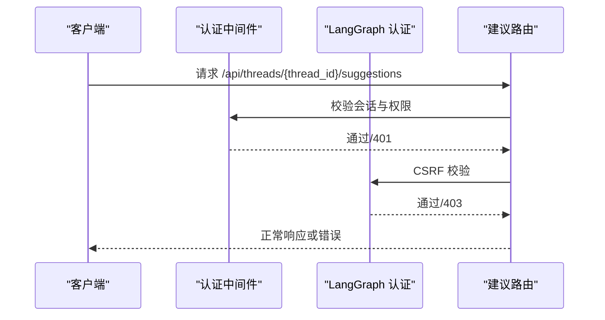
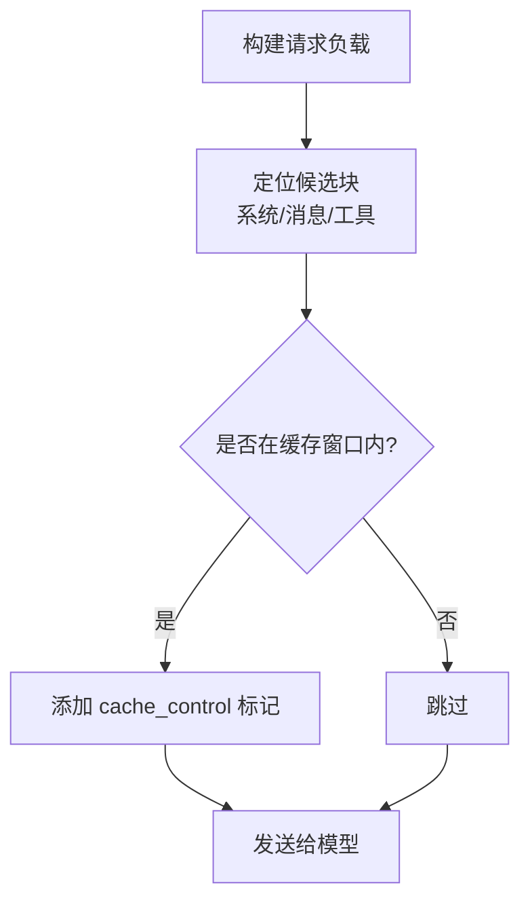
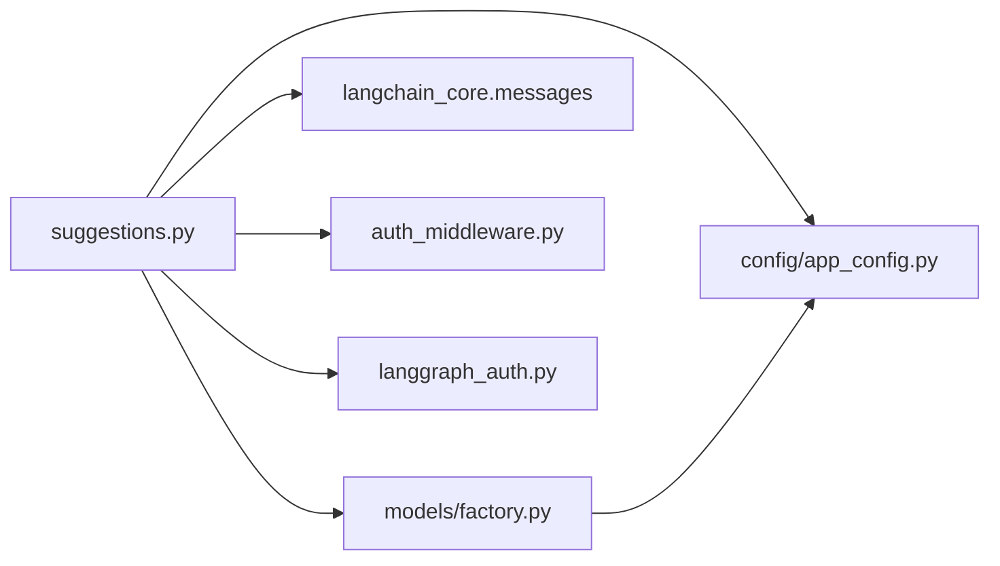

# 建议路由器

<cite>
**本文引用的文件**   
- [suggestions.py](file://backend/app/gateway/routers/suggestions.py)
- [test_suggestions_router.py](file://backend/tests/test_suggestions_router.py)
- [factory.py](file://backend/packages/harness/deerflow/models/factory.py)
- [app_config.py](file://backend/packages/harness/deerflow/config/app_config.py)
- [GUARDRAILS.md](file://backend/docs/GUARDRAILS.md)
- [auth_middleware.py](file://backend/app/gateway/auth_middleware.py)
- [langgraph_auth.py](file://backend/app/gateway/langgraph_auth.py)
- [claude_provider.py](file://backend/packages/harness/deerflow/models/claude_provider.py)
- [test_claude_provider_prompt_caching.py](file://backend/tests/test_claude_provider_prompt_caching.py)
</cite>

## 目录
1. [简介](#简介)
2. [项目结构](#项目结构)
3. [核心组件](#核心组件)
4. [架构总览](#架构总览)
5. [详细组件分析](#详细组件分析)
6. [依赖关系分析](#依赖关系分析)
7. [性能考虑](#性能考虑)
8. [故障排查指南](#故障排查指南)
9. [结论](#结论)
10. [附录](#附录)

## 简介
本文件为“建议路由器”的技术文档，聚焦于建议生成 API 的实现机制、提示词工程、响应格式化、算法与上下文分析、个性化推荐策略、与代理运行时的集成、性能优化与质量控制机制，并提供系统配置与调优指南。该路由位于后端网关层，面向线程（thread）上下文生成后续问题建议，接口路径为 /api/threads/{thread_id}/suggestions。

## 项目结构
建议路由器位于后端网关路由模块中，核心文件如下：
- 后端路由：backend/app/gateway/routers/suggestions.py
- 测试：backend/tests/test_suggestions_router.py
- 模型工厂：backend/packages/harness/deerflow/models/factory.py
- 应用配置：backend/packages/harness/deerflow/config/app_config.py
- 安全中间件：backend/app/gateway/auth_middleware.py、backend/app/gateway/langgraph_auth.py
- 质量控制（守卫护栏）：backend/docs/GUARDRAILS.md
- 模型提供商（示例）：backend/packages/harness/deerflow/models/claude_provider.py
- 提示缓存测试：backend/tests/test_claude_provider_prompt_caching.py

图表来源
- [suggestions.py:1-142](file://backend/app/gateway/routers/suggestions.py#L1-L142)
- [auth_middleware.py:102-129](file://backend/app/gateway/auth_middleware.py#L102-L129)
- [langgraph_auth.py:37-77](file://backend/app/gateway/langgraph_auth.py#L37-L77)
- [factory.py:50-158](file://backend/packages/harness/deerflow/models/factory.py#L50-L158)
- [app_config.py:91-467](file://backend/packages/harness/deerflow/config/app_config.py#L91-L467)
- [GUARDRAILS.md:1-386](file://backend/docs/GUARDRAILS.md#L1-L386)
- [claude_provider.py:223-248](file://backend/packages/harness/deerflow/models/claude_provider.py#L223-L248)

章节来源
- [suggestions.py:1-142](file://backend/app/gateway/routers/suggestions.py#L1-L142)
- [factory.py:50-158](file://backend/packages/harness/deerflow/models/factory.py#L50-L158)
- [app_config.py:91-467](file://backend/packages/harness/deerflow/config/app_config.py#L91-L467)

## 核心组件
- 建议路由与请求/响应模型
  - 请求体：包含最近消息列表、建议数量 n、可选模型名覆盖
  - 响应体：建议问题数组
- 上下文格式化器：将消息列表转为统一的“角色: 内容”字符串
- 提示词工程：系统指令明确要求 JSON 数组输出、语言一致性、长度约束
- 响应解析器：剥离代码块、提取 JSON 列表、清洗与截断
- 推理引擎：通过模型工厂创建聊天模型并异步调用
- 权限与安全：基于线程读权限校验，结合 CSRF 与 JWT 校验

章节来源
- [suggestions.py:18-31](file://backend/app/gateway/routers/suggestions.py#L18-L31)
- [suggestions.py:85-95](file://backend/app/gateway/routers/suggestions.py#L85-L95)
- [suggestions.py:119-128](file://backend/app/gateway/routers/suggestions.py#L119-L128)
- [suggestions.py:131-141](file://backend/app/gateway/routers/suggestions.py#L131-L141)

## 架构总览
建议生成的端到端流程如下：

图表来源
- [suggestions.py:98-141](file://backend/app/gateway/routers/suggestions.py#L98-L141)
- [auth_middleware.py:102-129](file://backend/app/gateway/auth_middleware.py#L102-L129)
- [langgraph_auth.py:37-77](file://backend/app/gateway/langgraph_auth.py#L37-L77)
- [factory.py:50-158](file://backend/packages/harness/deerflow/models/factory.py#L50-L158)
- [app_config.py:91-467](file://backend/packages/harness/deerflow/config/app_config.py#L91-L467)

## 详细组件分析

### 建议路由与提示词工程
- 路由定义与权限
  - 路径：/api/threads/{thread_id}/suggestions
  - 权限：需要 threads=read 并进行拥有者检查
- 请求体与响应体
  - 请求体包含最近消息列表、建议数量 n（1-5）、可选模型名覆盖
  - 响应体为建议问题数组
- 提示词工程
  - 系统指令强调：严格输出 JSON 数组、语言一致、字数限制、禁止编号与多余文本
  - 用户内容包含上下文摘要与明确的 n 值
- 上下文格式化
  - 统一为“User/Assistant: 内容”，保留未知角色
- 响应解析与清洗
  - 剥离代码块围栏、提取 JSON 列表、过滤空项、去除换行、截断至 n 条

图表来源
- [suggestions.py:105-141](file://backend/app/gateway/routers/suggestions.py#L105-L141)
- [suggestions.py:33-64](file://backend/app/gateway/routers/suggestions.py#L33-L64)
- [suggestions.py:67-82](file://backend/app/gateway/routers/suggestions.py#L67-L82)
- [suggestions.py:85-95](file://backend/app/gateway/routers/suggestions.py#L85-L95)

章节来源
- [suggestions.py:98-141](file://backend/app/gateway/routers/suggestions.py#L98-L141)
- [suggestions.py:33-64](file://backend/app/gateway/routers/suggestions.py#L33-L64)
- [suggestions.py:67-82](file://backend/app/gateway/routers/suggestions.py#L67-L82)
- [suggestions.py:85-95](file://backend/app/gateway/routers/suggestions.py#L85-L95)

### 模型工厂与代理运行时集成
- 模型工厂
  - 依据 AppConfig 获取模型配置，解析类路径，合并思考模式开关、推理努力度、流用量统计等参数
  - 自动附加追踪回调，便于可观测性
- 代理运行时
  - 建议路由通过 create_chat_model 直接获取模型实例并调用 ainvoke
  - 支持在调用配置中传入 run_name，便于链路追踪

图表来源
- [factory.py:50-158](file://backend/packages/harness/deerflow/models/factory.py#L50-L158)
- [app_config.py:304-314](file://backend/packages/harness/deerflow/config/app_config.py#L304-L314)
- [suggestions.py:105-141](file://backend/app/gateway/routers/suggestions.py#L105-L141)

章节来源
- [factory.py:50-158](file://backend/packages/harness/deerflow/models/factory.py#L50-L158)
- [app_config.py:91-467](file://backend/packages/harness/deerflow/config/app_config.py#L91-L467)
- [suggestions.py:105-141](file://backend/app/gateway/routers/suggestions.py#L105-L141)

### 安全与权限控制
- 认证中间件
  - 对非公开路径要求会话 Cookie；严格验证 JWT，返回细粒度错误码
- CSRF 校验
  - LangGraph 认证在状态变更方法上强制 CSRF 校验，防止跨站请求伪造
- 线程级权限
  - 建议路由使用 require_permission("threads", "read", owner_check=True)，确保仅线程拥有者可访问

图表来源
- [auth_middleware.py:102-129](file://backend/app/gateway/auth_middleware.py#L102-L129)
- [langgraph_auth.py:37-77](file://backend/app/gateway/langgraph_auth.py#L37-L77)
- [suggestions.py:104](file://backend/app/gateway/routers/suggestions.py#L104)

章节来源
- [auth_middleware.py:102-129](file://backend/app/gateway/auth_middleware.py#L102-L129)
- [langgraph_auth.py:37-77](file://backend/app/gateway/langgraph_auth.py#L37-L77)
- [suggestions.py:104](file://backend/app/gateway/routers/suggestions.py#L104)

### 质量控制与守卫护栏
- 守卫护栏（Guardrails）
  - 在工具调用前进行策略授权，避免沙箱隔离无法覆盖的语义风险
  - 支持内置白名单、OAP Passport 或自定义提供者
- 建议路由中的质量控制
  - 明确输出格式要求（JSON 数组）、语言一致性、字数限制
  - 解析失败时回退为空结果，保证稳定性

章节来源
- [GUARDRAILS.md:1-386](file://backend/docs/GUARDRAILS.md#L1-L386)
- [suggestions.py:119-128](file://backend/app/gateway/routers/suggestions.py#L119-L128)
- [suggestions.py:139-141](file://backend/app/gateway/routers/suggestions.py#L139-L141)

### 性能优化与提示缓存
- 提示缓存（以 Claude 为例）
  - 对系统块、最近消息与最后工具定义应用临时缓存标记，减少重复计算
  - 仅对窗口内的候选块启用缓存，避免超出 API 限额
- 流用量统计
  - 默认为 OpenAI 兼容模型启用流式用量统计，便于令牌消耗追踪

图表来源
- [claude_provider.py:223-248](file://backend/packages/harness/deerflow/models/claude_provider.py#L223-L248)
- [test_claude_provider_prompt_caching.py:38-249](file://backend/tests/test_claude_provider_prompt_caching.py#L38-L249)
- [factory.py:117-148](file://backend/packages/harness/deerflow/models/factory.py#L117-L148)

章节来源
- [claude_provider.py:223-248](file://backend/packages/harness/deerflow/models/claude_provider.py#L223-L248)
- [test_claude_provider_prompt_caching.py:38-249](file://backend/tests/test_claude_provider_prompt_caching.py#L38-L249)
- [factory.py:117-148](file://backend/packages/harness/deerflow/models/factory.py#L117-L148)

## 依赖关系分析
- 组件耦合
  - 建议路由依赖模型工厂与应用配置，耦合度低，职责清晰
  - 安全中间件与 LangGraph 认证独立于业务逻辑，通过装饰器与中间件接入
- 外部依赖
  - LangChain 消息类型用于构造系统/用户消息
  - 追踪回调用于可观测性
- 潜在循环依赖
  - 模型工厂与配置模块通过显式参数传递避免循环导入

图表来源
- [suggestions.py:4-11](file://backend/app/gateway/routers/suggestions.py#L4-L11)
- [factory.py:1-10](file://backend/packages/harness/deerflow/models/factory.py#L1-L10)
- [app_config.py:1-35](file://backend/packages/harness/deerflow/config/app_config.py#L1-L35)

章节来源
- [suggestions.py:4-11](file://backend/app/gateway/routers/suggestions.py#L4-L11)
- [factory.py:1-10](file://backend/packages/harness/deerflow/models/factory.py#L1-L10)
- [app_config.py:1-35](file://backend/packages/harness/deerflow/config/app_config.py#L1-L35)

## 性能考虑
- 输出解析健壮性
  - 支持多种响应形态（纯文本、文本块、输出文本块），提升鲁棒性
- 缓存与限额
  - 提示缓存仅作用于最近窗口，避免超限
- 流用量统计
  - 默认启用流式用量统计，便于成本与性能监控
- 回退策略
  - 模型调用异常时记录日志并返回空建议，避免中断前端交互

章节来源
- [suggestions.py:67-82](file://backend/app/gateway/routers/suggestions.py#L67-L82)
- [claude_provider.py:223-248](file://backend/packages/harness/deerflow/models/claude_provider.py#L223-L248)
- [factory.py:117-148](file://backend/packages/harness/deerflow/models/factory.py#L117-L148)
- [suggestions.py:139-141](file://backend/app/gateway/routers/suggestions.py#L139-L141)

## 故障排查指南
- 常见问题
  - 无消息输入：返回空建议
  - 上下文为空：返回空建议
  - 模型调用异常：记录异常日志并返回空建议
- 解析失败
  - JSON 列表解析失败或非列表：回退为空
  - 代码围栏包裹：自动剥离
- 安全相关
  - 401：会话缺失或 JWT 无效
  - 403：CSRF 校验失败
  - 403：线程读权限不足

章节来源
- [suggestions.py:111-117](file://backend/app/gateway/routers/suggestions.py#L111-L117)
- [suggestions.py:139-141](file://backend/app/gateway/routers/suggestions.py#L139-L141)
- [test_suggestions_router.py:103-117](file://backend/tests/test_suggestions_router.py#L103-L117)
- [auth_middleware.py:102-129](file://backend/app/gateway/auth_middleware.py#L102-L129)
- [langgraph_auth.py:37-77](file://backend/app/gateway/langgraph_auth.py#L37-L77)

## 结论
建议路由器通过简洁而稳健的提示词工程与解析策略，在线程上下文中生成高质量的后续问题建议。其与模型工厂、应用配置、安全中间件及守卫护栏形成清晰分层，具备良好的扩展性与可观测性。通过提示缓存与流用量统计等优化手段，可在保证质量的同时兼顾性能与成本。

## 附录

### API 定义
- 路径：/api/threads/{thread_id}/suggestions
- 方法：POST
- 权限：threads=read（拥有者检查）
- 请求体字段
  - messages: 最近对话消息列表（每项含 role 与 content）
  - n: 建议数量（1-5，默认 3）
  - model_name: 可选模型名覆盖
- 响应体字段
  - suggestions: 建议问题字符串数组

章节来源
- [suggestions.py:18-31](file://backend/app/gateway/routers/suggestions.py#L18-L31)
- [suggestions.py:98-103](file://backend/app/gateway/routers/suggestions.py#L98-L103)
- [suggestions.py:104](file://backend/app/gateway/routers/suggestions.py#L104)

### 配置与调优指南
- 模型选择与思考模式
  - 通过 model_name 覆盖默认模型；思考模式与推理努力度由模型工厂按配置处理
- 输出格式与稳定性
  - 建议路由已内置 JSON 数组输出要求与解析回退，建议保持默认
- 安全加固
  - 开启守卫护栏（Guardrails）以在工具调用前进行策略授权
- 性能优化
  - 启用提示缓存（如使用 Claude 提供商）与流式用量统计
  - 控制 n 值与消息长度，避免超长上下文导致延迟上升

章节来源
- [factory.py:50-158](file://backend/packages/harness/deerflow/models/factory.py#L50-L158)
- [app_config.py:91-467](file://backend/packages/harness/deerflow/config/app_config.py#L91-L467)
- [GUARDRAILS.md:1-386](file://backend/docs/GUARDRAILS.md#L1-L386)
- [claude_provider.py:223-248](file://backend/packages/harness/deerflow/models/claude_provider.py#L223-L248)
- [factory.py:117-148](file://backend/packages/harness/deerflow/models/factory.py#L117-L148)