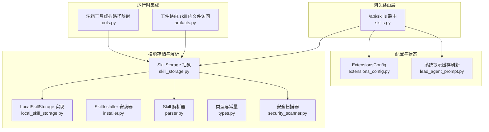
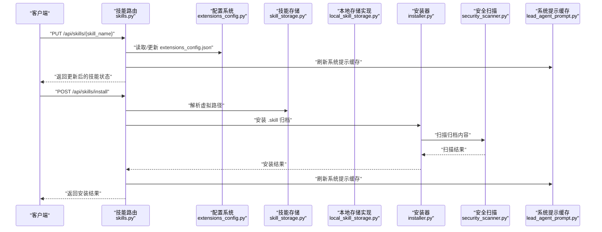
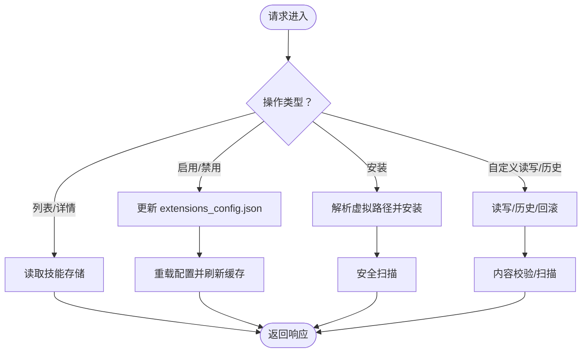
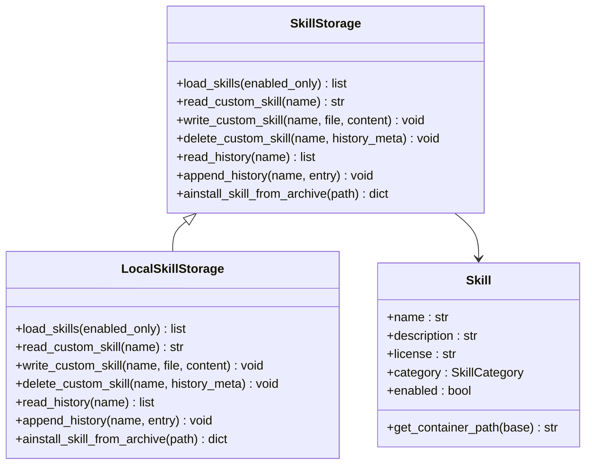
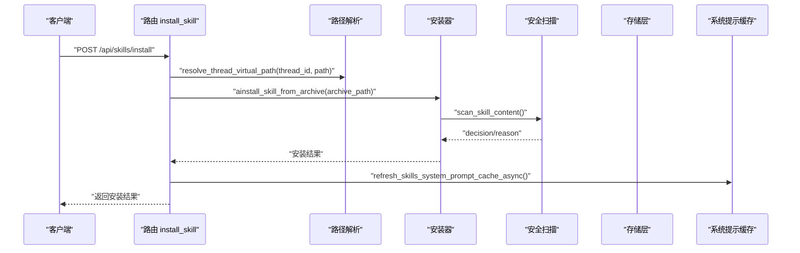
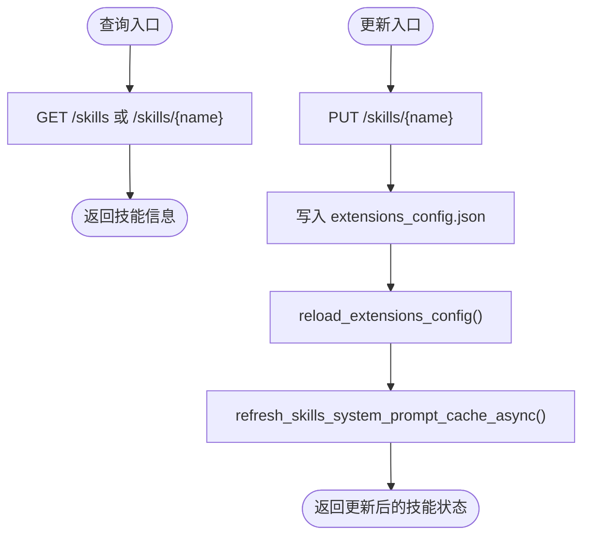
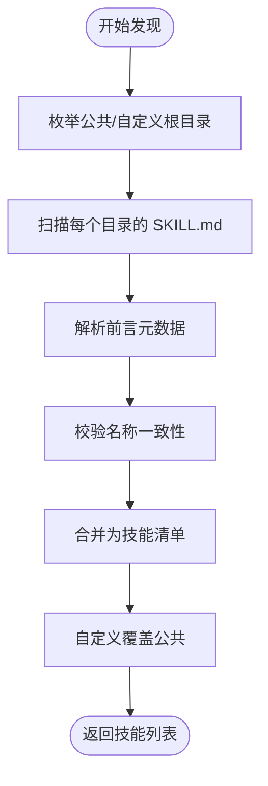
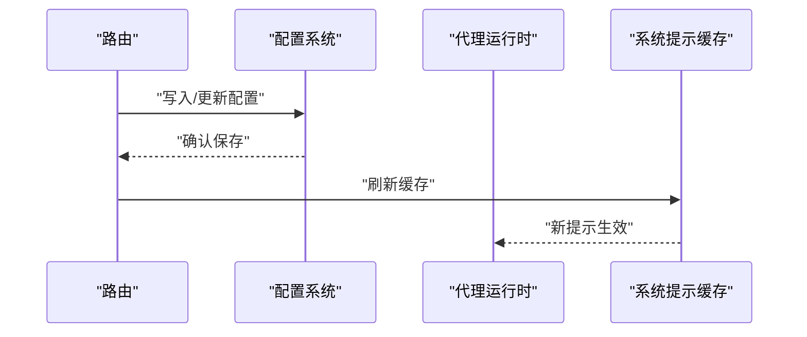
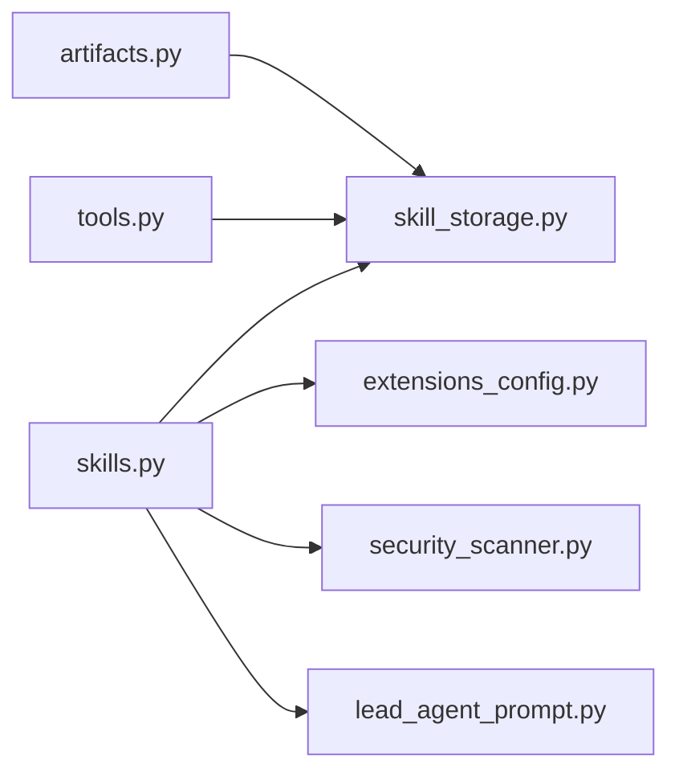

# 技能路由器

<cite>
**本文引用的文件**
- [skills.py](file://backend/app/gateway/routers/skills.py)
- [extensions_config.py](file://backend/packages/harness/deerflow/config/extensions_config.py)
- [installer.py](file://backend/packages/harness/deerflow/skills/installer.py)
- [local_skill_storage.py](file://backend/packages/harness/deerflow/skills/storage/local_skill_storage.py)
- [skill_storage.py](file://backend/packages/harness/deerflow/skills/storage/skill_storage.py)
- [types.py](file://backend/packages/harness/deerflow/skills/types.py)
- [parser.py](file://backend/packages/harness/deerflow/skills/parser.py)
- [security_scanner.py](file://backend/packages/harness/deerflow/skills/security_scanner.py)
- [lead_agent_prompt.py](file://backend/deerflow/agents/lead_agent/prompt.py)
- [artifacts.py](file://backend/app/gateway/routers/artifacts.py)
- [tools.py](file://backend/packages/harness/deerflow/sandbox/tools.py)
- [test_skills_installer.py](file://backend/tests/test_skills_installer.py)
- [test_skills_custom_router.py](file://backend/tests/test_skills_custom_router.py)
- [test_client.py](file://backend/tests/test_client.py)
- [test_client_e2e.py](file://backend/tests/test_client_e2e.py)
- [test_skills_loader.py](file://backend/tests/test_skills_loader.py)
- [test_subagent_executor.py](file://backend/tests/test_subagent_executor.py)
</cite>

## 目录
1. [简介](#简介)
2. [项目结构](#项目结构)
3. [核心组件](#核心组件)
4. [架构总览](#架构总览)
5. [详细组件分析](#详细组件分析)
6. [依赖分析](#依赖分析)
7. [性能考虑](#性能考虑)
8. [故障排查指南](#故障排查指南)
9. [结论](#结论)
10. [附录](#附录)

## 简介
本技术文档围绕“技能路由器”展开，系统性阐述技能管理 API 的实现机制、技能安装与卸载流程、技能状态查询与更新、技能发现机制、配置验证与代理运行时同步方式，并给出技能包格式要求、元数据管理与版本控制策略，最后提供技能开发与部署的完整指南。读者可据此快速理解并安全地扩展与维护技能生态。

## 项目结构
技能路由器位于后端网关路由层，通过 FastAPI 路由暴露技能管理接口；技能存储与解析逻辑位于 harness 包中，统一抽象了公共与自定义技能的读写、安装、解析与安全扫描能力；代理运行时通过系统提示缓存刷新实现与技能状态变更的同步。

图示来源
- [skills.py:1-353](file://backend/app/gateway/routers/skills.py#L1-L353)
- [extensions_config.py:1-120](file://backend/packages/harness/deerflow/config/extensions_config.py#L1-L120)
- [skill_storage.py:1-250](file://backend/packages/harness/deerflow/skills/storage/skill_storage.py#L1-L250)
- [local_skill_storage.py:1-200](file://backend/packages/harness/deerflow/skills/storage/local_skill_storage.py#L1-L200)
- [parser.py:1-120](file://backend/packages/harness/deerflow/skills/parser.py#L1-L120)
- [security_scanner.py:1-200](file://backend/packages/harness/deerflow/skills/security_scanner.py#L1-L200)
- [lead_agent_prompt.py:1-120](file://backend/deerflow/agents/lead_agent/prompt.py#L1-L120)
- [artifacts.py:1-200](file://backend/app/gateway/routers/artifacts.py#L1-L200)
- [tools.py:1-200](file://backend/packages/harness/deerflow/sandbox/tools.py#L1-L200)

章节来源
- [skills.py:1-353](file://backend/app/gateway/routers/skills.py#L1-L353)

## 核心组件
- 路由器：提供技能列表、详情、启用/禁用、安装、自定义技能读写、历史与回滚等接口。
- 存储层：抽象出 SkillStorage 接口与 LocalSkillStorage 实现，负责技能发现、读写、归档安装、历史记录与容器路径映射。
- 解析器：解析 SKILL.md 前言元数据，校验名称一致性与内容合法性。
- 安装器：从 .skill 归档安装技能，执行安全扫描与目录布局检查。
- 配置系统：通过 extensions_config.json 维护技能启用状态与 MCP 服务器配置。
- 运行时同步：更新技能状态后刷新系统提示缓存，确保代理运行时感知最新技能可用性。

章节来源
- [skills.py:88-353](file://backend/app/gateway/routers/skills.py#L88-L353)
- [skill_storage.py:17-250](file://backend/packages/harness/deerflow/skills/storage/skill_storage.py#L17-L250)
- [local_skill_storage.py:1-200](file://backend/packages/harness/deerflow/skills/storage/local_skill_storage.py#L1-L200)
- [parser.py:1-120](file://backend/packages/harness/deerflow/skills/parser.py#L1-L120)
- [installer.py:1-200](file://backend/packages/harness/deerflow/skills/installer.py#L1-L200)
- [extensions_config.py:1-120](file://backend/packages/harness/deerflow/config/extensions_config.py#L1-L120)
- [lead_agent_prompt.py:1-120](file://backend/deerflow/agents/lead_agent/prompt.py#L1-L120)

## 架构总览
技能路由器通过 API 将用户操作转化为对存储层与配置系统的调用，最终驱动代理运行时的系统提示缓存更新，完成“状态变更—持久化—同步”的闭环。

图示来源
- [skills.py:103-126](file://backend/app/gateway/routers/skills.py#L103-L126)
- [skills.py:304-347](file://backend/app/gateway/routers/skills.py#L304-L347)
- [extensions_config.py:1-120](file://backend/packages/harness/deerflow/config/extensions_config.py#L1-L120)
- [installer.py:1-200](file://backend/packages/harness/deerflow/skills/installer.py#L1-L200)
- [security_scanner.py:1-200](file://backend/packages/harness/deerflow/skills/security_scanner.py#L1-L200)
- [lead_agent_prompt.py:1-120](file://backend/deerflow/agents/lead_agent/prompt.py#L1-L120)

## 详细组件分析

### 技能管理 API（FastAPI 路由）
- 列表与详情：支持列出全部技能、仅自定义技能，以及按名称查询技能详情。
- 启用/禁用：通过修改 extensions_config.json 中的 enabled 字段实现，随后重载配置并刷新系统提示缓存。
- 安装：从线程上下文中的 .skill 文件进行安装，解析虚拟路径定位归档，调用安装器执行安全扫描与解压。
- 自定义技能：支持读取、编辑、删除、查看历史与回滚。编辑前进行内容校验与安全扫描，历史记录包含扫描决策与原因。
- 错误处理：针对缺失、冲突、参数错误与未知异常分别返回 404/409/400/500。

图示来源
- [skills.py:88-353](file://backend/app/gateway/routers/skills.py#L88-L353)

章节来源
- [skills.py:88-353](file://backend/app/gateway/routers/skills.py#L88-L353)

### 技能存储与发现机制
- 发现策略：遍历公共与自定义根目录，收集每个技能目录下的 SKILL.md，优先使用自定义同名覆盖公共技能。
- 路径与布局：约定公共与自定义技能的目录布局，容器内路径通过类型对象计算，便于沙箱工具映射。
- 历史记录：为自定义技能维护变更历史，支持人类编辑、删除与回滚动作记录。
- 工具集成：工件路由支持直接访问 .skill 归档内的文件路径，如 xxx.skill/SKILL.md。

图示来源
- [skill_storage.py:17-250](file://backend/packages/harness/deerflow/skills/storage/skill_storage.py#L17-L250)
- [local_skill_storage.py:1-200](file://backend/packages/harness/deerflow/skills/storage/local_skill_storage.py#L1-L200)
- [types.py:1-80](file://backend/packages/harness/deerflow/skills/types.py#L1-L80)

章节来源
- [skill_storage.py:109-121](file://backend/packages/harness/deerflow/skills/storage/skill_storage.py#L109-L121)
- [local_skill_storage.py:23-35](file://backend/packages/harness/deerflow/skills/storage/local_skill_storage.py#L23-L35)
- [types.py:1-80](file://backend/packages/harness/deerflow/skills/types.py#L1-L80)
- [artifacts.py:118-124](file://backend/app/gateway/routers/artifacts.py#L118-L124)

### 技能安装与卸载流程
- 安装入口：POST /api/skills/install，接收 thread_id 与 .skill 文件的虚拟路径。
- 虚拟路径解析：将 thread_id 与虚拟路径组合为真实文件路径。
- 安全扫描：对归档内容进行扫描，若判定阻断则拒绝安装。
- 解压与布局：安装器根据约定目录结构解压并校验 SKILL.md 前言与嵌套规则。
- 结果反馈：返回安装成功标识、技能名称与消息；同时刷新系统提示缓存。

图示来源
- [skills.py:109-126](file://backend/app/gateway/routers/skills.py#L109-L126)
- [local_skill_storage.py:93-110](file://backend/packages/harness/deerflow/skills/storage/local_skill_storage.py#L93-L110)
- [installer.py:160-190](file://backend/packages/harness/deerflow/skills/installer.py#L160-L190)
- [security_scanner.py:1-200](file://backend/packages/harness/deerflow/skills/security_scanner.py#L1-L200)
- [lead_agent_prompt.py:1-120](file://backend/deerflow/agents/lead_agent/prompt.py#L1-L120)

章节来源
- [skills.py:109-126](file://backend/app/gateway/routers/skills.py#L109-L126)
- [installer.py:160-190](file://backend/packages/harness/deerflow/skills/installer.py#L160-L190)
- [test_skills_installer.py:173-220](file://backend/tests/test_skills_installer.py#L173-L220)

### 技能状态查询与更新
- 查询：GET /api/skills 与 GET /api/skills/{skill_name} 返回技能基本信息。
- 更新：PUT /api/skills/{skill_name} 修改 extensions_config.json 中的 enabled 字段，重载配置并刷新系统提示缓存。
- 自定义技能：GET/PUT/DELETE /api/skills/custom/{skill_name} 支持读取、编辑、删除自定义技能及其历史与回滚。

图示来源
- [skills.py:88-101](file://backend/app/gateway/routers/skills.py#L88-L101)
- [skills.py:287-302](file://backend/app/gateway/routers/skills.py#L287-L302)
- [skills.py:310-347](file://backend/app/gateway/routers/skills.py#L310-L347)
- [extensions_config.py:1-120](file://backend/packages/harness/deerflow/config/extensions_config.py#L1-L120)
- [lead_agent_prompt.py:1-120](file://backend/deerflow/agents/lead_agent/prompt.py#L1-L120)

章节来源
- [skills.py:88-347](file://backend/app/gateway/routers/skills.py#L88-L347)
- [extensions_config.py:1-120](file://backend/packages/harness/deerflow/config/extensions_config.py#L1-L120)

### 技能发现机制与元数据管理
- 发现：遍历公共与自定义根目录，收集 SKILL.md 并解析前言元数据，校验技能名称一致性。
- 元数据：包括名称、描述、许可证、类别（公共/自定义），以及运行时启用状态。
- 覆盖规则：自定义同名技能优先于公共技能。
- 容器路径：通过类型对象计算容器内路径，便于沙箱工具访问。

图示来源
- [skill_storage.py:109-121](file://backend/packages/harness/deerflow/skills/storage/skill_storage.py#L109-L121)
- [parser.py:35-60](file://backend/packages/harness/deerflow/skills/parser.py#L35-L60)
- [test_skills_loader.py:38-83](file://backend/tests/test_skills_loader.py#L38-L83)

章节来源
- [skill_storage.py:211-250](file://backend/packages/harness/deerflow/skills/storage/skill_storage.py#L211-L250)
- [parser.py:35-60](file://backend/packages/harness/deerflow/skills/parser.py#L35-L60)
- [test_skills_loader.py:38-83](file://backend/tests/test_skills_loader.py#L38-L83)

### 配置验证与代理运行时同步
- 配置验证：更新 enabled 字段时写入 extensions_config.json，随后重载配置，保证后续加载一致。
- 同步方式：每次状态变更后调用系统提示缓存刷新函数，确保代理运行时感知最新技能可用性。
- MCP 服务器：配置中还包含 MCP 服务器设置，安装器与存储层在安装过程中会校验与路径相关的约束。

图示来源
- [skills.py:319-337](file://backend/app/gateway/routers/skills.py#L319-L337)
- [extensions_config.py:1-120](file://backend/packages/harness/deerflow/config/extensions_config.py#L1-L120)
- [lead_agent_prompt.py:1-120](file://backend/deerflow/agents/lead_agent/prompt.py#L1-L120)

章节来源
- [skills.py:319-337](file://backend/app/gateway/routers/skills.py#L319-L337)
- [extensions_config.py:1-120](file://backend/packages/harness/deerflow/config/extensions_config.py#L1-L120)

### 技能包格式要求、版本控制与安全扫描
- 包格式：.skill 文件为 ZIP 归档，内部包含 SKILL.md 与必要资源文件。
- 元数据：SKILL.md 必须包含有效前言元数据，且技能名称需与目录名一致。
- 安全扫描：安装与编辑均会触发安全扫描，禁止嵌套 SKILL.md 等违规布局。
- 版本控制：自定义技能支持历史记录与回滚，历史条目包含扫描决策与原因，便于审计与恢复。

章节来源
- [installer.py:160-190](file://backend/packages/harness/deerflow/skills/installer.py#L160-L190)
- [security_scanner.py:1-200](file://backend/packages/harness/deerflow/skills/security_scanner.py#L1-L200)
- [skills.py:155-189](file://backend/app/gateway/routers/skills.py#L155-L189)
- [skills.py:234-279](file://backend/app/gateway/routers/skills.py#L234-L279)

## 依赖分析
- 路由层依赖存储层与配置系统，安装流程进一步依赖安全扫描器。
- 运行时通过系统提示缓存刷新实现与技能状态变更的解耦同步。
- 沙箱工具与工件路由为技能在容器内的访问提供路径映射与归档内文件访问能力。

图示来源
- [skills.py:1-353](file://backend/app/gateway/routers/skills.py#L1-L353)
- [skill_storage.py:1-250](file://backend/packages/harness/deerflow/skills/storage/skill_storage.py#L1-L250)
- [extensions_config.py:1-120](file://backend/packages/harness/deerflow/config/extensions_config.py#L1-L120)
- [security_scanner.py:1-200](file://backend/packages/harness/deerflow/skills/security_scanner.py#L1-L200)
- [lead_agent_prompt.py:1-120](file://backend/deerflow/agents/lead_agent/prompt.py#L1-L120)
- [artifacts.py:118-124](file://backend/app/gateway/routers/artifacts.py#L118-L124)
- [tools.py:120-140](file://backend/packages/harness/deerflow/sandbox/tools.py#L120-L140)

章节来源
- [skills.py:1-353](file://backend/app/gateway/routers/skills.py#L1-L353)
- [artifacts.py:118-124](file://backend/app/gateway/routers/artifacts.py#L118-L124)
- [tools.py:120-140](file://backend/packages/harness/deerflow/sandbox/tools.py#L120-L140)

## 性能考虑
- 扫描与 I/O：安装与编辑涉及安全扫描与磁盘读写，建议在批量操作时合并请求并避免重复扫描。
- 缓存刷新：系统提示缓存刷新为轻量级操作，但频繁更新可能影响代理初始化性能，应聚合变更后再刷新。
- 路径解析：虚拟路径解析与归档安装应尽量减少跨盘符或网络路径的使用，降低延迟。

## 故障排查指南
- 安装失败（400/409/404/500）：检查 .skill 文件是否为有效 ZIP、是否存在重复名称、是否缺少前言元数据、是否包含嵌套 SKILL.md。
- 启用/禁用失败：确认 extensions_config.json 可写、重载配置是否成功、系统提示缓存是否刷新。
- 自定义技能编辑被阻断：查看安全扫描报告，修正内容后重试。
- 历史与回滚：若回滚目标无 prev_content，检查历史记录完整性；若扫描阻断，需修正内容或联系管理员。

章节来源
- [skills.py:115-125](file://backend/app/gateway/routers/skills.py#L115-L125)
- [skills.py:182-188](file://backend/app/gateway/routers/skills.py#L182-L188)
- [skills.py:270-278](file://backend/app/gateway/routers/skills.py#L270-L278)
- [test_skills_custom_router.py:53-101](file://backend/tests/test_skills_custom_router.py#L53-L101)

## 结论
技能路由器以清晰的路由层、可扩展的存储层与严格的配置/安全机制为核心，实现了从技能安装、状态管理到运行时同步的完整闭环。通过规范化的技能包格式、完善的元数据与历史回滚能力，既保障了安全性，又提升了可维护性与可观测性。

## 附录

### 技能开发与部署指南
- 开发步骤
  - 在公共或自定义目录编写 SKILL.md，确保包含有效前言元数据与技能名称。
  - 使用脚手架工具生成初始模板，完善描述、许可证与参考材料。
- 验证
  - 使用测试用例验证安装、解析、覆盖与安全扫描行为。
- 打包
  - 将技能目录打包为 .skill（ZIP），确保内部结构符合约定。
- 安装与启用
  - 通过 API 安装 .skill 文件，随后在配置中启用该技能。
- 运行时集成
  - 代理运行时将基于系统提示缓存感知最新技能状态，无需重启服务。

章节来源
- [test_skills_loader.py:38-83](file://backend/tests/test_skills_loader.py#L38-L83)
- [test_client.py:1291-1320](file://backend/tests/test_client.py#L1291-L1320)
- [test_client_e2e.py:583-625](file://backend/tests/test_client_e2e.py#L583-L625)
- [test_skills_custom_router.py:53-101](file://backend/tests/test_skills_custom_router.py#L53-L101)