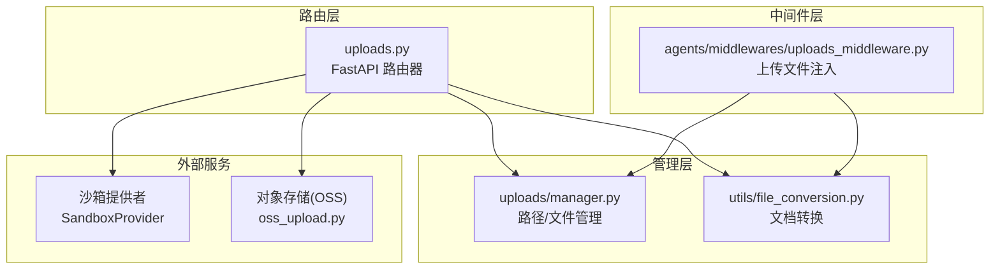
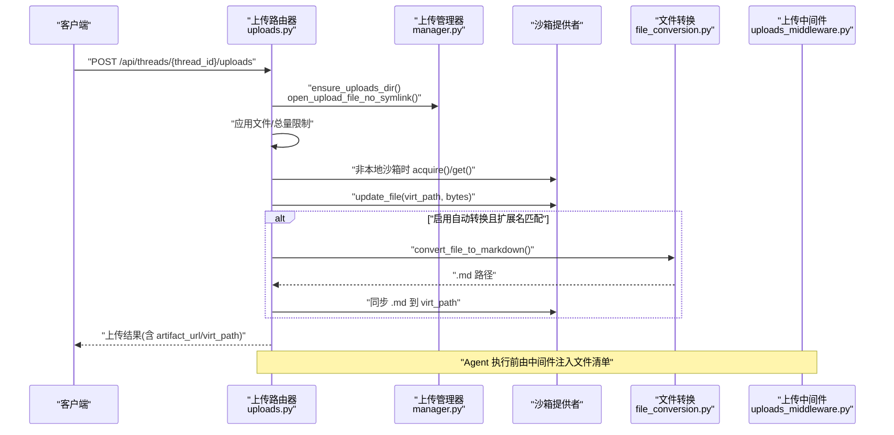
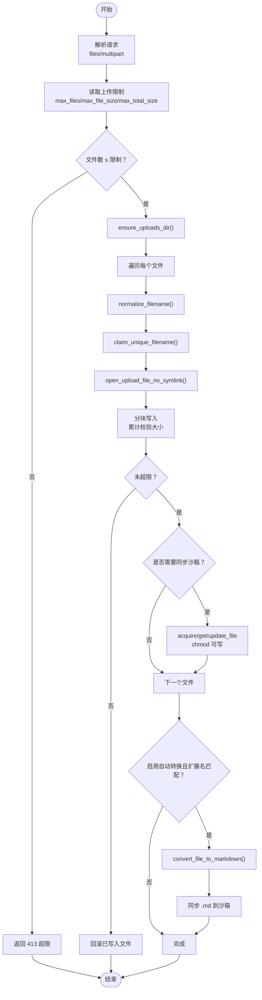
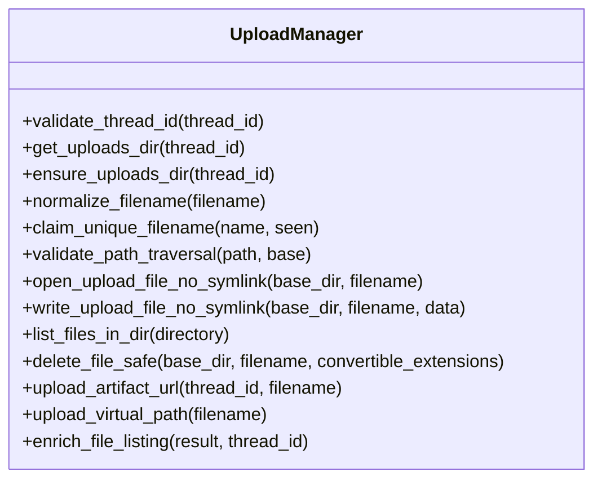
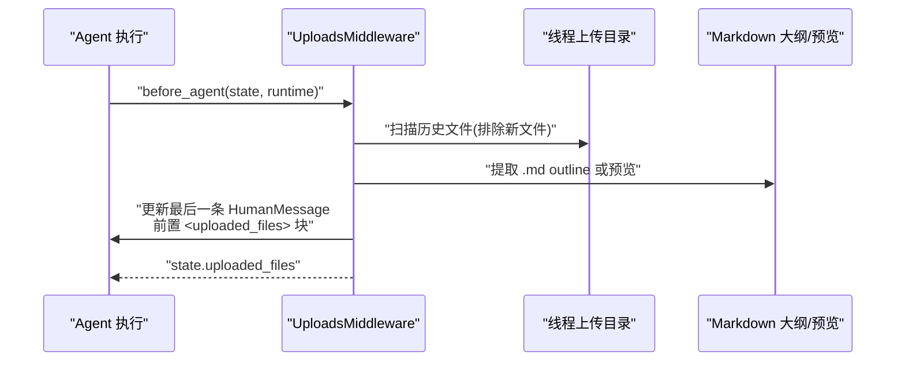
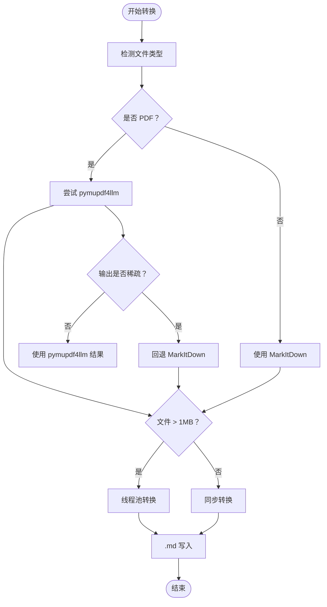
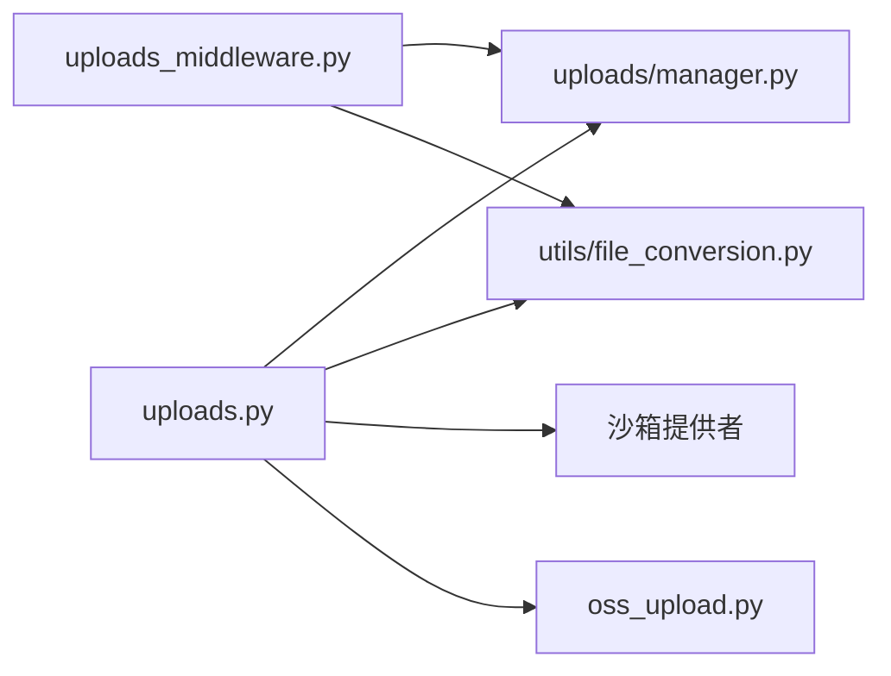

# 文件上传路由器

<cite>
**本文引用的文件**
- [backend/app/gateway/routers/uploads.py](file://backend/app/gateway/routers/uploads.py)
- [backend/packages/harness/deerflow/agents/middlewares/uploads_middleware.py](file://backend/packages/harness/deerflow/agents/middlewares/uploads_middleware.py)
- [backend/packages/harness/deerflow/uploads/manager.py](file://backend/packages/harness/deerflow/uploads/manager.py)
- [backend/packages/harness/deerflow/utils/file_conversion.py](file://backend/packages/harness/deerflow/utils/file_conversion.py)
- [backend/deerflow/utils/oss_upload.py](file://backend/deerflow/utils/oss_upload.py)
- [backend/docs/FILE_UPLOAD.md](file://backend/docs/FILE_UPLOAD.md)
- [backend/config.yaml](file://backend/config.yaml)
- [backend/tests/test_uploads_router.py](file://backend/tests/test_uploads_router.py)
- [backend/tests/test_uploads_manager.py](file://backend/tests/test_uploads_manager.py)
- [backend/tests/test_uploads_middleware_core_logic.py](file://backend/tests/test_uploads_middleware_core_logic.py)
</cite>

## 目录
1. [简介](#简介)
2. [项目结构](#项目结构)
3. [核心组件](#核心组件)
4. [架构总览](#架构总览)
5. [详细组件分析](#详细组件分析)
6. [依赖分析](#依赖分析)
7. [性能考虑](#性能考虑)
8. [故障排查指南](#故障排查指南)
9. [结论](#结论)
10. [附录](#附录)

## 简介
本技术文档围绕文件上传路由器展开，系统性阐述其在 DeerFlow 后端中的实现机制、文件验证规则、上传流程处理逻辑、文件转换机制、虚拟路径映射与安全检查措施。文档还覆盖支持的文件格式、大小限制、错误处理策略，并提供最佳实践与性能优化建议，帮助开发者与运维人员高效、安全地集成与维护文件上传能力。

## 项目结构
文件上传功能由三层协作构成：
- 路由层：FastAPI 路由器负责接收请求、应用权限与网关限制、协调上传与同步。
- 管理层：纯业务逻辑，提供路径校验、文件写入、列表与删除、URL/VirtPath 构造等。
- 中间件层：在 Agent 执行前注入已上传文件信息，增强上下文并提供结构化导航。

图示来源
- [backend/app/gateway/routers/uploads.py:1-343](file://backend/app/gateway/routers/uploads.py#L1-L343)
- [backend/packages/harness/deerflow/uploads/manager.py:1-311](file://backend/packages/harness/deerflow/uploads/manager.py#L1-L311)
- [backend/packages/harness/deerflow/utils/file_conversion.py:1-316](file://backend/packages/harness/deerflow/utils/file_conversion.py#L1-L316)
- [backend/packages/harness/deerflow/agents/middlewares/uploads_middleware.py:1-296](file://backend/packages/harness/deerflow/agents/middlewares/uploads_middleware.py#L1-L296)
- [backend/deerflow/utils/oss_upload.py:1-82](file://backend/deerflow/utils/oss_upload.py#L1-L82)

章节来源
- [backend/app/gateway/routers/uploads.py:1-343](file://backend/app/gateway/routers/uploads.py#L1-L343)
- [backend/packages/harness/deerflow/uploads/manager.py:1-311](file://backend/packages/harness/deerflow/uploads/manager.py#L1-L311)
- [backend/packages/harness/deerflow/utils/file_conversion.py:1-316](file://backend/packages/harness/deerflow/utils/file_conversion.py#L1-L316)
- [backend/packages/harness/deerflow/agents/middlewares/uploads_middleware.py:1-296](file://backend/packages/harness/deerflow/agents/middlewares/uploads_middleware.py#L1-L296)

## 核心组件
- 上传路由器：处理多文件上传、列出、删除；应用应用级与网关级限制；在非本地沙箱场景同步文件；可选文档转 Markdown。
- 上传管理器：提供安全的文件写入、路径校验、唯一文件名生成、列表与删除、URL/VirtPath 构造。
- 上传中间件：在 Agent 请求前注入已上传文件清单，支持结构化大纲与预览，指导 Agent 使用 read_file/grep/glob 等工具。
- 文件转换工具：支持 PDF/PPT/XLS/DOC 等文档转 Markdown，具备两阶段策略与异步转换能力。
- OSS 工具：封装阿里云 OSS 上传与命名策略，支持内容类型与错误处理。

章节来源
- [backend/app/gateway/routers/uploads.py:170-294](file://backend/app/gateway/routers/uploads.py#L170-L294)
- [backend/packages/harness/deerflow/uploads/manager.py:118-217](file://backend/packages/harness/deerflow/uploads/manager.py#L118-L217)
- [backend/packages/harness/deerflow/agents/middlewares/uploads_middleware.py:66-296](file://backend/packages/harness/deerflow/agents/middlewares/uploads_middleware.py#L66-L296)
- [backend/packages/harness/deerflow/utils/file_conversion.py:138-167](file://backend/packages/harness/deerflow/utils/file_conversion.py#L138-L167)
- [backend/deerflow/utils/oss_upload.py:15-82](file://backend/deerflow/utils/oss_upload.py#L15-L82)

## 架构总览
文件上传从客户端发起，经由网关路由进入上传路由器，随后根据沙箱类型决定是否同步到沙箱；若开启自动转换，则在上传完成后生成同名 .md 并同步到沙箱；Agent 执行前由中间件注入文件清单与结构化导航。

图示来源
- [backend/app/gateway/routers/uploads.py:170-294](file://backend/app/gateway/routers/uploads.py#L170-L294)
- [backend/packages/harness/deerflow/uploads/manager.py:118-217](file://backend/packages/harness/deerflow/uploads/manager.py#L118-L217)
- [backend/packages/harness/deerflow/utils/file_conversion.py:138-167](file://backend/packages/harness/deerflow/utils/file_conversion.py#L138-L167)
- [backend/packages/harness/deerflow/agents/middlewares/uploads_middleware.py:187-296](file://backend/packages/harness/deerflow/agents/middlewares/uploads_middleware.py#L187-L296)

## 详细组件分析

### 上传路由器（FastAPI 路由器）
- 职责
  - 接收 multipart/form-data，逐个文件写入线程隔离目录。
  - 应用应用级与网关级上传限制（最大文件数、单文件大小、总大小）。
  - 在非本地沙箱场景，将文件同步到沙箱虚拟路径，保证 Agent 可见。
  - 可选文档自动转换为 Markdown，并同步 .md 文件。
  - 提供上传限制查询、文件列表、删除接口。
- 关键流程
  - 限额读取：从配置读取 max_files/max_file_size/max_total_size，兼容旧键名。
  - 写入流控：分块读取，累计校验单文件与总大小，异常时回滚已写入文件。
  - 安全写入：使用 open_upload_file_no_symlink 防止符号链接与硬链接劫持。
  - 虚拟路径与 Artifact URL：统一构造 /mnt/user-data/uploads/<filename> 与 /api/threads/{thread_id}/artifacts...
  - 沙箱同步：仅在非本地沙箱时执行 acquire/get/update_file，并调整权限。
- 错误处理
  - 413：文件过多、单文件过大、总大小超限。
  - 400/404：线程 ID 非法、文件不存在、路径穿越。
  - 500：内部异常、沙箱不可用、转换失败。

图示来源
- [backend/app/gateway/routers/uploads.py:105-153](file://backend/app/gateway/routers/uploads.py#L105-L153)
- [backend/app/gateway/routers/uploads.py:170-294](file://backend/app/gateway/routers/uploads.py#L170-L294)
- [backend/packages/harness/deerflow/uploads/manager.py:118-217](file://backend/packages/harness/deerflow/uploads/manager.py#L118-L217)
- [backend/packages/harness/deerflow/utils/file_conversion.py:138-167](file://backend/packages/harness/deerflow/utils/file_conversion.py#L138-L167)

章节来源
- [backend/app/gateway/routers/uploads.py:170-294](file://backend/app/gateway/routers/uploads.py#L170-L294)
- [backend/tests/test_uploads_router.py:38-116](file://backend/tests/test_uploads_router.py#L38-L116)
- [backend/tests/test_uploads_router.py:286-376](file://backend/tests/test_uploads_router.py#L286-L376)

### 上传管理器（安全与路径）
- 职责
  - 线程 ID 校验：仅允许字母数字与 ._-。
  - 文件名规范化：剥离路径组件，拒绝 ..、.、反斜杠、超长名。
  - 唯一文件名：冲突时追加 _N。
  - 安全写入：POSIX 使用 O_NOFOLLOW，Windows 使用双 lstat+fstat 防 TOCTOU。
  - 路径穿越检测：确保目标位于允许基目录内。
  - 列表与删除：扫描目录、校验路径穿越、删除伴生 .md。
  - URL/VirtPath 构造：artifact_url 与 /mnt/user-data/uploads/<filename>。
- 安全要点
  - 防符号链接：写入前 lstat 检测，拒绝非常规文件。
  - 防硬链接：拒绝 nlink > 1 的目标。
  - 防路径穿越：resolve().relative_to() 校验。
  - 防回滚：写入失败立即清理临时文件。

图示来源
- [backend/packages/harness/deerflow/uploads/manager.py:30-311](file://backend/packages/harness/deerflow/uploads/manager.py#L30-L311)

章节来源
- [backend/packages/harness/deerflow/uploads/manager.py:18-217](file://backend/packages/harness/deerflow/uploads/manager.py#L18-L217)
- [backend/tests/test_uploads_manager.py:25-157](file://backend/tests/test_uploads_manager.py#L25-L157)

### 上传中间件（Agent 上下文注入）
- 职责
  - 从消息附加字段提取新上传文件元数据，过滤无效项并校验磁盘存在性。
  - 扫描线程上传目录，收集历史文件，排除本次新文件。
  - 为每个文件提取 .md 大纲或预览，生成结构化提示，包含 outline/grep/glob 使用建议。
  - 将 <uploaded_files> 块前置到人类消息内容，保留原始 additional_kwargs。
- 行为特征
  - 字符串与多模态内容均支持；保持消息 ID 与附加字段。
  - 对无 .md 的文件提供 grep 搜索提示；对有 .md 的文件提供 outline 导航。

图示来源
- [backend/packages/harness/deerflow/agents/middlewares/uploads_middleware.py:187-296](file://backend/packages/harness/deerflow/agents/middlewares/uploads_middleware.py#L187-L296)
- [backend/packages/harness/deerflow/utils/file_conversion.py:228-288](file://backend/packages/harness/deerflow/utils/file_conversion.py#L228-L288)

章节来源
- [backend/packages/harness/deerflow/agents/middlewares/uploads_middleware.py:66-296](file://backend/packages/harness/deerflow/agents/middlewares/uploads_middleware.py#L66-L296)
- [backend/tests/test_uploads_middleware_core_logic.py:56-147](file://backend/tests/test_uploads_middleware_core_logic.py#L56-L147)
- [backend/tests/test_uploads_middleware_core_logic.py:206-475](file://backend/tests/test_uploads_middleware_core_logic.py#L206-L475)

### 文件转换机制（PDF/PPT/XLS/DOC → Markdown）
- 支持格式
  - PDF、PPT、PPTX、XLS、XLSX、DOC、DOCX。
- 转换策略
  - 自动模式：优先尝试 pymupdf4llm；若输出稀疏（每页字符过少）则回退 MarkItDown。
  - 大文件（>1MB）在后台线程池转换，避免阻塞事件循环。
  - 提供 pdf_converter 选择：auto/pymupdf4llm/markitdown。
- 结果
  - 生成同名 .md 文件，供 Agent 与前端使用；在非本地沙箱场景同步到 /mnt/user-data/uploads/<filename>.md。

图示来源
- [backend/packages/harness/deerflow/utils/file_conversion.py:79-136](file://backend/packages/harness/deerflow/utils/file_conversion.py#L79-L136)
- [backend/packages/harness/deerflow/utils/file_conversion.py:138-167](file://backend/packages/harness/deerflow/utils/file_conversion.py#L138-L167)

章节来源
- [backend/packages/harness/deerflow/utils/file_conversion.py:26-47](file://backend/packages/harness/deerflow/utils/file_conversion.py#L26-L47)
- [backend/packages/harness/deerflow/utils/file_conversion.py:300-316](file://backend/packages/harness/deerflow/utils/file_conversion.py#L300-L316)
- [backend/tests/test_uploads_router.py:118-182](file://backend/tests/test_uploads_router.py#L118-L182)

### 虚拟路径映射与安全检查
- 虚拟路径
  - Agent 使用：/mnt/user-data/uploads/<filename>
  - 实际存储：线程隔离目录 backend/.deer-flow/threads/{thread_id}/user-data/uploads/
  - 前端访问：/api/threads/{thread_id}/artifacts/mnt/user-data/uploads/<filename>
- 安全检查
  - 文件名清洗：去除路径组件，拒绝 ..、.、反斜杠、超长名。
  - 路径穿越：严格校验目标位于 uploads 目录内。
  - 符号链接/硬链接：拒绝 symlink 与多链接目标，防止劫持。
  - 沙箱同步：非本地沙箱时授予可写权限，避免权限不一致。

章节来源
- [backend/app/gateway/routers/uploads.py:233-244](file://backend/app/gateway/routers/uploads.py#L233-L244)
- [backend/packages/harness/deerflow/uploads/manager.py:53-104](file://backend/packages/harness/deerflow/uploads/manager.py#L53-L104)
- [backend/packages/harness/deerflow/uploads/manager.py:106-209](file://backend/packages/harness/deerflow/uploads/manager.py#L106-L209)

### 支持的文件格式与大小限制
- 支持格式
  - PDF、PPT、PPTX、XLS、XLSX、DOC、DOCX（自动转换为 Markdown）。
- 大小限制
  - 应用级默认：最多 10 个文件、单文件 50MB、总大小 100MB。
  - 网关级：nginx client_max_body_size 需配合调整。
- 配置位置
  - uploads.max_files、uploads.max_file_size、uploads.max_total_size、uploads.auto_convert_documents、uploads.pdf_converter。

章节来源
- [backend/docs/FILE_UPLOAD.md:105-116](file://backend/docs/FILE_UPLOAD.md#L105-L116)
- [backend/docs/FILE_UPLOAD.md:225-231](file://backend/docs/FILE_UPLOAD.md#L225-L231)
- [backend/config.yaml:250-256](file://backend/config.yaml#L250-L256)
- [backend/app/gateway/routers/uploads.py:105-110](file://backend/app/gateway/routers/uploads.py#L105-L110)

### 错误处理策略
- 413：文件过多、单文件过大、总大小超限。
- 400/404：线程 ID 非法、文件不存在、路径穿越。
- 500：沙箱不可用、转换失败、其他内部异常。
- 回滚：写入失败时删除临时文件，确保一致性。

章节来源
- [backend/app/gateway/routers/uploads.py:139-142](file://backend/app/gateway/routers/uploads.py#L139-L142)
- [backend/app/gateway/routers/uploads.py:267-277](file://backend/app/gateway/routers/uploads.py#L267-L277)
- [backend/tests/test_uploads_router.py:286-348](file://backend/tests/test_uploads_router.py#L286-L348)

## 依赖分析
- 组件耦合
  - 路由器依赖管理器（路径/文件操作）、转换工具（可选）、沙箱提供者（可选）、OSS 工具（可选）。
  - 中间件依赖管理器（扫描历史文件）与转换工具（提取大纲/预览）。
- 外部依赖
  - markitdown：文档转换。
  - python-multipart：multipart 解析。
  - oss2：阿里云 OSS 上传。
- 潜在环路
  - 无直接环路；模块间为单向依赖（路由 → 管理器/转换/沙箱/OSS；中间件 → 管理器/转换）。

图示来源
- [backend/app/gateway/routers/uploads.py:1-34](file://backend/app/gateway/routers/uploads.py#L1-L34)
- [backend/packages/harness/deerflow/agents/middlewares/uploads_middleware.py:1-16](file://backend/packages/harness/deerflow/agents/middlewares/uploads_middleware.py#L1-L16)

章节来源
- [backend/app/gateway/routers/uploads.py:1-34](file://backend/app/gateway/routers/uploads.py#L1-L34)
- [backend/packages/harness/deerflow/agents/middlewares/uploads_middleware.py:1-16](file://backend/packages/harness/deerflow/agents/middlewares/uploads_middleware.py#L1-L16)

## 性能考虑
- 分块写入：8KB 分块读取，降低内存峰值。
- 异步转换：大文件（>1MB）在后台线程池转换，避免阻塞事件循环。
- 沙箱同步：仅在非本地沙箱时同步，减少不必要的 IO。
- 权限调整：仅在非本地沙箱时调整文件权限，避免不必要的系统调用。
- 列表扫描：仅扫描文件，忽略子目录，保持 O(n) 列表效率。
- 建议
  - 合理设置上传限额，避免单次请求过大。
  - 对大文件转换启用缓存策略（如 .md 复用）。
  - 在高并发场景下，结合网关限速与队列控制。

章节来源
- [backend/app/gateway/routers/uploads.py:36-39](file://backend/app/gateway/routers/uploads.py#L36-L39)
- [backend/packages/harness/deerflow/utils/file_conversion.py:40-47](file://backend/packages/harness/deerflow/utils/file_conversion.py#L40-L47)
- [backend/packages/harness/deerflow/utils/file_conversion.py:155-158](file://backend/packages/harness/deerflow/utils/file_conversion.py#L155-L158)

## 故障排查指南
- 上传失败
  - 检查文件大小是否超过限制；查看网关日志；确认磁盘空间。
- 文档转换失败
  - 确认 markitdown 安装；查看转换器配置（auto/pymupdf4llm/markitdown）；某些加密/损坏文档可能无法转换。
- Agent 看不到文件
  - 确认 UploadsMiddleware 已注册；检查 thread_id；确认文件存在于线程上传目录；非本地沙箱需成功同步。
- 路径穿越/权限问题
  - 检查文件名清洗与路径穿越检测；确认非本地沙箱权限已调整；避免符号链接与硬链接。

章节来源
- [backend/docs/FILE_UPLOAD.md:253-274](file://backend/docs/FILE_UPLOAD.md#L253-L274)
- [backend/tests/test_uploads_router.py:465-538](file://backend/tests/test_uploads_router.py#L465-L538)
- [backend/tests/test_uploads_manager.py:81-104](file://backend/tests/test_uploads_manager.py#L81-L104)

## 结论
文件上传路由器通过严格的文件验证、安全写入与沙箱同步机制，实现了线程隔离、Agent 友好的文件访问体验。结合可选的文档转换与中间件注入，显著提升了 Agent 对上传文件的理解与利用效率。遵循本文的最佳实践与性能建议，可进一步提升系统的稳定性与吞吐能力。

## 附录
- API 端点概览
  - POST /api/threads/{thread_id}/uploads：多文件上传
  - GET /api/threads/{thread_id}/uploads/limits：查询上传限制
  - GET /api/threads/{thread_id}/uploads/list：列出已上传文件
  - DELETE /api/threads/{thread_id}/uploads/{filename}：删除文件
- 配置参考
  - uploads.max_files、uploads.max_file_size、uploads.max_total_size、uploads.auto_convert_documents、uploads.pdf_converter

章节来源
- [backend/docs/FILE_UPLOAD.md:15-104](file://backend/docs/FILE_UPLOAD.md#L15-L104)
- [backend/config.yaml:250-256](file://backend/config.yaml#L250-L256)