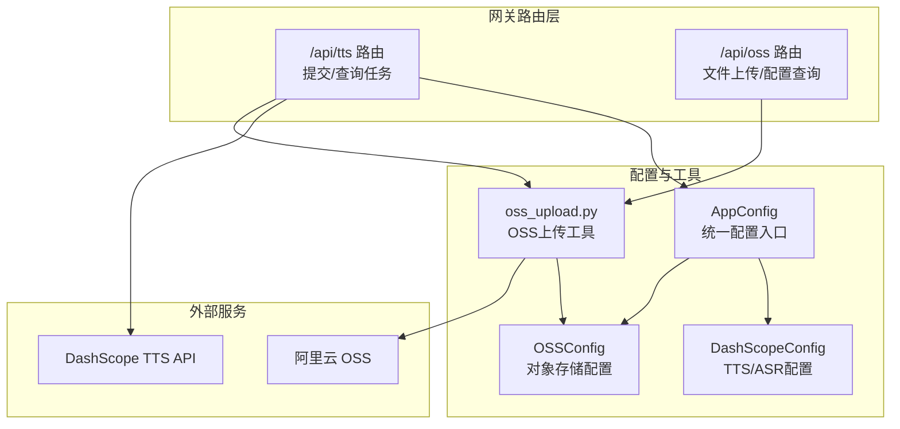
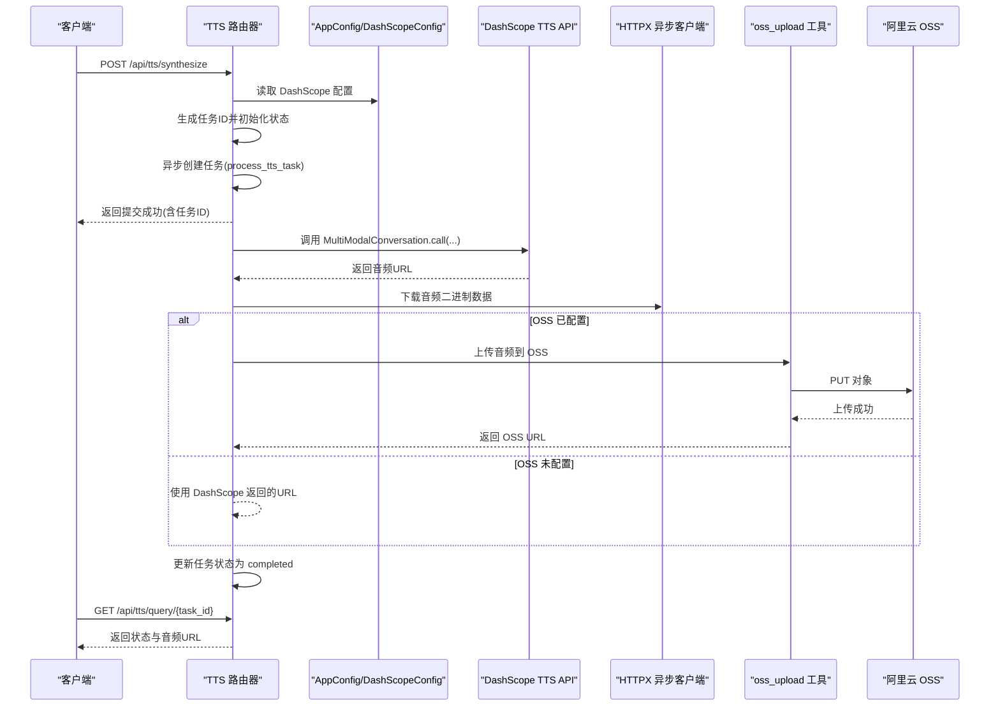
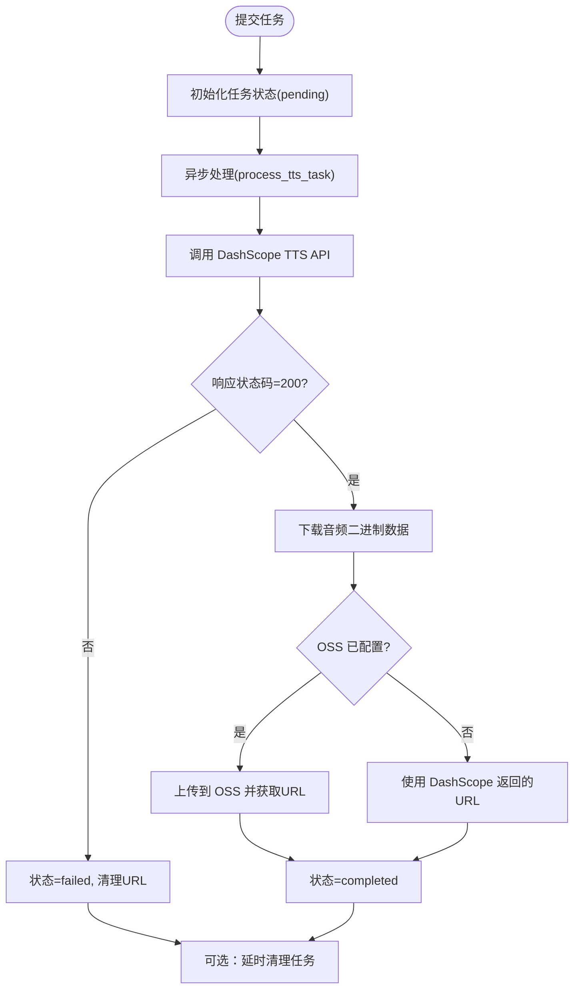
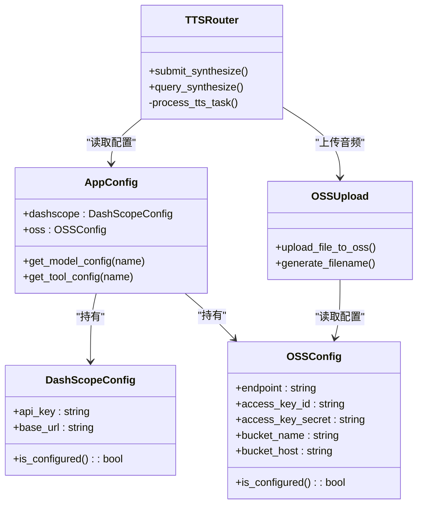

# 文字转语音路由器

<cite>
**本文档引用的文件**
- [backend/app/gateway/routers/tts.py](file://backend/app/gateway/routers/tts.py)
- [backend/deerflow/utils/oss_upload.py](file://backend/deerflow/utils/oss_upload.py)
- [backend/packages/harness/deerflow/config/dashscope_config.py](file://backend/packages/harness/deerflow/config/dashscope_config.py)
- [backend/packages/harness/deerflow/config/oss_config.py](file://backend/packages/harness/deerflow/config/oss_config.py)
- [backend/packages/harness/deerflow/config/app_config.py](file://backend/packages/harness/deerflow/config/app_config.py)
- [backend/app/gateway/routers/oss.py](file://backend/app/gateway/routers/oss.py)
- [backend/docs/API.md](file://backend/docs/API.md)
- [backend/test_apis.py](file://backend/test_apis.py)
- [config.example.yaml](file://config.example.yaml)
- [backend/app/gateway/routers/asr.py](file://backend/app/gateway/routers/asr.py)
</cite>

## 目录
1. [简介](#简介)
2. [项目结构](#项目结构)
3. [核心组件](#核心组件)
4. [架构总览](#架构总览)
5. [详细组件分析](#详细组件分析)
6. [依赖关系分析](#依赖关系分析)
7. [性能考量](#性能考量)
8. [故障排查指南](#故障排查指南)
9. [结论](#结论)
10. [附录](#附录)

## 简介
本文件为“文字转语音路由器”提供系统化技术文档，聚焦以下目标：
- 深入解析语音合成 API 的实现机制与工作流
- 详述文本预处理流程与音频输出格式控制
- 说明支持的语音模型、音色选择与语言参数
- 区分批量合成与实时合成的差异，提出音频质量优化与存储策略
- 提供服务配置与使用最佳实践

## 项目结构
文字转语音能力位于后端网关路由层，围绕 FastAPI 路由器实现，结合 DashScope TTS 服务与 OSS 存储，形成“提交任务—异步合成—下载并上传—查询结果”的闭环。

图表来源
- [backend/app/gateway/routers/tts.py:1-185](file://backend/app/gateway/routers/tts.py#L1-L185)
- [backend/app/gateway/routers/oss.py:1-107](file://backend/app/gateway/routers/oss.py#L1-L107)
- [backend/deerflow/utils/oss_upload.py:1-82](file://backend/deerflow/utils/oss_upload.py#L1-L82)
- [backend/packages/harness/deerflow/config/app_config.py:91-121](file://backend/packages/harness/deerflow/config/app_config.py#L91-L121)
- [backend/packages/harness/deerflow/config/dashscope_config.py:9-23](file://backend/packages/harness/deerflow/config/dashscope_config.py#L9-L23)
- [backend/packages/harness/deerflow/config/oss_config.py:6-37](file://backend/packages/harness/deerflow/config/oss_config.py#L6-L37)

章节来源
- [backend/app/gateway/routers/tts.py:1-185](file://backend/app/gateway/routers/tts.py#L1-L185)
- [backend/app/gateway/routers/oss.py:1-107](file://backend/app/gateway/routers/oss.py#L1-L107)
- [backend/deerflow/utils/oss_upload.py:1-82](file://backend/deerflow/utils/oss_upload.py#L1-L82)
- [backend/packages/harness/deerflow/config/app_config.py:91-121](file://backend/packages/harness/deerflow/config/app_config.py#L91-L121)
- [backend/packages/harness/deerflow/config/dashscope_config.py:9-23](file://backend/packages/harness/deerflow/config/dashscope_config.py#L9-L23)
- [backend/packages/harness/deerflow/config/oss_config.py:6-37](file://backend/packages/harness/deerflow/config/oss_config.py#L6-L37)

## 核心组件
- TTS 路由器：提供“提交合成任务”和“查询任务状态/结果”的接口，内部维护内存任务表，异步调用 DashScope TTS 并将结果音频上传至 OSS。
- OSS 工具：封装阿里云 OSS 上传逻辑，支持动态文件名生成与内容类型设置。
- 配置系统：AppConfig 统一加载与缓存配置，DashScopeConfig/OSSConfig 分别管理 TTS/ASR 与对象存储参数。
- 测试脚本：提供 TTS/ASR/OSS 的端到端测试流程，便于验证集成。

章节来源
- [backend/app/gateway/routers/tts.py:49-185](file://backend/app/gateway/routers/tts.py#L49-L185)
- [backend/deerflow/utils/oss_upload.py:15-82](file://backend/deerflow/utils/oss_upload.py#L15-L82)
- [backend/packages/harness/deerflow/config/app_config.py:369-467](file://backend/packages/harness/deerflow/config/app_config.py#L369-L467)
- [backend/test_apis.py:54-103](file://backend/test_apis.py#L54-L103)

## 架构总览
文字转语音的端到端流程如下：

图表来源
- [backend/app/gateway/routers/tts.py:49-185](file://backend/app/gateway/routers/tts.py#L49-L185)
- [backend/deerflow/utils/oss_upload.py:15-82](file://backend/deerflow/utils/oss_upload.py#L15-L82)
- [backend/packages/harness/deerflow/config/dashscope_config.py:9-23](file://backend/packages/harness/deerflow/config/dashscope_config.py#L9-L23)

## 详细组件分析

### TTS 路由器与任务处理
- 接口设计
  - 提交合成：接收文本、模型、音色、语言等参数，返回任务ID。
  - 查询结果：根据任务ID返回状态、音频URL与消息。
- 任务状态
  - pending → processing → completed/failed，失败时清理状态与URL。
- 异步处理
  - 使用 asyncio.create_task 将耗时的 TTS 调用与下载上传分离，避免阻塞主请求线程。
- 失败与清理
  - 任务完成后延迟清理（可选），降低内存占用。

图表来源
- [backend/app/gateway/routers/tts.py:117-185](file://backend/app/gateway/routers/tts.py#L117-L185)

章节来源
- [backend/app/gateway/routers/tts.py:49-185](file://backend/app/gateway/routers/tts.py#L49-L185)

### 文本预处理与参数映射
- 输入参数
  - text：待合成文本
  - model：TTS 模型，默认 qwen3-tts-flash
  - voice：音色，默认 Cherry
  - language：语言代码，默认 zh
- 参数映射
  - language 为 zh 时，映射为 Chinese 传给 DashScope API
  - stream=False 表示一次性返回完整音频
- 注意事项
  - DashScope API 的 voice/language 等参数需与服务端支持项一致
  - 若文本过长或包含特殊符号，建议在上游进行分段与清洗

章节来源
- [backend/app/gateway/routers/tts.py:24-47](file://backend/app/gateway/routers/tts.py#L24-L47)
- [backend/app/gateway/routers/tts.py:133-140](file://backend/app/gateway/routers/tts.py#L133-L140)

### 音频输出格式控制
- DashScope 返回的音频URL指向二进制音频数据
- 客户端可直接下载或通过 OSS 生成公开可访问的URL
- OSS 上传时支持设置 Content-Type，便于浏览器正确识别音频类型
- 若未配置 OSS，直接使用 DashScope 返回的URL

章节来源
- [backend/app/gateway/routers/tts.py:145-168](file://backend/app/gateway/routers/tts.py#L145-L168)
- [backend/deerflow/utils/oss_upload.py:15-56](file://backend/deerflow/utils/oss_upload.py#L15-L56)

### 支持的语音模型、音色与语言
- 模型
  - qwen3-tts-flash（默认）
- 音色
  - Cherry（默认）
- 语言
  - zh → Chinese
  - 其他语言代码透传
- 说明
  - 更多音色与语言支持取决于 DashScope TTS 的可用选项
  - 建议在配置中预留切换点，便于后续扩展

章节来源
- [backend/app/gateway/routers/tts.py:28-31](file://backend/app/gateway/routers/tts.py#L28-L31)
- [backend/app/gateway/routers/tts.py:138-139](file://backend/app/gateway/routers/tts.py#L138-L139)

### 批量合成与实时合成
- 实时合成
  - 提交任务后立即返回任务ID，随后通过查询接口获取结果
  - 适合对时延敏感的场景，但需客户端轮询或使用 SSE/WS（当前 TTS 路由未内置）
- 批量合成
  - 可在业务层将多个文本分批提交，分别查询结果
  - 建议在上游进行文本分段与去噪，确保每条文本长度适中
- 优化建议
  - 控制并发任务数量，避免触发第三方服务限流
  - 对长文本进行分句/分段，提升合成质量与稳定性

章节来源
- [backend/app/gateway/routers/tts.py:49-114](file://backend/app/gateway/routers/tts.py#L49-L114)

### 音频质量优化与存储策略
- 音频质量
  - 由 DashScope TTS 服务决定，可通过调整模型与音色获得更佳效果
- 存储策略
  - OSS 已配置：上传后返回可访问URL，便于前端直链播放
  - OSS 未配置：直接使用 DashScope 返回URL，适合临时或测试场景
- 文件命名
  - 使用时间戳与扩展名组合，避免冲突
- 生命周期
  - 任务完成后可选延时清理，减少存储占用

章节来源
- [backend/deerflow/utils/oss_upload.py:65-82](file://backend/deerflow/utils/oss_upload.py#L65-L82)
- [backend/app/gateway/routers/tts.py:178-185](file://backend/app/gateway/routers/tts.py#L178-L185)

### 配置与使用最佳实践
- 配置要点
  - DashScope：设置 DASHSCOPE_API_KEY 与 base_url
  - OSS：设置 endpoint/access_key_id/access_key_secret/bucket_name/bucket_host
- 环境变量
  - 通过环境变量覆盖 config.yaml 中的敏感字段
- 使用流程
  - 提交任务 → 轮询查询 → 获取音频URL → 播放或继续下游处理
- 安全与限流
  - 生产环境建议在 Nginx 层做限流与鉴权
  - 对外暴露的 API 仅在受控网络内开放

章节来源
- [backend/packages/harness/deerflow/config/dashscope_config.py:24-40](file://backend/packages/harness/deerflow/config/dashscope_config.py#L24-L40)
- [backend/packages/harness/deerflow/config/oss_config.py:30-37](file://backend/packages/harness/deerflow/config/oss_config.py#L30-L37)
- [backend/docs/API.md:548-566](file://backend/docs/API.md#L548-L566)

## 依赖关系分析
- 组件耦合
  - TTS 路由器依赖 AppConfig 获取 DashScope/OSS 配置
  - process_tts_task 内部再次读取配置，保证异步任务的独立性
  - oss_upload 工具依赖 OSSConfig，并通过 oss2 客户端上传
- 外部依赖
  - DashScope TTS API：负责实际语音合成
  - 阿里云 OSS：提供对象存储与 CDN 加速
- 潜在风险
  - 内存任务表仅适用于单实例部署；生产建议替换为 Redis/数据库
  - OSS 未配置时直接使用 DashScope URL，需注意其有效期与访问策略

图表来源
- [backend/packages/harness/deerflow/config/app_config.py:91-121](file://backend/packages/harness/deerflow/config/app_config.py#L91-L121)
- [backend/packages/harness/deerflow/config/dashscope_config.py:9-23](file://backend/packages/harness/deerflow/config/dashscope_config.py#L9-L23)
- [backend/packages/harness/deerflow/config/oss_config.py:6-37](file://backend/packages/harness/deerflow/config/oss_config.py#L6-L37)
- [backend/app/gateway/routers/tts.py:49-185](file://backend/app/gateway/routers/tts.py#L49-L185)
- [backend/deerflow/utils/oss_upload.py:15-82](file://backend/deerflow/utils/oss_upload.py#L15-L82)

章节来源
- [backend/packages/harness/deerflow/config/app_config.py:91-121](file://backend/packages/harness/deerflow/config/app_config.py#L91-L121)
- [backend/app/gateway/routers/tts.py:49-185](file://backend/app/gateway/routers/tts.py#L49-L185)
- [backend/deerflow/utils/oss_upload.py:15-82](file://backend/deerflow/utils/oss_upload.py#L15-L82)

## 性能考量
- 异步化
  - 使用 asyncio.create_task 将 TTS 调用与下载上传异步化，避免阻塞请求线程
- 并发控制
  - 建议在上游限制并发任务数量，防止触发第三方服务限流
- 缓存与复用
  - 对相同文本/参数的重复请求可考虑缓存结果URL，减少重复合成
- 存储成本
  - OSS 已配置时尽量使用 CDN 加速与合适的存储类型，平衡成本与性能

## 故障排查指南
- 常见错误
  - DashScope 未配置：检查 DASHSCOPE_API_KEY 与 base_url
  - OSS 未配置：检查 endpoint/access_key_id/access_key_secret/bucket_name
  - TTS API 返回非 200：检查文本长度、音色/语言参数是否合法
  - 下载音频失败：检查 DashScope 返回URL的有效性与时效
- 排查步骤
  - 使用测试脚本验证端到端流程
  - 查看日志中的任务状态与错误信息
  - 确认 OSS 凭据与网络可达性
- 相关接口参考
  - OSS 配置查询：GET /api/oss/config
  - TTS 提交：POST /api/tts/synthesize
  - TTS 查询：GET /api/tts/query/{task_id}

章节来源
- [backend/test_apis.py:27-103](file://backend/test_apis.py#L27-L103)
- [backend/app/gateway/routers/oss.py:91-106](file://backend/app/gateway/routers/oss.py#L91-L106)
- [backend/app/gateway/routers/tts.py:60-66](file://backend/app/gateway/routers/tts.py#L60-L66)
- [backend/app/gateway/routers/tts.py:142-152](file://backend/app/gateway/routers/tts.py#L142-L152)

## 结论
本“文字转语音路由器”通过 FastAPI 路由器与 DashScope TTS 的结合，提供了简洁可靠的 TTS 能力。其异步任务模型与 OSS 集成使得服务具备良好的扩展性与可运维性。建议在生产环境中完善并发控制、缓存策略与监控告警，并将内存任务表替换为持久化存储以满足高可用需求。

## 附录

### API 参考（TTS）
- 提交合成
  - 方法：POST
  - 路径：/api/tts/synthesize
  - 请求体：text, model, voice, language
  - 响应：success, task_id
- 查询结果
  - 方法：GET
  - 路径：/api/tts/query/{task_id}
  - 响应：task_id, status, audio_url, message

章节来源
- [backend/app/gateway/routers/tts.py:49-114](file://backend/app/gateway/routers/tts.py#L49-L114)
- [backend/docs/API.md:548-566](file://backend/docs/API.md#L548-L566)

### 配置参考
- DashScope
  - 字段：api_key, base_url
  - 校验：is_configured()
- OSS
  - 字段：endpoint, access_key_id, access_key_secret, bucket_name, bucket_host
  - 校验：is_configured()

章节来源
- [backend/packages/harness/deerflow/config/dashscope_config.py:9-23](file://backend/packages/harness/deerflow/config/dashscope_config.py#L9-L23)
- [backend/packages/harness/deerflow/config/oss_config.py:6-37](file://backend/packages/harness/deerflow/config/oss_config.py#L6-L37)
- [config.example.yaml:1-348](file://config.example.yaml#L1-L348)