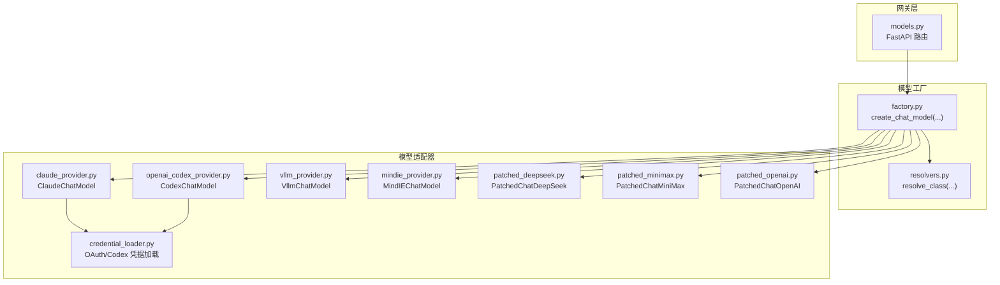
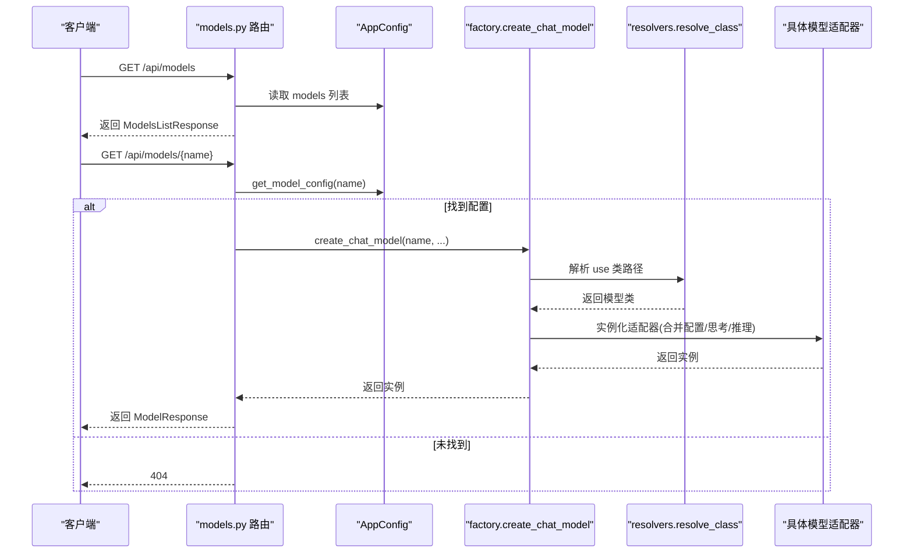
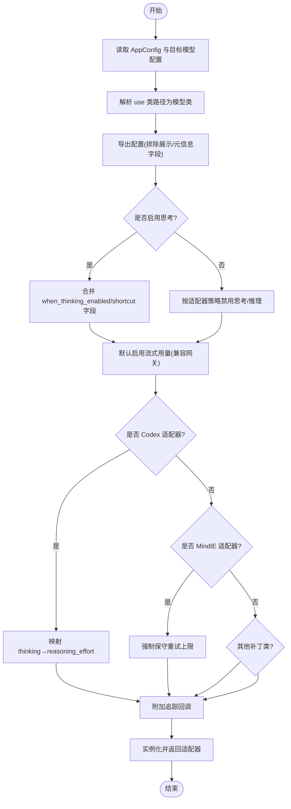
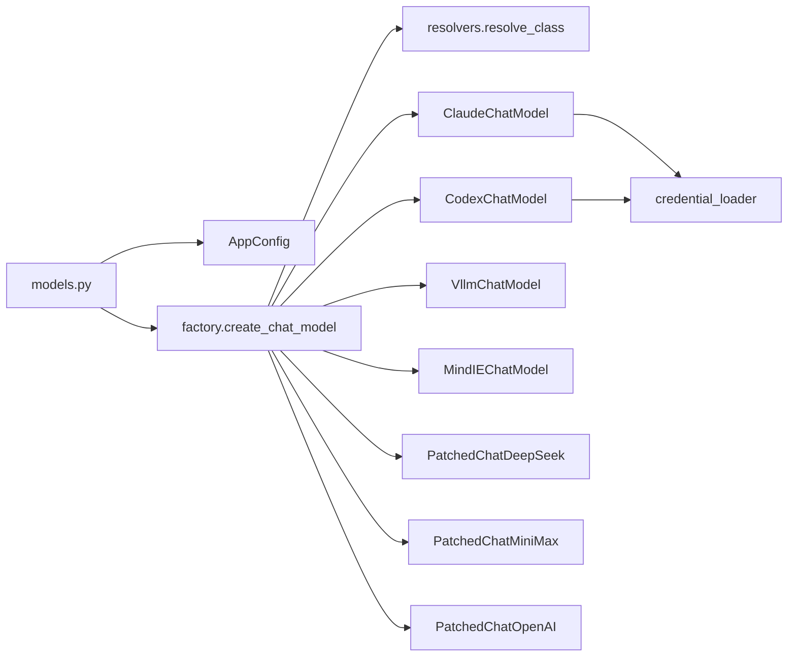

# 模型路由器

<cite>
**本文引用的文件**
- [models.py](file://backend/app/gateway/routers/models.py)
- [factory.py](file://backend/packages/harness/deerflow/models/factory.py)
- [__init__.py](file://backend/packages/harness/deerflow/models/__init__.py)
- [claude_provider.py](file://backend/packages/harness/deerflow/models/claude_provider.py)
- [openai_codex_provider.py](file://backend/packages/harness/deerflow/models/openai_codex_provider.py)
- [vllm_provider.py](file://backend/packages/harness/deerflow/models/vllm_provider.py)
- [mindie_provider.py](file://backend/packages/harness/deerflow/models/mindie_provider.py)
- [credential_loader.py](file://backend/packages/harness/deerflow/models/credential_loader.py)
- [patched_deepseek.py](file://backend/packages/harness/deerflow/models/patched_deepseek.py)
- [patched_minimax.py](file://backend/packages/harness/deerflow/models/patched_minimax.py)
- [patched_openai.py](file://backend/packages/harness/deerflow/models/patched_openai.py)
- [resolvers.py](file://backend/packages/harness/deerflow/reflection/resolvers.py)
- [test_client_live.py](file://backend/tests/test_client_live.py)
- [test_model_config.py](file://backend/tests/test_model_config.py)
- [test_claude_provider_oauth_billing.py](file://backend/tests/test_claude_provider_oauth_billing.py)
</cite>

## 目录
1. [简介](#简介)
2. [项目结构](#项目结构)
3. [核心组件](#核心组件)
4. [架构总览](#架构总览)
5. [详细组件分析](#详细组件分析)
6. [依赖关系分析](#依赖关系分析)
7. [性能考量](#性能考量)
8. [故障排除指南](#故障排除指南)
9. [结论](#结论)
10. [附录](#附录)

## 简介
本文件面向“模型路由器”子系统，系统性阐述以下内容：
- 模型列表与详情 API 的实现机制与数据流
- 模型配置的获取与验证流程
- 支持的模型提供商与适配器
- 配置参数的作用与动态模型切换机制
- 模型工厂的集成方式、缓存策略与性能优化
- 最佳实践与故障排除建议

## 项目结构
模型路由器位于后端网关层，通过 FastAPI 路由暴露模型清单与详情查询；模型工厂负责从配置解析并实例化具体模型适配器；各模型适配器封装不同供应商的特性（如 OAuth、提示缓存、推理模式等），并通过统一的 LangChain 接口对外提供服务。

图表来源
- [models.py:1-133](file://backend/app/gateway/routers/models.py#L1-L133)
- [factory.py:50-158](file://backend/packages/harness/deerflow/models/factory.py#L50-L158)
- [resolvers.py:73-95](file://backend/packages/harness/deerflow/reflection/resolvers.py#L73-L95)
- [claude_provider.py:44-364](file://backend/packages/harness/deerflow/models/claude_provider.py#L44-L364)
- [openai_codex_provider.py:61-461](file://backend/packages/harness/deerflow/models/openai_codex_provider.py#L61-L461)
- [vllm_provider.py:159-259](file://backend/packages/harness/deerflow/models/vllm_provider.py#L159-L259)
- [mindie_provider.py:162-250](file://backend/packages/harness/deerflow/models/mindie_provider.py#L162-L250)
- [patched_deepseek.py:17-112](file://backend/packages/harness/deerflow/models/patched_deepseek.py#L17-L112)
- [patched_minimax.py:98-221](file://backend/packages/harness/deerflow/models/patched_minimax.py#L98-L221)
- [patched_openai.py:31-133](file://backend/packages/harness/deerflow/models/patched_openai.py#L31-L133)
- [credential_loader.py:149-220](file://backend/packages/harness/deerflow/models/credential_loader.py#L149-L220)

章节来源
- [models.py:1-133](file://backend/app/gateway/routers/models.py#L1-L133)
- [factory.py:50-158](file://backend/packages/harness/deerflow/models/factory.py#L50-L158)

## 核心组件
- 网关路由：提供 /api/models（列表）与 /api/models/{model_name}（详情）两个端点，返回前端友好的模型元信息与令牌用量显示开关。
- 模型工厂：根据配置解析类路径、合并思考/推理设置、注入追踪回调，并处理兼容性补丁（如流式用量、推理努力值、重试策略等）。
- 模型适配器：针对不同供应商的定制实现，包括 Claude 的 OAuth/提示缓存/思考预算、Codex 的 Responses API/流式/重试、vLLM 的推理字段保留、MindIE 的消息清洗与工具解析、以及若干补丁类用于修复第三方适配器的已知缺陷。

章节来源
- [models.py:34-133](file://backend/app/gateway/routers/models.py#L34-L133)
- [factory.py:50-158](file://backend/packages/harness/deerflow/models/factory.py#L50-L158)
- [__init__.py:1-4](file://backend/packages/harness/deerflow/models/__init__.py#L1-L4)

## 架构总览
模型路由器的请求处理链路如下：

图表来源
- [models.py:40-133](file://backend/app/gateway/routers/models.py#L40-L133)
- [factory.py:50-158](file://backend/packages/harness/deerflow/models/factory.py#L50-L158)
- [resolvers.py:73-95](file://backend/packages/harness/deerflow/reflection/resolvers.py#L73-L95)

## 详细组件分析

### 网关路由：模型列表与详情 API
- 列表接口
  - 路径：/api/models
  - 行为：遍历 AppConfig.models，构造 ModelResponse 列表；同时读取 AppConfig.token_usage.enabled 作为前端令牌用量显示开关。
  - 输出：ModelsListResponse（包含 models 与 token_usage）。
- 详情接口
  - 路径：/api/models/{model_name}
  - 行为：通过 AppConfig.get_model_config(name) 获取配置，若不存在则 404；否则返回 ModelResponse。
- 关键点
  - 响应体字段与前端约定一致，不泄露敏感配置（如密钥）。
  - 通过依赖注入获取 AppConfig，确保配置热更新生效。

章节来源
- [models.py:34-133](file://backend/app/gateway/routers/models.py#L34-L133)

### 模型工厂：动态模型创建与配置合并
- 入口函数：create_chat_model(name=None, thinking_enabled=False, app_config=None, **kwargs)
- 主要流程
  - 选择模型：若 name 为空则取第一个模型；否则通过 AppConfig.get_model_config(name) 查找。
  - 解析类路径：使用 resolve_class(model_config.use, BaseChatModel) 将字符串路径映射为类。
  - 配置提取：model_config.model_dump(exclude=...) 排除展示与元信息字段，仅保留适配器可识别的参数。
  - 思考模式合并：
    - 若启用思考且模型支持，则将 when_thinking_enabled 合并到配置中；若禁用思考，则按不同适配器策略注入禁用标记或调整 extra_body。
  - 推理努力值：若模型不支持 reasoning_effort，则从 kwargs 与配置中移除该字段。
  - 流式用量：对 OpenAI 兼容网关默认开启 stream_usage，保证令牌用量统计可用。
  - 特定适配器补丁：
    - Codex：将 thinking 映射为 reasoning_effort，限制最大输出等。
    - MindIE：强制保守重试上限。
    - 其他补丁类：修复第三方适配器在多轮对话中的签名/推理字段丢失问题。
  - 追踪回调：附加 tracing 回调，便于可观测性。
  - 返回实例：构造并返回适配器实例。

图表来源
- [factory.py:50-158](file://backend/packages/harness/deerflow/models/factory.py#L50-L158)
- [resolvers.py:73-95](file://backend/packages/harness/deerflow/reflection/resolvers.py#L73-L95)

章节来源
- [factory.py:50-158](file://backend/packages/harness/deerflow/models/factory.py#L50-L158)

### 模型适配器：供应商特性与兼容性
- Claude（OAuth/Bearer 认证、提示缓存、智能思考）
  - 自动检测 OAuth 令牌，切换 Authorization: Bearer 并注入必需的 beta 头。
  - 注入 OAuth 必需的 billing 头，生成稳定 user_id。
  - 可选提示缓存（OAuth 会自动禁用），并按预算分配思考令牌。
  - 增加重试与指数退避，处理限流与服务器错误。
  - 在 OAuth 请求前清理 cache_control 标记，避免发送给上游。
- Codex（Responses API、流式、工具调用）
  - 使用 Codex CLI 凭据，调用 chatgpt.com/backend-api/codex/responses。
  - 将 LangChain 消息转换为 Responses API 格式，解析 SSE 流并合并最终响应。
  - 支持工具调用与推理努力值，解析无效工具调用并记录错误。
- vLLM（推理字段保留、聊天模板兼容）
  - 修复 LangChain OpenAI 适配器对非标准 reasoning 字段的忽略，保留推理内容。
  - 将 extra_body.chat_template_kwargs.thinking 正常化为 enable_thinking，兼容旧配置。
  - 在多轮对话中回注推理内容，确保 interleaved thinking 正常工作。
- MindIE（消息清洗、XML 工具解析、流式降级）
  - 将多模态列表内容扁平化为纯文本，转换工具调用为 XML 格式。
  - 解析模型输出中的 XML 工具块，还原为标准工具调用。
  - 当启用工具且 stream=True 时，回退到非流式生成并模拟分片输出。
- 补丁类（第三方适配器修复）
  - PatchedChatDeepSeek：修复推理内容在多轮对话中未回注的问题，清理无效 thinking 参数。
  - PatchedChatMiniMax：保留 reasoning_split 并将 provider-specific reasoning 映射为前端理解的 reasoning_content。
  - PatchedChatOpenAI：在 OpenAI 兼容网关上回注 thought_signature，满足 Gemini 思考模式要求。

章节来源
- [claude_provider.py:44-364](file://backend/packages/harness/deerflow/models/claude_provider.py#L44-L364)
- [openai_codex_provider.py:61-461](file://backend/packages/harness/deerflow/models/openai_codex_provider.py#L61-L461)
- [vllm_provider.py:159-259](file://backend/packages/harness/deerflow/models/vllm_provider.py#L159-L259)
- [mindie_provider.py:162-250](file://backend/packages/harness/deerflow/models/mindie_provider.py#L162-L250)
- [patched_deepseek.py:17-112](file://backend/packages/harness/deerflow/models/patched_deepseek.py#L17-L112)
- [patched_minimax.py:98-221](file://backend/packages/harness/deerflow/models/patched_minimax.py#L98-L221)
- [patched_openai.py:31-133](file://backend/packages/harness/deerflow/models/patched_openai.py#L31-L133)

### 凭据加载：OAuth/Codex 凭据自动发现
- Claude Code OAuth
  - 支持环境变量、文件描述符、自定义路径与默认 ~/.claude/.credentials.json。
  - 自动校验过期时间并注入 anthropic-beta 头。
- Codex CLI
  - 支持 $CODEX_AUTH_PATH 或 ~/.codex/auth.json，兼容旧版与新版 token 结构。
- 通用逻辑
  - 统一的 JSON 文件读取、路径解析与错误日志记录。

章节来源
- [credential_loader.py:149-220](file://backend/packages/harness/deerflow/models/credential_loader.py#L149-L220)

## 依赖关系分析
- 路由依赖 AppConfig（通过依赖注入）获取模型配置。
- 工厂依赖反射解析器将字符串路径解析为具体类。
- 适配器依赖 LangChain 基类（如 ChatAnthropic、ChatOpenAI、BaseChatModel）实现统一接口。
- OAuth/Codex 凭据加载模块被 Claude 与 Codex 适配器复用。

图表来源
- [models.py:40-133](file://backend/app/gateway/routers/models.py#L40-L133)
- [factory.py:50-158](file://backend/packages/harness/deerflow/models/factory.py#L50-L158)
- [resolvers.py:73-95](file://backend/packages/harness/deerflow/reflection/resolvers.py#L73-L95)
- [credential_loader.py:149-220](file://backend/packages/harness/deerflow/models/credential_loader.py#L149-L220)

章节来源
- [models.py:40-133](file://backend/app/gateway/routers/models.py#L40-L133)
- [factory.py:50-158](file://backend/packages/harness/deerflow/models/factory.py#L50-L158)
- [resolvers.py:73-95](file://backend/packages/harness/deerflow/reflection/resolvers.py#L73-L95)

## 性能考量
- 流式用量统计
  - 对 OpenAI 兼容网关默认启用 stream_usage，避免第三方代理导致的用量缺失。
- 重试与退避
  - Claude 适配器对速率限制与服务器错误进行指数退避重试，降低失败率。
  - MindIE 适配器强制保守重试上限，防止级联超时。
- 推理预算与缓存
  - Claude 适配器按 max_tokens 的比例自动分配思考预算，减少无效计算。
  - 提示缓存（在非 OAuth 情况下）减少重复输入开销。
- 分片输出
  - MindIE 在工具+流式场景下回退为非流式并模拟分片，兼顾正确性与渲染体验。

章节来源
- [factory.py:117-149](file://backend/packages/harness/deerflow/models/factory.py#L117-L149)
- [claude_provider.py:302-346](file://backend/packages/harness/deerflow/models/claude_provider.py#L302-L346)
- [mindie_provider.py:218-250](file://backend/packages/harness/deerflow/models/mindie_provider.py#L218-L250)

## 故障排除指南
- 404 未找到模型
  - 现象：访问 /api/models/{name} 返回 404。
  - 排查：确认 config.yaml 中是否存在该 name 的模型条目；检查 AppConfig 是否正确加载。
- 思考模式不生效
  - 现象：设置 thinking_enabled 后仍无思考输出。
  - 排查：确认模型配置 supports_thinking=true；检查 when_thinking_enabled/shortcut 是否正确；部分适配器（如 vLLM）需要额外 chat_template_kwargs 正规化。
- OAuth 请求失败或被拒绝
  - 现象：Claude OAuth 请求报错或被拒。
  - 排查：确认凭据有效且未过期；检查 anthropic-beta 头是否注入；确保 billing 头位于 system prompt 第一位。
- 推理内容丢失
  - 现象：多轮对话中推理内容未回注。
  - 排查：使用补丁类（如 PatchedChatDeepSeek、VllmChatModel）；确保 extra_body.thinking 正确传递。
- 工具调用异常
  - 现象：MindIE 输出的 XML 工具无法解析或丢失签名。
  - 排查：确认补丁类已启用；检查 thought_signature 是否在 payload 中回注。
- 单元测试参考
  - 列表与详情端点行为：见测试用例。
  - OAuth 负载清理：验证 cache_control 被移除。
  - Responses API 解析与流式合并：验证工具调用与推理内容。

章节来源
- [test_client_live.py:224-249](file://backend/tests/test_client_live.py#L224-L249)
- [test_claude_provider_oauth_billing.py:115-154](file://backend/tests/test_claude_provider_oauth_billing.py#L115-L154)
- [test_model_config.py:1-30](file://backend/tests/test_model_config.py#L1-L30)

## 结论
模型路由器通过清晰的三层设计（网关路由、模型工厂、适配器）实现了对多供应商模型的统一接入与动态切换。工厂层负责配置解析、参数合并与兼容性补丁，适配器层覆盖主流供应商的关键特性（OAuth、提示缓存、推理保留、工具解析等）。配合流式用量、重试与预算控制等性能优化，系统在易用性与稳定性之间取得良好平衡。

## 附录

### API 定义与示例
- 列表接口
  - 方法：GET
  - 路径：/api/models
  - 响应：ModelsListResponse（models: ModelResponse[], token_usage: TokenUsageResponse）
- 详情接口
  - 方法：GET
  - 路径：/api/models/{model_name}
  - 响应：ModelResponse（name, model, display_name, description, supports_thinking, supports_reasoning_effort）

章节来源
- [models.py:34-133](file://backend/app/gateway/routers/models.py#L34-L133)

### 配置参数作用与最佳实践
- use：模型类路径（如 deerflow.models.claude_provider:ClaudeChatModel）
- model：实际供应商模型标识
- display_name/description：前端展示字段
- supports_thinking/supports_reasoning_effort：能力声明
- when_thinking_enabled/when_thinking_disabled/thinking：思考模式快捷开关
- stream_usage：流式用量统计（默认对 OpenAI 兼容网关启用）
- reasoning_effort：推理努力值（low/medium/high/xhigh）
- extra_body：供应商特定参数（如 thinking/chat_template_kwargs）

最佳实践
- 明确声明模型能力（supports_thinking/supports_reasoning_effort）。
- 在 OpenAI 兼容网关场景下保持 stream_usage 开启以获得准确用量。
- 对 vLLM/DeepSeek/MindIE 等需要特殊处理的适配器，使用对应的补丁类或遵循其参数规范。
- 使用凭据加载模块管理 OAuth/Codex 凭据，避免硬编码。

章节来源
- [factory.py:50-158](file://backend/packages/harness/deerflow/models/factory.py#L50-L158)
- [vllm_provider.py:39-62](file://backend/packages/harness/deerflow/models/vllm_provider.py#L39-L62)
- [patched_deepseek.py:29-44](file://backend/packages/harness/deerflow/models/patched_deepseek.py#L29-L44)
- [credential_loader.py:149-220](file://backend/packages/harness/deerflow/models/credential_loader.py#L149-L220)