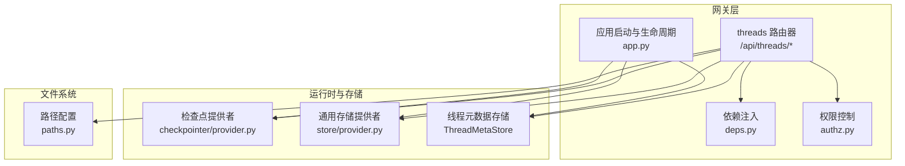
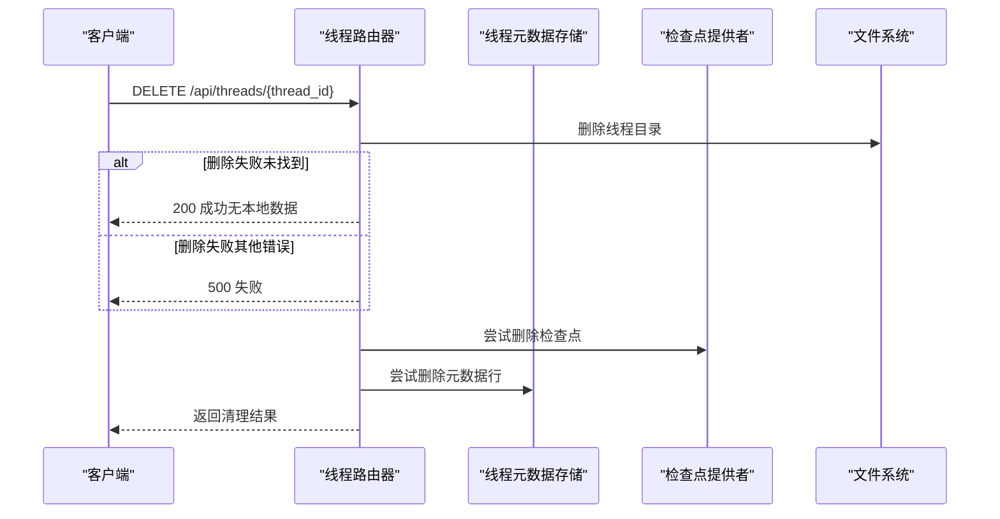
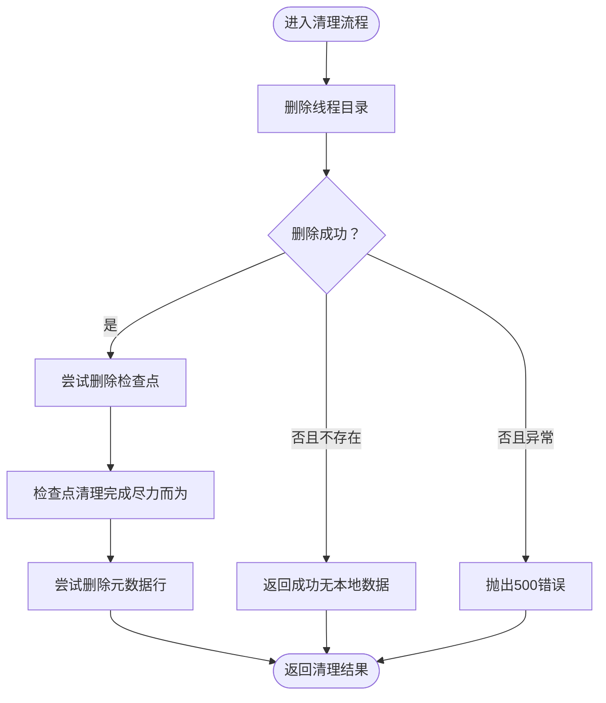
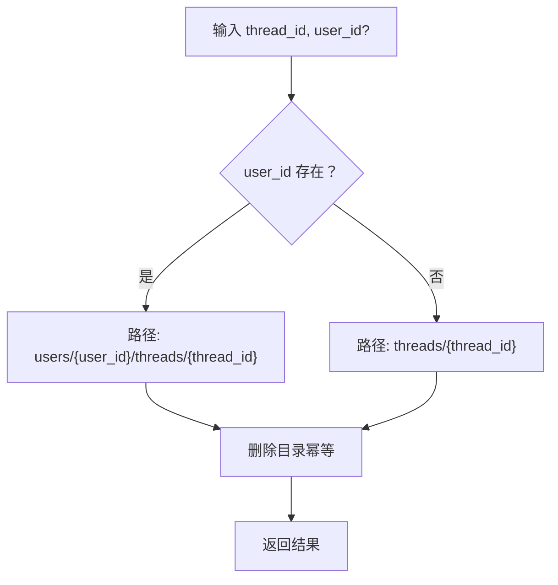
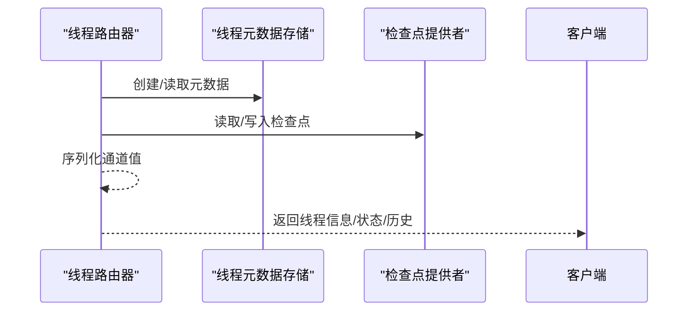
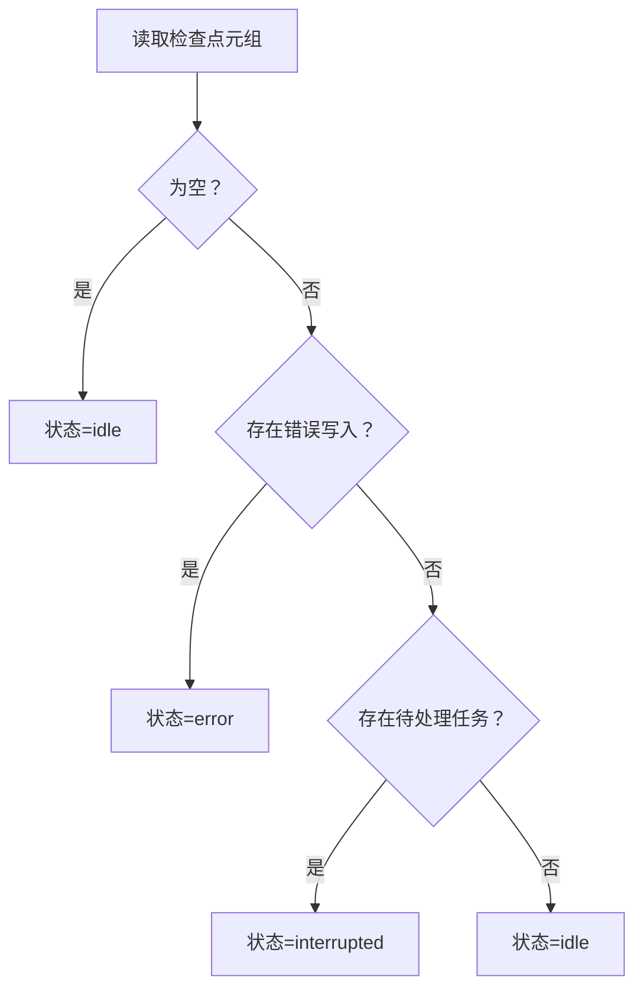
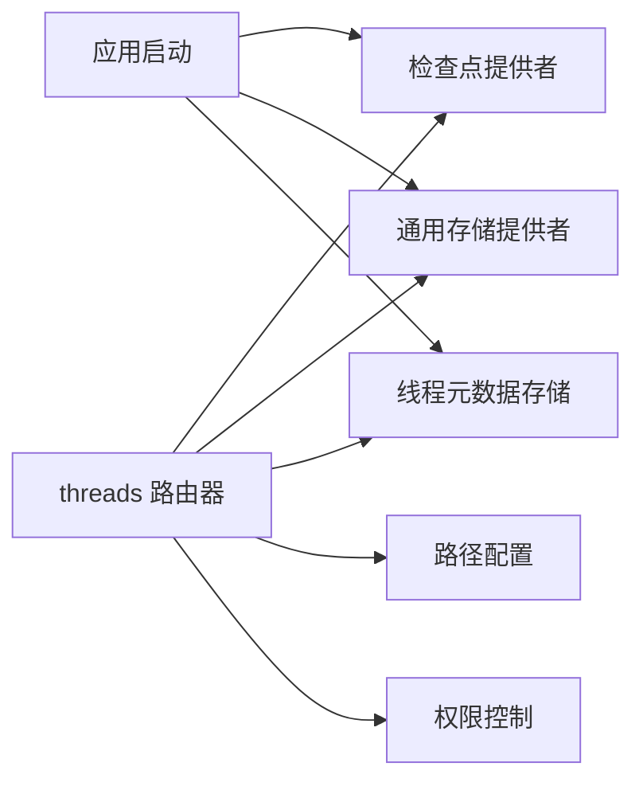

# 线程路由器

<cite>
**本文引用的文件**
- [threads.py](file://backend/app/gateway/routers/threads.py)
- [app.py](file://backend/app/gateway/app.py)
- [deps.py](file://backend/app/gateway/deps.py)
- [paths.py](file://backend/packages/harness/deerflow/config/paths.py)
- [authz.py](file://backend/app/gateway/authz.py)
- [test_threads_router.py](file://backend/tests/test_threads_router.py)
- [provider.py（检查点）](file://backend/packages/harness/deerflow/runtime/checkpointer/provider.py)
- [provider.py（存储）](file://backend/packages/harness/deerflow/runtime/store/provider.py)
- [aio_sandbox_provider.py](file://backend/packages/harness/deerflow/community/aio_sandbox/aio_sandbox_provider.py)
- [migrate_user_isolation.py](file://backend/scripts/migrate_user_isolation.py)
</cite>

## 目录
1. [简介](#简介)
2. [项目结构](#项目结构)
3. [核心组件](#核心组件)
4. [架构总览](#架构总览)
5. [详细组件分析](#详细组件分析)
6. [依赖分析](#依赖分析)
7. [性能考量](#性能考量)
8. [故障排除指南](#故障排除指南)
9. [结论](#结论)
10. [附录](#附录)

## 简介
本文件为“线程路由器”的技术文档，聚焦以下目标：
- 深入解释线程数据清理 API 的实现机制与安全策略
- 文件系统操作的安全性保障（路径校验、权限管理、隔离）
- 与 LangGraph 服务器的协作流程（检查点、元数据存储）
- 线程目录删除逻辑、文件权限管理、异常处理策略
- 线程生命周期管理、数据隔离机制、性能考虑
- 最佳实践与故障排除指南

## 项目结构
线程路由器位于后端网关层，负责线程的创建、查询、状态读写、历史查询与清理等能力，并与 LangGraph 的检查点与元数据存储进行协同。

图示来源
- [threads.py:1-623](file://backend/app/gateway/routers/threads.py#L1-L623)
- [deps.py:1-246](file://backend/app/gateway/deps.py#L1-L246)
- [app.py:1-431](file://backend/app/gateway/app.py#L1-L431)
- [provider.py（检查点）:61-194](file://backend/packages/harness/deerflow/runtime/checkpointer/provider.py#L61-L194)
- [provider.py（存储）:108-143](file://backend/packages/harness/deerflow/runtime/store/provider.py#L108-L143)
- [paths.py:62-351](file://backend/packages/harness/deerflow/config/paths.py#L62-L351)

章节来源
- [threads.py:1-623](file://backend/app/gateway/routers/threads.py#L1-L623)
- [app.py:1-431](file://backend/app/gateway/app.py#L1-L431)

## 核心组件
- 线程路由器：提供线程 CRUD、状态读写、历史查询与清理接口；统一序列化通道值以适配前端消费。
- 路径配置：集中管理线程目录布局、虚拟路径解析与安全校验。
- 权限控制：基于资源与动作的细粒度授权，支持拥有者检查与“已存在”约束。
- 运行时依赖：通过依赖注入获取检查点、通用存储、线程元数据存储等单例。
- 应用生命周期：在启动阶段初始化 LangGraph 运行时组件并迁移“孤儿线程”。

章节来源
- [threads.py:190-222](file://backend/app/gateway/routers/threads.py#L190-L222)
- [paths.py:62-351](file://backend/packages/harness/deerflow/config/paths.py#L62-L351)
- [authz.py:205-283](file://backend/app/gateway/authz.py#L205-L283)
- [deps.py:41-98](file://backend/app/gateway/deps.py#L41-L98)
- [app.py:166-245](file://backend/app/gateway/app.py#L166-L245)

## 架构总览
线程路由器与 LangGraph 的协作围绕“检查点 + 元数据存储”展开：
- 创建线程：写入线程元数据记录，同时写入空检查点以便状态接口可用。
- 查询线程：优先从元数据存储读取，状态由检查点派生；兼容旧版仅存在检查点的情况。
- 更新状态：合并通道值并生成新的检查点快照，必要时同步标题到元数据存储。
- 清理线程：删除本地线程目录，尝试删除检查点与元数据行（尽力而为）。

图示来源
- [threads.py:190-222](file://backend/app/gateway/routers/threads.py#L190-L222)
- [paths.py:282-289](file://backend/packages/harness/deerflow/config/paths.py#L282-L289)
- [deps.py:126-136](file://backend/app/gateway/deps.py#L126-L136)

## 详细组件分析

### 线程数据清理 API
- 接口定义：DELETE /api/threads/{thread_id}
- 行为：
  - 本地清理：调用路径配置删除线程目录，忽略“目录不存在”的情况。
  - 检查点清理：通过检查点提供者异步删除该线程的所有检查点（尽力而为）。
  - 元数据清理：通过线程元数据存储删除该线程的元数据行（尽力而为）。
- 安全与权限：
  - 使用权限装饰器要求“threads:delete”，并启用拥有者检查与“已存在”约束，防止越权或重定向攻击。
  - 用户上下文来自认证中间件，确保按用户隔离执行清理。
- 异常处理：
  - 本地删除返回 422（参数非法）或 500（其他错误），但不阻断后续清理步骤。
  - 检查点与元数据删除失败仅记录调试日志，不影响清理响应。

图示来源
- [threads.py:190-222](file://backend/app/gateway/routers/threads.py#L190-L222)
- [authz.py:205-283](file://backend/app/gateway/authz.py#L205-L283)
- [paths.py:282-289](file://backend/packages/harness/deerflow/config/paths.py#L282-L289)

章节来源
- [threads.py:190-222](file://backend/app/gateway/routers/threads.py#L190-L222)
- [authz.py:205-283](file://backend/app/gateway/authz.py#L205-L283)
- [test_threads_router.py:66-152](file://backend/tests/test_threads_router.py#L66-L152)

### 文件系统操作与安全性
- 路径布局与隔离：
  - 支持用户级隔离：当提供用户 ID 时，线程目录位于 users/{user_id}/threads/{thread_id}/。
  - 兼容旧版布局：未提供用户 ID 时，使用 threads/{thread_id}/。
- 目录创建与权限：
  - 创建线程相关目录时设置权限为 0o777，确保沙箱容器可写（规避 umask 影响）。
- 目录删除：
  - 删除操作幂等：不存在目录不会报错。
- 虚拟路径解析与防穿越：
  - 严格校验虚拟路径前缀与相对路径，拒绝越界访问并抛出错误。
- 测试验证：
  - 路由器测试覆盖了无效线程 ID 的拒绝、清理幂等性、异常转 500 等行为。

图示来源
- [paths.py:171-189](file://backend/packages/harness/deerflow/config/paths.py#L171-L189)
- [paths.py:282-289](file://backend/packages/harness/deerflow/config/paths.py#L282-L289)
- [paths.py:260-281](file://backend/packages/harness/deerflow/config/paths.py#L260-L281)
- [paths.py:291-325](file://backend/packages/harness/deerflow/config/paths.py#L291-L325)

章节来源
- [paths.py:171-189](file://backend/packages/harness/deerflow/config/paths.py#L171-L189)
- [paths.py:260-281](file://backend/packages/harness/deerflow/config/paths.py#L260-L281)
- [paths.py:282-289](file://backend/packages/harness/deerflow/config/paths.py#L282-L289)
- [paths.py:291-325](file://backend/packages/harness/deerflow/config/paths.py#L291-L325)
- [test_threads_router.py:66-152](file://backend/tests/test_threads_router.py#L66-L152)

### 与 LangGraph 的协作
- 初始化：
  - 应用启动时通过依赖注入创建 StreamBridge、检查点提供者、通用存储、线程元数据存储与运行管理器。
- 创建线程：
  - 写入线程元数据记录，立即写入空检查点，保证状态接口可用。
- 获取线程：
  - 优先从元数据存储读取；若不存在则从检查点派生状态，兼容旧数据。
- 更新状态：
  - 合并通道值并写入新检查点；如更新标题，同步至元数据存储以即时反映在搜索结果中。
- 历史查询：
  - 通过检查点迭代器读取历史，序列化通道值，仅在最新条目包含消息键，避免重复。

图示来源
- [deps.py:41-98](file://backend/app/gateway/deps.py#L41-L98)
- [threads.py:224-286](file://backend/app/gateway/routers/threads.py#L224-L286)
- [threads.py:351-405](file://backend/app/gateway/routers/threads.py#L351-L405)
- [threads.py:461-548](file://backend/app/gateway/routers/threads.py#L461-L548)
- [threads.py:551-622](file://backend/app/gateway/routers/threads.py#L551-L622)

章节来源
- [deps.py:41-98](file://backend/app/gateway/deps.py#L41-L98)
- [threads.py:224-286](file://backend/app/gateway/routers/threads.py#L224-L286)
- [threads.py:351-405](file://backend/app/gateway/routers/threads.py#L351-L405)
- [threads.py:461-548](file://backend/app/gateway/routers/threads.py#L461-L548)
- [threads.py:551-622](file://backend/app/gateway/routers/threads.py#L551-L622)

### 线程生命周期与状态推导
- 生命周期关键节点：
  - 创建：写入元数据 + 空检查点
  - 运行：检查点随执行推进
  - 中断/错误：根据检查点中的 pending_writes 与 tasks 推导
  - 清理：删除本地目录、检查点与元数据行
- 状态推导规则：
  - 有错误写入标记：error
  - 有待处理任务：interrupted
  - 否则：idle

图示来源
- [threads.py:166-182](file://backend/app/gateway/routers/threads.py#L166-L182)

章节来源
- [threads.py:166-182](file://backend/app/gateway/routers/threads.py#L166-L182)

### 数据隔离机制
- 用户隔离：
  - 路径与目录均支持 user_id 参数，确保不同用户的数据互不可见。
  - 脚本提供一次性迁移工具，将旧版共享布局迁移到 per-user 布局。
- 访问控制：
  - 权限装饰器在删除、修改等破坏性操作上强制“已存在”约束，避免越权或重定向。
  - 线程元数据存储在读取时可强制拥有者过滤。
- 沙箱路径限制：
  - 工具函数限制对沙箱内路径的访问范围，禁止写入受保护区域。

章节来源
- [paths.py:171-189](file://backend/packages/harness/deerflow/config/paths.py#L171-L189)
- [migrate_user_isolation.py:18-47](file://backend/scripts/migrate_user_isolation.py#L18-L47)
- [authz.py:74-85](file://backend/app/gateway/authz.py#L74-L85)
- [aio_sandbox_provider.py:491-497](file://backend/packages/harness/deerflow/community/aio_sandbox/aio_sandbox_provider.py#L491-L497)

### 异常处理策略
- 参数校验：
  - 无效线程 ID 抛出 422（通过路径模块的线程 ID 校验）。
- 资源缺失：
  - 依赖未就绪返回 503（由依赖注入 getter 抛出）。
- 文件系统异常：
  - 删除失败转为 500，但不中断后续清理步骤。
- 检查点/元数据清理失败：
  - 记录调试日志，不影响清理响应。

章节来源
- [threads.py:147-163](file://backend/app/gateway/routers/threads.py#L147-L163)
- [deps.py:105-115](file://backend/app/gateway/deps.py#L105-L115)
- [test_threads_router.py:154-167](file://backend/tests/test_threads_router.py#L154-L167)

## 依赖分析
- 组件耦合：
  - 线程路由器强依赖：检查点提供者、通用存储、线程元数据存储、路径配置、权限控制。
  - 应用启动阶段统一初始化上述组件，避免请求期重复初始化。
- 外部依赖：
  - LangGraph 检查点与存储实现（SQLite/Postgres/内存）由提供者工厂选择。
- 可能的循环依赖：
  - 路由器通过依赖注入获取单例，避免直接导入造成循环。

图示来源
- [deps.py:41-98](file://backend/app/gateway/deps.py#L41-L98)
- [provider.py（检查点）:61-194](file://backend/packages/harness/deerflow/runtime/checkpointer/provider.py#L61-L194)
- [provider.py（存储）:108-143](file://backend/packages/harness/deerflow/runtime/store/provider.py#L108-L143)

章节来源
- [deps.py:41-98](file://backend/app/gateway/deps.py#L41-L98)
- [provider.py（检查点）:61-194](file://backend/packages/harness/deerflow/runtime/checkpointer/provider.py#L61-L194)
- [provider.py（存储）:108-143](file://backend/packages/harness/deerflow/runtime/store/provider.py#L108-L143)

## 性能考量
- 检索与分页：
  - 历史查询支持 limit 与游标（before）分页，避免一次性加载过多检查点。
- 并发与锁：
  - 沙箱创建过程对同一 thread_id 加进程内锁，避免并发容器命名冲突。
- 目录权限：
  - 创建目录时设置 0o777，减少沙箱写入权限问题导致的重试与失败。
- 启动与关闭：
  - 应用生命周期中对数据库连接与服务进行受限超时关闭，避免长时间阻塞。

章节来源
- [threads.py:551-622](file://backend/app/gateway/routers/threads.py#L551-L622)
- [aio_sandbox_provider.py:491-497](file://backend/packages/harness/deerflow/community/aio_sandbox/aio_sandbox_provider.py#L491-L497)
- [paths.py:260-281](file://backend/packages/harness/deerflow/config/paths.py#L260-L281)
- [app.py:212-244](file://backend/app/gateway/app.py#L212-L244)

## 故障排除指南
- 清理接口返回 422：
  - 线程 ID 包含非法字符或格式不正确。请确认线程 ID 仅包含字母、数字、连字符与下划线。
- 清理接口返回 500：
  - 文件系统删除失败（例如权限不足、磁盘异常）。请检查后端进程对线程目录的写权限与磁盘空间。
- 清理后仍可见线程：
  - 检查点或元数据清理失败（尽力而为）。可在后台检查对应后端存储状态。
- 权限被拒：
  - 删除/修改等破坏性操作需要“已存在”约束与拥有者检查。请确认当前用户与线程归属一致。
- 历史查询为空：
  - 仅最新检查点包含消息键，历史查询可能不包含消息，请在最新条目中查看。

章节来源
- [test_threads_router.py:96-152](file://backend/tests/test_threads_router.py#L96-L152)
- [authz.py:205-283](file://backend/app/gateway/authz.py#L205-L283)
- [threads.py:551-622](file://backend/app/gateway/routers/threads.py#L551-L622)

## 结论
线程路由器通过严格的权限控制、安全的文件系统操作与与 LangGraph 的紧密协作，提供了可靠的线程生命周期管理能力。清理流程在保证安全的前提下尽可能地移除所有相关数据，并通过测试覆盖关键场景。建议在生产环境中：
- 明确配置持久化后端（SQLite/Postgres）以避免重启丢失状态
- 使用用户隔离布局并定期执行迁移脚本
- 对清理流程进行监控与告警，关注 500 类错误

## 附录
- 最佳实践
  - 清理线程前先备份重要数据
  - 在多租户场景下始终传入 user_id
  - 使用搜索接口确认线程存在后再执行清理
  - 关注历史查询的消息字段仅出现在最新条目
- 相关实现参考
  - 路由器端点与模型定义：[threads.py:190-622](file://backend/app/gateway/routers/threads.py#L190-L622)
  - 路径与权限：[paths.py:62-351](file://backend/packages/harness/deerflow/config/paths.py#L62-L351)
  - 权限控制：[authz.py:205-283](file://backend/app/gateway/authz.py#L205-L283)
  - 运行时初始化：[deps.py:41-98](file://backend/app/gateway/deps.py#L41-L98)
  - 应用生命周期：[app.py:166-245](file://backend/app/gateway/app.py#L166-L245)