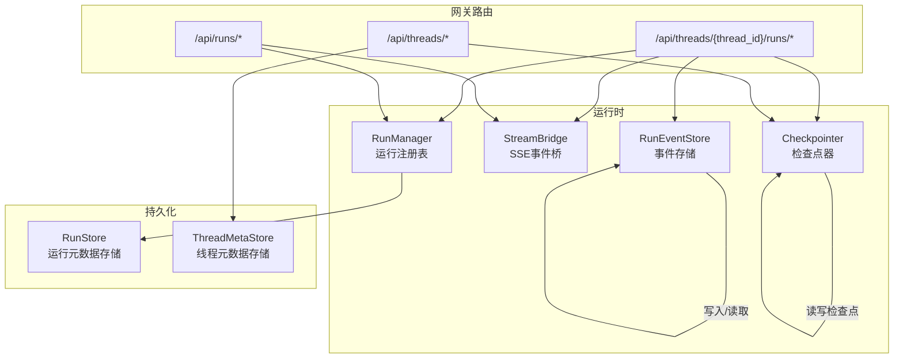
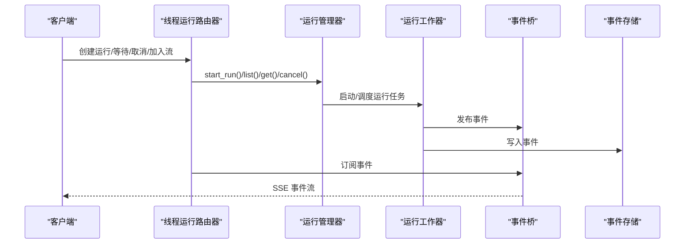
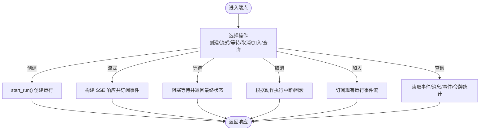
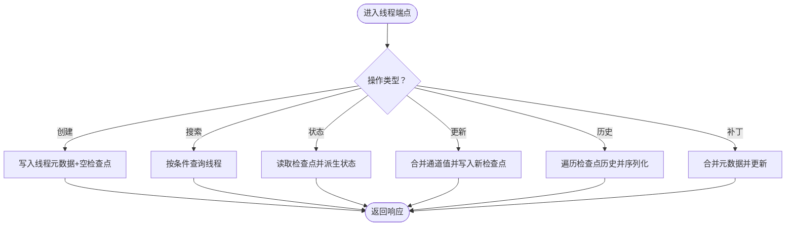
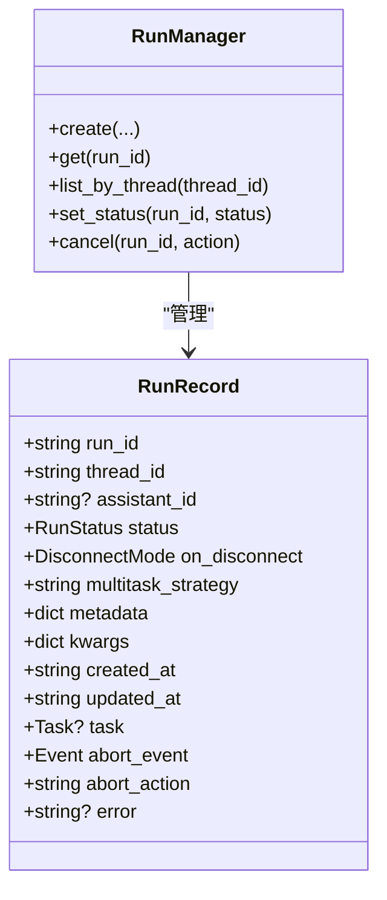
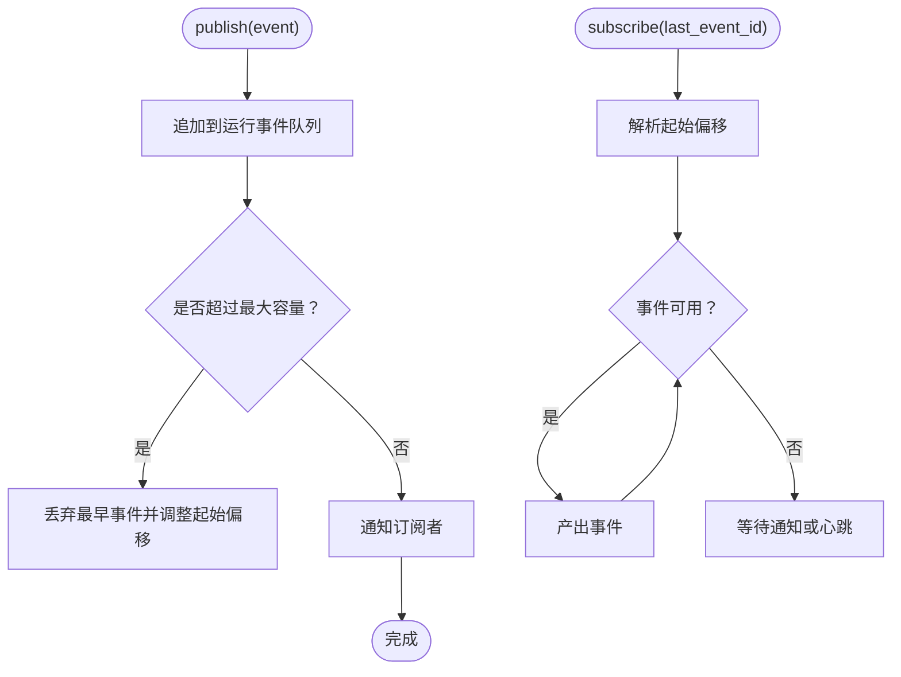
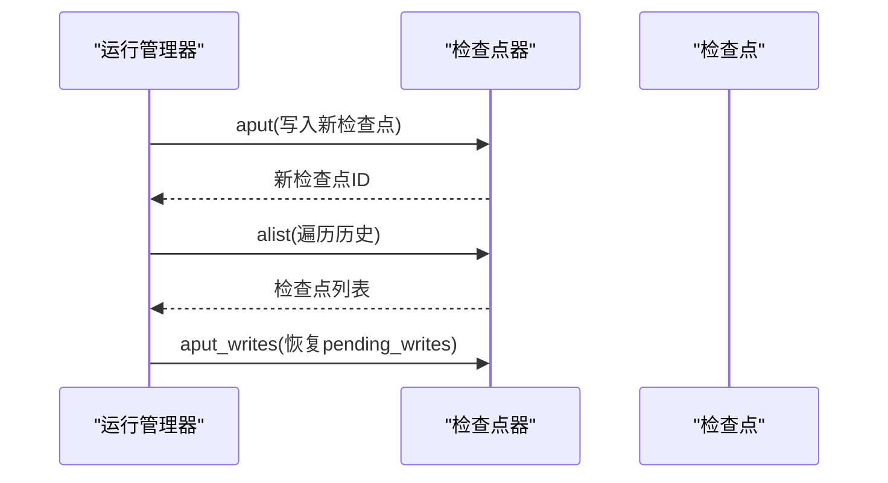
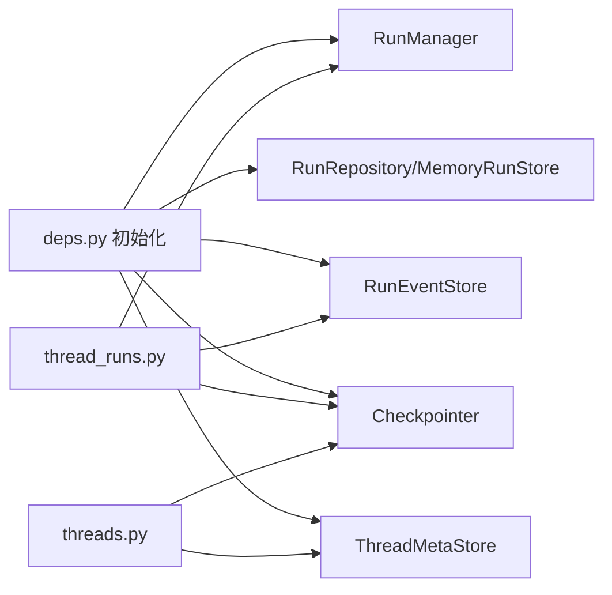

# 线程运行路由器

<cite>
**本文引用的文件**
- [thread_runs.py](file://backend/app/gateway/routers/thread_runs.py)
- [threads.py](file://backend/app/gateway/routers/threads.py)
- [runs.py](file://backend/app/gateway/routers/runs.py)
- [deps.py](file://backend/app/gateway/deps.py)
- [manager.py](file://backend/packages/harness/deerflow/runtime/runs/manager.py)
- [memory.py](file://backend/packages/harness/deerflow/runtime/stream_bridge/memory.py)
- [base.py](file://backend/packages/harness/deerflow/runtime/runs/store/base.py)
- [memory.py](file://backend/packages/harness/deerflow/runtime/runs/store/memory.py)
- [provider.py](file://backend/packages/harness/deerflow/runtime/checkpointer/provider.py)
- [checkpointer_config.py](file://backend/packages/harness/deerflow/config/checkpointer_config.py)
- [provider.py](file://backend/packages/harness/deerflow/runtime/store/provider.py)
- [worker.py](file://backend/packages/harness/deerflow/runtime/runs/worker.py)
- [test_run_manager.py](file://backend/tests/test_run_manager.py)
- [test_stream_bridge.py](file://backend/tests/test_stream_bridge.py)
- [test_run_worker_rollback.py](file://backend/tests/test_run_worker_rollback.py)
</cite>

## 目录
1. [简介](#简介)
2. [项目结构](#项目结构)
3. [核心组件](#核心组件)
4. [架构总览](#架构总览)
5. [详细组件分析](#详细组件分析)
6. [依赖分析](#依赖分析)
7. [性能考虑](#性能考虑)
8. [故障排查指南](#故障排查指南)
9. [结论](#结论)
10. [附录](#附录)

## 简介
本技术文档围绕“线程运行路由器”展开，系统性阐述基于 FastAPI 的线程运行管理 API 实现机制，包括：
- 运行生命周期管理：创建、等待、取消、加入流等
- 历史记录查询与过滤：线程历史、消息与事件分页
- 实时更新与事件监听：基于 SSE 的事件桥接与订阅
- 与 LangGraph 服务器的状态同步：检查点（checkpoint）与状态派生
- 运行数据持久化策略：运行元数据、事件存储、检查点后端
- 性能监控与错误恢复：并发策略、回滚、心跳与缓冲区管理
- 最佳实践：配置、安全与扩展建议

## 项目结构
线程运行路由器位于后端网关层，通过依赖注入获取运行管理器、事件存储、检查点器等服务，并以 LangGraph 平台兼容协议对外提供接口。

图表来源
- [thread_runs.py:116-297](file://backend/app/gateway/routers/thread_runs.py#L116-L297)
- [threads.py:224-458](file://backend/app/gateway/routers/threads.py#L224-L458)
- [runs.py:35-88](file://backend/app/gateway/routers/runs.py#L35-L88)
- [deps.py:69-102](file://backend/app/gateway/deps.py#L69-L102)

章节来源
- [thread_runs.py:116-297](file://backend/app/gateway/routers/thread_runs.py#L116-L297)
- [threads.py:224-458](file://backend/app/gateway/routers/threads.py#L224-L458)
- [runs.py:35-88](file://backend/app/gateway/routers/runs.py#L35-L88)
- [deps.py:69-102](file://backend/app/gateway/deps.py#L69-L102)

## 核心组件
- 线程运行路由器：提供运行创建、等待、取消、加入流、消息与事件查询等端点，统一返回 LangGraph 兼容格式。
- 线程路由器：提供线程创建、状态查询、历史查询、状态更新等端点，结合检查点推导线程状态。
- 运行管理器（RunManager）：在内存中维护运行记录，支持并发策略、状态变更与持久化。
- 事件桥（StreamBridge）：在内存中缓存事件，支持按 last_event_id 恢复、心跳保活与溢出回收。
- 事件存储（RunEventStore）：按线程/运行维度存储事件，支持分页与游标查询。
- 检查点器（Checkpointer）：LangGraph 检查点后端，用于状态快照、历史遍历与回滚。
- 线程元数据存储（ThreadMetaStore）：线程元信息与显示名等，支撑搜索与状态派生。

章节来源
- [thread_runs.py:97-108](file://backend/app/gateway/routers/thread_runs.py#L97-L108)
- [threads.py:166-182](file://backend/app/gateway/routers/threads.py#L166-L182)
- [manager.py:41-196](file://backend/packages/harness/deerflow/runtime/runs/manager.py#L41-L196)
- [memory.py:45-133](file://backend/packages/harness/deerflow/runtime/stream_bridge/memory.py#L45-L133)
- [base.py:17-57](file://backend/packages/harness/deerflow/runtime/runs/store/base.py#L17-L57)
- [provider.py:125-152](file://backend/packages/harness/deerflow/runtime/checkpointer/provider.py#L125-L152)

## 架构总览
下图展示从请求到运行执行、事件发布与客户端订阅的完整链路。

图表来源
- [thread_runs.py:116-297](file://backend/app/gateway/routers/thread_runs.py#L116-L297)
- [manager.py:41-196](file://backend/packages/harness/deerflow/runtime/runs/manager.py#L41-L196)
- [memory.py:45-133](file://backend/packages/harness/deerflow/runtime/stream_bridge/memory.py#L45-L133)

## 详细组件分析

### 线程运行路由器（/api/threads/{thread_id}/runs）
- 运行创建：立即返回运行记录，兼容 LangGraph 平台响应模型。
- 流式运行：通过 SSE 返回事件流，设置 Content-Location 便于 SDK 定位资源。
- 等待完成：阻塞直到运行结束，返回最终状态或错误。
- 列表与详情：按线程列出运行、按运行 ID 获取详情。
- 取消运行：支持中断与回滚两种动作，可选择等待完成或立即返回。
- 加入现有运行：支持 GET/POST，POST 可先取消再流式输出剩余事件。
- 消息与事件：按线程聚合显示消息，按运行分页查询消息与事件；支持反馈附加。
- 令牌用量：按线程聚合统计输入/输出/总令牌用量与模型/调用方拆分。

图表来源
- [thread_runs.py:116-297](file://backend/app/gateway/routers/thread_runs.py#L116-L297)
- [thread_runs.py:305-398](file://backend/app/gateway/routers/thread_runs.py#L305-L398)

章节来源
- [thread_runs.py:116-297](file://backend/app/gateway/routers/thread_runs.py#L116-L297)
- [thread_runs.py:305-398](file://backend/app/gateway/routers/thread_runs.py#L305-L398)

### 线程路由器（/api/threads）
- 线程创建：写入线程元数据与空检查点，幂等处理已存在线程。
- 线程搜索：支持按元数据、状态、分页查询。
- 线程状态：从检查点派生准确状态（错误、中断、空闲），序列化通道值。
- 状态更新：合并通道值生成新检查点，同步标题至元数据存储。
- 历史查询：遍历检查点历史，序列化消息仅在最新条目携带。
- 元数据补丁：合并元数据并刷新更新时间。

图表来源
- [threads.py:224-458](file://backend/app/gateway/routers/threads.py#L224-L458)
- [threads.py:551-622](file://backend/app/gateway/routers/threads.py#L551-L622)

章节来源
- [threads.py:224-458](file://backend/app/gateway/routers/threads.py#L224-L458)
- [threads.py:551-622](file://backend/app/gateway/routers/threads.py#L551-L622)

### Stateless 运行路由器（/api/runs）
- 无状态运行：自动创建临时线程或复用传入 thread_id，保持对话历史连续。
- 流式与等待：与有状态版本一致的 SSE 行为与最终状态返回。

章节来源
- [runs.py:35-88](file://backend/app/gateway/routers/runs.py#L35-L88)

### 运行管理器（RunManager）
- 运行记录：包含运行 ID、线程 ID、状态、元数据、参数、创建/更新时间、任务句柄与取消事件。
- 生命周期：创建、状态变更、并发策略（拒绝/中断/回滚）、冲突检测。
- 持久化：可选 RunStore 后端，支持用户隔离与重启后历史保留。

图表来源
- [manager.py:21-39](file://backend/packages/harness/deerflow/runtime/runs/manager.py#L21-L39)
- [manager.py:41-196](file://backend/packages/harness/deerflow/runtime/runs/manager.py#L41-L196)

章节来源
- [manager.py:41-196](file://backend/packages/harness/deerflow/runtime/runs/manager.py#L41-L196)
- [test_run_manager.py:12-51](file://backend/tests/test_run_manager.py#L12-L51)

### 事件桥（StreamBridge）
- 缓冲与索引：按运行 ID 维护事件队列，分配单调递增事件 ID（时间戳-序号）。
- 订阅与恢复：支持 last_event_id 恢复、落后重置、心跳保活。
- 清理：支持延迟清理，避免内存无限增长。

图表来源
- [memory.py:45-133](file://backend/packages/harness/deerflow/runtime/stream_bridge/memory.py#L45-L133)
- [test_stream_bridge.py:96-225](file://backend/tests/test_stream_bridge.py#L96-L225)

章节来源
- [memory.py:45-133](file://backend/packages/harness/deerflow/runtime/stream_bridge/memory.py#L45-L133)
- [test_stream_bridge.py:96-225](file://backend/tests/test_stream_bridge.py#L96-L225)

### 事件存储（RunEventStore）
- 抽象接口：定义 put/list_by_run/list_messages/list_events 等方法。
- 内存实现：线程安全的内存存储，适合开发与测试场景。

章节来源
- [base.py:17-57](file://backend/packages/harness/deerflow/runtime/runs/store/base.py#L17-L57)
- [memory.py:14-48](file://backend/packages/harness/deerflow/runtime/runs/store/memory.py#L14-L48)

### 检查点器（Checkpointer）
- 配置加载：支持 sqlite/postgres/memory 等后端，未配置时使用内存后端。
- 运行历史：通过 alist 遍历检查点，序列化消息仅在最新条目携带。
- 回滚恢复：根据预运行检查点与 pending_writes 执行恢复写入。

图表来源
- [provider.py:125-152](file://backend/packages/harness/deerflow/runtime/checkpointer/provider.py#L125-L152)
- [worker.py:444-493](file://backend/packages/harness/deerflow/runtime/runs/worker.py#L444-L493)
- [test_run_worker_rollback.py:147-271](file://backend/tests/test_run_worker_rollback.py#L147-L271)

章节来源
- [provider.py:125-152](file://backend/packages/harness/deerflow/runtime/checkpointer/provider.py#L125-L152)
- [worker.py:444-493](file://backend/packages/harness/deerflow/runtime/runs/worker.py#L444-L493)
- [test_run_worker_rollback.py:147-271](file://backend/tests/test_run_worker_rollback.py#L147-L271)

### 线程元数据存储（ThreadMetaStore）
- 线程搜索：支持元数据精确匹配、状态过滤、分页。
- 状态派生：从检查点派生线程状态（错误、中断、空闲）。
- 历史序列化：仅在最新检查点携带消息，避免重复。

章节来源
- [threads.py:289-319](file://backend/app/gateway/routers/threads.py#L289-L319)
- [threads.py:360-405](file://backend/app/gateway/routers/threads.py#L360-L405)
- [threads.py:551-622](file://backend/app/gateway/routers/threads.py#L551-L622)

## 依赖分析
- 路由器依赖注入：运行管理器、事件存储、检查点器、运行仓库、反馈仓库等通过依赖工厂在应用生命周期初始化。
- 运行管理器与运行仓库：RunManager 在内存中维护运行记录，可选 RunRepository 作为持久化后端。
- 检查点器与存储：检查点器后端可配置为 sqlite/postgres/memory；存储后端同理。
- 事件桥：独立于运行管理器，负责事件缓存与订阅。

图表来源
- [deps.py:69-102](file://backend/app/gateway/deps.py#L69-L102)
- [thread_runs.py:116-297](file://backend/app/gateway/routers/thread_runs.py#L116-L297)
- [threads.py:224-458](file://backend/app/gateway/routers/threads.py#L224-L458)

章节来源
- [deps.py:69-102](file://backend/app/gateway/deps.py#L69-L102)

## 性能考虑
- SSE 缓冲与心跳：事件桥支持心跳保活与落后重置，避免长时间无事件导致连接断开。
- 历史截断：当缓冲区满时丢弃最早事件并调整起始偏移，确保内存占用可控。
- 分页查询：消息与事件查询支持 limit 与游标参数，降低单次响应体积。
- 并发策略：多任务策略（拒绝/中断/回滚）控制同一线程并发运行数量，减少资源竞争。
- 检查点遍历：历史查询仅在最新检查点携带消息，避免重复序列化。

章节来源
- [memory.py:45-133](file://backend/packages/harness/deerflow/runtime/stream_bridge/memory.py#L45-L133)
- [thread_runs.py:305-398](file://backend/app/gateway/routers/thread_runs.py#L305-L398)
- [manager.py:187-196](file://backend/packages/harness/deerflow/runtime/runs/manager.py#L187-L196)

## 故障排查指南
- 运行不可取消：若运行状态不支持取消，返回 409 冲突；确认运行状态与动作参数。
- 取消后等待：wait=true 时需等待任务完成，期间可能阻塞；wait=false 立即返回 202。
- 事件恢复失败：last_event_id 不存在时会回退到最早可恢复位置；检查客户端 last_event_id 是否正确传递。
- 回滚异常：回滚需要有效的预运行检查点与 pending_writes 结构；检查点 ID 缺失或 pending_writes 非法会导致错误。
- 线程状态异常：若检查点为空但线程元数据存在，状态派生逻辑会回退到空闲；确认检查点后端是否正常。

章节来源
- [thread_runs.py:198-233](file://backend/app/gateway/routers/thread_runs.py#L198-L233)
- [memory.py:45-133](file://backend/packages/harness/deerflow/runtime/stream_bridge/memory.py#L45-L133)
- [worker.py:444-493](file://backend/packages/harness/deerflow/runtime/runs/worker.py#L444-L493)
- [threads.py:360-405](file://backend/app/gateway/routers/threads.py#L360-L405)

## 结论
线程运行路由器通过清晰的端点设计与完善的运行生命周期管理，实现了与 LangGraph 平台的兼容与扩展。结合事件桥的高效缓存与订阅机制、检查点器的历史遍历能力，以及可配置的持久化后端，系统在实时性、可扩展性与可靠性方面具备良好表现。建议在生产环境中启用持久化后端与合理的并发策略，并关注事件恢复与回滚的健壮性。

## 附录
- 最佳实践
  - 使用持久化检查点器与运行仓库，确保运行历史与线程状态在重启后可恢复。
  - 配置合适的 SSE 心跳间隔与缓冲大小，平衡实时性与内存占用。
  - 对同一线程采用合理的并发策略，避免资源争用与状态混乱。
  - 在取消运行时明确 action 与 wait 参数，确保前端交互体验一致。
  - 对历史查询与消息分页设置合理 limit 与游标，提升查询性能。
- 关键路径参考
  - 运行创建与流式：[thread_runs.py:116-149](file://backend/app/gateway/routers/thread_runs.py#L116-L149)
  - 等待完成与最终状态：[thread_runs.py:152-175](file://backend/app/gateway/routers/thread_runs.py#L152-L175)
  - 取消运行与回滚：[thread_runs.py:198-233](file://backend/app/gateway/routers/thread_runs.py#L198-L233)
  - 加入现有运行与停止按钮：[thread_runs.py:236-297](file://backend/app/gateway/routers/thread_runs.py#L236-L297)
  - 线程状态派生与历史：[threads.py:360-405](file://backend/app/gateway/routers/threads.py#L360-L405), [threads.py:551-622](file://backend/app/gateway/routers/threads.py#L551-L622)
  - 事件桥订阅与恢复：[memory.py:85-124](file://backend/packages/harness/deerflow/runtime/stream_bridge/memory.py#L85-L124)
  - 检查点回滚恢复：[worker.py:444-493](file://backend/packages/harness/deerflow/runtime/runs/worker.py#L444-L493)