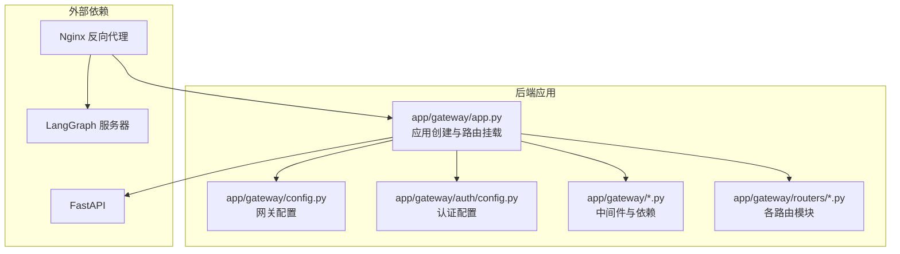
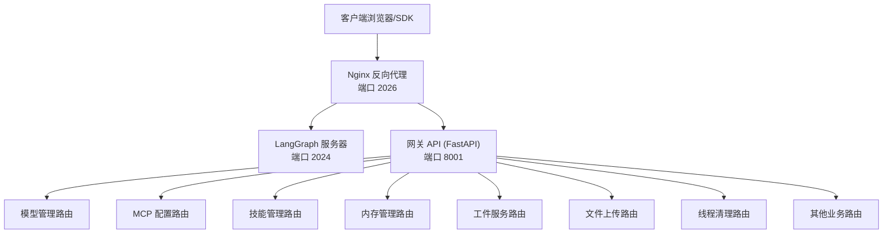
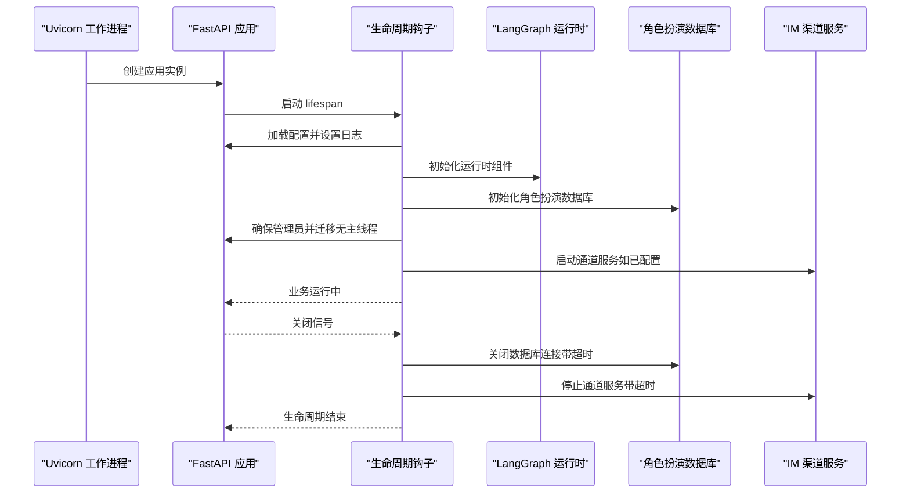
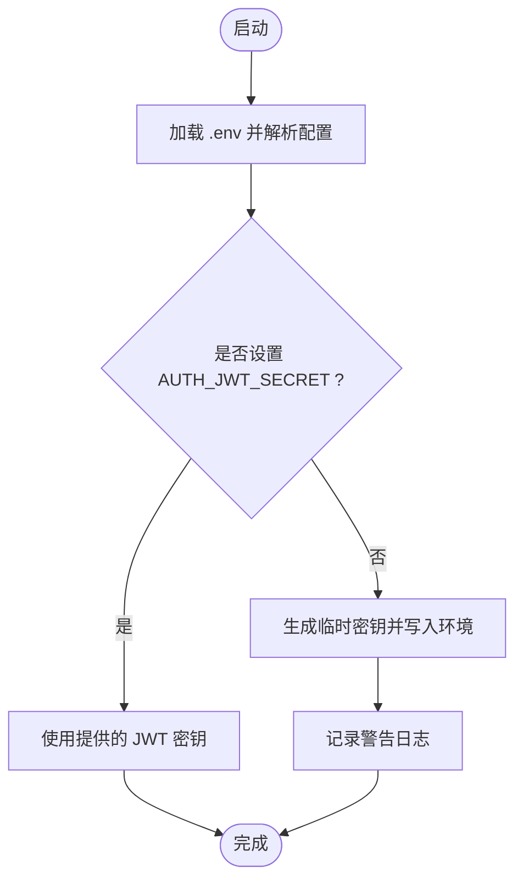
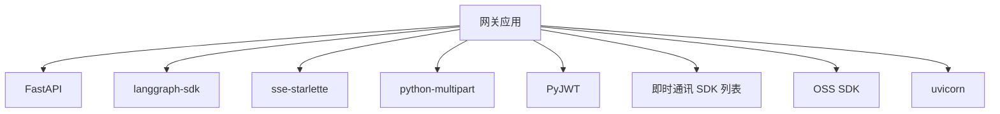

# 网关 API

<cite>
**本文引用的文件**
- [backend/pyproject.toml](file://backend/pyproject.toml)
- [backend/README.md](file://backend/README.md)
- [backend/app/gateway/app.py](file://backend/app/gateway/app.py)
- [backend/app/gateway/config.py](file://backend/app/gateway/config.py)
- [backend/app/gateway/auth/config.py](file://backend/app/gateway/auth/config.py)
</cite>

## 目录
1. [简介](#简介)
2. [项目结构](#项目结构)
3. [核心组件](#核心组件)
4. [架构总览](#架构总览)
5. [详细组件分析](#详细组件分析)
6. [依赖关系分析](#依赖关系分析)
7. [性能考量](#性能考量)
8. [故障排查指南](#故障排查指南)
9. [结论](#结论)
10. [附录](#附录)

## 简介
本技术文档面向“网关 API”系统，聚焦于基于 FastAPI 的后端服务在 DeerFlow 生态中的角色与实现。该网关负责：
- 模型管理（查询可用模型）
- MCP 配置（管理 Model Context Protocol 服务器）
- 技能管理（查询与启用/禁用技能）
- 文件上传与附件管理
- 线程本地数据清理
- 工件服务（访问线程生成的产物）
- 建议生成（对话建议）
- 与 LangGraph 服务器通过 Nginx 反向代理协作
- 认证与授权中间件集成
- 请求日志与跨域支持

网关通过统一的生命周期钩子完成配置加载、LangGraph 运行时初始化、通道服务启动与关闭等关键步骤，并在健康检查端点对外暴露运行状态。

## 项目结构
网关 API 所在的后端工程采用模块化组织，核心入口位于 FastAPI 应用创建与路由挂载处；认证与配置相关模块分别独立管理。

图表来源
- [backend/app/gateway/app.py:248-431](file://backend/app/gateway/app.py#L248-L431)
- [backend/app/gateway/config.py:18-30](file://backend/app/gateway/config.py#L18-L30)
- [backend/app/gateway/auth/config.py:33-58](file://backend/app/gateway/auth/config.py#L33-L58)

章节来源
- [backend/README.md:113-131](file://backend/README.md#L113-L131)
- [backend/app/gateway/app.py:353-416](file://backend/app/gateway/app.py#L353-L416)

## 核心组件
- 应用工厂与生命周期：负责加载配置、初始化 LangGraph 运行时、角色扮演数据库、通道服务，并在关闭时进行资源回收。
- 路由器集合：按功能域划分，包括模型、MCP、内存、技能、工件、上传、线程、代理、建议、IM 渠道、兼容性接口、认证、反馈、运行生命周期、角色扮演、对象存储、语音识别与合成等。
- 中间件体系：CORS、请求响应日志、认证与 CSRF（通过中间件类实现）。
- 配置系统：网关运行参数（主机、端口、CORS、文档开关），认证密钥与过期策略，以及从环境变量解析的配置加载逻辑。

章节来源
- [backend/app/gateway/app.py:166-246](file://backend/app/gateway/app.py#L166-L246)
- [backend/app/gateway/app.py:353-416](file://backend/app/gateway/app.py#L353-L416)
- [backend/app/gateway/config.py:6-30](file://backend/app/gateway/config.py#L6-L30)
- [backend/app/gateway/auth/config.py:12-58](file://backend/app/gateway/auth/config.py#L12-L58)

## 架构总览
网关 API 作为 FastAPI 服务运行在独立端口，与 LangGraph 服务器通过 Nginx 统一反向代理分发：
- `/api/langgraph/*` → LangGraph 服务器（处理线程、流式输出等）
- `/api/*`（其他）→ 网关 API（提供模型、MCP、技能、内存、工件、上传、线程清理等）

图表来源
- [backend/README.md:37-41](file://backend/README.md#L37-L41)
- [backend/app/gateway/app.py:353-416](file://backend/app/gateway/app.py#L353-L416)

## 详细组件分析

### 应用工厂与生命周期
- 生命周期钩子负责：
  - 加载应用配置并设置日志级别
  - 初始化 LangGraph 运行时组件（流桥接、运行管理器、检查点、存储）
  - 角色扮演数据库初始化或检测
  - 确保管理员用户存在并迁移无主线程元数据
  - 启动 IM 渠道服务（可选）
  - 关闭阶段回收角色扮演数据库连接与通道服务，带超时保护
- 健康检查端点返回服务状态信息

图表来源
- [backend/app/gateway/app.py:166-246](file://backend/app/gateway/app.py#L166-L246)

章节来源
- [backend/app/gateway/app.py:248-431](file://backend/app/gateway/app.py#L248-L431)

### 路由组织与职责
网关将不同领域的 API 路由挂载到统一前缀下，便于前端与 SDK 使用。以下为关键路由与职责概览（具体实现位于对应路由器文件中）：

- 模型管理：列出可用模型、查询模型配置
- MCP 配置：读取与更新 MCP 服务器配置
- 内存管理：读取全局记忆数据、强制重载、获取配置与状态
- 技能管理：查询技能列表、启用/禁用技能、安装技能包
- 工件服务：按路径读取线程生成的工件文件
- 文件上传：为指定线程上传文件（自动转换 PDF/PPT/Excel/Word 为 Markdown，拒绝目录路径，自动重命名重复文件名）
- 线程清理：删除 DeerFlow 管理的本地线程数据（LangGraph 线程删除后）
- 代理与运行：创建与管理自定义代理；LangGraph 平台兼容的运行生命周期（创建、流式、取消）
- 建议生成：为对话生成后续问题建议
- IM 渠道：对接飞书、Slack、Telegram 等渠道
- 认证与反馈：登录/登出、注册、权限校验、运行反馈
- 其他：语音识别（ASR）、语音合成（TTS）、对象存储（OSS）等

章节来源
- [backend/README.md:117-131](file://backend/README.md#L117-L131)
- [backend/app/gateway/app.py:353-416](file://backend/app/gateway/app.py#L353-L416)

### 认证与授权
- 认证配置包含 JWT 密钥、过期天数、GitHub OAuth 客户端凭据等字段。
- JWT 密钥若未显式设置，将自动生成临时密钥并在日志中给出警告，生产环境需显式配置。
- 认证中间件在所有路由之后添加，确保对所有端点生效。

图表来源
- [backend/app/gateway/auth/config.py:33-58](file://backend/app/gateway/auth/config.py#L33-L58)

章节来源
- [backend/app/gateway/auth/config.py:12-58](file://backend/app/gateway/auth/config.py#L12-L58)
- [backend/app/gateway/app.py:349-351](file://backend/app/gateway/app.py#L349-L351)

### 错误处理策略
- 配置加载失败：在启动阶段捕获异常并抛出运行时错误，避免静默失败。
- 线程迁移失败：非致命错误，记录异常日志并继续启动。
- 数据库关闭与通道服务停止：均设置超时上限，防止工作进程被长时间阻塞。
- 未预期的线程删除失败：记录服务端日志并返回通用 500 错误详情。

章节来源
- [backend/app/gateway/app.py:170-179](file://backend/app/gateway/app.py#L170-L179)
- [backend/app/gateway/app.py:121-127](file://backend/app/gateway/app.py#L121-L127)
- [backend/app/gateway/app.py:212-227](file://backend/app/gateway/app.py#L212-L227)
- [backend/app/gateway/app.py:229-243](file://backend/app/gateway/app.py#L229-L243)
- [backend/README.md:129](file://backend/README.md#L129)

### 与 LangGraph 服务器的协作
- Nginx 将 `/api/langgraph/*` 路径转发至 LangGraph 服务器（端口 2024），用于处理线程、流式输出与运行生命周期。
- 网关负责 `/api/*` 路径下的模型、MCP、技能、内存、工件、上传、线程清理等自定义能力。
- 健康检查端点 `/health` 返回网关自身健康状态，便于统一监控。

章节来源
- [backend/README.md:37-41](file://backend/README.md#L37-L41)
- [backend/app/gateway/app.py:417-425](file://backend/app/gateway/app.py#L417-L425)

## 依赖关系分析
- 运行时依赖：FastAPI、langgraph-sdk、sentry（通过 deerflow-harness 间接引入）、各种即时通讯 SDK、对象存储 SDK、JWT、多部分表单处理、SSE 支持等。
- 开发依赖：pytest、pytest-asyncio、ruff 等。
- 工作区：通过 uv 工作区成员管理 deerflow-harness 包。

图表来源
- [backend/pyproject.toml:7-26](file://backend/pyproject.toml#L7-L26)

章节来源
- [backend/pyproject.toml:1-52](file://backend/pyproject.toml#L1-L52)

## 性能考量
- 生命周期钩子在关闭阶段设置了严格的超时上限，避免长时间阻塞导致工作进程无法退出。
- 分页游标遍历 LangGraph 存储中的无主线程项，确保大规模数据也能完整迁移。
- CORS 与日志中间件在请求链路中保持低开销，适合生产部署。
- 建议在高并发场景下结合 Nginx 限流与上游缓存策略进一步优化。

章节来源
- [backend/app/gateway/app.py:51-54](file://backend/app/gateway/app.py#L51-L54)
- [backend/app/gateway/app.py:129-147](file://backend/app/gateway/app.py#L129-L147)
- [backend/app/gateway/app.py:337-344](file://backend/app/gateway/app.py#L337-L344)

## 故障排查指南
- 启动失败（配置加载）：检查配置加载日志与异常堆栈，确认必要环境变量是否正确设置。
- 线程迁移失败：关注迁移过程中的异常日志，确认 LangGraph 存储可用且具备相应命名空间。
- 数据库关闭超时：查看角色扮演数据库关闭阶段的日志，适当调整超时阈值或优化关闭流程。
- 通道服务停止超时：确认通道服务的停止逻辑与外部依赖状态，必要时增加日志定位。
- 线程清理返回 500：确认 LangGraph 线程删除顺序与网关清理调用时机，记录服务端日志以定位原因。

章节来源
- [backend/app/gateway/app.py:170-179](file://backend/app/gateway/app.py#L170-L179)
- [backend/app/gateway/app.py:121-127](file://backend/app/gateway/app.py#L121-L127)
- [backend/app/gateway/app.py:212-227](file://backend/app/gateway/app.py#L212-L227)
- [backend/app/gateway/app.py:229-243](file://backend/app/gateway/app.py#L229-L243)
- [backend/README.md:129](file://backend/README.md#L129)

## 结论
网关 API 通过清晰的路由分层、完善的生命周期管理与中间件体系，为前端与 SDK 提供了稳定、可扩展的 REST 接口。其与 LangGraph 服务器通过 Nginx 协同工作，形成“线程与流式交互（LangGraph）+ 管理与工具能力（网关）”的完整架构。生产部署中应重点关注认证密钥管理、配置加载与资源回收的健壮性，并结合监控与日志持续优化性能与稳定性。

## 附录
- 快速开始与运行命令参考见后端 README。
- 环境变量与配置键参考见后端 README 的“配置”与“环境变量”章节。
- API 使用示例与集成指南请结合各路由模块的实现与前端 SDK 文档进行实践。

章节来源
- [backend/README.md:140-212](file://backend/README.md#L140-L212)
- [backend/README.md:255-356](file://backend/README.md#L255-L356)