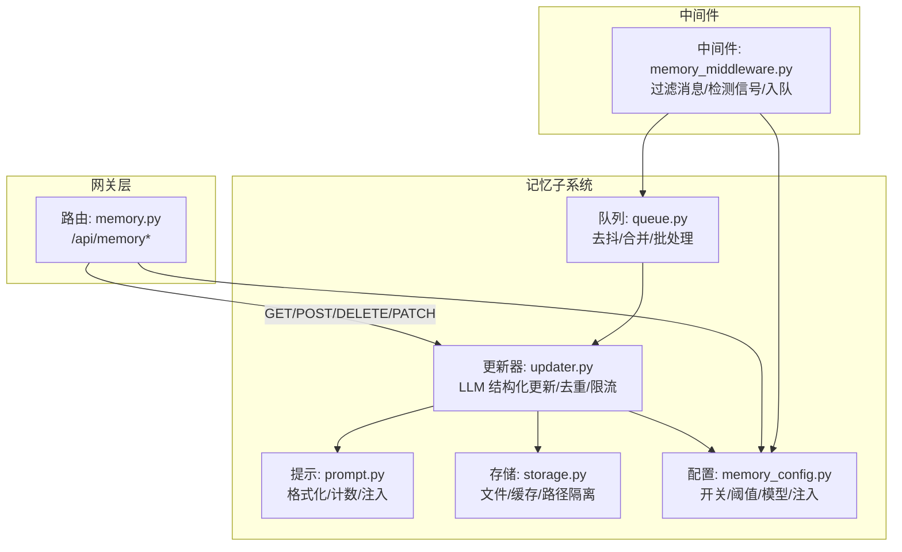
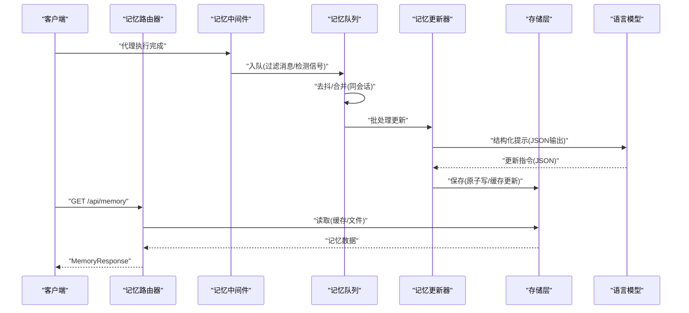
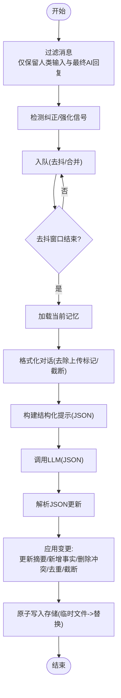
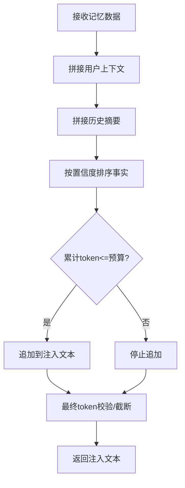
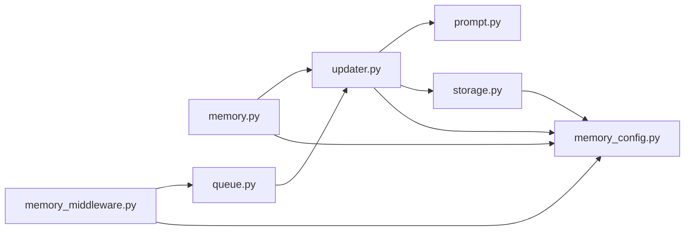

# 记忆路由器

<cite>
**本文引用的文件**
- [backend/app/gateway/routers/memory.py](file://backend/app/gateway/routers/memory.py)
- [backend/packages/harness/deerflow/agents/memory/updater.py](file://backend/packages/harness/deerflow/agents/memory/updater.py)
- [backend/packages/harness/deerflow/agents/memory/storage.py](file://backend/packages/harness/deerflow/agents/memory/storage.py)
- [backend/packages/harness/deerflow/agents/memory/queue.py](file://backend/packages/harness/deerflow/agents/memory/queue.py)
- [backend/packages/harness/deerflow/agents/memory/prompt.py](file://backend/packages/harness/deerflow/agents/memory/prompt.py)
- [backend/packages/harness/deerflow/agents/middlewares/memory_middleware.py](file://backend/packages/harness/deerflow/agents/middlewares/memory_middleware.py)
- [backend/packages/harness/deerflow/config/memory_config.py](file://backend/packages/harness/deerflow/config/memory_config.py)
- [backend/docs/MEMORY_IMPROVEMENTS.md](file://backend/docs/MEMORY_IMPROVEMENTS.md)
- [backend/docs/memory-settings-sample.json](file://backend/docs/memory-settings-sample.json)
- [backend/tests/test_memory_router.py](file://backend/tests/test_memory_router.py)
- [backend/tests/test_memory_queue.py](file://backend/tests/test_memory_queue.py)
</cite>

## 目录
1. [简介](#简介)
2. [项目结构](#项目结构)
3. [核心组件](#核心组件)
4. [架构总览](#架构总览)
5. [详细组件分析](#详细组件分析)
6. [依赖分析](#依赖分析)
7. [性能考量](#性能考量)
8. [故障排查指南](#故障排查指南)
9. [结论](#结论)
10. [附录](#附录)

## 简介
本文件面向“记忆路由器”，系统性阐述记忆数据访问 API 的实现机制、上下文提取与存储流程、记忆查询与注入优化策略，以及记忆生命周期管理、数据去重与隐私保护措施。同时给出与记忆系统的集成方式、缓存策略、性能优化建议，并提供最佳实践与配置指南。

## 项目结构
记忆路由器位于后端网关层，通过 FastAPI 路由暴露记忆 API；记忆更新由中间件在对话执行后异步触发，经队列聚合与去抖动，再由更新器调用 LLM 进行结构化总结与持久化。存储层支持文件型持久化并内置缓存，配置模块统一管理启用开关、模型、阈值与注入参数。

图示来源
- [backend/app/gateway/routers/memory.py:110-356](file://backend/app/gateway/routers/memory.py#L110-L356)
- [backend/packages/harness/deerflow/agents/middlewares/memory_middleware.py:28-111](file://backend/packages/harness/deerflow/agents/middlewares/memory_middleware.py#L28-L111)
- [backend/packages/harness/deerflow/agents/memory/queue.py:28-278](file://backend/packages/harness/deerflow/agents/memory/queue.py#L28-L278)
- [backend/packages/harness/deerflow/agents/memory/updater.py:276-612](file://backend/packages/harness/deerflow/agents/memory/updater.py#L276-L612)
- [backend/packages/harness/deerflow/agents/memory/prompt.py:201-364](file://backend/packages/harness/deerflow/agents/memory/prompt.py#L201-L364)
- [backend/packages/harness/deerflow/agents/memory/storage.py:43-232](file://backend/packages/harness/deerflow/agents/memory/storage.py#L43-L232)
- [backend/packages/harness/deerflow/config/memory_config.py:6-84](file://backend/packages/harness/deerflow/config/memory_config.py#L6-L84)

章节来源
- [backend/app/gateway/routers/memory.py:1-357](file://backend/app/gateway/routers/memory.py#L1-L357)
- [backend/packages/harness/deerflow/agents/middlewares/memory_middleware.py:1-111](file://backend/packages/harness/deerflow/agents/middlewares/memory_middleware.py#L1-L111)
- [backend/packages/harness/deerflow/agents/memory/queue.py:1-278](file://backend/packages/harness/deerflow/agents/memory/queue.py#L1-L278)
- [backend/packages/harness/deerflow/agents/memory/updater.py:1-612](file://backend/packages/harness/deerflow/agents/memory/updater.py#L1-L612)
- [backend/packages/harness/deerflow/agents/memory/prompt.py:1-364](file://backend/packages/harness/deerflow/agents/memory/prompt.py#L1-L364)
- [backend/packages/harness/deerflow/agents/memory/storage.py:1-232](file://backend/packages/harness/deerflow/agents/memory/storage.py#L1-L232)
- [backend/packages/harness/deerflow/config/memory_config.py:1-84](file://backend/packages/harness/deerflow/config/memory_config.py#L1-L84)

## 核心组件
- 路由器：提供记忆数据的读取、导入导出、事实增删改、状态查询与配置查询等接口，统一响应模型与错误映射。
- 中间件：在每次代理执行后，抽取用户输入与最终助手回复，检测纠正/强化信号，按会话去重合并，入队等待去抖处理。
- 队列：基于线程定时器的去抖机制，聚合同一会话的多次更新请求，避免频繁写入；支持立即刷新与后台非阻塞刷新。
- 更新器：加载当前记忆与对话，构造结构化提示，调用 LLM 生成 JSON 更新，应用变更（去重、截断、删除），持久化并返回结果。
- 存储：文件型存储，支持全局/按用户/按代理隔离路径，带内存缓存与 mtime 校验，原子写入与临时文件回退。
- 提示与注入：格式化记忆为系统提示注入文本，按置信度排序并受 token 预算限制；对话格式化时剔除上传标记。
- 配置：集中管理启用开关、存储类、去抖间隔、最大事实数、事实置信度阈值、是否注入、最大注入 token 数等。

章节来源
- [backend/app/gateway/routers/memory.py:110-356](file://backend/app/gateway/routers/memory.py#L110-L356)
- [backend/packages/harness/deerflow/agents/middlewares/memory_middleware.py:28-111](file://backend/packages/harness/deerflow/agents/middlewares/memory_middleware.py#L28-L111)
- [backend/packages/harness/deerflow/agents/memory/queue.py:28-278](file://backend/packages/harness/deerflow/agents/memory/queue.py#L28-L278)
- [backend/packages/harness/deerflow/agents/memory/updater.py:276-612](file://backend/packages/harness/deerflow/agents/memory/updater.py#L276-L612)
- [backend/packages/harness/deerflow/agents/memory/storage.py:43-232](file://backend/packages/harness/deerflow/agents/memory/storage.py#L43-L232)
- [backend/packages/harness/deerflow/agents/memory/prompt.py:201-364](file://backend/packages/harness/deerflow/agents/memory/prompt.py#L201-L364)
- [backend/packages/harness/deerflow/config/memory_config.py:6-84](file://backend/packages/harness/deerflow/config/memory_config.py#L6-L84)

## 架构总览
记忆系统采用“事件驱动 + 去抖 + 异步更新”的模式：中间件在代理执行后将对话片段入队，队列在去抖窗口结束后批量调用更新器；更新器通过 LLM 生成结构化更新，应用到内存并持久化；前端或网关通过路由读取最新记忆或进行手动维护。

图示来源
- [backend/packages/harness/deerflow/agents/middlewares/memory_middleware.py:52-111](file://backend/packages/harness/deerflow/agents/middlewares/memory_middleware.py#L52-L111)
- [backend/packages/harness/deerflow/agents/memory/queue.py:156-205](file://backend/packages/harness/deerflow/agents/memory/queue.py#L156-L205)
- [backend/packages/harness/deerflow/agents/memory/updater.py:369-500](file://backend/packages/harness/deerflow/agents/memory/updater.py#L369-L500)
- [backend/packages/harness/deerflow/agents/memory/storage.py:160-189](file://backend/packages/harness/deerflow/agents/memory/storage.py#L160-L189)
- [backend/app/gateway/routers/memory.py:110-153](file://backend/app/gateway/routers/memory.py#L110-L153)

## 详细组件分析

### 路由器与 API 定义
- GET /api/memory：返回当前全局记忆数据（用户上下文、历史、事实列表）。
- POST /api/memory/reload：强制从存储文件重新加载并返回最新数据。
- DELETE /api/memory：清空所有记忆并返回空结构。
- POST /api/memory/facts：创建单个事实（内容、分类、置信度）。
- DELETE /api/memory/facts/{fact_id}：按 id 删除事实。
- PATCH /api/memory/facts/{fact_id}：部分更新事实（保留未提供字段）。
- GET /api/memory/export：导出当前记忆为 JSON。
- POST /api/memory/import：从 JSON 导入并覆盖当前记忆。
- GET /api/memory/config：查询记忆系统配置。
- GET /api/memory/status：一次性返回配置与数据。

错误映射与响应模型：
- 创建/更新事实时，若置信度非法或内容为空，映射为 400 错误。
- 删除/更新事实不存在时，返回 404。
- 文件系统异常映射为 500。

章节来源
- [backend/app/gateway/routers/memory.py:110-356](file://backend/app/gateway/routers/memory.py#L110-L356)
- [backend/tests/test_memory_router.py:1-306](file://backend/tests/test_memory_router.py#L1-L306)

### 上下文提取与存储流程
- 中间件在代理执行后，从状态中提取 messages，过滤仅保留人类输入与最终 AI 回复，检测纠正/强化信号，捕获有效 thread_id 与 user_id，入队等待去抖。
- 队列对同一 thread_id 的多次更新进行合并，保留纠正/强化信号的最大值；去抖结束后批量交给更新器。
- 更新器加载当前记忆，格式化对话，构建结构化提示，调用 LLM 生成 JSON 更新；解析后应用变更（更新摘要、新增事实、删除冲突事实、去重、按置信度截断至上限）。
- 存储层原子写入，先写临时文件再替换，失败不污染缓存；缓存以 (user_id, agent_name) 为键，结合文件 mtime 校验一致性。

图示来源
- [backend/packages/harness/deerflow/agents/middlewares/memory_middleware.py:82-111](file://backend/packages/harness/deerflow/agents/middlewares/memory_middleware.py#L82-L111)
- [backend/packages/harness/deerflow/agents/memory/queue.py:108-205](file://backend/packages/harness/deerflow/agents/memory/queue.py#L108-L205)
- [backend/packages/harness/deerflow/agents/memory/updater.py:318-587](file://backend/packages/harness/deerflow/agents/memory/updater.py#L318-L587)
- [backend/packages/harness/deerflow/agents/memory/storage.py:160-189](file://backend/packages/harness/deerflow/agents/memory/storage.py#L160-L189)

章节来源
- [backend/packages/harness/deerflow/agents/middlewares/memory_middleware.py:1-111](file://backend/packages/harness/deerflow/agents/middlewares/memory_middleware.py#L1-L111)
- [backend/packages/harness/deerflow/agents/memory/queue.py:1-278](file://backend/packages/harness/deerflow/agents/memory/queue.py#L1-L278)
- [backend/packages/harness/deerflow/agents/memory/updater.py:1-612](file://backend/packages/harness/deerflow/agents/memory/updater.py#L1-L612)
- [backend/packages/harness/deerflow/agents/memory/storage.py:1-232](file://backend/packages/harness/deerflow/agents/memory/storage.py#L1-L232)

### 记忆查询与注入优化
- 注入策略：按用户上下文、历史、事实三段落格式化；事实按置信度降序，累计 token 数不超过预算；若超出则截断。
- 计数精度：优先使用 tiktoken（cl100k_base），不可用时采用字符估算；最终再次校验长度确保安全。
- 当前实现已包含事实注入、置信度排序与预算控制；计划引入 TF-IDF 相似度与上下文感知评分。

图示来源
- [backend/packages/harness/deerflow/agents/memory/prompt.py:201-318](file://backend/packages/harness/deerflow/agents/memory/prompt.py#L201-L318)
- [backend/docs/MEMORY_IMPROVEMENTS.md:19-66](file://backend/docs/MEMORY_IMPROVEMENTS.md#L19-L66)

章节来源
- [backend/packages/harness/deerflow/agents/memory/prompt.py:1-364](file://backend/packages/harness/deerflow/agents/memory/prompt.py#L1-L364)
- [backend/docs/MEMORY_IMPROVEMENTS.md:1-66](file://backend/docs/MEMORY_IMPROVEMENTS.md#L1-L66)

### 生命周期管理、去重与隐私保护
- 生命周期：事实创建时生成唯一 id，记录创建时间与来源；更新时可部分修改；删除按 id 清理。
- 去重：新增事实时，按规范化后的内容大小写无关键去重，避免重复；同时按置信度阈值过滤。
- 隐私保护：自动清理对话中上传文件标记与路径信息，防止会话级临时信息进入长期记忆；支持手动导入/导出备份与迁移。

章节来源
- [backend/packages/harness/deerflow/agents/memory/updater.py:96-191](file://backend/packages/harness/deerflow/agents/memory/updater.py#L96-L191)
- [backend/packages/harness/deerflow/agents/memory/updater.py:244-264](file://backend/packages/harness/deerflow/agents/memory/updater.py#L244-L264)
- [backend/packages/harness/deerflow/agents/memory/prompt.py:320-364](file://backend/packages/harness/deerflow/agents/memory/prompt.py#L320-L364)

### 集成方式与缓存策略
- 集成：在代理执行后挂载记忆中间件，自动过滤消息、检测信号并入队；也可通过网关路由直接读写记忆。
- 缓存：存储层对每个 (user_id, agent_name) 维护内存缓存，键为文件 mtime；首次加载失败自动回退为空记忆；写入成功后更新缓存。
- 并发：写入采用临时文件 + 原子替换，避免并发读取到半成品；读取时进行 mtime 校验。

章节来源
- [backend/packages/harness/deerflow/agents/middlewares/memory_middleware.py:1-111](file://backend/packages/harness/deerflow/agents/middlewares/memory_middleware.py#L1-L111)
- [backend/packages/harness/deerflow/agents/memory/storage.py:62-190](file://backend/packages/harness/deerflow/agents/memory/storage.py#L62-L190)

### 性能优化
- 去抖与批处理：通过队列减少频繁写入，降低 I/O 峰值。
- 同步调用与线程池：在异步环境中使用线程池执行同步 LLM 调用，避免跨事件循环连接复用问题。
- 写入原子化：临时文件写入 + replace，保证一致性与可恢复性。
- 注入预算控制：提前按置信度排序与增量计数，避免超预算导致的额外开销。

章节来源
- [backend/packages/harness/deerflow/agents/memory/queue.py:136-205](file://backend/packages/harness/deerflow/agents/memory/queue.py#L136-L205)
- [backend/packages/harness/deerflow/agents/memory/updater.py:29-38](file://backend/packages/harness/deerflow/agents/memory/updater.py#L29-L38)
- [backend/packages/harness/deerflow/agents/memory/storage.py:160-189](file://backend/packages/harness/deerflow/agents/memory/storage.py#L160-L189)
- [backend/packages/harness/deerflow/agents/memory/prompt.py:163-183](file://backend/packages/harness/deerflow/agents/memory/prompt.py#L163-L183)

## 依赖分析
- 路由器依赖更新器与配置模块；更新器依赖提示格式化、存储与配置；中间件依赖队列与消息过滤；存储依赖配置与路径工具。
- 潜在耦合点：更新器与存储之间为强耦合（保存/加载），但通过抽象接口隔离；配置为全局单例，便于统一管理。

图示来源
- [backend/app/gateway/routers/memory.py:1-357](file://backend/app/gateway/routers/memory.py#L1-L357)
- [backend/packages/harness/deerflow/agents/memory/updater.py:1-612](file://backend/packages/harness/deerflow/agents/memory/updater.py#L1-L612)
- [backend/packages/harness/deerflow/agents/memory/storage.py:1-232](file://backend/packages/harness/deerflow/agents/memory/storage.py#L1-L232)
- [backend/packages/harness/deerflow/agents/memory/queue.py:1-278](file://backend/packages/harness/deerflow/agents/memory/queue.py#L1-L278)
- [backend/packages/harness/deerflow/agents/memory/prompt.py:1-364](file://backend/packages/harness/deerflow/agents/memory/prompt.py#L1-L364)
- [backend/packages/harness/deerflow/config/memory_config.py:1-84](file://backend/packages/harness/deerflow/config/memory_config.py#L1-L84)
- [backend/packages/harness/deerflow/agents/middlewares/memory_middleware.py:1-111](file://backend/packages/harness/deerflow/agents/middlewares/memory_middleware.py#L1-L111)

章节来源
- [backend/app/gateway/routers/memory.py:1-357](file://backend/app/gateway/routers/memory.py#L1-L357)
- [backend/packages/harness/deerflow/agents/memory/updater.py:1-612](file://backend/packages/harness/deerflow/agents/memory/updater.py#L1-L612)
- [backend/packages/harness/deerflow/agents/memory/storage.py:1-232](file://backend/packages/harness/deerflow/agents/memory/storage.py#L1-L232)
- [backend/packages/harness/deerflow/agents/memory/queue.py:1-278](file://backend/packages/harness/deerflow/agents/memory/queue.py#L1-L278)
- [backend/packages/harness/deerflow/agents/memory/prompt.py:1-364](file://backend/packages/harness/deerflow/agents/memory/prompt.py#L1-L364)
- [backend/packages/harness/deerflow/config/memory_config.py:1-84](file://backend/packages/harness/deerflow/config/memory_config.py#L1-L84)
- [backend/packages/harness/deerflow/agents/middlewares/memory_middleware.py:1-111](file://backend/packages/harness/deerflow/agents/middlewares/memory_middleware.py#L1-L111)

## 性能考量
- 去抖窗口：根据业务吞吐调整 debounce_seconds，平衡延迟与 I/O 峰值。
- 最大事实数：max_facts 控制事实规模，配合置信度阈值与排序，确保注入质量。
- 注入预算：max_injection_tokens 限制注入文本长度，避免上下文溢出。
- 存储路径：相对路径解析 base_dir，避免跨目录风险；绝对路径可实现共享存储但需注意隔离。
- 线程池：同步 LLM 调用使用固定大小线程池，避免资源耗尽。

## 故障排查指南
- 400 错误（置信度/内容非法）：检查请求体字段范围与非空约束。
- 404 错误（事实不存在）：确认 fact_id 是否正确，或是否已被删除。
- 500 错误（文件系统）：检查存储路径权限、磁盘空间与文件锁；查看日志定位具体异常。
- 注入异常：确认 tiktoken 可用性；若不可用，注入文本将采用字符估算，可能更保守。
- 队列堆积：观察 pending_count 与 is_processing；必要时 flush_nowait 触发后台处理。

章节来源
- [backend/app/gateway/routers/memory.py:66-72](file://backend/app/gateway/routers/memory.py#L66-L72)
- [backend/tests/test_memory_router.py:192-306](file://backend/tests/test_memory_router.py#L192-L306)
- [backend/tests/test_memory_queue.py:1-167](file://backend/tests/test_memory_queue.py#L1-L167)

## 结论
记忆路由器通过中间件-队列-更新器-存储的分层设计，实现了低耦合、高可靠的对话记忆管理。其去抖与批处理机制显著降低 I/O 压力；注入预算与置信度排序保障了上下文质量；文件型存储与原子写入提供了稳健的数据持久化。未来可进一步引入相似度检索与上下文感知评分，提升检索效率与个性化程度。

## 附录

### API 定义概览
- GET /api/memory：返回 MemoryResponse
- POST /api/memory/reload：返回 MemoryResponse
- DELETE /api/memory：返回 MemoryResponse
- POST /api/memory/facts：返回 MemoryResponse
- DELETE /api/memory/facts/{fact_id}：返回 MemoryResponse
- PATCH /api/memory/facts/{fact_id}：返回 MemoryResponse
- GET /api/memory/export：返回 MemoryResponse
- POST /api/memory/import：返回 MemoryResponse
- GET /api/memory/config：返回 MemoryConfigResponse
- GET /api/memory/status：返回 MemoryStatusResponse

章节来源
- [backend/app/gateway/routers/memory.py:110-356](file://backend/app/gateway/routers/memory.py#L110-L356)

### 配置项说明
- enabled：是否启用记忆机制
- storage_path：存储路径（支持绝对/相对）
- storage_class：存储实现类路径
- debounce_seconds：去抖秒数
- model_name：用于记忆更新的模型名
- max_facts：最大事实数
- fact_confidence_threshold：事实置信度阈值
- injection_enabled：是否注入记忆
- max_injection_tokens：最大注入 token 数

章节来源
- [backend/packages/harness/deerflow/config/memory_config.py:6-84](file://backend/packages/harness/deerflow/config/memory_config.py#L6-L84)

### 示例记忆数据结构
- 版本号、最后更新时间、用户上下文（工作/个人/当前关注）、历史（近月/早期/长期背景）、事实列表（含 id、内容、分类、置信度、创建时间、来源、可选错误说明）

章节来源
- [backend/docs/memory-settings-sample.json:1-115](file://backend/docs/memory-settings-sample.json#L1-L115)