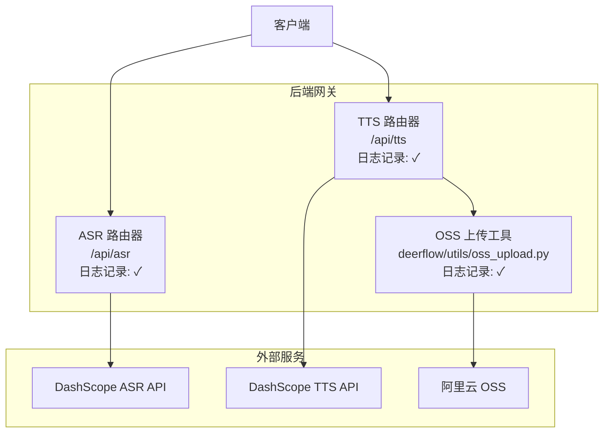
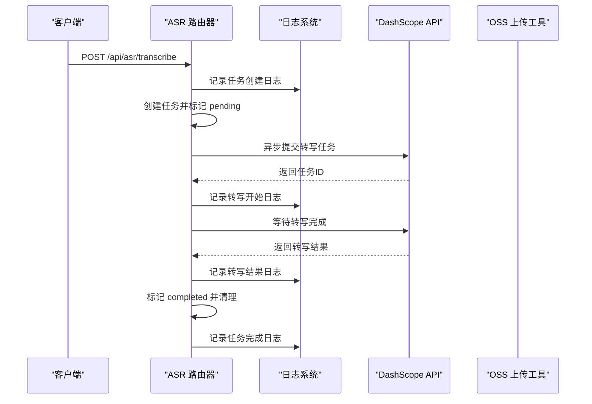
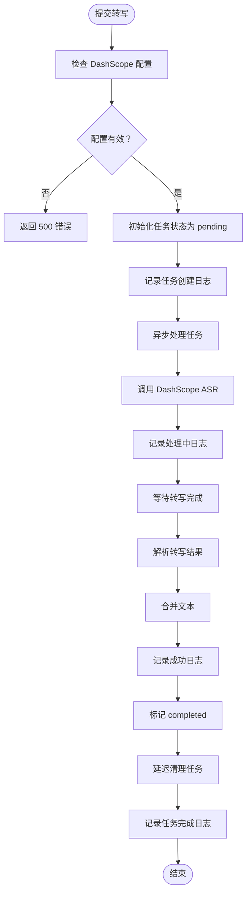
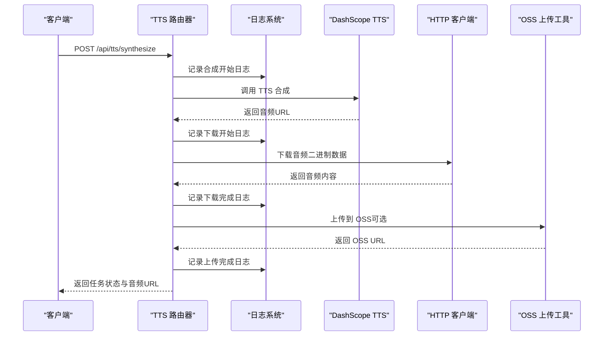
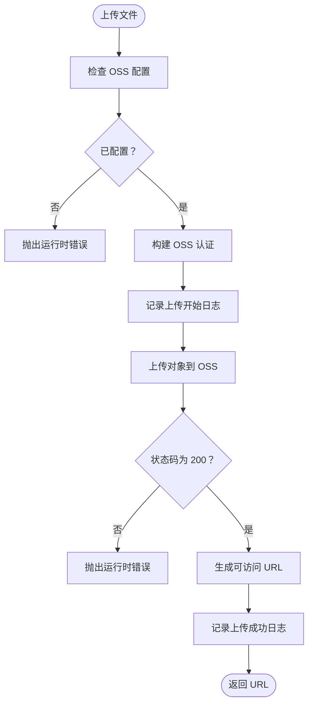
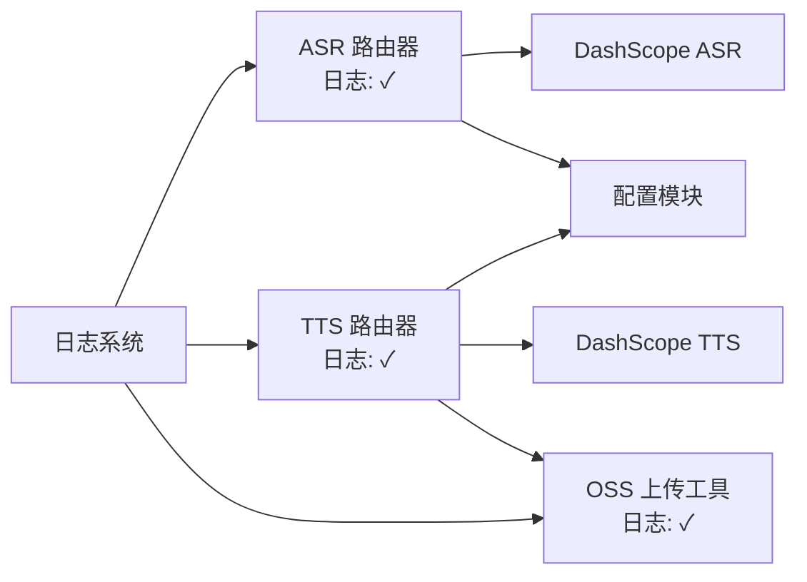

# 语音转文字路由器

<cite>
**本文档引用的文件**
- [asr.py](file://backend/app/gateway/routers/asr.py)
- [tts.py](file://backend/app/gateway/routers/tts.py)
- [oss_upload.py](file://backend/deerflow/utils/oss_upload.py)
- [API.md](file://backend/docs/API.md)
- [CONFIGURATION.md](file://backend/docs/CONFIGURATION.md)
- [config.example.yaml](file://config.example.yaml)
</cite>

## 更新摘要
**变更内容**
- 新增详细的日志记录功能，包括操作跟踪和错误诊断
- 改进的错误处理机制，提供更精确的异常信息
- 增强的响应处理逻辑，支持更复杂的转录结果解析
- 优化的状态管理和清理策略
- 更完善的调试和监控能力

## 目录
1. [简介](#简介)
2. [项目结构](#项目结构)
3. [核心组件](#核心组件)
4. [架构总览](#架构总览)
5. [详细组件分析](#详细组件分析)
6. [日志记录系统](#日志记录系统)
7. [错误处理与监控](#错误处理与监控)
8. [依赖关系分析](#依赖关系分析)
9. [性能考虑](#性能考虑)
10. [故障排除指南](#故障排除指南)
11. [结论](#结论)
12. [附录](#附录)

## 简介
本项目提供一个基于 DashScope 的语音转文字（ASR）与语音合成（TTS）路由器服务，支持通过 REST API 提交音频转写任务与文本合成任务，并提供任务查询接口。系统采用异步处理模型，结合本地内存任务池与可选的 OSS 存储，实现从音频文件到文本或音频文件的完整处理链路。

- **语音识别（ASR）**：提交音频 URL，后台异步调用 DashScope FunASR 完成转写，支持查询任务状态与结果。
- **语音合成（TTS）**：提交文本与语音参数，后台异步调用 DashScope Qwen3-TTS-Flash 生成音频，支持下载或上传到 OSS。
- **多语言支持**：通过语言参数控制识别与合成的语言类型。
- **实时与批量**：API 采用异步任务模型，适合批量处理；前端可通过轮询查询任务状态，实现"准实时"反馈。
- **质量控制**：统一的状态管理（pending/processing/completed/failed）、详细日志记录与清理策略，保障稳定性。

## 项目结构
后端采用 FastAPI 构建网关路由，ASR/TTS 功能分别位于独立的路由模块中，通用的 OSS 上传能力封装在工具模块中。每个模块都集成了完整的日志记录系统，便于监控和故障诊断。



**图表来源**
- [asr.py:15](file://backend/app/gateway/routers/asr.py#L15)
- [tts.py:16](file://backend/app/gateway/routers/tts.py#L16)
- [oss_upload.py:12](file://backend/deerflow/utils/oss_upload.py#L12)

**章节来源**
- [asr.py:1-202](file://backend/app/gateway/routers/asr.py#L1-L202)
- [tts.py:1-185](file://backend/app/gateway/routers/tts.py#L1-L185)
- [oss_upload.py:1-82](file://backend/deerflow/utils/oss_upload.py#L1-L82)

## 核心组件
- **ASR 路由器**：提供提交转写任务与查询结果的接口，内部维护任务池，异步调用 DashScope ASR。现已集成完整的日志记录系统。
- **TTS 路由器**：提供提交合成任务与查询结果的接口，内部维护任务池，异步调用 DashScope TTS，并可选上传到 OSS。具备详细的日志记录能力。
- **OSS 工具**：封装阿里云 OSS 上传逻辑，支持生成唯一文件名与返回可访问 URL。包含完整的错误处理和日志记录。
- **配置系统**：通过 YAML 配置 DashScope 与 OSS 凭据，支持环境变量注入。

**章节来源**
- [asr.py:23-111](file://backend/app/gateway/routers/asr.py#L23-L111)
- [tts.py:24-114](file://backend/app/gateway/routers/tts.py#L24-L114)
- [oss_upload.py:15-82](file://backend/deerflow/utils/oss_upload.py#L15-L82)

## 架构总览
下图展示从客户端到服务端再到外部 API 的整体交互流程，包括新增的日志记录和错误处理机制。



**图表来源**
- [asr.py:47-111](file://backend/app/gateway/routers/asr.py#L47-L111)
- [tts.py:49-114](file://backend/app/gateway/routers/tts.py#L49-L114)
- [oss_upload.py:15-82](file://backend/deerflow/utils/oss_upload.py#L15-L82)

## 详细组件分析

### ASR 组件分析
- **接口设计**
  - 提交转写：POST /api/asr/transcribe，请求包含模型、音频 URL、语言代码；返回任务 ID。
  - 查询结果：GET /api/asr/query/{task_id}，返回任务状态与转写文本。
- **处理流程**
  - 配置校验：检查 DashScope 凭据是否配置。
  - 异步处理：创建任务后立即启动后台协程处理，避免阻塞请求。
  - 结果聚合：从 DashScope 返回的结果中提取文本并合并。
  - 清理策略：任务完成后延迟清理，释放内存。
- **日志记录**
  - 任务生命周期：从创建到完成的完整日志跟踪。
  - 错误诊断：详细的错误信息记录，便于问题排查。
  - 性能监控：关键操作的时间戳和状态变化记录。
- **错误处理**
  - 配置缺失：抛出 500 错误并提示配置项。
  - API 调用失败：捕获异常并标记失败状态，记录详细日志。
  - 数据解析：转录结果的详细解析和错误处理。



**图表来源**
- [asr.py:47-196](file://backend/app/gateway/routers/asr.py#L47-L196)

**章节来源**
- [asr.py:47-196](file://backend/app/gateway/routers/asr.py#L47-L196)

### TTS 组件分析
- **接口设计**
  - 提交合成：POST /api/tts/synthesize，请求包含文本、模型、声音、语言代码；返回任务 ID。
  - 查询结果：GET /api/tts/query/{task_id}，返回任务状态与音频 URL。
- **处理流程**
  - 配置校验：检查 DashScope 凭据是否配置。
  - 合成与下载：调用 DashScope TTS，下载音频二进制数据。
  - OSS 上传：可选将音频上传到 OSS，返回可访问 URL；否则直接使用 DashScope 返回的 URL。
  - 清理策略：任务完成后延迟清理。
- **日志记录**
  - 合成过程：从开始到完成的详细日志跟踪。
  - 下载过程：音频下载的状态和结果记录。
  - OSS 上传：上传过程的详细日志和错误信息。
- **错误处理**
  - 配置缺失：抛出 500 错误并提示配置项。
  - 下载失败：抛出异常并记录错误日志。
  - OSS 未配置：回退到 DashScope 返回的 URL。



**图表来源**
- [tts.py:49-179](file://backend/app/gateway/routers/tts.py#L49-L179)
- [oss_upload.py:15-82](file://backend/deerflow/utils/oss_upload.py#L15-L82)

**章节来源**
- [tts.py:49-179](file://backend/app/gateway/routers/tts.py#L49-L179)
- [oss_upload.py:15-82](file://backend/deerflow/utils/oss_upload.py#L15-L82)

### OSS 上传工具分析
- **功能概述**
  - 封装阿里云 OSS 上传，支持二进制数据或文件对象上传。
  - 自动生成唯一文件名，支持自定义内容类型。
  - 返回可访问的 OSS URL，支持自定义 Bucket Host。
- **日志记录**
  - 配置检查：OSS 配置的有效性和完整性记录。
  - 上传过程：详细的上传状态和进度跟踪。
  - 错误处理：各种异常情况的详细日志记录。
- **错误处理**
  - 未配置 OSS：抛出运行时错误，提示配置项。
  - 请求异常：捕获并记录错误，抛出运行时错误。
  - 状态验证：上传结果的状态检查和日志记录。



**图表来源**
- [oss_upload.py:15-62](file://backend/deerflow/utils/oss_upload.py#L15-L62)

**章节来源**
- [oss_upload.py:15-82](file://backend/deerflow/utils/oss_upload.py#L15-L82)

## 日志记录系统
系统集成了完整的日志记录功能，为每个关键操作提供详细的日志信息：

### 日志记录特性
- **结构化日志**：使用标准 logging 模块，支持不同级别的日志记录
- **操作跟踪**：从任务创建到完成的完整操作轨迹
- **错误诊断**：详细的错误信息和堆栈跟踪
- **性能监控**：关键操作的时间戳和状态变化
- **调试支持**：开发和测试环境下的详细日志输出

### 日志级别和用途
- **INFO**：正常操作和状态变化的记录
- **ERROR**：错误发生时的详细信息记录
- **DEBUG**：开发调试时的详细操作信息
- **WARNING**：潜在问题的警告信息

### 日志记录位置
- **ASR 路由器**：任务创建、处理、完成、错误等关键节点
- **TTS 路由器**：合成开始、下载过程、上传过程、完成状态
- **OSS 工具**：配置检查、上传过程、状态验证、错误处理

**章节来源**
- [asr.py:15](file://backend/app/gateway/routers/asr.py#L15)
- [tts.py:16](file://backend/app/gateway/routers/tts.py#L16)
- [oss_upload.py:12](file://backend/deerflow/utils/oss_upload.py#L12)

## 错误处理与监控
系统采用了多层次的错误处理和监控机制：

### 错误处理策略
- **配置验证**：在操作前验证所有必需的配置参数
- **API 调用保护**：对外部 API 调用进行异常捕获和处理
- **数据解析容错**：对返回的数据进行健壮性检查和错误处理
- **资源清理**：确保异常情况下也能正确清理资源

### 监控和诊断
- **状态跟踪**：实时跟踪任务状态变化
- **性能指标**：记录关键操作的执行时间和成功率
- **错误统计**：统计各类错误的发生频率和类型
- **调试信息**：提供详细的调试信息用于问题排查

### 响应处理逻辑
- **ASR 响应**：详细的转录结果解析和文本提取
- **TTS 响应**：音频 URL 的获取和处理
- **通用响应**：标准化的错误响应格式

**章节来源**
- [asr.py:129-196](file://backend/app/gateway/routers/asr.py#L129-L196)
- [tts.py:132-179](file://backend/app/gateway/routers/tts.py#L132-L179)

## 依赖关系分析
- **组件耦合**
  - ASR/TTS 路由器与 DashScope API 强耦合，通过配置模块注入凭据。
  - TTS 路由器依赖 OSS 工具进行文件上传。
  - 任务池为内存态，建议替换为持久化存储以提升可靠性。
- **外部依赖**
  - DashScope ASR/TTS：识别与合成的核心能力。
  - 阿里云 OSS：可选的音频存储后端。
- **循环依赖**
  - 当前模块间无循环导入，结构清晰。
- **日志系统依赖**
  - 所有组件都依赖标准 logging 模块进行日志记录。



**图表来源**
- [asr.py:58-68](file://backend/app/gateway/routers/asr.py#L58-L68)
- [tts.py:60-70](file://backend/app/gateway/routers/tts.py#L60-L70)
- [oss_upload.py:34-44](file://backend/deerflow/utils/oss_upload.py#L34-L44)

**章节来源**
- [asr.py:58-68](file://backend/app/gateway/routers/asr.py#L58-L68)
- [tts.py:60-70](file://backend/app/gateway/routers/tts.py#L60-L70)
- [oss_upload.py:34-44](file://backend/deerflow/utils/oss_upload.py#L34-L44)

## 性能考虑
- **异步处理**
  - 采用 asyncio.create_task 在后台处理任务，避免阻塞主线程，提高吞吐量。
- **任务清理**
  - 任务完成后延迟清理，减少频繁内存分配与 GC 压力。
- **存储策略**
  - TTS 合成的音频建议上传到 OSS，降低本地存储与带宽压力。
- **并发与限流**
  - 建议在网关层（如 Nginx）配置限流，防止突发流量导致外部 API 超额。
- **配置优先**
  - 使用环境变量注入密钥，避免硬编码；合理设置请求超时与重试次数。
- **日志性能**
  - 日志记录不会影响主要业务逻辑，但建议在生产环境中调整日志级别以平衡性能。

## 故障排除指南
- **配置问题**
  - DashScope 未配置：检查配置文件中的 DashScope 凭据字段，确保环境变量正确注入。
  - OSS 未配置：若启用 OSS 上传，需配置 OSS Endpoint、Access Key、Secret、Bucket Name 与 Host。
- **任务查询**
  - 任务不存在：查询接口返回 404，确认 task_id 是否正确。
  - 任务失败：查看服务端日志，定位异常原因（网络、权限、参数等）。
- **API 使用**
  - 参考 API 文档中的请求/响应示例，确保 Content-Type 与参数格式正确。
- **日志分析**
  - 查看 INFO 级别日志了解正常操作流程。
  - 查看 ERROR 级别日志定位具体错误原因。
  - 在调试模式下查看 DEBUG 级别日志获取详细信息。
- **环境与部署**
  - 生产环境建议开启 Nginx 基础认证或 OAuth，限制访问来源。

**章节来源**
- [asr.py:60-64](file://backend/app/gateway/routers/asr.py#L60-L64)
- [tts.py:62-66](file://backend/app/gateway/routers/tts.py#L62-L66)
- [oss_upload.py:36-40](file://backend/deerflow/utils/oss_upload.py#L36-L40)
- [API.md:524-547](file://backend/docs/API.md#L524-L547)

## 结论
本语音转文字路由器通过简洁的 REST API 与异步任务模型，实现了从音频到文本与从文本到音频的完整链路。最新的更新引入了完整的日志记录系统、改进的错误处理机制和更详细的响应处理逻辑，大大提升了系统的可观测性和可靠性。

建议在生产环境中：
- 使用持久化存储替代内存任务池；
- 配置 OSS 作为音频存储后端；
- 在网关层实施限流与鉴权；
- 通过配置文件与环境变量统一管理密钥与参数；
- 合理配置日志级别以平衡性能和可观测性；
- 利用详细的日志信息进行监控和故障诊断。

## 附录

### API 使用指南（要点）
- **ASR**
  - 提交转写：POST /api/asr/transcribe，请求体包含模型、音频 URL、语言代码；返回任务 ID。
  - 查询结果：GET /api/asr/query/{task_id}，轮询获取状态与文本。
- **TTS**
  - 提交合成：POST /api/tts/synthesize，请求体包含文本、模型、声音、语言代码；返回任务 ID。
  - 查询结果：GET /api/tts/query/{task_id}，获取音频 URL。
- **参考示例与错误格式请参阅 API 文档。

**章节来源**
- [API.md:1-656](file://backend/docs/API.md#L1-L656)

### 配置指南（要点）
- **DashScope**
  - 在配置文件中设置 API Key 与基础 URL，或通过环境变量注入。
- **OSS**
  - 配置 Endpoint、Access Key、Secret、Bucket Name、Bucket Host（可选）。
- **环境变量**
  - 使用 $VAR 形式引用环境变量，避免硬编码敏感信息。
- **日志配置**
  - 通过 log_level 控制日志详细程度，支持 trace、debug、info、warning、error、critical 等级别。

**章节来源**
- [CONFIGURATION.md:318-330](file://backend/docs/CONFIGURATION.md#L318-L330)
- [config.example.yaml:1-348](file://config.example.yaml#L1-L348)

### 日志配置示例
```yaml
# 日志级别配置
log_level: info

# 在 config.yaml 中配置
log_level: debug  # 开发环境
log_level: warning  # 生产环境
```

**章节来源**
- [config.example.yaml:7-8](file://config.example.yaml#L7-L8)