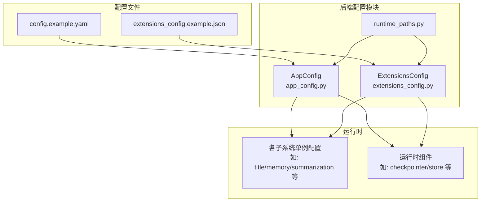
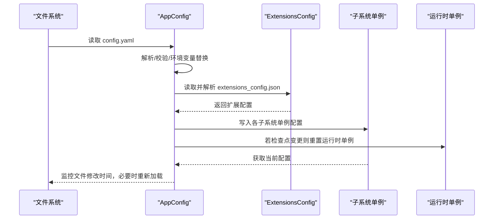
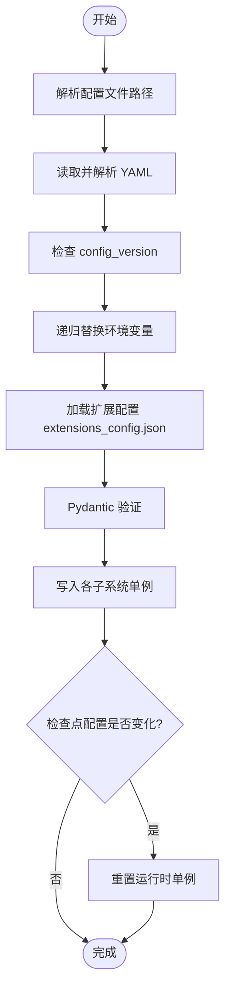
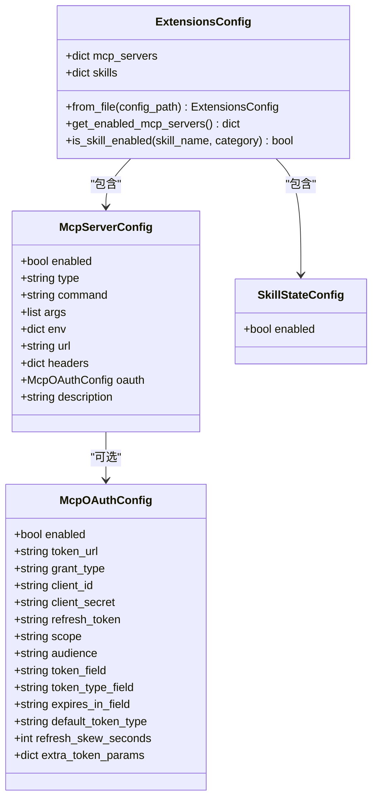
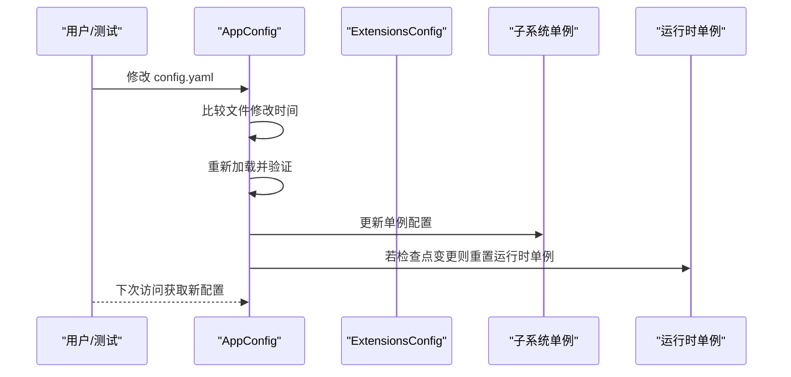
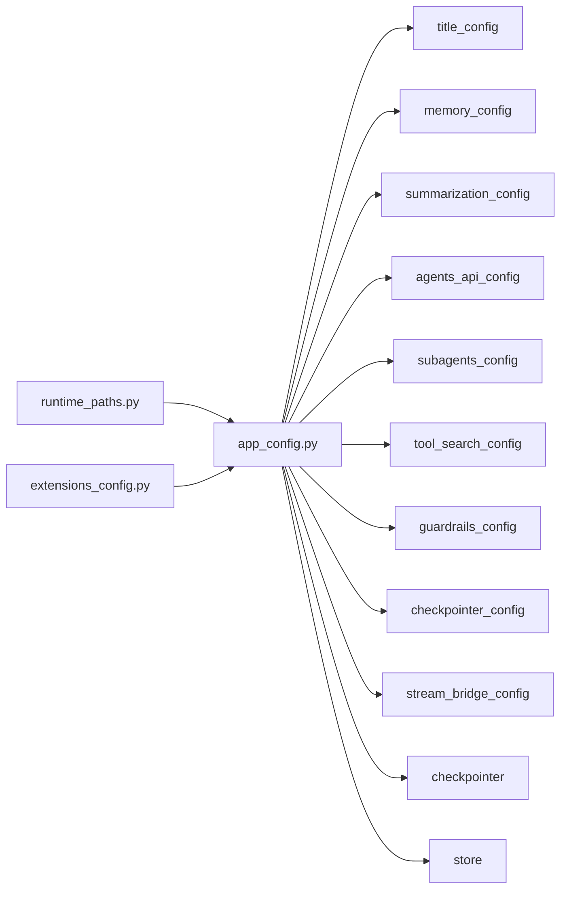

# 配置共享机制

<cite>
**本文档引用的文件**
- [config.example.yaml](file://config.example.yaml)
- [extensions_config.example.json](file://extensions_config.example.json)
- [app_config.py](file://backend/packages/harness/deerflow/config/app_config.py)
- [extensions_config.py](file://backend/packages/harness/deerflow/config/extensions_config.py)
- [runtime_paths.py](file://backend/packages/harness/deerflow/config/runtime_paths.py)
- [CONFIGURATION.md](file://backend/docs/CONFIGURATION.md)
- [test_app_config_reload.py](file://backend/tests/test_app_config_reload.py)
- [test_config_version.py](file://backend/tests/test_config_version.py)
- [config-upgrade.sh](file://scripts/config-upgrade.sh)
- [hooks.ts](file://frontend/src/core/mcp/hooks.ts)
</cite>

## 目录
1. [简介](#简介)
2. [项目结构](#项目结构)
3. [核心组件](#核心组件)
4. [架构总览](#架构总览)
5. [详细组件分析](#详细组件分析)
6. [依赖关系分析](#依赖关系分析)
7. [性能考虑](#性能考虑)
8. [故障排除指南](#故障排除指南)
9. [结论](#结论)
10. [附录](#附录)

## 简介
本文件系统性阐述 DeerFlow 的配置共享机制，重点覆盖以下方面：
- 设计理念：集中式配置与单例化运行时配置的分离；通过环境变量与文件优先级实现灵活部署；支持动态加载与热重载。
- 配置文件结构与作用：config.yaml（应用主配置）与 extensions_config.json（扩展与 MCP 配置）的字段、默认值与优先级。
- 配置在组件间的传递：从磁盘加载到 Pydantic 模型，再到各子系统的单例配置，最终在运行时生效。
- 动态加载与热重载：基于文件修改时间检测的自动重载，以及针对检查点与存储等运行时单例的重置策略。
- 版本兼容与迁移：基于 config_version 的版本检查与升级脚本。
- 最佳实践与故障排除：配置放置位置、环境变量使用、常见问题定位。

## 项目结构
配置相关的核心文件分布如下：
- 后端配置核心：backend/packages/harness/deerflow/config/
  - app_config.py：应用主配置加载、验证、单例缓存与热重载
  - extensions_config.py：扩展配置（MCP 服务器与技能状态）加载与单例缓存
  - runtime_paths.py：项目根、运行时家目录与相对路径解析
- 示例配置：config.example.yaml、extensions_config.example.json
- 文档：backend/docs/CONFIGURATION.md
- 测试：backend/tests/test_app_config_reload.py、backend/tests/test_config_version.py
- 升级脚本：scripts/config-upgrade.sh
- 前端集成：frontend/src/core/mcp/hooks.ts（展示前端如何读取/更新 MCP 配置）

图表来源
- [app_config.py:91-467](file://backend/packages/harness/deerflow/config/app_config.py#L91-L467)
- [extensions_config.py:57-264](file://backend/packages/harness/deerflow/config/extensions_config.py#L57-L264)
- [runtime_paths.py:1-42](file://backend/packages/harness/deerflow/config/runtime_paths.py#L1-L42)

章节来源
- [app_config.py:122-185](file://backend/packages/harness/deerflow/config/app_config.py#L122-L185)
- [extensions_config.py:71-150](file://backend/packages/harness/deerflow/config/extensions_config.py#L71-L150)
- [runtime_paths.py:7-42](file://backend/packages/harness/deerflow/config/runtime_paths.py#L7-L42)

## 核心组件
- AppConfig：应用主配置的统一入口，负责：
  - 配置文件解析与验证（含 config_version 检查）
  - 环境变量替换
  - 扩展配置合并（extensions_config.json）
  - 将各子系统配置写入对应的单例缓存
  - 动态重载与运行时单例重置
- ExtensionsConfig：扩展配置入口，负责：
  - MCP 服务器与技能状态的加载与验证
  - 环境变量替换
  - 单例缓存与重载
- runtime_paths：路径解析工具，确保在不同工作目录下正确找到配置文件与运行时目录

章节来源
- [app_config.py:91-467](file://backend/packages/harness/deerflow/config/app_config.py#L91-L467)
- [extensions_config.py:57-264](file://backend/packages/harness/deerflow/config/extensions_config.py#L57-L264)
- [runtime_paths.py:7-42](file://backend/packages/harness/deerflow/config/runtime_paths.py#L7-L42)

## 架构总览
配置从磁盘到运行时的流转路径如下：

图表来源
- [app_config.py:152-185](file://backend/packages/harness/deerflow/config/app_config.py#L152-L185)
- [extensions_config.py:124-149](file://backend/packages/harness/deerflow/config/extensions_config.py#L124-L149)
- [test_app_config_reload.py:143-166](file://backend/tests/test_app_config_reload.py#L143-L166)

## 详细组件分析

### AppConfig：应用主配置
- 配置文件解析与优先级
  - 支持通过函数参数、环境变量 DEER_FLOW_CONFIG_PATH、项目根目录下的 config.yaml、以及历史兼容位置解析
- 环境变量替换
  - 字符串值以 $ 开头时，使用 os.getenv 替换；未解析到的占位符会被替换为空字符串，避免下游收到原始占位符
- 版本检查与升级提示
  - 读取 config_version 并与示例文件对比，低于示例版本时发出警告，并建议使用升级脚本
- 扩展配置合并
  - 从 extensions_config.json 加载扩展配置，并将其作为 AppConfig 的一部分进行验证与应用
- 子系统单例应用
  - 将 title、summarization、memory、agents_api、subagents、tool_search、guardrails、checkpointer、stream_bridge、ACP agents 等配置写入对应单例缓存
  - 当检查点配置发生变化时，重置运行时单例（如 checkpointer、store）
- 动态重载与热重载
  - 缓存上次解析的配置路径与修改时间；若路径或修改时间变化，则重新加载
  - 提供 reload_app_config 与 reset_app_config 接口

图表来源
- [app_config.py:152-221](file://backend/packages/harness/deerflow/config/app_config.py#L152-L221)
- [app_config.py:280-302](file://backend/packages/harness/deerflow/config/app_config.py#L280-L302)
- [app_config.py:357-414](file://backend/packages/harness/deerflow/config/app_config.py#L357-L414)

章节来源
- [app_config.py:122-185](file://backend/packages/harness/deerflow/config/app_config.py#L122-L185)
- [app_config.py:234-278](file://backend/packages/harness/deerflow/config/app_config.py#L234-L278)
- [app_config.py:357-467](file://backend/packages/harness/deerflow/config/app_config.py#L357-L467)
- [test_app_config_reload.py:143-166](file://backend/tests/test_app_config_reload.py#L143-L166)

### ExtensionsConfig：扩展与 MCP 配置
- 配置文件解析与优先级
  - 支持通过函数参数、环境变量 DEER_FLOW_EXTENSIONS_CONFIG_PATH、项目根目录下的 extensions_config.json 或 mcp_config.json、以及历史兼容位置解析
- 环境变量替换
  - 递归替换 JSON 中的字符串值；未解析到的占位符替换为空字符串
- 结构组成
  - mcp_servers：MCP 服务器映射（名称 -> 配置）
  - skills：技能状态映射（名称 -> 状态）
- 技能启用策略
  - 若未显式配置某技能，则根据技能类别决定默认启用状态（公共与自定义技能默认启用）

图表来源
- [extensions_config.py:57-205](file://backend/packages/harness/deerflow/config/extensions_config.py#L57-L205)

章节来源
- [extensions_config.py:71-150](file://backend/packages/harness/deerflow/config/extensions_config.py#L71-L150)
- [extensions_config.py:151-181](file://backend/packages/harness/deerflow/config/extensions_config.py#L151-L181)
- [extensions_config.py:182-205](file://backend/packages/harness/deerflow/config/extensions_config.py#L182-L205)

### 配置文件详解与优先级

#### config.yaml 关键字段与默认值
- config_version：配置版本号，默认示例版本为 8
- log_level：日志级别，默认 info
- models：模型列表，第一个为默认模型；字段包括 name、display_name、use、model、api_key、base_url、request_timeout、max_retries、max_tokens、temperature、supports_vision、supports_thinking、supports_reasoning_effort、tool_calling 等
- tool_groups：工具组列表，如 web、file:read、file:write、bash
- tools：具体工具配置，如 ls、read_file、write_file、str_replace、bash、knowledge_search、tencent_ima
- tool_search：工具搜索推荐开关
- sandbox：沙箱配置，use、allow_host_bash、bash_output_max_chars、read_file_output_max_chars、ls_output_max_chars
- skills：Skills 容器路径 container_path
- title：标题生成开关、最大词数、最大字符数、模型名
- summarization：摘要开关、模型名、触发条件（tokens/messages）、保留策略、摘要提示词、最近技能调用保留数与 Token 上限、技能文件读取工具名列表
- agents_api：Agents API 开关
- uploads：文件上传限制与 PDF 转换器
- memory：记忆功能开关、存储路径、防抖时间、模型名、最大事实数、置信度阈值、是否注入到系统提示、最大注入 Token 数
- skill_evolution：Skill 自进化开关与审核模型
- database：数据库后端与 SQLite 目录；Roleplay MySQL 配置
- run_events：运行事件存储后端、最大追踪内容长度、是否追踪 Token 使用
- subagents：子 Agent 超时与自定义 Agent 描述、系统提示、工具、技能、模型、最大轮次、超时
- 其他：circuit_breaker（熔断器）、loop_detection（环路检测）、timezone（时区）、dashscope（ASR/TTS）、oss（对象存储）、stream_bridge（流桥接）

章节来源
- [config.example.yaml:1-348](file://config.example.yaml#L1-L348)
- [CONFIGURATION.md:1-377](file://backend/docs/CONFIGURATION.md#L1-L377)

#### extensions_config.json 关键字段与默认值
- mcpInterceptors：MCP 拦截器列表
- mcpServers：MCP 服务器映射
  - enabled：是否启用
  - type：传输类型（stdio、sse、http）
  - command/args/env：stdio 类型启动参数
  - url/headers/oauth：sse/http 类型远程地址与认证
  - description：描述
- skills：技能状态映射（名称 -> enabled）

章节来源
- [extensions_config.example.json:1-45](file://extensions_config.example.json#L1-L45)

#### 配置优先级规则
- 配置文件解析优先级（AppConfig）
  1) 函数参数指定路径
  2) 环境变量 DEER_FLOW_CONFIG_PATH
  3) 项目根目录下的 config.yaml（或当前工作目录，受 DEER_FLOW_PROJECT_ROOT 影响）
  4) 历史兼容位置（后端/仓库根）
- 扩展配置解析优先级（ExtensionsConfig）
  1) 函数参数指定路径
  2) 环境变量 DEER_FLOW_EXTENSIONS_CONFIG_PATH
  3) 项目根目录下的 extensions_config.json 或 mcp_config.json
  4) 历史兼容位置（后端/仓库根）
- 环境变量替换
  - 仅对字符串值有效，以 $ 开头的变量名通过 os.getenv 解析；未解析到的占位符替换为空字符串

章节来源
- [app_config.py:122-150](file://backend/packages/harness/deerflow/config/app_config.py#L122-L150)
- [extensions_config.py:71-123](file://backend/packages/harness/deerflow/config/extensions_config.py#L71-L123)
- [app_config.py:280-302](file://backend/packages/harness/deerflow/config/app_config.py#L280-L302)
- [extensions_config.py:151-180](file://backend/packages/harness/deerflow/config/extensions_config.py#L151-L180)

### 动态加载与热重载实现
- 文件监控与重载
  - 缓存配置文件路径与修改时间；每次访问时比较当前修改时间，若变化则重新加载
  - 支持在运行时切换 DEER_FLOW_CONFIG_PATH 或 DEER_FLOW_EXTENSIONS_CONFIG_PATH，从而切换配置源
- 单例配置更新
  - 将子系统配置写入全局单例缓存；当配置移除或禁用时，相应单例被重置为默认状态
- 检查点与存储重置
  - 当 checkpointer 配置发生变更时，重置运行时单例（如 checkpointer、store），确保持久化行为一致

图表来源
- [app_config.py:357-414](file://backend/packages/harness/deerflow/config/app_config.py#L357-L414)
- [test_app_config_reload.py:143-166](file://backend/tests/test_app_config_reload.py#L143-L166)

章节来源
- [app_config.py:357-467](file://backend/packages/harness/deerflow/config/app_config.py#L357-L467)
- [test_app_config_reload.py:143-166](file://backend/tests/test_app_config_reload.py#L143-L166)

### 版本兼容性处理
- 版本检查
  - 读取用户 config.yaml 的 config_version 与示例文件对比，低于示例版本时发出警告
- 升级脚本
  - 提供脚本自动合并缺失字段，保留用户现有配置并生成备份
- 测试保障
  - 单元测试覆盖版本缺失、匹配、过期、字符串版本号等边界情况

章节来源
- [app_config.py:234-278](file://backend/packages/harness/deerflow/config/app_config.py#L234-L278)
- [test_config_version.py:35-125](file://backend/tests/test_config_version.py#L35-L125)
- [config-upgrade.sh:46-76](file://scripts/config-upgrade.sh#L46-L76)

### 前端集成与 MCP 配置交互
- 前端通过查询与变更钩子读取/更新 MCP 配置，体现配置在前端的可见性与可操作性
- 与后端 ExtensionsConfig 的 mcp_servers 字段一一对应

章节来源
- [hooks.ts:1-44](file://frontend/src/core/mcp/hooks.ts#L1-L44)

## 依赖关系分析
- 配置加载依赖
  - AppConfig 依赖 runtime_paths 解析项目根与配置路径
  - AppConfig 依赖 ExtensionsConfig 读取扩展配置
  - 各子系统单例配置（如 title、memory、summarization 等）在 AppConfig._apply_singleton_configs 中被写入
- 运行时依赖
  - 检查点配置变更会触发运行时单例（checkpointer、store）的重置，保证一致性

图表来源
- [app_config.py:196-221](file://backend/packages/harness/deerflow/config/app_config.py#L196-L221)
- [runtime_paths.py:7-42](file://backend/packages/harness/deerflow/config/runtime_paths.py#L7-L42)

章节来源
- [app_config.py:196-221](file://backend/packages/harness/deerflow/config/app_config.py#L196-L221)

## 性能考虑
- 文件监控成本低：仅在访问配置时比较文件修改时间，避免持续轮询
- 单例缓存减少重复解析：子系统配置一次性写入全局缓存，后续访问无需重复加载
- 环境变量替换为递归遍历：对大型配置影响有限，但应避免过多深层嵌套
- 扩展配置可选：extensions_config.json 不存在时返回空配置，不影响主配置加载

## 故障排除指南
- “找不到配置文件”
  - 确认 config.yaml 位于项目根目录（deer-flow/config.yaml）
  - 若运行时不在项目根，设置 DEER_FLOW_PROJECT_ROOT
  - 或设置 DEER_FLOW_CONFIG_PATH 指向具体文件
- “无效的 API 密钥”
  - 检查环境变量是否正确设置
  - 确保 config.yaml 中以 $ 前缀引用
- “Skills 未加载”
  - 检查 deer-flow/skills/ 目录是否存在
  - 确认技能具备有效的 SKILL.md
  - 如使用自定义路径，检查 skills.path 或 DEER_FLOW_SKILLS_PATH
- “Docker 沙箱无法启动”
  - 确认 Docker 已运行
  - 检查端口占用（默认 8080）
  - 确认镜像可用
- “配置未生效或未热重载”
  - 确认修改了 config.yaml 或 extensions_config.json
  - 确认未固定在测试中使用 set_app_config/set_extensions_config 注入的自定义配置
  - 查看日志中关于“Config file has been modified”提示
- “版本过期警告”
  - 运行升级脚本合并新字段，保留现有配置并生成备份

章节来源
- [CONFIGURATION.md:353-377](file://backend/docs/CONFIGURATION.md#L353-L377)
- [test_app_config_reload.py:143-166](file://backend/tests/test_app_config_reload.py#L143-L166)

## 结论
DeerFlow 的配置共享机制通过集中式配置与单例化运行时配置的分离，实现了高灵活性与强一致性。AppConfig 与 ExtensionsConfig 分别负责主配置与扩展配置的加载、验证与应用，结合环境变量替换、版本检查与热重载能力，满足开发与生产的多样化需求。遵循本文档的最佳实践与故障排除指南，可显著提升配置管理的可靠性与可维护性。

## 附录
- 配置示例参考
  - config.example.yaml：完整字段与注释
  - extensions_config.example.json：MCP 服务器与技能状态示例
- 相关文档
  - CONFIGURATION.md：配置指南与最佳实践